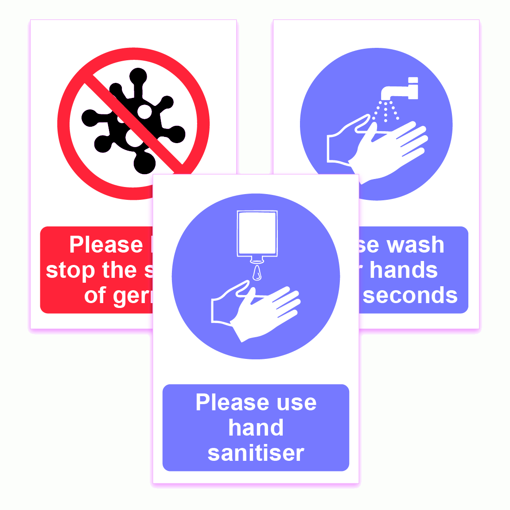

### Lezione 1 
# Introduzione
## &nbsp;

---
## Informazioni generali

- **Chi?**
    - Alessia Visconti alessia.visconti@unito.it

- **Cosa?**
    - 16h di lezione (circa)
    - 8h di laboratorio (circa)

- **Dove?**
    - Aula 9

- **Quando?**
    - Ogni lunedi' mattina (4h)

- **Cosa (portare a lezione)?**
    - calcolatrice
    - fogli (da consegnare)    
    - laptop (per il laboratorio)

- **Com'e' (l'esame)?**
    - quiz a risposta chiusa (1h)
    - con formulario e calcolatrice

<!-- Pesante in lunedi', interrompero' con esercizi -->

---
## Come fare domande/commenti

<!--  -->

<!--  -->

- Alzando la mano durante la lezione
- All'inizio/fine della lezione e nelle pause
- Prendendo appuntamento via email (alessia.visconti@unito.it)
- (Sperimentale) via note anonime

---
## Cosa pensate di conoscere?

- Scrivete tutto quello che vi viene in mente quando dico "statistica"

<!-- Vorrei che queste lezioni siano il meno noioso possibile, quindi mi serve capire cosa gia' sapete e cosa vorreste imparare.  
Inoltre, quando apprendiamo, lo facciamo andando a connettere i nuovi concetti con quelli che conosciamo gia'.
Quindi e' importante che i concetti che conosciamo siano corretti -->

<button id="countdown_queston_1"></button>

---
## Perche' siamo qui?

<button id="countdown_queston_2"></button>

---
## Comprereste questo colluttorio?

---
## Cosa ci dice questo grafico?

 Jensen, C.M., et al, Time Trends Over 16 Years in Incidence-Rates of Autism Spectrum Disorders Across the Lifespan Based on Nationwide Danish Register Data. J Autism Dev Disord (2014). doi:10.1007/s10803-014-2053-6

---
## Siamo d'accordo?

---
## Come prosegue questo grafico?

---
## Cosa ci dice questo grafico?

---
## Educazione civica, 1935 (ca)

---
## Correlation is not causation

 
Sies, H. A new parameter for sex education. Nature 332, 495 (1988). doi:10.1038/332495a0

---
## Correlation is not causation

---
## Perche' siamo qui?

 

- perché i "numeri" (o meglio, il modo in cui sono presentati) a volte ingannano!

---
## Chi e' questa persona?

---
## Florence Nightingale

 

<!-- Florence Nightingale era un'infermiera britannica che e' considerata la madre dell'infermieristica come la intendiamo oggi, un titolo che si e' guadagnato durante la guerra di Crimea, quando era sovrintendente di un ospedale di Instambul. 

Appena arrivata ad Instabul, Florence, si accorge subito delle pessime condizioni di sovraffollameto e pulizia, ma oltre a cercare di mettere una pezza, pulendo e disinfettando tutto con le sue infermiere, si mette anche a raccogliere dati, soprattutto sulle cause di morte dei soldati. -->

---
## Florence Nightingale

<!-- E questi dati non solo li raccoglie, ma li riassume e presenta anche sotto forma di polar diagram, che spedisce regolarmente al governo britannico. 

Come si legge il grafico. Blu = malattie infettive, Rosso = ferite riportate in battaglia, nero = altre cause

E cosa concludiamo? 
Che migliorare le condizioni igenice (pulizia, luce, ventilazione, ...) degli ospedali, aumenta le possibilita' di salvare il paziente. 

E se questo e' ovvio oggi, lo dobbiamo alla sua abilita' nel raccogliere e presentare i dati, e nel prendere delle decisioni basate su di essi. Insomma, grazie alla statistica. -->

---
## Perche' siamo qui?

 

- perché i "numeri" (o meglio, il modo in cui sono presentati) a volte ingannano!
- perche' i "numeri" (e il modo in cui sono presentati) possono fare la differenza

---
## Perche' siamo qui?

- per imparare a leggere, comprendere e analizzare criticamente documenti scientifici o divulgativi
- per essere in grado di effettuare ricerche che comportino l’acquisizione, l’elaborazione e l’analisi di dati

---
## Cos'e' la statistica?

* La raccolta, organizzazione, sintesi, e analisi dei dati   &nbsp;&nbsp;&nbsp; &rarr; statistica *Descrittiva* 

* Processo mediante il quale vengono effettuate deduzioni su
grandi gruppi sulla base di dati raccolti in gruppi piu' ristretti    &nbsp;&nbsp;&nbsp; &rarr; statistica *Inferenziale* 

<!-- - Individuare in maniera efficiente i tratti importanti delle informazioni che sono state raccolte

- Partire dal particolare per capire come le informazioni si possono estendere alla totalità -->

---
## Cosa vorreste imparare?

- Scrivete almeno 3 argomenti che vorreste imparare e/o approfondire

<button id="countdown_queston_3"></button>

---

## Perche' siamo qui?

> *Se mi rimanesse una sola ora di vita vorrei trascorrerla assistendo ad una lezione di statistica perchè mi sembrerebbe durare per sempre*

(un&#601; Student&#601;)

