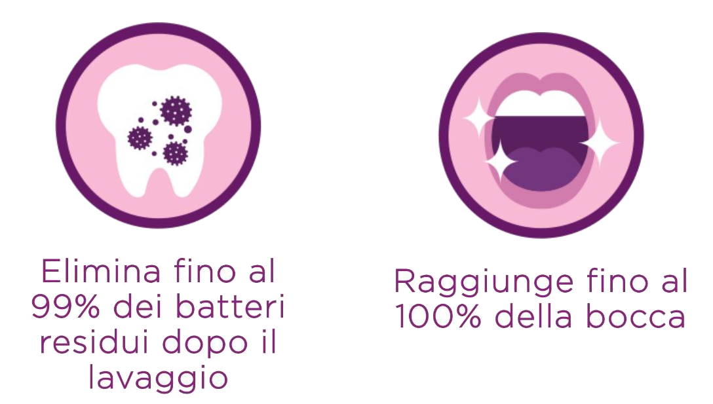
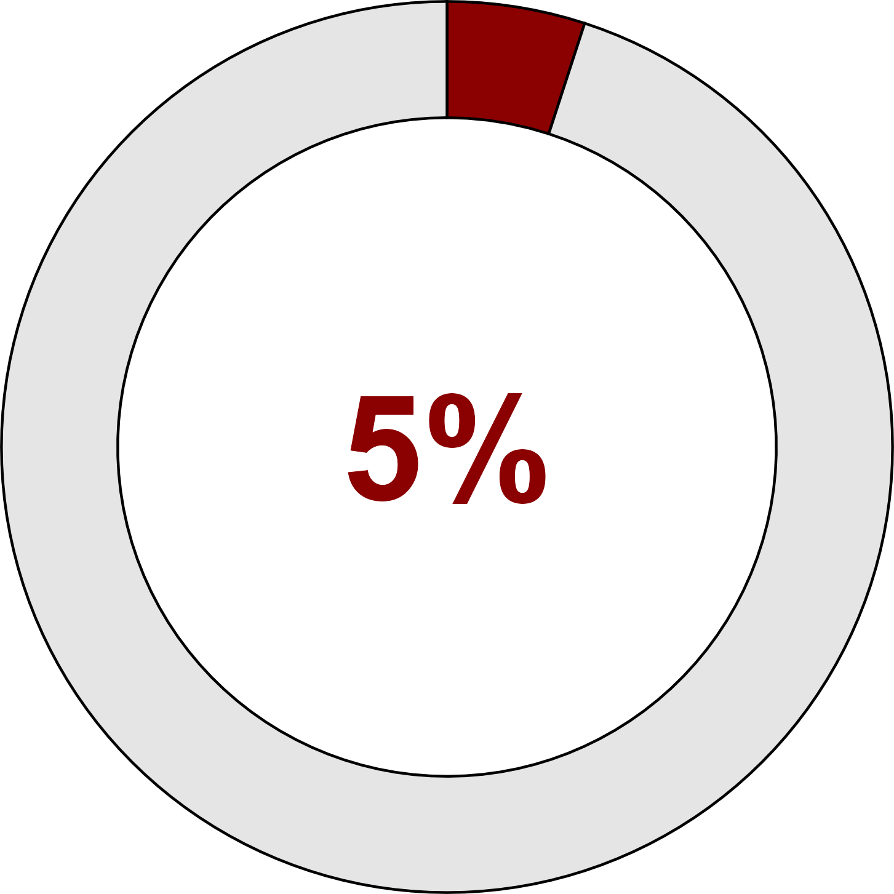
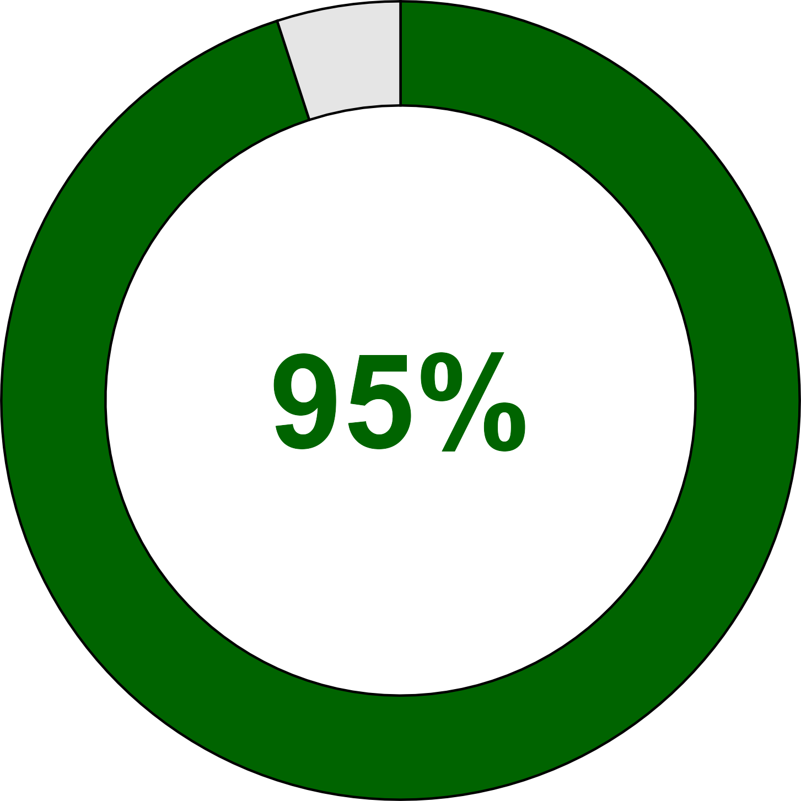
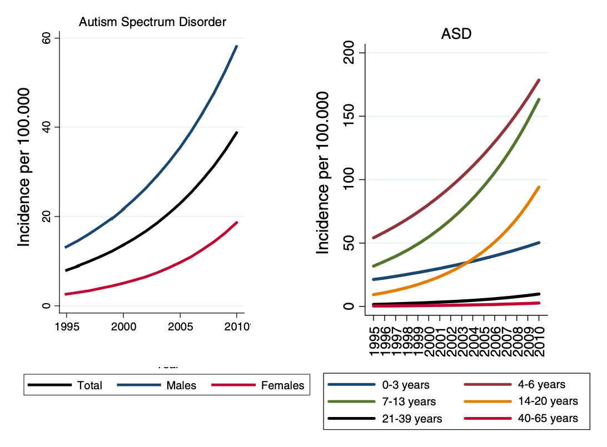
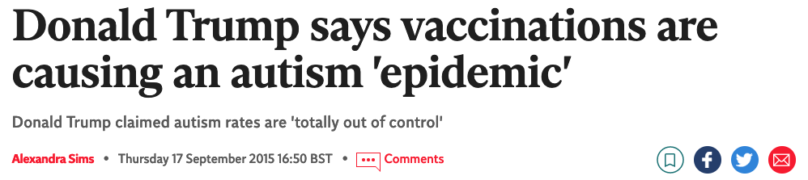
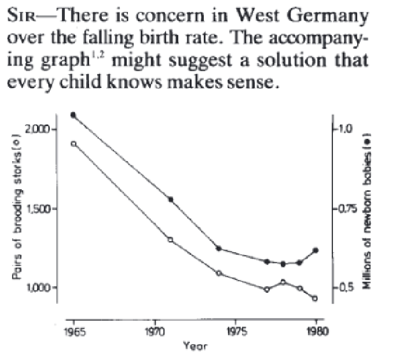
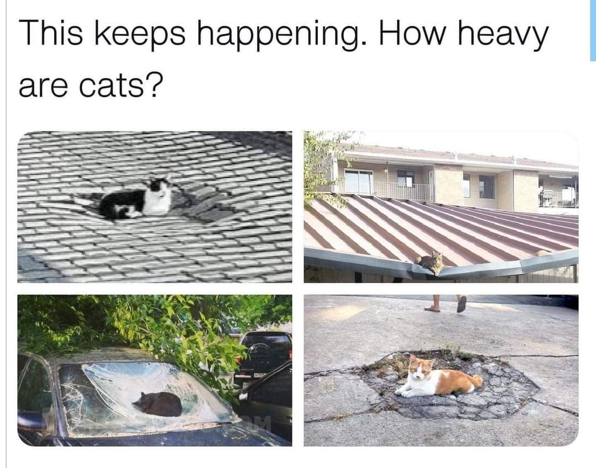
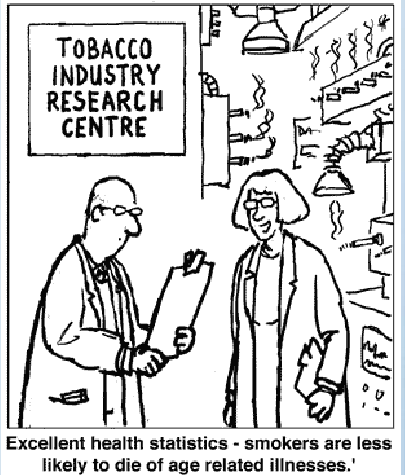
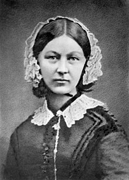
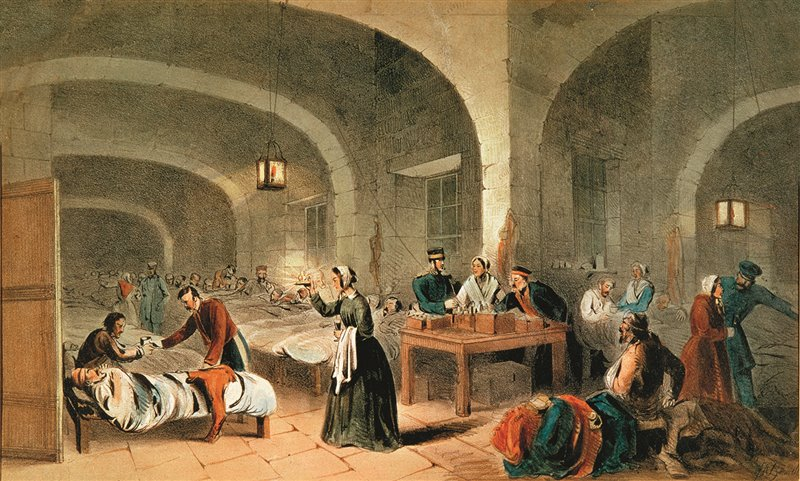

### Lezione 1 
# Introduzione
## &nbsp;

---
## Informazioni generali

- **Chi?**
    - Alessia Visconti alessia.visconti@unito.it

- **Cosa?**
    - 16h di lezione (circa)
    - 8h di laboratorio (circa)

- **Dove?**
    - Aula 9

- **Quando?**
    - Ogni lunedi' mattina (4h)

- **Cosa (portare a lezione)?**
    - calcolatrice
    - fogli (da consegnare)    
    - laptop (per il laboratorio)

- **Com'e' (l'esame)?**
    - quiz a risposta chiusa (1h)
    - con formulario e calcolatrice

<!-- Pesante in lunedi', interrompero' con esercizi, cosi' pesante che chiedo a tutti uno sforzo per farcela passare -->

---
## Un po' di interazione, per favore :pray:

- Alzando la mano durante la lezione
- All'inizio/fine della lezione e nelle pause
- Prendendo appuntamento via email (alessia.visconti@unito.it)
- (Sperimentale) via note anonime

---
## Perche' siamo qui?

 Think: &nbsp;&nbsp;&nbsp; <button id="countdown_think"></button>

---
## Perche' siamo qui?

 Pair: &nbsp;&nbsp;&nbsp; <button id="countdown_pair"></button>

---
## Perche' siamo qui?

 Share: &nbsp;&nbsp;&nbsp; <button id="countdown_share"></button>

---
## Comprereste questo colluttorio?

---
## Ma quanti sono il 99.99% dei batteri?

---
## Vi sottoporrested a un trattamento con...

  ...una probabilita' di insuccesso del 5%?

---
## Vi sottoporrested a un trattamento con...

  ...una probabilita' di successo del 95%?

---
## Vi sottoporrested a un trattamento con...

  &nbsp; 

<!-- Positive or negative framing of proportions can change their emotional impact.  -->

---
## Cosa ci dice questo grafico?

 Jensen, C.M., *et al*, *Time Trends Over 16 Years in Incidence-Rates of Autism Spectrum Disorders Across the Lifespan Based on Nationwide Danish Register Data*. J Autism Dev Disord (2014). doi:10.1007/s10803-014-2053-6

---
## Siamo d'accordo?

<!-- Better diagnostic practices may explain these large hikes in incidence, says Maureen Durkin, professor of population health sciences and pediatrics at the University of Wisconsin in Madison.

“There’s much more awareness of autism,” say Durkin, who was not involved in the study. “There’s much more screening going on. And the newer generation of clinicians are being trained in this so they are more likely to see it.”

This increased attention to autism and its symptoms may also explain the rise in diagnoses of teenagers and adults.

“If the incidence [in adults] is increasing, it just has to do with recognition of cases that have been missed up to that age,” Fombonne says. “It cannot be that you develop autism at age 50.”
 -->

---
## Come prosegue questo grafico?

---
## Cosa ci dice questo grafico?

---
## Educazione civica, 1935 (ca.)

---
## Cicogne e bambini

  Sies, H., *A new parameter for sex education*. Nature, 1988, doi:10.1038/332495a0

<!-- Correlation is not causation, Correlazione non e' causalita', "dopo di" non significa "a causa di". 

La maggioranza delle malattie che secondo alcuni (profani) sarebbero sorte "a causa del vaccino" iniziano a manifestarsi (o sono diagnosticate) proprio nell'età in cui ci si vaccina. Come sappiamo la vaccinazione si fa nella primissima infanzia, proprio per proteggere questa fascia della popolazione (tra le più deboli) dalle malattie infettive. La correlazione principe di cui si è parlato spesso in questi anni è quella tra vaccini ed autismo. Scientificamente smentita, una delle affermazioni che si ripetono continuamente è: "il bambino stava bene, dopo la vaccinazione è diventato autistico". 

Artefatto dovuto alla doppia scala, ne parleremo ancora quando vedremo la visualizzazione dei dati
-->

---
## L'insostenibile pesantezza del gatto

---
## Perche' siamo qui?

- perché i "numeri" (o meglio, il modo in cui sono presentati) a volte ingannano!

&nbsp;&nbsp;&nbsp;&nbsp;&nbsp;&nbsp;&nbsp;&nbsp;&nbsp; 

<!-- The numbers have no way of speaking for themselves. We speak for them. We imbue them with meaning.

— Nate Silver, The Signal and the Noise1 -->

---
## Perche' siamo qui?

> Perche' i soldati al fronte muoiono?

---
## Qualcuno conosce questa persona?

<!-- Serve qualcuno che non solo si ponga la domanda, ma sappia anche come rispondere. 

Sapete chi e questa persona?

Florence Nightingale era un'infermiera britannica che e' considerata la madre dell'infermieristica come la intendiamo oggi, un titolo che si e' guadagnato durante la guerra di Crimea, quando era sovrintendente di un ospedale di Instambul. 

Appena arrivata ad Instabul, Florence, si accorge subito delle pessime condizioni di sovraffollameto e pulizia, ma oltre a cercare di mettere una pezza, pulendo e disinfettando tutto con le sue infermiere,  si mette anche a raccogliere dati, soprattutto sulle cause di morte dei soldati -->

---
## Perche' i soldati al fronte muoiono?

<!-- E questi dati non solo li raccoglie, ma li riassume e presenta anche sotto forma di polar diagram, che spedisce regolarmente al governo britannico. 

Come si legge il grafico. Blu = malattie infettive, Rosso = ferite riportate in battaglia, nero = altre cause

E cosa concludiamo? 
Che migliorare le condizioni igenice (pulizia, luce, ventilazione, ...) degli ospedali, aumenta le possibilita' di salvare il paziente. 

E se questo e' ovvio oggi, lo dobbiamo alla sua abilita' nel raccogliere e presentare i dati, e nel prendere delle decisioni basate su di essi. Insomma, grazie alla statistica. -->

---
## Perche' siamo qui?

- perché i "numeri" (o meglio, il modo in cui sono presentati) a volte ingannano!
- perche' i "numeri" (e il modo in cui sono presentati) ci aiutano a descrivere, capire e cambiare il mondo

---
## Perche' siamo qui?

- per imparare a leggere, comprendere e analizzare criticamente documenti scientifici o divulgativi
- per essere in grado di effettuare ricerche che comportino l’acquisizione, l’elaborazione e l’analisi di dati

<b>Data literacy</b>

---

## La ricerca scientifica

<!-- Iniziamo a spostarci piu' verso il terreno che ci interessa, ovvero come avviene la ricerca scientifica e che ruolo gioca la statistica -->

---
## In principio c'e' sempre una domanda

> Perche' i soldati, al fronte, muoiono?

---
## Poi si prepara un piano di azione

* Come rispondo alla mia domanda?

---
## Poi si raccolgono i dati

                   Reparto ospedaliero a Scutari. J.A. Benwell. 1856 circa

---
## Poi i dati vengono analizzati

---
## Finalmente possiamo trarre delle conclusioni

                     Florence Nightingale (1820 - 1910) at Scutari Hospital in Turkey around 1855, Artista ignoto

<!-- E cosa concludiamo? 
Che migliorare le condizioni igenice (pulizia, luce, ventilazione, ...) degli ospedali, aumenta le possibilita' di salvare il paziente. 

E se questo e' ovvio oggi, lo dobbiamo alla sua abilita' nel raccogliere e presentare i dati, e nel prendere delle decisioni basate su di essi. Insomma, grazie alla statistica. -->

---
## Le fasi della ricerca

Spiegelhalter, D., *The Art of Statistics: Learning From Data*, Pelican, 2019

<!--The first stage of the cycle is specifying a Problem; statistical inquiry always starts with a question, such as our asking about the pattern of Harold Shipman’s murders or the number of trees in the world. Later in this book we shall focus on problems ranging from the expected benefit of different therapies immediately following breast cancer surgery, to why old men have big ears.

It is tempting to skip over the need for a careful Plan. The Shipman question simply required the collection of as much data as possible on his victims. But the people counting trees paid meticulous attention to precise definitions and how to carry out the measurements, since confident conclusions can only be drawn from a study which has been appropriately designed. Unfortunately, in the rush to get data and start analysis, attention to design is often glossed over.

Collecting good Data requires the kind of organizational and coding skills that are being seen as increasingly important in data science, particularly as data from routine sources may need a lot of cleaning in order to get it ready to be analysed. Data collection systems may have changed over time, there may be obvious errors, and so on – the phrase ‘found data’ neatly communicates that it may be rather messy, like something picked up in the street.

The Analysis stage has traditionally been the main emphasis of statistics courses, and we shall cover a range of analytic techniques in this book; but sometimes all that is required is a useful visualization, as in Figure 0.1. Finally, the key to good statistical science is drawing appropriate Conclusions that fully acknowledge the limitations in the evidence, and communicating them clearly, as in the graphical illustrations of the Shipman data. Any conclusions generally raise more questions, and so the cycle starts over again, as when we started looking at the time of day when Shipman’s patients died.

Although in practice the PPDAC cycle laid out in Figure 0.3 may not be followed precisely, it underscores that formal techniques for statistical analysis play only one part in the work of a statistician or data scientist. Statistical science is a lot more than a branch of mathematics involving esoteric formulae with which generations of students have (often reluctantly) struggled.

Teaching statistics is changing from a focus on mathematical methods to one based on an entire problem-solving cycle.
-->

---
## Cos'e' la statistica?

* La raccolta, organizzazione, sintesi, e analisi dei dati   &nbsp;&nbsp;&nbsp; &rarr; statistica *Descrittiva* 

* Processo mediante il quale vengono effettuate deduzioni su
grandi gruppi sulla base di dati raccolti in gruppi piu' ristretti    &nbsp;&nbsp;&nbsp; &rarr; statistica *Inferenziale* 

<!-- - Individuare in maniera efficiente i tratti importanti delle informazioni che sono state raccolte

- Partire dal particolare per capire come le informazioni si possono estendere alla totalità -->

---

## Perche' siamo qui?

> *Se mi rimanesse una sola ora di vita vorrei trascorrerla assistendo ad una lezione di statistica perchè mi sembrerebbe durare per sempre*

(un&#601; Student&#601;)

