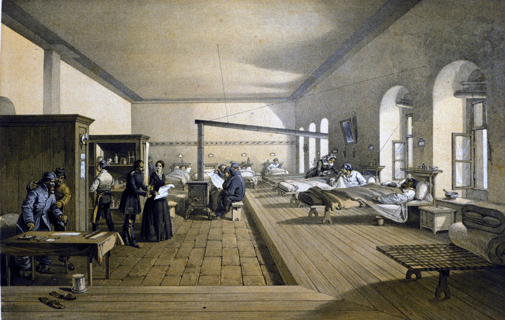

### Lezione 1 
# Introduzione
## &nbsp;

---
## Informazioni generali

- **Docente**
    - alessia.visconti@unito.it

- **Cosa (c'&egrave; nel programma)?**
    - 16h di lezione (circa)
    - 8h di laboratorio (circa)

- **Cosa (portare a lezione)?**  
    - laptop (per il laboratorio)
    - fogli (per fare gli esercizi)

- **Quando?**
    - Ogni luned&igrave; mattina (4h)
    - Pause volanti

- **Com'&egrave; (l'esame)?**
    - quiz a risposta chiusa (1h)
    - con formulario e calcolatrice

<!-- 
Come si interagisce con me: 
- Alzando la mano durante la lezione
- All'inizio/fine della lezione e nelle pause
- Prendendo appuntamento via email
- (Sperimentale) via note anonime

E' il primo anno che insegno questo corso, quindi e' tutto un po' sperimentale, incluso questa richiesta di portare un foglio da consegnare e la divisione in lezione frontale e laboratorio

Pesante in lunedi', interrompero' con esercizi e discussioni, quindi chiedo la partecipazione di tutti.
Gli esercizi fatti a lezione sono formative assesment, che vuole dire che servono sia a voi che a me a capire se avete capito. Non vincete niente se rispondete giusto, non vi si decurta nulla se rispondete sbagliato, ma se rispondete tutti sbagliato io capisco che qualcosa e' stato spiegato male (e voi capite su cosa dovete concentrarvi quando studiate)

vi chiederei di essere puntuali, nel limiti del 43 e del parcheggio in zona, e vi chiederei se preferite pause fisse, Perch&eacute;, personalmente io sarei per pause volanti quando raggiungiamo la fine di un argomento o vi vedo particolarmente provati

Slide in anticipo senza esercizi

L'esame ha domande a crocette, per le quali sicuramente dovete ragionare, ma per cui dovete fare anche dei calcoli
Potete quindi portarvi la calcolatrice (non il cellulare) e un formulario formato A5, scritto anche da entrambi i lati
-->

---
## Perch&eacute; siamo qui?

 Think: &nbsp;&nbsp;&nbsp; <button id="countdown_think"></button> 

---
## Perch&eacute; siamo qui?

 Pair: &nbsp;&nbsp;&nbsp; <button id="countdown_pair"></button>

---
## Perch&eacute; siamo qui?

 Share: &nbsp;&nbsp;&nbsp; <button id="countdown_share"></button>

---
## Comprereste questo collutorio?

<!-- CHIEDERE SEMPRE Perch&eacute; RISPONDONO COSI'

Cosa vuol dire "fino al"? Se eliminasse il 10% dei batteri e raggiungesse il 20% della bocca, questo annuncio sarebbe ancora vero, o lo dobbiamo segnalare per pubblicita' ingannevole? Unico modo per renderlo falso e' che elimini tutti batteri e raggiunga piu' di tutta la bocca (due condizioni abbastanza improbabili, nel primo caso, o impossibili, nel secondo) -->

---
## Cosa ci dice questo grafico?

Jensen, C.M., *et al*, *Time Trends Over 16 Years in Incidence-Rates of Autism Spectrum Disorders Across the Lifespan Based on Nationwide Danish Register Data*. J Autism Dev Disord (2014). doi:10.1007/s10803-014-2053-6

<!-- DESCRIVERE BENE IL GRAFICO

 Better diagnostic practices may explain these large hikes in incidence. 
“There’s much more awareness of autism. There’s much more screening going on. And the newer generation of clinicians are being trained in this so they are more likely to see it.”

This increased attention to autism and its symptoms may also explain the rise in diagnoses of teenagers and adults.
“If the incidence [in adults] is increasing, it just has to do with recognition of cases that have been missed up to that age,” Fombonne says. “It cannot be that you develop autism at age 50.”
 -->

---
## Evitiamo quindi di dire...

<!-- Andando ad interpretare il grafico correttamente, evitiamo di dire corbellerie, come che c'e' un epidemia di autismo (magari causata dai vaccini) -->

---
## Come prosegue questo grafico?

<!--  DESCRIVERE BENE IL GRAFICO Come prosegue questa curva? -->

---
## Cosa ci dice questo grafico?

<!-- Cosa sta succedendo? Che messaggio avrei potuto passare se avessi interrotto la serie temporale al 1940, invece di proseguire sino ai giorni nostri?

Quali sono le cause di questa curva? -->

---
## Educazione civica, 1935 (ca.)

 <!-- Ricordiamoci che per interpretare i numeri dobbiamo anche usare le nostre conoscenze sul problema in questione. om qiesyp caso sulle norme sociali che forzavano i mancini a "correggersi" --> -->

---
## Cicogne e bambini

  Sies, H., *A new parameter for sex education*. Nature, 1988, doi:10.1038/332495a0

<!-- 
DESCRIVERE BENE IL GRAFICO.

Qual e' lo scopo di questo grafico? Convincerci che c'e' una relazione tra questi due valori

Artefatto dovuto alla doppia scala, vado a trasformare le due distribuzioni empiriche (ovvero la collezione di valori raccolti) in modo che "sembrino" di avere lo stesso andamento. C'e' un sito che ne raccoglie centinaia di questi esempi
-->

---
## Cosa ne concludete?

- Le donne inglesi, che consumano grandi quantit&agrave; di latte, sviluppano alcuni tipi di tumore con 18 volte pi&ugrave; frequenza delle donne giapponesi, che raramente lo bevono
* Solitamente i tumori si manifestano in tarda et&agrave;
* Le donne inglesi vivono, in media, 12 anni pi&ugrave; a lungo delle donne giapponesi

  Huff, D., *How to lie with statistics*. W. W. Norton & Company, 1954

<!-- Chiedere cosa ne pensano mano a mano che aggiungo informazione.

Quello che viene fatto qui e' un post-hoc fallacy. (in latino: Post hoc ergo propter hoc, Dopo di ci`o, quindi a causa di ci`o) `e un’argomentazione apparentemente valida ma fondata su un errore logico in cui si crede che, perch ́e l’evento Y accade dopo l’evento X, allora X debba aver causato Y . L’errore logico consiste nel concludere che ci sia un nesso causale quando `e presente solo un nesso temporale (prima bevo tanto latte, poi mi viene un tumore) 

Per tornare a vaccino e autismo
La maggioranza delle malattie che secondo alcuni (profani) sarebbero sorte "a causa del vaccino" iniziano a manifestarsi (o sono diagnosticate) proprio nell'età in cui ci si vaccina. Scientificamente smentita, una delle affermazioni che si ripetono continuamente è: "il bambino stava bene, dopo la vaccinazione è diventato autistico".

Correlation is not causation, Correlazione non e' causalita', "dopo di" non significa "a causa di"
-->

---
## Perch&eacute; siamo qui?

- perché i "numeri" (o meglio, il modo in cui sono presentati) a volte ingannano!

&nbsp;&nbsp;&nbsp;&nbsp;&nbsp;&nbsp;&nbsp;&nbsp;&nbsp; 

<!-- Statisticulation `e un termine inventato da Darrell Huff nel suo libro “How to lie with statistics” (pubblicato nel 1954). Viene usato per descrivere tutti quei casi un cui le Scienze statistiche vengono usate in modo fuorviante, sia accidentalmente (il ricercatore non si accorge che l'eta' media in Inghilterra e Giappone e' diversa) ma anche volontariamente (l'autismo viene dopo il vaccino, il vaccino causa l'autismo). Vedi anche Framing.

The numbers have no way of speaking for themselves. We speak for them. We imbue them with meaning.

— Nate Silver, The Signal and the Nois
-->

---
## Perch&eacute; siamo qui?

> Perch&eacute; i soldati al fronte muoiono?

<!-- Ma i numeri non ci ingannano solo, ci permettono anche di rispondere a delle domande e prendere delle decisioni -->

---
## Qualcuno conosce questa persona?

<!-- Serve qualcuno che non solo si ponga la domanda, ma sappia anche come rispondere. 

Sapete chi e questa persona?

Florence Nightingale era un'infermiera britannica che e' considerata la madre dell'infermieristica come la intendiamo oggi, un titolo che si e' guadagnato durante la guerra di Crimea, quando era sovrintendente di un ospedale di Instambul. 

Appena arrivata ad Instabul, Florence, si accorge subito delle pessime condizioni di sovraffollameto e pulizia, ma oltre a cercare di mettere una pezza, pulendo e disinfettando tutto con le sue infermiere,  si mette anche a raccogliere dati, soprattutto sulle cause di morte dei soldati -->

---
## Perch&eacute; i soldati al fronte muoiono?

<!-- E questi dati non solo li raccoglie, ma li riassume e presenta anche sotto forma di polar diagram, che spedisce regolarmente al governo britannico. 

Come si legge il grafico. Blu = malattie infettive, Rosso = ferite riportate in battaglia, nero = altre cause

E cosa concludiamo? 
Che migliorare le condizioni igenice (pulizia, luce, ventilazione, ...) degli ospedali, aumenta le possibilita' di salvare il paziente. 

E se questo e' ovvio oggi, lo dobbiamo alla sua abilita' nel raccogliere e presentare i dati, e nel prendere delle decisioni basate su di essi. Insomma, grazie alla statistica. -->

---
## Perch&eacute; siamo qui?

- perché i "numeri" (o meglio, il modo in cui sono presentati) a volte ingannano!
- Perch&eacute; i "numeri" (e il modo in cui sono presentati) ci aiutano a descrivere, capire e cambiare il mondo

---
## Perch&eacute; siamo qui?

- per imparare a leggere, comprendere e analizzare criticamente documenti scientifici o divulgativi
- per essere in grado di effettuare ricerche che comportino l’acquisizione, l’elaborazione e l’analisi di dati

<!-- 

<b>Statistica ma anche data literacy</b>

 -->

---

## La ricerca scientifica

<!-- Iniziamo a spostarci piu' verso il terreno che ci interessa, ma prima facciamo un'escursus in un argomento un po' trasversale, ovvero come avviene la ricerca scientifica e che ruolo gioca la statistica -->

---
## In principio c'&egrave; sempre una domanda

> Perch&eacute; i soldati, al fronte, muoiono?

---
## Poi si prepara un piano di azione

- Come rispondo alla mia domanda?

<!-- Decido di andare in un ospedale da campo per raccogliere dati -->

---
## Poi si raccolgono i dati

                   Reparto ospedaliero a Scutari. J.A. Benwell. 1856 circa

---
## Poi i dati vengono analizzati

<!-- Questo vuol dire anche andarli a presentare con altri numeri (statistiche) o con rappresentazioni grafiche, come vedremo la prossima lezione -->

---
## Finalmente possiamo trarre delle conclusioni

                     Florence Nightingale (1820 - 1910) at Scutari Hospital in Turkey around 1855, Artista ignoto

<!-- E cosa concludiamo? 
Che migliorare le condizioni igenice (pulizia, luce, ventilazione, ...) degli ospedali, aumenta le possibilita' di salvare il paziente.  -->

---
## Le fasi della ricerca

Spiegelhalter, D., *The Art of Statistics: Learning From Data*, Pelican, 2019

<!-- e' il processo circolare che definisce i passi necessari per risolvere un problema scientifico attraverso l’analisi statistica dei dati. Un esempio `e il PPDAC cycle.

 Problem-Plan-Data-Analysis-Conclusion cycle. 
 
 Nella prima fase si definisce un problema, solitamente formulato come una domanda di ricerca. 
 Nella parte di Planning, il ricercatore decide come rispondere alla domanda di ricerca. Solitamente ignorata, ma assoulutamente cruciale, GARBACE IN, GARBACE OUT. Questo include, 
 i) verificare se esiste una collezione di dati di alta qualit`a che pu`o essere usata, ii) decidere e giustificare perch ́e sia necessario raccogliere nuove collezioni di dati, e quali dati siano necessari e come debbano essere raccolti 
 iii) decidere e giustificare da qua- le Popolazione i dati verranno raccolti, tenendo anche in considerazione considerazione etiche e logistiche (per esempio, questionari che richiedano un tempo troppo lungo per essere completati), 
 iv) decidere e giustificare quando e dove la raccolta dati debba iniziare e finire, 
 v) decidere e giustifi- care i metodi analitici che verranno utilizzati, e 
 vi) definire delle probabili risposte alla domanda di ricerca (ipotesi)
 
 Nella terza fase, i dati vengono raccolti, organizzati, puliti e verificati. 
 Nella quarta fase, i dati vengono esplora- ti, visualizzati e analizzati, per esempio attraverso la creazione di tabelle e/o grafici, di statistiche descrittive. In questo contesto si inseriscono anche il Test di ipotesi e il calcolo e l’interpretazione di un Intervallo di confidenza di una Statistica. 
 Nell’ultima fase, i risultati vengono interpre- tati e comunicati e usati per formulare nuove domande di ricerca la cui risposta verr`a ricercata nel prossimo PPDAC cycle.
-->

---
## Il metodo induttivo

Stabilire una legge universale partendo da singoli casi particolari

<!-- Quello che abbiamo fatto e' stato in taking particular instances and trying to work out general conclusions.

we don’t know the customs in a community about kissing female friends on the cheek, and we have to try to work it out by observing whether people kiss once, twice, three times, or not at all.

Questo e' il contrario del ragionamento deduttivo, using the rules of cold logic to work from general premises to particular conclusions. 

If the law of the country is that cars should drive on the right, then we can deduce that on any particular occasion it is best to drive on the right. But induction works the other way,  -->

---
## Cos'&egrave; la statistica?

* La raccolta, organizzazione, sintesi, e analisi dei dati   &nbsp;&nbsp;&nbsp; &rarr; statistica *Descrittiva* 

* Processo mediante il quale vengono  tratte conclusioni su grandi gruppi sulla base di dati raccolti in gruppi pi&ugrave; ristretti    &nbsp;&nbsp;&nbsp; &rarr; statistica *Inferenziale* 

<!-- - Individuare in maniera efficiente i tratti importanti delle informazioni che sono state raccolte

- Partire dal particolare per capire come le informazioni si possono estendere alla totalità -->

---

## Perch&eacute; siamo qui?

> *Se mi rimanesse una sola ora di vita vorrei trascorrerla assistendo ad una lezione di statistica perch&eacute; mi sembrerebbe durare per sempre*

(un&#601; Student&#601;)

