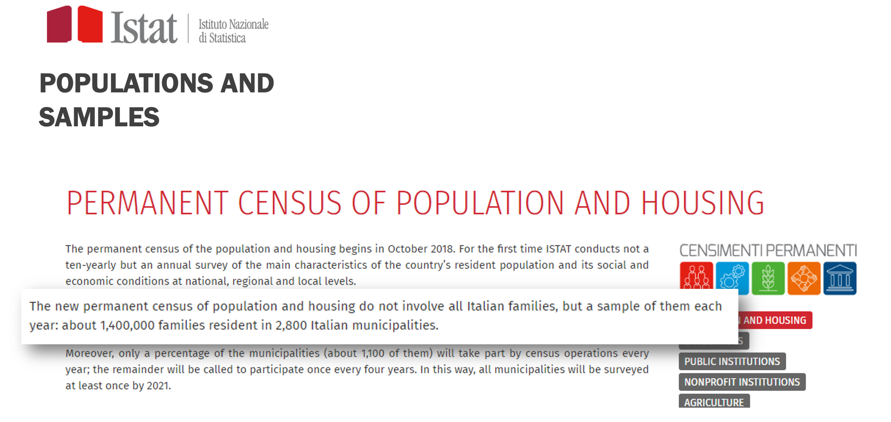
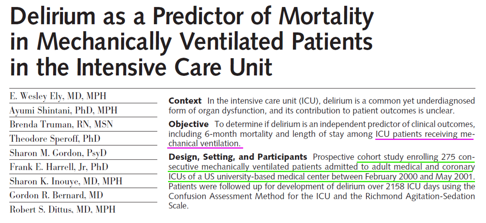
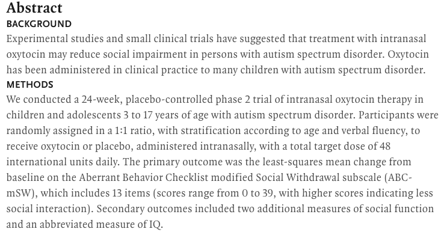
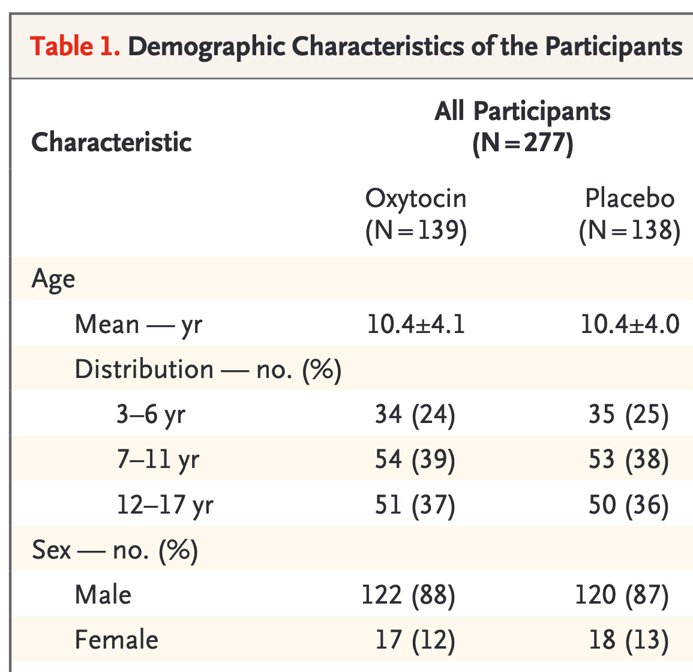
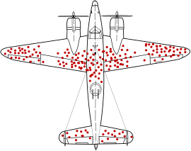

### Lezione 2
# Popolazione e Campione
## &nbsp;

---
## Obiettivi di apprendimento

- Conoscere le differenze tra popolazione e campione
- Conoscere le due maggiori strategie di campionamento
- Individuare errori di campionamento e bias

---
## Le fasi della ricerca

Spiegelhalter, D., *The Art of Statistics: Learning From Data*, Pelican, 2019

<!-- Nella parte di Planning, il ricercatore decide come rispondere alla domanda di ricerca. Solitamente ignorata, ma assoulutamente cruciale, GARBACE IN, GARBACE OUT. Questo include, 
 i) verificare se esiste una collezione di dati di alta qualit`a che pu`o essere usata, ii) decidere e giustificare perch ́e sia necessario raccogliere nuove collezioni di dati, e quali dati siano necessari e come debbano essere raccolti 
 iii) decidere e giustificare da qua- le Popolazione i dati verranno raccolti, tenendo anche in considerazione considerazione etiche e logistiche (per esempio, questionari che richiedano un tempo troppo lungo per essere completati), 
 iv) decidere e giustificare quando e dove la raccolta dati debba iniziare e finire, 
 v) decidere e giustifi- care i metodi analitici che verranno utilizzati, e 
 vi) definire delle probabili risposte alla domanda di ricerca (ipotesi) -->

--- 
## Popolazione *vs*  &nbsp;campione

<!-- Popolazione e' l'insieme di tutti gli individui per cui vogliamo studiare un fenomeno, e.g., popolazione italiana
La popolazione è, teoricamente, infinita
Se non è infinita è spesso difficile da raggiungere tutta (tempi e costi)

Il modo tradizionale per studiare una popolazione e' il censimento, che pero' ha diversi svantaggi, tra cui il costo,
Dobbiamo quindi scegliere un sottoinsieme della popolazione che possiamo raggiungere

Avveniva ogni 10 anni, ultimo nel 2011 -> dal 2018 permanent census, sotto gruppo della popolazione, quindi quello che chiamiamo un campione statistico 

Altro svantaggio , e b) non e' possibile raccogliere tutte le informazioni possiboli e immaginabili (trauma cranico al nido)
-->

---
## Popolazione *vs*  &nbsp;campione (nella  clinica)

<!-- Nella ricerca clinica, la popolazione e' l'insieme di tutti i pazienti che ci interessano

Campione sono quelli che siamo andati a reclutare. 

E’ però necessario sceglierlo “bene” affinché le informazioni che otteniamo sul nostro campione siano poi trasferibili alla popolazione di partenza (inferenza)m quindi con procedimenti e regole che garantiscano la capacità del campione di rappresentare la popolazione
-->

---
## Campione di convenienza 

:dart: &nbsp;&nbsp;&nbsp; Un campione di convenienza &egrave; un campione estratto da una
&nbsp;&nbsp;&nbsp;&nbsp;&nbsp;&nbsp;&nbsp;&nbsp;&nbsp;  parte della popolazione a cui abbiamo un facile accesso e 
&nbsp;&nbsp;&nbsp;&nbsp;&nbsp;&nbsp;&nbsp;&nbsp;&nbsp;  che potrebbe non rappresentarla nella sua  interezza

:pushpin: &nbsp;&nbsp;&nbsp; Tutti i pazienti che si presentano in uno specifico ambulatorio, 
&nbsp;&nbsp;&nbsp;&nbsp;&nbsp;&nbsp;&nbsp;&nbsp;&nbsp; in uno specifico ospedale, in un dato periodo di tempo

<!-- Iniziamo con il distinguere il campionamento probabilistico da quello non probabilistico.

Nel campionamento non-probabilistico, o opportunistico, la selezione del campione avviene in base a criteri di comodo o di praticità, per esempio perché certi individui sono più facilmente contattabili, o per ragioni di costo 

Ricordiamoci che importante e' che sia randomizzato rispetto alla variabile di interesse. Se ci interessa come rispondono, per esempio nel caso del delirio, magari il nostro campione va bene -- sarebbe proprio sfortuna se in quell'intervallo di tempo mi capitassero solo un tipo specifico di pazienti, per esempio molto giovani o con malattie mentali pregresse.

Chiedere le intenzioni di voto alle prime 10 pagine di utenti con il numero di telefono non e' ottimale (persone con lo stesso cognome tendono ad avere le stesse idee politiche), ma accettabile. Farlo ad una protesta contro l'immigrazione invece no! 

-->

---
## Campionamento casuale semplice

:dart: &nbsp;&nbsp;&nbsp; Nel campionamento casuale semplice tutti i soggetti della  
&nbsp;&nbsp;&nbsp;&nbsp;&nbsp;&nbsp;&nbsp;&nbsp;&nbsp; popolazione hanno la stessa probabilit&agrave; di venire inclusi 
&nbsp;&nbsp;&nbsp;&nbsp;&nbsp;&nbsp;&nbsp;&nbsp;&nbsp; nel campione

:pushpin: &nbsp;&nbsp;&nbsp; Un sottoinsieme estratto in modo casuale dall'elenco dei 
&nbsp;&nbsp;&nbsp;&nbsp;&nbsp;&nbsp;&nbsp;&nbsp;&nbsp; pazienti con la malattia

<!-- Nel campionamento probabilistico ogni unità della popolazione in studio ha una probabilità NOTA di essere estratta (non distorto o viziato) 

 Necessaria la lista (base di campionamento) esaustiva di tutta la popolazione
 Estrazione dei soggetti tramite sorteggio (tavole numeri casuali, computer)\

Nel campionamento casuale semplice tutte le unità della popolazione hanno la stessa probabilità di essere estratte:

data una popolazione di N individui ed un campione di dimensione n  la probabilità che l’i-esimo individuo entri nel campione è “n/N” 

-->

---
## Campionamento casuale semplice

:pushpin: &nbsp;&nbsp;&nbsp;  $N=90$
&nbsp;&nbsp;&nbsp;&nbsp;&nbsp;&nbsp;&nbsp;&nbsp;&nbsp; $n=10$ 

<!-- Disporre di un elenco completo di tutti i soggetti della popolazione e una loro numerazione

n piccolo e' la nostra numerosita' campionaria

Decidere quante unità si vogliono selezionare e calcolare la frazione di campionamento -->

---
## Campionamento casuale semplice

:pushpin: &nbsp;&nbsp;&nbsp;  $N=90$
&nbsp;&nbsp;&nbsp;&nbsp;&nbsp;&nbsp;&nbsp;&nbsp;&nbsp; $n=10$ 

&nbsp;&nbsp;&nbsp;&nbsp;&nbsp;&nbsp;&nbsp;&nbsp;&nbsp; $49, 65, 25, 74, 18$
&nbsp;&nbsp;&nbsp;&nbsp;&nbsp;&nbsp;&nbsp;&nbsp;&nbsp; $90, 47, 24, 71, 37$

<!--  Estrarre le unità tramite sorteggio casuale o tavole dei numeri casuali (costruite in modo da non avere vizi sistematici. Sono delle serie di numeri tra 0 e 9 disposti a caso e caratterizzati dall’avere una distribuzione uniforme) -->

---
### Esercizio #1

Sikich, L. *et al.*, *Intranasal Oxytocin in Children and Adolescents with Autism Spectrum Disorder*, NEJM, 2021

:question: &nbsp;&nbsp;&nbsp; Qual &egrave; la popolazione di studio?

&nbsp;&nbsp;&nbsp;&nbsp;&nbsp;&nbsp;&nbsp;&nbsp;&nbsp; a) Bambini e adolescenti tra 3-17 anni 
&nbsp;&nbsp;&nbsp;&nbsp;&nbsp;&nbsp;&nbsp;&nbsp;&nbsp;&nbsp;&nbsp;&nbsp;&nbsp;&nbsp; con autismo
&nbsp;&nbsp;&nbsp;&nbsp;&nbsp;&nbsp;&nbsp;&nbsp;&nbsp; b) Bambini e adolescenti in Inghilterra
&nbsp;&nbsp;&nbsp;&nbsp;&nbsp;&nbsp;&nbsp;&nbsp;&nbsp; c) Bambini e adolescenti con autismo
&nbsp;&nbsp;&nbsp;&nbsp;&nbsp;&nbsp;&nbsp;&nbsp;&nbsp; d) Bambini e adolescenti che non 
&nbsp;&nbsp;&nbsp;&nbsp;&nbsp;&nbsp;&nbsp;&nbsp;&nbsp;&nbsp;&nbsp;&nbsp;&nbsp;&nbsp; presentano sintomi di autismo

<button id="countdown_exercise_1"></button>

---
### Esercizio #1 -- Soluzione

Sikich, L. *et al.*, *Intranasal Oxytocin in Children and Adolescents with Autism Spectrum Disorder*, NEJM, 2021

:question: &nbsp;&nbsp;&nbsp; Qual &egrave; la popolazione di studio?

&nbsp;&nbsp;&nbsp;&nbsp;&nbsp;&nbsp;&nbsp;&nbsp;&nbsp; a) Bambini e adolescenti tra 3-17 anni 
&nbsp;&nbsp;&nbsp;&nbsp;&nbsp;&nbsp;&nbsp;&nbsp;&nbsp;&nbsp;&nbsp;&nbsp;&nbsp;&nbsp; con autismo
&nbsp;&nbsp;&nbsp;&nbsp;&nbsp;&nbsp;&nbsp;&nbsp;&nbsp; b) Bambini e adolescenti in Inghilterra
&nbsp;&nbsp;&nbsp;&nbsp;&nbsp;&nbsp;&nbsp;&nbsp;&nbsp; c) Bambini e adolescenti con autismo &nbsp;&nbsp; :white_check_mark: 
&nbsp;&nbsp;&nbsp;&nbsp;&nbsp;&nbsp;&nbsp;&nbsp;&nbsp; d) Bambini e adolescenti che non 
&nbsp;&nbsp;&nbsp;&nbsp;&nbsp;&nbsp;&nbsp;&nbsp;&nbsp;&nbsp;&nbsp;&nbsp;&nbsp;&nbsp; presentano sintomi di autismo

---
### Esercizio #2

Sikich, L. *et al.*, *Intranasal Oxytocin in Children and Adolescents with Autism Spectrum Disorder*, NEJM, 2021

:question: &nbsp;&nbsp;&nbsp; Qual &egrave; il campione selezionato?

&nbsp;&nbsp;&nbsp;&nbsp;&nbsp;&nbsp;&nbsp;&nbsp;&nbsp; a) Bambini e adolescenti tra 3-17 anni 
&nbsp;&nbsp;&nbsp;&nbsp;&nbsp;&nbsp;&nbsp;&nbsp;&nbsp;&nbsp;&nbsp;&nbsp;&nbsp;&nbsp; con autismo
&nbsp;&nbsp;&nbsp;&nbsp;&nbsp;&nbsp;&nbsp;&nbsp;&nbsp; b) Bambini e adolescenti in Inghilterra
&nbsp;&nbsp;&nbsp;&nbsp;&nbsp;&nbsp;&nbsp;&nbsp;&nbsp; c) Bambini e adolescenti con autismo
&nbsp;&nbsp;&nbsp;&nbsp;&nbsp;&nbsp;&nbsp;&nbsp;&nbsp; d) Bambini e adolescenti che non 
&nbsp;&nbsp;&nbsp;&nbsp;&nbsp;&nbsp;&nbsp;&nbsp;&nbsp;&nbsp;&nbsp;&nbsp;&nbsp;&nbsp; presentano sintomi di autismo

<button id="countdown_exercise_1bis"></button>

---
### Esercizio #2 -- Soluzione

Sikich, L. *et al.*, *Intranasal Oxytocin in Children and Adolescents with Autism Spectrum Disorder*, NEJM, 2021

:question: &nbsp;&nbsp;&nbsp; Qual &egrave; il campione selezionato?

&nbsp;&nbsp;&nbsp;&nbsp;&nbsp;&nbsp;&nbsp;&nbsp;&nbsp; a) Bambini e adolescenti tra 3-17 anni 
&nbsp;&nbsp;&nbsp;&nbsp;&nbsp;&nbsp;&nbsp;&nbsp;&nbsp;&nbsp;&nbsp;&nbsp;&nbsp;&nbsp; con autismo &nbsp;&nbsp; :white_check_mark: 
&nbsp;&nbsp;&nbsp;&nbsp;&nbsp;&nbsp;&nbsp;&nbsp;&nbsp; b) Bambini e adolescenti in Inghilterra
&nbsp;&nbsp;&nbsp;&nbsp;&nbsp;&nbsp;&nbsp;&nbsp;&nbsp; c) Bambini e adolescenti con autismo
&nbsp;&nbsp;&nbsp;&nbsp;&nbsp;&nbsp;&nbsp;&nbsp;&nbsp; d) Bambini e adolescenti che non 
&nbsp;&nbsp;&nbsp;&nbsp;&nbsp;&nbsp;&nbsp;&nbsp;&nbsp;&nbsp;&nbsp;&nbsp;&nbsp;&nbsp; presentano sintomi di autismo

---
### Esercizio #3

Sikich, L. *et al.*, *Intranasal Oxytocin in Children and Adolescents with Autism Spectrum Disorder*, NEJM, 2021

:question: &nbsp;&nbsp;&nbsp; Qual &egrave; la numerosit&agrave; del campione

&nbsp;&nbsp;&nbsp;&nbsp;&nbsp;&nbsp;&nbsp;&nbsp;&nbsp; a) 277
&nbsp;&nbsp;&nbsp;&nbsp;&nbsp;&nbsp;&nbsp;&nbsp;&nbsp; b) 139
&nbsp;&nbsp;&nbsp;&nbsp;&nbsp;&nbsp;&nbsp;&nbsp;&nbsp; c) 130
&nbsp;&nbsp;&nbsp;&nbsp;&nbsp;&nbsp;&nbsp;&nbsp;&nbsp; d) Non &egrave; possibile desumerlo dalla tabella 

<button id="countdown_exercise_2"></button>

---
### Esercizio #3 -- Soluzione 

Sikich, L. *et al.*, *Intranasal Oxytocin in Children and Adolescents with Autism Spectrum Disorder*, NEJM, 2021

:question: &nbsp;&nbsp;&nbsp; Qual &egrave; la numerosit&agrave; del campione

&nbsp;&nbsp;&nbsp;&nbsp;&nbsp;&nbsp;&nbsp;&nbsp;&nbsp; a) 277 &nbsp;&nbsp; :white_check_mark: 
&nbsp;&nbsp;&nbsp;&nbsp;&nbsp;&nbsp;&nbsp;&nbsp;&nbsp; b) 139
&nbsp;&nbsp;&nbsp;&nbsp;&nbsp;&nbsp;&nbsp;&nbsp;&nbsp; c) 130
&nbsp;&nbsp;&nbsp;&nbsp;&nbsp;&nbsp;&nbsp;&nbsp;&nbsp; d) Non &egrave; possibile desumerlo dalla tabella 

---
## Bias nella selezione del campione

- Survivor bias

<!-- Anche se facciamo attenzione i nostri sample possono avere delle distorsioni

- voglio andare a vedere dove gli aerei da guerra vengono colpiti per rinforzarli
e l’errore logico che si commette quando si prendano in considerazione solo gli elementi che hanno superato un determinato pro- cesso di selezione, trascurando i restanti; tipicamente ci`o avviene poich ́e i primi sono fisicamente disponibili/visibili e i secondi no. -->

---
## Bias nella selezione del campione

- Survivor bias
- Volunteer bias
* Lost to follow up bias
* $\dots$

<!-- - occorre quando i volontari hanno caratteristiche diverse rispet- to alla Popolazione che si vuole studiare.  volontari alsop SES e soprattuto donne
- occorre quando uno o piu` soggetti di uno studio di- ventano irreperibili durante lo studio stesso sto testando un nuovo farmaco, le persone che hanno i side effect peggiori possono interromperlo, o quelli per cui non funziona possono morire -->

---
### Esercizio #4

Sikich, L. *et al.*, *Intranasal Oxytocin in Children and Adolescents with Autism Spectrum Disorder*, NEJM, 2021

:question: &nbsp;&nbsp;&nbsp; Lo studio soffre di qualche bias?

&nbsp;&nbsp;&nbsp;&nbsp;&nbsp;&nbsp;&nbsp;&nbsp;&nbsp; a) No
&nbsp;&nbsp;&nbsp;&nbsp;&nbsp;&nbsp;&nbsp;&nbsp;&nbsp; b) Survivor bias
&nbsp;&nbsp;&nbsp;&nbsp;&nbsp;&nbsp;&nbsp;&nbsp;&nbsp; c) Volunterr bias
&nbsp;&nbsp;&nbsp;&nbsp;&nbsp;&nbsp;&nbsp;&nbsp;&nbsp; d) Lost to follow up bias 

<button id="countdown_exercise_4"></button>

---
### Esercizio #4 -- Soluzione

Sikich, L. *et al.*, *Intranasal Oxytocin in Children and Adolescents with Autism Spectrum Disorder*, NEJM, 2021

:question: &nbsp;&nbsp;&nbsp; Lo studio soffre di qualche bias?

&nbsp;&nbsp;&nbsp;&nbsp;&nbsp;&nbsp;&nbsp;&nbsp;&nbsp; a) No
&nbsp;&nbsp;&nbsp;&nbsp;&nbsp;&nbsp;&nbsp;&nbsp;&nbsp; b) Survivor bias
&nbsp;&nbsp;&nbsp;&nbsp;&nbsp;&nbsp;&nbsp;&nbsp;&nbsp; c) Volunterr bias
&nbsp;&nbsp;&nbsp;&nbsp;&nbsp;&nbsp;&nbsp;&nbsp;&nbsp; d) Lost to follow up bias &nbsp;&nbsp; :white_check_mark: 

---
### Cosa abbiamo imparato in questa lezione?

- La popolazione &egrave; l'insieme di tutti gli individui per cui vogliamo studiare un fenomeno ed è, teoricamente, infinita
- Il campione &egrave; un sotto insieme (rappresentativo?) della popolazione
- Anche con campioni rappresentativi (casuali) possono esserci errori e/o bias

