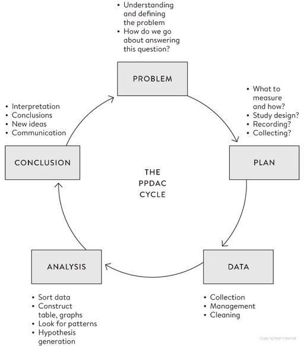
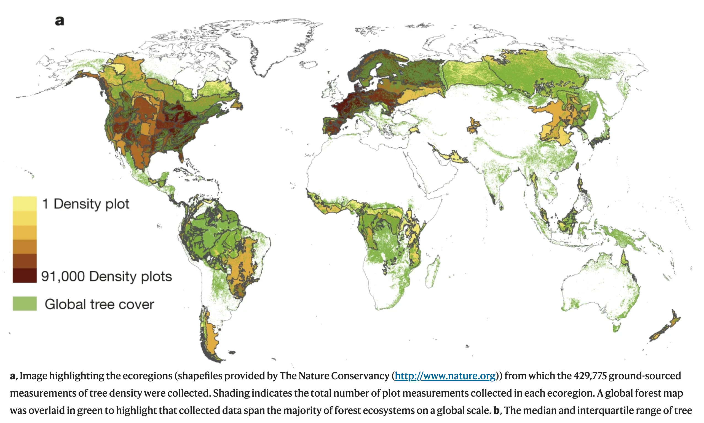

### Lezione 2
# Popolazione e Campione
## &nbsp;

---
## Obiettivi di apprendimento

- Conoscere le differenze tra popolazione e campione
- Conoscere le due maggiori strategie di campionamento
- Individuare errori di campionamento e bias

---
## Le fasi della ricerca

Spiegelhalter, D., *The Art of Statistics: Learning From Data*, Pelican, 2019

<!-- The first stage of the cycle is specifying a Problem.

It is tempting to skip over the need for a careful Plan. Confident conclusions can only be drawn from a study which has been appropriately designed. Unfortunately, in the rush to get data and start analysis, attention to design is often glossed over.

Collecting good Data requires the kind of organizational and coding skills that are being seen as increasingly important in data science, particularly as data from routine sources may need a lot of cleaning in order to get it ready to be analysed. Data collection systems may have changed over time, there may be obvious errors, and so on – the phrase ‘found data’ neatly communicates that it may be rather messy, like something picked up in the street. -->

--- 
## Popolazione *vs*  &nbsp;campione

<!-- Popolazione e' l'insieme di tutti gli individui per cui vogliamo studiare un fenomeno, e.g., popolazione italiana
La popolazione è, teoricamente, infinita
Se non è infinita è spesso difficile da raggiungere tutta (tempi e costi)

Il modo tradizionale per studiare una popolazione e' il censimento, che pero' ha diversi svantaggi, tra cui il costo,
Dobbiamo quindi scegliere un sottoinsieme della popolazione che possiamo raggiungere

Avveniva ogni 10 anni, ultimo nel 2011 -> dal 2018 permanent census, sotto gruppo della popolazione, quindi quello che chiamiamo un campione statistico 

Altro svantaggio , e b) non e' possibile raccogliere tutte le informazioni possiboli e immaginabili (trauma cranico al nido)
-->

---
## Popolazione *vs*  &nbsp;campione (nella  clinica)

<!-- Nella ricerca clinica, la popolazione e' l'insieme di tutti i pazienti che ci interessano

Campione sono quelli che siamo andati a reclutare .

E’ però necessario sceglierlo “bene” affinché le informazioni che otteniamo sul nostro campione siano poi trasferibili alla popolazione di partenza (inferenza)m quindi con procedimenti e regole che garantiscano la capacità del campione di rappresentare la popolazione
-->

---
## Opportunistico *vs*  &nbsp;casuale semplice

:dart: &nbsp;&nbsp;&nbsp; Un campione **opportunistico** e' un campione estratto da una
&nbsp;&nbsp;&nbsp;&nbsp;&nbsp;&nbsp;&nbsp;&nbsp;&nbsp;  parte della popolazione a cui abbiamo un facile accesso e 
&nbsp;&nbsp;&nbsp;&nbsp;&nbsp;&nbsp;&nbsp;&nbsp;&nbsp;  che potrebbe non rappresentarls nella sua  interezza

:pushpin: &nbsp;&nbsp;&nbsp; Tutti i pazienti che si presentano in uno specifico ambulatorio, 
&nbsp;&nbsp;&nbsp;&nbsp;&nbsp;&nbsp;&nbsp;&nbsp;&nbsp; in uno specifico ospedale, in un dato periodo di tempo

<!-- Iniziamo con il distinguere il campionamento probabilistico da quello non propabilistico.

Nel campionamento non-probabilistico, o opportunustico, la selezione del campione avviene in base a criteri di comodo o di praticità, per esempio perché certi individui sono più facilmente contattabili, o per ragioni di costo 

Ricordiamoci che importante e' che sia randomizzato rispetto alla variabile di interesse. Se ci interessa come rispondono, per esempio nel caso del delirio, magari il nostro campione va bene. 

Chiedere le intenzioni di voto alle prime 10 pagine di utenti con il numero di telefono non e' ottimale, ma accettabile. Farlo ad una protesta contro l'immigrazione invece no! 

-->

---
## Opportunistico *vs*  &nbsp;casuale semplice

:dart: &nbsp;&nbsp;&nbsp; Nel campionamento **casuale semplice** tutti i soggetti della  
&nbsp;&nbsp;&nbsp;&nbsp;&nbsp;&nbsp;&nbsp;&nbsp;&nbsp; popolazione hanno la stessa probabilita' di venire inclusi 
&nbsp;&nbsp;&nbsp;&nbsp;&nbsp;&nbsp;&nbsp;&nbsp;&nbsp; nel campione

:pushpin: &nbsp;&nbsp;&nbsp; Un sottoinsieme esratto in modo casuale dall'elenco dei 
&nbsp;&nbsp;&nbsp;&nbsp;&nbsp;&nbsp;&nbsp;&nbsp;&nbsp; pazienti con la malattia

<!-- Nel campionamento probabilistico ogni unità della popolazione in studio ha una probabilità NOTA di essere estratta (non distorto o viziato) 

 Necessaria la lista (base di campionamento) esaustiva di tutta la popolazione
 Estrazione dei soggetti tramite sorteggio (tavole numeri casuali, computer)\

Nel campionamento casuale semplice tutte le unità della popolazione hanno la stessa probabilità di essere estratte:

data una popolazione di N individui ed un campione di dimensione n  la probabilità che l’i-esimo individuo entri nel campione è “n/N” 

-->

---
### Strategia 1: Campionamento casuale semplice

:pushpin: &nbsp;&nbsp;&nbsp;  $N=90$
&nbsp;&nbsp;&nbsp;&nbsp;&nbsp;&nbsp;&nbsp;&nbsp;&nbsp; $n=10$ 

<!-- Disporre di un elenco completo di tutti i soggetti della popolazione e una loro numerazione

Decidere quante unità si vogliono selezionare e calcolare la frazione di campionamento -->

---
### Strategia 1: Campionamento casuale semplice

:pushpin: &nbsp;&nbsp;&nbsp;  $N=90$
&nbsp;&nbsp;&nbsp;&nbsp;&nbsp;&nbsp;&nbsp;&nbsp;&nbsp; $n=10$ 

&nbsp;&nbsp;&nbsp;&nbsp;&nbsp;&nbsp;&nbsp;&nbsp;&nbsp; $49, 65, 25, 74, 18$
&nbsp;&nbsp;&nbsp;&nbsp;&nbsp;&nbsp;&nbsp;&nbsp;&nbsp; $90, 47, 24, 71, 37$

<!--  Estrarre le unità tramite sorteggio casuale o tavole dei numeri casuali (costruite in modo da non avere vizi sistematici. Sono delle serie di numeri tra 0 e 9 disposti a caso e caratterizzati dall’avere una distribuzione uniforme) -->

---
## Strategia 2: Campionamento stratificato

:dart: &nbsp;&nbsp;&nbsp; La popolazione e' divisa in gruppi omogenei (strata)  
&nbsp;&nbsp;&nbsp;&nbsp;&nbsp;&nbsp;&nbsp;&nbsp;&nbsp; e un campione casuale semplice e' estratto da ognuno
 

&nbsp;&nbsp;&nbsp;&nbsp;&nbsp;&nbsp;&nbsp;&nbsp;&nbsp; Variatione: campionamento stratificato proporzionale

<!-- Identificazione degli strati ‘rilevanti’
 Liste di campionamento per sottogruppi
Campionamento casuale –semplice o sistematico- indipendente per ogni strato -->

---
## Strategia 2: Campionamento stratificato

:pushpin: &nbsp;&nbsp;&nbsp;  $N=90$
&nbsp;&nbsp;&nbsp;&nbsp;&nbsp;&nbsp;&nbsp;&nbsp;&nbsp; $N_{femmine}=60$
&nbsp;&nbsp;&nbsp;&nbsp;&nbsp;&nbsp;&nbsp;&nbsp;&nbsp; $N_{maschi}=30$

&nbsp;&nbsp;&nbsp;&nbsp;&nbsp;&nbsp;&nbsp;&nbsp;&nbsp; $n=9$ 
&nbsp;&nbsp;&nbsp;&nbsp;&nbsp;&nbsp;&nbsp;&nbsp;&nbsp; $n_{femmine} = 6$
&nbsp;&nbsp;&nbsp;&nbsp;&nbsp;&nbsp;&nbsp;&nbsp;&nbsp; $n_{maschi} = 3$

&nbsp;&nbsp;&nbsp;&nbsp;&nbsp;&nbsp;&nbsp;&nbsp;&nbsp; $Femmine: 46, 20, 26,$
&nbsp;&nbsp;&nbsp;&nbsp;&nbsp;&nbsp;&nbsp;&nbsp;&nbsp;&nbsp;&nbsp;&nbsp;&nbsp;&nbsp;&nbsp;&nbsp;&nbsp;&nbsp;&nbsp;&nbsp;&nbsp;&nbsp;&nbsp;&nbsp;&nbsp;&nbsp;&nbsp;&nbsp;&nbsp;&nbsp;&nbsp;&nbsp;&nbsp;&nbsp;&nbsp;&nbsp; $50, 47,  3$
&nbsp;&nbsp;&nbsp;&nbsp;&nbsp;&nbsp;&nbsp;&nbsp;&nbsp;&nbsp;&nbsp;&nbsp;&nbsp;&nbsp; $Maschi: 69, 85, 87$

<!-- Esempi di strata : sesso, eta', condizione sociale -->

---
## Strategia 3: Campionamento a cluster

:dart: &nbsp;&nbsp;&nbsp; La popolazione e' divisa in gruppi (cluster) e un 
&nbsp;&nbsp;&nbsp;&nbsp;&nbsp;&nbsp;&nbsp;&nbsp;&nbsp; campione casuale semplice e' estratto da ognuno
 
&nbsp;&nbsp;&nbsp;&nbsp;&nbsp;&nbsp;&nbsp;&nbsp;&nbsp; Variatione: 1 stadio (osservo tutto) *vs* 
&nbsp;&nbsp;&nbsp;&nbsp;&nbsp;&nbsp;&nbsp;&nbsp;&nbsp;&nbsp;&nbsp;&nbsp;&nbsp;&nbsp;&nbsp;&nbsp;&nbsp;&nbsp;&nbsp;&nbsp;&nbsp;&nbsp;&nbsp;&nbsp;&nbsp;&nbsp;&nbsp;&nbsp;&nbsp;&nbsp;&nbsp;&nbsp;&nbsp; 2 stadi &nbsp; (campiono all'interno dei clusters)

<!-- Le unità della popolazione sono suddivise in CLUSTER o GRAPPOLI in base a circostanze organizzative, strutturali, geografiche.
All’interno dei cluster le unità possono essere molto diverse tra di loro.

Il campione si forma estraendo casualmente un numero prestabilito di cluster, dopodichè si possono includere tutte le unità che appartengono al cluster (1 stadio) o solo una parte (2 stadi, usano campionamento semplice o stratificato)
 -->

---
## Strategia 3: Campionamento a cluster

---
## Exercizio #1

:question: &nbsp;&nbsp;&nbsp; Un rappresentante di una ditta di formaggi sta facendo un sondaggio
&nbsp;&nbsp;&nbsp;&nbsp;&nbsp;&nbsp;&nbsp;&nbsp;&nbsp; sul consumo di gorgonzola fermando un cliente ogni cinque di fronte
&nbsp;&nbsp;&nbsp;&nbsp;&nbsp;&nbsp;&nbsp;&nbsp;&nbsp;  a un supermercato

&nbsp;&nbsp;&nbsp;&nbsp;&nbsp;&nbsp;&nbsp;&nbsp;&nbsp; Che strategia di campionamento sta usando?

&nbsp;&nbsp;&nbsp;&nbsp;&nbsp;&nbsp;&nbsp;&nbsp;&nbsp; a) opportunistico
&nbsp;&nbsp;&nbsp;&nbsp;&nbsp;&nbsp;&nbsp;&nbsp;&nbsp; b) casuale semplice
&nbsp;&nbsp;&nbsp;&nbsp;&nbsp;&nbsp;&nbsp;&nbsp;&nbsp; c) stratificato
&nbsp;&nbsp;&nbsp;&nbsp;&nbsp;&nbsp;&nbsp;&nbsp;&nbsp; c) a cluster
&nbsp;&nbsp;&nbsp;&nbsp;&nbsp;&nbsp;&nbsp;&nbsp;&nbsp; d) nessuno dei precendenti

<button id="countdown_exercise_1"></button>

---
## Exercizio #1 -- Soluzione

:question: &nbsp;&nbsp;&nbsp; Un rappresentante di una ditta di formaggi sta facendo un sondaggio
&nbsp;&nbsp;&nbsp;&nbsp;&nbsp;&nbsp;&nbsp;&nbsp;&nbsp; sul consumo di gorgonzola fermando un cliente ogni cinque di fronte
&nbsp;&nbsp;&nbsp;&nbsp;&nbsp;&nbsp;&nbsp;&nbsp;&nbsp;  a un supermercato

&nbsp;&nbsp;&nbsp;&nbsp;&nbsp;&nbsp;&nbsp;&nbsp;&nbsp; Che strategia di campionamento sta usando?

&nbsp;&nbsp;&nbsp;&nbsp;&nbsp;&nbsp;&nbsp;&nbsp;&nbsp; a) opportunistico &nbsp;&nbsp;&nbsp; :white_check_mark: 
&nbsp;&nbsp;&nbsp;&nbsp;&nbsp;&nbsp;&nbsp;&nbsp;&nbsp; b) casuale semplice
&nbsp;&nbsp;&nbsp;&nbsp;&nbsp;&nbsp;&nbsp;&nbsp;&nbsp; c) stratificato
&nbsp;&nbsp;&nbsp;&nbsp;&nbsp;&nbsp;&nbsp;&nbsp;&nbsp; c) a cluster
&nbsp;&nbsp;&nbsp;&nbsp;&nbsp;&nbsp;&nbsp;&nbsp;&nbsp; d) nessuno dei precendenti

---
## Bias nella selezione del campione

<!-- Anche se facciamo attenzione i nostri sample possono avere delle distorsioni

Magari sarebbe opportunustico

Lillard 1.88
Antetokounmpo: 2.11 -->

---
## Bias nella selezione del campione

- Survivor bias

<!-- Anche se facciamo attenzione i nostri sample possono avere delle distorsioni

- voglio andare a vedere dove gli aerei da guerra vengono colpiti per rinforzarli
- - volontari alsop SES e soprattuto donne
- sto testando un nuovo farmaco, le persone che hanno i side effect peggiori possono interromperlo, o quelli per cui non funziona possono morire -->

---
## Bias nella selezione del campione

- Survivor bias
- Volunteer bias
* Lost to follow up bias
* $\dots$

<!-- Anche se facciamo attenzione i nostri sample possono avere delle distorsioni

- voglio andare a vedere dove gli aerei da guerra vengono colpiti per rinforzarli
- - volontari alsop SES e soprattuto donne
- sto testando un nuovo farmaco, le persone che hanno i side effect peggiori possono interromperlo, o quelli per cui non funziona possono morire -->

---
## Exercizio #2

:question: &nbsp;&nbsp;&nbsp; Ricercatori spediscono a dei pensionati un questionario cartaceo
&nbsp;&nbsp;&nbsp;&nbsp;&nbsp;&nbsp;&nbsp;&nbsp;&nbsp; chiedendo loro del loro stato mentale durante il lockdown, chidendo
&nbsp;&nbsp;&nbsp;&nbsp;&nbsp;&nbsp;&nbsp;&nbsp;&nbsp; loro di rispedire le risposte

&nbsp;&nbsp;&nbsp;&nbsp;&nbsp;&nbsp;&nbsp;&nbsp;&nbsp; Lo studio soffre di qualche bias?

&nbsp;&nbsp;&nbsp;&nbsp;&nbsp;&nbsp;&nbsp;&nbsp;&nbsp; a) No
&nbsp;&nbsp;&nbsp;&nbsp;&nbsp;&nbsp;&nbsp;&nbsp;&nbsp; b) Si', volunteer bias
&nbsp;&nbsp;&nbsp;&nbsp;&nbsp;&nbsp;&nbsp;&nbsp;&nbsp; c) Si', survivor bias
&nbsp;&nbsp;&nbsp;&nbsp;&nbsp;&nbsp;&nbsp;&nbsp;&nbsp; d) Sia b) che c)

<button id="countdown_exercise_2"></button>

---
## Exercizio #2 -- Soluzione

:question: &nbsp;&nbsp;&nbsp; Ricercatori spediscono a dei pensionati un questionario cartaceo
&nbsp;&nbsp;&nbsp;&nbsp;&nbsp;&nbsp;&nbsp;&nbsp;&nbsp; chiedendo loro del loro stato mentale durante il lockdown, chidendo
&nbsp;&nbsp;&nbsp;&nbsp;&nbsp;&nbsp;&nbsp;&nbsp;&nbsp; loro di rispedire le risposte

&nbsp;&nbsp;&nbsp;&nbsp;&nbsp;&nbsp;&nbsp;&nbsp;&nbsp; Lo studio soffre di qualche bias?

&nbsp;&nbsp;&nbsp;&nbsp;&nbsp;&nbsp;&nbsp;&nbsp;&nbsp; a) No
&nbsp;&nbsp;&nbsp;&nbsp;&nbsp;&nbsp;&nbsp;&nbsp;&nbsp; b) Si', volunteer bias
&nbsp;&nbsp;&nbsp;&nbsp;&nbsp;&nbsp;&nbsp;&nbsp;&nbsp; c) Si', survivor bias
&nbsp;&nbsp;&nbsp;&nbsp;&nbsp;&nbsp;&nbsp;&nbsp;&nbsp; d) Sia b) che c) &nbsp;&nbsp;&nbsp; :white_check_mark: 

---
## Esercizio #3

:question: &nbsp;&nbsp;&nbsp; Quanti alberi ci sono al mondo?

 Think &nbsp;&nbsp;&nbsp; <button id="countdown_think"></button>

<!-- Think -->

---
## Esercizio #3

:question: &nbsp;&nbsp;&nbsp; Quanti alberi ci sono al mondo?

 

 Share &nbsp;&nbsp;&nbsp; <button id="countdown_share"></button>

<!-- But we cannot wander round the entire planet individually measuring each woody-stemmed plant and counting up those that meet this criterion. So the researchers who investigated this question took a more pragmatic approach: they first took a series of areas with a common type of landscape, known as a biome, and counted the average number of trees found per square kilometre. They then used satellite imaging to estimate the total area of the planet covered by each type of biome, carried out some complex statistical modelling
-->

---
## Esercizio 3 -- Soluzione (3.04 trillions)

Crowther, T., *et al.*, *Mapping tree density at a global scale*. Nature, 2015, doi:10.1038/nature14967

<!-- , and eventually came up with an estimated total of 3.04 trillion (that is 3,040,000,000,000) trees on the planet. This sounds a lot, except they reckoned there used to be twice this number

we estimate that over 15 billion trees are cut down each year, and the global number of trees has fallen by approximately 46% since the start of human civilization.
  -->

---
## Il metodo induttivo

- stabilire una legge universale partendo da singoli casi particolari

<!-- Quello che abbiamo fatto e' stato in taking particular instances and trying to work out general conclusions.

we don’t know the customs in a community about kissing female friends on the cheek, and we have to try to work it out by observing whether people kiss once, twice, three times, or not at all.

Questo e' il contrario del ragionamento deduttivo, using the rules of cold logic to work from general premises to particular conclusions. 

If the law of the country is that cars should drive on the right, then we can deduce that on any particular occasion it is best to drive on the right. But induction works the other way,  -->

---
### Cosa abbiamo imparato in questa lezione?

- La popolazione e' l'insieme di tutti gli individui per cui vogliamo studiare un fenomeno ed è, teoricamente, infinita
- Il campione e' un sotto insieme (rappresentativo?) della popolazione
- Anche con campioni rappresentativi (casuali) possono esserci errori e/o bias
- Attraverso il metodo induttivo partiamo dalle osservazioni campionarie per trarre conclusioni sulla popolazione generale

