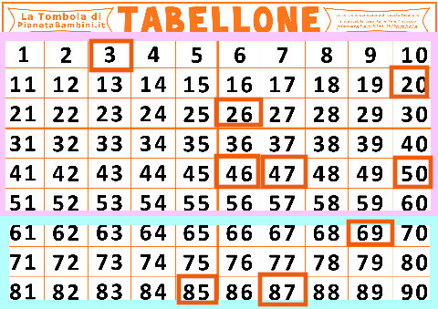
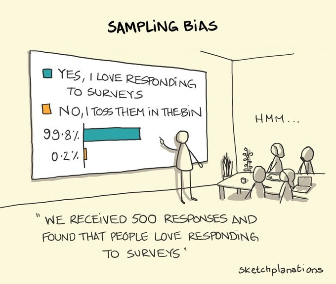

### Lezione 2
# Popolazione e Campione
## &nbsp;

---
## Obiettivi di apprendimento

- Conoscere le differenti fasi della ricerca
- Conoscere le differenze tra popolazione e campione
- Conoscere e usare in modo opportuno i diversi approcci di campionamento
- Individuare errori di campionamento e bias

---
## Le fasi della ricerca

<!-- Programmazione - campionamento
  •Scelta del disegno dello studio
  •Modalità di selezione del campione
  •Definizione della numerosità

Descrizione del campione
  •Produzione delle statistiche

Inferenza – dal campione alla popolazione
  •Si «trasferiscono» alla popolazione le misure effettuate sul campione
  •I parametri sono le stesse misure effettuate sul campione, ma riferite alla pololazione
  • Statistiche sul campione = parametri sulla popolazione

Decisioni in base ai parametri stimati -->

--- 
## Popolazione *vs*  &nbsp;campione

<!-- Popolazione e' l'insieme di tutti gli individui per cui vogliamo studiare un fenomeno, e.g., popolazione italiana
La popolazione è, teoricamente, infinita
Se non è infinita è spesso difficile da raggiungere tutta (tempi e costi)

Il modo tradizionale per studiare una popolazione e' il censimento, che pero' ha diversi svantaggi, tra cui il costo,
Dobbiamo quindi scegliere un sottoinsieme della popolazione che possiamo raggiungere

Avveniva ogni 10 anni, ultimo nel 2011 -> dal 2018 permanent census, sotto gruppo della popolazione, quindi quello che chiamiamo un campione statistico 

Altro svantaggio , e b) non e' possibile raccogliere tutte le informazioni possiboli e immaginabili (trauma cranico al nido)
-->

---
## Popolazione *vs*  &nbsp;campione (nella  clinica)

<!-- Nella ricerca clinica, la popolazione e' l'insieme di tutti i pazienti che ci interessano

Campione sono quelli che siamo andati a reclutare .

E’ però necessario sceglierlo “bene” affinché le informazioni che otteniamo sul nostro campione siano poi trasferibili alla popolazione di partenza (inferenza)m quindi con procedimenti e regole che garantiscano la capacità del campione di rappresentare la popolazione
-->

---
## Opportunistico *vs*  &nbsp;casuale semplice

:dart: &nbsp;&nbsp;&nbsp; Un campione **opportunistico** e' un campione estratto da una
&nbsp;&nbsp;&nbsp;&nbsp;&nbsp;&nbsp;&nbsp;&nbsp;&nbsp;  parte della popolazione a cui abbiamo un facile accesso e 
&nbsp;&nbsp;&nbsp;&nbsp;&nbsp;&nbsp;&nbsp;&nbsp;&nbsp;  che potrebbe non rappresentarls nella sua  interezza

:pushpin: &nbsp;&nbsp;&nbsp; Tutti i pazienti che si presentano in uno specifico ambulatorio, 
&nbsp;&nbsp;&nbsp;&nbsp;&nbsp;&nbsp;&nbsp;&nbsp;&nbsp; in uno specifico ospedale, in un dato periodo di tempo

<!-- Iniziamo con il distinguere il campionamento probabilistico da quello non propabilistico.

Nel campionamento non-probabilistico, o opportunustico, la selezione del campione avviene in base a criteri di comodo o di praticità, per esempio perché certi individui sono più facilmente contattabili, o per ragioni di costo 

Ricordiamoci che importante e' che sia randomizzato rispetto alla variabile di interesse. Se ci interessa come rispondono, per esempio nel caso del delirio, magari il nostro campione va bene. 

Chiedere le intenzioni di voto alle prime 10 pagine di utenti con il numero di telefono non e' ottimale, ma accettabile. Farlo ad una protesta contro l'immigrazione invece no! 

-->

---
## Opportunistico *vs*  &nbsp;casuale semplice

:dart: &nbsp;&nbsp;&nbsp; Nel campionamento **casuale semplice** tutti i soggetti della  
&nbsp;&nbsp;&nbsp;&nbsp;&nbsp;&nbsp;&nbsp;&nbsp;&nbsp; popolazione hanno la stessa probabilita' di venire inclusi 
&nbsp;&nbsp;&nbsp;&nbsp;&nbsp;&nbsp;&nbsp;&nbsp;&nbsp; nel campione

:pushpin: &nbsp;&nbsp;&nbsp; Un sottoinsieme esratto in modo casuale dall'elenco dei 
&nbsp;&nbsp;&nbsp;&nbsp;&nbsp;&nbsp;&nbsp;&nbsp;&nbsp; pazienti con la malattia

<!-- Nel campionamento probabilistico ogni unità della popolazione in studio ha una probabilità NOTA di essere estratta (non distorto o viziato) 

 Necessaria la lista (base di campionamento) esaustiva di tutta la popolazione
 Estrazione dei soggetti tramite sorteggio (tavole numeri casuali, computer)\

Nel campionamento casuale semplice tutte le unità della popolazione hanno la stessa probabilità di essere estratte:

data una popolazione di N individui ed un campione di dimensione n  la probabilità che l’i-esimo individuo entri nel campione è “n/N” 

-->

---
### Strategia 1: Campionamento casuale semplice

:pushpin: &nbsp;&nbsp;&nbsp;  $N=90$
&nbsp;&nbsp;&nbsp;&nbsp;&nbsp;&nbsp;&nbsp;&nbsp;&nbsp; $n=10$ 

<!-- Disporre di un elenco completo di tutti i soggetti della popolazione e una loro numerazione

Decidere quante unità si vogliono selezionare e calcolare la frazione di campionamento -->

---
### Strategia 1: Campionamento casuale semplice

:pushpin: &nbsp;&nbsp;&nbsp;  $N=90$
&nbsp;&nbsp;&nbsp;&nbsp;&nbsp;&nbsp;&nbsp;&nbsp;&nbsp; $n=10$ 

&nbsp;&nbsp;&nbsp;&nbsp;&nbsp;&nbsp;&nbsp;&nbsp;&nbsp; $49, 65, 25, 74, 18$
&nbsp;&nbsp;&nbsp;&nbsp;&nbsp;&nbsp;&nbsp;&nbsp;&nbsp; $90, 47, 24, 71, 37$

<!--  Estrarre le unità tramite sorteggio casuale o tavole dei numeri casuali (costruite in modo da non avere vizi sistematici. Sono delle serie di numeri tra 0 e 9 disposti a caso e caratterizzati dall’avere una distribuzione uniforme) -->

---
## Strategia 2: Campionamento sistematico

:pushpin: &nbsp;&nbsp;&nbsp;  $N=90$
&nbsp;&nbsp;&nbsp;&nbsp;&nbsp;&nbsp;&nbsp;&nbsp;&nbsp; $n=10$

&nbsp;&nbsp;&nbsp;&nbsp;&nbsp;&nbsp;&nbsp;&nbsp;&nbsp; $x = 42$ 

&nbsp;&nbsp;&nbsp;&nbsp;&nbsp;&nbsp;&nbsp;&nbsp;&nbsp; $passo = N/n = 90/10=9$ 

<!-- Estraggo a caso una prima unita'
Mi calcolo il passo di campionamento, ovvero una distanza costante tra gli individui estratti 
ovvero sogg totali/sogg nel campione

 -->

---
## Strategia 2: Campionamento sistematico

:pushpin: &nbsp;&nbsp;&nbsp;  $N=90$
&nbsp;&nbsp;&nbsp;&nbsp;&nbsp;&nbsp;&nbsp;&nbsp;&nbsp; $n=10$

&nbsp;&nbsp;&nbsp;&nbsp;&nbsp;&nbsp;&nbsp;&nbsp;&nbsp; $x = 42$ 

&nbsp;&nbsp;&nbsp;&nbsp;&nbsp;&nbsp;&nbsp;&nbsp;&nbsp; $passo = N/n = 90/10=9$ 

<!--  Selezione dalla lista di campionamento un soggetto ogni K -->

---
## Strategia 3: Campionamento stratificato

:dart: &nbsp;&nbsp;&nbsp; La popolazione e' divisa in gruppi omogenei (strata)  
&nbsp;&nbsp;&nbsp;&nbsp;&nbsp;&nbsp;&nbsp;&nbsp;&nbsp; e un campione casuale semplice e' estratto da ognuno
 

&nbsp;&nbsp;&nbsp;&nbsp;&nbsp;&nbsp;&nbsp;&nbsp;&nbsp; Variatione #1: campionamento stratificato sistematico
&nbsp;&nbsp;&nbsp;&nbsp;&nbsp;&nbsp;&nbsp;&nbsp;&nbsp; Variatione #2: campionamento stratificato proporzionale

<!-- Identificazione degli strati ‘rilevanti’
 Liste di campionamento per sottogruppi
Campionamento casuale –semplice o sistematico- indipendente per ogni strato -->

---
## Strategia 3: Campionamento stratificato

:pushpin: &nbsp;&nbsp;&nbsp;  $N=90$
&nbsp;&nbsp;&nbsp;&nbsp;&nbsp;&nbsp;&nbsp;&nbsp;&nbsp; $N_{femmine}=60$
&nbsp;&nbsp;&nbsp;&nbsp;&nbsp;&nbsp;&nbsp;&nbsp;&nbsp; $N_{maschi}=30$

&nbsp;&nbsp;&nbsp;&nbsp;&nbsp;&nbsp;&nbsp;&nbsp;&nbsp; $n=9$ 
&nbsp;&nbsp;&nbsp;&nbsp;&nbsp;&nbsp;&nbsp;&nbsp;&nbsp; $n_{femmine} = 6$
&nbsp;&nbsp;&nbsp;&nbsp;&nbsp;&nbsp;&nbsp;&nbsp;&nbsp; $n_{maschi} = 3$

&nbsp;&nbsp;&nbsp;&nbsp;&nbsp;&nbsp;&nbsp;&nbsp;&nbsp; $Femmine: 46, 20, 26,$
&nbsp;&nbsp;&nbsp;&nbsp;&nbsp;&nbsp;&nbsp;&nbsp;&nbsp;&nbsp;&nbsp;&nbsp;&nbsp;&nbsp;&nbsp;&nbsp;&nbsp;&nbsp;&nbsp;&nbsp;&nbsp;&nbsp;&nbsp;&nbsp;&nbsp;&nbsp;&nbsp;&nbsp;&nbsp;&nbsp;&nbsp;&nbsp;&nbsp;&nbsp;&nbsp;&nbsp; $50, 47,  3$
&nbsp;&nbsp;&nbsp;&nbsp;&nbsp;&nbsp;&nbsp;&nbsp;&nbsp;&nbsp;&nbsp;&nbsp;&nbsp;&nbsp; $Maschi: 69, 85, 87$

<!-- Esempi di strata : sesso, eta', condizione sociale -->

---
## Strategia 4: Campionamento a cluster

:dart: &nbsp;&nbsp;&nbsp; La popolazione e' divisa in gruppi (cluster) e un 
&nbsp;&nbsp;&nbsp;&nbsp;&nbsp;&nbsp;&nbsp;&nbsp;&nbsp; campione casuale semplice e' estratto da ognuno
 
&nbsp;&nbsp;&nbsp;&nbsp;&nbsp;&nbsp;&nbsp;&nbsp;&nbsp; Variatione: 1 stadio (osservo tutto) *vs* 
&nbsp;&nbsp;&nbsp;&nbsp;&nbsp;&nbsp;&nbsp;&nbsp;&nbsp;&nbsp;&nbsp;&nbsp;&nbsp;&nbsp;&nbsp;&nbsp;&nbsp;&nbsp;&nbsp;&nbsp;&nbsp;&nbsp;&nbsp;&nbsp;&nbsp;&nbsp;&nbsp;&nbsp;&nbsp;&nbsp;&nbsp;&nbsp;&nbsp; 2 stadi (campiono all'interno dei clusters)

<!-- Le unità della popolazione sono suddivise in CLUSTER o GRAPPOLI in base a circostanze organizzative, strutturali, geografiche.
All’interno dei cluster le unità possono essere molto diverse tra di loro.

Il campione si forma estraendo casualmente un numero prestabilito di cluster, dopodichè si possono includere tutte le unità che appartengono al cluster (1 stadio) o solo una parte (2 stadi, usano campionamento semplice o stratificato)
 -->

---
## Strategia 4: Campionamento a cluster

---
### Exercizio #1

:question: &nbsp;&nbsp;&nbsp; Un rappresentante di una ditta di formaggi sta facendo un
&nbsp;&nbsp;&nbsp;&nbsp;&nbsp;&nbsp;&nbsp;&nbsp;&nbsp;  sondaggio sul consumo di gorgonzola fermando un cliente
&nbsp;&nbsp;&nbsp;&nbsp;&nbsp;&nbsp;&nbsp;&nbsp;&nbsp;  ogni cinque di fronte ad un supermercato

&nbsp;&nbsp;&nbsp;&nbsp;&nbsp;&nbsp;&nbsp;&nbsp;&nbsp; Che strategia di campionamento sta usando?

&nbsp;&nbsp;&nbsp;&nbsp;&nbsp;&nbsp;&nbsp;&nbsp;&nbsp; a) casuale semplice
&nbsp;&nbsp;&nbsp;&nbsp;&nbsp;&nbsp;&nbsp;&nbsp;&nbsp; b) sistematico
&nbsp;&nbsp;&nbsp;&nbsp;&nbsp;&nbsp;&nbsp;&nbsp;&nbsp; c) stratificato
&nbsp;&nbsp;&nbsp;&nbsp;&nbsp;&nbsp;&nbsp;&nbsp;&nbsp; d) nessuno dei precendenti

<button id="countdown_exercise_1"></button>

---
### Exercizio #1 -- Soluzione

:question: &nbsp;&nbsp;&nbsp; Un rappresentante di una ditta di formaggi sta facendo un
&nbsp;&nbsp;&nbsp;&nbsp;&nbsp;&nbsp;&nbsp;&nbsp;&nbsp;  sondaggio sul consumo di gorgonzola fermando un cliente
&nbsp;&nbsp;&nbsp;&nbsp;&nbsp;&nbsp;&nbsp;&nbsp;&nbsp;  ogni cinque di fronte ad un supermercato

&nbsp;&nbsp;&nbsp;&nbsp;&nbsp;&nbsp;&nbsp;&nbsp;&nbsp; Che strategia di campionamento sta usando?

&nbsp;&nbsp;&nbsp;&nbsp;&nbsp;&nbsp;&nbsp;&nbsp;&nbsp; a) casuale semplice
&nbsp;&nbsp;&nbsp;&nbsp;&nbsp;&nbsp;&nbsp;&nbsp;&nbsp; b) sistematico
&nbsp;&nbsp;&nbsp;&nbsp;&nbsp;&nbsp;&nbsp;&nbsp;&nbsp; c) stratificato
&nbsp;&nbsp;&nbsp;&nbsp;&nbsp;&nbsp;&nbsp;&nbsp;&nbsp; d) nessuno dei precendenti &nbsp;&nbsp;&nbsp; :white_check_mark: 

---
## Bias nella selezione del campione

<!-- Anche se facciamo attenzione i nostri sample possono avere delle distorsioni

Magari sarebbe opportunustico

Lillard 1.88
Antetokounmpo: 2.11 -->

---
## Bias nella selezione del campione

- Survivor bias

<!-- Anche se facciamo attenzione i nostri sample possono avere delle distorsioni

- voglio andare a vedere dove gli aerei da guerra vengono colpiti per rinforzarli
- - volontari alsop SES e soprattuto donne
- sto testando un nuovo farmaco, le persone che hanno i side effect peggiori possono interromperlo, o quelli per cui non funziona possono morire -->

---
## Bias nella selezione del campione

- Survivor bias
- Volunteer bias
* Lost to follow up bias
* $\dots$

<!-- Anche se facciamo attenzione i nostri sample possono avere delle distorsioni

- voglio andare a vedere dove gli aerei da guerra vengono colpiti per rinforzarli
- - volontari alsop SES e soprattuto donne
- sto testando un nuovo farmaco, le persone che hanno i side effect peggiori possono interromperlo, o quelli per cui non funziona possono morire -->

---
### Exercizio #2

:question: &nbsp;&nbsp;&nbsp; Ricercatori spediscono a dei pensionati un questionario  
&nbsp;&nbsp;&nbsp;&nbsp;&nbsp;&nbsp;&nbsp;&nbsp;&nbsp;  cartaceo chiedendo loro del loro stato mentale durante il   
&nbsp;&nbsp;&nbsp;&nbsp;&nbsp;&nbsp;&nbsp;&nbsp;&nbsp;  lockdown, chiedendo loro di rispedire le risposte

&nbsp;&nbsp;&nbsp;&nbsp;&nbsp;&nbsp;&nbsp;&nbsp;&nbsp; Lo studio soffre di qualche bias?

&nbsp;&nbsp;&nbsp;&nbsp;&nbsp;&nbsp;&nbsp;&nbsp;&nbsp; a) No
&nbsp;&nbsp;&nbsp;&nbsp;&nbsp;&nbsp;&nbsp;&nbsp;&nbsp; b) Si', volunteer bias
&nbsp;&nbsp;&nbsp;&nbsp;&nbsp;&nbsp;&nbsp;&nbsp;&nbsp; c) Si', survivor bias
&nbsp;&nbsp;&nbsp;&nbsp;&nbsp;&nbsp;&nbsp;&nbsp;&nbsp; d) Sia b) che c)

<button id="countdown_exercise_2"></button>

---
### Exercizio #2 -- Soluzione

:question: &nbsp;&nbsp;&nbsp; Ricercatori spediscono a dei pensionati un questionario  
&nbsp;&nbsp;&nbsp;&nbsp;&nbsp;&nbsp;&nbsp;&nbsp;&nbsp;  cartaceo chiedendo loro del loro stato mentale durante il   
&nbsp;&nbsp;&nbsp;&nbsp;&nbsp;&nbsp;&nbsp;&nbsp;&nbsp;  lockdown, chiedendo loro di rispedire le risposte

&nbsp;&nbsp;&nbsp;&nbsp;&nbsp;&nbsp;&nbsp;&nbsp;&nbsp; Lo studio soffre di qualche bias?

&nbsp;&nbsp;&nbsp;&nbsp;&nbsp;&nbsp;&nbsp;&nbsp;&nbsp; a) No
&nbsp;&nbsp;&nbsp;&nbsp;&nbsp;&nbsp;&nbsp;&nbsp;&nbsp; b) Si', volunteer bias
&nbsp;&nbsp;&nbsp;&nbsp;&nbsp;&nbsp;&nbsp;&nbsp;&nbsp; c) Si', survivor bias
&nbsp;&nbsp;&nbsp;&nbsp;&nbsp;&nbsp;&nbsp;&nbsp;&nbsp; d) Sia b) che c) &nbsp;&nbsp;&nbsp; :white_check_mark: 
 
---
### In questa lezione abbiamo...

- introdotto le differenti fasi della ricerca
- imparato perche' dobbiamo usare un campione della popolazione
- introdotto diversi approcci di campionamento
- imparato che esistono errori di campionamento

