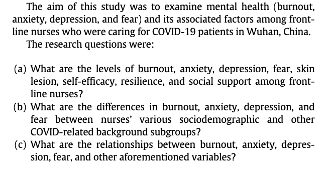
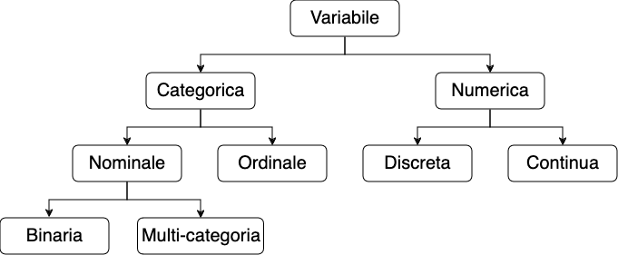
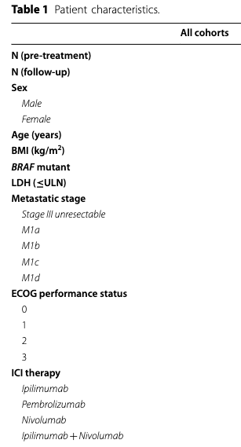

### Lezione 3
# I dati
## &nbsp;

---
## Obiettivi di apprendimento

- Saper definire cos'e' un dato
- Conoscere le differenze tra i diversi tipi di dati
- Saper pianificare una raccolta dati 

---

## &nbsp;&nbsp;&nbsp;&nbsp;&nbsp;&nbsp;&nbsp;&nbsp;&nbsp;&nbsp;&nbsp;&nbsp;&nbsp;&nbsp;&nbsp;&nbsp;&nbsp;&nbsp;&nbsp;&nbsp;&nbsp;&nbsp;&nbsp;&nbsp;&nbsp; dato $\longleftrightarrow$ informazione

---
## Le fonti dei dati

* Rilevazioni periodiche
* Sondaggi
* Esperimenti
* Fonti esterne

<!-- FIXME 
Ogni ospedale o struttura ambulatoriale o assistenziale raccoglie, per controllare il proprio funzionamento dati amministrativi (HAD) 

Informazioni che non sono presenti nei rilevamenti. Per esempio nelle SDO non si dice come uno sia arrivato in clinica

Alcuni dati non possono essere raccolti con dei semplici sondaggi. Per esempio se volessimo sapere quale terapia e' meglio per curare la depressione
-->

---
## Raccogliamo dei dati?

&nbsp;&nbsp;&nbsp;&nbsp;
 

<!-- Vediamo come si passa dalla fase "Problem" alla fase "Planning" -->

---
## Raccogliamo dei dati?

- Quali dati raccogliere? 

 Think &nbsp;&nbsp;&nbsp; <button id="countdown_think"></button>

<!-- Think -->

---
## Raccogliamo dei dati?

- Quali dati raccogliere? 

 Pair &nbsp;&nbsp;&nbsp; <button id="countdown_pair"></button>

<!-- Pair -->
---
## Raccogliamo dei dati?

- Quali dati raccogliere? 

 Share &nbsp;&nbsp;&nbsp; <button id="countdown_share"></button>

<!-- Share -->
---
## Raccogliamo dei dati?

- Quali dati raccogliere?
- In che formato?

&nbsp;&nbsp;&nbsp;&nbsp;&nbsp;&nbsp;&nbsp;&nbsp;&nbsp; :pushpin: &nbsp;&nbsp;&nbsp;  Esempio: eta'

---
## Raccogliamo dei dati?

- Quali dati raccogliere?
- In che formato?

&nbsp;&nbsp;&nbsp;&nbsp;&nbsp;&nbsp;&nbsp;&nbsp;&nbsp; :pushpin: &nbsp;&nbsp;&nbsp; Esempio: eta'
&nbsp;&nbsp;&nbsp;&nbsp;&nbsp;&nbsp;&nbsp;&nbsp;&nbsp; &nbsp;&nbsp;&nbsp;&nbsp;&nbsp;&nbsp;&nbsp;&nbsp;&nbsp; - Data di nascita + data visita

---
## Raccogliamo dei dati?

- Quali dati raccogliere?
- In che formato?

&nbsp;&nbsp;&nbsp;&nbsp;&nbsp;&nbsp;&nbsp;&nbsp;&nbsp; :pushpin: &nbsp;&nbsp;&nbsp; Esempio: eta'
&nbsp;&nbsp;&nbsp;&nbsp;&nbsp;&nbsp;&nbsp;&nbsp;&nbsp; &nbsp;&nbsp;&nbsp;&nbsp;&nbsp;&nbsp;&nbsp;&nbsp;&nbsp; - Data di nascita + data visita
&nbsp;&nbsp;&nbsp;&nbsp;&nbsp;&nbsp;&nbsp;&nbsp;&nbsp; &nbsp;&nbsp;&nbsp;&nbsp;&nbsp;&nbsp;&nbsp;&nbsp;&nbsp; - Quanti hanni hai?

---
## Raccogliamo dei dati?

- Quali dati raccogliere?
- In che formato?

&nbsp;&nbsp;&nbsp;&nbsp;&nbsp;&nbsp;&nbsp;&nbsp;&nbsp; :pushpin: &nbsp;&nbsp;&nbsp;  Esempio: eta'
&nbsp;&nbsp;&nbsp;&nbsp;&nbsp;&nbsp;&nbsp;&nbsp;&nbsp; &nbsp;&nbsp;&nbsp;&nbsp;&nbsp;&nbsp;&nbsp;&nbsp;&nbsp; - Data di nascita + data visita
&nbsp;&nbsp;&nbsp;&nbsp;&nbsp;&nbsp;&nbsp;&nbsp;&nbsp; &nbsp;&nbsp;&nbsp;&nbsp;&nbsp;&nbsp;&nbsp;&nbsp;&nbsp; - Quanti hanni hai?
&nbsp;&nbsp;&nbsp;&nbsp;&nbsp;&nbsp;&nbsp;&nbsp;&nbsp; &nbsp;&nbsp;&nbsp;&nbsp;&nbsp;&nbsp;&nbsp;&nbsp;&nbsp; - A quale di queste fasce d'eta' appartieni?

---
## I tipi di dati

<!-- Andiamo a dividere i dati in variabili quantitative (o numeriche) o qualitative (o categorighe) 

Numeriche: 
- continue (altezza, peso, BMI, temperatura corporea)
- discrete (numero di pazienti ammessi in PS)

Categoriche si dividono in 2 classi
- Nominali (categorie che non possono essere ordinate) -> due categorie binarie (diabete si/no), piu' categorie (gruppo sanguigno)
- Ordinali (categorie che non possono essere ordinate) -> dati che rappresentano categorie ordinate (giudizi scolastici ("Insufficiente", "Sufficiente", "Buono", "Ottimo:"), "Sottopeso", "Normopeso" ...) -->

---
### Esercizio #1

:question: &nbsp;&nbsp;&nbsp; Di che tipo sono i dati 
&nbsp;&nbsp;&nbsp;&nbsp;&nbsp;&nbsp;&nbsp;&nbsp;&nbsp; in questa tabella?

<button id="countdown_exercise"></button>

	
Visconti A., *et al.*, Total serum *N*‐glycans associate with response to immune checkpoint inhibition therapy and survival in patients with advanced melanoma, BMC Cancer, 2023 doi:10.1186/s12885-023-10511-3

<!-- 
Dopo che lo hanno fatto, farli votare e discutere

Lactate dehydrogenase, dichotomized according to the upper limit of normal for each centre.
-->
 
---
### Esercizio #1 -- Soluzione

:question: &nbsp;&nbsp;&nbsp; Di che tipo sono i dati 
&nbsp;&nbsp;&nbsp;&nbsp;&nbsp;&nbsp;&nbsp;&nbsp;&nbsp; in questa tabella?

	
Visconti A., *et al.*, Total serum *N*‐glycans associate with response to immune checkpoint inhibition therapy and survival in patients with advanced melanoma, BMC Cancer, 2023 doi:10.1186/s12885-023-10511-3

<!-- Sesso: Binaria
Eta'/BMI: continua
BRAF: binaria
Metastatic stage: Ordinale
ECOG score: ordinale (o fully active  5 morto, 4 completamente disabile, 3 capable of only limited selfcare)
ICI teraphy: categorico (con piu' categorie) 
N: discreto

Lactate dehydrogenase, dichotomized according to the upper limit of normal for each centre.
-->

------

## &nbsp;&nbsp;&nbsp;&nbsp;&nbsp;&nbsp;&nbsp;&nbsp;&nbsp;&nbsp;&nbsp;&nbsp;&nbsp;&nbsp;&nbsp;&nbsp;&nbsp;&nbsp;&nbsp;&nbsp;&nbsp;&nbsp;&nbsp;&nbsp;&nbsp; dato $\longleftrightarrow$ variabile

<!-- Le caratteristiche di una popolazione che differiscono da individuo a
individuo sono chiamate variabili (sesso, altezza, numero dei battiti
cardiaci, titolo di studio, età,…) 

the inevitable differences that occur between measurements or observations, some of which may be explained by known factors, and the remainder attributed to random noise.

-->

---
### Exercizio #2

:question: &nbsp;&nbsp;&nbsp; Il sesso e' una variabile categorica dicotomica

&nbsp;&nbsp;&nbsp;&nbsp;&nbsp;&nbsp;&nbsp;&nbsp;&nbsp; a) Vero  &nbsp;&nbsp;&nbsp;&nbsp; b) Falso &nbsp;&nbsp;&nbsp;&nbsp; c) Servono piu' elementi per decidere

:question: &nbsp;&nbsp;&nbsp; Il numero di figli e' una variabile quantitativa discreta 

&nbsp;&nbsp;&nbsp;&nbsp;&nbsp;&nbsp;&nbsp;&nbsp;&nbsp; a) Vero  &nbsp;&nbsp;&nbsp;&nbsp; b) Falso &nbsp;&nbsp;&nbsp;&nbsp; c) Servono piu' elementi per decidere

:question: &nbsp;&nbsp;&nbsp; L'indice di massa corporea (BMI) e' una variabile qualitativa 
&nbsp;&nbsp;&nbsp;&nbsp;&nbsp;&nbsp;&nbsp;&nbsp;&nbsp;&nbsp;multi-categoria

&nbsp;&nbsp;&nbsp;&nbsp;&nbsp;&nbsp;&nbsp;&nbsp;&nbsp; a) Vero  &nbsp;&nbsp;&nbsp;&nbsp; b) Falso &nbsp;&nbsp;&nbsp;&nbsp; c) Servono piu' elementi per decidere

<button id="countdown_exercise_2"></button>

---
### Exercizio #2 -- Soluzione

:question: &nbsp;&nbsp;&nbsp; Il sesso e' una variabile categorica dicotomica

&nbsp;&nbsp;&nbsp;&nbsp;&nbsp;&nbsp;&nbsp;&nbsp;&nbsp; a) Vero &nbsp; :white_check_mark:  &nbsp;&nbsp;&nbsp;&nbsp; b) Falso &nbsp;&nbsp;&nbsp;&nbsp; c) Servono piu' elementi per decidere

:question: &nbsp;&nbsp;&nbsp; Il numero di figli e' una variabile quantitativa discreta 

&nbsp;&nbsp;&nbsp;&nbsp;&nbsp;&nbsp;&nbsp;&nbsp;&nbsp; a) Vero &nbsp; :white_check_mark:  &nbsp;&nbsp;&nbsp;&nbsp; b) Falso &nbsp;&nbsp;&nbsp;&nbsp; c) Servono piu' elementi per decidere

:question: &nbsp;&nbsp;&nbsp; L'indice di massa corporea (BMI) e' una variabile qualitativa 
&nbsp;&nbsp;&nbsp;&nbsp;&nbsp;&nbsp;&nbsp;&nbsp;&nbsp;&nbsp;multi-categoria

&nbsp;&nbsp;&nbsp;&nbsp;&nbsp;&nbsp;&nbsp;&nbsp;&nbsp; a) Vero  &nbsp;&nbsp;&nbsp;&nbsp; b) Falso &nbsp; :white_check_mark:  &nbsp;&nbsp;&nbsp;&nbsp; c) Servono piu' elementi per decidere 
 

---
## Ma quali dati sono stati raccolti ?

 

[Table 1](https://www.thelancet.com/action/showFullTableHTML?isHtml=true&tableId=tbl0001&pii=S2589-5370%2820%2930168-1)
[Table 2](https://www.thelancet.com/action/showFullTableHTML?isHtml=true&tableId=tbl0002&pii=S2589-5370%2820%2930168-1)

---
### Cosa abbiamo imparato in questa lezione?

- Che l'informazione (o dati) viene codificata in variabili, la cui variabilita' (differenze che vediamo tra le osservazioni) dipende sia da fattori conosciuti o conoscibili sia da effetti casuali (random noise)
- Come pianificare la raccolta dati a partire da un problema
- Le differenze tra i diversi tipi di dati

