### Lezione 4
# Tabelle di frequenza e misure di centralita' e dispersione
## &nbsp;

---
## Obiettivi di apprendimento

- Decidere qual e' l'approccio migliore per riassumere i diversi tipi di dati
- Saper costruire e interpretare una tabella di frequenza
- Saper calcolare e interpretare diverse misure di centralita' e dispersione
- Saper interpretare tabelle in articoli scientifici

---
### I tipi di dato

:question: &nbsp;&nbsp;&nbsp; Di che tipo sono i dati 
&nbsp;&nbsp;&nbsp;&nbsp;&nbsp;&nbsp;&nbsp;&nbsp;&nbsp; in questa tabella?

	
Visconti A., *et al.*, Total serum *N*‐glycans associate with response to immune checkpoint inhibition therapy and survival in patients with advanced melanoma, BMC Cancer, 2023 doi:10.1186/s12885-023-10511-3

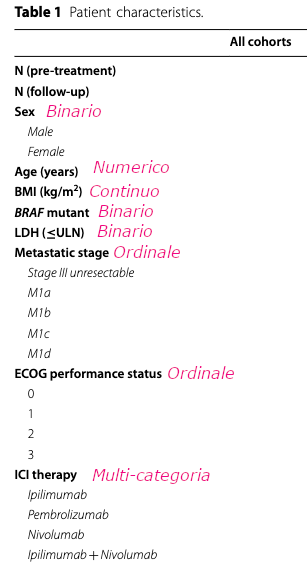

<!-- Sesso: Binaria
Eta'/BMI: continua
BRAF: binaria
Metastatic stage: Ordinale
ECOG score: ordinale (o fully active  5 morto, 4 completamente disabile, 3 capable of only limited selfcare)
ICI teraphy: categorico (con piu' categorie) 
N: discreto

Lactate dehydrogenase, dichotomized according to the upper limit of normal for each centre.
-->

---
## Perche' ci interessa?

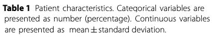

	
Visconti A., *et al.*, Total serum *N*‐glycans associate with response to immune checkpoint inhibition therapy and survival in patients with advanced melanoma, BMC Cancer, 2023 doi:10.1186/s12885-023-10511-3

<!-- Perche' il modo in cui andiamo prima a presentare e poi ad analizzare una variabile dipende dal suop tipo.

Numeriche media/SD, categoriche N/% -->
---
## Variabili categoriche

#### Tabella di frequenza

* Descrive le **modalita'**
* frequenza assoluta (numero)
* frequenza relativa (percentuale)

	
Visconti A., *et al.*, Total serum *N*‐glycans associate with response to immune checkpoint inhibition therapy and survival in patients with advanced melanoma, BMC Cancer, 2023 doi:10.1186/s12885-023-10511-3

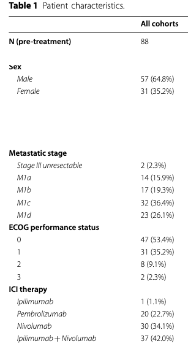

<!-- AssolutaL: numero di volte in cui una certa modalità si manifesta nel campione  
possono assumere valori compresi tra 0 e n (dimensione del campione)
la loro somma è pari a n

Relativa: rapporto tra la frequenza assoluta con cui si manifesta una modalità e la numerosità totale del campione
possono assumere valori compresi tra 0 e 1 (o 0 e 100)
la loro somma è pari a 1

Frequenze assolute e relative forniscono le stesse informazioni sulla distribuzione. 

-->
---
## Esercizio #1 

:question: &nbsp;&nbsp;&nbsp; Quale sesso e' predominante?
&nbsp;&nbsp;&nbsp;&nbsp;&nbsp;&nbsp;&nbsp;&nbsp;&nbsp; 

	
Visconti A., *et al.*, Total serum *N*‐glycans associate with response to immune checkpoint inhibition therapy and survival in patients with advanced melanoma, BMC Cancer, 2023 doi:10.1186/s12885-023-10511-3

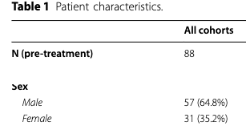

<button id="countdown_exercize_1"></button>

<!-- Le frequenze relative: facilitano la percezione del peso delle modalità -->

---
## Esercizio #1  -- Soluzione

:question: &nbsp;&nbsp;&nbsp; Quale sesso e' predominante?
&nbsp;&nbsp;&nbsp;&nbsp;&nbsp;&nbsp;&nbsp;&nbsp;&nbsp; 

	
Visconti A., *et al.*, Total serum *N*‐glycans associate with response to immune checkpoint inhibition therapy and survival in patients with advanced melanoma, BMC Cancer, 2023 doi:10.1186/s12885-023-10511-3

<!-- Le frequenze relative: facilitano la percezione del peso delle modalità -->

---
## Tabelle di contingenza

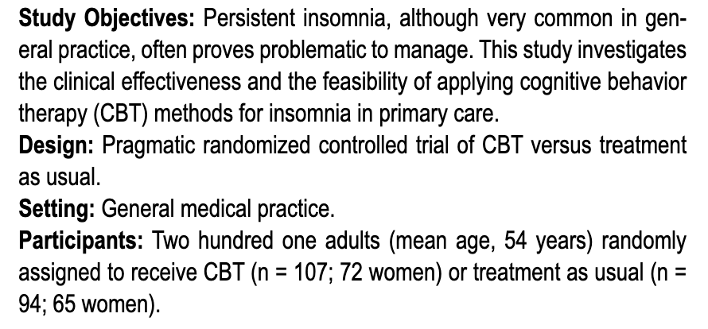

	
Espie. CA, *et al.*, Randomized Clinical Effectiveness Trial of Nurse-Administered Small-Group Cognitive Behavior Therapy for Persistent Insomnia in General Practice, Sleep, 2007, [doi:10.1186/s12885-023-10511-3](https://doi.org/10.1093/sleep/30.5.574)

---
## Esercizio #2

:question: &nbsp;&nbsp;&nbsp; Completa la tabella con le corrette frequenze assolute e percentuali
&nbsp;&nbsp;&nbsp;&nbsp;&nbsp;&nbsp;&nbsp;&nbsp;&nbsp;  usando le informazioni contenute nell'abstact

| Sesso/N | CBT | Standard | Totale |
| ----: | ----- | ---- | ----|
| Maschi |  |  |  |
| Femmine |  |  |  |
| Totale |  |  |  |

<button id="countdown_exercize_2"></button>

---
## Esercizio #2 -- Soluzione

:question: &nbsp;&nbsp;&nbsp; Completa la tabella con le corrette frequenze assolute e percentuali
&nbsp;&nbsp;&nbsp;&nbsp;&nbsp;&nbsp;&nbsp;&nbsp;&nbsp;  usando le informazioni contenute nell'abstact

| Sesso/N | CBT | Standard | Totale |
| ----: | -----: | ----: | ----: |
| Maschi |  |  |  |
| Femmine | 72 |  65 |  |
| Totale | 107 | 94  | 201 |

---
## Esercizio #2 -- Soluzione

:question: &nbsp;&nbsp;&nbsp; Completa la tabella con le corrette frequenze assolute e percentuali
&nbsp;&nbsp;&nbsp;&nbsp;&nbsp;&nbsp;&nbsp;&nbsp;&nbsp;  usando le informazioni contenute nell'abstact

| Sesso/N | CBT | Standard | Totale |
| ----: | -----: | ----: | ----: |
| Maschi |  35 |  29 |  |
| Femmine | 72 |  65 |  |
| Totale | 107 | 94  | 201 |

---
## Esercizio #2 -- Soluzione

:question: &nbsp;&nbsp;&nbsp; Completa la tabella con le corrette frequenze assolute e percentuali
&nbsp;&nbsp;&nbsp;&nbsp;&nbsp;&nbsp;&nbsp;&nbsp;&nbsp;  usando le informazioni contenute nell'abstact

| Sesso/N | CBT | Standard | Totale |
| ----: | -----: | ----: | ----: |
| Maschi |  35 |  29 | 64 |
| Femmine | 72 |  65 | 137 |
| Totale | 107 | 94  | 201 |

---
## Esercizio #2 -- Soluzione

:question: &nbsp;&nbsp;&nbsp; Completa la tabella con le corrette frequenze assolute e percentuali
&nbsp;&nbsp;&nbsp;&nbsp;&nbsp;&nbsp;&nbsp;&nbsp;&nbsp;  usando le informazioni contenute nell'abstact

| Sesso/N | CBT | Standard | Totale |
| ----: | -----: | ----: | ----: |
| Maschi |  35 (35/107) |  29 (29/94) | 64  (64/201)|
| Femmine | 72 (72/107) |  65 (65/94) | 137 (64/201) |
| Totale | 107 | 94  | 201 |

---
## Esercizio #2 -- Soluzione

:question: &nbsp;&nbsp;&nbsp; Completa la tabella con le corrette frequenze assolute e percentuali
&nbsp;&nbsp;&nbsp;&nbsp;&nbsp;&nbsp;&nbsp;&nbsp;&nbsp;  usando le informazioni contenute nell'abstact

| Sesso/N | CBT | Standard | Totale |
| ----: | -----: | ----: | ----: |
| Maschi |  35 (32.7%) |  29 (30.9%) | 64  (31.8%)|
| Femmine | 72 (67.3%) |  65 (69.1%) | 137 (68.2%1) |
| Totale | 107 | 94  | 201 |

<!-- Le frequenze relative consentono di confrontare la distribuzione di una variabile in campioni di diversa numerosità -->

---
## Esercizio #3 

:question: &nbsp;&nbsp;&nbsp; I due sessi sono equalmente distribuiti nel campione?
&nbsp;&nbsp;&nbsp;&nbsp;&nbsp;&nbsp;&nbsp;&nbsp;&nbsp; a) Vero  &nbsp;&nbsp;&nbsp;&nbsp; b) Falso &nbsp;&nbsp;&nbsp;&nbsp; c) Servono piu' elementi per decidere

:question: &nbsp;&nbsp;&nbsp; I due sessi sono equalmente distribuiti nei due bracci dell'esperimento?
&nbsp;&nbsp;&nbsp;&nbsp;&nbsp;&nbsp;&nbsp;&nbsp;&nbsp; a) Vero  &nbsp;&nbsp;&nbsp;&nbsp; b) Falso &nbsp;&nbsp;&nbsp;&nbsp; c) Servono piu' elementi per decidere

| Sesso/N | CBT | Standard | Totale |
| ----: | -----: | ----: | ----: |
| Maschi |  35 (32.7%) |  29 (30.9%) | 64  (31.8%)|
| Femmine | 72 (67.3%) |  65 (69.1%) | 137 (68.2%1) |
| Totale | 107 | 94  | 201 |

<button id="countdown_exercize_3"></button>

<!-- Le frequenze relative consentono di confrontare la distribuzione di una variabile in campioni di diversa numerosità -->

---
## Esercizio #3 -- Soluzione

:question: &nbsp;&nbsp;&nbsp; I due sessi sono equalmente distribuiti nel campione?
&nbsp;&nbsp;&nbsp;&nbsp;&nbsp;&nbsp;&nbsp;&nbsp;&nbsp; a) Vero  &nbsp;&nbsp;&nbsp;&nbsp; b) Falso &nbsp; :white_check_mark: &nbsp;&nbsp;&nbsp;&nbsp; c) Servono piu' elementi per decidere

:question: &nbsp;&nbsp;&nbsp; I due sessi sono equalmente distribuiti nei due bracci dell'esperimento?
&nbsp;&nbsp;&nbsp;&nbsp;&nbsp;&nbsp;&nbsp;&nbsp;&nbsp; a) Vero &nbsp; :white_check_mark:  &nbsp;&nbsp;&nbsp;&nbsp; b) Falso &nbsp;&nbsp;&nbsp;&nbsp; c) Servono piu' elementi per decidere

| Sesso/N | CBT | Standard | Totale |
| ----: | -----: | ----: | ----: |
| Maschi |  35 (32.7%) |  29 (30.9%) | 64  (31.8%)|
| Femmine | 72 (67.3%) |  65 (69.1%) | 137 (68.2%1) |
| Totale | 107 | 94  | 201 |

<!-- Le frequenze relative consentono di confrontare la distribuzione di una variabile in campioni di diversa numerosità -->

---
## Discretizzazione

- Da una serie di valori continui a intervalli (o classi)
- La scelta del numero di classi e degli estremi è arbitraria
- Le classi devono essere mutualmente esclusive
- Riportate anche le classi nulle (frequenza zero)

<!-- Frequenze si usato per dati qualitativi, ma cosa facciamo se abbiamo dati quantitativi?

In questo caso si possono ancora usare, ma la frequenza non è riferita ad un singolo valore, ma ad intervalli (o classi) di valori. 

La scelta del numero di classi e degli estremi è arbitraria. Entrambi vengono determinati in base a criteri di convenienza.

Il numero di classi può oscillare e dipende dalla numerosità dei dati (in genere utilizzare da 5 a 20 classi).

Scegliere estremi che siano clinicamente/biologicamente significativi o naturali e, preferibilmente, di uguale ampiezza.

Le classi debbono essere mutuamente esclusive (fate attenzione agli estremi!!).

-->

---
## Discretizzazione

:pushpin: &nbsp;&nbsp;&nbsp; $\text{IMC (BMI)} = \frac{\text{peso}_\text{kg}}{\text{altezza}_m^2}$ 

| IMC (BMI)	| Classificazione
| ----: | -----: |
|< 18,5 |	Sottopeso
18,5 – 24, 9 |	Normopeso
25,0 – 29,9	| Sovrappeso
30,0 – 34,9	 | Obesità 1° grado
35,0 – 39,9	| Obesità 2° grado
| > 39,9	| Obesità 3° grado

---
## Discretizzazione

	
Visconti A., *et al.*, Total serum *N*‐glycans associate with response to immune checkpoint inhibition therapy and survival in patients with advanced melanoma, BMC Cancer, 2023 doi:10.1186/s12885-023-10511-3

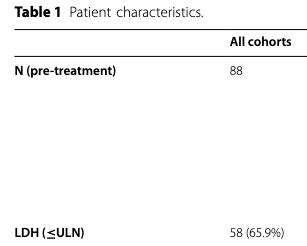

<!-- Per le variabili quantitative è necessario descrivere i dati raccolti anche numericamente… Poiché generalmente il problema è che i dati sono tanti, può risultare più semplice sintetizzarli e ridurli a pochi numeri, più facili da comprendere, utilizzare e comunicare.

Le tabelle di frequenza dopo una procedura di discretizzazione non sono pero' il modo piu' consono per rappresentare i dati quantitativi. E' meglio usare
-->

<!-- ---
## Discretizzazione

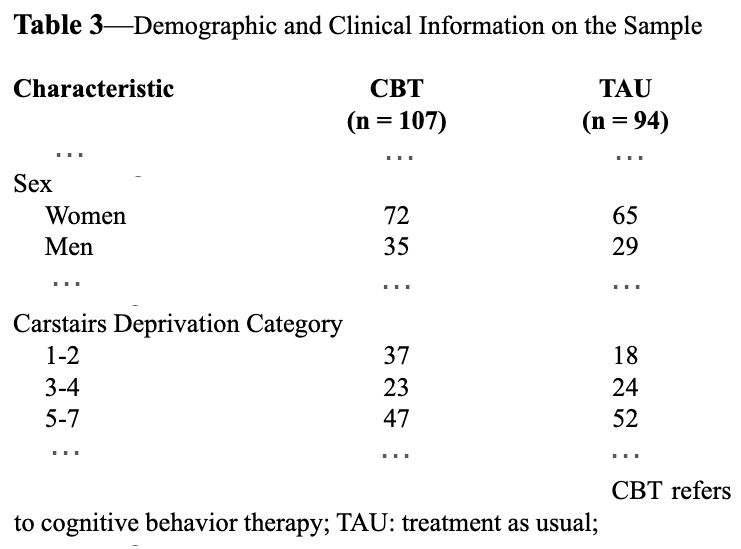

<!-- Deprivation index misura quanto un'area e' deprivata, e si basa su un indice costrioto negli anni 60 basato su 4 variabili:
ow social class, lack of car ownership, overcrowding and male unemployment 

piu' e' alto piu' l'area e' deprived, piu' le mnorti, soprattutto in gionave eta' sono alte

Attenti che non e' legato alla persona ma al posto dove vive 
 --> -->

---
## Variabili numeriche

	
Visconti A., *et al.*, Total serum *N*‐glycans associate with response to immune checkpoint inhibition therapy and survival in patients with advanced melanoma, BMC Cancer, 2023 doi:10.1186/s12885-023-10511-3

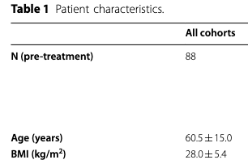

<!-- Per le variabili quantitative è necessario descrivere i dati raccolti anche numericamente… Poiché generalmente il problema è che i dati sono tanti, può risultare più semplice sintetizzarli e ridurli a pochi numeri, più facili da comprendere, utilizzare e comunicare.

Le tabelle di frequenza dopo una procedura di discretizzazione non sono pero' il modo piu' consono per rappresentare i dati quantitativi. E' meglio usare
-->
---

## Misure di centralita' e dispersione

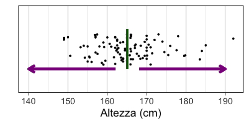

<!--  
Tendenza centrale (o posizione) -> Individuano il valore intorno al quale i dati sono raggruppati

Dispersione o variabilita'  -> Forniscono un’indicazione della dispersione delle osservazioni intorno al valore centrale -->

---
## Misure di centralita': la moda

:dart: &nbsp;&nbsp;&nbsp; L'elemeno piu' frequente

:pushpin: &nbsp;&nbsp;&nbsp; $x= \{1, 1, 1, 3, 4, 4, 7, 8, 8, 9, 9\}$
&nbsp;&nbsp;&nbsp;&nbsp;&nbsp;&nbsp;&nbsp;&nbsp;&nbsp; $\text{moda}(x)=1$

---
## Esercizio #4

:question: &nbsp;&nbsp;&nbsp; Qual e' la moda dei seguenti insiemi?

&nbsp;&nbsp;&nbsp;&nbsp;&nbsp;&nbsp;&nbsp;&nbsp;&nbsp;  $y= \{1, 1, 1, 3, 4, 4, 4, 7, 8, 8, 9, 9\}$
&nbsp;&nbsp;&nbsp;&nbsp;&nbsp;&nbsp;&nbsp;&nbsp;&nbsp; $\text{moda}(y)= \text{ } ?$

&nbsp;&nbsp;&nbsp;&nbsp;&nbsp;&nbsp;&nbsp;&nbsp;&nbsp;  $z= \{1, 3, 4, 7, 8, 9, 11, 17, 21, 42\}$
&nbsp;&nbsp;&nbsp;&nbsp;&nbsp;&nbsp;&nbsp;&nbsp;&nbsp; $\text{moda}(z)= \text{ } ?$

<button id="countdown_exercize_4"></button>

<!-- se ciascun valore si presenta una volta sola, le nostre osservazioni non hanno moda

Si usa soprattutto per i dati categorici -->

---
## Esercizio #4 -- Soluzione

:question: &nbsp;&nbsp;&nbsp; Qual e' la moda dei seguenti insiemi?

&nbsp;&nbsp;&nbsp;&nbsp;&nbsp;&nbsp;&nbsp;&nbsp;&nbsp;  $y= \{1, 1, 1, 3, 4, 4, 4, 7, 8, 8, 9, 9\}$
&nbsp;&nbsp;&nbsp;&nbsp;&nbsp;&nbsp;&nbsp;&nbsp;&nbsp; $\text{moda}(y)=1 \land   4$

&nbsp;&nbsp;&nbsp;&nbsp;&nbsp;&nbsp;&nbsp;&nbsp;&nbsp;  $z= \{1, 3, 4, 7, 8, 9, 11, 17, 21, 42\}$
&nbsp;&nbsp;&nbsp;&nbsp;&nbsp;&nbsp;&nbsp;&nbsp;&nbsp; $\text{moda}(z)= \text{Non esiste}$

---
## Misure di centralita': la mediana

:dart: &nbsp;&nbsp;&nbsp;Il valore "in mezzo"

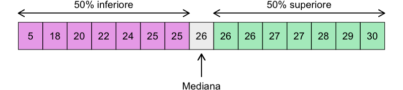

:warning: I dati devono essere ordinati!

<!-- Divide l'insieme di dati in due parti uguali, con il numero osservazioni <= mediana uguale a quello >= -->

---
## Misure di centralita': la mediana

:dart: &nbsp;&nbsp;&nbsp;Il valore "in mezzo"

:pushpin: &nbsp;&nbsp;&nbsp;  $n=7,  x= \{1, 3, 3, 6, 7, 8, 9\}$ 

&nbsp;&nbsp;&nbsp;&nbsp;&nbsp;&nbsp;&nbsp;&nbsp;&nbsp; $\text{mediana}(x)=x_{(n+1)/2} = x_{(7+1)/2}=x_4=6$ 

:pushpin: &nbsp;&nbsp;&nbsp;  $n=8,  x= \{1, 2, 3, 4, 5, 6, 8, 9\}$

&nbsp;&nbsp;&nbsp;&nbsp;&nbsp;&nbsp;&nbsp;&nbsp;&nbsp; $\text{mediana}(x)={\frac {x_{(n/2)}+x_{((n/2)+1)}}{2}} = {\frac {x_{(8/2)}+x_{((8/2)+1)}}{2}}$
&nbsp;&nbsp;&nbsp;&nbsp;&nbsp;&nbsp;&nbsp;&nbsp;&nbsp;&nbsp;&nbsp;&nbsp;&nbsp;&nbsp;&nbsp;&nbsp;&nbsp;&nbsp;&nbsp;&nbsp;&nbsp;&nbsp;&nbsp;&nbsp;&nbsp;&nbsp;&nbsp;&nbsp;&nbsp;&nbsp;&nbsp;&nbsp;&nbsp;&nbsp;&nbsp; $={\frac {x_{4}+x_{5}}{2}} = {\frac {4+5}{2}} = 4.5$ 

:warning: I dati devono essere ordinati!

<!-- Quando il numero di osservazioni e' pari, ci sono due valori mediani, e in questo caso si prende la loro media aritmetica -->

---
## Esercizio #5

:question: &nbsp;&nbsp;&nbsp; Quali sono le mediane di questi insiemi?

&nbsp;&nbsp;&nbsp;&nbsp;&nbsp;&nbsp;&nbsp;&nbsp;&nbsp;  $n=7,  y= \{1, 3, 3, 6, 7, 8, 9\}$ 
&nbsp;&nbsp;&nbsp;&nbsp;&nbsp;&nbsp;&nbsp;&nbsp;&nbsp; $\text{mediana}(y)= \text{ ?}$ 

&nbsp;&nbsp;&nbsp;&nbsp;&nbsp;&nbsp;&nbsp;&nbsp;&nbsp;  $n=7,  z= \{1, 3, 3, 6, 7, 8, 109\}$ 
&nbsp;&nbsp;&nbsp;&nbsp;&nbsp;&nbsp;&nbsp;&nbsp;&nbsp; $\text{mediana}(z)=\text{ ?}$ 

<button id="countdown_exercize_5"></button>

<!-- La mediana non e' influenzata da valori anomali o estremi (outliers) -->

---
## Esercizio #5 -- Soluzione

:question: &nbsp;&nbsp;&nbsp; Quali sono le mediane di questi insiemi?

&nbsp;&nbsp;&nbsp;&nbsp;&nbsp;&nbsp;&nbsp;&nbsp;&nbsp;  $n=7,  y= \{1, 3, 3, 6, 7, 8, 9\}$ 
&nbsp;&nbsp;&nbsp;&nbsp;&nbsp;&nbsp;&nbsp;&nbsp;&nbsp; $\text{mediana}(y)=y_{(n+1)/2} = y_{(7+1)/2}=y_4=6$ 

&nbsp;&nbsp;&nbsp;&nbsp;&nbsp;&nbsp;&nbsp;&nbsp;&nbsp;  $n=7,  z= \{1, 3, 3, 6, 7, 8, 109\}$ 
&nbsp;&nbsp;&nbsp;&nbsp;&nbsp;&nbsp;&nbsp;&nbsp;&nbsp; $\text{mediana}(z)=\text{ ?}$ 

:warning: I dati devono essere ordinati!

<!-- La mediana non e' influenzata da valori anomali o estremi (outliers) -->

---
## Esercizio #5 -- Soluzione

:question: &nbsp;&nbsp;&nbsp; Quali sono le mediane di questi insiemi?

&nbsp;&nbsp;&nbsp;&nbsp;&nbsp;&nbsp;&nbsp;&nbsp;&nbsp;  $n=7,  y= \{1, 3, 3, 6, 7, 8, 9\}$ 
&nbsp;&nbsp;&nbsp;&nbsp;&nbsp;&nbsp;&nbsp;&nbsp;&nbsp; $\text{mediana}(y)=y_{(n+1)/2} = y_{(7+1)/2}=y_4=6$ 

&nbsp;&nbsp;&nbsp;&nbsp;&nbsp;&nbsp;&nbsp;&nbsp;&nbsp;  $n=7,  z= \{1, 3, 3, 6, 7, 8, 109\}$ 
&nbsp;&nbsp;&nbsp;&nbsp;&nbsp;&nbsp;&nbsp;&nbsp;&nbsp; $\text{mediana}(z)=z_{(n+1)/2} = z_{(7+1)/2}=z_4=6$ 

:warning: I dati devono essere ordinati!

<!-- La mediana non e' influenzata da valori anomali o estremi (outliers) -->

---
## Misure di centralita': la mediana

:question: &nbsp;&nbsp;&nbsp; Cosa ci mostra questo esempio?

&nbsp;&nbsp;&nbsp;&nbsp;&nbsp;&nbsp;&nbsp;&nbsp;&nbsp;  $n=7,  y= \{1, 3, 3, 6, 7, 8, 9\}$ 
&nbsp;&nbsp;&nbsp;&nbsp;&nbsp;&nbsp;&nbsp;&nbsp;&nbsp; $\text{mediana}(y)=y_{(n+1)/2} = y_{(7+1)/2}=y_4=6$ 

&nbsp;&nbsp;&nbsp;&nbsp;&nbsp;&nbsp;&nbsp;&nbsp;&nbsp;  $n=7,  z= \{1, 3, 3, 6, 7, 8, 109\}$ 
&nbsp;&nbsp;&nbsp;&nbsp;&nbsp;&nbsp;&nbsp;&nbsp;&nbsp; $\text{mediana}(z)=z_{(n+1)/2} = z_{(7+1)/2}=z_4=6$ 

<!-- La mediana non e' influenzata da valori anomali o estremi (outliers) -->

---
## Quartili

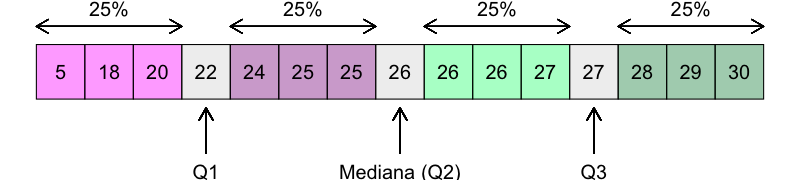

<!-- Mentre la mediana divide i dati in due meta' esatte, molto usati sono anche i quartili, che dividono i dati in 4 parti uguali -->

:warning: I dati devono essere ordinati!

---
## Esercizio #6

:question: &nbsp;&nbsp;&nbsp; Quali sono il primo e terzo quartile di questi insiemi?

&nbsp;&nbsp;&nbsp;&nbsp;&nbsp;&nbsp;&nbsp;&nbsp;&nbsp; $y= \{1, 3, 3, 6, 7, 8, 9\}$  
&nbsp;&nbsp;&nbsp;&nbsp;&nbsp;&nbsp;&nbsp;&nbsp;&nbsp; $\text{Q1}(y)= \text{ ?}$ 
&nbsp;&nbsp;&nbsp;&nbsp;&nbsp;&nbsp;&nbsp;&nbsp;&nbsp; $\text{Q3}(y)= \text{ ?}$

&nbsp;&nbsp;&nbsp;&nbsp;&nbsp;&nbsp;&nbsp;&nbsp;&nbsp;$z= \{1, 2, 3, 4, 5, 6, 8, 9\}$
&nbsp;&nbsp;&nbsp;&nbsp;&nbsp;&nbsp;&nbsp;&nbsp;&nbsp; $\text{Q1}(z)= \text{ ?}$ 
&nbsp;&nbsp;&nbsp;&nbsp;&nbsp;&nbsp;&nbsp;&nbsp;&nbsp; $\text{Q3}(z)= \text{ ?}$

<button id="countdown_exercize_6"></button>

---
## Esercizio #6 -- Soluzione

:question: &nbsp;&nbsp;&nbsp; Quali sono il primo e terzo quartile di questi insiemi?

&nbsp;&nbsp;&nbsp;&nbsp;&nbsp;&nbsp;&nbsp;&nbsp;&nbsp; $y= \{1, 3, 3, [6], 7, 8, 9\}$  
&nbsp;&nbsp;&nbsp;&nbsp;&nbsp;&nbsp;&nbsp;&nbsp;&nbsp; $\text{Q1}(y) = \text{mediana}(y)[1:4] = \text{ ?}$ 
&nbsp;&nbsp;&nbsp;&nbsp;&nbsp;&nbsp;&nbsp;&nbsp;&nbsp; $\text{Q3}(y) = \text{mediana}(y)[4:7] = \text{ ?}$ 

&nbsp;&nbsp;&nbsp;&nbsp;&nbsp;&nbsp;&nbsp;&nbsp;&nbsp;$z= \{1, 2, 3, 4, 5, 6, 8, 9\}$
&nbsp;&nbsp;&nbsp;&nbsp;&nbsp;&nbsp;&nbsp;&nbsp;&nbsp; $\text{Q1}(z)= \text{ ?}$ 
&nbsp;&nbsp;&nbsp;&nbsp;&nbsp;&nbsp;&nbsp;&nbsp;&nbsp; $\text{Q3}(z)= \text{ ?}$

<!-- &nbsp;&nbsp;&nbsp;&nbsp;&nbsp;&nbsp;&nbsp;&nbsp;&nbsp;$z= \{1, 2, 3, [4, 5], 6, 8, 9\}$
&nbsp;&nbsp;&nbsp;&nbsp;&nbsp;&nbsp;&nbsp;&nbsp;&nbsp; $\text{Q1}(z)= \text{mediana}(z)[1:4] = \text{ ?}$ 
&nbsp;&nbsp;&nbsp;&nbsp;&nbsp;&nbsp;&nbsp;&nbsp;&nbsp; $\text{Q3}(z)= \text{mediana}(z)[5:8] = \text{ ?}$  -->

---
## Esercizio #6 -- Soluzione

:question: &nbsp;&nbsp;&nbsp; Quali sono il primo e terzo quartile di questi insiemi?

&nbsp;&nbsp;&nbsp;&nbsp;&nbsp;&nbsp;&nbsp;&nbsp;&nbsp; $y= \{1, 3, 3, [6], 7, 8, 9\}$  
&nbsp;&nbsp;&nbsp;&nbsp;&nbsp;&nbsp;&nbsp;&nbsp;&nbsp; $\text{Q1}(y) = \text{mediana}(y)[1:4] = \frac{3+3}{2} = 3$ 
&nbsp;&nbsp;&nbsp;&nbsp;&nbsp;&nbsp;&nbsp;&nbsp;&nbsp; $\text{Q3}(y) = \text{mediana}(y)[4:7] = \frac{7+8}{2} = 7.5$ 

&nbsp;&nbsp;&nbsp;&nbsp;&nbsp;&nbsp;&nbsp;&nbsp;&nbsp;$z= \{1, 2, 3, 4, 5, 6, 8, 9\}$
&nbsp;&nbsp;&nbsp;&nbsp;&nbsp;&nbsp;&nbsp;&nbsp;&nbsp; $\text{Q1}(z)= \text{ ?}$ 
&nbsp;&nbsp;&nbsp;&nbsp;&nbsp;&nbsp;&nbsp;&nbsp;&nbsp; $\text{Q3}(z)= \text{ ?}$

<!-- &nbsp;&nbsp;&nbsp;&nbsp;&nbsp;&nbsp;&nbsp;&nbsp;&nbsp;$z= \{1, 2, 3, [4, 5], 6, 8, 9\}$
&nbsp;&nbsp;&nbsp;&nbsp;&nbsp;&nbsp;&nbsp;&nbsp;&nbsp; $\text{Q1}(z)= \text{mediana}(z)[1:4] = \frac{2+3}{2} = 2.5$ 
&nbsp;&nbsp;&nbsp;&nbsp;&nbsp;&nbsp;&nbsp;&nbsp;&nbsp; $\text{Q3}(z)= \text{mediana}(z)[5:8] = \frac{6+8}{2} = 7$  -->

---
## Esercizio #6 -- Soluzione

:question: &nbsp;&nbsp;&nbsp; Quali sono il primo e terzo quartile di questi insiemi?

&nbsp;&nbsp;&nbsp;&nbsp;&nbsp;&nbsp;&nbsp;&nbsp;&nbsp; $y= \{1, 3, 3, [6], 7, 8, 9\}$  
&nbsp;&nbsp;&nbsp;&nbsp;&nbsp;&nbsp;&nbsp;&nbsp;&nbsp; $\text{Q1}(y) = \text{mediana}(y)[1:4] = \frac{3+3}{2} = 3$ 
&nbsp;&nbsp;&nbsp;&nbsp;&nbsp;&nbsp;&nbsp;&nbsp;&nbsp; $\text{Q3}(y) = \text{mediana}(y)[4:7] = \frac{7+8}{2} = 7.5$  

&nbsp;&nbsp;&nbsp;&nbsp;&nbsp;&nbsp;&nbsp;&nbsp;&nbsp;$z= \{1, 2, 3, [4, 5], 6, 8, 9\}$
&nbsp;&nbsp;&nbsp;&nbsp;&nbsp;&nbsp;&nbsp;&nbsp;&nbsp; $\text{Q1}(z)= \text{mediana}(z)[1:4] = \text{ ?}$ 
&nbsp;&nbsp;&nbsp;&nbsp;&nbsp;&nbsp;&nbsp;&nbsp;&nbsp; $\text{Q3}(z)= \text{mediana}(z)[5:8] = \text{ ?}$

---
## Esercizio #6 -- Soluzione

:question: &nbsp;&nbsp;&nbsp; Quali sono il primo e terzo quartile di questi insiemi?

&nbsp;&nbsp;&nbsp;&nbsp;&nbsp;&nbsp;&nbsp;&nbsp;&nbsp; $y= \{1, 3, 3, [6], 7, 8, 9\}$  
&nbsp;&nbsp;&nbsp;&nbsp;&nbsp;&nbsp;&nbsp;&nbsp;&nbsp; $\text{Q1}(y) = \text{mediana}(y)[1:4] = \frac{3+3}{2} = 3$ 
&nbsp;&nbsp;&nbsp;&nbsp;&nbsp;&nbsp;&nbsp;&nbsp;&nbsp; $\text{Q3}(y) = \text{mediana}(y)[4:7] = \frac{7+8}{2} = 7.5$ 

&nbsp;&nbsp;&nbsp;&nbsp;&nbsp;&nbsp;&nbsp;&nbsp;&nbsp;$z= \{1, 2, 3, [4, 5], 6, 8, 9\}$
&nbsp;&nbsp;&nbsp;&nbsp;&nbsp;&nbsp;&nbsp;&nbsp;&nbsp; $\text{Q1}(z)= \text{mediana}(z)[1:4] = \frac{2+3}{2} = 2.5$ 
&nbsp;&nbsp;&nbsp;&nbsp;&nbsp;&nbsp;&nbsp;&nbsp;&nbsp; $\text{Q3}(z)= \text{mediana}(z)[5:8] = \frac{6+8}{2} = 7$

---
## Misure di centralita': la media

:dart: &nbsp;&nbsp;&nbsp; Media aritmetica

$$
{\bar {x}}= {\frac {1}{n}}\left(\sum _{i=1}^{n}{x_{i}}\right)=
{\frac {x_{1}+x_{2}+\dots +x_{n}}{n}}
$$

:pushpin: &nbsp;&nbsp;&nbsp;  $x= \{4, 36, 45, 50, 75\}$ 

&nbsp;&nbsp;&nbsp;&nbsp;&nbsp;&nbsp;&nbsp;&nbsp;&nbsp; ${\bar {x}} = {\frac{1}{n}}\left(\sum _{i=1}^{n}{x_{i}}\right) = \frac{4 + 36 + 45 + 50 + 75}{5} = 42$

<!-- Somma dei singoli valori diviso il numero di osservazioni  -->

---
## Esercizio #7

:question: &nbsp;&nbsp;&nbsp; Quali sono le medie di questi insiemi?

&nbsp;&nbsp;&nbsp;&nbsp;&nbsp;&nbsp;&nbsp;&nbsp;&nbsp;  $y= \{6, 34, 40, 55, 75\}$ 
&nbsp;&nbsp;&nbsp;&nbsp;&nbsp;&nbsp;&nbsp;&nbsp;&nbsp; ${\bar {y}} = \text{ ?}$

&nbsp;&nbsp;&nbsp;&nbsp;&nbsp;&nbsp;&nbsp;&nbsp;&nbsp; $z= \{6, 34, 40, 55, 175\}$ 
&nbsp;&nbsp;&nbsp;&nbsp;&nbsp;&nbsp;&nbsp;&nbsp;&nbsp; ${\bar {z}} = \text{ ?}$

<button id="countdown_exercize_7"></button>

<!-- Mentre la media e' la misura piu' usata per descrivere la tendenza centrale per la sua unicita' (c'e' solo una media) e semplicita', non e' particolarmente robusta rispetto agli outliers. Il valore atipico SOVRADIMENSIONA la media.

Vedremo piu' avanti, con le misure di dispersione, come accopagnare altri valori alla media per evidenziare queste situazioni  -->

---
## Esercizio #7 -- Soluzione

:question: &nbsp;&nbsp;&nbsp; Quali sono le medie di questi insiemi?

&nbsp;&nbsp;&nbsp;&nbsp;&nbsp;&nbsp;&nbsp;&nbsp;&nbsp;  $y= \{6, 34, 40, 55, 75\}$ 
&nbsp;&nbsp;&nbsp;&nbsp;&nbsp;&nbsp;&nbsp;&nbsp;&nbsp; ${\bar {y}} = {\frac {1}{n}}\left(\sum _{i=1}^{n}{y_{i}}\right) = \frac{6 + 34 + 40 + 55 + 75}{5} = 42$

&nbsp;&nbsp;&nbsp;&nbsp;&nbsp;&nbsp;&nbsp;&nbsp;&nbsp; $z= \{6, 34, 40, 55, 175\}$ 
&nbsp;&nbsp;&nbsp;&nbsp;&nbsp;&nbsp;&nbsp;&nbsp;&nbsp; ${\bar {z}} = {\frac {1}{n}}\left(\sum _{i=1}^{n}{z_{i}}\right) = \frac{4 + 36 + 45 + 50 + 175}{5} = 62$

<!-- Mentre la media e' la misura piu' usata per descrivere la tendenza centrale per la sua unicita' (c'e' solo una media) e semplicita', non e' particolarmente robusta rispetto agli outliers. Il valore atipico SOVRADIMENSIONA la media.

Vedremo piu' avanti, con le misure di dispersione, come accopagnare altri valori alla media per evidenziare queste situazioni  -->

---
## Misure di centralita': la media

:question: &nbsp;&nbsp;&nbsp; Cosa ci mostra questo esempio?

&nbsp;&nbsp;&nbsp;&nbsp;&nbsp;&nbsp;&nbsp;&nbsp;&nbsp;  $y= \{6, 34, 40, 55, 75\}$ 
&nbsp;&nbsp;&nbsp;&nbsp;&nbsp;&nbsp;&nbsp;&nbsp;&nbsp; ${\bar {y}} = {\frac {1}{n}}\left(\sum _{i=1}^{n}{y_{i}}\right) = \frac{6 + 34 + 40 + 55 + 75}{5} = 42$

&nbsp;&nbsp;&nbsp;&nbsp;&nbsp;&nbsp;&nbsp;&nbsp;&nbsp; $z= \{6, 34, 40, 55, 175\}$ 
&nbsp;&nbsp;&nbsp;&nbsp;&nbsp;&nbsp;&nbsp;&nbsp;&nbsp; ${\bar {z}} = {\frac {1}{n}}\left(\sum _{i=1}^{n}{z_{i}}\right) = \frac{4 + 36 + 45 + 50 + 175}{5} = 62$

<!-- Mentre la media e' la misura piu' usata per descrivere la tendenza centrale per la sua unicita' (c'e' solo una media) e semplicita', non e' particolarmente robusta rispetto agli outliers. Il valore atipico SOVRADIMENSIONA la media.

Vedremo piu' avanti, con le misure di dispersione, come accopagnare altri valori alla media per evidenziare queste situazioni  -->

--- 
## I valori anomali

Reilly, J. *et al.*. Procedure‐Specific Surgical Site Infection Rates and Postdischarge Surveillance in Scotland,  Infection Control and Hospital Epidemiology, 2006, doi:10.1086/509839  

<!--  

---
## La forma della distribuzione

<!-- Asimmetrica a destra/sinistra, dipende dalla presenza di valori anomali, vedremo meglio questo nella prossima lezione dedicata alla visualizzazione dei dati 

---
## Moda *vs* &nbsp;mediana *vs* &nbsp;media

 -->

<!-- La moda e' la parte piu' alta della curva, la mediana divide l'area in 2 parti uguali e la media e' il "balance point", quello in cui starebbe in equilibrio se fosse fatta di un materiale solido 

 Scelta della misura di tendenza centrale
- media se la distribuzione è simmetrica
- mediana se la distribuzione NON è simmetrica
(forse a causa di valori estremi)
- moda per indicare il valore più comune nell’ambito
della distribuzione 
---
## Esercizio #7 

:question: &nbsp;&nbsp;&nbsp; Con quale probabilità si potrà trovare nella popolazione 
&nbsp;&nbsp;&nbsp;&nbsp;&nbsp;&nbsp;&nbsp;&nbsp;&nbsp; soggetti con valori superiori alla mediana?

&nbsp;&nbsp;&nbsp;&nbsp;&nbsp;&nbsp;&nbsp;&nbsp;&nbsp; a) 25%
&nbsp;&nbsp;&nbsp;&nbsp;&nbsp;&nbsp;&nbsp;&nbsp;&nbsp; b) 50%
&nbsp;&nbsp;&nbsp;&nbsp;&nbsp;&nbsp;&nbsp;&nbsp;&nbsp; c) 75%
&nbsp;&nbsp;&nbsp;&nbsp;&nbsp;&nbsp;&nbsp;&nbsp;&nbsp; d) Servono piu' informazioni per poter rispondere

---
## Esercizio #7 -- Soluzione

:question: &nbsp;&nbsp;&nbsp; Con quale probabilità si potrà trovare nella popolazione 
&nbsp;&nbsp;&nbsp;&nbsp;&nbsp;&nbsp;&nbsp;&nbsp;&nbsp; soggetti con valori superiori alla mediana?

&nbsp;&nbsp;&nbsp;&nbsp;&nbsp;&nbsp;&nbsp;&nbsp;&nbsp; a) 25%
&nbsp;&nbsp;&nbsp;&nbsp;&nbsp;&nbsp;&nbsp;&nbsp;&nbsp; b) 50% &nbsp;&nbsp;&nbsp; :white_check_mark: 
&nbsp;&nbsp;&nbsp;&nbsp;&nbsp;&nbsp;&nbsp;&nbsp;&nbsp; c) 75%
&nbsp;&nbsp;&nbsp;&nbsp;&nbsp;&nbsp;&nbsp;&nbsp;&nbsp; d) Servono piu' informazioni per poter rispondere -->

---
## Misure di dispersione

---
## Misure di dispersione

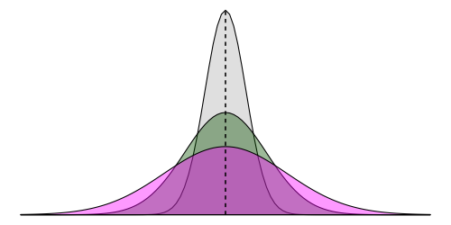

---
## Misure di dispersione: range

:dart: &nbsp;&nbsp;&nbsp; ${\text{range}(x)}= \text{max}(x)-\text{min}(x)$

:pushpin: &nbsp;&nbsp;&nbsp;  $x= \{6, 7, 15, 36, 39, 40, 41, 42, 43, 47, 49\}$ 

&nbsp;&nbsp;&nbsp;&nbsp;&nbsp;&nbsp;&nbsp;&nbsp;&nbsp; ${\text{range}(x)}= \text{max}(x)-\text{min}(x)=49-6=43$

<!-- INTERVALLO di VARIAZIONE. Il range pero' si basa solo sui due valori estremi, senza indicare come si distribuiscono i dati entro l’intervallo 

piu; semplice, meno informativo

 Non fornisce però informazioni sulla distribuzione delle osservazioni: non è ad esempio possibile capire se i valori siano dispersi o raggruppati in un’estremità…
-->

---
## Esercizio #8

:question: &nbsp;&nbsp;&nbsp; $\text{range}(x)= \text{ ?}$

<button id="countdown_exercize_8"></button>

<!-- Il range ha tuttavia un'utilita' limitata: tiene conto solo di due valori, e non e' robusta quando ci sono valori anomali

14 osservazioni -->

---
## Esercizio #8 -- Soluzione

:question: &nbsp;&nbsp;&nbsp; $\text{range}(x)= \text{max}(x)-\text{min}(x)=9,754-2,830=6,924$

<!-- Il range ha tuttavia un'utilita' limitata: tiene conto solo di due valori, e non e' robusta quando ci sono valori anomali -->

---
## Misure di dispersione: range interquantile

:dart: &nbsp;&nbsp;&nbsp; ${\text{IQR}(x)}= \text{Q3}(x)-\text{Q1}(x)$

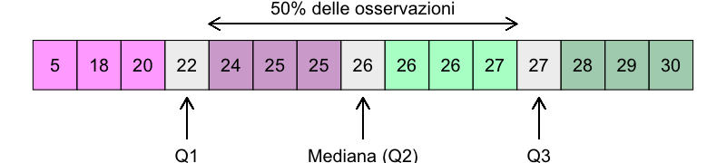

---
## Esercizio #9

:pushpin: &nbsp;&nbsp;&nbsp; $\text{IQR}(x) \text{ }\text{ } = \text{ ?}$

<button id="countdown_exercize_9"></button>

<!-- Non sono considerati i valori estremi, ma sappiamo come si distribuisce la meta dei dati rispetto al valore centrale -->

---
## Esercizio #9 -- Soluzione

:pushpin: &nbsp;&nbsp;&nbsp; $\text{IQR}(x) \text{ }\text{ } = \text{Q3}(x)-\text{Q1}(x) \text{ }\text{ } = \text{ ?}$

---
## Esercizio #9 -- Soluzione

:pushpin: &nbsp;&nbsp;&nbsp; $\text{IQR}(x) \text{ }\text{ } = \text{Q3}(x)-\text{Q1}(x) \text{ }\text{ } = \text{ ?}$

<!-- Non sono considerati i valori estremi, ma sappiamo come si distribuisce la meta dei dati rispetto al valore centrale -->

---
## Esercizio #9 -- Soluzione

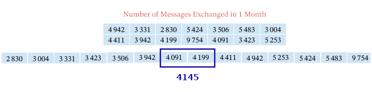

:pushpin: &nbsp;&nbsp;&nbsp; $\text{IQR}(x) \text{ }\text{ } = \text{Q3}(x)-\text{Q1}(x) \text{ }\text{ } = \text{ ?}$

<!-- Non sono considerati i valori estremi, ma sappiamo come si distribuisce la meta dei dati rispetto al valore centrale -->

---
## Esercizio #9 -- Soluzione

:pushpin: &nbsp;&nbsp;&nbsp; $\text{IQR}(x) \text{ }\text{ } = \text{Q3}(x)-\text{Q1}(x) \text{ }\text{ } = \text{ ?}$

<!-- Non sono considerati i valori estremi, ma sappiamo come si distribuisce la meta dei dati rispetto al valore centrale -->

---
## Esercizio #9 -- Soluzione

:pushpin: &nbsp;&nbsp;&nbsp; $\text{IQR}(x) \text{ }\text{ } = \text{Q3}(x)-\text{Q1}(x) \text{ }\text{ }\text{ }\text{ } =5,253-3,423=1,830$

<!-- Non sono considerati i valori estremi, ma sappiamo come si distribuisce la meta dei dati rispetto al valore centrale -->

---
## Misure di dispersione: varianza

<!-- Misura la distanza media tra le osservazioni e la media del campione. Piu' bassa e' la varianza, piu' le osservazioni saranno vicine alla media  -->

---
## Misure di dispersione: varianza

:dart: &nbsp;&nbsp;&nbsp; $s^2 = \frac{1}{n-1}\sum _{i=1}^{n}(x_{i}-\bar {x} )^{2}$

&nbsp;&nbsp;&nbsp;&nbsp;&nbsp;&nbsp;&nbsp;&nbsp;&nbsp; dove &nbsp;&nbsp;&nbsp; ${\bar {x}}= {\frac {1}{n}}\left(\sum _{i=1}^{n}{x_{i}}\right)$ 

:pushpin: &nbsp;&nbsp;&nbsp;  $x= \{1, 2, 3\}$ &nbsp;&nbsp;&nbsp; $\bar{x}=\frac{1+2+3}{3}=2$

&nbsp;&nbsp;&nbsp;&nbsp;&nbsp;&nbsp;&nbsp;&nbsp;&nbsp; $s = \frac{1}{3-1}\times [(1-2)^2+ (2-2)^2+(3-2)^2] =$
&nbsp;&nbsp;&nbsp;&nbsp;&nbsp;&nbsp;&nbsp;&nbsp;&nbsp;&nbsp;&nbsp;&nbsp;&nbsp; $= \frac{1}{2}\times [1^2+ 0^2+1^2 ]=  \frac{1}{2}\times 2 = 1$

<!-- Andiamo a fare la distanza (differenza) tra ciascun valore e la media, la eleviamo al quatrato, la sommiamo e andiamo a dividerla per la dimensione del campione - 1 -->

---
## Misure di dispersione: varianza

:dart: &nbsp;&nbsp;&nbsp; $s^2 = \frac{1}{n-1}\sum _{i=1}^{n}(x_{i}-\bar {x} )^{2}$

&nbsp;&nbsp;&nbsp;&nbsp;&nbsp;&nbsp;&nbsp;&nbsp;&nbsp; perche' &nbsp; $\frac{1}{n-1}$ &nbsp; ?  &nbsp;&nbsp;&nbsp;&nbsp;&nbsp;&nbsp;&nbsp;&nbsp;&nbsp;&nbsp;&nbsp;&nbsp; $\rightarrow$ &nbsp;&nbsp;&nbsp;&nbsp;&nbsp;&nbsp;&nbsp;&nbsp;&nbsp;&nbsp;&nbsp;&nbsp; $\sum _{i=1}^{n}(x_{i}-\bar {x} ) = 0$

:pushpin: &nbsp;&nbsp;&nbsp;  $x= \{1, 2, 3\}$ &nbsp;&nbsp;&nbsp; $\bar{x}=\frac{1+2+3}{3}=2$

&nbsp;&nbsp;&nbsp;&nbsp;&nbsp;&nbsp;&nbsp;&nbsp;&nbsp; $\sum _{i=1}^{n}(x_{i}-\bar {x} ) = (1-2) + (2-2) + (3-2) =$
&nbsp;&nbsp;&nbsp;&nbsp;&nbsp;&nbsp;&nbsp;&nbsp;&nbsp;&nbsp;&nbsp;&nbsp;&nbsp;&nbsp;&nbsp;&nbsp;&nbsp;&nbsp;&nbsp;&nbsp;&nbsp;&nbsp;&nbsp;&nbsp;&nbsp;&nbsp;&nbsp;&nbsp;&nbsp;&nbsp;&nbsp;&nbsp;&nbsp;&nbsp;&nbsp;&nbsp;&nbsp;&nbsp;&nbsp; $= -1 + 0 + 1 = 0$

<!-- Perche' si divide per (n-1) e non n, come ci aspetteremmo? 

Dipende dal fatto che La somma degli scarti dalla media aritmetica è nulla
Qundi se conosco i primi (n-1) valori, conosco anche l'ultimo

n-1 rappresenta quindi i gradi di liberta', il cui numero e' uguale al nuerio di dati (n) meno il numero di costanti gia' calcolate dai dati (in questo caso 1, la media) -->

---
## Misure di dispersione: deviazione standard

:dart: &nbsp;&nbsp;&nbsp; $s = \sqrt{s^2} = \sqrt {{\frac {1}{n-1}}\sum _{i=1}^{n}(x_{i}-\bar {x} )^{2}}$

&nbsp;&nbsp;&nbsp;&nbsp;&nbsp;&nbsp;&nbsp;&nbsp;&nbsp; dove &nbsp;&nbsp;&nbsp; ${\bar {x}}= {\frac {1}{n}}\left(\sum _{i=1}^{n}{x_{i}}\right)$ 

:pushpin: &nbsp;&nbsp;&nbsp;  $x= \{1, 2, 3\}$ &nbsp;&nbsp;&nbsp; $\bar{x}=\frac{1+2+3}{3}=2$

&nbsp;&nbsp;&nbsp;&nbsp;&nbsp;&nbsp;&nbsp;&nbsp;&nbsp; $s = \sqrt {\frac{1}{3-1}\times [(1-2)^2+ (2-2)^2+(3-2)^2] }=$
&nbsp;&nbsp;&nbsp;&nbsp;&nbsp;&nbsp;&nbsp;&nbsp;&nbsp;&nbsp;&nbsp;&nbsp;&nbsp; $= \sqrt {\frac{1}{2}\times [1^2+ 0^2+1^2 }]= \sqrt {\frac{1}{2}\times 2}= \sqrt {1} = 1$

<!-- che nella varianza l'unità di misura è diversa da quella della variabile su cui è calcolata (abbiamo fatto il quadrato delle fifferenze, ricordate?), si utilizza la sua radice quadrata detta SCARTO QUADRATICO MEDIO o deviazione standard. -->

---
## Esercizio #10

:question: &nbsp;&nbsp;&nbsp; Qual e' la deviazione standard di questo insieme?

&nbsp;&nbsp;&nbsp;&nbsp;&nbsp;&nbsp;&nbsp;&nbsp;&nbsp;  $y= \{60, 34, 26\}$ 
&nbsp;&nbsp;&nbsp;&nbsp;&nbsp;&nbsp;&nbsp;&nbsp;&nbsp;
&nbsp;&nbsp;&nbsp;&nbsp;&nbsp;&nbsp;&nbsp;&nbsp;&nbsp;  $SD(y) = \text{? }$ 

<button id="countdown_exercize_10"></button>

---
## Esercizio #10 -- Soluzione

:question: &nbsp;&nbsp;&nbsp; Qual e' la deviazione standard di questo insieme?

&nbsp;&nbsp;&nbsp;&nbsp;&nbsp;&nbsp;&nbsp;&nbsp;&nbsp;  $y= \{60, 34, 26\}$ 
&nbsp;&nbsp;&nbsp;&nbsp;&nbsp;&nbsp;&nbsp;&nbsp;&nbsp; 
&nbsp;&nbsp;&nbsp;&nbsp;&nbsp;&nbsp;&nbsp;&nbsp;&nbsp;  $SD(y) = \sqrt {{\frac {1}{n-1}}\sum _{i=1}^{n}(y_{i}-\bar {y} )^{2}}= \text{? }$ 

---
## Esercizio #10 -- Soluzione

:question: &nbsp;&nbsp;&nbsp; Qual e' la deviazione standard di questo insieme?

&nbsp;&nbsp;&nbsp;&nbsp;&nbsp;&nbsp;&nbsp;&nbsp;&nbsp;  $y= \{60, 34, 26\}$ 
&nbsp;&nbsp;&nbsp;&nbsp;&nbsp;&nbsp;&nbsp;&nbsp;&nbsp;  ${\bar {y}} = {\frac {1}{n}}\left(\sum _{i=1}^{n}{y_{i}}\right) = \frac{60 + 34 + 26}{3} = 40$
&nbsp;&nbsp;&nbsp;&nbsp;&nbsp;&nbsp;&nbsp;&nbsp;&nbsp;  $SD(y) = \sqrt {{\frac {1}{n-1}}\sum _{i=1}^{n}(y_{i}-\bar {y} )^{2}}= \text{? }$ 

---
## Esercizio #10 -- Soluzione

:question: &nbsp;&nbsp;&nbsp; Qual e' la deviazione standard di questo insieme?

&nbsp;&nbsp;&nbsp;&nbsp;&nbsp;&nbsp;&nbsp;&nbsp;&nbsp;  $y= \{60, 34, 26\}$ 
&nbsp;&nbsp;&nbsp;&nbsp;&nbsp;&nbsp;&nbsp;&nbsp;&nbsp; ${\bar {y}} = 40$
&nbsp;&nbsp;&nbsp;&nbsp;&nbsp;&nbsp;&nbsp;&nbsp;&nbsp;  $SD(y) = \sqrt {{\frac {1}{n-1}}\sum _{i=1}^{n}(y_{i}-\bar {y} )^{2}}=$ 
&nbsp;&nbsp;&nbsp;&nbsp;&nbsp;&nbsp;&nbsp;&nbsp;&nbsp;&nbsp;&nbsp;&nbsp;&nbsp;&nbsp;&nbsp;&nbsp;&nbsp;&nbsp;&nbsp;&nbsp;&nbsp;&nbsp;&nbsp;&nbsp; $= \sqrt {\frac{1}{3-1}\times [(60-40)^2+ (34-40)^2+(26-40)^2] }=$
&nbsp;&nbsp;&nbsp;&nbsp;&nbsp;&nbsp;&nbsp;&nbsp;&nbsp;&nbsp;&nbsp;&nbsp;&nbsp;&nbsp;&nbsp;&nbsp;&nbsp;&nbsp;&nbsp;&nbsp;&nbsp;&nbsp;&nbsp;&nbsp; $= \sqrt {\frac{1}{2}\times [20^2+ (-6)^2+ (-14)^2 }] =$
&nbsp;&nbsp;&nbsp;&nbsp;&nbsp;&nbsp;&nbsp;&nbsp;&nbsp;&nbsp;&nbsp;&nbsp;&nbsp;&nbsp;&nbsp;&nbsp;&nbsp;&nbsp;&nbsp;&nbsp;&nbsp;&nbsp;&nbsp;&nbsp; $= \sqrt {\frac{1}{2}\times [400+ 36 + 196]} = \sqrt {\frac{632}{2}}= \sqrt {316} = 17.8$

---
## Esercizio #11

:question: &nbsp;&nbsp;&nbsp; La deviazione standard e' robusta rispetto ai valori anomali?

---
## Esercizio #11

:question: &nbsp;&nbsp;&nbsp; La deviazione standard e' robusta rispetto ai valori anomali?

&nbsp;&nbsp;&nbsp;&nbsp;&nbsp;&nbsp;&nbsp;&nbsp;&nbsp;  $z= \{60, 34, 125\}$ 
&nbsp;&nbsp;&nbsp;&nbsp;&nbsp;&nbsp;&nbsp;&nbsp;&nbsp;
&nbsp;&nbsp;&nbsp;&nbsp;&nbsp;&nbsp;&nbsp;&nbsp;&nbsp;  $SD(z) = \text{? }$ 

<button id="countdown_exercize_11"></button>

---
## Esercizio #11 -- Soluzione

:question: &nbsp;&nbsp;&nbsp; La deviazione standard e' robusta rispetto ai valori anomali?

&nbsp;&nbsp;&nbsp;&nbsp;&nbsp;&nbsp;&nbsp;&nbsp;&nbsp;  $z= \{60, 34, 125\}$ 
&nbsp;&nbsp;&nbsp;&nbsp;&nbsp;&nbsp;&nbsp;&nbsp;&nbsp; 
&nbsp;&nbsp;&nbsp;&nbsp;&nbsp;&nbsp;&nbsp;&nbsp;&nbsp;  $SD(z) = \sqrt {{\frac {1}{n-1}}\sum _{i=1}^{n}(z_{i}-\bar {z} ^{2}})= \text{? }$ 

---
## Esercizio #11 -- Soluzione

:question: &nbsp;&nbsp;&nbsp; La deviazione standard e' robusta rispetto ai valori anomali?

&nbsp;&nbsp;&nbsp;&nbsp;&nbsp;&nbsp;&nbsp;&nbsp;&nbsp;  $z= \{60, 34, 125\}$ 
&nbsp;&nbsp;&nbsp;&nbsp;&nbsp;&nbsp;&nbsp;&nbsp;&nbsp;  ${\bar {z}} = {\frac {1}{n}}\left(\sum _{i=1}^{n}{z_{i}}\right) = \frac{60 + 34 + 125}{3} = 73$
&nbsp;&nbsp;&nbsp;&nbsp;&nbsp;&nbsp;&nbsp;&nbsp;&nbsp;  $SD(z) = \sqrt {{\frac {1}{n-1}}\sum _{i=1}^{n}(z_{i}-\bar {z} )^{2}}= \text{? }$ 

---
## Esercizio #11 -- Soluzione

:question: &nbsp;&nbsp;&nbsp; La deviazione standard e' robusta rispetto ai valori anomali?

&nbsp;&nbsp;&nbsp;&nbsp;&nbsp;&nbsp;&nbsp;&nbsp;&nbsp;  $z= \{60, 34, 125\}$ 
&nbsp;&nbsp;&nbsp;&nbsp;&nbsp;&nbsp;&nbsp;&nbsp;&nbsp; ${\bar {z}} = 73$
&nbsp;&nbsp;&nbsp;&nbsp;&nbsp;&nbsp;&nbsp;&nbsp;&nbsp;  $SD(z) = \sqrt {{\frac {1}{n-1}}\sum _{i=1}^{n}(z_{i}-\bar {z} )^{2}}=$ 
&nbsp;&nbsp;&nbsp;&nbsp;&nbsp;&nbsp;&nbsp;&nbsp;&nbsp;&nbsp;&nbsp;&nbsp;&nbsp;&nbsp;&nbsp;&nbsp;&nbsp;&nbsp;&nbsp;&nbsp;&nbsp;&nbsp;&nbsp;&nbsp; $= \sqrt {\frac{1}{3-1}\times [(60-73)^2+ (34-73)^2+(125-73)^2] }=$
&nbsp;&nbsp;&nbsp;&nbsp;&nbsp;&nbsp;&nbsp;&nbsp;&nbsp;&nbsp;&nbsp;&nbsp;&nbsp;&nbsp;&nbsp;&nbsp;&nbsp;&nbsp;&nbsp;&nbsp;&nbsp;&nbsp;&nbsp;&nbsp; $= \sqrt {\frac{1}{2}\times [(-13)^2+ (-39)^2+ 52^2 }] =$
&nbsp;&nbsp;&nbsp;&nbsp;&nbsp;&nbsp;&nbsp;&nbsp;&nbsp;&nbsp;&nbsp;&nbsp;&nbsp;&nbsp;&nbsp;&nbsp;&nbsp;&nbsp;&nbsp;&nbsp;&nbsp;&nbsp;&nbsp;&nbsp; $= \sqrt {\frac{1}{2}\times [169 + 1521 + 2704]} = \sqrt {\frac{4394}{2}}= \sqrt {2197} = 46.9$

---
## Centralita', dispersione e tipi di dati

|Tipo di dato | Misura di centralita' | Misura di dispersione |
| ---- | ----- | ---- |
| Nominali | Moda | - |
| Ordinali | Moda, Mediana | Range, IQR |
| Numerici | Moda, Mediana, Media | Range, IQR, deviazione standard |

<!-- Scelta della misura di tendenza centrale
- media se la distribuzione è simmetrica
- mediana se la distribuzione NON è simmetrica
(forse a causa di valori estremi)
- moda per indicare il valore più comune nell’ambito
della distribuzione -->

---
## Esercizio #12

:question: &nbsp;&nbsp;&nbsp; Dei ricercatori hanno raccolto eta', sesso e livelli di colesterolo 
&nbsp;&nbsp;&nbsp;&nbsp;&nbsp;&nbsp;&nbsp;&nbsp;&nbsp; Come possono presentare i loro dati?

&nbsp;&nbsp;&nbsp;&nbsp;&nbsp;&nbsp;&nbsp;&nbsp;&nbsp; a) Eta': media (SD), sesso: N (%), colesterolo: media (SD)
&nbsp;&nbsp;&nbsp;&nbsp;&nbsp;&nbsp;&nbsp;&nbsp;&nbsp; b) Eta': mediana (IQR), sesso: N (%), colesterolo: median (IQR)
&nbsp;&nbsp;&nbsp;&nbsp;&nbsp;&nbsp;&nbsp;&nbsp;&nbsp; c) Eta': media (SD), sesso: media (SD), colesterolo: media (SD) 
&nbsp;&nbsp;&nbsp;&nbsp;&nbsp;&nbsp;&nbsp;&nbsp;&nbsp; d) Sia a) che b)
&nbsp;&nbsp;&nbsp;&nbsp;&nbsp;&nbsp;&nbsp;&nbsp;&nbsp; e) Sia a) che c)

<button id="countdown_exercize_12"></button>

---
## Esercizio #12 -- Soluzione

:question: &nbsp;&nbsp;&nbsp; Dei ricercatori hanno raccolto eta', sesso e livelli di colesterolo 
&nbsp;&nbsp;&nbsp;&nbsp;&nbsp;&nbsp;&nbsp;&nbsp;&nbsp; Come possono presentare i loro dati?

&nbsp;&nbsp;&nbsp;&nbsp;&nbsp;&nbsp;&nbsp;&nbsp;&nbsp; a) Eta': media (SD), sesso: N (%), colesterolo: media (SD)
&nbsp;&nbsp;&nbsp;&nbsp;&nbsp;&nbsp;&nbsp;&nbsp;&nbsp; b) Eta': mediana (IQR), sesso: N (%), colesterolo: median (IQR)
&nbsp;&nbsp;&nbsp;&nbsp;&nbsp;&nbsp;&nbsp;&nbsp;&nbsp; c) Eta': media (SD), sesso: media (SD), colesterolo: media (SD) 
&nbsp;&nbsp;&nbsp;&nbsp;&nbsp;&nbsp;&nbsp;&nbsp;&nbsp; d) Sia a) che b) &nbsp;&nbsp; :white_check_mark: 
&nbsp;&nbsp;&nbsp;&nbsp;&nbsp;&nbsp;&nbsp;&nbsp;&nbsp; e) Sia a) che c)

---
## Parametri *vs*  &nbsp;statistiche

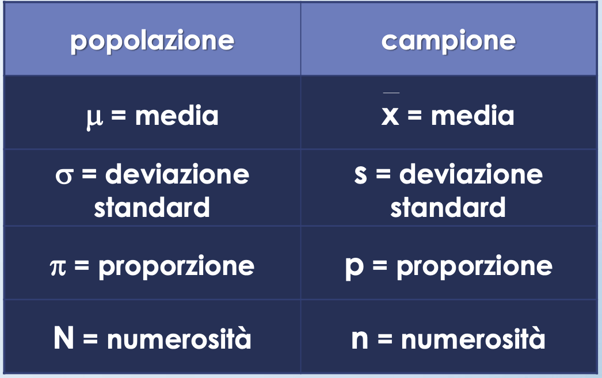

<!-- Una cosa che non vi ho detto, ma che ci tornera' utile in seguito e' che la media e la SD di una popolazione si chiamano PARAMETRI e si indicano con le lettere greche media e SD misurati su un campione si chiamano invece STATISTICHE e sono indicati con lettere latine -->

---
## In questa lezione abbiamo...

- imparato come riassumere ogni tipo di dato nel modo migliore
- imparato a costruire e interpretare una tabella di frequenza
- imparato a calcolare e interpretare diverse misure di centralita' e dispersione
- esplorato alcuni limiti delle misure di centralita' e dispersione introdotte
- descritto le differenze tra "parametri" e "statistiche"

<!-- ---
### Exercise #4

:question: &nbsp;&nbsp;&nbsp; Which curve has the larger 
&nbsp;&nbsp;&nbsp;&nbsp;&nbsp;&nbsp;&nbsp;&nbsp;&nbsp; mean?

&nbsp;&nbsp;&nbsp;&nbsp;&nbsp;&nbsp;&nbsp;&nbsp;&nbsp; a) blue
&nbsp;&nbsp;&nbsp;&nbsp;&nbsp;&nbsp;&nbsp;&nbsp;&nbsp; b) green
&nbsp;&nbsp;&nbsp;&nbsp;&nbsp;&nbsp;&nbsp;&nbsp;&nbsp; c) red

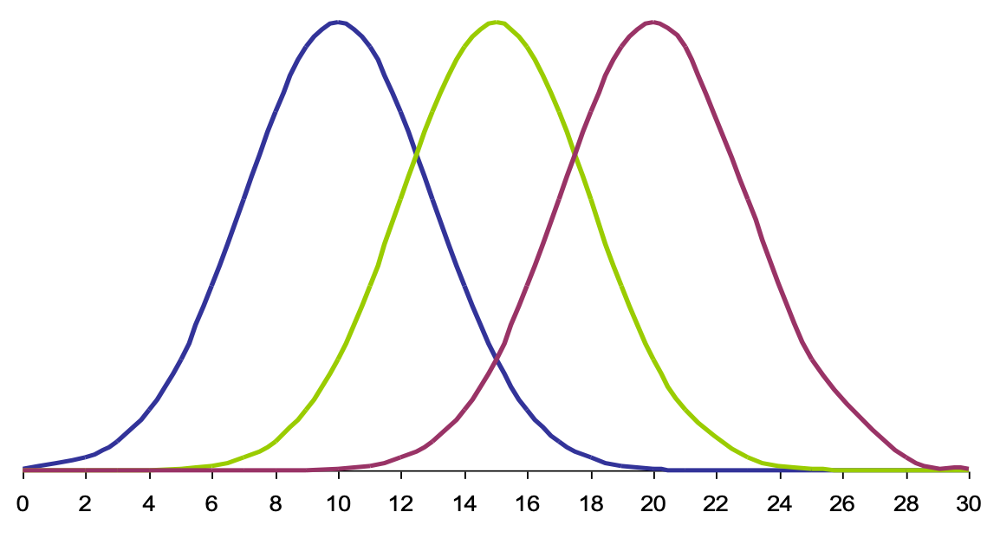

---
### Exercise #4 -- Solution

:question: &nbsp;&nbsp;&nbsp; Which curve has the larger 
&nbsp;&nbsp;&nbsp;&nbsp;&nbsp;&nbsp;&nbsp;&nbsp;&nbsp; mean?

&nbsp;&nbsp;&nbsp;&nbsp;&nbsp;&nbsp;&nbsp;&nbsp;&nbsp; a) blue
&nbsp;&nbsp;&nbsp;&nbsp;&nbsp;&nbsp;&nbsp;&nbsp;&nbsp; b) green
&nbsp;&nbsp;&nbsp;&nbsp;&nbsp;&nbsp;&nbsp;&nbsp;&nbsp; c) red :white_check_mark: 

---
### Exercise #5

:question: &nbsp;&nbsp;&nbsp; Which curve has the larger 
&nbsp;&nbsp;&nbsp;&nbsp;&nbsp;&nbsp;&nbsp;&nbsp;&nbsp; standard deviation?

&nbsp;&nbsp;&nbsp;&nbsp;&nbsp;&nbsp;&nbsp;&nbsp;&nbsp; a) blue
&nbsp;&nbsp;&nbsp;&nbsp;&nbsp;&nbsp;&nbsp;&nbsp;&nbsp; b) green
&nbsp;&nbsp;&nbsp;&nbsp;&nbsp;&nbsp;&nbsp;&nbsp;&nbsp; c) red

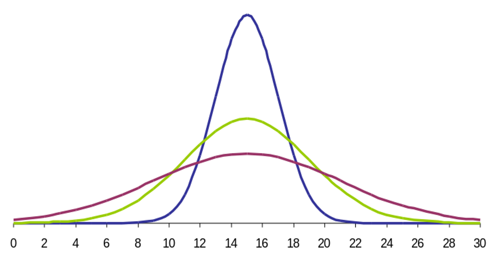

---
### Exercise #5 -- Solution

:question: &nbsp;&nbsp;&nbsp; Which curve has the larger 
&nbsp;&nbsp;&nbsp;&nbsp;&nbsp;&nbsp;&nbsp;&nbsp;&nbsp; standard deviation?

&nbsp;&nbsp;&nbsp;&nbsp;&nbsp;&nbsp;&nbsp;&nbsp;&nbsp; a) blue
&nbsp;&nbsp;&nbsp;&nbsp;&nbsp;&nbsp;&nbsp;&nbsp;&nbsp; b) green
&nbsp;&nbsp;&nbsp;&nbsp;&nbsp;&nbsp;&nbsp;&nbsp;&nbsp; c) red  :white_check_mark: 

 -->

