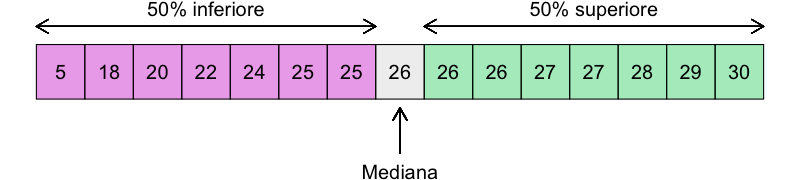
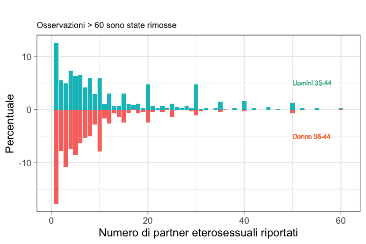

### Lezione 5
# La statistica descrittiva
## (Parte II: Le variabili numeriche)
## &nbsp;

---
## Obiettivi di apprendimento

- Saper calcolare e interpretare diverse misure di centralita', dispersione e correlazione
- Saper visualizzare dati numerici
- Saper interpretare tabelle e figure in articoli scientifici

<!-- Per le variabili quantitative è necessario descrivere i dati raccolti anche numericamente… Poiché generalmente il problema è che i dati sono tanti, può risultare più semplice sintetizzarli e ridurli a pochi numeri, più facili da comprendere, utilizzare e comunicare.

Le tabelle di frequenza dopo una procedura di discretizzazione non sono pero' il modo piu' consono per rappresentare i dati quantitativi. E' meglio usare
-->

---

## Misure di centralita' e dispersione

<!--  
Tendenza centrale (o posizione) -> Individuano il valore intorno al quale i dati sono raggruppati

Dispersione o variabilita'  -> Forniscono un’indicazione della dispersione delle osservazioni intorno al valore centrale -->

---
## Misure di centralita': la moda

:dart: &nbsp;&nbsp;&nbsp; L'elemeno piu' frequente

:pushpin: &nbsp;&nbsp;&nbsp; $x= \{1, 1, 1, 3, 4, 4, 7, 8, 8, 9, 9\}$
&nbsp;&nbsp;&nbsp;&nbsp;&nbsp;&nbsp;&nbsp;&nbsp;&nbsp; $\text{moda}(x)=1$

---
## Esercizio #1

:question: &nbsp;&nbsp;&nbsp; Qual e' la moda dei seguenti insiemi?

&nbsp;&nbsp;&nbsp;&nbsp;&nbsp;&nbsp;&nbsp;&nbsp;&nbsp;  $y= \{1, 1, 1, 3, 4, 4, 4, 7, 8, 8, 9, 9\}$
&nbsp;&nbsp;&nbsp;&nbsp;&nbsp;&nbsp;&nbsp;&nbsp;&nbsp; $\text{moda}(y)= \text{ } ?$

&nbsp;&nbsp;&nbsp;&nbsp;&nbsp;&nbsp;&nbsp;&nbsp;&nbsp;  $z= \{1, 3, 4, 7, 8, 9, 11, 17, 21, 42\}$
&nbsp;&nbsp;&nbsp;&nbsp;&nbsp;&nbsp;&nbsp;&nbsp;&nbsp; $\text{moda}(z)= \text{ } ?$

<button id="countdown_exercize_4"></button>

<!-- se ciascun valore si presenta una volta sola, le nostre osservazioni non hanno moda

Si usa soprattutto per i dati categorici -->

---
## Esercizio #1 -- Soluzione

:question: &nbsp;&nbsp;&nbsp; Qual e' la moda dei seguenti insiemi?

&nbsp;&nbsp;&nbsp;&nbsp;&nbsp;&nbsp;&nbsp;&nbsp;&nbsp;  $y= \{1, 1, 1, 3, 4, 4, 4, 7, 8, 8, 9, 9\}$
&nbsp;&nbsp;&nbsp;&nbsp;&nbsp;&nbsp;&nbsp;&nbsp;&nbsp; $\text{moda}(y)=1 \land   4$

&nbsp;&nbsp;&nbsp;&nbsp;&nbsp;&nbsp;&nbsp;&nbsp;&nbsp;  $z= \{1, 3, 4, 7, 8, 9, 11, 17, 21, 42\}$
&nbsp;&nbsp;&nbsp;&nbsp;&nbsp;&nbsp;&nbsp;&nbsp;&nbsp; $\text{moda}(z)= \text{Non esiste}$

---
## Misure di centralita': la mediana

:dart: &nbsp;&nbsp;&nbsp;Il valore "in mezzo"

:warning: I dati devono essere ordinati!

<!-- Divide l'insieme di dati in due parti uguali, con il numero osservazioni <= mediana uguale a quello >= -->

---
## Misure di centralita': la mediana

:dart: &nbsp;&nbsp;&nbsp;Il valore "in mezzo"

:pushpin: &nbsp;&nbsp;&nbsp;  $n=7,  x= \{1, 3, 3, 6, 7, 8, 9\}$ 

&nbsp;&nbsp;&nbsp;&nbsp;&nbsp;&nbsp;&nbsp;&nbsp;&nbsp; $\text{mediana}(x)=x_{(n+1)/2} = x_{(7+1)/2}=x_4=6$ 

:pushpin: &nbsp;&nbsp;&nbsp;  $n=8,  x= \{1, 2, 3, 4, 5, 6, 8, 9\}$

&nbsp;&nbsp;&nbsp;&nbsp;&nbsp;&nbsp;&nbsp;&nbsp;&nbsp; $\text{mediana}(x)={\frac {x_{(n/2)}+x_{((n/2)+1)}}{2}} = {\frac {x_{(8/2)}+x_{((8/2)+1)}}{2}}$
&nbsp;&nbsp;&nbsp;&nbsp;&nbsp;&nbsp;&nbsp;&nbsp;&nbsp;&nbsp;&nbsp;&nbsp;&nbsp;&nbsp;&nbsp;&nbsp;&nbsp;&nbsp;&nbsp;&nbsp;&nbsp;&nbsp;&nbsp;&nbsp;&nbsp;&nbsp;&nbsp;&nbsp;&nbsp;&nbsp;&nbsp;&nbsp;&nbsp;&nbsp;&nbsp; $={\frac {x_{4}+x_{5}}{2}} = {\frac {4+5}{2}} = 4.5$ 

:warning: I dati devono essere ordinati!

<!-- Quando il numero di osservazioni e' pari, ci sono due valori mediani, e in questo caso si prende la loro media aritmetica -->

---
## Esercizio #2

:question: &nbsp;&nbsp;&nbsp; Quali sono le mediane di questi insiemi?

&nbsp;&nbsp;&nbsp;&nbsp;&nbsp;&nbsp;&nbsp;&nbsp;&nbsp;  $n=7,  y= \{1, 3, 3, 6, 7, 8, 9\}$ 
&nbsp;&nbsp;&nbsp;&nbsp;&nbsp;&nbsp;&nbsp;&nbsp;&nbsp; $\text{mediana}(y)= \text{ ?}$ 

&nbsp;&nbsp;&nbsp;&nbsp;&nbsp;&nbsp;&nbsp;&nbsp;&nbsp;  $n=7,  z= \{1, 3, 3, 6, 7, 8, 109\}$ 
&nbsp;&nbsp;&nbsp;&nbsp;&nbsp;&nbsp;&nbsp;&nbsp;&nbsp; $\text{mediana}(z)=\text{ ?}$ 

<button id="countdown_exercize_5"></button>

<!-- La mediana non e' influenzata da valori anomali o estremi (outliers) -->

---
## Esercizio #2 -- Soluzione

:question: &nbsp;&nbsp;&nbsp; Quali sono le mediane di questi insiemi?

&nbsp;&nbsp;&nbsp;&nbsp;&nbsp;&nbsp;&nbsp;&nbsp;&nbsp;  $n=7,  y= \{1, 3, 3, 6, 7, 8, 9\}$ 
&nbsp;&nbsp;&nbsp;&nbsp;&nbsp;&nbsp;&nbsp;&nbsp;&nbsp; $\text{mediana}(y)=y_{(n+1)/2} = y_{(7+1)/2}=y_4=6$ 

&nbsp;&nbsp;&nbsp;&nbsp;&nbsp;&nbsp;&nbsp;&nbsp;&nbsp;  $n=7,  z= \{1, 3, 3, 6, 7, 8, 109\}$ 
&nbsp;&nbsp;&nbsp;&nbsp;&nbsp;&nbsp;&nbsp;&nbsp;&nbsp; $\text{mediana}(z)=\text{ ?}$ 

:warning: I dati devono essere ordinati!

<!-- La mediana non e' influenzata da valori anomali o estremi (outliers) -->

---
## Esercizio #2 -- Soluzione

:question: &nbsp;&nbsp;&nbsp; Quali sono le mediane di questi insiemi?

&nbsp;&nbsp;&nbsp;&nbsp;&nbsp;&nbsp;&nbsp;&nbsp;&nbsp;  $n=7,  y= \{1, 3, 3, 6, 7, 8, 9\}$ 
&nbsp;&nbsp;&nbsp;&nbsp;&nbsp;&nbsp;&nbsp;&nbsp;&nbsp; $\text{mediana}(y)=y_{(n+1)/2} = y_{(7+1)/2}=y_4=6$ 

&nbsp;&nbsp;&nbsp;&nbsp;&nbsp;&nbsp;&nbsp;&nbsp;&nbsp;  $n=7,  z= \{1, 3, 3, 6, 7, 8, 109\}$ 
&nbsp;&nbsp;&nbsp;&nbsp;&nbsp;&nbsp;&nbsp;&nbsp;&nbsp; $\text{mediana}(z)=z_{(n+1)/2} = z_{(7+1)/2}=z_4=6$ 

:warning: I dati devono essere ordinati!

<!-- La mediana non e' influenzata da valori anomali o estremi (outliers) -->

---
## Misure di centralita': la mediana

:question: &nbsp;&nbsp;&nbsp; Cosa ci mostra questo esempio?

&nbsp;&nbsp;&nbsp;&nbsp;&nbsp;&nbsp;&nbsp;&nbsp;&nbsp;  $n=7,  y= \{1, 3, 3, 6, 7, 8, 9\}$ 
&nbsp;&nbsp;&nbsp;&nbsp;&nbsp;&nbsp;&nbsp;&nbsp;&nbsp; $\text{mediana}(y)=y_{(n+1)/2} = y_{(7+1)/2}=y_4=6$ 

&nbsp;&nbsp;&nbsp;&nbsp;&nbsp;&nbsp;&nbsp;&nbsp;&nbsp;  $n=7,  z= \{1, 3, 3, 6, 7, 8, 109\}$ 
&nbsp;&nbsp;&nbsp;&nbsp;&nbsp;&nbsp;&nbsp;&nbsp;&nbsp; $\text{mediana}(z)=z_{(n+1)/2} = z_{(7+1)/2}=z_4=6$ 

<!-- La mediana non e' influenzata da valori anomali o estremi (outliers) -->

---
## Quartili

<!-- Mentre la mediana divide i dati in due meta' esatte, molto usati sono anche i quartili, che dividono i dati in 4 parti uguali -->

:warning: I dati devono essere ordinati!

---
## Esercizio #3

:question: &nbsp;&nbsp;&nbsp; Quali sono il primo e terzo quartile di questi insiemi?

&nbsp;&nbsp;&nbsp;&nbsp;&nbsp;&nbsp;&nbsp;&nbsp;&nbsp; $y= \{1, 3, 3, 6, 7, 8, 9\}$  
&nbsp;&nbsp;&nbsp;&nbsp;&nbsp;&nbsp;&nbsp;&nbsp;&nbsp; $\text{Q1}(y)= \text{ ?}$ 
&nbsp;&nbsp;&nbsp;&nbsp;&nbsp;&nbsp;&nbsp;&nbsp;&nbsp; $\text{Q3}(y)= \text{ ?}$

&nbsp;&nbsp;&nbsp;&nbsp;&nbsp;&nbsp;&nbsp;&nbsp;&nbsp;$z= \{1, 2, 3, 4, 5, 6, 8, 9\}$
&nbsp;&nbsp;&nbsp;&nbsp;&nbsp;&nbsp;&nbsp;&nbsp;&nbsp; $\text{Q1}(z)= \text{ ?}$ 
&nbsp;&nbsp;&nbsp;&nbsp;&nbsp;&nbsp;&nbsp;&nbsp;&nbsp; $\text{Q3}(z)= \text{ ?}$

<button id="countdown_exercize_6"></button>

---
## Esercizio #3 -- Soluzione

:question: &nbsp;&nbsp;&nbsp; Quali sono il primo e terzo quartile di questi insiemi?

&nbsp;&nbsp;&nbsp;&nbsp;&nbsp;&nbsp;&nbsp;&nbsp;&nbsp; $y= \{1, 3, 3, [6], 7, 8, 9\}$  
&nbsp;&nbsp;&nbsp;&nbsp;&nbsp;&nbsp;&nbsp;&nbsp;&nbsp; $\text{Q1}(y) = \text{mediana}(y)[1:4] = \text{ ?}$ 
&nbsp;&nbsp;&nbsp;&nbsp;&nbsp;&nbsp;&nbsp;&nbsp;&nbsp; $\text{Q3}(y) = \text{mediana}(y)[4:7] = \text{ ?}$ 

&nbsp;&nbsp;&nbsp;&nbsp;&nbsp;&nbsp;&nbsp;&nbsp;&nbsp;$z= \{1, 2, 3, 4, 5, 6, 8, 9\}$
&nbsp;&nbsp;&nbsp;&nbsp;&nbsp;&nbsp;&nbsp;&nbsp;&nbsp; $\text{Q1}(z)= \text{ ?}$ 
&nbsp;&nbsp;&nbsp;&nbsp;&nbsp;&nbsp;&nbsp;&nbsp;&nbsp; $\text{Q3}(z)= \text{ ?}$

<!-- &nbsp;&nbsp;&nbsp;&nbsp;&nbsp;&nbsp;&nbsp;&nbsp;&nbsp;$z= \{1, 2, 3, [4, 5], 6, 8, 9\}$
&nbsp;&nbsp;&nbsp;&nbsp;&nbsp;&nbsp;&nbsp;&nbsp;&nbsp; $\text{Q1}(z)= \text{mediana}(z)[1:4] = \text{ ?}$ 
&nbsp;&nbsp;&nbsp;&nbsp;&nbsp;&nbsp;&nbsp;&nbsp;&nbsp; $\text{Q3}(z)= \text{mediana}(z)[5:8] = \text{ ?}$  -->

---
## Esercizio #3 -- Soluzione

:question: &nbsp;&nbsp;&nbsp; Quali sono il primo e terzo quartile di questi insiemi?

&nbsp;&nbsp;&nbsp;&nbsp;&nbsp;&nbsp;&nbsp;&nbsp;&nbsp; $y= \{1, 3, 3, [6], 7, 8, 9\}$  
&nbsp;&nbsp;&nbsp;&nbsp;&nbsp;&nbsp;&nbsp;&nbsp;&nbsp; $\text{Q1}(y) = \text{mediana}(y)[1:4] = \frac{3+3}{2} = 3$ 
&nbsp;&nbsp;&nbsp;&nbsp;&nbsp;&nbsp;&nbsp;&nbsp;&nbsp; $\text{Q3}(y) = \text{mediana}(y)[4:7] = \frac{7+8}{2} = 7.5$ 

&nbsp;&nbsp;&nbsp;&nbsp;&nbsp;&nbsp;&nbsp;&nbsp;&nbsp;$z= \{1, 2, 3, 4, 5, 6, 8, 9\}$
&nbsp;&nbsp;&nbsp;&nbsp;&nbsp;&nbsp;&nbsp;&nbsp;&nbsp; $\text{Q1}(z)= \text{ ?}$ 
&nbsp;&nbsp;&nbsp;&nbsp;&nbsp;&nbsp;&nbsp;&nbsp;&nbsp; $\text{Q3}(z)= \text{ ?}$

<!-- &nbsp;&nbsp;&nbsp;&nbsp;&nbsp;&nbsp;&nbsp;&nbsp;&nbsp;$z= \{1, 2, 3, [4, 5], 6, 8, 9\}$
&nbsp;&nbsp;&nbsp;&nbsp;&nbsp;&nbsp;&nbsp;&nbsp;&nbsp; $\text{Q1}(z)= \text{mediana}(z)[1:4] = \frac{2+3}{2} = 2.5$ 
&nbsp;&nbsp;&nbsp;&nbsp;&nbsp;&nbsp;&nbsp;&nbsp;&nbsp; $\text{Q3}(z)= \text{mediana}(z)[5:8] = \frac{6+8}{2} = 7$  -->

---
## Esercizio #3 -- Soluzione

:question: &nbsp;&nbsp;&nbsp; Quali sono il primo e terzo quartile di questi insiemi?

&nbsp;&nbsp;&nbsp;&nbsp;&nbsp;&nbsp;&nbsp;&nbsp;&nbsp; $y= \{1, 3, 3, [6], 7, 8, 9\}$  
&nbsp;&nbsp;&nbsp;&nbsp;&nbsp;&nbsp;&nbsp;&nbsp;&nbsp; $\text{Q1}(y) = \text{mediana}(y)[1:4] = \frac{3+3}{2} = 3$ 
&nbsp;&nbsp;&nbsp;&nbsp;&nbsp;&nbsp;&nbsp;&nbsp;&nbsp; $\text{Q3}(y) = \text{mediana}(y)[4:7] = \frac{7+8}{2} = 7.5$  

&nbsp;&nbsp;&nbsp;&nbsp;&nbsp;&nbsp;&nbsp;&nbsp;&nbsp;$z= \{1, 2, 3, [4, 5], 6, 8, 9\}$
&nbsp;&nbsp;&nbsp;&nbsp;&nbsp;&nbsp;&nbsp;&nbsp;&nbsp; $\text{Q1}(z)= \text{mediana}(z)[1:4] = \text{ ?}$ 
&nbsp;&nbsp;&nbsp;&nbsp;&nbsp;&nbsp;&nbsp;&nbsp;&nbsp; $\text{Q3}(z)= \text{mediana}(z)[5:8] = \text{ ?}$

---
## Esercizio #3 -- Soluzione

:question: &nbsp;&nbsp;&nbsp; Quali sono il primo e terzo quartile di questi insiemi?

&nbsp;&nbsp;&nbsp;&nbsp;&nbsp;&nbsp;&nbsp;&nbsp;&nbsp; $y= \{1, 3, 3, [6], 7, 8, 9\}$  
&nbsp;&nbsp;&nbsp;&nbsp;&nbsp;&nbsp;&nbsp;&nbsp;&nbsp; $\text{Q1}(y) = \text{mediana}(y)[1:4] = \frac{3+3}{2} = 3$ 
&nbsp;&nbsp;&nbsp;&nbsp;&nbsp;&nbsp;&nbsp;&nbsp;&nbsp; $\text{Q3}(y) = \text{mediana}(y)[4:7] = \frac{7+8}{2} = 7.5$ 

&nbsp;&nbsp;&nbsp;&nbsp;&nbsp;&nbsp;&nbsp;&nbsp;&nbsp;$z= \{1, 2, 3, [4, 5], 6, 8, 9\}$
&nbsp;&nbsp;&nbsp;&nbsp;&nbsp;&nbsp;&nbsp;&nbsp;&nbsp; $\text{Q1}(z)= \text{mediana}(z)[1:4] = \frac{2+3}{2} = 2.5$ 
&nbsp;&nbsp;&nbsp;&nbsp;&nbsp;&nbsp;&nbsp;&nbsp;&nbsp; $\text{Q3}(z)= \text{mediana}(z)[5:8] = \frac{6+8}{2} = 7$

---
## Misure di centralita': la media

:dart: &nbsp;&nbsp;&nbsp; Media aritmetica

$$
{\bar {x}}= {\frac {1}{n}}\left(\sum _{i=1}^{n}{x_{i}}\right)=
{\frac {x_{1}+x_{2}+\dots +x_{n}}{n}}
$$

:pushpin: &nbsp;&nbsp;&nbsp;  $x= \{4, 36, 45, 50, 75\}$ 

&nbsp;&nbsp;&nbsp;&nbsp;&nbsp;&nbsp;&nbsp;&nbsp;&nbsp; ${\bar {x}} = {\frac{1}{n}}\left(\sum _{i=1}^{n}{x_{i}}\right) = \frac{4 + 36 + 45 + 50 + 75}{5} = 42$

<!-- Somma dei singoli valori diviso il numero di osservazioni  -->

---
## Esercizio #4

:question: &nbsp;&nbsp;&nbsp; Quali sono le medie di questi insiemi?

&nbsp;&nbsp;&nbsp;&nbsp;&nbsp;&nbsp;&nbsp;&nbsp;&nbsp;  $y= \{6, 34, 40, 55, 75\}$ 
&nbsp;&nbsp;&nbsp;&nbsp;&nbsp;&nbsp;&nbsp;&nbsp;&nbsp; ${\bar {y}} = \text{ ?}$

&nbsp;&nbsp;&nbsp;&nbsp;&nbsp;&nbsp;&nbsp;&nbsp;&nbsp; $z= \{6, 34, 40, 55, 175\}$ 
&nbsp;&nbsp;&nbsp;&nbsp;&nbsp;&nbsp;&nbsp;&nbsp;&nbsp; ${\bar {z}} = \text{ ?}$

<button id="countdown_exercize_7"></button>

<!-- Mentre la media e' la misura piu' usata per descrivere la tendenza centrale per la sua unicita' (c'e' solo una media) e semplicita', non e' particolarmente robusta rispetto agli outliers. Il valore atipico SOVRADIMENSIONA la media.

Vedremo piu' avanti, con le misure di dispersione, come accopagnare altri valori alla media per evidenziare queste situazioni  -->

---
## Esercizio #4 -- Soluzione

:question: &nbsp;&nbsp;&nbsp; Quali sono le medie di questi insiemi?

&nbsp;&nbsp;&nbsp;&nbsp;&nbsp;&nbsp;&nbsp;&nbsp;&nbsp;  $y= \{6, 34, 40, 55, 75\}$ 
&nbsp;&nbsp;&nbsp;&nbsp;&nbsp;&nbsp;&nbsp;&nbsp;&nbsp; ${\bar {y}} = {\frac {1}{n}}\left(\sum _{i=1}^{n}{y_{i}}\right) = \frac{6 + 34 + 40 + 55 + 75}{5} = 42$

&nbsp;&nbsp;&nbsp;&nbsp;&nbsp;&nbsp;&nbsp;&nbsp;&nbsp; $z= \{6, 34, 40, 55, 175\}$ 
&nbsp;&nbsp;&nbsp;&nbsp;&nbsp;&nbsp;&nbsp;&nbsp;&nbsp; ${\bar {z}} = {\frac {1}{n}}\left(\sum _{i=1}^{n}{z_{i}}\right) = \frac{4 + 36 + 45 + 50 + 175}{5} = 62$

<!-- Mentre la media e' la misura piu' usata per descrivere la tendenza centrale per la sua unicita' (c'e' solo una media) e semplicita', non e' particolarmente robusta rispetto agli outliers. Il valore atipico SOVRADIMENSIONA la media.

Vedremo piu' avanti, con le misure di dispersione, come accopagnare altri valori alla media per evidenziare queste situazioni  -->

---
## Misure di centralita': la media

:question: &nbsp;&nbsp;&nbsp; Cosa ci mostra questo esempio?

&nbsp;&nbsp;&nbsp;&nbsp;&nbsp;&nbsp;&nbsp;&nbsp;&nbsp;  $y= \{6, 34, 40, 55, 75\}$ 
&nbsp;&nbsp;&nbsp;&nbsp;&nbsp;&nbsp;&nbsp;&nbsp;&nbsp; ${\bar {y}} = {\frac {1}{n}}\left(\sum _{i=1}^{n}{y_{i}}\right) = \frac{6 + 34 + 40 + 55 + 75}{5} = 42$

&nbsp;&nbsp;&nbsp;&nbsp;&nbsp;&nbsp;&nbsp;&nbsp;&nbsp; $z= \{6, 34, 40, 55, 175\}$ 
&nbsp;&nbsp;&nbsp;&nbsp;&nbsp;&nbsp;&nbsp;&nbsp;&nbsp; ${\bar {z}} = {\frac {1}{n}}\left(\sum _{i=1}^{n}{z_{i}}\right) = \frac{4 + 36 + 45 + 50 + 175}{5} = 62$

<!-- Mentre la media e' la misura piu' usata per descrivere la tendenza centrale per la sua unicita' (c'e' solo una media) e semplicita', non e' particolarmente robusta rispetto agli outliers. Il valore atipico SOVRADIMENSIONA la media.

Vedremo piu' avanti, con le misure di dispersione, come accopagnare altri valori alla media per evidenziare queste situazioni  -->

--- 
## I valori anomali

Reilly, J. *et al.*. Procedure‐Specific Surgical Site Infection Rates and Postdischarge Surveillance in Scotland,  Infection Control and Hospital Epidemiology, 2006, doi:10.1086/509839  

---
## Misure di dispersione

---
## Misure di dispersione

---
## Misure di dispersione: range

:dart: &nbsp;&nbsp;&nbsp; ${\text{range}(x)}= \text{max}(x)-\text{min}(x)$

:pushpin: &nbsp;&nbsp;&nbsp;  $x= \{6, 7, 15, 36, 39, 40, 41, 42, 43, 47, 49\}$ 

&nbsp;&nbsp;&nbsp;&nbsp;&nbsp;&nbsp;&nbsp;&nbsp;&nbsp; ${\text{range}(x)}= \text{max}(x)-\text{min}(x)=49-6=43$

<!-- INTERVALLO di VARIAZIONE. Il range pero' si basa solo sui due valori estremi, senza indicare come si distribuiscono i dati entro l’intervallo 

piu; semplice, meno informativo

 Non fornisce però informazioni sulla distribuzione delle osservazioni: non è ad esempio possibile capire se i valori siano dispersi o raggruppati in un’estremità…
-->

---
## Esercizio #5

:question: &nbsp;&nbsp;&nbsp; $\text{range}(x)= \text{ ?}$

<button id="countdown_exercize_8"></button>

<!-- Il range ha tuttavia un'utilita' limitata: tiene conto solo di due valori, e non e' robusta quando ci sono valori anomali

14 osservazioni -->

---
## Esercizio #5 -- Soluzione

:question: &nbsp;&nbsp;&nbsp; $\text{range}(x)= \text{max}(x)-\text{min}(x)=9,754-2,830=6,924$

<!-- Il range ha tuttavia un'utilita' limitata: tiene conto solo di due valori, e non e' robusta quando ci sono valori anomali -->

---
## Misure di dispersione: range interquantile

:dart: &nbsp;&nbsp;&nbsp; ${\text{IQR}(x)}= \text{Q3}(x)-\text{Q1}(x)$

---
## Esercizio #6

:pushpin: &nbsp;&nbsp;&nbsp; $\text{IQR}(x) \text{ }\text{ } = \text{ ?}$

<button id="countdown_exercize_9"></button>

<!-- Non sono considerati i valori estremi, ma sappiamo come si distribuisce la meta dei dati rispetto al valore centrale -->

---
## Esercizio #6 -- Soluzione

:pushpin: &nbsp;&nbsp;&nbsp; $\text{IQR}(x) \text{ }\text{ } = \text{Q3}(x)-\text{Q1}(x) \text{ }\text{ } = \text{ ?}$

---
## Esercizio #6 -- Soluzione

:pushpin: &nbsp;&nbsp;&nbsp; $\text{IQR}(x) \text{ }\text{ } = \text{Q3}(x)-\text{Q1}(x) \text{ }\text{ } = \text{ ?}$

<!-- Non sono considerati i valori estremi, ma sappiamo come si distribuisce la meta dei dati rispetto al valore centrale -->

---
## Esercizio #6 -- Soluzione

:pushpin: &nbsp;&nbsp;&nbsp; $\text{IQR}(x) \text{ }\text{ } = \text{Q3}(x)-\text{Q1}(x) \text{ }\text{ } = \text{ ?}$

<!-- Non sono considerati i valori estremi, ma sappiamo come si distribuisce la meta dei dati rispetto al valore centrale -->

---
## Esercizio #6 -- Soluzione

:pushpin: &nbsp;&nbsp;&nbsp; $\text{IQR}(x) \text{ }\text{ } = \text{Q3}(x)-\text{Q1}(x) \text{ }\text{ } = \text{ ?}$

<!-- Non sono considerati i valori estremi, ma sappiamo come si distribuisce la meta dei dati rispetto al valore centrale -->

---
## Esercizio #6 -- Soluzione

:pushpin: &nbsp;&nbsp;&nbsp; $\text{IQR}(x) \text{ }\text{ } = \text{Q3}(x)-\text{Q1}(x) \text{ }\text{ }\text{ }\text{ } =5,253-3,423=1,830$

<!-- Non sono considerati i valori estremi, ma sappiamo come si distribuisce la meta dei dati rispetto al valore centrale -->

---
## Misure di dispersione: varianza

<!-- Misura la distanza media tra le osservazioni e la media del campione. Piu' bassa e' la varianza, piu' le osservazioni saranno vicine alla media  -->

---
## Misure di dispersione: varianza

:dart: &nbsp;&nbsp;&nbsp; $s^2 = \frac{1}{n-1}\sum _{i=1}^{n}(x_{i}-\bar {x} )^{2}$

&nbsp;&nbsp;&nbsp;&nbsp;&nbsp;&nbsp;&nbsp;&nbsp;&nbsp; dove &nbsp;&nbsp;&nbsp; ${\bar {x}}= {\frac {1}{n}}\left(\sum _{i=1}^{n}{x_{i}}\right)$ 

:pushpin: &nbsp;&nbsp;&nbsp;  $x= \{1, 2, 3\}$ &nbsp;&nbsp;&nbsp; $\bar{x}=\frac{1+2+3}{3}=2$

&nbsp;&nbsp;&nbsp;&nbsp;&nbsp;&nbsp;&nbsp;&nbsp;&nbsp; $s = \frac{1}{3-1}\times [(1-2)^2+ (2-2)^2+(3-2)^2] =$
&nbsp;&nbsp;&nbsp;&nbsp;&nbsp;&nbsp;&nbsp;&nbsp;&nbsp;&nbsp;&nbsp;&nbsp;&nbsp; $= \frac{1}{2}\times [1^2+ 0^2+1^2 ]=  \frac{1}{2}\times 2 = 1$

<!-- Andiamo a fare la distanza (differenza) tra ciascun valore e la media, la eleviamo al quatrato, la sommiamo e andiamo a dividerla per la dimensione del campione - 1 -->

---
## Misure di dispersione: varianza

:dart: &nbsp;&nbsp;&nbsp; $s^2 = \frac{1}{n-1}\sum _{i=1}^{n}(x_{i}-\bar {x} )^{2}$

&nbsp;&nbsp;&nbsp;&nbsp;&nbsp;&nbsp;&nbsp;&nbsp;&nbsp; perche' &nbsp; $\frac{1}{n-1}$ &nbsp; ?  &nbsp;&nbsp;&nbsp;&nbsp;&nbsp;&nbsp;&nbsp;&nbsp;&nbsp;&nbsp;&nbsp;&nbsp; $\rightarrow$ &nbsp;&nbsp;&nbsp;&nbsp;&nbsp;&nbsp;&nbsp;&nbsp;&nbsp;&nbsp;&nbsp;&nbsp; $\sum _{i=1}^{n}(x_{i}-\bar {x} ) = 0$

:pushpin: &nbsp;&nbsp;&nbsp;  $x= \{1, 2, 3\}$ &nbsp;&nbsp;&nbsp; $\bar{x}=\frac{1+2+3}{3}=2$

&nbsp;&nbsp;&nbsp;&nbsp;&nbsp;&nbsp;&nbsp;&nbsp;&nbsp; $\sum _{i=1}^{n}(x_{i}-\bar {x} ) = (1-2) + (2-2) + (3-2) =$
&nbsp;&nbsp;&nbsp;&nbsp;&nbsp;&nbsp;&nbsp;&nbsp;&nbsp;&nbsp;&nbsp;&nbsp;&nbsp;&nbsp;&nbsp;&nbsp;&nbsp;&nbsp;&nbsp;&nbsp;&nbsp;&nbsp;&nbsp;&nbsp;&nbsp;&nbsp;&nbsp;&nbsp;&nbsp;&nbsp;&nbsp;&nbsp;&nbsp;&nbsp;&nbsp;&nbsp;&nbsp;&nbsp;&nbsp; $= -1 + 0 + 1 = 0$

<!-- Perche' si divide per (n-1) e non n, come ci aspetteremmo? 

Dipende dal fatto che La somma degli scarti dalla media aritmetica è nulla
Qundi se conosco i primi (n-1) valori, conosco anche l'ultimo

n-1 rappresenta quindi i gradi di liberta', il cui numero e' uguale al nuerio di dati (n) meno il numero di costanti gia' calcolate dai dati (in questo caso 1, la media) -->

---
## Misure di dispersione: deviazione standard

:dart: &nbsp;&nbsp;&nbsp; $s = \sqrt{s^2} = \sqrt {{\frac {1}{n-1}}\sum _{i=1}^{n}(x_{i}-\bar {x} )^{2}}$

&nbsp;&nbsp;&nbsp;&nbsp;&nbsp;&nbsp;&nbsp;&nbsp;&nbsp; dove &nbsp;&nbsp;&nbsp; ${\bar {x}}= {\frac {1}{n}}\left(\sum _{i=1}^{n}{x_{i}}\right)$ 

:pushpin: &nbsp;&nbsp;&nbsp;  $x= \{1, 2, 3\}$ &nbsp;&nbsp;&nbsp; $\bar{x}=\frac{1+2+3}{3}=2$

&nbsp;&nbsp;&nbsp;&nbsp;&nbsp;&nbsp;&nbsp;&nbsp;&nbsp; $s = \sqrt {\frac{1}{3-1}\times [(1-2)^2+ (2-2)^2+(3-2)^2] }=$
&nbsp;&nbsp;&nbsp;&nbsp;&nbsp;&nbsp;&nbsp;&nbsp;&nbsp;&nbsp;&nbsp;&nbsp;&nbsp; $= \sqrt {\frac{1}{2}\times [1^2+ 0^2+1^2 }]= \sqrt {\frac{1}{2}\times 2}= \sqrt {1} = 1$

<!-- che nella varianza l'unità di misura è diversa da quella della variabile su cui è calcolata (abbiamo fatto il quadrato delle fifferenze, ricordate?), si utilizza la sua radice quadrata detta SCARTO QUADRATICO MEDIO o deviazione standard. -->

---
## Esercizio #7

:question: &nbsp;&nbsp;&nbsp; Qual e' la deviazione standard di questo insieme?

&nbsp;&nbsp;&nbsp;&nbsp;&nbsp;&nbsp;&nbsp;&nbsp;&nbsp;  $y= \{60, 34, 26\}$ 
&nbsp;&nbsp;&nbsp;&nbsp;&nbsp;&nbsp;&nbsp;&nbsp;&nbsp;
&nbsp;&nbsp;&nbsp;&nbsp;&nbsp;&nbsp;&nbsp;&nbsp;&nbsp;  $SD(y) = \text{? }$ 

<button id="countdown_exercize_10"></button>

---
## Esercizio #7 -- Soluzione

:question: &nbsp;&nbsp;&nbsp; Qual e' la deviazione standard di questo insieme?

&nbsp;&nbsp;&nbsp;&nbsp;&nbsp;&nbsp;&nbsp;&nbsp;&nbsp;  $y= \{60, 34, 26\}$ 
&nbsp;&nbsp;&nbsp;&nbsp;&nbsp;&nbsp;&nbsp;&nbsp;&nbsp; 
&nbsp;&nbsp;&nbsp;&nbsp;&nbsp;&nbsp;&nbsp;&nbsp;&nbsp;  $SD(y) = \sqrt {{\frac {1}{n-1}}\sum _{i=1}^{n}(y_{i}-\bar {y} )^{2}}= \text{? }$ 

---
## Esercizio #7 -- Soluzione

:question: &nbsp;&nbsp;&nbsp; Qual e' la deviazione standard di questo insieme?

&nbsp;&nbsp;&nbsp;&nbsp;&nbsp;&nbsp;&nbsp;&nbsp;&nbsp;  $y= \{60, 34, 26\}$ 
&nbsp;&nbsp;&nbsp;&nbsp;&nbsp;&nbsp;&nbsp;&nbsp;&nbsp;  ${\bar {y}} = {\frac {1}{n}}\left(\sum _{i=1}^{n}{y_{i}}\right) = \frac{60 + 34 + 26}{3} = 40$
&nbsp;&nbsp;&nbsp;&nbsp;&nbsp;&nbsp;&nbsp;&nbsp;&nbsp;  $SD(y) = \sqrt {{\frac {1}{n-1}}\sum _{i=1}^{n}(y_{i}-\bar {y} )^{2}}= \text{? }$ 

---
## Esercizio #7 -- Soluzione

:question: &nbsp;&nbsp;&nbsp; Qual e' la deviazione standard di questo insieme?

&nbsp;&nbsp;&nbsp;&nbsp;&nbsp;&nbsp;&nbsp;&nbsp;&nbsp;  $y= \{60, 34, 26\}$ 
&nbsp;&nbsp;&nbsp;&nbsp;&nbsp;&nbsp;&nbsp;&nbsp;&nbsp; ${\bar {y}} = 40$
&nbsp;&nbsp;&nbsp;&nbsp;&nbsp;&nbsp;&nbsp;&nbsp;&nbsp;  $SD(y) = \sqrt {{\frac {1}{n-1}}\sum _{i=1}^{n}(y_{i}-\bar {y} )^{2}}=$ 
&nbsp;&nbsp;&nbsp;&nbsp;&nbsp;&nbsp;&nbsp;&nbsp;&nbsp;&nbsp;&nbsp;&nbsp;&nbsp;&nbsp;&nbsp;&nbsp;&nbsp;&nbsp;&nbsp;&nbsp;&nbsp;&nbsp;&nbsp;&nbsp; $= \sqrt {\frac{1}{3-1}\times [(60-40)^2+ (34-40)^2+(26-40)^2] }=$
&nbsp;&nbsp;&nbsp;&nbsp;&nbsp;&nbsp;&nbsp;&nbsp;&nbsp;&nbsp;&nbsp;&nbsp;&nbsp;&nbsp;&nbsp;&nbsp;&nbsp;&nbsp;&nbsp;&nbsp;&nbsp;&nbsp;&nbsp;&nbsp; $= \sqrt {\frac{1}{2}\times [20^2+ (-6)^2+ (-14)^2 }] =$
&nbsp;&nbsp;&nbsp;&nbsp;&nbsp;&nbsp;&nbsp;&nbsp;&nbsp;&nbsp;&nbsp;&nbsp;&nbsp;&nbsp;&nbsp;&nbsp;&nbsp;&nbsp;&nbsp;&nbsp;&nbsp;&nbsp;&nbsp;&nbsp; $= \sqrt {\frac{1}{2}\times [400+ 36 + 196]} = \sqrt {\frac{632}{2}}= \sqrt {316} = 17.8$

---
## Esercizio #8

:question: &nbsp;&nbsp;&nbsp; La deviazione standard e' robusta rispetto ai valori anomali?

---
## Esercizio #8

:question: &nbsp;&nbsp;&nbsp; La deviazione standard e' robusta rispetto ai valori anomali?

&nbsp;&nbsp;&nbsp;&nbsp;&nbsp;&nbsp;&nbsp;&nbsp;&nbsp;  $z= \{60, 34, 125\}$ 
&nbsp;&nbsp;&nbsp;&nbsp;&nbsp;&nbsp;&nbsp;&nbsp;&nbsp;
&nbsp;&nbsp;&nbsp;&nbsp;&nbsp;&nbsp;&nbsp;&nbsp;&nbsp;  $SD(z) = \text{? }$ 

<button id="countdown_exercize_11"></button>

---
## Esercizio #8 -- Soluzione

:question: &nbsp;&nbsp;&nbsp; La deviazione standard e' robusta rispetto ai valori anomali?

&nbsp;&nbsp;&nbsp;&nbsp;&nbsp;&nbsp;&nbsp;&nbsp;&nbsp;  $z= \{60, 34, 125\}$ 
&nbsp;&nbsp;&nbsp;&nbsp;&nbsp;&nbsp;&nbsp;&nbsp;&nbsp; 
&nbsp;&nbsp;&nbsp;&nbsp;&nbsp;&nbsp;&nbsp;&nbsp;&nbsp;  $SD(z) = \sqrt {{\frac {1}{n-1}}\sum _{i=1}^{n}(z_{i}-\bar {z} ^{2}})= \text{? }$ 

---
## Esercizio #8 -- Soluzione

:question: &nbsp;&nbsp;&nbsp; La deviazione standard e' robusta rispetto ai valori anomali?

&nbsp;&nbsp;&nbsp;&nbsp;&nbsp;&nbsp;&nbsp;&nbsp;&nbsp;  $z= \{60, 34, 125\}$ 
&nbsp;&nbsp;&nbsp;&nbsp;&nbsp;&nbsp;&nbsp;&nbsp;&nbsp;  ${\bar {z}} = {\frac {1}{n}}\left(\sum _{i=1}^{n}{z_{i}}\right) = \frac{60 + 34 + 125}{3} = 73$
&nbsp;&nbsp;&nbsp;&nbsp;&nbsp;&nbsp;&nbsp;&nbsp;&nbsp;  $SD(z) = \sqrt {{\frac {1}{n-1}}\sum _{i=1}^{n}(z_{i}-\bar {z} )^{2}}= \text{? }$ 

---
## Esercizio #8 -- Soluzione

:question: &nbsp;&nbsp;&nbsp; La deviazione standard e' robusta rispetto ai valori anomali?

&nbsp;&nbsp;&nbsp;&nbsp;&nbsp;&nbsp;&nbsp;&nbsp;&nbsp;  $z= \{60, 34, 125\}$ 
&nbsp;&nbsp;&nbsp;&nbsp;&nbsp;&nbsp;&nbsp;&nbsp;&nbsp; ${\bar {z}} = 73$
&nbsp;&nbsp;&nbsp;&nbsp;&nbsp;&nbsp;&nbsp;&nbsp;&nbsp;  $SD(z) = \sqrt {{\frac {1}{n-1}}\sum _{i=1}^{n}(z_{i}-\bar {z} )^{2}}=$ 
&nbsp;&nbsp;&nbsp;&nbsp;&nbsp;&nbsp;&nbsp;&nbsp;&nbsp;&nbsp;&nbsp;&nbsp;&nbsp;&nbsp;&nbsp;&nbsp;&nbsp;&nbsp;&nbsp;&nbsp;&nbsp;&nbsp;&nbsp;&nbsp; $= \sqrt {\frac{1}{3-1}\times [(60-73)^2+ (34-73)^2+(125-73)^2] }=$
&nbsp;&nbsp;&nbsp;&nbsp;&nbsp;&nbsp;&nbsp;&nbsp;&nbsp;&nbsp;&nbsp;&nbsp;&nbsp;&nbsp;&nbsp;&nbsp;&nbsp;&nbsp;&nbsp;&nbsp;&nbsp;&nbsp;&nbsp;&nbsp; $= \sqrt {\frac{1}{2}\times [(-13)^2+ (-39)^2+ 52^2 }] =$
&nbsp;&nbsp;&nbsp;&nbsp;&nbsp;&nbsp;&nbsp;&nbsp;&nbsp;&nbsp;&nbsp;&nbsp;&nbsp;&nbsp;&nbsp;&nbsp;&nbsp;&nbsp;&nbsp;&nbsp;&nbsp;&nbsp;&nbsp;&nbsp; $= \sqrt {\frac{1}{2}\times [169 + 1521 + 2704]} = \sqrt {\frac{4394}{2}}= \sqrt {2197} = 46.9$

---
## Centralita', dispersione e tipi di dati

|Tipo di dato | Misura di centralita' | Misura di dispersione |
| ---- | ----- | ---- |
| Nominali | Moda | - |
| Ordinali | Moda, Mediana | Range, IQR |
| Numerici | Moda, Mediana, Media | Range, IQR, deviazione standard |

<!-- Scelta della misura di tendenza centrale
- media se la distribuzione è simmetrica
- mediana se la distribuzione NON è simmetrica
(forse a causa di valori estremi)
- moda per indicare il valore più comune nell’ambito
della distribuzione 

Lo vedremo piu' nel dettaglio piu' avanti
-->

---
## Esercizio #9 

:question: Quale farmaco sembra essere 
&nbsp;&nbsp;&nbsp;&nbsp;&nbsp; tollerato meglio dai pazienti?

<button id="countdown_exercise_12"></button>

<!-- I dati qui a fianco si riferiscono ad un trial clinico randomizzato, doppio cieco, di confronto tra due farmaci anti-ipertensivi, somministrati a pazienti con ipertensione accertata.

P3m -> media dei 3 misuramenti di pressione

Discutere prima di dare la risposta -->

---
## Esercizio #9 -- Soluzione

:question: Quale farmaco sembra essere 
&nbsp;&nbsp;&nbsp;&nbsp;&nbsp; tollerato meglio dai pazienti?

| Drug/Comp | Si' | No | Totale |
| ----: | -----: | ----: | ----: |
| A |  13 | 4  | 17 |
| B | 2 |  12 | 14 |
| Totale | 15 | 16  | 31 |

---
## Esercizio #10 

:question: Quale farmaco sembra essere 
&nbsp;&nbsp;&nbsp;&nbsp;&nbsp; piu' efficace?

<button id="countdown_exercise_13"></button>

---
## Esercizio #10 -- Soluzione

:question: Quale farmaco sembra essere 
&nbsp;&nbsp;&nbsp;&nbsp;&nbsp; piu' efficace?

**Farmaco A**:  media = 124.1, SD = 11.6
&nbsp;&nbsp;&nbsp;&nbsp;&nbsp;&nbsp;&nbsp;&nbsp;&nbsp;&nbsp;&nbsp;&nbsp;&nbsp;&nbsp;&nbsp;&nbsp;&nbsp;&nbsp;&nbsp;&nbsp;&nbsp;&nbsp;&nbsp; mediana = 120, IQR = 15
&nbsp;&nbsp;&nbsp;&nbsp;&nbsp;&nbsp;&nbsp;&nbsp;&nbsp;&nbsp;&nbsp;&nbsp;&nbsp;&nbsp;&nbsp;&nbsp;&nbsp;&nbsp;&nbsp;&nbsp;&nbsp;&nbsp;&nbsp; moda = 120

**Farmaco B**:  media = 133.6, SD = 8.4
&nbsp;&nbsp;&nbsp;&nbsp;&nbsp;&nbsp;&nbsp;&nbsp;&nbsp;&nbsp;&nbsp;&nbsp;&nbsp;&nbsp;&nbsp;&nbsp;&nbsp;&nbsp;&nbsp;&nbsp;&nbsp;&nbsp;&nbsp; mediana = 130, IQR = 10
&nbsp;&nbsp;&nbsp;&nbsp;&nbsp;&nbsp;&nbsp;&nbsp;&nbsp;&nbsp;&nbsp;&nbsp;&nbsp;&nbsp;&nbsp;&nbsp;&nbsp;&nbsp;&nbsp;&nbsp;&nbsp;&nbsp;&nbsp; moda = 130

---

# La visualizzazione dei dati numerici
 

---
# Istogramma

 
Visconti A., *et al.*, Total serum *N*‐glycans associate with response to immune checkpoint inhibition therapy and survival in patients with advanced melanoma, BMC Cancer, 2023 doi:10.1186/s12885-023-10511-3

<!-- A histogram takes as input a numeric variable only. The variable is cut into several bins, and the number of observation per bin is represented by the height of the bar. It is possible to represent the distribution of several variable on the same axis using this technique.

Common Mistakes

Play with the bin size, it can give different insight.
Avoid filling with color palettes. -->

---
# Istogramma

 
Visconti A., *et al.*, Total serum *N*‐glycans associate with response to immune checkpoint inhibition therapy and survival in patients with advanced melanoma, BMC Cancer, 2023 doi:10.1186/s12885-023-10511-3

---
## Istogramma

 
Visconti A., *et al.*, Total serum *N*‐glycans associate with response to immune checkpoint inhibition therapy and survival in patients with advanced melanoma, BMC Cancer, 2023 doi:10.1186/s12885-023-10511-3

---
## Miami plot/Mirror histogram

 
Visconti A., *et al.*, Total serum *N*‐glycans associate with response to immune checkpoint inhibition therapy and survival in patients with advanced melanoma, BMC Cancer, 2023 doi:10.1186/s12885-023-10511-3

<!-- No legenda, uso i colori, ho fissato gli assi -->

---
# Density plot

 
Visconti A., *et al.*, Total serum *N*‐glycans associate with response to immune checkpoint inhibition therapy and survival in patients with advanced melanoma, BMC Cancer, 2023 doi:10.1186/s12885-023-10511-3

<!-- A density plot shows the distribution of a numeric variable. It takes only numeric variables as input and is very close from an histogram. It can be use in the same exact condition.

Common Mistakes

Play with the bandwith of your density function.
Avoid filling with color palettes. 

Questa e' leggermente bimodale-->

---
## La forma delle distribuzioni

---
## Boxplot

https://r-graph-gallery.com/boxplot

---
## Boxplot

 
Visconti A., *et al.*, Total serum *N*‐glycans associate with response to immune checkpoint inhibition therapy and survival in patients with advanced melanoma, BMC Cancer, 2023 doi:10.1186/s12885-023-10511-3

<!-- A boxplot gives a nice summary of one or several numeric variables. The line that divides the box into 2 parts represents the median of the data. The end of the box shows the upper and lower quartiles. The extreme lines show the highest and lowest value excluding outliers.
Common Mistakes

    Boxplot hides the sample size of each group, show it with annotation or box width.
    Boxplot hides the underlying distribution. Use jitter if low number of data points, or use violin with bigger data.
 -->

---
## Boxplot

https://nightingaledvs.com/ive-stopped-using-box-plots-should-you/

---
## Boxplot

 
Visconti A., *et al.*, Total serum *N*‐glycans associate with response to immune checkpoint inhibition therapy and survival in patients with advanced melanoma, BMC Cancer, 2023 doi:10.1186/s12885-023-10511-3

---
## Boxplot

 
Visconti A., *et al.*, Total serum *N*‐glycans associate with response to immune checkpoint inhibition therapy and survival in patients with advanced melanoma, BMC Cancer, 2023 doi:10.1186/s12885-023-10511-3

<!-- Leggermente bimodale -->

---
# Esercizio #11

> Quanti partner sessuali le persone in Gran Bretagna riferiscono di aver avuto nella loro vita?

<!-- The purpose of this question is not simply to be nosey about people’s private lives. When AIDS first became a serious concern in the 1980s, public health officials realized that there was no reliable evidence about sexual behaviour in Britain, particularly in terms of the frequency with which people changed partners, how many had multiple simultaneous partners, and what sexual practices people engaged in. This knowledge was essential to predict the spread of sexually transmitted diseases through society and to plan health services

resulting in the National Sexual Attitudes and Lifestyle Survey (Natsal) which has been carried out in the UK every ten years since 1990.
 -->

---
# Esercizio #11

> Quanti partner sessuali le persone in Gran Bretagna riferiscono di aver avuto nella loro vita?

 

:question: &nbsp;&nbsp;&nbsp; Cosa ci dicono 
&nbsp;&nbsp;&nbsp;&nbsp;&nbsp;&nbsp;&nbsp;&nbsp;&nbsp; queste statistiche? 

Think &nbsp;&nbsp;&nbsp; <button id="countdown_think"></button>

|  | Uomini 35-44 | Donne 35-44 |
| ----: | -----: | ----: |
| Moda | 1 | 1  |
| Range | 0-500 | 0-550  |
| Media |  14.3 | 8.5 | 
| SD | 24.2 | 19.7  | 
| Mediana |  8 | 5  | 
| IQR | 4-18 (14) | 3-10 (7) |

	
<!-- The third survey, known as Natsal-3, was carried out around 2010. Table 2.2 shows the summary statistics concerning the number of (opposite-sex) sexual partners reported by people aged 35–44 in Natsal-3. 

 It is a good exercise to use these summaries alone to try to reconstruct what the pattern of data might look like.
-->

---
# Esercizio #11

> Quanti partner sessuali le persone in Gran Bretagna riferiscono di aver avuto nella loro vita?

 

:question: &nbsp;&nbsp;&nbsp; Cosa ci dicono 
&nbsp;&nbsp;&nbsp;&nbsp;&nbsp;&nbsp;&nbsp;&nbsp;&nbsp; queste statistiche? 

Pair &nbsp;&nbsp;&nbsp; <button id="countdown_pair"></button>

|  | Uomini 35-44 | Donne 35-44 |
| ----: | -----: | ----: |
| Moda | 1 | 1  |
| Range | 0-500 | 0-550  |
| Media |  14.3 | 8.5 | 
| SD | 24.2 | 19.7  | 
| Mediana |  8 | 5  | 
| IQR | 4-18 (14) | 3-10 (7) |

---
# Esercizio #11

> Quanti partner sessuali le persone in Gran Bretagna riferiscono di aver avuto nella loro vita?

 

:question: &nbsp;&nbsp;&nbsp; Cosa ci dicono 
&nbsp;&nbsp;&nbsp;&nbsp;&nbsp;&nbsp;&nbsp;&nbsp;&nbsp; queste statistiche? 

Share &nbsp;&nbsp;&nbsp; <button id="countdown_share"></button>

|  | Uomini 35-44 | Donne 35-44 |
| ----: | -----: | ----: |
| Moda | 1 | 1  |
| Range | 0-500 | 0-550  |
| Media |  14.3 | 8.5 | 
| SD | 24.2 | 19.7  | 
| Mediana |  8 | 5  | 
| IQR | 4-18 (14) | 3-10 (7) |

<!-- We note that the most common single value (mode) is 1, representing those people who have only had one partner in their life, and yet there is also a massive range. 

This is also reflected by the substantial difference between the means and the medians, which is a telling sign of data distributions with long right-hand tails. 

The standard deviations are large, but this is an inappropriate measure of spread for such a data distribution, since it will be unduly influenced by a few extremely high values.

The responses of men and women may be compared by noting that men reported a mean-average of 6 more sexual partners than women, or alternatively that the average man (the median) reported 3 more sexual partners than the average woman. Or that, in relative terms, men report around 60% more partners than do women for both the mean and the median. 

This difference might arouse our suspicions about the data. In a closed population with the same number of men and women with a similar age profile, it is a mathematical fact that the mean number of opposite-sex partners should be essentially the same for men and for women (think of handshake) 

So why are men reporting so many more partners than women in this age group of 35–44? This could partly be because of men having younger partners, but also because there appears to be systematic differences in the way men and women count and report their sexual histories. We might suspect that men may be more likely to overplay their number of partners, or women underplay them, or both.
-->

---
## Esercizio #11 (bis)

:question: &nbsp;&nbsp;&nbsp; Il grafico della distribuzione conferma quello che abbiamo detto? 
&nbsp;&nbsp;&nbsp;&nbsp;&nbsp;&nbsp;&nbsp;&nbsp;&nbsp; Aggiunge informazione? 

  Spiegelhalter, D., *The Art of Statistics: Learning From Data*, Pelican, 2019

<!-- ---

# The wisdom of crowds -->

---
### La relazione tra due variabili numeriche

> Cosa è successo ai bambini sottoposti a interventi al cardiochirugici in alcuni ospedali britannici tra il 1984 e il 1995?

Hospital | Operations | Survivors | Deaths | 30-day Survival (%) | Dying (%) |
----:    | ----: | ----: | ----: | ----: | ----: |
Bristol |        143 |       102 |     41 |              71.3 |            28.7 |
Leicester |        187 |       162 |     25 |              86.6 |            13.4 |
Leeds |        323 |       299 |     24 |              92.6 |             7.4 |
Oxford |        122 |        99 |     23 |              81.1 |            18.9 |
Guys |        164 |       139 |     25 |              84.8 |            15.2 |
Liverpool |        405 |       363 |     42 |              89.6 |            10.4 |
Southampton |        239 |       215 |     24 |              90.0 |            10.0 |
Great Ormond St |        482 |       429 |     53 |              89.0 |            11.0 |
Newcastle |        195 |       169 |     26 |              86.7 |            13.3 |
Harefield |        177 |       152 |     25 |              85.9 |            14.1 |
Birmingham |        581 |       523 |     58 |              90.0 |            10.0 |
Brompton |        301 |       270 |     31 |              89.7 |            10.3 |

 D.J. Spiegelhalter *et al.*, *Commissioned Analysis of Surgical Performance Using Routine Data:   Lessons from the Bristol Inquiry, 2002, Journal of the Royal Statistical Society Series A: Statistics in Society*

 

<!-- Public concern did not die down, and an official inquiry was ordered: this brought in a team of statisticians who were given the grim task of comparing the survival rates in Bristol with elsewhere in the UK between 1984 and 1995. 

Sto mostrando sia morti che sopravvissuti per evirare positive/negative framing, che abbiamo visto nella lezione introduttiva -->

---
## Visualizziamo di dati

---
## Visualizziamo di dati

<!-- Qui si vede gia' la differenza con Bristol 

There is a considerable interest in the so-called ‘volume effect’ in surgery – the claim that busier hospitals get better survival rates, possibly since they achieve greater efficiency and have more experience.

-->

---
### La relazione tra due variabili numeriche

Pearson's correlation coefficient

* $\rho = 0.82$
* $\rho_\text{no Bristol} = 0.93$

<!-- 
A scatterplot displays the relationship between 2 numeric variables. For each data point, the value of its first variable is represented on the X axis, the second on the Y axis

Notare assi non a zero. Per lo scatter va bene.

launched an investigation after complaints from Joshua’s and other bereaved parents, and in 1998 two surgeons and the ex-chief executive were found guilty of serious medical misconduct. 

A Pearson correlation runs between −1 and 1, and expresses how close to a straight line the dots or data-points fall. A correlation of 1 occurs if all the points lie on a straight line going upwards, while a correlation of −1 occurs if all the points lie on a straight line going downwards. A correlation near 0 can come from a random scatter of points, or any other pattern in which there is no systematic trend upwards or downwards

Attenzione alla causalita':
0- the high correlation showed that bigger hospitals were associated with lower mortality. But we could not conclude that bigger hospitals caused the lower mortality.
- piccoli ospedali hanno magari casi piu' semplici, che spiegano Leeds & Co 

But, as we shall explore further in Chapter 4 on causation, this presupposes the direction in which the influence might lie. Even in Figure 2.5(a) we cannot conclude that the higher survival rates were in any sense caused by the increased number of cases – in fact it could even be the other way round: better hospitals simply attracted more patients.
-->

---
## Correlazione & valori anomali

Pearson's correlation coefficient

- $\rho = 0.74$

---
## Correlazione & valori anomali

Pearson's correlation coefficient

- $\rho = 0.74$
- $\rho_\text{no outliers} = 0.07$

---
## Perche' visualizzare i dati?

  <b>Datasaurus Dozen</b>,  Matejka, J &; Fitzmaurice, G. *Same Stats, Different Graphs: Generating Datasets with Varied Appearance and Identical Statistics through Simulated Annealing*, Proceedings of the 2017 CHI Conference on Human Factors in Computing Systems, doi:10.1145/3025453.3025912

---
### Cosa abbiamo imparato in questa lezione?

- Le variabili numeriche possono essere rappresentate con misure di centralita', dispersione e correlazione (statistiche)
- Alcune statistiche sono "falsate" se le distribuzioni empiriche (la forma dei dati) sono asimmetriche e/o includono valori anomali
- Le statistiche possono nascondere dettagli importanti dei dati
- Le variabili numeriche possono essere rappresentate graficamente in diversi modi, ma alcune rappresentazioni possono nascondere dettagli importanti delle distribuzioni sottostanti
- visualizzare i dati e' importante per "capirli"

