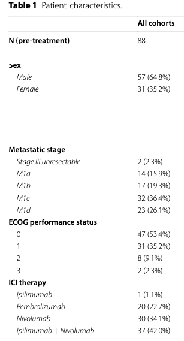

### Lezione 5
# La visualizzazione dei dati
## &nbsp;

---
## Obiettivi di apprendimento

- Decidere qual e' l'approccio migliore per rappresentare i diversi tipi di dati
- Saper interpretare grafici in articoli scientifici

<!-- Figures get more space in publications. This is quite easy in electronic publications, but also in print editions half or even full-page figures are becoming a sight. -->

---
## Variabili categoriche

#### Tabella di frequenza

* frequenza assoluta (numero)
* frequenza relativa (percentuale)

	
Visconti A., *et al.*, Total serum *N*‐glycans associate with response to immune checkpoint inhibition therapy and survival in patients with advanced melanoma, BMC Cancer, 2023 doi:10.1186/s12885-023-10511-3

---
## Variabili categoriche

#### Tabella di frequenza

* frequenza assoluta (numero)
* frequenza relativa (percentuale)

	
Visconti A., *et al.*, Total serum *N*‐glycans associate with response to immune checkpoint inhibition therapy and survival in patients with advanced melanoma, BMC Cancer, 2023 doi:10.1186/s12885-023-10511-3

---
## Bar chart

* frequenza assoluta

<!-- Diagramma a barre 

A barplot shows the relationship between a numeric and a categoric variable. Each entity of the categoric variable is represented as a bar. The size of the bar represents its numeric value.

Barplot is sometimes described as a boring way to visualize information. However it is probably the most efficient way to show this kind of data. Ordering bars and providing good annotation are often necessary.

Sorting bars often add insight.

Long labels? Think of an horizontal version.
-->

---
## Horizontal bar chart

* frequenza assoluta

<!-- Diagramma a barre orizzontali 
variazione ulteriore: Circular bar chart, lollipop -->

---
## Horizontal bar chart

* frequenza relativa

<!-- Diagramma a barre orizzontali 
variazione ulteriore: Circular bar chart, lollipop -->

---
## Pie chart

* frequenza relativa

<!-- Diagramma a torta

A pie chart is a circle divided into sectors that each represent a proportion of the whole. It is often used to show proportion, where the sum of the sectors equal 100%.

Pie charts are highly critized and must be avoided as much as possible. Human is very bad at translating angles towards values. 

Don't use it
Don't use 3D.
Don't use a legend, annotate directly each slice.
If displaying proportion, sum must add up to 100.
Don't put several pie charts one beside each other to compare them.

-->

---
## Donut chart

* frequenza relativa

<!-- Diagramma a ciambella - cugino di primo grado. 
Ho migliorato la grafica andando ad annotare le percentuali -->

---
## Waffle chart

* frequenza relativa

<!-- A Waffle Chart visually represents categorical data through a grid of small squares, resembling a waffle. Each category is assigned a unique color, and the number of squares allocated to each category corresponds to its proportional share of the total data count. 

Common Mistakes
 sum must add up to 100.
 -->

---
## Data visualisation: boxplots

<!-- boxplot consente di rappresentare visivamente alcune caratteristiche di una distribuzione statistica: 

- il grado di dispersione dei dati (via IQR)
-  la misura di tendenza centrale (via mediana)
- la forma della distribuzione (con i "baffi")
- la presenza di valori anomali -->

---
## Boxplots in the wild

Visconti A., *et al.*, Total serum *N*‐glycans associate with response to immune checkpoint inhibition therapy and survival in patients with advanced melanoma, BMC Cancer, 2023 doi:10.1186/s12885-023-10511-3

<!-- 50% dei dati sta tra -0.6 e 1, la mediana e' circa 0.3, il baffo ci dice che e' assimmetrica a dx, non ci sono outliers

conrontare due distribuzioni, simile IQR, ma diverse mediane

Mediana, quartili (ma anche percentili) si dicono misure di posizionamento perche' ci fanno "posizionare" i dati -->

---
## Data visualisation: DataSaurus Dozen

---

## The shape of a distribution

---
## In questa lezione abbiamo...

- imparato l'importanza dell'esplorazione grafica dei dati
- imparato come rappresentare ogni tipo di dato nel modo migliore
- imparato come interpretare i grafici all'interno di articoli scientifici
- esplorato alcuni limiti delle varie rappresentazioni grafiche introdotte
- esplorato alcune rappresetazioni fallaci dei dati

