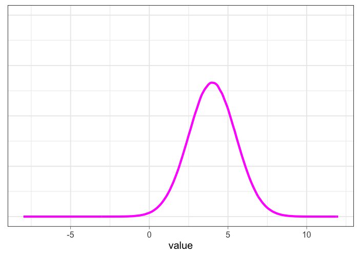
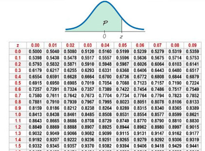

### Lezione 6

# La distribuzione normale
<!-- ## (Parte I: Stime e intervalli di confidenza) -->
## &nbsp;

---

## Obiettivi di apprendimento

- Conoscere le caratteristiche della distribuzione Normale
- Conoscere le caratteristiche della distribuzione Normale Standartizzata

---

## La distribuzione della popolazione

> Qual e' la distribuzione del peso alla nascita per i gemelli inglesi?

<!-- We have already discussed the concept of a data distribution – the pattern the data makes, sometimes known as the empirical or sample distribution. Next we must tackle the concept of a population distribution – the pattern in the whole group of interest.

Consider a British woman who has just given birth. We might think of her baby as having been drawn, as a sort of sample of only one person, from the entire population of babies recently born to non-Hispanic white women in the UK (her race is important, since birth weights are reported for different races). 
 -->

---

## La distribuzione della popolazione

> Qual e' la distribuzione del peso alla nascita per i gemelli inglesi?

$N=1000000$
$\mu = 2404g; \text{ } \sigma = 580g$
$mediana = 2408g$

<!-- The population distribution is the pattern made by the birth weights of all these babies, which we can obtain from the TwinsUK data on the weights for 1M twins born in the UK from 1917 to 1998 to non-Hispanic white women – although this is not the entire set of twin births, it is such a large sample that we can take it as the population. -->

---

## La distribuzione della popolazione

> Qual e' la distribuzione del peso alla nascita per i gemelli inglesi?

$N=1000000$
$\mu = 2404g; \text{ } \sigma = 580g$
$mediana = 2408g$

<!-- The shape of this distribution is important. Measurements such as weight, income, height, and so on can, at least in principle, be as fine-grained as desired, and so can be considered ‘continuous’ quantities whose population distributions are smooth. The classic example is the ‘bell-shaped curve’, or normal distribution, first explored in detail by Carl Friedrich Gauss.

Theory shows that the normal distribution can be expected to occur for phenomena that are driven by large numbers of small influences, for example a complex physical trait that is not influenced by just a few genes. 

Figure shows a normal curve with the same mean and standard deviation as the recorded weights. The smooth normal curve and the histogram are gratifyingly close, and other complex traits such as height and cognitive skills also have approximately normal population distributions. 
-->

---

## La distribuzione normale

- $\mathcal{N} = (\mu, \sigma^2)$
- $\text{moda} \equiv \text{media} \equiv \text{medana}$
- Simmetrica

<!-- The normal distribution is characterized by its mean, or expectation, and its standard deviation.

It is an impressive achievement to be able to summarize over a million births by just these two quantities. 
 -->

---
## Parametri *vs*&nbsp; statistiche

| Statistica | Popolazione| Campione |
| ----: | :-----: | :----: | 
| Media | $\mu$ | $\bar{x}$ |
| Deviazione Standard | $\sigma$ | $s$ |
| Proporzione | $\pi$ | $p$ |
| Numerosita' | $N$ | $n$ |

<!-- We see that the measures used to summarize data sets in Chapter 2 can be applied as descriptions of a population too – the difference is that terms such as mean and standard deviation are known as statistics when describing a set of data, and parameters when describing a population. -->

---

## Esercizio #1

:question: &nbsp;&nbsp;&nbsp; Qual e' la curva con la media
&nbsp;&nbsp;&nbsp;&nbsp;&nbsp;&nbsp;&nbsp;&nbsp;&nbsp; maggiore?

&nbsp;&nbsp;&nbsp;&nbsp;&nbsp;&nbsp;&nbsp;&nbsp;&nbsp; a) Verde
&nbsp;&nbsp;&nbsp;&nbsp;&nbsp;&nbsp;&nbsp;&nbsp;&nbsp; b) Blu
&nbsp;&nbsp;&nbsp;&nbsp;&nbsp;&nbsp;&nbsp;&nbsp;&nbsp; c) Gialla
&nbsp;&nbsp;&nbsp;&nbsp;&nbsp;&nbsp;&nbsp;&nbsp;&nbsp; d) Non lo posso sapere
&nbsp;&nbsp;&nbsp;&nbsp;&nbsp;&nbsp;&nbsp;&nbsp;&nbsp; e) Nessuna delle precedenti

---

## Esercizio #1 -- Soluzione

:question: &nbsp;&nbsp;&nbsp; Qual e' la curva con la media
&nbsp;&nbsp;&nbsp;&nbsp;&nbsp;&nbsp;&nbsp;&nbsp;&nbsp; maggiore?

&nbsp;&nbsp;&nbsp;&nbsp;&nbsp;&nbsp;&nbsp;&nbsp;&nbsp; a) Verde
&nbsp;&nbsp;&nbsp;&nbsp;&nbsp;&nbsp;&nbsp;&nbsp;&nbsp; b) Blu
&nbsp;&nbsp;&nbsp;&nbsp;&nbsp;&nbsp;&nbsp;&nbsp;&nbsp; c) Gialla
&nbsp;&nbsp;&nbsp;&nbsp;&nbsp;&nbsp;&nbsp;&nbsp;&nbsp; d) Non lo posso sapere
&nbsp;&nbsp;&nbsp;&nbsp;&nbsp;&nbsp;&nbsp;&nbsp;&nbsp; e) Nessuna delle precedenti &nbsp;&nbsp; :white_check_mark:

---

## Esercizio #2

:question: &nbsp;&nbsp;&nbsp; Qual e' la curva con la  
&nbsp;&nbsp;&nbsp;&nbsp;&nbsp;&nbsp;&nbsp;&nbsp;&nbsp; deviazione standard maggiore?

&nbsp;&nbsp;&nbsp;&nbsp;&nbsp;&nbsp;&nbsp;&nbsp;&nbsp; a) Verde
&nbsp;&nbsp;&nbsp;&nbsp;&nbsp;&nbsp;&nbsp;&nbsp;&nbsp; b) Blu
&nbsp;&nbsp;&nbsp;&nbsp;&nbsp;&nbsp;&nbsp;&nbsp;&nbsp; c) Gialla
&nbsp;&nbsp;&nbsp;&nbsp;&nbsp;&nbsp;&nbsp;&nbsp;&nbsp; d) Non lo posso sapere
&nbsp;&nbsp;&nbsp;&nbsp;&nbsp;&nbsp;&nbsp;&nbsp;&nbsp; e) Nessuna delle precedenti

---

## Esercizio #2 -- Soluzione

:question: &nbsp;&nbsp;&nbsp; Qual e' la curva con la  
&nbsp;&nbsp;&nbsp;&nbsp;&nbsp;&nbsp;&nbsp;&nbsp;&nbsp; deviazione standard maggiore?

&nbsp;&nbsp;&nbsp;&nbsp;&nbsp;&nbsp;&nbsp;&nbsp;&nbsp; a) Verde
&nbsp;&nbsp;&nbsp;&nbsp;&nbsp;&nbsp;&nbsp;&nbsp;&nbsp; b) Blu
&nbsp;&nbsp;&nbsp;&nbsp;&nbsp;&nbsp;&nbsp;&nbsp;&nbsp; c) Gialla &nbsp;&nbsp;&nbsp; :white_check_mark:
&nbsp;&nbsp;&nbsp;&nbsp;&nbsp;&nbsp;&nbsp;&nbsp;&nbsp; d) Non lo posso sapere
&nbsp;&nbsp;&nbsp;&nbsp;&nbsp;&nbsp;&nbsp;&nbsp;&nbsp; e) Nessuna di queste &nbsp;&nbsp;&nbsp;

<!-- A diverse combinazioni di mu/sigma corrispondono diverse (e infinte) ditribuzioni normali 
-->

---

## La distribuzione normale

- Area sottesa alla curva $= 1$
- proporzione $\equiv$ probabilita'

$\text{"very low birth weight"} < 1500 \text{g}$
$\text{Gemelli "very low birth weight"} = 6\%$
$\mathcal{P}(\text{"very low birth weight"}) = 0.06$

<!-- il fatto che l'area e' 1 dipende dal fatto che la normale sia una distribuzione di probabilita'

For medical rather than statistical reasons, babies below 1,500 g ‘very low birth weight’. Figure 3.2(d) shows that we would expect 6% of babies in this group to be very low birth weight – in fact the actual number is ~74K (0.7%), in close agreement with the prediction from the normal curve. 

 -->

---

## La distribuzione normale

- Regola del 3 $\sigma$:
  - 68% dei valori osservati sono a 1 $\sigma$ dalla media
  - 95% sono a 2 $\sigma$
  - 99.7% sono a 3 $\sigma$

- Regola empirica:
  - valori $< 2 \sigma$ sono *"comuni"*
  - valori $> 2 \sigma$ sono *"inusuali"*  
  - valori $> 3 \sigma$ sono *"anomali"*  

<!-- From the mathematical properties of the normal distribution, we know that roughly 95% of the population will be contained in the interval given by the mean ± two standard deviations, and 99.8% in the central ± three standard deviations. 

68% at 1SD -> valori comuni vs valori inusali

1.5 IQR (fence of the boxplot) -> If the data are normally distributed, the fence will be 2.7 standard deviations from the mean, so cases outside of it will be quite rare (0.4%)
-->

---

## Esercizio #3

:question: &nbsp;&nbsp;&nbsp; L'altezza della popolazione maschile italiana si distribuisce secondo
&nbsp;&nbsp;&nbsp;&nbsp;&nbsp;&nbsp;&nbsp;&nbsp;&nbsp;   una normale con media 170 cm e deviazione standard 9.5 cm

&nbsp;&nbsp;&nbsp;&nbsp;&nbsp;&nbsp;&nbsp;&nbsp;&nbsp; E' possibile calcolate i seguenti valori? Se si', quali sono?

&nbsp;&nbsp;&nbsp;&nbsp;&nbsp;&nbsp;&nbsp;&nbsp;&nbsp; a) La mediana
&nbsp;&nbsp;&nbsp;&nbsp;&nbsp;&nbsp;&nbsp;&nbsp;&nbsp; b) La proporzione di italiani con altezza >170cm
&nbsp;&nbsp;&nbsp;&nbsp;&nbsp;&nbsp;&nbsp;&nbsp;&nbsp; c) Le altezze inusuali
&nbsp;&nbsp;&nbsp;&nbsp;&nbsp;&nbsp;&nbsp;&nbsp;&nbsp; d) L'altezza piu' comune
&nbsp;&nbsp;&nbsp;&nbsp;&nbsp;&nbsp;&nbsp;&nbsp;&nbsp; e) L'italiano piu' alto di sempre

---

## Esercizio #3 -- Soluzione

:question: &nbsp;&nbsp;&nbsp; L'altezza della popolazione maschile italiana si distribuisce secondo
&nbsp;&nbsp;&nbsp;&nbsp;&nbsp;&nbsp;&nbsp;&nbsp;&nbsp;   una normale con media 170 cm e deviazione standard 9.5 cm

&nbsp;&nbsp;&nbsp;&nbsp;&nbsp;&nbsp;&nbsp;&nbsp;&nbsp; E' possibile calcolate i seguenti valori? Se si', quali sono?

&nbsp;&nbsp;&nbsp;&nbsp;&nbsp;&nbsp;&nbsp;&nbsp;&nbsp; a) La mediana $\rightarrow$ coincide con la media $= 170 cm$

---

## Esercizio #3 -- Soluzione

:question: &nbsp;&nbsp;&nbsp; L'altezza della popolazione maschile italiana si distribuisce secondo
&nbsp;&nbsp;&nbsp;&nbsp;&nbsp;&nbsp;&nbsp;&nbsp;&nbsp;   una normale con media 170 cm e deviazione standard 9.5 cm

&nbsp;&nbsp;&nbsp;&nbsp;&nbsp;&nbsp;&nbsp;&nbsp;&nbsp; E' possibile calcolate i seguenti valori? Se si', quali sono?

&nbsp;&nbsp;&nbsp;&nbsp;&nbsp;&nbsp;&nbsp;&nbsp;&nbsp; a) La mediana $\rightarrow$ 170cm
&nbsp;&nbsp;&nbsp;&nbsp;&nbsp;&nbsp;&nbsp;&nbsp;&nbsp; b) La proporzione di italiani con altezza >170cm $\rightarrow$ sono quelli a destra
&nbsp;&nbsp;&nbsp;&nbsp;&nbsp;&nbsp;&nbsp;&nbsp;&nbsp;&nbsp;&nbsp;&nbsp;&nbsp;&nbsp;&nbsp; della mediana, la meta' dell'area sottesa dalla curva $= 50\%$

---

## Esercizio #3 -- Soluzione

:question: &nbsp;&nbsp;&nbsp; L'altezza della popolazione maschile italiana si distribuisce secondo
&nbsp;&nbsp;&nbsp;&nbsp;&nbsp;&nbsp;&nbsp;&nbsp;&nbsp;   una normale con media 170 cm e deviazione standard 9.5 cm

&nbsp;&nbsp;&nbsp;&nbsp;&nbsp;&nbsp;&nbsp;&nbsp;&nbsp; E' possibile calcolate i seguenti valori? Se si', quali sono?

&nbsp;&nbsp;&nbsp;&nbsp;&nbsp;&nbsp;&nbsp;&nbsp;&nbsp; a) La mediana $\rightarrow$ 170cm
&nbsp;&nbsp;&nbsp;&nbsp;&nbsp;&nbsp;&nbsp;&nbsp;&nbsp; b) La proporzione di italiani con altezza >170cm $\rightarrow 50\%$
&nbsp;&nbsp;&nbsp;&nbsp;&nbsp;&nbsp;&nbsp;&nbsp;&nbsp; c) Le altezze inusuali $\rightarrow$ sono quelle >2SD dalla media
&nbsp;&nbsp;&nbsp;&nbsp;&nbsp;&nbsp;&nbsp;&nbsp;&nbsp;&nbsp;&nbsp;&nbsp;&nbsp;&nbsp; $= 170 + 9.5 \times 2 = 189 \text{cm}$

---

## Esercizio #3 -- Soluzione

:question: &nbsp;&nbsp;&nbsp; L'altezza della popolazione maschile italiana si distribuisce secondo
&nbsp;&nbsp;&nbsp;&nbsp;&nbsp;&nbsp;&nbsp;&nbsp;&nbsp;   una normale con media 170 cm e deviazione standard 9.5 cm

&nbsp;&nbsp;&nbsp;&nbsp;&nbsp;&nbsp;&nbsp;&nbsp;&nbsp; E' possibile calcolate i seguenti valori? Se si', quali sono?

&nbsp;&nbsp;&nbsp;&nbsp;&nbsp;&nbsp;&nbsp;&nbsp;&nbsp; a) La mediana $\rightarrow$ 170cm
&nbsp;&nbsp;&nbsp;&nbsp;&nbsp;&nbsp;&nbsp;&nbsp;&nbsp; b) La proporzione di italiani con altezza >170cm $\rightarrow 50\%$
&nbsp;&nbsp;&nbsp;&nbsp;&nbsp;&nbsp;&nbsp;&nbsp;&nbsp; c) Le altezze inusuali $\rightarrow \text{ } >189 \text{cm}$
&nbsp;&nbsp;&nbsp;&nbsp;&nbsp;&nbsp;&nbsp;&nbsp;&nbsp; d) L'altezza piu' comune $\rightarrow$ e' la moda, che coincide con la media
&nbsp;&nbsp;&nbsp;&nbsp;&nbsp;&nbsp;&nbsp;&nbsp;&nbsp;&nbsp;&nbsp;&nbsp;&nbsp;&nbsp; e la mediana $= 170 cm$

---

## Esercizio #3 -- Soluzione

:question: &nbsp;&nbsp;&nbsp; L'altezza della popolazione maschile italiana si distribuisce secondo
&nbsp;&nbsp;&nbsp;&nbsp;&nbsp;&nbsp;&nbsp;&nbsp;&nbsp;   una normale con media 170 cm e deviazione standard 9.5 cm

&nbsp;&nbsp;&nbsp;&nbsp;&nbsp;&nbsp;&nbsp;&nbsp;&nbsp; E' possibile calcolate i seguenti valori? Se si', quali sono?

&nbsp;&nbsp;&nbsp;&nbsp;&nbsp;&nbsp;&nbsp;&nbsp;&nbsp; a) La mediana $\rightarrow$ 170cm
&nbsp;&nbsp;&nbsp;&nbsp;&nbsp;&nbsp;&nbsp;&nbsp;&nbsp; b) La proporzione di italiani con altezza >170cm $\rightarrow 50\%$
&nbsp;&nbsp;&nbsp;&nbsp;&nbsp;&nbsp;&nbsp;&nbsp;&nbsp; c) Le altezze inusuali $\rightarrow \text{ } 189 \text{cm}$
&nbsp;&nbsp;&nbsp;&nbsp;&nbsp;&nbsp;&nbsp;&nbsp;&nbsp; d) L'altezza piu' comune $\rightarrow 170 \text{cm}$
&nbsp;&nbsp;&nbsp;&nbsp;&nbsp;&nbsp;&nbsp;&nbsp;&nbsp; e) L'italiano piu' alto di sempre $\rightarrow$ non si puo' calcolare

---

## Esercizio #4

:question: &nbsp;&nbsp;&nbsp; Con quale probabilità si potrà trovare nella popolazione
&nbsp;&nbsp;&nbsp;&nbsp;&nbsp;&nbsp;&nbsp;&nbsp;&nbsp; soggetti con valori superiori alla mediana?

&nbsp;&nbsp;&nbsp;&nbsp;&nbsp;&nbsp;&nbsp;&nbsp;&nbsp; a) 25%
&nbsp;&nbsp;&nbsp;&nbsp;&nbsp;&nbsp;&nbsp;&nbsp;&nbsp; b) 50%
&nbsp;&nbsp;&nbsp;&nbsp;&nbsp;&nbsp;&nbsp;&nbsp;&nbsp; c) 75%
&nbsp;&nbsp;&nbsp;&nbsp;&nbsp;&nbsp;&nbsp;&nbsp;&nbsp; d) Servono piu' informazioni per poter rispondere

---

## Esercizio #4 -- Soluzione

:question: &nbsp;&nbsp;&nbsp; Con quale probabilità si potrà trovare nella popolazione
&nbsp;&nbsp;&nbsp;&nbsp;&nbsp;&nbsp;&nbsp;&nbsp;&nbsp; soggetti con valori superiori alla mediana?

&nbsp;&nbsp;&nbsp;&nbsp;&nbsp;&nbsp;&nbsp;&nbsp;&nbsp; a) 25%
&nbsp;&nbsp;&nbsp;&nbsp;&nbsp;&nbsp;&nbsp;&nbsp;&nbsp; b) 50% &nbsp;&nbsp;&nbsp; :white_check_mark:
&nbsp;&nbsp;&nbsp;&nbsp;&nbsp;&nbsp;&nbsp;&nbsp;&nbsp; c) 75%
&nbsp;&nbsp;&nbsp;&nbsp;&nbsp;&nbsp;&nbsp;&nbsp;&nbsp; d) Servono piu' informazioni per poter rispondere

<!--  

---
## La forma della distribuzione

<!-- Asimmetrica a destra/sinistra, dipende dalla presenza di valori anomali, vedremo meglio questo nella prossima lezione dedicata alla visualizzazione dei dati 

---
## Moda *vs* &nbsp;mediana *vs* &nbsp;media

 -->

<!-- La moda e' la parte piu' alta della curva, la mediana divide l'area in 2 parti uguali e la media e' il "balance point", quello in cui starebbe in equilibrio se fosse fatta di un materiale solido 

 Scelta della misura di tendenza centrale
- media se la distribuzione è simmetrica
- mediana se la distribuzione NON è simmetrica
(forse a causa di valori estremi)
- moda per indicare il valore più comune nell’ambito
della distribuzione 

-->

---

## Proporzione $\equiv$ probabilita'

- 6% dei gemelli sono "very low birth weight"
- La probabilita' essere "very low birth weight" e' 0.06

Ma come e' stato calcolato?

<!-- Ritorniamo ad una cosa che vi ho detto prima -->

<!-- ---
## The Standard Normal distribution

- $\mathcal{N} = Z = (0, 1)$

 -->

<!-- Distribuzione normale standardizzata -->

---
## La standardizzazione

- $\mathcal{N} = (\mu, \sigma^2) \rightarrow Z = (0, 1)$

<!-- Utilizzando una procedura chiamata standardizzazione

Magenta: mu=4, sd=1.5 -->

---

## La standardizzazione

- $\mathcal{N} = (\mu, \sigma^2) \rightarrow Z = (0, 1)$

- $z = \frac{x - \mu}{}$

---

## La standardizzazione

- $\mathcal{N} = (\mu, \sigma^2) \rightarrow Z = (0, 1)$

- $z = \frac{x - \mu}{\sigma}$

---

## La distribuzione normale standartizzata

- $\mathcal{N} = (\mu, \sigma^2) \rightarrow Z = (0, 1)$

- $z = \frac{x - \mu}{\sigma}$

<!-- 
this is also known as her Z-score, which simply measures how many standard deviations a data-point is from the mean.

E perche la SND ci piace? Perche' esistono delle tavole che ci dicono qual e' l'area sottesa  ad una certa porzione della curva, che corrispondono alla probabilita' di trovare (nel caso di queste tavole) un valore < di quello osservato (area colorata)

Ci sono diverse versioni di queste tabelle, per esempio quella complementare che riporta l'area per la zona bianca (probabilita' di osservare valori piu' estremi) -->

---
## Calcoliamo la probabilita'/proporzione

:pushpin: &nbsp;&nbsp;&nbsp; $\mu = 2404g; \text{ } \sigma = 580g$

&nbsp;&nbsp;&nbsp;&nbsp;&nbsp;&nbsp;&nbsp;&nbsp;&nbsp;

&nbsp;&nbsp;&nbsp;&nbsp;&nbsp;&nbsp;&nbsp;&nbsp;&nbsp; $\mathcal{P}(x \geq 1500) = \text{ ?}$

---
## Calcoliamo la probabilita'/proporzione

:pushpin: &nbsp;&nbsp;&nbsp; $\mu = 2404g; \text{ } \sigma = 580g$

&nbsp;&nbsp;&nbsp;&nbsp;&nbsp;&nbsp;&nbsp;&nbsp;&nbsp; $\mathcal{z} = \frac{x - \mu}{\sigma} =  \frac{2404 - 1500}{580}$
&nbsp;&nbsp;&nbsp;&nbsp;&nbsp;&nbsp;&nbsp;&nbsp;&nbsp;&nbsp;&nbsp;&nbsp;&nbsp; $= 1.56$

&nbsp;&nbsp;&nbsp;&nbsp;&nbsp;&nbsp;&nbsp;&nbsp;&nbsp; $\mathcal{P}(x < 1500) = \text{ ?}$

---
## Calcoliamo la probabilita'/proporzione

:pushpin: &nbsp;&nbsp;&nbsp; $\mu = 2404g; \text{ } \sigma = 580g$

&nbsp;&nbsp;&nbsp;&nbsp;&nbsp;&nbsp;&nbsp;&nbsp;&nbsp; $\mathcal{z} = \frac{x - \mu}{\sigma} =  \frac{2404 - 1500}{580}$
&nbsp;&nbsp;&nbsp;&nbsp;&nbsp;&nbsp;&nbsp;&nbsp;&nbsp;&nbsp;&nbsp;&nbsp;&nbsp; $= 1.56$

 

&nbsp;&nbsp;&nbsp;&nbsp;&nbsp;&nbsp;&nbsp;&nbsp;&nbsp; $\mathcal{P}(x < 1500) = \text{ ?}$

---
## Calcoliamo la probabilita'/proporzione

:pushpin: &nbsp;&nbsp;&nbsp; $\mu = 2404g; \text{ } \sigma = 580g$

&nbsp;&nbsp;&nbsp;&nbsp;&nbsp;&nbsp;&nbsp;&nbsp;&nbsp; $\mathcal{z} = \frac{x - \mu}{\sigma} =  \frac{2404 - 1500}{580}$
&nbsp;&nbsp;&nbsp;&nbsp;&nbsp;&nbsp;&nbsp;&nbsp;&nbsp;&nbsp;&nbsp;&nbsp;&nbsp; $= 1.56$

 

&nbsp;&nbsp;&nbsp;&nbsp;&nbsp;&nbsp;&nbsp;&nbsp;&nbsp; $\mathcal{P}(x < 1500) = 1 - 0.9406 = 0.0594 \rightarrow 5.94\%$

---
### Cosa abbiamo imparato in questa lezione?

- la popolazione viene rappresentata con dei parametri equivalenti alle statistiche usate per i campioni
- diversi fenomeni naturali sono normalmente distribuiti
- la normale e' definita dalla sua media e deviazione standard e corrisponde a una distribuzione di probabilita'
- la distribuzione (normale) di una popolazione ci fornisce la probabilita' di estrarre un individuo da quella popolazione ma anche la sua frequenza nella popolazione 
- se i dati sono normalmente distribuiti, il 68% della popolazione si trova a 1 SD dalla media, il 95% a 2 e il 99.7% a 3

