### Lezione 7
# La statistica inferenziale
## (Parte I: Causalita')
## &nbsp;

---
## Obiettivi di apprendimento

- Definire cosa si intende per "causalita'" in ambito statistico
- Saper distinguere tra studi randomizzati e osservazionali
- Conoscere alcuni approcci statistici per identificare causalita' 

---
## Le fasi della ricerca

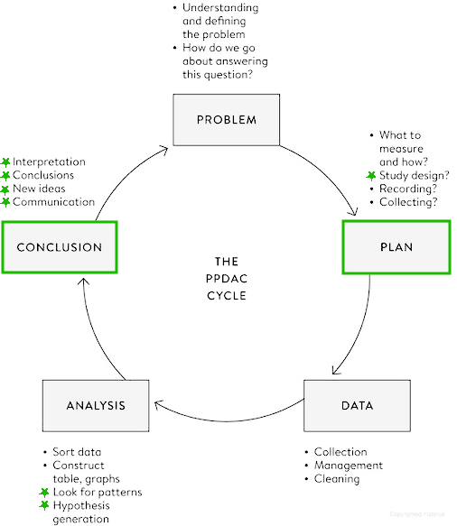

Spiegelhalter, D., *The Art of Statistics: Learning From Data*, Pelican, 2019

<!-- The Analysis stage has traditionally been the main emphasis of statistics courses, and we shall cover a range of analytic techniques in this book; but sometimes all that is required is a useful visualization, as in Figure 0.1. 

Finally, the key to good statistical science is drawing appropriate Conclusions that fully acknowledge the limitations in the evidence, and communicating them clearly, as in the graphical illustrations of the Shipman data. Any conclusions generally raise more questions, and so the cycle starts over again, as when we started looking at the time of day when Shipman’s patients died.
 -->

---
## Chi causa cosa?

> Cosa è successo ai bambini sottoposti a interventi cardiochirugici in alcuni ospedali britannici tra il 1984 e il 1995?

<!-- When considering English hospitals conducting children’s heart surgery in the 1990s, and plotting the number of cases against their survival, the high correlation showed that bigger hospitals were associated with lower mortality. But we could not conclude that bigger hospitals caused the lower mortality.

There seems to be a deep human need to explain things that happen in terms of simple cause–effect relationships – I am sure we could all construct a good story about all those new engineers gorging on pizzas. There is even a word for the tendency to construct reasons for a connection between what are actually unrelated events – apophenia – with the most extreme case being when simple misfortune or bad luck is blamed on others’ ill-will or even witchcraft.
-->

---
## Ma cosa vuol dire "causalita'?

* X causa Y significa che X influenza il numero di volte che avviene Y
  - non che Y accade ogni volta che accade X
  - non che Y accade solo se accade X

* Per capire se X causa Y dobbiamo
  - intervenire attraverso degli esperimenti
  - generare piu' di un'osservazione

<!-- t seems rather simple in real life: we do something, and that leads to something else. Batto il ginocchio e sento dolore. Ma chi mi garantisce che il ginocchio nn mi avrebbe fatto male anche se non avessi battuto? questione di lana caprina, perche' in questo caso sono abbastanza confidente che non mi avrebbe fatto male

So our ‘statistical’ idea of causation is not strictly deterministic. When we say that X causes Y, we do not mean that every time X occurs, then Y will too. Or that Y will only occur if X occurs. We simply mean that if we intervene and force X to occur, then Y tends to happen more often. So we can never say that X caused Y in a specific case, only that X increases the proportion of times that Y happens. This has two vital consequences for what we have to do if we want to know what causes what. First, in order to infer causation with real confidence, we ideally need to intervene and perform experiments. Second, since this is a statistical or stochastic world, we need to intervene more than once in order to amass evidence.

-->

---
#### Pregare dimiuisce le complicazioni di un bypass coronarico?

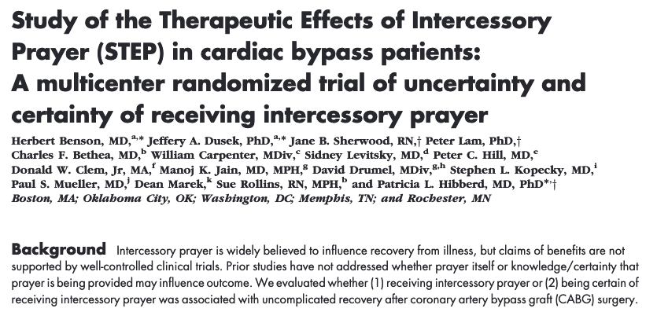

<!--  PPDAC Primo punto, ci poniamo un problema 

Patients undergoing CABG often report that they are depressed, and depression is associated with cardiac events and mortality after CABG. 

Many patients report using private or family prayer to cope with this stressful experience

-->

---
#### Pregare dimiuisce le complicazioni di un bypass coronarico?

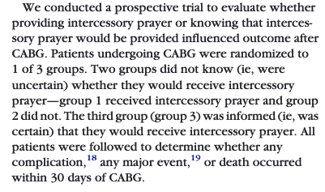

<!-- 
Prospective study when a set of individuals are identified, background factors measured, and then they are followed up and relevant outcomes observed. Such studies are lengthy and expensive, and may not identify many rare events.

Iniziamo ad introdurre un po' A proper medical trial should ideally obey the following principles:

Allocation of treatment: It is important to compare like with like, so the treatment and comparison groups have to be as similar as possible. The best way to ensure this is by randomly allocating participants to be treated or not, and then seeing what happens to them – this is known as a randomized controlled trial (RCT). Statin trials do this with enough people so that the two groups should be similar in all factors that could otherwise influence the outcome, including – and this is critically important – those factors that we don’t know about. 

Controls: If we want to investigate the effect of statins on a population, we can’t just give statins to a few people, and then, if they don’t have a heart attack, claim this was due to the pill (regardless of the websites that use this form of anecdotal reasoning to market their products). We need an intervention group, who will be given statins, and a control group who will be given sugar pills or placebos.

 -->

---
#### Pregare dimiuisce le complicazioni di un bypass coronarico?

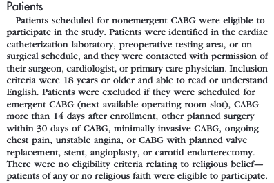

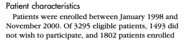

:question: &nbsp;&nbsp;&nbsp; Che approccio di campionamento
&nbsp;&nbsp;&nbsp;&nbsp;&nbsp;&nbsp;&nbsp;&nbsp;&nbsp; e' stato usato?

:question: &nbsp;&nbsp;&nbsp; Ci possono essere dei bias?

---
#### Pregare dimiuisce le complicazioni di un bypass coronarico?

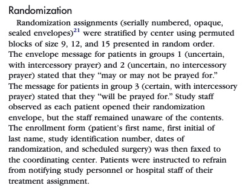

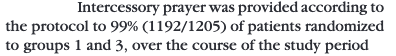

<!-- A proper medical trial should ideally obey the following principles:

If possible, people should not even know which group they are in: In the statin trials, both the real statins and the placebo pills looked identical and so the participants were blinded to the treatment they were taking.

If possible, those assessing the final outcomes should not know which group the subjects are in: If a doctor believes that a treatment works, they may exaggerate benefit for the treatment group through an unconscious bias.

People should be counted in the groups to which they were allocated: The people allocated to the ‘statin’ group in the Heart Protection Study (HPS) were included in the final analysis even if they did not take their statins. This is known as the ‘intention to treat’ principle, and can seem rather odd. It means that the final estimate of the effect of statins really measures the effect of being prescribed statins rather than actually taking them. 

 -->

---
#### Pregare dimiuisce le complicazioni di un bypass coronarico?

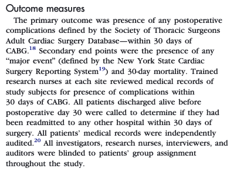

<!-- Groups should be treated equally: If the group allocated to statins were invited back for more frequent hospital appointments, or examined more carefully, it would be impossible to separate the benefits of the drug from the benefits of increased general care. In the HPS, staff doing the follow-up clinics did not know whether the patients were taking a real statin or a placebo, so they were also blinded to the allocated treatment. Since these people who switch treatments tend to muddy the difference between the groups, we might expect the apparent effect in an ‘intention-to-treat’ analysis to be less than the effect of actually taking the drug.

Measure everyone: Every effort must be made to follow everyone up, as people who drop out of the study might, for example, have done so because of the drug’s side effects. 
 -->

---
#### Pregare dimiuisce le complicazioni di un bypass coronarico?

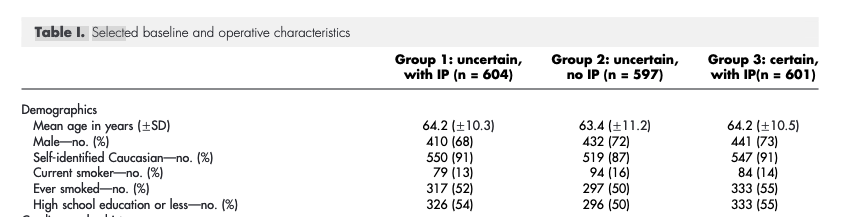

:question: &nbsp;&nbsp;&nbsp; Di che tipo sono i dati mostrati in questo pezzo di Table 1?
:question: &nbsp;&nbsp;&nbsp; Potevano essere raccolti/mostrati in modo diverso?
:question: &nbsp;&nbsp;&nbsp; Come potrei confrontare, a colpo d'occhio, se una persona e' "religiosa"?

<!-- Piu' granularita nell'etnia/studio, scrivere chiaramente chi sono i non fumatori 

Usando le proporzioni
-->

---
#### Pregare dimiuisce le complicazioni di un bypass coronarico?

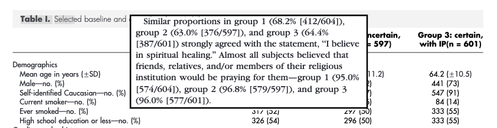

:question: &nbsp;&nbsp;&nbsp; Di che tipo sono i dati mostrati in questo pezzo di Table 1?
:question: &nbsp;&nbsp;&nbsp; Potevano essere mostrati in modo diverso?
:question: &nbsp;&nbsp;&nbsp; Come potrei confrontare, a colpo d'occhio, se una persona e' "religiosa"?

---
#### Pregare dimiuisce le complicazioni di un bypass coronarico?

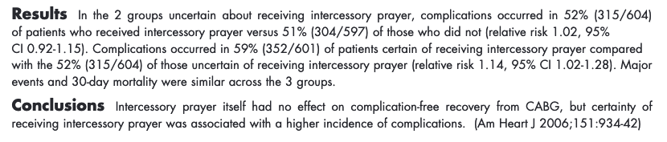

<!-- Per il momento sorvoliamo sulla parte di analisi, la vedremo tra qualche lezione , ma soffermiamoci sui risultati

The only apparent effect was a small increase in complications in the group that knew they were being prayed for: one of the researchers commented, ‘It may have made them uncertain, wondering, “Am I so sick they had to call in their prayer team?”.’6

Those who were allocated to the statin group clearly had better health outcomes on average, and since patients were randomized and otherwise treated identically, this can be assumed to be a causal effect due to being prescribed statins. But we have seen that many people did not actually adhere to the treatment they had been allocated, and this leads to some dilution of the difference between the groups: the HPS researchers estimate the true effect of actually taking statins is about 50% higher than shown in Table 4.1.

Two final key points:

Don’t rely on a single study: A single statin trial may tell us that the drug worked in a particular group in a particular place, but robust conclusions require multiple studies.
Review the evidence systematically: When looking at multiple trials, make sure to include every study that has been done, and so create what is known as a systematic review. The results may then be formally combined in a meta-analysis.
-->

---
## Se non posso randomizzare?

<!-- we can’t test the effect of our habits by randomizing people to smoke or eat unhealthy diets (even though such experiments are performed on animals). When the data does not arise from an experiment, it is said to be observational. So often we are left with trying as best we can to sort out correlation from causation by using good design and statistical principles applied to observational data, combined with a healthy dose of scepticism. -->

---
## Se non posso randomizzare?

> Le persone anziane hanno le orecchie piu' lunghe?

---
## Se non posso randomizzare?

> Le persone anziane hanno le orecchie piu' lunghe?

<!-- A chance observation—that older people have bigger ears—was at first controversial but has been shown to be true. 

Replicato in Italia e in Giappone

For the researchers the experience of involving patients in business beyond their presenting symptoms proved to be a positive one, and it was rewarding to find a clear result. Why ears should get bigger when the rest of the body stops growing is not answered by this research. Nor did we consider whether this change in a particular part of the anatomy is a marker of something less easily measurable elsewhere or throughout the body. 

The challenge is then to try to explain this association. Do ears carry on growing with age? Or did people who are old now always have bigger ears, and something has happened over the last decades to make more recent generations have smaller ears? Or is it that men with smaller ears simply die earlier for some reason; there is a traditional Chinese belief that big ears predict a longer life.
-->

---
### Come spiegare questa associazione?

* **Prospective cohort study**: recluto una corte di giovani uomini e donne, e misuro le loro orecchie per controllare se crescono, o se le persone con orecchie piu' piccole muoiono prima

* **Retrospective cohort study**: reculto delle persone anziane e cerco di capire se le loro orecchie sono cresciute, magari usand delle foto

* **Case-control study**: identifico un gruppo di persone, ne misuro le orecchie e poi cerco persone che sono morte che siano comparabili in fatto di eta' e altri fattori che predicono la longevita' (e di cui conosco la misura delle orecchie) e controllo se le orecchie dei sopravvissuti sono piu' lunghe

<!-- And so the problem-solving cycle would start again. -->

---
## Associazioni spurie

> C'e' una correlazione tra la vendita di gelati e il numero di persone che affogano

&nbsp;&nbsp;&nbsp;&nbsp;&nbsp;&nbsp;&nbsp;&nbsp;&nbsp;&nbsp;&nbsp;&nbsp;&nbsp;&nbsp;&nbsp;&nbsp;&nbsp;&nbsp; $\rightarrow$ Spiegabile dalle condizioni metereologiche

* Controllo per la temperatura
* Stratifico per la temperatura

<!-- The simplest technique for dealing with confounders is to look at the apparent relationship within each level of the confounder. This is known as adjustment, or stratification. So for example we could explore the relationship between drownings and ice-cream sales on days with roughly the same temperature. 

inclusion into a regression model of known confounders which are not of direct interest, but are intended to allow a more balanced comparison between groups. The hope is that estimated effects associated with explanatory variables of interest should then be closer to causal effects.

-->

---
### Studi osservazionali e causalita'

* Evidenza diretta
  - Effetto troppo grande per essere spiegato da altri fattori
  - Prossimita' spaziale e/o temporale
  - Risposta in base alla dose

* Evidenza meccanicistica
  - esiste un meccanismo di azione (biologico, chimico, meccanico) plausibile

* Evidenza parallela
  - l'effetto e' in linea con quello che si conosce
  - l'effetto e' osservato se lo studio e' replicato in modo identico
  - l'effetto e' osservato anche in studi simili ma non identici

<!-- Austin Bradford Hill in 1965 he set out a list of criteria that needed to be considered before concluding that an observed link between an exposure and an outcome was causal, where an exposure might comprise anything from chemicals in the environment to habits such as smoking or lack of exercise.

These criteria have been subsequently much debated, and the version shown below was developed by Jeremy Howick and colleagues, separated into what they call direct, mechanistic and parallel evidence.12

These guidelines might enable causation to be determined from anecdotal evidence, even in the absence of a randomized trial. For example, mouth ulcers have been observed to occur after aspirin is rubbed within the mouth, say to relieve tooth pain. The effect is dramatic (obeys guideline 1), occurs where rubbed (2), is a plausible response to an acidic compound (4), is not contradicted by current science and is similar to the known effect of aspirin in causing stomach ulcers (5), and has been repeatedly observed in multiple patients (6). So five out of seven guidelines are satisfied, the remaining two have not been tested, and so it is reasonable to conclude this is a genuine adverse reaction to the drug. -->

---
### Cosa abbiamo imparato in questa lezione?

- Causalita', in senso statisto, implica che, a seguito di un intervento, le proabilita' di eventi diversi cambino
- Stabilire un nesso causale in senso statistico non e' semplice, e il modo migliore e' via studi randomizzati, a patto che siano ben disegnati
- Gli studi osservazionali possono essere influenzati da fattori esterni, e mentre ci sono approcchi statistici per controllare questa influenza, serve buon senso e conoscenza del dominio per distringuere correlazione da causa

