### Lezione 8
# La statistica inferenziale
## (Parte II: Stime e intervalli di confidenza)
## &nbsp;

---
## Obiettivi di apprendimento

- Saper passare da una distribuzione empirica (o campionaria) alla distrubuzione della popolazione
- Saper comunicare l'incertezza di una statistica
- Saper calcolare e interpretare un intervallo di confidenza

---
## Le fasi della ricerca

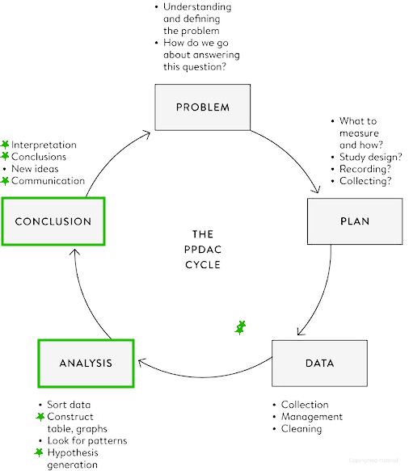

Spiegelhalter, D., *The Art of Statistics: Learning From Data*, Pelican, 2019

<!-- The Analysis stage has traditionally been the main emphasis of statistics courses, and we shall cover a range of analytic techniques in this book; but sometimes all that is required is a useful visualization, as in Figure 0.1. 

Finally, the key to good statistical science is drawing appropriate Conclusions that fully acknowledge the limitations in the evidence, and communicating them clearly, as in the graphical illustrations of the Shipman data. Any conclusions generally raise more questions, and so the cycle starts over again, as when we started looking at the time of day when Shipman’s patients died.
 -->

---
##   &nbsp;&nbsp;&nbsp;&nbsp;&nbsp;&nbsp;:warning:  Attenzione  :warning:

&nbsp;&nbsp;&nbsp;&nbsp;&nbsp;&nbsp;&nbsp;&nbsp;&nbsp; Se questa parte vi sembra difficile e' perche' e' difficile.

&nbsp;&nbsp;&nbsp;&nbsp;&nbsp;&nbsp;&nbsp;&nbsp;&nbsp; Potreste doverci spendere un bel po' di tempo prima di 
&nbsp;&nbsp;&nbsp;&nbsp;&nbsp;&nbsp;&nbsp;&nbsp;&nbsp; riuscire a capirla del tutto: non vi preoccupate, e' normale 
&nbsp;&nbsp;&nbsp;&nbsp;&nbsp;&nbsp;&nbsp;&nbsp;&nbsp; e ci siamo passati tutti!

---
## Dalla popolazione al campione

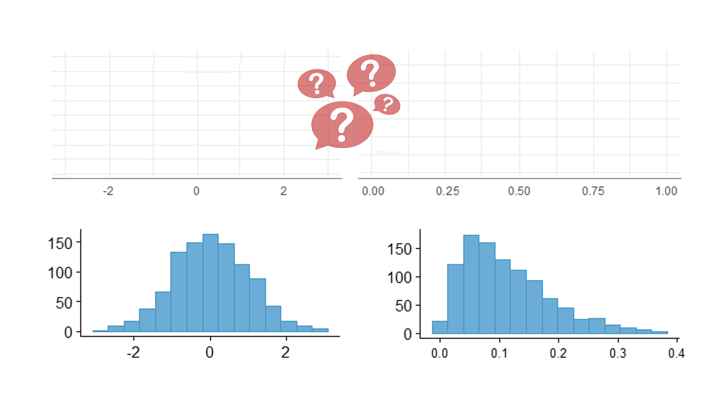

<!-- Ricapitoliamo: quando non possiamo studiare una popolazione ne usiamo un campione rappresentativo -->

---
## Dalla popolazione al campione

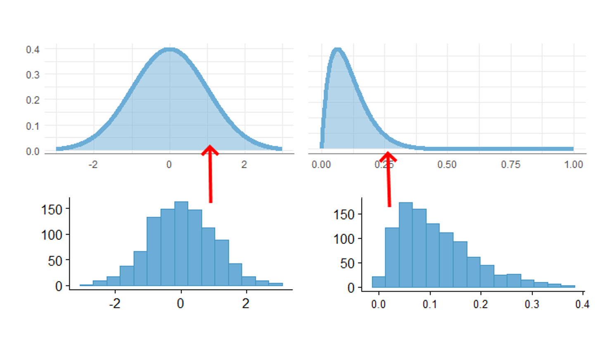

<!-- e poi usiamo le informazioni raccolte dal campione per trarre delle conclusioni sulla popolazione 
Questo processo si chiama statistica inferenziale,

Procedimento induttivo che ha lo scopo di stimare i parametri (caratteristiche) sconosciuti della popolazione a partire dalle statistiche (stime conosciute) del campione 

Sulla base di un campione estratto casualmente da 1 popolazione cosa può essere detto circa la popolazione da cui il campione è stato estratto? -->

---
## Quanto siamo precisi?

> Quanti partner sessuali le persone in Gran Bretagna riferiscono di aver avuto nella loro vita?

&nbsp;&nbsp;&nbsp;&nbsp;&nbsp;&nbsp;&nbsp;&nbsp;&nbsp; $N_\text{donne} = 1100$
&nbsp;&nbsp;&nbsp;&nbsp;&nbsp;&nbsp;&nbsp;&nbsp;&nbsp; $N_\text{uomini} = 796$

|  | Uomini 35-44 | Donne 35-44 |
| ----: | -----: | ----: |
| Moda | 1 | 1  |
| Range | 0-500 | 0-550  |
| Media |  14.3 | 8.5 | 
| SD | 24.2 | 19.7  | 
| Mediana |  8 | 5  | 
| IQR | 4-18 (14) | 3-10 (7) |

<!-- In the age band of 35–44 there were 1,100 female and 796 male respondents, so it was a large survey from which the sample summary statistics shown in Table 2–2 were calculated, such as the median number of reported partners being 8 for men and 5 for women. Since we know the survey was based on a proper random-sampling scheme, it is fairly reasonable to assume that the study population matches the target population, which is the adult British population. The crucial question is: how close are these statistics to what we would have found had we been able to ask everyone in the country? -->

---
## Ricalcoliamo senza i "valori anomali"

> Quanti partner sessuali gli uomini inglesi, tra i 35 e 44 anni di eta', riferiscono di aver avuto nella loro vita?

&nbsp;&nbsp;&nbsp;&nbsp;&nbsp;&nbsp;&nbsp;&nbsp;&nbsp; $N_\text{uomini} = 760$

|  | Uomini 35-44 |
| ----: | -----: | 
| Moda | 1 |
| Range | 0-50 | 
| Media |  11.4 | 
| SD | 11.2 |  
| Mediana |  7 |
| IQR | 4-16 (12) |

<!-- Per semplificare la visualizzazione, concentriamoci sugli uomini che hanno avuto < 50 partner (solo 36 riportano di averne avuto di piu'), quindi ricalcoliamo tutte le statistiche su questo campione 

I valori anomali propriamente detti (che impareremo a calcolare poi) sarebbero quelli >87, ma facciamo finta vada bene cosi'

Notiamo i valori "stabili"
-->

---
## La dimensione del campione

> Quanti partner sessuali gli uomini inglesi, tra i 35 e 44 anni di eta', riferiscono di aver avuto nella loro vita?

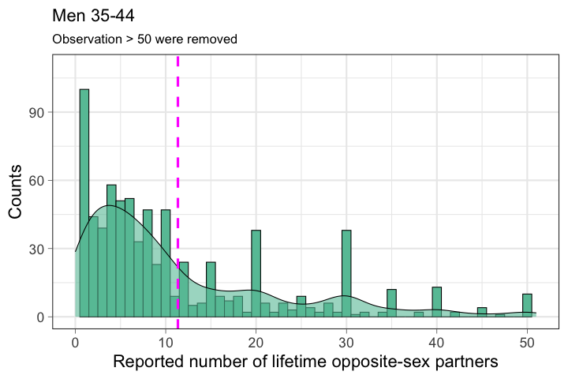

<!-- Magenta dotted line is the mean
Density should use another scale 

As an illustration of how the accuracy of statistics depends on sample size, we shall pretend for the moment that the men in the survey in fact represent the population in which we are interested. 
-->

---
## La dimensione del campione

&nbsp;&nbsp;&nbsp;&nbsp;&nbsp;&nbsp;&nbsp;&nbsp;&nbsp; $N_\text{campione} = 10$

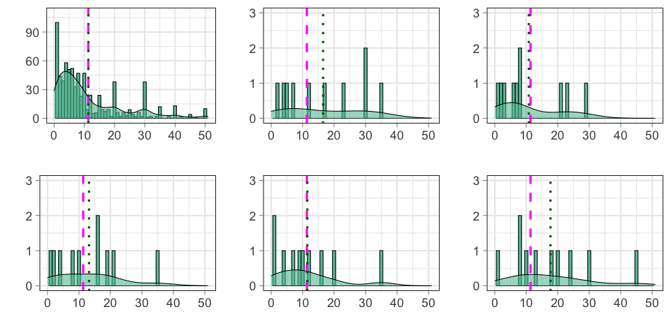

<!--
For illustration, we then take successive samples of individuals from this ‘population’ of 760 men, pausing when we reach 10, 50, 100 and 200 men. 

The data distributions of these samples are shown 

it is clear that the smaller samples are ‘bumpier’, and the summary stats (mean here) is sensitive to single data-points

 Magenta dotted line is the mean
Density should use another scale -->

---
## La dimensione del campione

&nbsp;&nbsp;&nbsp;&nbsp;&nbsp;&nbsp;&nbsp;&nbsp;&nbsp; $N_\text{campione} = 50$

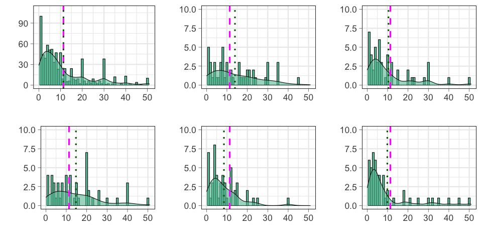

<!-- the rather high number of partners  in the first sample of ten individuals gets steadily overwhelmed, as the statistics get closer and closer to those of the whole group of 796 men as the sample size increases. -->

---
## La dimensione del campione

&nbsp;&nbsp;&nbsp;&nbsp;&nbsp;&nbsp;&nbsp;&nbsp;&nbsp; $N_\text{campione} = 100$

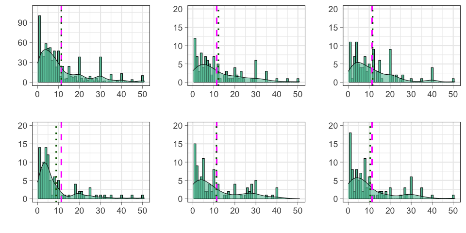

<!-- the rather high number of partners  in the first sample of ten individuals gets steadily overwhelmed, as the statistics get closer and closer to those of the whole group of 796 men as the sample size increases. -->

---
## La dimensione del campione

&nbsp;&nbsp;&nbsp;&nbsp;&nbsp;&nbsp;&nbsp;&nbsp;&nbsp; $N_\text{campione} = 200$

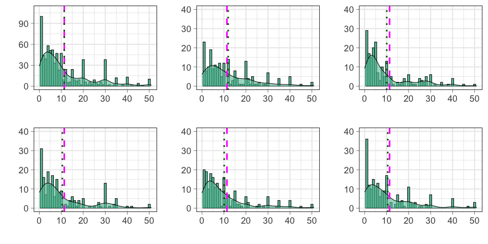

<!-- the rather high number of partners  in the first sample of ten individuals gets steadily overwhelmed, as the statistics get closer and closer to those of the whole group of 796 men as the sample size increases. -->

---
## La dimensione del campione

&nbsp;&nbsp;&nbsp;&nbsp;&nbsp;&nbsp;&nbsp;&nbsp;&nbsp; $N_\text{campione} = 380$

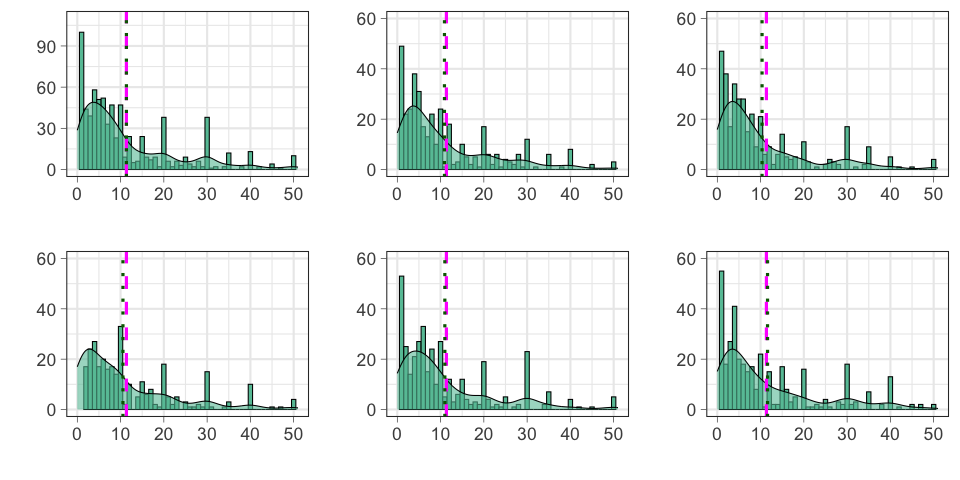

<!-- the rather high number of partners  in the first sample of ten individuals gets steadily overwhelmed, as the statistics get closer and closer to those of the whole group of 796 men as the sample size increases. -->

---
## Esercizio #1

:question: &nbsp;&nbsp;&nbsp; Al crescere della dimensione del campione

&nbsp;&nbsp;&nbsp;&nbsp;&nbsp;&nbsp;&nbsp;&nbsp;&nbsp; a) migliorano le stime dei parametri
&nbsp;&nbsp;&nbsp;&nbsp;&nbsp;&nbsp;&nbsp;&nbsp;&nbsp; b) le statistiche diventano piu' sensibili alle singole osservazioni 
&nbsp;&nbsp;&nbsp;&nbsp;&nbsp;&nbsp;&nbsp;&nbsp;&nbsp; c) non c'e' differenza

<button id="countdown_exercise_1"></button>

---
## Esercizio #1 -- Soluzione

:question: &nbsp;&nbsp;&nbsp; Al crescere della dimensione del campione

&nbsp;&nbsp;&nbsp;&nbsp;&nbsp;&nbsp;&nbsp;&nbsp;&nbsp; a) migliorano le stime dei parametri &nbsp; :white_check_mark:
&nbsp;&nbsp;&nbsp;&nbsp;&nbsp;&nbsp;&nbsp;&nbsp;&nbsp; b) le statistiche diventano piu' sensibili alle singole osservazioni 
&nbsp;&nbsp;&nbsp;&nbsp;&nbsp;&nbsp;&nbsp;&nbsp;&nbsp; c) non c'e' differenza

---
## Quanto siamo precisi?

Con questo esempio, abbiamo introdotto due concetti: 

  1. Campioni piu' grandi stimano meglio i parametri di una popolazione

  2. Continuare ad estrarre campioni ci da un'idea della variazione attorno al valore "plausibile" del parametro che ci interessa

Quindi come procediamo?

---
## Stima dei parametri e del margine di errore

Come stimo la variazione rispetto al valore reale nella popolazione se quello che sto cercando e' proprio il valore reale nella popolazione? 

<!--  
Now we come to a critical step. In order to work out how accurate these statistics might be, we need to think of how much our statistics might change if we (in our imagination) were to repeat the sampling process many times. In other words, if we repeatedly drew samples of 796 men from the country, how much would the calculated statistics vary?

If we knew how much these estimates would vary, then it would help tell us how accurate our actual estimate was. But unfortunately we could only work out the precise variability in our estimates if we knew precisely the details of the population. And this is exactly what we do not know.  -->

---
## Stima dei parametri e del margine di errore

1. Assumendo che la popolazione assomigli al campione   $\rightarrow$ via bootstrapping

2. Facendo assunzioni matematiche sulla forma della distribuzione nella popolazione   $\rightarrow$ via distribuzione campionaria & teorema del limite centrale

<!-- There are two ways to resolve this circularity. The first is to make some mathematical assumptions about the shape of the population distribution, and use sophisticated probability theory to work out the variability we would expect in our estimate, and hence how far away we might expect, say, the average of our sample to be from the mean of the population. This is the traditional method that is taught in statistics textbooks, and we shall see how this works in Chapter 9. 

However, there is an alternative approach, based on the plausible assumption that the population should look roughly like the sample. Since we cannot repeatedly draw a new sample from the population, we instead repeatedly draw new samples from our sample! -->

---
## Stima dei parametri e del margine di errore

&nbsp;&nbsp;&nbsp;&nbsp;&nbsp;&nbsp;&nbsp;&nbsp;&nbsp; $N_\text{Bootstrapping} = 1000$

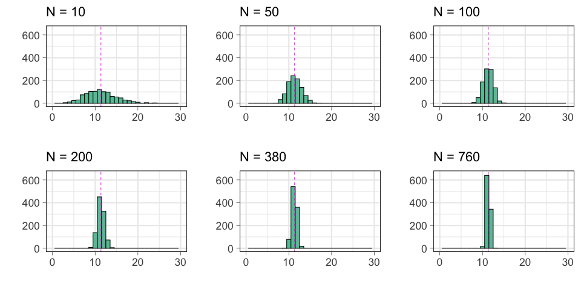

<!-- If we repeat this resampling, say, 1,000 times, we get 1,000 possible estimates of the mean. These are displayed as histograms, with each histogram showing the spread of bootstrap estimates around the mean of the original sample. These are known as sampling distributions of estimates, since they reflect the variability in estimates that arise from repeated sampling of data.

Figure displays some clear features. The first, and perhaps most notable, is that almost all trace of the skewness of the original samples has gone – the distributions of the estimates based on the resampled data are almost symmetric around the mean of the original data. This is a first glimpse of what is known as the Central Limit Theorem, which says that the distribution of sample means tends towards the form of a normal distribution with increasing sample size, almost regardless of the shape of the original data distribution. 

Additionally, is that the bootstrap distributions get narrower as the sample size increases
 -->

---
### Il margine di errore (o intervallo di confidenza)

&nbsp;&nbsp;&nbsp;&nbsp;&nbsp;&nbsp;&nbsp;&nbsp;&nbsp; Intervallo che contiene il 95% delle medie ottenute via Bootstrapping

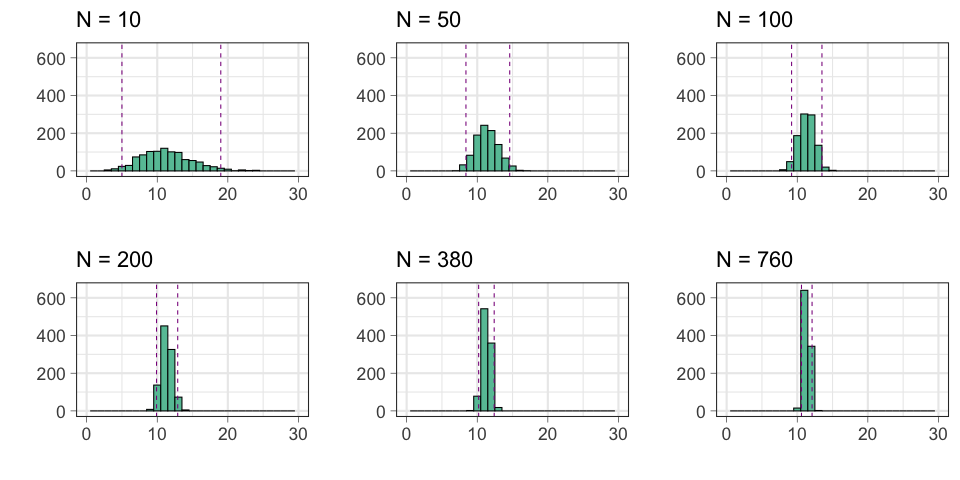

<!-- For example, we can find the range of values that contains 95% of the means of the bootstrap resamples, and call this a 95% uncertainty interval
for the original estimates, or alternatively they can be called margins of error. These are shown in Table 7.2 – the symmetry of the bootstrap distributions means the uncertainty intervals are roughly symmetric around the original estimate.

Per farlo sfruttiamo le proprieta' della distribuzione normale (indipendentemente dalla distribuzione del campione) 

Ma prima osserviamo ancora che the bootstrap distributions get narrower as the sample size increases, which is reflected in the steadily narrower 95% uncertainty intervals.
 -->

 ---
### Il margine di errore (o intervallo di confidenza)

&nbsp;&nbsp;&nbsp;&nbsp;&nbsp;&nbsp;&nbsp;&nbsp;&nbsp; Intervallo che contiene il 95% delle medie ottenute via Bootstrapping

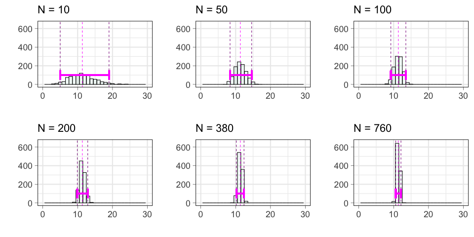

---
## Intervallo di confidenza

&nbsp;&nbsp;&nbsp;&nbsp;&nbsp;&nbsp;&nbsp;&nbsp;&nbsp; Intervallo che contiene il 95% delle medie ottenute via Bootstrapping

&nbsp;&nbsp;&nbsp;&nbsp;&nbsp;&nbsp;&nbsp;&nbsp;&nbsp; $N_\text{Bootstrapping} = 1000$
&nbsp;&nbsp;&nbsp;&nbsp;&nbsp;&nbsp;&nbsp;&nbsp;&nbsp; $\bar{x} = 11.4$

| $N_\text{campione}$ | Media | 95% ME |
| ----: | -----: |  -----: | 
| 10 | 11.4 | (5.0; 19.0)
| 50 | 11.4 | (8.4; 14.6)
| 100 | 11.4  | (9.2; 13.5) 
| 200 | 11.3 |  (9.9; 12.9)
| 380 | 11.3  | (10.2; 12.4)
| 760 | 11.3 | (10.6, 12.1)

<!-- The second important feature of Figure 7.3 is that the bootstrap distributions get narrower as the sample size increases, which is reflected in the steadily narrower 95% uncertainty intervals. 

Bootstrapping provides an intuitive, computer-intensive way of assessing the uncertainty in our estimates, without making strong assumptions and without using probability theory. But the technique is not feasible when it comes to, say, working out the margins of error on unemployment surveys of 100,000 people. Although bootstrapping is a simple, brilliant and extraordinarily effective idea, it is just too clumsy to bootstrap such large quantities of data, especially when a convenient theory exists that can generate formulae for the width of uncertainty intervals.

-->

---
## Esercizio #2

:question: &nbsp;&nbsp;&nbsp; Al crescere del numero di campioni estratti da una popolazione

&nbsp;&nbsp;&nbsp;&nbsp;&nbsp;&nbsp;&nbsp;&nbsp;&nbsp; a) migliora la stima del parametro
&nbsp;&nbsp;&nbsp;&nbsp;&nbsp;&nbsp;&nbsp;&nbsp;&nbsp; b) migliora la stima dell'incertezza del parametro
&nbsp;&nbsp;&nbsp;&nbsp;&nbsp;&nbsp;&nbsp;&nbsp;&nbsp; c) non c'e' differenza

<button id="countdown_exercise_2"></button>

---
## Esercizio #2 -- Soluzione

:question: &nbsp;&nbsp;&nbsp; Al crescere del numero di campioni estratti da una popolazione

&nbsp;&nbsp;&nbsp;&nbsp;&nbsp;&nbsp;&nbsp;&nbsp;&nbsp; a) migliora la stima del parametro
&nbsp;&nbsp;&nbsp;&nbsp;&nbsp;&nbsp;&nbsp;&nbsp;&nbsp; b) migliora la stima dell'incertezza del parametro &nbsp; :white_check_mark:
&nbsp;&nbsp;&nbsp;&nbsp;&nbsp;&nbsp;&nbsp;&nbsp;&nbsp; c) non c'e' differenza

---
## Fermiamoci un attimo

Abbiamo introdotto due concetti difficili e importanti:

  1. esiste una variabilita' nella stima dei parametri che dipende dal campione

  2. la forma della distribuzione delle statistiche non dipende dalla forma della distribuzione originaria e tende alla normale per insiemi grandi

Ora abbiamo le basi per affrontare il secondo approccio  per stimare i parametri e l'intervallo di confidenza

<!-- 
- the variability in statistics based on samples

- the fact that the shape of the distribution of the statistics does not depend on the shape of the original distribution from which the individual data-points are drawn

- bootstrapping data when we do not want to make assumptions about the shape of the population

Rather remarkably, this has all been accomplished without any mathematics except the idea of drawing observations at random. -->

---
### La distribuzione campionaria &   il teorema del limite centrale

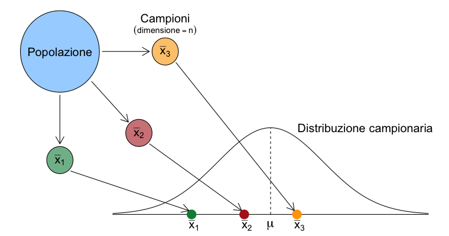

&nbsp;&nbsp;&nbsp;&nbsp;&nbsp;&nbsp;&nbsp;&nbsp;&nbsp;&nbsp;&nbsp;&nbsp;&nbsp;&nbsp;&nbsp;&nbsp;&nbsp;&nbsp;&nbsp;&nbsp;&nbsp;&nbsp;&nbsp;&nbsp; $\mathcal{N} = (\mu, \frac{\sigma^2}{n})$ con 
&nbsp;&nbsp;&nbsp;&nbsp;&nbsp;&nbsp;&nbsp;&nbsp;&nbsp;&nbsp;&nbsp;&nbsp;&nbsp;&nbsp;&nbsp;&nbsp;&nbsp;&nbsp;&nbsp;&nbsp;&nbsp;&nbsp;&nbsp;&nbsp; $\sqrt{ \frac{\sigma^2}{n}} = \frac{\sigma}{\sqrt{n}}$ 
&nbsp;&nbsp;&nbsp;&nbsp;&nbsp;&nbsp;&nbsp;&nbsp;&nbsp;&nbsp;&nbsp;&nbsp;&nbsp;&nbsp;&nbsp;&nbsp;&nbsp;&nbsp;&nbsp;&nbsp;&nbsp;&nbsp;&nbsp;&nbsp;&nbsp;&nbsp;&nbsp; $\rightarrow$ &nbsp; standard error (SE)

<!-- Distribuzione campionaria e' la distribuzione di tutti i possibile valori che possono essere assunti da qualche statistica (e.g., la media) calcolata da campioni della stessa dimenzione ed estratti casualmente dalla stessa popolazione 

Come si costruisce? 
1. Estraggo tutti i possibili capioni di dimensione n
2. Calcolo la statistica di interesse
3. Tego traccia di ciascun valore della statistica e della sua frequenza 

La forma della distribuzione delle medie campionarie è approssimativamente normale,  indipendentemente dalla distribuzione dei valori della popolazione d’origine dalla quale i campioni sono estratti, per n sufficientemente grande.

CTL: If n independent observations each have mean μ and variance σ2, then under broad assumptions their sample mean is an estimator of μ, and has an approximately normal distribution with mean μ, variance σ2/n, and standard deviati  (also known as the standard error of the estimator).

La varianza della distribuzione campionaria  è il rapporto tra tra la varianza della popolazione e la dimenzione del campione usato per calcolarla 

La radice quastrada della varianza della distribizione campionaria e' l'errore standard della media

L'errore standard diminuisce al crescere di N e al decresere della varianza

Quanto deve essere grande il campione perche' la distribuzione sia normale? 
Nella maggior parte delle situazioni pratiche, n=30 e' soddisfacente, ma l'approssimazione migliora all'aumentare di n -->

---
## Mettiamo i pezzi insieme

- la distribuzione campionaria e' una normale
- in una normale, 95% delle osservazioni sono a $2 \times \text{SD}$ dalla media
- il nostro intervallo di confidenza (95%) e' $2 \times \text{SE}$ dalla media della distribuzione campionaria

<!-- Approssimando una Normale, la distribizione campionaria ha le stesse (utili) caratteristiche della normale:
- e' simmetrica
- ha area 1
- 95% delle medie campionarie sono a 2 SE dalla vera media della popolazione 

Tutti concetti che ci torneranno utili tra poco
-->

---
## Ma come si interpreta?

&nbsp;&nbsp;&nbsp;&nbsp;&nbsp;&nbsp;&nbsp;&nbsp;&nbsp; Se facessimo 100 campionamenti, 95 stimerebbero un intervallo 
&nbsp;&nbsp;&nbsp;&nbsp;&nbsp;&nbsp;&nbsp;&nbsp;&nbsp; di confidenza che contiene il vero  valore del parametro

:pushpin: &nbsp;&nbsp;&nbsp; Populazione: Donne italiane dai
&nbsp;&nbsp;&nbsp;&nbsp;&nbsp;&nbsp;&nbsp;&nbsp;&nbsp; 25 ai 74 anni
&nbsp;&nbsp;&nbsp;&nbsp;&nbsp;&nbsp;&nbsp;&nbsp;&nbsp; $\mu=123 \text{ mmHg}$

<!-- Cosa rappresentano quindi i CI? Che dati 100 campioni estratti dalla popolazione, 95 stimano un IC al cui interno è compresa la media reale della popolazione e solo 5 stimano un ic che non include la media reale 

a confidence interval is the range of population parameters for which our observed statistic is a plausible consequence.
-->

<!-- --- 
## L'errore standard e il margine di errore

Piu; lo SE e' piccolo, piu' la media campionaria osservata sara' vicina alla vera media della popolazione -->

---
## Esercizio #3

:question: &nbsp;&nbsp;&nbsp; Da un sondaggio, risulta che lo stipendio mensile medio di un
&nbsp;&nbsp;&nbsp;&nbsp;&nbsp;&nbsp;&nbsp;&nbsp;&nbsp; neolaureato e' 1.400&#8364;, con un 95% CI di 200&#8364;. Come interpreto 
&nbsp;&nbsp;&nbsp;&nbsp;&nbsp;&nbsp;&nbsp;&nbsp;&nbsp;  questo risultato?

&nbsp;&nbsp;&nbsp;&nbsp;&nbsp;&nbsp;&nbsp;&nbsp;&nbsp; a) gli stipendi dei neolaureati sono compresi tra i 1.200 ai 1.600&#8364;
&nbsp;&nbsp;&nbsp;&nbsp;&nbsp;&nbsp;&nbsp;&nbsp;&nbsp; b) il 95% dei neolaureati riceve tra 1.200 ai 1.600&#8364;
&nbsp;&nbsp;&nbsp;&nbsp;&nbsp;&nbsp;&nbsp;&nbsp;&nbsp; c) la media degli stipendi dei neolareati e' ragionevolmente 
&nbsp;&nbsp;&nbsp;&nbsp;&nbsp;&nbsp;&nbsp;&nbsp;&nbsp;&nbsp;&nbsp;&nbsp;&nbsp;&nbsp; compresa tra 1.200 ai 1.600&#8364;
&nbsp;&nbsp;&nbsp;&nbsp;&nbsp;&nbsp;&nbsp;&nbsp;&nbsp; d) nessuna delle precedenti

<button id="countdown_exercise_3"></button>

---
## Esercizio #3 -- Soluzione

:question: &nbsp;&nbsp;&nbsp; Da un sondaggio, risulta che lo stipendio mensile medio di un
&nbsp;&nbsp;&nbsp;&nbsp;&nbsp;&nbsp;&nbsp;&nbsp;&nbsp; neolaureato e' 1.400&#8364;, con un 95% CI di 200&#8364;. Come interpreto 
&nbsp;&nbsp;&nbsp;&nbsp;&nbsp;&nbsp;&nbsp;&nbsp;&nbsp;  questo risultato?

&nbsp;&nbsp;&nbsp;&nbsp;&nbsp;&nbsp;&nbsp;&nbsp;&nbsp; a) gli stipendi dei neolaureati sono compresi tra i 1.200 ai 1.600&#8364;
&nbsp;&nbsp;&nbsp;&nbsp;&nbsp;&nbsp;&nbsp;&nbsp;&nbsp; b) il 95% dei neolaureati riceve tra 1.200 ai 1.600&#8364;
&nbsp;&nbsp;&nbsp;&nbsp;&nbsp;&nbsp;&nbsp;&nbsp;&nbsp; c) la media degli stipendi dei neolareati e' ragionevolmente 
&nbsp;&nbsp;&nbsp;&nbsp;&nbsp;&nbsp;&nbsp;&nbsp;&nbsp;&nbsp;&nbsp;&nbsp;&nbsp;&nbsp; compresa tra 1.200 ai 1.600&#8364; &nbsp; :white_check_mark:
&nbsp;&nbsp;&nbsp;&nbsp;&nbsp;&nbsp;&nbsp;&nbsp;&nbsp; d) nessuna delle precedenti

---
## Esercizio #4

:question: &nbsp;&nbsp;&nbsp; Se l'intervallo di confidenza e' largo

&nbsp;&nbsp;&nbsp;&nbsp;&nbsp;&nbsp;&nbsp;&nbsp;&nbsp; a) e' piu' probabile che includa $\mu$
&nbsp;&nbsp;&nbsp;&nbsp;&nbsp;&nbsp;&nbsp;&nbsp;&nbsp; b) e' meno probabile che includa $\mu$
&nbsp;&nbsp;&nbsp;&nbsp;&nbsp;&nbsp;&nbsp;&nbsp;&nbsp; c) non c'e' differenza
&nbsp;&nbsp;&nbsp;&nbsp;&nbsp;&nbsp;&nbsp;&nbsp;&nbsp; c) non posso rispondere

<button id="countdown_exercise_4"></button>

---
## Esercizio #4 -- Soluzione

:question: &nbsp;&nbsp;&nbsp; Se l'intervallo di confidenza  e' largo

&nbsp;&nbsp;&nbsp;&nbsp;&nbsp;&nbsp;&nbsp;&nbsp;&nbsp; a) e' piu' probabile che includa $\mu$ &nbsp; :white_check_mark:
&nbsp;&nbsp;&nbsp;&nbsp;&nbsp;&nbsp;&nbsp;&nbsp;&nbsp; b) e' meno probabile che includa $\mu$
&nbsp;&nbsp;&nbsp;&nbsp;&nbsp;&nbsp;&nbsp;&nbsp;&nbsp; c) non c'e' differenza
&nbsp;&nbsp;&nbsp;&nbsp;&nbsp;&nbsp;&nbsp;&nbsp;&nbsp; c) non posso rispondere

---
## Esercizio #4 -- Soluzione

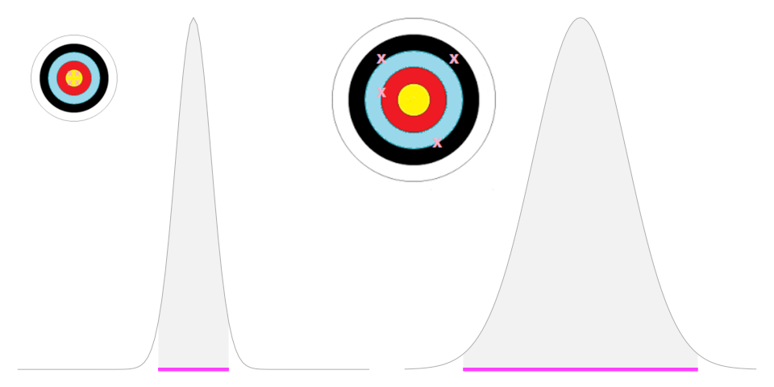

---
## Esercizio #5

:question: &nbsp;&nbsp;&nbsp; Se l'intervallo di confidenza  
&nbsp;&nbsp;&nbsp;&nbsp;&nbsp;&nbsp;&nbsp;&nbsp;&nbsp; e' largo

&nbsp;&nbsp;&nbsp;&nbsp;&nbsp;&nbsp;&nbsp;&nbsp;&nbsp; a) siamo meno precisi
&nbsp;&nbsp;&nbsp;&nbsp;&nbsp;&nbsp;&nbsp;&nbsp;&nbsp; b) siamo piu' precisi
&nbsp;&nbsp;&nbsp;&nbsp;&nbsp;&nbsp;&nbsp;&nbsp;&nbsp; c) non c'e' differenza
&nbsp;&nbsp;&nbsp;&nbsp;&nbsp;&nbsp;&nbsp;&nbsp;&nbsp; c) non posso rispondere

<button id="countdown_exercise_5"></button>

---
## Esercizio #5 -- Soluzione

:question: &nbsp;&nbsp;&nbsp; Se l'intervallo di confidenza  
&nbsp;&nbsp;&nbsp;&nbsp;&nbsp;&nbsp;&nbsp;&nbsp;&nbsp; e' largo

&nbsp;&nbsp;&nbsp;&nbsp;&nbsp;&nbsp;&nbsp;&nbsp;&nbsp; a) siamo meno precisi &nbsp; :white_check_mark:
&nbsp;&nbsp;&nbsp;&nbsp;&nbsp;&nbsp;&nbsp;&nbsp;&nbsp; b) siamo piu' precisi 
&nbsp;&nbsp;&nbsp;&nbsp;&nbsp;&nbsp;&nbsp;&nbsp;&nbsp; c) non c'e' differenza
&nbsp;&nbsp;&nbsp;&nbsp;&nbsp;&nbsp;&nbsp;&nbsp;&nbsp; c) non posso rispondere

---
## Esercizio #5 -- Soluzione

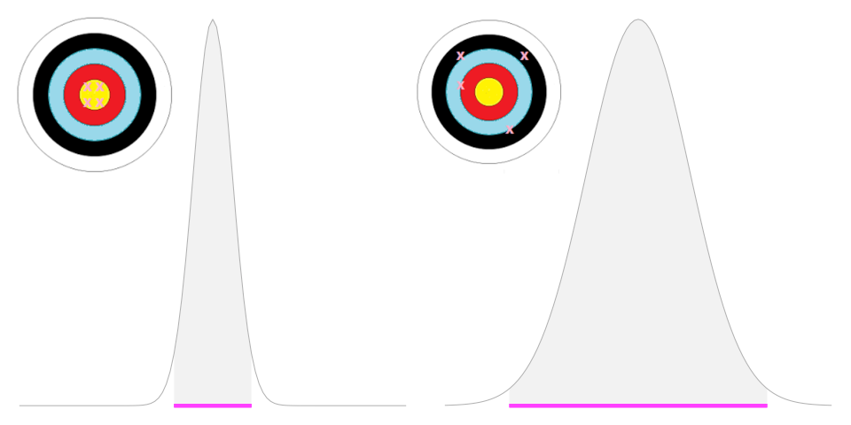

---
## Esercizio #6

> In media, quanti partner sessuali gli uomini inglesi, tra i 35 e 44 anni di eta', riferiscono di aver avuto nella loro vita?

:question: &nbsp;&nbsp;&nbsp; $n_\text{uomini} = 760$
&nbsp;&nbsp;&nbsp;&nbsp;&nbsp;&nbsp;&nbsp;&nbsp;&nbsp; $\bar{x}=11.4$
&nbsp;&nbsp;&nbsp;&nbsp;&nbsp;&nbsp;&nbsp;&nbsp;&nbsp; $s=11.2$

&nbsp;&nbsp;&nbsp;&nbsp;&nbsp;&nbsp;&nbsp;&nbsp;&nbsp; $\text{SE}=\sigma/\sqrt{n} = \text{ ?}$

<button id="countdown_exercise_6"></button>

---
## Esercizio #6 -- Soluzione

> In media, quanti partner sessuali gli uomini inglesi, tra i 35 e 44 anni di eta', riferiscono di aver avuto nella loro vita?

:question: &nbsp;&nbsp;&nbsp; $n_\text{uomini} = 760$
&nbsp;&nbsp;&nbsp;&nbsp;&nbsp;&nbsp;&nbsp;&nbsp;&nbsp; $\bar{x}=11.4$
&nbsp;&nbsp;&nbsp;&nbsp;&nbsp;&nbsp;&nbsp;&nbsp;&nbsp; $s=11.2$

&nbsp;&nbsp;&nbsp;&nbsp;&nbsp;&nbsp;&nbsp;&nbsp;&nbsp; $\text{SE}=\sigma/\sqrt{n} = \text{ ?} \rightarrow$ &nbsp;&nbsp;&nbsp; $\hat{\text{SE}}=s/\sqrt{n} = \frac{11.2}{\sqrt760}=0.41$

---
## Esercizio #6 -- Soluzione

> In media, quanti partner sessuali gli uomini inglesi, tra i 35 e 44 anni di eta', riferiscono di aver avuto nella loro vita?

:question: &nbsp;&nbsp;&nbsp; $n_\text{uomini} = 760$
&nbsp;&nbsp;&nbsp;&nbsp;&nbsp;&nbsp;&nbsp;&nbsp;&nbsp; $\bar{x}=11.4$
&nbsp;&nbsp;&nbsp;&nbsp;&nbsp;&nbsp;&nbsp;&nbsp;&nbsp; $s=11.2$

&nbsp;&nbsp;&nbsp;&nbsp;&nbsp;&nbsp;&nbsp;&nbsp;&nbsp; $\text{SE}=\sigma/\sqrt{n} = \text{ ?} \rightarrow$ &nbsp;&nbsp;&nbsp; $\hat{\text{SE}}=s/\sqrt{n} = \frac{11.2}{\sqrt760}=0.41$
&nbsp;&nbsp;&nbsp;&nbsp;&nbsp;&nbsp;&nbsp;&nbsp;&nbsp;  $95\% \text{CI} =  (\bar{x} -1.96 \times \hat{\text{SE}} ; \bar{x} + 1.96 \times \hat{\text{SE}} ) =$
&nbsp;&nbsp;&nbsp;&nbsp;&nbsp;&nbsp;&nbsp;&nbsp;&nbsp;&nbsp;&nbsp;&nbsp;&nbsp;&nbsp;&nbsp;&nbsp;&nbsp;&nbsp;&nbsp;&nbsp;&nbsp;&nbsp;&nbsp;&nbsp;&nbsp; $=(11.4 - 1.96 \times 0.41; 11.4 + 1.96 \times 0.41) =$
&nbsp;&nbsp;&nbsp;&nbsp;&nbsp;&nbsp;&nbsp;&nbsp;&nbsp;&nbsp;&nbsp;&nbsp;&nbsp;&nbsp;&nbsp;&nbsp;&nbsp;&nbsp;&nbsp;&nbsp;&nbsp;&nbsp;&nbsp;&nbsp;&nbsp; $= (10.6; 12.2)$

<!-- Per il CTL e per la legge dei grandi numeri, la media del campione e' la media della popolazione. Se io prendo 2SE a sx della media e 2SE a destra (quindi x +/- 2 SE) ho il 95% di probabilta' di includere il vero valore mu, la media della popolazione

1,96 e' il coefficiente di attendibilita', ci dice entro quanti errori standard si trova il 95% di tutti i possibili valori della media campionaria

Stima intervallare devinita come stimatore +/- il prodotto tra coeff di attendibilita' e SE. Questa quantita' si chiama anche PRECISIONE della STIMA o MARGINE DI ERRORE -->

---
## Esercizio #6 -- Soluzione

> In media, quanti partner sessuali gli uomini inglesi, tra i 35 e 44 anni di eta', riferiscono di aver avuto nella loro vita?

:question: &nbsp;&nbsp;&nbsp; $n_\text{uomini} = 760$
&nbsp;&nbsp;&nbsp;&nbsp;&nbsp;&nbsp;&nbsp;&nbsp;&nbsp; $\bar{x}=11.4$
&nbsp;&nbsp;&nbsp;&nbsp;&nbsp;&nbsp;&nbsp;&nbsp;&nbsp; $s=11.2$

&nbsp;&nbsp;&nbsp;&nbsp;&nbsp;&nbsp;&nbsp;&nbsp;&nbsp; $\text{SE}=\sigma/\sqrt{n} = \text{ ?} \rightarrow$ &nbsp;&nbsp;&nbsp; $\hat{\text{SE}}=s/\sqrt{n} = \frac{11.2}{\sqrt760}=0.41$
&nbsp;&nbsp;&nbsp;&nbsp;&nbsp;&nbsp;&nbsp;&nbsp;&nbsp;  $95\% \text{CI} = (10.6; 12.2)$

&nbsp;&nbsp;&nbsp;&nbsp;&nbsp;&nbsp;&nbsp;&nbsp;&nbsp;  via Bootstrapping $\rightarrow 95\% \text{CI} = (10.6 ; 12.1)$

<!--  It is far easier to obtain exact intervals that are based on probability theory and provided in standard software, and Table 9.1 shows they give very similar results. The ‘exact’ intervals based on probability theory require more assumptions than the bootstrap approach, and strictly speaking would only be precisely correct if the underlying population distribution were normal. But the Central Limit Theorem means that with such a large sample size it is reasonable to assume our estimates have got normal distributions and so the exact intervals are acceptable.
--->

---
## Esercizio #7

:question: &nbsp;&nbsp;&nbsp; Dato che $\mathcal{N} = (\mu, \frac{\sigma^2}{n})$ con $\sqrt{ \frac{\sigma^2}{n}} = \frac{\sigma}{\sqrt{n}} \rightarrow$ &nbsp; standard error (SE), 
&nbsp;&nbsp;&nbsp;&nbsp;&nbsp;&nbsp;&nbsp;&nbsp;&nbsp;  come posso restringere l'intervallo di confidenza?

&nbsp;&nbsp;&nbsp;&nbsp;&nbsp;&nbsp;&nbsp;&nbsp;&nbsp; a) aumentando $n$
&nbsp;&nbsp;&nbsp;&nbsp;&nbsp;&nbsp;&nbsp;&nbsp;&nbsp; b) diminuendo $n$
&nbsp;&nbsp;&nbsp;&nbsp;&nbsp;&nbsp;&nbsp;&nbsp;&nbsp; c) aumentando $\sigma$
&nbsp;&nbsp;&nbsp;&nbsp;&nbsp;&nbsp;&nbsp;&nbsp;&nbsp; d) diminuendo $\sigma$
&nbsp;&nbsp;&nbsp;&nbsp;&nbsp;&nbsp;&nbsp;&nbsp;&nbsp; e) nessuna delle precedenti
&nbsp;&nbsp;&nbsp;&nbsp;&nbsp;&nbsp;&nbsp;&nbsp;&nbsp; f) non ho abbastanza elementi per rispondere

<button id="countdown_exercise_7"></button>

---
## Esercizio #7 -- Soluzione

:question: &nbsp;&nbsp;&nbsp; Dato che $\mathcal{N} = (\mu, \frac{\sigma^2}{n})$ con $\sqrt{ \frac{\sigma^2}{n}} = \frac{\sigma}{\sqrt{n}} \rightarrow$ &nbsp; standard error (SE), 
&nbsp;&nbsp;&nbsp;&nbsp;&nbsp;&nbsp;&nbsp;&nbsp;&nbsp;  come posso restringere l'intervallo di confidenza?

&nbsp;&nbsp;&nbsp;&nbsp;&nbsp;&nbsp;&nbsp;&nbsp;&nbsp; a) aumentando $n$ &nbsp; :white_check_mark:
&nbsp;&nbsp;&nbsp;&nbsp;&nbsp;&nbsp;&nbsp;&nbsp;&nbsp; b) diminuendo $n$
&nbsp;&nbsp;&nbsp;&nbsp;&nbsp;&nbsp;&nbsp;&nbsp;&nbsp; c) aumentando $\sigma$
&nbsp;&nbsp;&nbsp;&nbsp;&nbsp;&nbsp;&nbsp;&nbsp;&nbsp; d) diminuendo $\sigma$ &nbsp; :ballot_box_with_check:
&nbsp;&nbsp;&nbsp;&nbsp;&nbsp;&nbsp;&nbsp;&nbsp;&nbsp; e) nessuna delle precedenti
&nbsp;&nbsp;&nbsp;&nbsp;&nbsp;&nbsp;&nbsp;&nbsp;&nbsp; f) non ho abbastanza elementi per rispondere

<!-- Abbiao un confidence interval molto stretto perche' si sono verificate due condinzioni che, indipendentemente, migliorano la stima intervallare:
- un'alta numerosita' campionaria e
- una bassa variabilita s tra le osservazioni 

Peccato che sigma non la possiamo controllare :) 
-->

---
## Esercizio #8

:question: &nbsp;&nbsp;&nbsp; Uno studio randomizzato su 1.200 uomini dai 50 ai 75 anni che soffrono 
&nbsp;&nbsp;&nbsp;&nbsp;&nbsp;&nbsp;&nbsp;&nbsp;&nbsp; di ipertensione ha osservato che una dieta arricchita con olio di pesce 
&nbsp;&nbsp;&nbsp;&nbsp;&nbsp;&nbsp;&nbsp;&nbsp;&nbsp; diminuisce la pressione arteriosa di 20 mmHg (95% CI: 15; 25 mmHg). 
&nbsp;&nbsp;&nbsp;&nbsp;&nbsp;&nbsp;&nbsp;&nbsp;&nbsp; Un giornale che riportava lo studio ha concluso che "Le persone possono 
&nbsp;&nbsp;&nbsp;&nbsp;&nbsp;&nbsp;&nbsp;&nbsp;&nbsp; abbassare la loro pressione arteriosa con una dieta ricca di olio di pesce"

&nbsp;&nbsp;&nbsp;&nbsp;&nbsp;&nbsp;&nbsp;&nbsp;&nbsp; Condividi queste conclusioni? Se si', su che basi? Se no, quali conclusioni 
&nbsp;&nbsp;&nbsp;&nbsp;&nbsp;&nbsp;&nbsp;&nbsp;&nbsp; trarresti? 

 Think &nbsp;&nbsp;&nbsp; <button id="countdown_think"></button>

<!-- Think -->

---
## Esercizio #8 

:question: &nbsp;&nbsp;&nbsp; Uno studio randomizzato su 1.200 uomini dai 50 ai 75 anni che soffrono 
&nbsp;&nbsp;&nbsp;&nbsp;&nbsp;&nbsp;&nbsp;&nbsp;&nbsp; di ipertensione ha osservato che una dieta arricchita con olio di pesce 
&nbsp;&nbsp;&nbsp;&nbsp;&nbsp;&nbsp;&nbsp;&nbsp;&nbsp; diminuisce la pressione arteriosa di 20 mmHg (95% CI: 15; 25 mmHg). 
&nbsp;&nbsp;&nbsp;&nbsp;&nbsp;&nbsp;&nbsp;&nbsp;&nbsp; Un giornale che riportava lo studio ha concluso che "Le persone possono 
&nbsp;&nbsp;&nbsp;&nbsp;&nbsp;&nbsp;&nbsp;&nbsp;&nbsp; abbassare la loro pressione arteriosa con una dieta ricca di olio di pesce"

&nbsp;&nbsp;&nbsp;&nbsp;&nbsp;&nbsp;&nbsp;&nbsp;&nbsp; Condividi queste conclusioni? Se si', su che basi? Se no, quali conclusioni 
&nbsp;&nbsp;&nbsp;&nbsp;&nbsp;&nbsp;&nbsp;&nbsp;&nbsp; trarresti? 

 Pair &nbsp;&nbsp;&nbsp; <button id="countdown_pair"></button>

<!-- Pair -->
---
## Esercizio #8 

:question: &nbsp;&nbsp;&nbsp; Uno studio randomizzato su 1.200 uomini dai 50 ai 75 anni che soffrono 
&nbsp;&nbsp;&nbsp;&nbsp;&nbsp;&nbsp;&nbsp;&nbsp;&nbsp; di ipertensione ha osservato che una dieta arricchita con olio di pesce 
&nbsp;&nbsp;&nbsp;&nbsp;&nbsp;&nbsp;&nbsp;&nbsp;&nbsp; diminuisce la pressione arteriosa di 20 mmHg (95% CI: 15; 25 mmHg). 
&nbsp;&nbsp;&nbsp;&nbsp;&nbsp;&nbsp;&nbsp;&nbsp;&nbsp; Un giornale che riportava lo studio ha concluso che "Le persone possono 
&nbsp;&nbsp;&nbsp;&nbsp;&nbsp;&nbsp;&nbsp;&nbsp;&nbsp; abbassare la loro pressione arteriosa con una dieta ricca di olio di pesce"

&nbsp;&nbsp;&nbsp;&nbsp;&nbsp;&nbsp;&nbsp;&nbsp;&nbsp; Condividi queste conclusioni? Se si', su che basi? Se no, quali conclusioni 
&nbsp;&nbsp;&nbsp;&nbsp;&nbsp;&nbsp;&nbsp;&nbsp;&nbsp; trarresti? 

 Share &nbsp;&nbsp;&nbsp; <button id="countdown_share"></button>

<!-- Share -->

---
## Esercizio #8 

:question: &nbsp;&nbsp;&nbsp; Uno studio randomizzato su 1.200 uomini dai 50 ai 75 anni che soffrono 
&nbsp;&nbsp;&nbsp;&nbsp;&nbsp;&nbsp;&nbsp;&nbsp;&nbsp; di ipertensione ha osservato che una dieta arricchita con olio di pesce 
&nbsp;&nbsp;&nbsp;&nbsp;&nbsp;&nbsp;&nbsp;&nbsp;&nbsp; diminuisce la pressione arteriosa di 20 mmHg (95% CI: 15; 25 mmHg). 
&nbsp;&nbsp;&nbsp;&nbsp;&nbsp;&nbsp;&nbsp;&nbsp;&nbsp; Un giornale che riportava lo studio ha concluso che "Le persone possono 
&nbsp;&nbsp;&nbsp;&nbsp;&nbsp;&nbsp;&nbsp;&nbsp;&nbsp; abbassare la loro pressione arteriosa con una dieta ricca di olio di pesce"

&nbsp;&nbsp;&nbsp;&nbsp;&nbsp;&nbsp;&nbsp;&nbsp;&nbsp; Condividi queste conclusioni? Se si', su che basi? Se no, quali conclusioni 
&nbsp;&nbsp;&nbsp;&nbsp;&nbsp;&nbsp;&nbsp;&nbsp;&nbsp; trarresti? 

 Re-write &nbsp;&nbsp;&nbsp; <button id="countdown_rewrite"></button>

<!-- rewrite -->

---
## Esercizio #8 -- (Possibile) soluzione

:question: &nbsp;&nbsp;&nbsp;  "Le persone possono abbassare la loro pressione arteriosa con una dieta
&nbsp;&nbsp;&nbsp;&nbsp;&nbsp;&nbsp;&nbsp;&nbsp;&nbsp;  ricca di olio di pesce". Condividi queste conclusioni? Se si', su che basi? 
&nbsp;&nbsp;&nbsp;&nbsp;&nbsp;&nbsp;&nbsp;&nbsp;&nbsp; Se no, quali conclusioni trarresti? 

&nbsp;&nbsp;&nbsp;&nbsp;&nbsp;&nbsp;&nbsp;&nbsp;&nbsp; "E' ragionevole concludere (1) che uomini dai dai 50 ai 75 anni che soffrono
&nbsp;&nbsp;&nbsp;&nbsp;&nbsp;&nbsp;&nbsp;&nbsp;&nbsp;  di ipertensione (2) tenderebbero a diminuire (3,4) la loro pressione  
&nbsp;&nbsp;&nbsp;&nbsp;&nbsp;&nbsp;&nbsp;&nbsp;&nbsp; con una dieta ricca di olio di pesce."

&nbsp;&nbsp;&nbsp;&nbsp;&nbsp;&nbsp;&nbsp;&nbsp;&nbsp; (1) la diminuzione osservata nel campione potrebbe non includere il parametro reale della 
&nbsp;&nbsp;&nbsp;&nbsp;&nbsp;&nbsp;&nbsp;&nbsp;&nbsp;&nbsp;&nbsp;&nbsp;&nbsp;&nbsp;&nbsp;&nbsp; popolazione nel 5% dei campioni
&nbsp;&nbsp;&nbsp;&nbsp;&nbsp;&nbsp;&nbsp;&nbsp;&nbsp; (2) definire bene la popolazione alla quale il risultato si  applica (generalizzazione)
&nbsp;&nbsp;&nbsp;&nbsp;&nbsp;&nbsp;&nbsp;&nbsp;&nbsp; (3) il gruppo migliora, non necessariamente i singoli individui
&nbsp;&nbsp;&nbsp;&nbsp;&nbsp;&nbsp;&nbsp;&nbsp;&nbsp; (4) un tentativo di muoversi nella direzione esperimento $\rightarrow$ causa (e' stato condotto 
&nbsp;&nbsp;&nbsp;&nbsp;&nbsp;&nbsp;&nbsp;&nbsp;&nbsp;&nbsp;&nbsp;&nbsp;&nbsp;&nbsp;&nbsp;&nbsp; uno studio randomizzato e non osservazionale)

<!-- these four distinct ideas of uncertainty which students could address are: 
(1) the rare occurrence idea that a
wrong conclusion could be drawn (26.0% of students who responded to this item mentioned this idea), 
(2)
a very carefully stated generalisation (25.9%),
(3) the tendency idea that the group as a whole improves, not every individual (23.2%). note students could
address more than one idea 
(4) the causal inference idea for experiments recognising the
difference between sample-to-population and experiment-to-causation inferential reasoning (22.4%), and
recognising that random allocation to two treatment groups allows for a one-factor causal interpretation.
Another area to address is creating visual imagery for experiment-to-causation inference. For sample-to-
population inference, there are many images to illustrate the idea of taking a random sample from a population
to then drawing conclusions about the population from that random sample. the imagery for experiments from
using volunteers to drawing conclusions seems much more difficult to achieve but we believe that some visual
imagery would be helpful in cementing the difference between the two types of inference

 -->

---
## Il coefficiente di attendibilita' $\alpha$ 

:dart: &nbsp;&nbsp;&nbsp; $\text{95\% CI} = (\bar{x} - 1.96 \times \hat{SE} \text{ ; }  \bar{x} + 1.96 \times \hat{SE})$
&nbsp;&nbsp;&nbsp;&nbsp;&nbsp;&nbsp;&nbsp;&nbsp;&nbsp;  &nbsp; $1.96$ &nbsp; ?

| Confidence Level | $\alpha$ | $\alpha/2$ | $z_{\alpha/2}$ |
| ----: | ----- | ---- | ----|
| 95% | 5% | 2.5% |  |

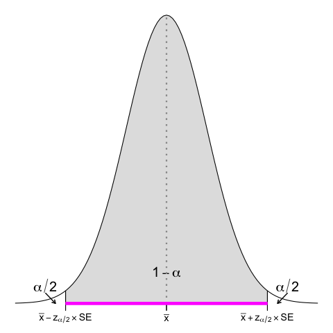

<!-- L’intervallo di confidenza (IC) al 95% è il più usato e intuitivamente abbiamo gia' capito da dove deirva il fattore 1.96 (circa 2SE contengono il 95% dei campioni), ma vediamolo in modo piu' formale 

Quando accettiamo un livello di confidenza del 95% accettiamo implicitamente un errore del 5%, distribuito equamente a dx e sx dell'intrevallo di confidenza (in verde), quindi 2.5% per parte -->

---
## Il coefficiente di attendibilita' $\alpha$ 

:dart: &nbsp;&nbsp;&nbsp; $\text{95\% CI} = (\bar{x} - 1.96 \times \hat{SE} \text{ ; }  \bar{x} + 1.96 \times \hat{SE})$
&nbsp;&nbsp;&nbsp;&nbsp;&nbsp;&nbsp;&nbsp;&nbsp;&nbsp;  &nbsp; $1.96$ &nbsp; ?

| Confidence Level | $\alpha$ | $\alpha/2$ | $z_{\alpha/2}$ |
| ----: | ----- | ---- | ----|
| 95% | 5% | 2.5% |  |

$100\% - 2.5\% = 97.5\%$ 

<!--  e qual e' l'aera di questa parte bianca? E' la totalita' dell'area (1, o 100%) meno l'area bianca (2.5%), quindi 97.5%-->

---
## Il coefficiente di attendibilita' $\alpha$ 

:dart: &nbsp;&nbsp;&nbsp; $\text{95\% CI} = (\bar{x} - 1.96 \times \hat{SE} \text{ ; }  \bar{x} + 1.96 \times \hat{SE})$
&nbsp;&nbsp;&nbsp;&nbsp;&nbsp;&nbsp;&nbsp;&nbsp;&nbsp;  &nbsp; $1.96$ &nbsp; ?

| Confidence Level | $\alpha$ | $\alpha/2$ | $z_{\alpha/2}$ |
| ----: | ----- | ---- | ----|
| 95% | 5% | 2.5% | 1.96 |

$100\% - 2.5\% = 97.5\% \rightarrow \mathcal{z} = 1.96$  

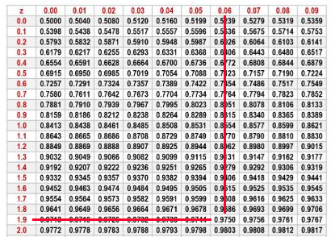

<!--  E' qual e' il valore di z per cui la curva sottende un'area del 97.5%? 1.96 (le tavole si possono anche leggere al contrario, non solo da z all'area, ma anche dall'area a z) 

coefficiente di attendibilita'-->

---
## Il coefficiente di attendibilita' $\alpha$ 

| Confidence Level | $\alpha$ | $\alpha/2$ | $z_{\alpha/2}$ |
| ----: | -----: | ---- | ----:|
| 95% | 5% | 2.5% | 1.96 |
| 90% | 10% | 5.0% | 1.65 |
| 99% | 1% | 0.5% | 2.58 |

$100\% - 2.5\% = 97.5\% \rightarrow \mathcal{z} = 1.96$ 
$100\% - 5.0\% = 95.0\% \rightarrow \mathcal{z} = 1.65$ 
$100\% - 0.5\% = 99.5\% \rightarrow \mathcal{z} = 2.58$ 

<!-- 95% e' il valore piu' usato, ma altri comuni sono 90 e 99%, a cui corrispondono fattori di attendibilita' di 1.65 e 2.58

Faremo piu' avanti degli esercizi in cui ci calcoleremo 90 e 99% CI -->

---
## Una regola empirica

&nbsp;&nbsp;&nbsp;&nbsp; Il margine di errore al 95% (in percentuale) e' al piu' $\pm \text{ } 100/\sqrt{n}$

<!-- A simple rule of thumb is that, if you are estimating the percentage of people who prefer something, and you ask a random sample from a population, then your margin of error (in %) is at most plus or minus 100 divided by the square root of the sample size 

 The margin of error is ± 2√[p(1 − p)/n], whose maximum value of ± 1/√n occurs at p = 0.5. Hence the margin of error is at most ± 1/√n, whatever value of the underlying true proportion p.
-->

---
## Esercizio #9

&nbsp;&nbsp;&nbsp;&nbsp; Il margine di errore al 95% (in percentuale) e' al piu' $\pm \text{ } 100/\sqrt{n}$

:question: &nbsp;&nbsp;&nbsp; Calcolate il 95% intervallo di
&nbsp;&nbsp;&nbsp;&nbsp;&nbsp;&nbsp;&nbsp;&nbsp;&nbsp; confidenza per i due "claim"

<button id="countdown_exercise_9"></button>

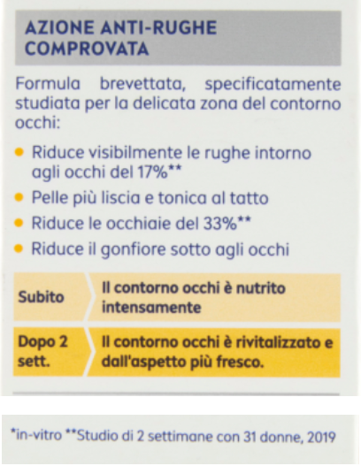

---
## Esercizio #9-- Soluzione

&nbsp;&nbsp;&nbsp;&nbsp; Il margine di errore al 95% (in percentuale) e' al piu' $\pm \text{ } 100/\sqrt{n}$

:question: &nbsp;&nbsp;&nbsp; Calcolate il 95% intervallo di
&nbsp;&nbsp;&nbsp;&nbsp;&nbsp;&nbsp;&nbsp;&nbsp;&nbsp; confidenza per i due "claim"

&nbsp;&nbsp;&nbsp;&nbsp;&nbsp;&nbsp;&nbsp;&nbsp;&nbsp;  $\text{ME} = 100/\sqrt{31} = 18\%$

&nbsp;&nbsp;&nbsp;&nbsp;&nbsp;&nbsp;&nbsp;&nbsp;&nbsp;  $\text{95\% CI}_\text{rughe} = (17-18; 17+18)$
&nbsp;&nbsp;&nbsp;&nbsp;&nbsp;&nbsp;&nbsp;&nbsp;&nbsp;&nbsp;&nbsp;&nbsp;&nbsp;&nbsp;&nbsp;&nbsp;&nbsp;&nbsp;&nbsp;&nbsp;&nbsp;&nbsp;&nbsp;&nbsp;&nbsp;&nbsp;&nbsp;&nbsp;&nbsp;&nbsp;&nbsp;&nbsp;&nbsp;&nbsp;&nbsp; $= (-1\%, 35\%)$

&nbsp;&nbsp;&nbsp;&nbsp;&nbsp;&nbsp;&nbsp;&nbsp;&nbsp;  $\text{95\% CI}_\text{occhi} = (33-18; 33+18)$
&nbsp;&nbsp;&nbsp;&nbsp;&nbsp;&nbsp;&nbsp;&nbsp;&nbsp;&nbsp;&nbsp;&nbsp;&nbsp;&nbsp;&nbsp;&nbsp;&nbsp;&nbsp;&nbsp;&nbsp;&nbsp;&nbsp;&nbsp;&nbsp;&nbsp;&nbsp;&nbsp;&nbsp;&nbsp;&nbsp;&nbsp;&nbsp;&nbsp;&nbsp; $= (15\%, 51\%)$

<!-- Comprereste questa crema? Fortunatamente costa poco <10 euro per 15ml (Q10 POWER CONTORNO OCCHI RASSODANTE ) -->

---
## E se il campione e' piccolo?

- Non posso approssimare a una normale
- Uso la $\mathcal{t}$ di Student
  

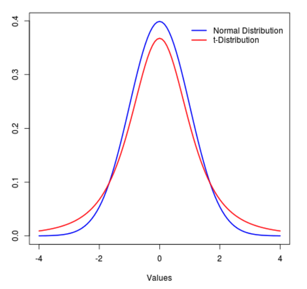

<!-- Quando la dimensione campionaria e' grande la nostra fiducia nell'approssimare sigma con la varianza campionaria e' ben riposta  e possiamo usare la normale per il calcolo dei CI, ma cosa succede quando i campioni soo piccoli? Usiamo la distribuzione  di Student

- e' una famiglia di distribuzioni, 1 per ogni valore campionario n-1

Come la normale:
- ha media 0
- e' simmetrica
- ha varianza >1 che si avvicina a 1 al crescere di N

Meno appuntita al centro e code piu' alte
 -->

---
## $\mathcal{t}$ di Student per campioni piccoli

- Non posso approssimare a una normale
- Uso la $\mathcal{t}$ di Student
  - considera i gradi di liberta' $(\mathcal{df})$
  - per un campione di dimensione $n \rightarrow \mathcal{df} = n -1$
  - per due campioni di dimensione $n_1 \land n_2 \rightarrow \mathcal{df} = n_1 -1 + n_2 - 1 =$
   &nbsp;&nbsp;&nbsp;&nbsp;&nbsp;&nbsp;&nbsp;&nbsp;&nbsp;&nbsp;&nbsp;&nbsp;&nbsp;&nbsp;&nbsp;&nbsp;&nbsp;&nbsp;&nbsp;&nbsp;&nbsp;&nbsp;&nbsp;&nbsp;&nbsp;&nbsp;&nbsp;&nbsp; $= n_1 + n_2 -2$

<!-- una famiglia di distribuzioni, 1 per ogni valore campionario n-1

 infatti la t-dist tiene conto dei valori campionari n-1, detti anche Gradi di liberta', che misurano la quantità di informazione disponibile nei dati che può essere usata per stimare sigma (affidabilità della stima s)

All’aumentare di n (e dei GdL) la stima di sigma attraverso s è sempre più affidabile: con n grande la distribuzione t si avvicina alla distribuzione normale
 -->

---
## $\mathcal{t}$ di Student per campioni piccoli

- Non posso approssimare a una normale
- Uso la $\mathcal{t}$ di Student
  - considera i gradi di liberta' $(\mathcal{df})$
  - per un campione di dimensione $n \rightarrow \mathcal{df} = n -1$
  - per due campioni di dimensione $n_1 \land n_2 \rightarrow \mathcal{df} = n_1 -1 + n_2 - 1 =$
   &nbsp;&nbsp;&nbsp;&nbsp;&nbsp;&nbsp;&nbsp;&nbsp;&nbsp;&nbsp;&nbsp;&nbsp;&nbsp;&nbsp;&nbsp;&nbsp;&nbsp;&nbsp;&nbsp;&nbsp;&nbsp;&nbsp;&nbsp;&nbsp;&nbsp;&nbsp;&nbsp;&nbsp; $= n_1 + n_2 -2$
   &nbsp;&nbsp;&nbsp;&nbsp;&nbsp;&nbsp;&nbsp;&nbsp;&nbsp;&nbsp;&nbsp;&nbsp; $\text{95\% CI} = (\bar{x} - \mathcal{t} \times \hat{SE}; \text{ } \bar{x} + \mathcal{t} \times \hat{SE})$

<!-- Il procedimento per la costruzione dei CI e' lo stesso, quello che cambia e' la tavola da dove andiamo ad estrare il coefficiente di attendibilita' (t) 

Attenzione sempre al fattop che la distribuzione di t è diversa per ciascuno dei gl: usare le tavole corrette!!! -->

---
## $\mathcal{t}$ di Student per campioni piccoli

- Non posso approssimare a una normale
- Uso la $\mathcal{t}$ di Student
  - considera i gradi di liberta' $(\mathcal{df})$
  - per un campione di dimensione $n \rightarrow \mathcal{df} = n -1$
  - per due campioni di dimensione $n_1 \land n_2 \rightarrow \mathcal{df} = n_1 -1 + n_2 - 1 =$
   &nbsp;&nbsp;&nbsp;&nbsp;&nbsp;&nbsp;&nbsp;&nbsp;&nbsp;&nbsp;&nbsp;&nbsp;&nbsp;&nbsp;&nbsp;&nbsp;&nbsp;&nbsp;&nbsp;&nbsp;&nbsp;&nbsp;&nbsp;&nbsp;&nbsp;&nbsp;&nbsp;&nbsp; $= n_1 + n_2 -2$
   &nbsp;&nbsp;&nbsp;&nbsp;&nbsp;&nbsp;&nbsp;&nbsp;&nbsp;&nbsp;&nbsp;&nbsp; $\text{95\% CI} = (\bar{x} - \mathcal{t} \times \hat{SE}; \text{ } \bar{x} + \mathcal{t} \times \hat{SE})$

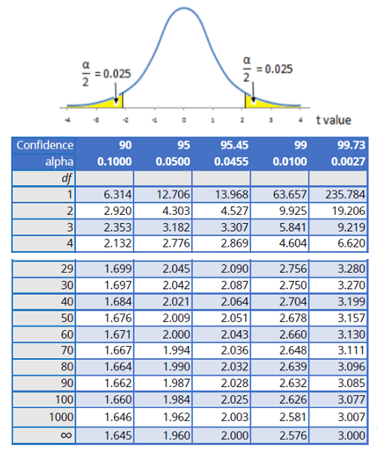

<!-- Piccoli == <30 circa  -->

---
## Esercizio #10

:question: &nbsp;&nbsp;&nbsp; $n=12$ &nbsp;&nbsp;&nbsp; 
&nbsp;&nbsp;&nbsp;&nbsp;&nbsp;&nbsp;&nbsp;&nbsp;&nbsp; $\bar{x}_{\text{BMI}} = 25.0 \text{ kg}/\text{m}^2$
&nbsp;&nbsp;&nbsp;&nbsp;&nbsp;&nbsp;&nbsp;&nbsp;&nbsp; $s_{\text{BMI}}  = 2.7 \text{ kg}/\text{m}^2$

&nbsp;&nbsp;&nbsp;&nbsp;&nbsp;&nbsp;&nbsp;&nbsp;&nbsp; $\text{90\% CI} = \text{ ?}$ 

<button id="countdown_exercise_10"></button>

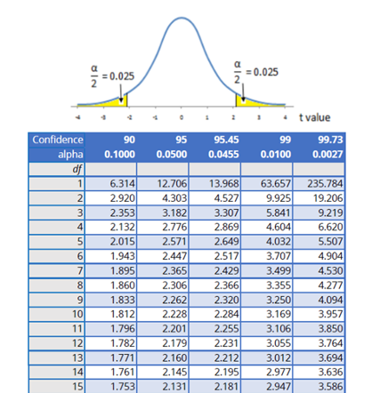

<!-- Fate bene attenzione al testo dell'esercizio -->

---
## Esercizio #10 -- Soluzione

:question: &nbsp;&nbsp;&nbsp; $n=12$ &nbsp;&nbsp;&nbsp; 
&nbsp;&nbsp;&nbsp;&nbsp;&nbsp;&nbsp;&nbsp;&nbsp;&nbsp; $\bar{x}_{\text{BMI}} = 25.0 \text{ kg}/\text{m}^2$
&nbsp;&nbsp;&nbsp;&nbsp;&nbsp;&nbsp;&nbsp;&nbsp;&nbsp; $s_{\text{BMI}}  = 2.7 \text{ kg}/\text{m}^2$

&nbsp;&nbsp;&nbsp;&nbsp;&nbsp;&nbsp;&nbsp;&nbsp;&nbsp; $\hat{\text{SE}}=s/\sqrt{n} = \frac{2.7}{\sqrt{12}}=0.78$
&nbsp;&nbsp;&nbsp;&nbsp;&nbsp;&nbsp;&nbsp;&nbsp;&nbsp; $\text{df} = n-1 = 12 - 1 = 11$

<!-- coefficiente di attendibilita' -->

---
## Esercizio #10 -- Soluzione

:question: &nbsp;&nbsp;&nbsp; $n=12$ &nbsp;&nbsp;&nbsp; 
&nbsp;&nbsp;&nbsp;&nbsp;&nbsp;&nbsp;&nbsp;&nbsp;&nbsp; $\bar{x}_{\text{BMI}} = 25.0 \text{ kg}/\text{m}^2$
&nbsp;&nbsp;&nbsp;&nbsp;&nbsp;&nbsp;&nbsp;&nbsp;&nbsp; $s_{\text{BMI}}  = 2.7 \text{ kg}/\text{m}^2$

&nbsp;&nbsp;&nbsp;&nbsp;&nbsp;&nbsp;&nbsp;&nbsp;&nbsp; $\hat{\text{SE}}=s/\sqrt{n} = \frac{2.7}{\sqrt{12}}=0.78$
&nbsp;&nbsp;&nbsp;&nbsp;&nbsp;&nbsp;&nbsp;&nbsp;&nbsp; $\text{df} = n-1 = 12 - 1 = 11$

&nbsp;&nbsp;&nbsp;&nbsp;&nbsp;&nbsp;&nbsp;&nbsp;&nbsp;&nbsp;&nbsp;&nbsp; $\text{90\% CI} = (\bar{x} - \mathcal{t} \times \hat{SE}; \text{ } \bar{x} + \mathcal{t} \times \hat{SE}) =$ 
&nbsp;&nbsp;&nbsp;&nbsp;&nbsp;&nbsp;&nbsp;&nbsp;&nbsp;&nbsp;&nbsp;&nbsp;&nbsp; $= (25 - 1.79 \times 0.78; \text{ } 25 + 1.79 \times 0.78) =$
&nbsp;&nbsp;&nbsp;&nbsp;&nbsp;&nbsp;&nbsp;&nbsp;&nbsp;&nbsp;&nbsp;&nbsp;&nbsp; $= (25 - 1.4; \text{ } 25 + 1.4) =$
&nbsp;&nbsp;&nbsp;&nbsp;&nbsp;&nbsp;&nbsp;&nbsp;&nbsp;&nbsp;&nbsp;&nbsp;&nbsp; $= (23.6; \text{ } 26.4)$

<!-- Abbiamo un grado di confidenza del 95% che la media della popolazione p sia compresa tra 24.28 e 25.72 -->

---
## Cosa abbiamo imparato in questa lezione?

- Gli intervalli di confidenza (CI)/margini di errore sono un aspetto importante di come vengono comunicate le statistiche
- La dimensione del campione influenza la larghezza dei CI
- Attraverso il boostrapping si ricampiona il dataset originale con rimpiazzo, ottenendo distribuzioni che tendono alla normale
- Il teorema del limite centrale ci dice che le distribuzioni campionarie tendono alla normale per campioni grandi, con formule per calcolare i CI
- Un CI del 95% risulta da una procedura che nel 95% dei casi contiene il valore della popolazione
- Per campioni piccoli, la distrubuzione campionaria viene approssimata dall t di Student

