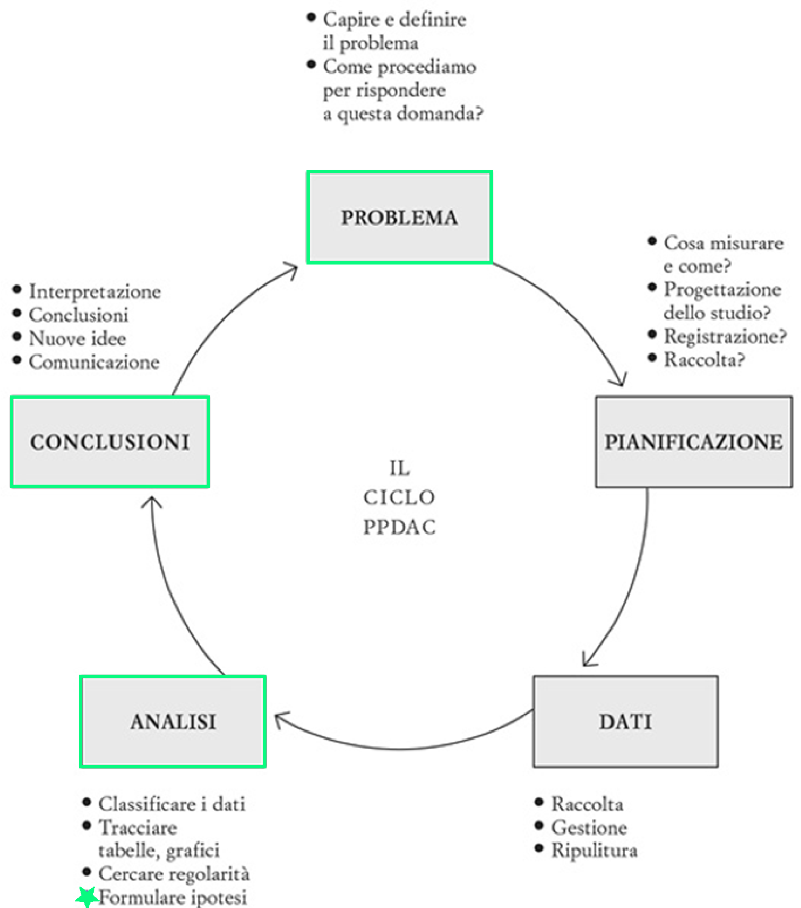
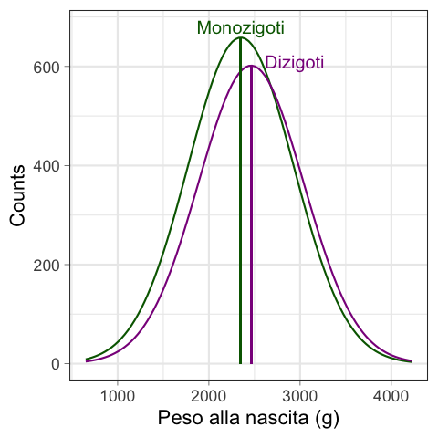
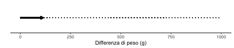
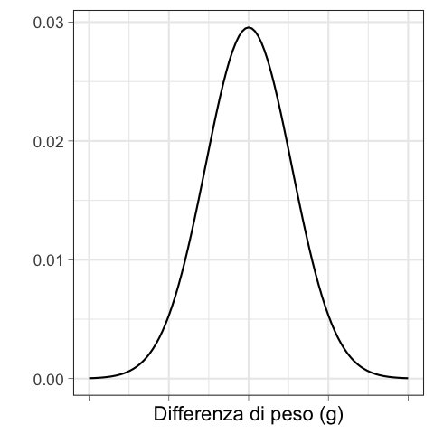
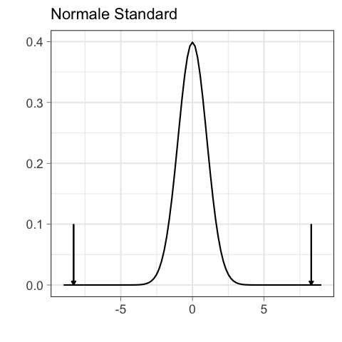
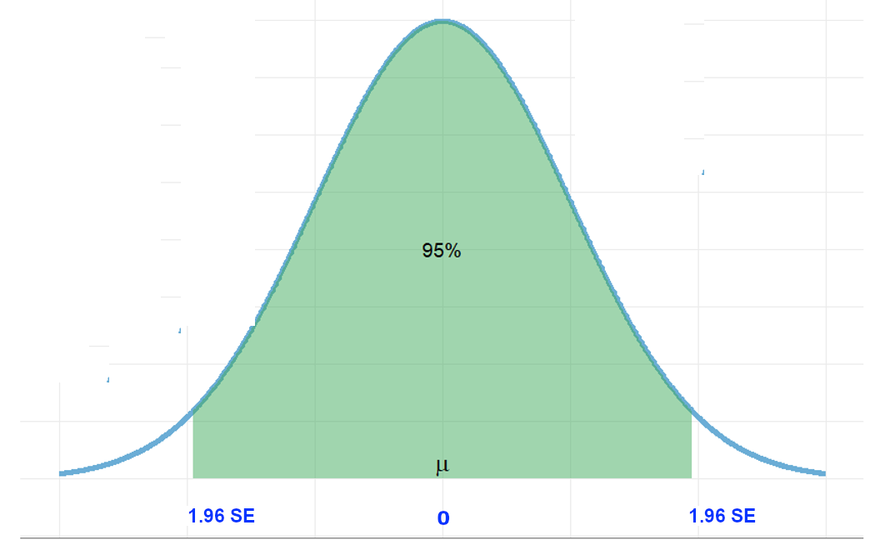
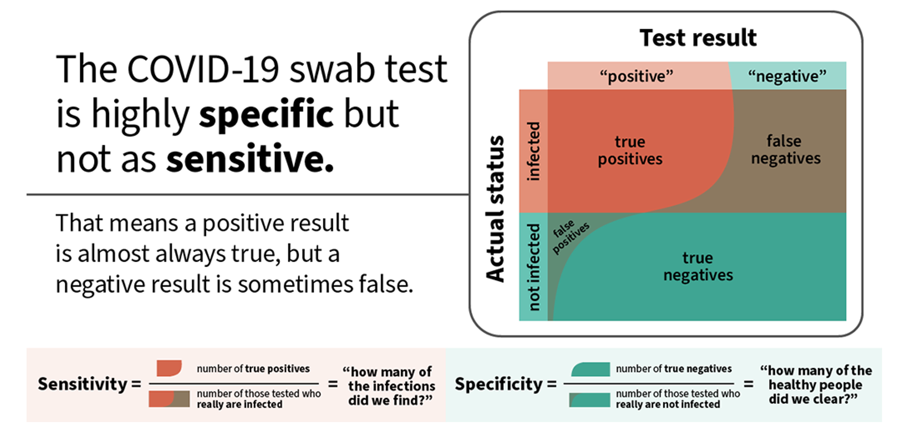
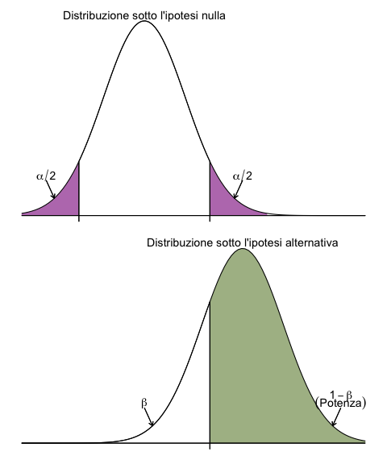
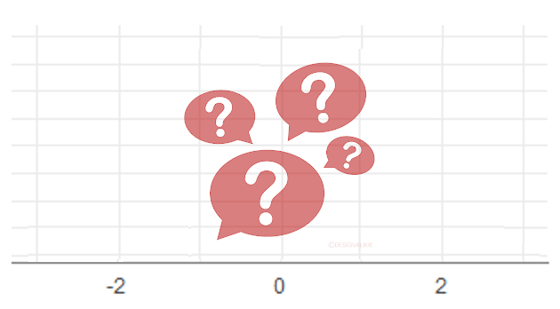

### Lezione 9

# La statistica inferenziale
## (Parte III: Test di ipotesi)
## &nbsp;

---

## Obiettivi di apprendimento

- Formulare e testare ipotesi
- Interpretare P value (e la loro relazione con i CI)
- Saper distinguere tra errori del primo e del secondo tipo 
- Interpretare la potenza di uno studio

---
## Le fasi della ricerca

Spiegelhalter, D., *The Art of Statistics: Learning From Data*, Pelican, 2019

<!-- The Analysis stage has traditionally been the main emphasis of statistics courses, and we shall cover a range of analytic techniques in this book; but sometimes all that is required is a useful visualization, as in Figure 0.1. 

Finally, the key to good statistical science is drawing appropriate Conclusions that fully acknowledge the limitations in the evidence, and communicating them clearly, as in the graphical illustrations of the Shipman data. Any conclusions generally raise more questions, and so the cycle starts over again, as when we started looking at the time of day when Shipman’s patients died.
 -->

---
##   &nbsp;&nbsp;&nbsp;&nbsp;&nbsp;&nbsp;:warning:  Attenzione  :warning:

&nbsp;&nbsp;&nbsp;&nbsp;&nbsp;&nbsp;&nbsp;&nbsp;&nbsp; Questa parte continua a essere complessa, ma non demordete,
&nbsp;&nbsp;&nbsp;&nbsp;&nbsp;&nbsp;&nbsp;&nbsp;&nbsp; siamo alla fine! 

---
## Cos'e' un'ipotesi?

> Una possibile spiegazione per un fenomeno, che non rappresenta la verita' assoluta, ma una congettura provvisoria

<!-- 
Ogni studio inizia con un'ipotesi, quella che viene chiamata "domanda di ricerca"

A hypothesis can be defined as a proposed explanation for a phenomenon. It is not the absolute truth, but a provisional, working assumption, perhaps best thought of as a potential suspect in a criminal case. -->

---
## Esempi di ipotesi

* Il peso alla nascita e' diverso nei gemelli monozigoti e dizigoti inglesi?
* Gli uomini e le donne inglesi hanno un diverso numero di partner sessuali?
* C'e  differenza nel trattare l'insonnia con CBT o con le cure standard?
* Il numero di bambini deceduti a seguito di interventi cardiochirugici a Bristol tra il 1984 e il 1995 e' diverso rispetto ad altri ospedali britannici?

<!-- Cognitive Behavior Therapy for Persistent Insomnia in General Practice 

Ci interessa saperlo per pianificare il controllo delle malattie sessualmente trasmesse, per pianificare i posti in NICU, per trattare l'insonnia e per scoprire casi di malasanita'

Un'ipotesi puo' essere definita come una congettura
-->

---
## Il principio di falsificabilità e l'ipotesi nulla

* Il peso alla nascita e' <s>diverso</s> *uguale* nei gemelli monozigoti e dizigoti inglesi<s>?</s>
* Gli uomini e le donne inglesi hanno <s>un diverso</s> *lo stesso* numero di partner sessuali<s>?</s>
* *Non* c'e differenza nel trattare l'insonnia con CBT o con le cure standard<s>?</s>
* Il numero di bambini deceduti a seguito di interventi cardiochirugici a Bristol tra il 1984 e il 1995 e' <s>diverso</s> *uguale* rispetto ad altri ospedali britannici<s>?</s>

<!-- Il metodo scientifico si basa sulla falsificazione delle ipotesi (K. Popper). Quindi quello che andiamo a testare e' l'esatto opposto, la cosidette ipotesi

The null hypothesis is what we are willing to assume is the case until proven otherwise. It is relentlessly negative, denying all progress and change. But this does not mean that we actually believe the null hypothesis is literally true: it should be clear that none of the hypotheses listed above could plausibly be precisely correct. 

So we can never claim that the null hypothesis has been actually proved: in the words of another great British statistician, Ronald Fisher, ‘the null hypothesis is never proved or established, but is possibly disproved, in the course of experimentation. Every experiment may be said to exist only in order to give the facts a chance of disproving the null hypothesis.’

infatti il fatto di aver trovato dell'evidenza in favore di un'ipotesi non vuold dire che non sara' mai possibile trovare ulteriore evidenza che la renda falsa -->

---
## Peso alla nascita dei gemelli inglesi

:pushpin: &nbsp;&nbsp;&nbsp; Il peso alla nascita e' <s>diverso</s> *uguale* nei gemelli monozigoti e dizigoti inglesi<s>?</s>

&nbsp;&nbsp;&nbsp;&nbsp;&nbsp;&nbsp;&nbsp;&nbsp;&nbsp; $n_{\text{d}}\text{ }=3481, \bar{x}_{\text{d}}\text{ }=2462\text{g}, s_{\text{d}}=577\text{g}$ 
&nbsp;&nbsp;&nbsp;&nbsp;&nbsp;&nbsp;&nbsp;&nbsp;&nbsp; $n_{\text{m}}=3823, \bar{x}_{\text{m}}=2350\text{g}, s_{\text{m}}=579\text{g}$ 

&nbsp;&nbsp;&nbsp;&nbsp;&nbsp;&nbsp;&nbsp;&nbsp;&nbsp; $\mu_{\text{d}} - \mu_{\text{m}} = 0$ 
&nbsp;&nbsp;&nbsp;&nbsp;&nbsp;&nbsp;&nbsp;&nbsp;&nbsp;&nbsp;&nbsp;&nbsp;&nbsp;&nbsp;&nbsp;&nbsp;&nbsp;&nbsp;&nbsp;&nbsp;&nbsp;&nbsp; $\rightarrow \text{Ipotesi nulla} \text{ } (\mathcal{H}_0)$

<!-- Il metodo statistico formalizza questa idea (È più semplice trovare evidenze contro un’ipotesi piuttosto che evidenze a favore) attraverso l’ipotesi nulla, 

HO ci dice che non ci sono differenze. Dexamethasome ha la stessa efficacia della terapia standard e non aumenta il numero di giorni di respirazione autonoma.

L’ipotesi nulla (𝐻_0 )  è l’ipotesi considerata vera finché non vengono presentate delle prove (evidenza empirica) per mostrare che non lo è

come per i dinosauri: non ganno piume sino a che non ne troviamo uno che ce l'ha

Non possiamo provare una teoria, ma possiamo falsificare delle affermazioni -->

---
## Peso alla nascita dei gemelli inglesi

:pushpin: &nbsp;&nbsp;&nbsp; Il peso alla nascita e' <s>diverso</s> *uguale* nei gemelli monozigoti e dizigoti inglesi<s>?</s>

&nbsp;&nbsp;&nbsp;&nbsp;&nbsp;&nbsp;&nbsp;&nbsp;&nbsp; $n_{\text{d}}\text{ }=3481, \bar{x}_{\text{d}}\text{ }=2462\text{g}, s_{\text{d}}=577\text{g}$ 
&nbsp;&nbsp;&nbsp;&nbsp;&nbsp;&nbsp;&nbsp;&nbsp;&nbsp; $n_{\text{m}}=3823, \bar{x}_{\text{m}}=2350\text{g}, s_{\text{m}}=579\text{g}$ 

&nbsp;&nbsp;&nbsp;&nbsp;&nbsp;&nbsp;&nbsp;&nbsp;&nbsp; $\mu_{\text{d}} - \mu_{\text{m}} = 0$ 
&nbsp;&nbsp;&nbsp;&nbsp;&nbsp;&nbsp;&nbsp;&nbsp;&nbsp;&nbsp;&nbsp;&nbsp;&nbsp;&nbsp;&nbsp;&nbsp;&nbsp;&nbsp;&nbsp;&nbsp;&nbsp;&nbsp; $\rightarrow \text{Ipotesi nulla} \text{ } (\mathcal{H}_0)$

&nbsp;&nbsp;&nbsp;&nbsp;&nbsp;&nbsp;&nbsp;&nbsp;&nbsp; $\mu_{\text{d}} - \mu_{\text{m}} \neq 0$ 
&nbsp;&nbsp;&nbsp;&nbsp;&nbsp;&nbsp;&nbsp;&nbsp;&nbsp;&nbsp;&nbsp;&nbsp;&nbsp;&nbsp;&nbsp;&nbsp;&nbsp;&nbsp;&nbsp;&nbsp;&nbsp;&nbsp; $\rightarrow \text{Ipotesi aternativa} \text{ } (\mathcal{H}_{1/A})$

---
## Peso alla nascita dei gemelli inglesi

:pushpin: &nbsp;&nbsp;&nbsp; Il peso alla nascita e' <s>diverso</s> *uguale* nei gemelli monozigoti e dizigoti inglesi<s>?</s>

&nbsp;&nbsp;&nbsp;&nbsp;&nbsp;&nbsp;&nbsp;&nbsp;&nbsp; $n_{\text{d}}\text{ }=3481, \bar{x}_{\text{d}}\text{ }=2462\text{g}, s_{\text{d}}=577\text{g}$ 
&nbsp;&nbsp;&nbsp;&nbsp;&nbsp;&nbsp;&nbsp;&nbsp;&nbsp; $n_{\text{m}}=3823, \bar{x}_{\text{m}}=2350\text{g}, s_{\text{m}}=579\text{g}$ 

&nbsp;&nbsp;&nbsp;&nbsp;&nbsp;&nbsp;&nbsp;&nbsp;&nbsp; $\mu_{\text{d}} - \mu_{\text{m}} = 0$ &nbsp;&nbsp;&nbsp; $\leftarrow$
&nbsp;&nbsp;&nbsp;&nbsp;&nbsp;&nbsp;&nbsp;&nbsp;&nbsp; $\bar{x}_{\text{d}} - \bar{x}_{\text{m}} = 2462\text{g} - 2350\text{g} = 112\text{g}$ 

---
## Peso alla nascita dei gemelli inglesi

:pushpin: &nbsp;&nbsp;&nbsp; Il peso alla nascita e' <s>diverso</s> *uguale* nei gemelli monozigoti e dizigoti inglesi<s>?</s>

&nbsp;&nbsp;&nbsp;&nbsp;&nbsp;&nbsp;&nbsp;&nbsp;&nbsp; $n_{\text{d}}\text{ }=3481, \bar{x}_{\text{d}}\text{ }=2462\text{g}, s_{\text{d}}=577\text{g}$ 
&nbsp;&nbsp;&nbsp;&nbsp;&nbsp;&nbsp;&nbsp;&nbsp;&nbsp; $n_{\text{m}}=3823, \bar{x}_{\text{m}}=2350\text{g}, s_{\text{m}}=579\text{g}$ 

&nbsp;&nbsp;&nbsp;&nbsp;&nbsp;&nbsp;&nbsp;&nbsp;&nbsp; $\mu_{\text{d}} - \mu_{\text{m}} = 0$ &nbsp;&nbsp;&nbsp; $\leftarrow$
&nbsp;&nbsp;&nbsp;&nbsp;&nbsp;&nbsp;&nbsp;&nbsp;&nbsp; $\bar{x}_{\text{d}} - \bar{x}_{\text{m}} = 2462\text{g} - 2350\text{g} = 112\text{g}$ 

:question: &nbsp;&nbsp;&nbsp; Una differenza di 112g e' "abbastanza vicina" a zero per concludere $\mu_{\text{d}} - \mu_{\text{m}} = 0$?

---
## Peso alla nascita dei gemelli inglesi

:pushpin: &nbsp;&nbsp;&nbsp; Il peso alla nascita e' <s>diverso</s> *uguale* nei gemelli monozigoti e dizigoti inglesi<s>?</s>

&nbsp;&nbsp;&nbsp;&nbsp;&nbsp;&nbsp;&nbsp;&nbsp;&nbsp; $n_{\text{d}}\text{ }=3481, \bar{x}_{\text{d}}\text{ }=2462\text{g}, s_{\text{d}}=577\text{g}$ 
&nbsp;&nbsp;&nbsp;&nbsp;&nbsp;&nbsp;&nbsp;&nbsp;&nbsp; $n_{\text{m}}=3823, \bar{x}_{\text{m}}=2350\text{g}, s_{\text{m}}=579\text{g}$ 

&nbsp;&nbsp;&nbsp;&nbsp;&nbsp;&nbsp;&nbsp;&nbsp;&nbsp; $\mu_{\text{d}} - \mu_{\text{m}} = 0$ &nbsp;&nbsp;&nbsp; $\leftarrow$
&nbsp;&nbsp;&nbsp;&nbsp;&nbsp;&nbsp;&nbsp;&nbsp;&nbsp; $\bar{x}_{\text{d}} - \bar{x}_{\text{m}} = 2462\text{g} - 2350\text{g} = 112\text{g}$ 

:question: &nbsp;&nbsp;&nbsp; Una differenza di $112$g e' "abbastanza vicina" a zero per concludere $\mu_{\text{d}} - \mu_{\text{m}} = 0$?

:question: &nbsp;&nbsp;&nbsp; Qual e' la probabilita' di osservare una differenza di $112$g se $\mu_{\text{d}} - \mu_{\text{m}} = 0$?

<!-- Se e' abbastanza probabile, tipo 1 caso su 10, vuol dire che e' abbastanza vicino, se invece e' 1 su 1000 allora e' alquanto improbabile, e di conseguenza vuol dire che e' "sufficientemente lontanp".

Se vi dico probabilita' di osservare, quale argomento passato vi viene in mente? -->

---
## Facciamo un paio di passi indietro

1. La Normale e' definita dalla sua media e deviazione standard e corrisponde a una distribuzione di probabilita'
&nbsp;&nbsp;&nbsp;&nbsp;&nbsp;&nbsp;&nbsp;&nbsp;&nbsp; $\rightarrow$ &nbsp;&nbsp;&nbsp; Area sottesesa a $Z$ $\equiv$ probabilita' $\mathcal{P}$
2. Il teorema del limite centrale ci dice che le distribuzioni campionarie (incluso la differenza delle medie) tendono alla Normale

---
## Facciamo un paio di passi indietro

1. La Normale e' definita dalla sua media e deviazione standard e corrisponde a una distribuzione di probabilita'
&nbsp;&nbsp;&nbsp;&nbsp;&nbsp;&nbsp;&nbsp;&nbsp;&nbsp; $\rightarrow$ &nbsp;&nbsp;&nbsp; Area sottesesa a $Z$ $\equiv$ probabilita' $\mathcal{P}$
2. Il teorema del limite centrale ci dice che le distribuzioni campionarie (incluso la differenza delle medie) tendono alla Normale

Per la differenza tra due medie

&nbsp;&nbsp;&nbsp;&nbsp;&nbsp;&nbsp;&nbsp;&nbsp; $\mathcal{N} = (\mu_1 - \mu_2, \frac{\sigma_1^2}{n_1} + \frac{\sigma_2^2}{n_2})$ con 
&nbsp;&nbsp;&nbsp;&nbsp;&nbsp;&nbsp;&nbsp;&nbsp; $\sqrt{ \frac{\sigma_1^2}{n_1} + \frac{\sigma_2^2}{n_2} } \rightarrow$ &nbsp; standard error

---
## Peso alla nascita dei gemelli inglesi

:pushpin: &nbsp;&nbsp;&nbsp; Il peso alla nascita e' <s>diverso</s> *uguale* nei gemelli monozigoti e dizigoti inglesi<s>?</s>

&nbsp;&nbsp;&nbsp;&nbsp;&nbsp;&nbsp;&nbsp;&nbsp;&nbsp; $n_{\text{d}}\text{ }=3481, \bar{x}_{\text{d}}\text{ }=2462\text{g}, s_{\text{d}}=577\text{g}$ 
&nbsp;&nbsp;&nbsp;&nbsp;&nbsp;&nbsp;&nbsp;&nbsp;&nbsp; $n_{\text{m}}=3823, \bar{x}_{\text{m}}=2350\text{g}, s_{\text{m}}=579\text{g}$ 

&nbsp;&nbsp;&nbsp;&nbsp;&nbsp;&nbsp;&nbsp;&nbsp;&nbsp; $\mu_{\text{d}} - \mu_{\text{m}} = 0$ &nbsp;&nbsp;&nbsp; $\leftarrow$
&nbsp;&nbsp;&nbsp;&nbsp;&nbsp;&nbsp;&nbsp;&nbsp;&nbsp; $\bar{x}_{\text{d}} - \bar{x}_{\text{m}} = 2462\text{g} - 2350\text{g} = 112\text{g}$ 

&nbsp;&nbsp;&nbsp;&nbsp;&nbsp;&nbsp;&nbsp;&nbsp;&nbsp; $\mathcal{N} = (\mu_{\text{d}} - \mu_{\text{m}}, \text{SE}
)$, con $\mu_{\text{d}} - \mu_{\text{m}} = 0$
&nbsp;&nbsp;&nbsp;&nbsp;&nbsp;&nbsp;&nbsp;&nbsp;&nbsp; e  $\text{SE} = \sqrt{\frac{s_\text{d}^2}{n_\text{d}} + \frac{s_\text{m}^2}{n_\text{m}}} = 13.5\text{g}$

:question: &nbsp;&nbsp;&nbsp; Qual e' la probabilita' di osservare una differenza di $112$g se $\mu_{\text{d}} - \mu_{\text{m}} = 0$?
&nbsp;&nbsp;&nbsp;&nbsp;&nbsp;&nbsp;&nbsp;&nbsp;&nbsp; Area sottesesa a $Z$ $\equiv$ probabilita' $\mathcal{P}$

<!-- Andiamo a incorporare questi elementi nel nostro problema -->

---
## Peso alla nascita dei gemelli inglesi

:pushpin: &nbsp;&nbsp;&nbsp; Il peso alla nascita e' <s>diverso</s> *uguale* nei gemelli monozigoti e dizigoti inglesi<s>?</s>

&nbsp;&nbsp;&nbsp;&nbsp;&nbsp;&nbsp;&nbsp;&nbsp;&nbsp; $n_{\text{d}}\text{ }=3481, \bar{x}_{\text{d}}\text{ }=2462\text{g}, s_{\text{d}}=577\text{g}$ 
&nbsp;&nbsp;&nbsp;&nbsp;&nbsp;&nbsp;&nbsp;&nbsp;&nbsp; $n_{\text{m}}=3823, \bar{x}_{\text{m}}=2350\text{g}, s_{\text{m}}=579\text{g}$ 

&nbsp;&nbsp;&nbsp;&nbsp;&nbsp;&nbsp;&nbsp;&nbsp;&nbsp; $\mu_{\text{d}} - \mu_{\text{m}} = 0$ &nbsp;&nbsp;&nbsp; $\leftarrow$
&nbsp;&nbsp;&nbsp;&nbsp;&nbsp;&nbsp;&nbsp;&nbsp;&nbsp; $\bar{x}_{\text{d}} - \bar{x}_{\text{m}} = 2462\text{g} - 2350\text{g} = 112\text{g}$ 

&nbsp;&nbsp;&nbsp;&nbsp;&nbsp;&nbsp;&nbsp;&nbsp;&nbsp; $\mathcal{N} = (\mu_{\text{d}} - \mu_{\text{m}}, \text{SE}
)$, con $\mu_{\text{d}} - \mu_{\text{m}} = 0$
&nbsp;&nbsp;&nbsp;&nbsp;&nbsp;&nbsp;&nbsp;&nbsp;&nbsp; e  $\text{SE} = \sqrt{\frac{s_\text{d}^2}{n_\text{d}} + \frac{s_\text{m}^2}{n_\text{m}}} = 13.5\text{g}$

:question: &nbsp;&nbsp;&nbsp; Qual e' la probabilita' di osservare una differenza di $112$g se $\mu_{\text{d}} - \mu_{\text{m}} = 0$?
&nbsp;&nbsp;&nbsp;&nbsp;&nbsp;&nbsp;&nbsp;&nbsp;&nbsp; Area sottesesa a $Z$ $\equiv$ probabilita' $\mathcal{P}$ &nbsp;&nbsp; $\rightarrow$ &nbsp;&nbsp; $z = \frac{\bar{X}-\mu}{\hat{SE}} = \frac{112\text{g}-0}{13.5\text{g}} = 8.3$

<!-- P = 1.4e-16 

Unsando il p value, che ci dice quanto sono improbabili i risultati ottenuti da questo campione dato che l'ipotesi nulla e' vera.

Un p value molto piccolo ci dice quindi che sia molto improbabile che H0 sia vera dandoci una forte ragione per dubitare che le due medie siano uguali 

-->
---
## P value

:dart: &nbsp;&nbsp;&nbsp; Il P value misura la discrepanza tra i dati e $\mathcal{H}_0$ e corrisponde alla
&nbsp;&nbsp;&nbsp;&nbsp;&nbsp;&nbsp;&nbsp;&nbsp;&nbsp; probabilita' di ottenere un risultato tanto estremo quanto quello 
&nbsp;&nbsp;&nbsp;&nbsp;&nbsp;&nbsp;&nbsp;&nbsp;&nbsp; ottenuto se l'ipotesi nulla fosse vera.

---
## P value

:dart: &nbsp;&nbsp;&nbsp; Il P value misura la discrepanza tra i dati e $\mathcal{H}_0$ e corrisponde alla
&nbsp;&nbsp;&nbsp;&nbsp;&nbsp;&nbsp;&nbsp;&nbsp;&nbsp; probabilita' di ottenere un risultato tanto estremo quanto quello 
&nbsp;&nbsp;&nbsp;&nbsp;&nbsp;&nbsp;&nbsp;&nbsp;&nbsp; ottenuto se l'ipotesi nulla fosse vera.

&nbsp;&nbsp;&nbsp;&nbsp;&nbsp;&nbsp;&nbsp;&nbsp;&nbsp;&nbsp;&nbsp;&nbsp;&nbsp;&nbsp;&nbsp;&nbsp;&nbsp;&nbsp; $\text{P value} = 0.5 \rightarrow 50\% \rightarrow 1 \text{ campione su } 2$
&nbsp;&nbsp;&nbsp;&nbsp;&nbsp;&nbsp;&nbsp;&nbsp;&nbsp;&nbsp;&nbsp;&nbsp;&nbsp;&nbsp;&nbsp;&nbsp;&nbsp;&nbsp; $\text{P value} = 0.1 \rightarrow 10\% \rightarrow 1 \text{ campione su } 10$
&nbsp;&nbsp;&nbsp;&nbsp;&nbsp;&nbsp;&nbsp;&nbsp;&nbsp;&nbsp;&nbsp;&nbsp;&nbsp;&nbsp;&nbsp;&nbsp;&nbsp;&nbsp; $\text{P value} = 0.05 \rightarrow 5\% \rightarrow 1 \text{ campione su } 20$
&nbsp;&nbsp;&nbsp;&nbsp;&nbsp;&nbsp;&nbsp;&nbsp;&nbsp;&nbsp;&nbsp;&nbsp;&nbsp;&nbsp;&nbsp;&nbsp;&nbsp;&nbsp; $\text{P value} = 0.01 \rightarrow 1\% \rightarrow 1 \text{ campione su } 100$
&nbsp;&nbsp;&nbsp;&nbsp;&nbsp;&nbsp;&nbsp;&nbsp;&nbsp;&nbsp;&nbsp;&nbsp;&nbsp;&nbsp;&nbsp;&nbsp;&nbsp;&nbsp; $\text{P value} = 0.005 \rightarrow 0.5\% \rightarrow 1 \text{ campione su } 200$

 <!-- ci dice quanto e' probabile fare un errore (il peso alla nascita e' diverso) se accettiamo l'ipotesi nulla 
  
  Se p-value = 0.02
  Se l’ipotesi nulla fosse vera, la probabilità di osservare il risultato che abbiamo ottenuto, o una differenza ancora maggiore, sarebbe solo dell’2%
  Se il farmaco non fosse efficace (ipotesi nulla fosse vera) solo in 2 campione ogni 100 avremmo il risultato osservato 

  In modo molto informale. L’espressione statisticamente significativo vuol dire che sono state raccolte prove sufficienti per rifiutare l’ipotesi nulla 
  
 -->

---
### P value e significativita' statistica

:dart: &nbsp;&nbsp;&nbsp; Il P value misura la discrepanza tra i dati e $\mathcal{H}_0$ e corrisponde alla
&nbsp;&nbsp;&nbsp;&nbsp;&nbsp;&nbsp;&nbsp;&nbsp;&nbsp; probabilita' di ottenere un risultato tanto estremo quanto quello 
&nbsp;&nbsp;&nbsp;&nbsp;&nbsp;&nbsp;&nbsp;&nbsp;&nbsp; ottenuto se l'ipotesi nulla fosse vera.

&nbsp;&nbsp;&nbsp;&nbsp;&nbsp;&nbsp;&nbsp;&nbsp;&nbsp; Se il P value e' minore di una soglia critica $\alpha$, possiamo dire che il nostro
&nbsp;&nbsp;&nbsp;&nbsp;&nbsp;&nbsp;&nbsp;&nbsp;&nbsp; risultato e' statisticamente significativo

&nbsp;&nbsp;&nbsp;&nbsp;&nbsp;&nbsp;&nbsp;&nbsp;&nbsp;&nbsp;&nbsp;&nbsp;&nbsp;&nbsp;&nbsp;&nbsp;&nbsp;&nbsp; $\alpha = 0.05 \lor 0.01$

<!-- 
Ronald Fisher used P < 0.05 and P < 0.01 as convenient critical thresholds for indicating significance, and produced tables of the critical values of test statistics needed to achieve these levels of significance. The popularity of these tables led to 0.05 and 0.01 becoming established conventions, although it is now recommended that exact P-values should be reported. And it is important to emphasize that the exact P-value is conditional not only on the truth of the null hypothesis, but also on all other assumptions underlying the statistical model, such as lack of systematic bias, independent observations, and so on.

This whole process has become known as Null Hypothesis Significance Testing (NHST) and, as we shall see below, it has become a source of major controversy. But first we should examine how Fisher’s ideas are used in practice.

Ronald Fisher was an extraordinary, but difficult, man. He was extraordinary because he is regarded as a pioneering figure in two distinct fields – genetics and statistics. Yet he had a notorious temper and could be extremely critical of anyone who he felt questioned his ideas, while his support for eugenics and his public criticism of the evidence for the link between smoking and lung cancer damaged his standing. His personal reputation has suffered as his financial connections with the tobacco industry have been revealed, but his scientific reputation is undiminished, as his ideas find repeated new applications in the analysis of large data sets. -->

---
## Test di ipotesi, un passo alla volta

---
## Test di ipotesi, un passo alla volta

1. Definisco la mia ipotesi nulla $(\mathcal{H_0})$

&nbsp;&nbsp;&nbsp;&nbsp;&nbsp;&nbsp;&nbsp;&nbsp;&nbsp;&nbsp; Il peso alla nascita e' <s>diverso</s> *uguale* nei gemelli monozigoti e dizigoti inglesi<s>?</s>
&nbsp;&nbsp;&nbsp;&nbsp;&nbsp;&nbsp;&nbsp;&nbsp;&nbsp;&nbsp; $\mathcal{H_0} : \mu_d - \mu_m = 0$

---
## Test di ipotesi, un passo alla volta

1. Definisco la mia ipotesi nulla $(\mathcal{H_0})$
2. Scelgo un test statistico che stimi qualcosa che, se abbastanza estremo, mi faccia dubitare di $\mathcal{H_0}$

&nbsp;&nbsp;&nbsp;&nbsp;&nbsp;&nbsp;&nbsp;&nbsp;&nbsp;&nbsp; T-test della differenza di due medie campionarie

---
## Test di ipotesi, un passo alla volta

1. Definisco la mia ipotesi nulla $(\mathcal{H_0})$
2. Scelgo un test statistico che stimi qualcosa che, se abbastanza estremo, mi faccia dubitare di $\mathcal{H_0}$
3. Genero la distribuzione campionaria del test scelto, assumendo $\mathcal{H_0}$ vera

&nbsp;&nbsp;&nbsp;&nbsp;&nbsp;&nbsp;&nbsp;&nbsp;&nbsp;&nbsp; $\mathcal{N} = (\mu_d - \mu_m, \text{SE})$, con $\mu_d - \mu_m = 0$

---
## Test di ipotesi, un passo alla volta

1. Definisco la mia ipotesi nulla $(\mathcal{H_0})$
2. Scelgo un test statistico che stimi qualcosa che, se abbastanza estremo, mi faccia dubitare di $\mathcal{H_0}$
3. Genero la distribuzione campionaria del test scelto, assumendo $\mathcal{H_0}$ vera
4. Verifico se la statistica osservata si trovi sulla coda di questa distribuzione e assegno una probabilita' (P value) a questo evento

&nbsp;&nbsp;&nbsp;&nbsp;&nbsp;&nbsp;&nbsp;&nbsp;&nbsp;&nbsp; $\text{P value} = 1.4 \times 10^{-16}$

<!-- P-value: the probability, were the null hypothesis true, of observing such an extreme statistic. The P-value is therefore a particular tail-area. -->

---
## Test di ipotesi, un passo alla volta

1. Definisco la mia ipotesi nulla $(\mathcal{H_0})$
2. Scelgo un test statistico che stimi qualcosa che, se abbastanza estremo, mi faccia dubitare di $\mathcal{H_0}$
3. Genero la distribuzione campionaria del test scelto, assumendo $\mathcal{H_0}$ vera
4. Verifico se la statistica osservata si trovi sulla coda di questa distribuzione e assegno una probabilita' (P value) a questo evento
5. Dichiaro il risultato come statisticamente significativo se il P value e' inferiore a una soglia critica $\alpha$

&nbsp;&nbsp;&nbsp;&nbsp;&nbsp;&nbsp;&nbsp;&nbsp;&nbsp;&nbsp; $\text{P value} = 1.4 \times 10^{-16} < 0.05$

---
### Esercizio

---
## P value & intervallo di confidenza

---
## Uguale, diverso, maggiore, minore?

:dart: &nbsp;&nbsp;&nbsp; $\mathcal{H}_1$: &nbsp;&nbsp;&nbsp; $\mu_{\text{i}} - \mu_{\text{c}} \neq 0$   
&nbsp;&nbsp;&nbsp;&nbsp;&nbsp;&nbsp;&nbsp;&nbsp;&nbsp;&nbsp;&nbsp;&nbsp;&nbsp;&nbsp;&nbsp;&nbsp;&nbsp;&nbsp;&nbsp;&nbsp;&nbsp;&nbsp;&nbsp;&nbsp;&nbsp;&nbsp;&nbsp; $\rightarrow$ two-tailed test

&nbsp;&nbsp;&nbsp;&nbsp;&nbsp;&nbsp;&nbsp;&nbsp;&nbsp; $\mathcal{H}_1$: &nbsp;&nbsp;&nbsp; $\mu_{\text{}} - \mu_{\text{c}} > 0$   
&nbsp;&nbsp;&nbsp;&nbsp;&nbsp;&nbsp;&nbsp;&nbsp;&nbsp;&nbsp;&nbsp;&nbsp;&nbsp;&nbsp;&nbsp;&nbsp;&nbsp;&nbsp;&nbsp;&nbsp;&nbsp;&nbsp; $\mu_{\text{i}} - \mu_{\text{c}} < 0$
&nbsp;&nbsp;&nbsp;&nbsp;&nbsp;&nbsp;&nbsp;&nbsp;&nbsp;&nbsp;&nbsp;&nbsp;&nbsp;&nbsp;&nbsp;&nbsp;&nbsp;&nbsp;&nbsp;&nbsp;&nbsp;&nbsp;&nbsp;&nbsp;&nbsp;&nbsp;&nbsp; $\rightarrow$ one-tailed test

<!-- A one-tailed test looks for an “increase” or “decrease” in the parameter whereas a two-tailed test looks for a “change” (could be increase or decrease) in the parameter. -->

---
## Pearson's $\chi^2$ test

:pushpin: &nbsp;&nbsp;&nbsp; Is zidovudine the same as standard care?

&nbsp;&nbsp;&nbsp;&nbsp;&nbsp;&nbsp;&nbsp;&nbsp;&nbsp; $n_{\text{i}}=180, m_{\text{i}}=13$ 
&nbsp;&nbsp;&nbsp;&nbsp;&nbsp;&nbsp;&nbsp;&nbsp;&nbsp; $n_{\text{c}}=183, m_{\text{c}}=40$ 

&nbsp;&nbsp;&nbsp;&nbsp;&nbsp;&nbsp;&nbsp;&nbsp;&nbsp; $\mathcal{H}_0: \pi_{\text{i}} - \pi_{\text{c}}  = 0$ &nbsp;&nbsp;&nbsp; 
&nbsp;&nbsp;&nbsp;&nbsp;&nbsp;&nbsp;&nbsp;&nbsp;&nbsp; $\mathcal{H}_1: \pi_{\text{i}} - \pi_{\text{c}}  \neq 0$

&nbsp;&nbsp;&nbsp;&nbsp;&nbsp;&nbsp;&nbsp;&nbsp;&nbsp; $\alpha = 0.05$

<!-- Proviamo ora a calcolare se l'uso di zidovudine influisce sulla trasmissione del virus dell'HIV da madre a bambino usando un test diverso, il Pearson\s chi2, un testo usato comunemente per testare le differenze tra variabili categoriche

Di nuovo andiamo a definire H0 come proporzione di bambini che contraggio il virus essere la stessa tra chi ha assunto il medicinale e chi no (ipotesi di indipendenza) e H1 proporzione di infetti diversi tra chi a preso il farmaco o meno (ipotesi di associazione)

non le riporto nelle slide perche' tra poco diventeranno parecchio piene! -->

---
## Pearson's $\chi^2$ test

:pushpin: &nbsp;&nbsp;&nbsp; Is zidovudine the same as standard care?

&nbsp;&nbsp;&nbsp;&nbsp;&nbsp;&nbsp;&nbsp;&nbsp;&nbsp; $n_{\text{i}}=180, m_{\text{i}}=13$ 
&nbsp;&nbsp;&nbsp;&nbsp;&nbsp;&nbsp;&nbsp;&nbsp;&nbsp; $n_{\text{c}}=183, m_{\text{c}}=40$ 

&nbsp;&nbsp;&nbsp;&nbsp;&nbsp;&nbsp;&nbsp;&nbsp;&nbsp; $\mathcal{H}_0: \pi_{\text{i}} - \pi_{\text{c}}  = 0$ &nbsp;&nbsp;&nbsp; 
&nbsp;&nbsp;&nbsp;&nbsp;&nbsp;&nbsp;&nbsp;&nbsp;&nbsp; $\mathcal{H}_1: \pi_{\text{i}} - \pi_{\text{c}}  \neq 0$

&nbsp;&nbsp;&nbsp;&nbsp;&nbsp;&nbsp;&nbsp;&nbsp;&nbsp; $\alpha = 0.05$

| | Int | Cnt | Tot
| :---- | -----: | ----: | ----: |
HIV+ |
HIV- |
Total | 180 | 183 | 363 |

<!-- Andiamo innanzitutto a costruirci una tabella di contigenza, dove andiamo ad indicare le dimensioni dei due campioni -->

---
## Pearson's $\chi^2$ test

:pushpin: &nbsp;&nbsp;&nbsp; Is zidovudine the same as standard care?

&nbsp;&nbsp;&nbsp;&nbsp;&nbsp;&nbsp;&nbsp;&nbsp;&nbsp; $n_{\text{i}}=180, m_{\text{i}}=13$ 
&nbsp;&nbsp;&nbsp;&nbsp;&nbsp;&nbsp;&nbsp;&nbsp;&nbsp; $n_{\text{c}}=183, m_{\text{c}}=40$ 

&nbsp;&nbsp;&nbsp;&nbsp;&nbsp;&nbsp;&nbsp;&nbsp;&nbsp; $\mathcal{H}_0: \pi_{\text{i}} - \pi_{\text{c}}  = 0$ &nbsp;&nbsp;&nbsp; 
&nbsp;&nbsp;&nbsp;&nbsp;&nbsp;&nbsp;&nbsp;&nbsp;&nbsp; $\mathcal{H}_1: \pi_{\text{i}} - \pi_{\text{c}}  \neq 0$

&nbsp;&nbsp;&nbsp;&nbsp;&nbsp;&nbsp;&nbsp;&nbsp;&nbsp; $\alpha = 0.05$

| | Int | Cnt | Tot
| :---- | -----: | ----: | ----: |
HIV+ | 13 | 40 | 53 | 
HIV- |
Total | 180 | 183 | 363 |

<!-- Anduiamo poi a riportare di casi di infezione nei due campioni -->

---
## Pearson's $\chi^2$ test

:pushpin: &nbsp;&nbsp;&nbsp; Is zidovudine the same as standard care?

&nbsp;&nbsp;&nbsp;&nbsp;&nbsp;&nbsp;&nbsp;&nbsp;&nbsp; $n_{\text{i}}=180, m_{\text{i}}=13$ 
&nbsp;&nbsp;&nbsp;&nbsp;&nbsp;&nbsp;&nbsp;&nbsp;&nbsp; $n_{\text{c}}=183, m_{\text{c}}=40$ 

&nbsp;&nbsp;&nbsp;&nbsp;&nbsp;&nbsp;&nbsp;&nbsp;&nbsp; $\mathcal{H}_0: \pi_{\text{i}} - \pi_{\text{c}}  = 0$ &nbsp;&nbsp;&nbsp; 
&nbsp;&nbsp;&nbsp;&nbsp;&nbsp;&nbsp;&nbsp;&nbsp;&nbsp; $\mathcal{H}_1: \pi_{\text{i}} - \pi_{\text{c}}  \neq 0$

&nbsp;&nbsp;&nbsp;&nbsp;&nbsp;&nbsp;&nbsp;&nbsp;&nbsp; $\alpha = 0.05$

| | Int | Cnt | Tot
| :---- | -----: | ----: | ----: |
HIV+ | 13 | 40 | 53 | 
HIV- | 167 | 143 | 310
Total | 180 | 183 | 363 |

<!-- Andiamo poi a completare la differenza per indicare anche il numero di infanti che non ha contratto l'infezione -->

---
## Pearson's $\chi^2$ test

:pushpin: &nbsp;&nbsp;&nbsp; Is zidovudine the same as standard care?

&nbsp;&nbsp;&nbsp;&nbsp;&nbsp;&nbsp;&nbsp;&nbsp;&nbsp; $n_{\text{i}}=180, m_{\text{i}}=13$ 
&nbsp;&nbsp;&nbsp;&nbsp;&nbsp;&nbsp;&nbsp;&nbsp;&nbsp; $n_{\text{c}}=183, m_{\text{c}}=40$ 

&nbsp;&nbsp;&nbsp;&nbsp;&nbsp;&nbsp;&nbsp;&nbsp;&nbsp; $\mathcal{H}_0: \pi_{\text{i}} - \pi_{\text{c}}  = 0$ &nbsp;&nbsp;&nbsp; 
&nbsp;&nbsp;&nbsp;&nbsp;&nbsp;&nbsp;&nbsp;&nbsp;&nbsp; $\mathcal{H}_1: \pi_{\text{i}} - \pi_{\text{c}}  \neq 0$

&nbsp;&nbsp;&nbsp;&nbsp;&nbsp;&nbsp;&nbsp;&nbsp;&nbsp; $\alpha = 0.05$

&nbsp;&nbsp;&nbsp;&nbsp;&nbsp;&nbsp;&nbsp;&nbsp;&nbsp; $\Pi = \frac{\text{tot}^+}{tot}=\frac{53}{363}=0.146$

| | Int | Cnt | Tot
| :---- | -----: | ----: | ----: |
HIV+ | 13 | 40 | 53 | 
HIV- | 167 | 143 | 310
Total | 180 | 183 | 363 |

<!-- Se non ci fosse differenza tra i due gruppi (ovvero se H0 fosse vera), la proporzione di infetti nei due campioni sarebbe la stessa, e sarebbe la stessa osservata nel totale -->

---
## Pearson's $\chi^2$ test

:pushpin: &nbsp;&nbsp;&nbsp; Is zidovudine the same as standard care?

&nbsp;&nbsp;&nbsp;&nbsp;&nbsp;&nbsp;&nbsp;&nbsp;&nbsp; $n_{\text{i}}=180, m_{\text{i}}=13$ 
&nbsp;&nbsp;&nbsp;&nbsp;&nbsp;&nbsp;&nbsp;&nbsp;&nbsp; $n_{\text{c}}=183, m_{\text{c}}=40$ 

&nbsp;&nbsp;&nbsp;&nbsp;&nbsp;&nbsp;&nbsp;&nbsp;&nbsp; $\mathcal{H}_0: \pi_{\text{i}} - \pi_{\text{c}}  = 0$ &nbsp;&nbsp;&nbsp; 
&nbsp;&nbsp;&nbsp;&nbsp;&nbsp;&nbsp;&nbsp;&nbsp;&nbsp; $\mathcal{H}_1: \pi_{\text{i}} - \pi_{\text{c}}  \neq 0$

&nbsp;&nbsp;&nbsp;&nbsp;&nbsp;&nbsp;&nbsp;&nbsp;&nbsp; $\alpha = 0.05$

&nbsp;&nbsp;&nbsp;&nbsp;&nbsp;&nbsp;&nbsp;&nbsp;&nbsp; $\Pi = \frac{\text{tot}^+}{tot}=\frac{53}{363}=0.146$

| | Int | Cnt | Tot
| :---- | -----: | ----: | ----: |
HIV+ | 13 | 40 | 53 | 
HIV- | 167 | 143 | 310
Total | 180 | 183 | 363 |

| | Int | Cnt | Tot
| :---- | -----: | ----: | ----: |
HIV+ | 180 $\times$  0.146 | 183 $\times$  0.146 | 53 | 
HIV- |  |  | 310
Total | 180 | 183 | 363 |

<!-- Andiamo quindi a costruire una nuova tabella di contingenza, che non rappresenta piu' le condizioni osservate ma quelle attese se la nosrra ipotesi fosse vera -->

---
## Pearson's $\chi^2$ test

:pushpin: &nbsp;&nbsp;&nbsp; Is zidovudine the same as standard care?

&nbsp;&nbsp;&nbsp;&nbsp;&nbsp;&nbsp;&nbsp;&nbsp;&nbsp; $n_{\text{i}}=180, m_{\text{i}}=13$ 
&nbsp;&nbsp;&nbsp;&nbsp;&nbsp;&nbsp;&nbsp;&nbsp;&nbsp; $n_{\text{c}}=183, m_{\text{c}}=40$ 

&nbsp;&nbsp;&nbsp;&nbsp;&nbsp;&nbsp;&nbsp;&nbsp;&nbsp; $\mathcal{H}_0: \pi_{\text{i}} - \pi_{\text{c}}  = 0$ &nbsp;&nbsp;&nbsp; 
&nbsp;&nbsp;&nbsp;&nbsp;&nbsp;&nbsp;&nbsp;&nbsp;&nbsp; $\mathcal{H}_1: \pi_{\text{i}} - \pi_{\text{c}}  \neq 0$

&nbsp;&nbsp;&nbsp;&nbsp;&nbsp;&nbsp;&nbsp;&nbsp;&nbsp; $\alpha = 0.05$

&nbsp;&nbsp;&nbsp;&nbsp;&nbsp;&nbsp;&nbsp;&nbsp;&nbsp; $\Pi = \frac{\text{tot}^+}{tot}=\frac{53}{363}=0.146$

| | Int | Cnt | Tot
| :---- | -----: | ----: | ----: |
HIV+ | 13 | 40 | 53 | 
HIV- | 167 | 143 | 310
Total | 180 | 183 | 363 |

| | Int | Cnt | Tot
| :---- | -----: | ----: | ----: |
HIV+ | 26.28 | 27.72 | 53 | 
HIV- |  |   | 
Total | 180 | 183 | 363 |

---
## Pearson's $\chi^2$ test

:pushpin: &nbsp;&nbsp;&nbsp; Is zidovudine the same as standard care?

&nbsp;&nbsp;&nbsp;&nbsp;&nbsp;&nbsp;&nbsp;&nbsp;&nbsp; $n_{\text{i}}=180, m_{\text{i}}=13$ 
&nbsp;&nbsp;&nbsp;&nbsp;&nbsp;&nbsp;&nbsp;&nbsp;&nbsp; $n_{\text{c}}=183, m_{\text{c}}=40$ 

&nbsp;&nbsp;&nbsp;&nbsp;&nbsp;&nbsp;&nbsp;&nbsp;&nbsp; $\mathcal{H}_0: \pi_{\text{i}} - \pi_{\text{c}}  = 0$ &nbsp;&nbsp;&nbsp; 
&nbsp;&nbsp;&nbsp;&nbsp;&nbsp;&nbsp;&nbsp;&nbsp;&nbsp; $\mathcal{H}_1: \pi_{\text{i}} - \pi_{\text{c}}  \neq 0$

&nbsp;&nbsp;&nbsp;&nbsp;&nbsp;&nbsp;&nbsp;&nbsp;&nbsp; $\alpha = 0.05$

&nbsp;&nbsp;&nbsp;&nbsp;&nbsp;&nbsp;&nbsp;&nbsp;&nbsp; $\Pi = \frac{\text{tot}^+}{tot}=\frac{53}{363}=0.146$

| | Int | Cnt | Tot
| :---- | -----: | ----: | ----: |
HIV+ | 13 | 40 | 53 | 
HIV- | 167 | 143 | 310
Total | 180 | 183 | 363 |

| | Int | Cnt | Tot
| :---- | -----: | ----: | ----: |
HIV+ | 26.28 | 27.72 | 53 | 
HIV- | 153.72 | 155.28  | 310
Total | 180 | 183 | 363 |

<!-- L'idea alla ase del chi2 test e' che Tanto maggiore è la differenza tra frequenze osservate ed attese, tanto meno plausibile è l'ipotesi nulla, cioè tanto più improbabile è che la frequenza di infezione sia indipendente dall’utilizzo del farmaco -->

---
## Pearson's $\chi^2$ test

:pushpin: &nbsp;&nbsp;&nbsp; Is zidovudine the same as standard care?

&nbsp;&nbsp;&nbsp;&nbsp;&nbsp;&nbsp;&nbsp;&nbsp;&nbsp; $n_{\text{i}}=180, m_{\text{i}}=13$ 
&nbsp;&nbsp;&nbsp;&nbsp;&nbsp;&nbsp;&nbsp;&nbsp;&nbsp; $n_{\text{c}}=183, m_{\text{c}}=40$ 

&nbsp;&nbsp;&nbsp;&nbsp;&nbsp;&nbsp;&nbsp;&nbsp;&nbsp; $\chi^2 = \sum \frac{(Observed- Expected)^2}{Expected} =$

	
&nbsp;&nbsp;&nbsp;&nbsp;&nbsp;&nbsp;&nbsp;&nbsp;&nbsp;&nbsp;&nbsp;&nbsp;&nbsp;&nbsp;&nbsp;&nbsp;&nbsp;&nbsp; $= \frac{(13-16.28)^2}{26.28} + \frac{(167-153.72)^2}{153.72} +$ 
&nbsp;&nbsp;&nbsp;&nbsp;&nbsp;&nbsp;&nbsp;&nbsp;&nbsp;&nbsp;&nbsp;&nbsp;&nbsp;&nbsp;&nbsp;&nbsp;&nbsp;&nbsp; $+\frac{(40-27.2)^2}{27.2} + \frac{(143-155.26)^2}{155.26} =$
&nbsp;&nbsp;&nbsp;&nbsp;&nbsp;&nbsp;&nbsp;&nbsp;&nbsp;&nbsp;&nbsp;&nbsp;&nbsp;&nbsp;&nbsp;&nbsp;&nbsp;&nbsp; $= 14.85$

| | Int | Cnt | Tot
| :---- | -----: | ----: | ----: |
HIV+ | 13 | 40 | 53 | 
HIV- | 167 | 143 | 310
Total | 180 | 183 | 363 |

| | Int | Cnt | Tot
| :---- | -----: | ----: | ----: |
HIV+ | 26.28 | 27.72 | 53 | 
HIV- | 153.72 | 155.28  | 310
Total | 180 | 183 | 363 |

<!-- Andiamo quindi a calcolarci queste differenze rra la i valori attesi e quelli osservati secondo questa formula -->
---
## Pearson's $\chi^2$ test

:pushpin: &nbsp;&nbsp;&nbsp; Is zidovudine the same as standard care?

&nbsp;&nbsp;&nbsp;&nbsp;&nbsp;&nbsp;&nbsp;&nbsp;&nbsp; $n_{\text{i}}=180, m_{\text{i}}=13$ 
&nbsp;&nbsp;&nbsp;&nbsp;&nbsp;&nbsp;&nbsp;&nbsp;&nbsp; $n_{\text{c}}=183, m_{\text{c}}=40$ 

&nbsp;&nbsp;&nbsp;&nbsp;&nbsp;&nbsp;&nbsp;&nbsp;&nbsp; $\mathcal{H}_0: \pi_{\text{i}} - \pi_{\text{c}}  = 0$ &nbsp;&nbsp;&nbsp; 
&nbsp;&nbsp;&nbsp;&nbsp;&nbsp;&nbsp;&nbsp;&nbsp;&nbsp; $\mathcal{H}_1: \pi_{\text{i}} - \pi_{\text{c}}  \neq 0$

&nbsp;&nbsp;&nbsp;&nbsp;&nbsp;&nbsp;&nbsp;&nbsp;&nbsp; $\alpha = 0.05$

&nbsp;&nbsp;&nbsp;&nbsp;&nbsp;&nbsp;&nbsp;&nbsp;&nbsp; $\chi^2 = 14.85$ &nbsp;&nbsp;&nbsp; $\text{df} = 1$

<!-- Il chi2 e' di nuovo una distribuzione di probabilita' per cui esistono delle tavole. Come la distribuzione t, amche la chi2 e' una famiglia di distribuzioni, 1 per ogni grado di liberta'. Nel nostro caso, in cui abbiamo uan tabella 2x2 abbiamo 1 grado di liberta'. Infatti dobbiamo definire il valore di solo 3 celle perche' tutte e 4 siano definite 

I GdL sono numero di righe -1 * numero di colonne -1 -->

---
## Pearson's $\chi^2$ test

:pushpin: &nbsp;&nbsp;&nbsp; Is zidovudine the same as standard care?

&nbsp;&nbsp;&nbsp;&nbsp;&nbsp;&nbsp;&nbsp;&nbsp;&nbsp; $n_{\text{i}}=180, m_{\text{i}}=13$ 
&nbsp;&nbsp;&nbsp;&nbsp;&nbsp;&nbsp;&nbsp;&nbsp;&nbsp; $n_{\text{c}}=183, m_{\text{c}}=40$ 

&nbsp;&nbsp;&nbsp;&nbsp;&nbsp;&nbsp;&nbsp;&nbsp;&nbsp; $\mathcal{H}_0: \pi_{\text{i}} - \pi_{\text{c}}  = 0$ &nbsp;&nbsp;&nbsp; 
&nbsp;&nbsp;&nbsp;&nbsp;&nbsp;&nbsp;&nbsp;&nbsp;&nbsp; $\mathcal{H}_1: \pi_{\text{i}} - \pi_{\text{c}}  \neq 0$

&nbsp;&nbsp;&nbsp;&nbsp;&nbsp;&nbsp;&nbsp;&nbsp;&nbsp; $\alpha = 0.05$

&nbsp;&nbsp;&nbsp;&nbsp;&nbsp;&nbsp;&nbsp;&nbsp;&nbsp; $\chi^2 = 14.85$ &nbsp;&nbsp;&nbsp; $\text{df} = 1$
&nbsp;&nbsp;&nbsp;&nbsp;&nbsp;&nbsp;&nbsp;&nbsp;&nbsp; $\chi^2_\alpha = 3.84 < 14.85$
&nbsp;&nbsp;&nbsp;&nbsp;&nbsp;&nbsp;&nbsp;&nbsp;&nbsp;&nbsp;&nbsp;&nbsp;&nbsp;&nbsp;&nbsp;&nbsp;&nbsp; $\rightarrow$ reject $\mathcal{H}_0$

&nbsp;&nbsp;&nbsp;&nbsp;&nbsp;&nbsp;&nbsp;&nbsp;&nbsp; $\mathcal{P}(\chi^2 > 14.85) = 1.2 \times 10^{-4}$

---
## Pearson's $\chi^2$ test

| | No Exercise |  Sporadic Exercise | Regular Exercise | Total
| :---- | -----: | ----: | ----: | ----- |
Primary education | |  |  | 
Lower secondary education |  |  | 
Upper secondary education |  |  |  |
Bachelor/Master |  |  |  |
Doctorate | | | |
Total | | | |

<!-- E' pressoche' equivalente al z-test per confrontare due popolazioni, ,a puo' essere esteso a piu' di due gruppi e con piu' di due categorie (anche se qui ci siamo limitati ad usarne 2 per comodita' e per confronto con z-test)

ATTENSIONE: funziona bene con "grandi" sample size (>5 in each cell) -> se meno di questo uso il Fisher's test 
-->

---
## Pearson's $\chi^2$ test

| | No Exercise |  Sporadic Exercise | Regular Exercise | Total
| :---- | -----: | ----: | ----: | ----- |
Primary education | |  |  | 
Lower secondary education |  |  | 
Upper secondary education |  |  |  |
Bachelor/Master |  |  |  |
Doctorate | | | |
Total | | | |

:question: &nbsp;&nbsp;&nbsp; How many degrees of freedom there are?

---
### Exercise 16

:question: &nbsp;&nbsp;&nbsp; Does using seatbelt when driving changes the chance of death?

&nbsp;&nbsp;&nbsp;&nbsp;&nbsp;&nbsp;&nbsp;&nbsp;&nbsp; $n_{\text{s}}=250, m_{\text{s}}=3$ 
&nbsp;&nbsp;&nbsp;&nbsp;&nbsp;&nbsp;&nbsp;&nbsp;&nbsp; $n_{\text{c}}=290, m_{\text{c}}=13$ 

&nbsp;&nbsp;&nbsp;&nbsp;&nbsp;&nbsp;&nbsp;&nbsp;&nbsp;&nbsp;&nbsp;&nbsp;&nbsp;&nbsp;&nbsp;&nbsp;&nbsp;&nbsp;&nbsp;&nbsp;&nbsp;&nbsp;&nbsp;&nbsp;&nbsp;&nbsp;&nbsp; Use the Pearson's $\chi^2$ test, &nbsp; $\alpha = 0.05 \text{ } (\chi^2_\alpha = 3.84)$

---
### Exercise 16 -- Solution

:question: &nbsp;&nbsp;&nbsp; Does using seatbelt when driving changes the chance of death?

&nbsp;&nbsp;&nbsp;&nbsp;&nbsp;&nbsp;&nbsp;&nbsp;&nbsp; $n_{\text{s}}=250, m_{\text{s}}=3$ 
&nbsp;&nbsp;&nbsp;&nbsp;&nbsp;&nbsp;&nbsp;&nbsp;&nbsp; $n_{\text{c}}=290, m_{\text{c}}=13$ 

&nbsp;&nbsp;&nbsp;&nbsp;&nbsp;&nbsp;&nbsp;&nbsp;&nbsp; 1. Set $\mathcal{H}_0$ and $\mathcal{H}_1$ &nbsp; $\rightarrow$ &nbsp; $\mathcal{H}_0: \pi_s - \pi_c = 0 \text{, } \mathcal{H}_1: \pi_s - \pi_c \neq 0$

<!-- H0 la proporzione di soggetti deceduti e' uguale tra coloro che usavano e non usavano le cinture di sicurezza (indipendenza) 

H1: la proporzione di deceduti e' diversa (associazione)
-->

---
### Exercise 16 -- Solution

:question: &nbsp;&nbsp;&nbsp; Does using seatbelt when driving changes the chance of death?

&nbsp;&nbsp;&nbsp;&nbsp;&nbsp;&nbsp;&nbsp;&nbsp;&nbsp; $n_{\text{s}}=250, m_{\text{s}}=3$ 
&nbsp;&nbsp;&nbsp;&nbsp;&nbsp;&nbsp;&nbsp;&nbsp;&nbsp; $n_{\text{c}}=290, m_{\text{c}}=13$ 

&nbsp;&nbsp;&nbsp;&nbsp;&nbsp;&nbsp;&nbsp;&nbsp;&nbsp; 1. $\mathcal{H}_0: \pi_s - \pi_c = 0 \text{, } \mathcal{H}_1: \pi_s - \pi_c \neq 0$

&nbsp;&nbsp;&nbsp;&nbsp;&nbsp;&nbsp;&nbsp;&nbsp;&nbsp; 2. Define $\alpha$ &nbsp; $\rightarrow$ &nbsp; $\alpha = 0.05$

<!-- Livello di significativita' -->

---
### Exercise 16 -- Solution

&nbsp;&nbsp;&nbsp;&nbsp;&nbsp;&nbsp;&nbsp;&nbsp;&nbsp; $n_{\text{s}}=250, m_{\text{s}}=3$ 
&nbsp;&nbsp;&nbsp;&nbsp;&nbsp;&nbsp;&nbsp;&nbsp;&nbsp; $n_{\text{c}}=290, m_{\text{c}}=13$ 

&nbsp;&nbsp;&nbsp;&nbsp;&nbsp;&nbsp;&nbsp;&nbsp;&nbsp; 1. $\mathcal{H}_0: \pi_s - \pi_c = 0 \text{, } \mathcal{H}_1: \pi_s - \pi_c \neq 0$
&nbsp;&nbsp;&nbsp;&nbsp;&nbsp;&nbsp;&nbsp;&nbsp;&nbsp; 2. $\alpha = 0.05$

&nbsp;&nbsp;&nbsp;&nbsp;&nbsp;&nbsp;&nbsp;&nbsp;&nbsp; 3. Calculate the test statistics &nbsp; $\downarrow$ 

| | Seatbelt | No seatbelt | Total
| ---- | ---- | ---- | ---- | 
| Death | 3 | 13 | 16 |
| Survived | 247 | 277 | 524 |
| Total | 250 | 290 |  540 |

&nbsp;&nbsp;&nbsp;&nbsp;&nbsp;&nbsp;&nbsp;&nbsp;&nbsp; $\Pi = \frac{tot_\text{death}}{tot} = \frac{16}{540} = 0.03$

<!--  Andiamo a calcolare le frequenze osservate con la tabella di contingenza

Se non ci fosse differenza tra i due gruppi, la proporzione di infetti nei due campioni sarebbe la stessa, e sarebbe la stessa osservata nel totale -->

---
### Exercise 16 -- Solution

&nbsp;&nbsp;&nbsp;&nbsp;&nbsp;&nbsp;&nbsp;&nbsp;&nbsp; $n_{\text{s}}=250, m_{\text{s}}=3$ 
&nbsp;&nbsp;&nbsp;&nbsp;&nbsp;&nbsp;&nbsp;&nbsp;&nbsp; $n_{\text{c}}=290, m_{\text{c}}=13$ 

&nbsp;&nbsp;&nbsp;&nbsp;&nbsp;&nbsp;&nbsp;&nbsp;&nbsp; 1. $\mathcal{H}_0: \pi_s - \pi_c = 0 \text{, } \mathcal{H}_1: \pi_s - \pi_c \neq 0$
&nbsp;&nbsp;&nbsp;&nbsp;&nbsp;&nbsp;&nbsp;&nbsp;&nbsp; 2. $\alpha = 0.05$

&nbsp;&nbsp;&nbsp;&nbsp;&nbsp;&nbsp;&nbsp;&nbsp;&nbsp; 3. Calculate the test statistics &nbsp; $\downarrow$ 

| | Seatbelt | No seatbelt | Total
| ---- | ---- | ---- | ---- | 
| Death | 3 | 13 | 16 |
| Survived | 247 | 277 | 524 |
| Total | 250 | 290 |  540 |

&nbsp;&nbsp;&nbsp;&nbsp;&nbsp;&nbsp;&nbsp;&nbsp;&nbsp; $\Pi = \frac{tot_\text{death}}{tot} = \frac{16}{540} = 0.03$

| | Seatbelt | No seatbelt | Total
| ---- | ---- | ---- | ---- | 
| Death | 7.5 | 8.7 | 16 |
| Survived | 242.5 | 281.3 | 524 |
| Total | 250 | 290 |  540 |

&nbsp;&nbsp;&nbsp;&nbsp;&nbsp;&nbsp;&nbsp;&nbsp;&nbsp; $\chi^2 = \sum \frac{(Observed- Expected)^2}{Expected}$

<!-- Andiamo quindi a calcolare le frequenze attese, sottp H0 e il valre del chi2-->

---
### Exercise 16 -- Solution

&nbsp;&nbsp;&nbsp;&nbsp;&nbsp;&nbsp;&nbsp;&nbsp;&nbsp; $n_{\text{s}}=250, m_{\text{s}}=3$ 
&nbsp;&nbsp;&nbsp;&nbsp;&nbsp;&nbsp;&nbsp;&nbsp;&nbsp; $n_{\text{c}}=290, m_{\text{c}}=13$ 

&nbsp;&nbsp;&nbsp;&nbsp;&nbsp;&nbsp;&nbsp;&nbsp;&nbsp; 1. $\mathcal{H}_0: \pi_s - \pi_c = 0 \text{, } \mathcal{H}_1: \pi_s - \pi_c \neq 0$
&nbsp;&nbsp;&nbsp;&nbsp;&nbsp;&nbsp;&nbsp;&nbsp;&nbsp; 2. $\alpha = 0.05$

&nbsp;&nbsp;&nbsp;&nbsp;&nbsp;&nbsp;&nbsp;&nbsp;&nbsp; 3. Calculate the test statistics &nbsp; $\downarrow$ 

| | Seatbelt | No seatbelt | Total
| ---- | ---- | ---- | ---- | 
| Death | 3 | 13 | 16 |
| Survived | 247 | 277 | 524 |
| Total | 250 | 290 |  540 |

| | Seatbelt | No seatbelt | Total
| ---- | ---- | ---- | ---- | 
| Death | 7.5 | 8.7 | 16 |
| Survived | 242.5 | 281.3 | 524 |
| Total | 250 | 290 |  540 |

$\chi^2=\frac{(3-7.5)^2}{7.5} + \frac{(13-8.7)^2}{8.7} + \frac{(247-242.5)^2}{242.5} + \frac{(277-281.3)^2}{281.3} = 4.98$
 

---
### Exercise 16 -- Solution

&nbsp;&nbsp;&nbsp;&nbsp;&nbsp;&nbsp;&nbsp;&nbsp;&nbsp; $n_{\text{s}}=250, m_{\text{s}}=3$ 
&nbsp;&nbsp;&nbsp;&nbsp;&nbsp;&nbsp;&nbsp;&nbsp;&nbsp; $n_{\text{c}}=290, m_{\text{c}}=13$ 

&nbsp;&nbsp;&nbsp;&nbsp;&nbsp;&nbsp;&nbsp;&nbsp;&nbsp; 1. $\mathcal{H}_0: \pi_s - \pi_c = 0 \text{, } \mathcal{H}_1: \pi_s - \pi_c \neq 0$
&nbsp;&nbsp;&nbsp;&nbsp;&nbsp;&nbsp;&nbsp;&nbsp;&nbsp; 2. $\alpha = 0.05$

&nbsp;&nbsp;&nbsp;&nbsp;&nbsp;&nbsp;&nbsp;&nbsp;&nbsp; 3. Calculate the test statistics &nbsp; $\downarrow$ 

&nbsp;&nbsp;&nbsp;&nbsp;&nbsp;&nbsp;&nbsp;&nbsp;&nbsp;&nbsp;&nbsp;&nbsp;&nbsp;&nbsp;&nbsp;&nbsp;&nbsp;&nbsp; $\chi^2 = 4.98$ &nbsp;&nbsp; $\text{df}=1$
&nbsp;&nbsp;&nbsp;&nbsp;&nbsp;&nbsp;&nbsp;&nbsp;&nbsp;&nbsp;&nbsp;&nbsp;&nbsp;&nbsp;&nbsp;&nbsp;&nbsp;&nbsp; $\chi^2_\alpha = 3.84 < 4.98$
&nbsp;&nbsp;&nbsp;&nbsp;&nbsp;&nbsp;&nbsp;&nbsp;&nbsp;&nbsp;&nbsp;&nbsp;&nbsp;&nbsp;&nbsp;&nbsp;&nbsp;&nbsp; $\mathcal{P}(\chi^2 \geq 4.98) = 0.03$

<!-- Abbiamo ora il nostro valore xhi, il GdL, con alpga == 00.5 il rapporto critico sarebbe 3.84, che e' meno estremo di quello che osserviamo nei nostri dati, che infatti corrisponde a un pvalue di 0.03 

P value di 0.03 ci dice che se l’ipotesi nulla fosse vera, la probabilità di osservare il risultato che abbiamo ottenuto, o una differenza ancora maggiore, sarebbe solo dell’3% -->

---
### Exercise 16 -- Solution

&nbsp;&nbsp;&nbsp;&nbsp;&nbsp;&nbsp;&nbsp;&nbsp;&nbsp; $n_{\text{s}}=250, m_{\text{s}}=3$ 
&nbsp;&nbsp;&nbsp;&nbsp;&nbsp;&nbsp;&nbsp;&nbsp;&nbsp; $n_{\text{c}}=290, m_{\text{c}}=13$ 

&nbsp;&nbsp;&nbsp;&nbsp;&nbsp;&nbsp;&nbsp;&nbsp;&nbsp; 1. $\mathcal{H}_0: \pi_s - \pi_c = 0 \text{, } \mathcal{H}_1: \pi_s - \pi_c \neq 0$
&nbsp;&nbsp;&nbsp;&nbsp;&nbsp;&nbsp;&nbsp;&nbsp;&nbsp; 2. $\alpha = 0.05$

&nbsp;&nbsp;&nbsp;&nbsp;&nbsp;&nbsp;&nbsp;&nbsp;&nbsp; 3. Calculate the test statistics &nbsp; $\downarrow$ 

&nbsp;&nbsp;&nbsp;&nbsp;&nbsp;&nbsp;&nbsp;&nbsp;&nbsp;&nbsp;&nbsp;&nbsp;&nbsp;&nbsp;&nbsp;&nbsp;&nbsp;&nbsp; $\chi^2 = 4.98$ &nbsp;&nbsp; $\text{df}=1$
&nbsp;&nbsp;&nbsp;&nbsp;&nbsp;&nbsp;&nbsp;&nbsp;&nbsp;&nbsp;&nbsp;&nbsp;&nbsp;&nbsp;&nbsp;&nbsp;&nbsp;&nbsp; $\chi^2_\alpha = 3.84 < 4.98$
&nbsp;&nbsp;&nbsp;&nbsp;&nbsp;&nbsp;&nbsp;&nbsp;&nbsp;&nbsp;&nbsp;&nbsp;&nbsp;&nbsp;&nbsp;&nbsp;&nbsp;&nbsp; $\mathcal{P}(\chi^2 \geq 4.98) = 0.03$

&nbsp;&nbsp;&nbsp;&nbsp;&nbsp;&nbsp;&nbsp;&nbsp;&nbsp; 4. Make a decision about $\mathcal{H}_0$ &nbsp; $\rightarrow$ We refuse  $\mathcal{H}_0$

---
## Multiple testing correction

:pushpin: &nbsp;&nbsp;&nbsp; We tested the mean ventilator-free days to day 28, but 
&nbsp;&nbsp;&nbsp;&nbsp;&nbsp;&nbsp;&nbsp;&nbsp;&nbsp; what if we tested $M$ multiple outcomes?

---
## Multiple testing correction

:pushpin: &nbsp;&nbsp;&nbsp; We tested the mean ventilator-free days to day 28, but 
&nbsp;&nbsp;&nbsp;&nbsp;&nbsp;&nbsp;&nbsp;&nbsp;&nbsp; what if we tested $M$ multiple outcomes?

&nbsp;&nbsp;&nbsp;&nbsp;&nbsp;&nbsp;&nbsp;&nbsp;&nbsp; - Bonferroni correction:  $\alpha = \alpha/M$
&nbsp;&nbsp;&nbsp;&nbsp;&nbsp;&nbsp;&nbsp;&nbsp;&nbsp; - False discovery rate (FDR)

<!-- livello di significicativita' alpha

FDR intuitivamente ci dice quale proporzione di falso positivi andiamo ad accettare (FDR = FP/(FP+TP) ) 
Un FDR del 5%, per esempio, ci dice che accettiamo che oni 100 volte che "chiamiamo" un risultato (diciamo che un test e' significativo), in 5 stiamo facendo un errore-->

---
## $\text{P value} < 0.05 \text{?}$

Cosa puo' andare storto

---
## Errors in decision making 

:dart: &nbsp;&nbsp;&nbsp; $p < \alpha \rightarrow \text{reject } \mathcal{H}_0$
&nbsp;&nbsp;&nbsp;&nbsp;&nbsp;&nbsp;&nbsp;&nbsp;&nbsp; $p \geq \alpha \rightarrow \text{fail  to reject } \mathcal{H}_0$

---
## Errors in decision making 

:dart: &nbsp;&nbsp;&nbsp; $p < \alpha \rightarrow \text{reject } \mathcal{H}_0$
&nbsp;&nbsp;&nbsp;&nbsp;&nbsp;&nbsp;&nbsp;&nbsp;&nbsp; $p \geq \alpha \rightarrow \text{fail  to reject } \mathcal{H}_0$

| $\mathcal{H}_0 \text{ is}$ | TRUE | FALSE | 
| :---- | -----: | ----: | 
Rejected | &nbsp;&nbsp;&nbsp;&nbsp;&nbsp;&nbsp;&nbsp;&nbsp;&nbsp;&nbsp;&nbsp;&nbsp;&nbsp;&nbsp;&nbsp;&nbsp;&nbsp;&nbsp;&nbsp;&nbsp;&nbsp;&nbsp;&nbsp;&nbsp; | &nbsp;&nbsp;&nbsp;&nbsp;&nbsp;&nbsp;&nbsp;&nbsp;&nbsp;&nbsp;&nbsp;&nbsp;&nbsp;&nbsp;&nbsp;&nbsp;&nbsp;&nbsp;&nbsp;&nbsp;&nbsp;&nbsp;&nbsp;&nbsp; |  
Non rejected |  |   | 

---
## Errors in decision making 

&nbsp;&nbsp;&nbsp; 
&nbsp;&nbsp;&nbsp;&nbsp;&nbsp;&nbsp;&nbsp;&nbsp;&nbsp; 

| $\mathcal{H}_0 \text{ is}$ | TRUE | FALSE | 
| :---- | -----: | ----: | 
Rejected | false positive | &nbsp;&nbsp;&nbsp;&nbsp;&nbsp;&nbsp;&nbsp;&nbsp;&nbsp;&nbsp;&nbsp;&nbsp;&nbsp;&nbsp;&nbsp;&nbsp;&nbsp;&nbsp;&nbsp;&nbsp;&nbsp;&nbsp;&nbsp;&nbsp; |  
Non rejected | &nbsp;&nbsp;&nbsp;&nbsp;&nbsp;&nbsp;&nbsp;&nbsp;&nbsp;&nbsp;&nbsp;&nbsp;&nbsp;&nbsp;&nbsp;&nbsp;&nbsp;&nbsp;&nbsp;&nbsp;&nbsp;&nbsp;&nbsp;&nbsp; |  false negative | 

<!-- Un falso positivo (o errore del primo tipo) occorre quando H0 e' corretta, ma il test conduce a un risultato significativo. E quanto e' probabile questo errore?

Se usiamo un livello si significativita' del 5% abbiamo 5% di possibilita' di dichiarare nulla H0 quando non lo e'. 

SLIDE INDIETRO: ma cosa succed se accettiamo l'ipotesi nulla? ricordamoci che accettare H0 non e' una prova formaale che non c'e' differenza tra i due gruppi, ma solo che questa ipotesi non e' supportata dai dati: in questo caso avremmo identificato un falso negativo (o errore del secondo tipo)
-->

---
## Errors in decision making 

:dart: &nbsp;&nbsp;&nbsp; $\alpha$ &nbsp; is the level of significance, or Type I error
&nbsp;&nbsp;&nbsp;&nbsp;&nbsp;&nbsp;&nbsp;&nbsp;&nbsp; $\beta$ &nbsp; is the Type II error

| $\mathcal{H}_0 \text{ is}$ | TRUE | FALSE | 
| :---- | -----: | ----: | 
Rejected | $\alpha$ | &nbsp;&nbsp;&nbsp;&nbsp;&nbsp;&nbsp;&nbsp;&nbsp;&nbsp;&nbsp;&nbsp;&nbsp;&nbsp;&nbsp;&nbsp;&nbsp;&nbsp;&nbsp;&nbsp;&nbsp;&nbsp;&nbsp;&nbsp;&nbsp; |  
Non rejected |  | $\beta$ | 

<!-- Quindi l'errore del primo tipo e' il livello di significativita' alfa. 
Come controllo per T1E? Scegliendo un alfa sufficientemente piccolo 

INDIETRO CON LE SLIDE

Quello che facciamo in questo caso e' un errore del secondo tipo, che viene indicato con beta. Non e' cosi' facile controllare per T2E, e vedremo in un secndo come e' possibile mitigarlo -->

---
## Specificity *vs* &nbsp;sensitivity

<!-- Un altro modo di vedere questi errori e' in termine di Specificita' e sensitivita. Un test che e' specifico e' un test che ha pochi falsi positivi (se il test e' positivo, molto probabilmente ho il COVID). Un test che e' sensibile, invece ha pochi falsi negativi (se e' negativo molto probabilmente non ho preso il covid). Qiesto test e' invece molto specifico (pochi falsi positivi) ma anche poco sensibile (molti falsi negativim, in cui il test e' negativo ma io il COVID ce l'ho)   -->

---
## Errors in decision making 

&nbsp;&nbsp;&nbsp; 
&nbsp;&nbsp;&nbsp;&nbsp;&nbsp;&nbsp;&nbsp;&nbsp;&nbsp; 

| $\mathcal{H}_0 \text{ is}$ | TRUE | FALSE | 
| :---- | -----: | ----: | 
Rejected | &nbsp;&nbsp;&nbsp;&nbsp;&nbsp;&nbsp;&nbsp;&nbsp;&nbsp;&nbsp;&nbsp;&nbsp;&nbsp;&nbsp;&nbsp;&nbsp;&nbsp;&nbsp;&nbsp;&nbsp;&nbsp;&nbsp;&nbsp;&nbsp; | true positive |  
Non rejected | true negative | &nbsp;&nbsp;&nbsp;&nbsp;&nbsp;&nbsp;&nbsp;&nbsp;&nbsp;&nbsp;&nbsp;&nbsp;&nbsp;&nbsp;&nbsp;&nbsp;&nbsp;&nbsp;&nbsp;&nbsp;&nbsp;&nbsp;&nbsp;&nbsp;  | 

<!-- Sino ad adesso abbiamo parlato di "errori" ma ci sono ancora due caselle da riempire: quelle delle cose giuste, ovvero i TN/TP, che possono essere definiti come -->

---
## Power of a study

:dart: &nbsp;&nbsp;&nbsp; $1 -  \beta$ &nbsp; is the power of a statistical test
&nbsp;&nbsp;&nbsp;&nbsp;&nbsp;&nbsp;&nbsp;&nbsp;&nbsp; (Acceptable power: $\geq 80\%$)

| $\mathcal{H}_0 \text{ is}$ | TRUE | FALSE | 
| :---- | -----: | ----: | 
Rejected | $\alpha$ | $1 -  \beta$ |  
Non rejected | $1 -  \alpha$ | $\beta$ | 

<!-- quello interessante e' il TP, op 1-beta, che e' anche la potenza di uno studio, ovvero la probabilita' di rifiutare G0 quando e' falsa -->

---
## Power of a study

:dart: &nbsp;&nbsp;&nbsp;  The power is increased by:

&nbsp;&nbsp;&nbsp;&nbsp;&nbsp;&nbsp;&nbsp;&nbsp;&nbsp;&nbsp;&nbsp;&nbsp; - larger $\alpha$
&nbsp;&nbsp;&nbsp;&nbsp;&nbsp;&nbsp;&nbsp;&nbsp;&nbsp;&nbsp;&nbsp;&nbsp; - larger  $\mu_i - \mu_c$
&nbsp;&nbsp;&nbsp;&nbsp;&nbsp;&nbsp;&nbsp;&nbsp;&nbsp;&nbsp;&nbsp;&nbsp; - smaller $\sigma^2$
&nbsp;&nbsp;&nbsp;&nbsp;&nbsp;&nbsp;&nbsp;&nbsp;&nbsp;&nbsp;&nbsp;&nbsp; - larger sample size $n$

<!-- Blu e' H0, Rossa e' H1. alfa e' nostro valore critico. La zona blu indica i falsi positivi, qunado rigettiamo l'ipotesi nulla anche se e' vera. la zona rossa indica i falsi negativi. Se il nostro scopo e' limitare i falsi negativi (e quindi la zona rossa), quello che possiamo fare e':
- scegliere alfa piu' grande (sposta il valore critico a sx)
- spostare la curva rossa a dx (ovvero aumentare la differenz tra le medie)
- avere le curve meno sovvrapposte, quindi con una standard deviation piu bassa -> gruppi piu' omogenei (e eterogenei tra di loro)
- avere campioni piu' grandi (piu' informazioni sulla popolazione, SE piu' piccolo, piu' precisione nelle conclusioni)

 -->

--- 
### Exercise #17

:question: &nbsp;&nbsp;&nbsp; There was a shepherd boy who repeatedly cried wolf when there was  
&nbsp;&nbsp;&nbsp;&nbsp;&nbsp;&nbsp;&nbsp;&nbsp;&nbsp;  no wolf. Yet, each time, villagers went to help him. Then, the wolf 
&nbsp;&nbsp;&nbsp;&nbsp;&nbsp;&nbsp;&nbsp;&nbsp;&nbsp;  arrived, but, when the boy cried wolf, no villager helped.

&nbsp;&nbsp;&nbsp;&nbsp;&nbsp;&nbsp;&nbsp;&nbsp;&nbsp; Which kind of errors are the villagers making? 

&nbsp;&nbsp;&nbsp;&nbsp;&nbsp;&nbsp;&nbsp;&nbsp;&nbsp; a) Type I error, then Type II error
&nbsp;&nbsp;&nbsp;&nbsp;&nbsp;&nbsp;&nbsp;&nbsp;&nbsp; b) Type II error, then Type I error
&nbsp;&nbsp;&nbsp;&nbsp;&nbsp;&nbsp;&nbsp;&nbsp;&nbsp; c) Null error, then alternative error
&nbsp;&nbsp;&nbsp;&nbsp;&nbsp;&nbsp;&nbsp;&nbsp;&nbsp; d) None of the above 

---
### Exercise #17 -- Solution

:question: &nbsp;&nbsp;&nbsp; There was a shepherd boy who repeatedly cried wolf when there was  
&nbsp;&nbsp;&nbsp;&nbsp;&nbsp;&nbsp;&nbsp;&nbsp;&nbsp;  no wolf. Yet, each time, villagers went to help him. Then, the wolf 
&nbsp;&nbsp;&nbsp;&nbsp;&nbsp;&nbsp;&nbsp;&nbsp;&nbsp;  arrived, but, when the boy cried wolf, no villager helped.

&nbsp;&nbsp;&nbsp;&nbsp;&nbsp;&nbsp;&nbsp;&nbsp;&nbsp; Which kind of errors are the villagers making? 

&nbsp;&nbsp;&nbsp;&nbsp;&nbsp;&nbsp;&nbsp;&nbsp;&nbsp; a) Type I error, then Type II error :white_check_mark: 
&nbsp;&nbsp;&nbsp;&nbsp;&nbsp;&nbsp;&nbsp;&nbsp;&nbsp; b) Type II error, then Type I error
&nbsp;&nbsp;&nbsp;&nbsp;&nbsp;&nbsp;&nbsp;&nbsp;&nbsp; c) Null error, then alternative error
&nbsp;&nbsp;&nbsp;&nbsp;&nbsp;&nbsp;&nbsp;&nbsp;&nbsp; d) None of the above 

--- 
### Exercise #18

:question: &nbsp;&nbsp;&nbsp; I want to increase the power of my study, what factors are
&nbsp;&nbsp;&nbsp;&nbsp;&nbsp;&nbsp;&nbsp;&nbsp;&nbsp;  under my control?

&nbsp;&nbsp;&nbsp;&nbsp;&nbsp;&nbsp;&nbsp;&nbsp;&nbsp;&nbsp;&nbsp;&nbsp; a) the level of significance $\alpha$
&nbsp;&nbsp;&nbsp;&nbsp;&nbsp;&nbsp;&nbsp;&nbsp;&nbsp;&nbsp;&nbsp;&nbsp; b) the difference $\mu_i - \mu_c$
&nbsp;&nbsp;&nbsp;&nbsp;&nbsp;&nbsp;&nbsp;&nbsp;&nbsp;&nbsp;&nbsp;&nbsp; c) the samples' $\sigma^2$
&nbsp;&nbsp;&nbsp;&nbsp;&nbsp;&nbsp;&nbsp;&nbsp;&nbsp;&nbsp;&nbsp;&nbsp; d) the samples' size $n$
&nbsp;&nbsp;&nbsp;&nbsp;&nbsp;&nbsp;&nbsp;&nbsp;&nbsp;&nbsp;&nbsp;&nbsp; e) Both a) and d)  
&nbsp;&nbsp;&nbsp;&nbsp;&nbsp;&nbsp;&nbsp;&nbsp;&nbsp;&nbsp;&nbsp;&nbsp; f) Both a) and c)

--- 
### Exercise #18 -- Solution

:question: &nbsp;&nbsp;&nbsp; I want to increase the power of my study, what factors are
&nbsp;&nbsp;&nbsp;&nbsp;&nbsp;&nbsp;&nbsp;&nbsp;&nbsp;  under my control?

&nbsp;&nbsp;&nbsp;&nbsp;&nbsp;&nbsp;&nbsp;&nbsp;&nbsp;&nbsp;&nbsp;&nbsp; a) the level of significance $\alpha$
&nbsp;&nbsp;&nbsp;&nbsp;&nbsp;&nbsp;&nbsp;&nbsp;&nbsp;&nbsp;&nbsp;&nbsp; b) the difference $\mu_i - \mu_c$
&nbsp;&nbsp;&nbsp;&nbsp;&nbsp;&nbsp;&nbsp;&nbsp;&nbsp;&nbsp;&nbsp;&nbsp; c) the samples' $\sigma^2$
&nbsp;&nbsp;&nbsp;&nbsp;&nbsp;&nbsp;&nbsp;&nbsp;&nbsp;&nbsp;&nbsp;&nbsp; d) the samples' size $n$
&nbsp;&nbsp;&nbsp;&nbsp;&nbsp;&nbsp;&nbsp;&nbsp;&nbsp;&nbsp;&nbsp;&nbsp; e) Both a) and d) :white_check_mark:
&nbsp;&nbsp;&nbsp;&nbsp;&nbsp;&nbsp;&nbsp;&nbsp;&nbsp;&nbsp;&nbsp;&nbsp; f) Both a) and c)

<!--  Cosa vuol dire in pratica? Che per raggiunger una data potenza (80%) devo andare a decidere un livello di significativita; alfa dato le differenze in media e std delle mie popolazioni e poi a calcolare quante persone mi servono per raggiungere la potenza prefissata -->

---
## Independent and paired samples

<!-- Sino ad ora abbiamo lavorato su Campioni indipendenti: non vi è relazione tra osservazioni appartenenti a campioni diversi

Esistiono pero' anche campioni appaiati, in cui dati di un campione sono associati con quelli dell’altro. Ad ogni osservazione nel primo gruppo corrisponde un’osservazione nel secondo

Indipendenti> peso nei pazienti diabetici e nei sani
Appaiati: peso nei pazienti diabetici alla diagnosi e dopo 10 anni -->

---
## Independent and paired samples

<!-- I capioni appaiati possono anche essere essere persone diverse ma matchate per caratteristiche salienti (eta', sesso, peso corporeo, ...)  -->

---
## Non-parametric tests

<!-- I test studiati finora sulle variabili quantitative partono dal presupposto che i dati si distribuiscano nei campioni studiati seguendo una certa distribuzione (normale, di Student)

Sono detti parametrici perché dipendono da determinati parametri (media, deviazione standard, varianza …) che devo stimare nel campione e che devo “inferire” alla popolazione

Cosa succede quando le nostre assunzioni sulla distribuzione sono violate? Per esempio i nostri dati sono chiaramente non normali? 
 -->

---
## Non-parametric tests

| Sample | Data type | $\mathcal{H}_0$ | Non-parametric test |
| ---- | ---- |  ----- | ---- | 
| Independent | Numerical | $\mu_1 = \mu_2$ |  Mann-Whitney's test |
| Paired | Numerical | $\mu_1 = \mu_2$ |  Wilcoxon's test |
| Independent | Categorical | $\pi_1 = \pi_2$ | Fisher's test |
| Paired | Categorical | $\pi_1 = \pi_2$ |  McNemar's test |

<!-- Andiamo ad utilizzare dei test alternativi -->

---
### Cosa abbiamo imparato in questa lezione?

Tests of null hypotheses – default assumptions about statistical models – form a major part of statistical practice.
A P-value is a measure of the incompatibility between the observed data and a null hypothesis: formally it is the probability of observing such an extreme result, were the null hypothesis true.
Traditionally, P-value thresholds of 0.05 and 0.01 have been set to declare ‘statistical significance’.
These thresholds need to be adjusted if multiple tests are conducted, for example on different subsets of the data or multiple outcome measures.
There is a precise correspondence between confidence intervals and P-values: if, say, the 95% interval excludes 0, we can reject the null hypothesis of 0 at P < 0.05.
Neyman–Pearson theory specifies an alternative hypothesis, and fixes Type I and Type II error rates for the two possible kinds of errors in a hypothesis test.
Separate forms of hypothesis tests have been developed for sequential testing.
P-values are often misinterpreted: in particular they do not convey the probability that the null hypothesis is true, nor does a non-significant result imply that the null hypothesis is true.

