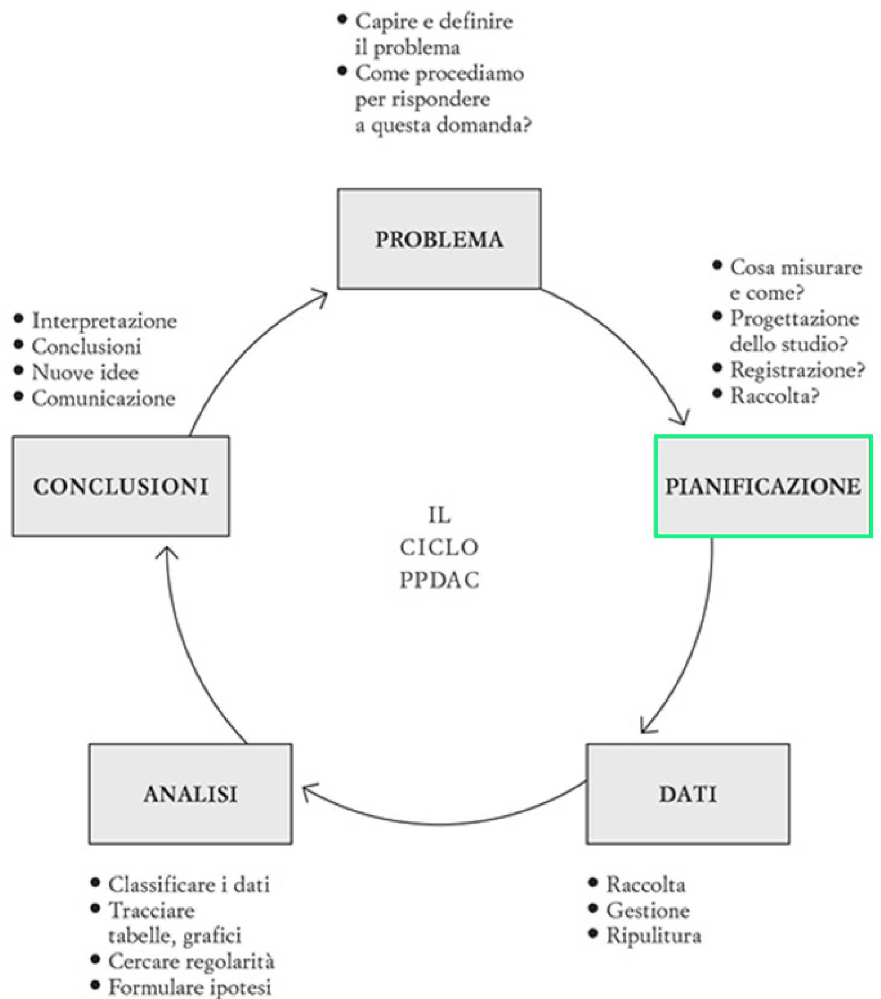
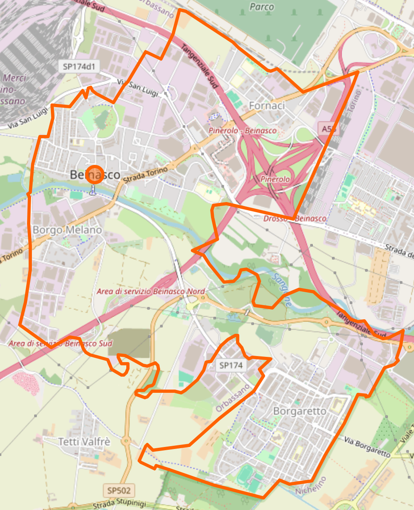
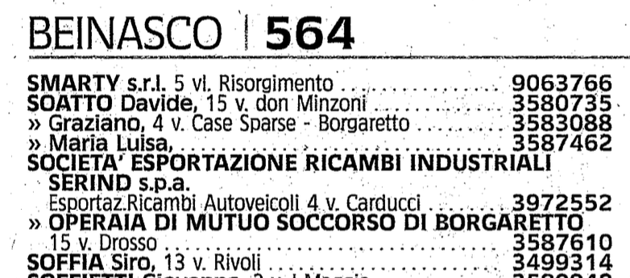

<!-- ### Lezione 2 -->
# Popolazione e Campione
## &nbsp;

---
## Obiettivi di apprendimento

<!-- 
 -->

- Definire correttamente popolazione e campione
- Conoscere le maggiori strategie di campionamento
- Individuare distorsioni sistematiche (o *bias*) nei campioni

<!-- 
 -->

---
## Le fasi della ricerca

Spiegelhalter, D., *The Art of Statistics: Learning From Data*, Pelican, 2019 (Edizione Italiana: Einaudi, 2020)

<!-- PLANNING, DISEGNO SPERIMENTALE

È una procedura per la pianificazione di un esperimento scientifico, prodotto prima dell'esecuzione dell'esperimento stesso, che cerca di garantire che i dati raccolti e le analisi condotte possano essere analizzati per fornire conclusioni valide e oggettive, e in cui il ricercatore decide come rispondere alla domanda di ricerca. 

- verificare se esiste una collezione di dati di alta qualità che puòessere riutilizzata
- decidere e giustificare perché sia necessario raccogliere nuove collezioni di dati, e quali dati siano necessari e come debbano essere raccolti (via questionario, analisi strumentali, ,,,)
- decidere e giustificare da quale \gls{population} i dati verranno raccolti, tenendo anche in considerazione considerazione etiche e logistiche (per esempio, questionari che richiedano un tempo troppo lungo per essere completati),
- decidere e giustificare quando e dove la raccolta dati debba iniziare e finire
- decidere e giustificare i metodi analitici che verranno utilizzati, e 
- definire delle probabili risposte alla domanda di ricerca (\gls{hypothesis}) -->

--- 
## Popolazione *vs*  campione

<!-- Popolazione e' l'insieme di tutti gli individui per cui vogliamo studiare un fenomeno, e.g., popolazione italiana
La popolazione è, teoricamente, infinita
Se non è infinita è spesso difficile da raggiungere tutta (tempi e costi)

Il modo tradizionale per studiare una popolazione e' il censimento, che pero' ha diversi svantaggi, tra cui il costo,
Dobbiamo quindi scegliere un sottoinsieme della popolazione che possiamo raggiungere

Avveniva ogni 10 anni, ultimo nel 2011 -> dal 2018 permanent census, sotto gruppo della popolazione, quindi quello che chiamiamo un campione statistico 

Altro svantaggio , e b) non e' possibile raccogliere tutte le informazioni possiboli e immaginabili (trauma cranico al nido)
-->

---
## Popolazione *vs*  campione (nella  clinica)

<!-- Nella ricerca clinica, la popolazione e' l'insieme di tutti i pazienti che ci interessano

Campione sono quelli che siamo andati a reclutare. 

E’ però necessario sceglierlo “bene” affinché le informazioni che otteniamo sul nostro campione siano poi trasferibili alla popolazione di partenza (inferenza)m quindi con procedimenti e regole che garantiscano la capacità del campione di rappresentare la popolazione
-->

---
### Esercizio #1

Sikich, L. *et al.*, *Intranasal Oxytocin in Children and Adolescents with Autism Spectrum Disorder*, NEJM, 2021

:question: &nbsp;&nbsp;&nbsp; Qual &egrave; la popolazione di studio?

&nbsp;&nbsp;&nbsp;&nbsp;&nbsp;&nbsp;&nbsp;&nbsp; a) Bambini e adolescenti inglesi tra 3-17  
&nbsp;&nbsp;&nbsp;&nbsp;&nbsp;&nbsp;&nbsp;&nbsp;&nbsp;&nbsp;&nbsp;&nbsp; anni con autismo
&nbsp;&nbsp;&nbsp;&nbsp;&nbsp;&nbsp;&nbsp;&nbsp; b) Bambini e adolescenti inglesi
&nbsp;&nbsp;&nbsp;&nbsp;&nbsp;&nbsp;&nbsp;&nbsp; c) Bambini e adolescenti con autismo
&nbsp;&nbsp;&nbsp;&nbsp;&nbsp;&nbsp;&nbsp;&nbsp; d) Bambini e adolescenti che non 
&nbsp;&nbsp;&nbsp;&nbsp;&nbsp;&nbsp;&nbsp;&nbsp;&nbsp;&nbsp;&nbsp;&nbsp; presentano sintomi di autismo

<button id="countdown_exercise_1"></button>

---
### Esercizio #1 -- Soluzione

Sikich, L. *et al.*, *Intranasal Oxytocin in Children and Adolescents with Autism Spectrum Disorder*, NEJM, 2021

:question: &nbsp;&nbsp;&nbsp; Qual &egrave; la popolazione di studio?

&nbsp;&nbsp;&nbsp;&nbsp;&nbsp;&nbsp;&nbsp;&nbsp; a) Bambini e adolescenti inglesi tra 3-17  
&nbsp;&nbsp;&nbsp;&nbsp;&nbsp;&nbsp;&nbsp;&nbsp;&nbsp;&nbsp;&nbsp;&nbsp; anni con autismo
&nbsp;&nbsp;&nbsp;&nbsp;&nbsp;&nbsp;&nbsp;&nbsp; b) Bambini e adolescenti inglesi
&nbsp;&nbsp;&nbsp;&nbsp;&nbsp;&nbsp;&nbsp;&nbsp; c) Bambini e adolescenti con autismo :white_check_mark:
&nbsp;&nbsp;&nbsp;&nbsp;&nbsp;&nbsp;&nbsp;&nbsp; d) Bambini e adolescenti che non 
&nbsp;&nbsp;&nbsp;&nbsp;&nbsp;&nbsp;&nbsp;&nbsp;&nbsp;&nbsp;&nbsp;&nbsp; presentano sintomi di autismo

---
### Esercizio #2

Sikich, L. *et al.*, *Intranasal Oxytocin in Children and Adolescents with Autism Spectrum Disorder*, NEJM, 2021

:question: &nbsp;&nbsp;&nbsp; Qual &egrave; il campione selezionato?

&nbsp;&nbsp;&nbsp;&nbsp;&nbsp;&nbsp;&nbsp;&nbsp; a) Bambini e adolescenti inglesi tra 3-17  
&nbsp;&nbsp;&nbsp;&nbsp;&nbsp;&nbsp;&nbsp;&nbsp;&nbsp;&nbsp;&nbsp;&nbsp; anni con autismo
&nbsp;&nbsp;&nbsp;&nbsp;&nbsp;&nbsp;&nbsp;&nbsp; b) Bambini e adolescenti inglesi
&nbsp;&nbsp;&nbsp;&nbsp;&nbsp;&nbsp;&nbsp;&nbsp; c) Bambini e adolescenti con autismo 
&nbsp;&nbsp;&nbsp;&nbsp;&nbsp;&nbsp;&nbsp;&nbsp; d) Bambini e adolescenti che non 
&nbsp;&nbsp;&nbsp;&nbsp;&nbsp;&nbsp;&nbsp;&nbsp;&nbsp;&nbsp;&nbsp;&nbsp; presentano sintomi di autismo

<button id="countdown_exercise_2"></button>

---
### Esercizio #2 -- Soluzione

Sikich, L. *et al.*, *Intranasal Oxytocin in Children and Adolescents with Autism Spectrum Disorder*, NEJM, 2021

:question: &nbsp;&nbsp;&nbsp; Qual &egrave; il campione selezionato?

&nbsp;&nbsp;&nbsp;&nbsp;&nbsp;&nbsp;&nbsp;&nbsp; a) Bambini e adolescenti inglesi tra 3-17  
&nbsp;&nbsp;&nbsp;&nbsp;&nbsp;&nbsp;&nbsp;&nbsp;&nbsp;&nbsp;&nbsp;&nbsp; anni con autismo &nbsp; :white_check_mark:
&nbsp;&nbsp;&nbsp;&nbsp;&nbsp;&nbsp;&nbsp;&nbsp; b) Bambini e adolescenti inglesi
&nbsp;&nbsp;&nbsp;&nbsp;&nbsp;&nbsp;&nbsp;&nbsp; c) Bambini e adolescenti con autismo
&nbsp;&nbsp;&nbsp;&nbsp;&nbsp;&nbsp;&nbsp;&nbsp; d) Bambini e adolescenti che non 
&nbsp;&nbsp;&nbsp;&nbsp;&nbsp;&nbsp;&nbsp;&nbsp;&nbsp;&nbsp;&nbsp;&nbsp; presentano sintomi di autismo

---
### Esercizio #3

Sikich, L. *et al.*, *Intranasal Oxytocin in Children and Adolescents with Autism Spectrum Disorder*, NEJM, 2021

:question: &nbsp;&nbsp;&nbsp; Qual &egrave; la numerosit&agrave; del campione?

&nbsp;&nbsp;&nbsp;&nbsp;&nbsp;&nbsp;&nbsp;&nbsp; a) 277
&nbsp;&nbsp;&nbsp;&nbsp;&nbsp;&nbsp;&nbsp;&nbsp; b) 139
&nbsp;&nbsp;&nbsp;&nbsp;&nbsp;&nbsp;&nbsp;&nbsp; c) 138
&nbsp;&nbsp;&nbsp;&nbsp;&nbsp;&nbsp;&nbsp;&nbsp; d) non &egrave; possibile dirlo  

<button id="countdown_exercise_3"></button>

---
### Esercizio #3 -- Soluzione 

Sikich, L. *et al.*, *Intranasal Oxytocin in Children and Adolescents with Autism Spectrum Disorder*, NEJM, 2021

:question: &nbsp;&nbsp;&nbsp; Qual &egrave; la numerosit&agrave; del campione?

&nbsp;&nbsp;&nbsp;&nbsp;&nbsp;&nbsp;&nbsp;&nbsp; a) 277 &nbsp;&nbsp; :white_check_mark: 
&nbsp;&nbsp;&nbsp;&nbsp;&nbsp;&nbsp;&nbsp;&nbsp; b) 139
&nbsp;&nbsp;&nbsp;&nbsp;&nbsp;&nbsp;&nbsp;&nbsp; c) 138
&nbsp;&nbsp;&nbsp;&nbsp;&nbsp;&nbsp;&nbsp;&nbsp; d) non &egrave; possibile dirlo  

<!-- The trial was conducted from August 2014 through June 2017. Of the 355 children and adolescents who underwent screening, 290 met the eligibility criteria, were randomly assigned to a trial group, received at least one dose of oxytocin or placebo, and were included in the safety analyses. The efficacy analyses excluded 11 participants who had no ABC-mSW assessments after randomization and 2 who did not have a baseline ABC-mSW score, which yielded 277 participants for the modified intention-to-treat analysis. -->

---
## Strategie di campionamento

:dart: &nbsp;&nbsp;&nbsp; Un **campione di convenienza** &egrave; un campione estratto da una
&nbsp;&nbsp;&nbsp;&nbsp;&nbsp;&nbsp;&nbsp;&nbsp;  parte della popolazione facilmente accessibile che potrebbe 
&nbsp;&nbsp;&nbsp;&nbsp;&nbsp;&nbsp;&nbsp;&nbsp; per&ograve;  non rappresentarla adeguatamente

* Esempio: tutti i pazienti che si presentano in uno specifico ambulatorio, in uno specifico ospedale, in un dato periodo di tempo

<!-- Iniziamo con il distinguere il campionamento probabilistico da quello non probabilistico.

Nel campionamento non-probabilistico, o opportunistico, la selezione del campione avviene in base a criteri di comodo o di praticità, per esempio perché certi individui sono più facilmente contattabili, o per ragioni di costo 

Ricordiamoci che importante e' che sia randomizzato rispetto alla variabile di interesse. Se ci interessa come rispondono, per esempio nel caso del delirio, magari il nostro campione va bene -- sarebbe proprio sfortuna se in quell'intervallo di tempo mi capitassero solo un tipo specifico di pazienti, per esempio molto giovani o con malattie mentali pregresse.

Chiedere le intenzioni di voto alle prime 10 pagine di utenti con il numero di telefono non e' ottimale (persone con lo stesso cognome tendono ad avere le stesse idee politiche), ma accettabile. Farlo ad una protesta contro l'immigrazione invece no! 

-->

---
## Strategie di campionamento

:dart: &nbsp;&nbsp;&nbsp; In un **campionamento probabilistico** tutti i soggetti della  
&nbsp;&nbsp;&nbsp;&nbsp;&nbsp;&nbsp;&nbsp;&nbsp; popolazione hanno la stessa probabilit&agrave; di venire inclusi 
&nbsp;&nbsp;&nbsp;&nbsp;&nbsp;&nbsp;&nbsp;&nbsp; nel campione

* Esempio: un sottoinsieme estratto casualmente dall’elenco dei pazienti affetti dalla malattia

<!-- Nel campionamento probabilistico ogni unità della popolazione in studio ha una probabilità NOTA di essere estratta (non distorto o viziato) 

 Necessaria la lista (base di campionamento) esaustiva di tutta la popolazione
 Estrazione dei soggetti tramite sorteggio (tavole numeri casuali, computer)\

Nel campionamento casuale semplice tutte le unità della popolazione hanno la stessa probabilità di essere estratte:

data una popolazione di N individui ed un campione di dimensione n  la probabilità che l’i-esimo individuo entri nel campione è “n/N” 

-->

---
### Strategia #1: Campionamento casuale semplice

:pushpin: &nbsp;&nbsp;&nbsp;  $N=90$
&nbsp;&nbsp;&nbsp;&nbsp;&nbsp;&nbsp;&nbsp;&nbsp; $n=10$ 

 

<!-- Disporre di un elenco completo di tutti i soggetti della popolazione e una loro numerazione

n piccolo e' la nostra numerosita' campionaria

Decidere quante unità si vogliono selezionare e calcolare la frazione di campionamento -->

---
### Strategia #1: Campionamento casuale semplice

:pushpin: &nbsp;&nbsp;&nbsp;  $N=90$
&nbsp;&nbsp;&nbsp;&nbsp;&nbsp;&nbsp;&nbsp;&nbsp; $n=10$ 

&nbsp;&nbsp;&nbsp;&nbsp;&nbsp;&nbsp;&nbsp;&nbsp; $49, 65, 25, 74, 18$
&nbsp;&nbsp;&nbsp;&nbsp;&nbsp;&nbsp;&nbsp;&nbsp; $90, 47, 24, 71, 37$

<!--  Estrarre le unità tramite sorteggio casuale o tavole dei numeri casuali (costruite in modo da non avere vizi sistematici. Sono delle serie di numeri tra 0 e 9 disposti a caso e caratterizzati dall’avere una distribuzione uniforme) -->

---
### Strategia #2: Campionamento stratificato

:dart: &nbsp;&nbsp;&nbsp; La popolazione &egrave; divisa in gruppi omogenei (strata) assicurandosi
&nbsp;&nbsp;&nbsp;&nbsp;&nbsp;&nbsp;&nbsp;&nbsp;  che siano tutti adeguatamente rappresentati.

&nbsp;&nbsp;&nbsp;&nbsp;&nbsp;&nbsp;&nbsp;&nbsp; Una variazione prevede che il numero di elementi estratti da ciascun
&nbsp;&nbsp;&nbsp;&nbsp;&nbsp;&nbsp;&nbsp;&nbsp; gruppo sia proporzionale alla frequenza di quel gruppo

<!-- a simple random sample is taken from a number of distinct subgroups, or strata, of the population in order to ensure that they are all adequately represented. If different sampling fractions are used in the different strata, simple summary statistics will not be representative of the whole popu- 
lation. -->

---
### Strategia #2: Campionamento stratificato

:pushpin: &nbsp;&nbsp;&nbsp;  $N=90$
&nbsp;&nbsp;&nbsp;&nbsp;&nbsp;&nbsp;&nbsp;&nbsp; $N_{female}=60$
&nbsp;&nbsp;&nbsp;&nbsp;&nbsp;&nbsp;&nbsp;&nbsp; $N_{male}=30$

&nbsp;&nbsp;&nbsp;&nbsp;&nbsp;&nbsp;&nbsp;&nbsp; $n=9$ 
&nbsp;&nbsp;&nbsp;&nbsp;&nbsp;&nbsp;&nbsp;&nbsp; $n_{female} = 6$
&nbsp;&nbsp;&nbsp;&nbsp;&nbsp;&nbsp;&nbsp;&nbsp; $n_{male} = 3$

&nbsp;&nbsp;&nbsp;&nbsp;&nbsp;&nbsp;&nbsp;&nbsp; $Females: 46, 20, 26,$
&nbsp;&nbsp;&nbsp;&nbsp;&nbsp;&nbsp;&nbsp;&nbsp;&nbsp;&nbsp;&nbsp;&nbsp;&nbsp;&nbsp;&nbsp;&nbsp;&nbsp;&nbsp;&nbsp;&nbsp;&nbsp;&nbsp;&nbsp;&nbsp;&nbsp; $50, 47,  3$
&nbsp;&nbsp;&nbsp;&nbsp;&nbsp;&nbsp;&nbsp;&nbsp;&nbsp;&nbsp;&nbsp;&nbsp; $Males: 69, 85, 87$

<!-- Esempi di strata : sesso, eta', condizione sociale -->

---
### Strategia #3: Campionamento a grappolo 

:dart: &nbsp;&nbsp;&nbsp; La popolazione &egrave; divisa in gruppi gerarchici (cluster) da cui 
&nbsp;&nbsp;&nbsp;&nbsp;&nbsp;&nbsp;&nbsp;&nbsp; viene poi estratto il campione (si estrae il gruppo e non il 
&nbsp;&nbsp;&nbsp;&nbsp;&nbsp;&nbsp;&nbsp;&nbsp; singolo elemento).
 
&nbsp;&nbsp;&nbsp;&nbsp;&nbsp;&nbsp;&nbsp;&nbsp; - A uno stadio&nbsp;: osservo tutti gli elementi nel cluster
&nbsp;&nbsp;&nbsp;&nbsp;&nbsp;&nbsp;&nbsp;&nbsp; - A due stadi&nbsp;&nbsp;&nbsp;: campiono tra gli elementi del cluster

<!-- Le unità della popolazione sono suddivise in CLUSTER o GRAPPOLI in base a circostanze organizzative, strutturali, geografiche.
All’interno dei cluster le unità possono essere molto diverse tra di loro.

Il campione si forma estraendo casualmente un numero prestabilito di cluster, dopodichè si possono includere tutte le unità che appartengono al cluster (1 stadio) o solo una parte (2 stadi, usano campionamento semplice o stratificato)
 -->

---
### Strategia #3: Campionamento a grappolo 

--- 
## Campionamento nel mondo reale

https://hbsc.org

<!--  Health beavious in school aged children 
Studio internazionale che si tiene ogni 4 anni e che raccoglie informazioni sui ragazzi di 11, 13, 15 e, recentemente anche 17 anni (che sono la mia popolazione) 
Ma non li raccoglie tutti, ne raccoglie un campione.

Innanzitutto li devo dividere per regioni (stratificato), poi vado a identifcare le scuole (cluster)
All'interno delle scuole vado a fare un ulteriore strato per grado/eta' e poi prpcedo con un sistematic sampling all'interno di ciascuno strato per identiicare le classi (di cui scelgo TUTTI gli studenti della classe)

Countries may choose to stratify their samples to ensure representation by, for example, geographic location,
ethnic group or school type.
-->

---
### Esercizio #4

:question: &nbsp;&nbsp;&nbsp; Un rappresentante sta conducendo un sondaggio sul gradimento di 
&nbsp;&nbsp;&nbsp;&nbsp;&nbsp;&nbsp;&nbsp;&nbsp; un nuovo prodotto intervistando un cliente ogni cinque che entra 
&nbsp;&nbsp;&nbsp;&nbsp;&nbsp;&nbsp;&nbsp;&nbsp; all'ipermercato vicino alla ditta per la quale lavora

&nbsp;&nbsp;&nbsp;&nbsp;&nbsp;&nbsp;&nbsp;&nbsp; Che strategia di campionamento sta usando??

&nbsp;&nbsp;&nbsp;&nbsp;&nbsp;&nbsp;&nbsp;&nbsp; a) Casuale semplice
&nbsp;&nbsp;&nbsp;&nbsp;&nbsp;&nbsp;&nbsp;&nbsp; b) Sistematico
&nbsp;&nbsp;&nbsp;&nbsp;&nbsp;&nbsp;&nbsp;&nbsp; c) Stratificato
&nbsp;&nbsp;&nbsp;&nbsp;&nbsp;&nbsp;&nbsp;&nbsp; d) Di convenienza

<button id="countdown_exercise_4"></button>

---
### Esercizio #4 -- Soluzione

:question: &nbsp;&nbsp;&nbsp; Un rappresentante sta conducendo un sondaggio sul gradimento di 
&nbsp;&nbsp;&nbsp;&nbsp;&nbsp;&nbsp;&nbsp;&nbsp; un nuovo prodotto intervistando un cliente ogni cinque che entra 
&nbsp;&nbsp;&nbsp;&nbsp;&nbsp;&nbsp;&nbsp;&nbsp; all'ipermercato vicino alla ditta per la quale lavora

&nbsp;&nbsp;&nbsp;&nbsp;&nbsp;&nbsp;&nbsp;&nbsp; Che strategia di campionamento sta usando??

&nbsp;&nbsp;&nbsp;&nbsp;&nbsp;&nbsp;&nbsp;&nbsp; a) Casuale semplice
&nbsp;&nbsp;&nbsp;&nbsp;&nbsp;&nbsp;&nbsp;&nbsp; b) Sistematico
&nbsp;&nbsp;&nbsp;&nbsp;&nbsp;&nbsp;&nbsp;&nbsp; c) Stratificato
&nbsp;&nbsp;&nbsp;&nbsp;&nbsp;&nbsp;&nbsp;&nbsp; d) Di convenienza &nbsp; :white_check_mark:

---
### Esercizio #5

:question: &nbsp;&nbsp;&nbsp; Quale tra i seguenti esempi si può definire campione di convenienza  
&nbsp;&nbsp;&nbsp;&nbsp;&nbsp;&nbsp;&nbsp;&nbsp; per un'indagine sierologica sul COVID-19 nella popolazione italiana?

&nbsp;&nbsp;&nbsp;&nbsp;&nbsp;&nbsp;&nbsp;&nbsp; a) Un campione scelto in maniera casuale dalla popolazione
&nbsp;&nbsp;&nbsp;&nbsp;&nbsp;&nbsp;&nbsp;&nbsp; b) Il campione selezionato per l’indagine sierologica COVID-19
&nbsp;&nbsp;&nbsp;&nbsp;&nbsp;&nbsp;&nbsp;&nbsp;&nbsp;&nbsp;&nbsp;&nbsp; avviata dal Ministero della Salute (campione composto da 
&nbsp;&nbsp;&nbsp;&nbsp;&nbsp;&nbsp;&nbsp;&nbsp;&nbsp;&nbsp;&nbsp;&nbsp; 150.000 persone residenti in 2000 Comuni)
&nbsp;&nbsp;&nbsp;&nbsp;&nbsp;&nbsp;&nbsp;&nbsp; c) Un campione selezionato tra  gli studenti di UniTO
&nbsp;&nbsp;&nbsp;&nbsp;&nbsp;&nbsp;&nbsp;&nbsp; d) Nessuno dei precedenti 

<button id="countdown_exercise_5"></button>

---
### Esercizio #5 -- Soluzione

:question: &nbsp;&nbsp;&nbsp; Quale tra i seguenti esempi si può definire campione di convenienza  
&nbsp;&nbsp;&nbsp;&nbsp;&nbsp;&nbsp;&nbsp;&nbsp; per un'indagine sierologica sul COVID-19 nella popolazione italiana?

&nbsp;&nbsp;&nbsp;&nbsp;&nbsp;&nbsp;&nbsp;&nbsp; a) Un campione scelto in maniera casuale dalla popolazione
&nbsp;&nbsp;&nbsp;&nbsp;&nbsp;&nbsp;&nbsp;&nbsp; b) Il campione selezionato per l’indagine sierologica COVID-19
&nbsp;&nbsp;&nbsp;&nbsp;&nbsp;&nbsp;&nbsp;&nbsp;&nbsp;&nbsp;&nbsp;&nbsp; avviata dal Ministero della Salute (campione composto da 
&nbsp;&nbsp;&nbsp;&nbsp;&nbsp;&nbsp;&nbsp;&nbsp;&nbsp;&nbsp;&nbsp;&nbsp; 150.000 persone residenti in 2000 Comuni)
&nbsp;&nbsp;&nbsp;&nbsp;&nbsp;&nbsp;&nbsp;&nbsp; c) Un campione selezionato tra gli studenti di UniTO :white_check_mark: 
&nbsp;&nbsp;&nbsp;&nbsp;&nbsp;&nbsp;&nbsp;&nbsp; d) Nessuno dei precedenti 

---
## E se il campione non &egrave; rappresentativo?

<!--  -->

- Le conclusioni **non** possono generalizzate

<!-- Per anni il manichino e' stato solo male, nonostante le donne comprino il 62% delle auto in nord-america e il "female" dummy e' un downsize del male e provato solo nel sedile del passeggero 

Le donne soffrono maggiori colpi di frusta

primo test con vero manichino donna nel 2023

consider a vaccine trial carried out using student volunteers. If it is reasonable to assume that in their response to the vaccine and exposure to disease students are typical of the community at large, the results will have general applicability. If, on the other hand, students differ in any respect which may materially affect their response to the vaccine or exposure to disease, the conclusions from the trial are restricted to the population of students and do not have general applicability. Deciding whether or not ‘students are typical’ is not a statistical issue, but depends on an informed judgement taking into account relevant biological and epidemiological knowledge.
-->

Caroline Criado-Perez, *Invisible Women: Exposing Data Bias in a World Designed for Men*, Ballantine Books, 2019

---
## In pratica: dalla popolazione...

<!-- Supponiamo che tu debba valutare il gradimento di un centro di salute mentale che ha aperto, in via sperimentale, lo scorso anno a Beinasco. 

Beinasco ha una \textbf{popolazione} di circa 18,000 abitanti e hai accesso ad un estratto dell'elenco telefonico
 -->
---
## ... attraverso la finestra di campionamento 

<!-- e l'elenco di tutti gli individui in una popolazione da cui si scelgono soggetti che faranno parte del campione 

Come facciamo a scegliere chi estrarre?

-->

---
## ... al campione

---
## Abbiamo finito?

- chi non &egrave; eleggibile?

<!-- An ineligible sampling unit is an individual or entity selected through a sampling process but does not meet the specific eligibility criteria for the survey or study. These units are identified during data collection, often through a screening process, and are then removed from the sample so they do not skew results. Reasons for ineligibility include being outside a geographic boundary, failing to meet demographic requirements (e.g., age), or being a business when the survey targets individuals -->

---
## Abbiamo finito?

- chi non &egrave; eleggibile?
- chi non risponde?

---
## Abbiamo finito?

- chi non &egrave; eleggibile?
- chi non risponde?

---
## Bias nella selezione del campione

- **Non-response bias**

<!-- Faccio domande molto personali (uso di cannabis) 

Surveys asking for personal, legal, or other sensitive information are prone to non-response bias, simply because there is some information respondents don’t feel comfortable disclosing.
-->

---
## Bias nella selezione del campione

- **Survivor bias**

<!-- Anche se facciamo attenzione i nostri sample possono avere delle distorsioni

- voglio andare a vedere dove gli aerei da guerra vengono colpiti per rinforzarli
e l’errore logico che si commette quando si prendano in considerazione solo gli elementi che hanno superato un determinato pro- cesso di selezione, trascurando i restanti; tipicamente ci`o avviene poich ́e i primi sono fisicamente disponibili/visibili e i secondi no. -->

---
## Bias nella selezione del campione

- **Survivor bias**

&nbsp;&nbsp;&nbsp;&nbsp;&nbsp;&nbsp;&nbsp;&nbsp; *"Una volta gli edifici erano pi&ugrave; belli/resistenti"*

<!-- Just as new buildings are being built every day and older structures are constantly torn down, the story of most civil and urban architecture involves a process of constant renewal, renovation, and revolution. Only the most beautiful, useful, and structurally sound buildings survive from one generation to the next. This creates a selection effect where the ugliest and weakest buildings of history have been eradicated (disappearing from public view, leaving the visible impression that all earlier buildings were more beautiful and better built).
-->

---
## Bias nella selezione del campione

- **Survivor bias**

&nbsp;&nbsp;&nbsp;&nbsp;&nbsp;&nbsp;&nbsp;&nbsp; *"Una volta gli edifici erano pi&ugrave; belli/resistenti"*

&nbsp;&nbsp;&nbsp;&nbsp;&nbsp;&nbsp;&nbsp;&nbsp; *"Non capisco perch&eacute; oggigiorno bisogni fare X, io non l'ho mai  
&nbsp;&nbsp;&nbsp;&nbsp;&nbsp;&nbsp;&nbsp;&nbsp; fatto eppure sono ancora qui"*

<!-- 

X indossare una cintura di sicurezza, mettere le sicurezze sul lavoro... when helmets became standard gear, the amount of people being treated for head wounds skyrocketed. But thats because they would have been killed without the helmet. 
-->

---
## Bias nella selezione del campione

- **Volunteer bias**

<!-- - occorre quando i volontari hanno caratteristiche diverse rispet- to alla Popolazione che si vuole studiare.  volontari alsop SES e soprattuto donne
- occorre quando uno o piu` soggetti di uno studio di- ventano irreperibili durante lo studio stesso sto testando un nuovo farmaco, le persone che hanno i side effect peggiori possono interromperlo, o quelli per cui non funziona possono morire -->

---
## Bias nella selezione del campione

- **Volunteer bias**

&nbsp;&nbsp;&nbsp;&nbsp;&nbsp;&nbsp;&nbsp;&nbsp; Un insegnante si chiede se delle esercitazioni possano  migliorare il 
&nbsp;&nbsp;&nbsp;&nbsp;&nbsp;&nbsp;&nbsp;&nbsp; agli esami. Organizza quindi delle lezioni aggiuntive e invita gli  
&nbsp;&nbsp;&nbsp;&nbsp;&nbsp;&nbsp;&nbsp;&nbsp; studenti interessati a iscriversi. 

<!-- Self-selection bias is likely because students who are more serious about school are more likely to sign up 

Potrei dividervi lato destro dell'aula fa esercitazione e sinistro no e poi confronto i risultati dell'esame per vedere se quelli a destra hanno un voto piu' alto -- qui siamo nella statistica inferenziale!
 -->

---
## Bias nella selezione del campione

- **Lost to follow up bias**

&nbsp;&nbsp;&nbsp;&nbsp;&nbsp;&nbsp;&nbsp;&nbsp; Una ditta sta valutando l'efficacia di un nuovo farmaco su una corte di 100 
&nbsp;&nbsp;&nbsp;&nbsp;&nbsp;&nbsp;&nbsp;&nbsp; pazienti oncologici reclutati in un certo di eccellenza. Trenta pazienti non si 
&nbsp;&nbsp;&nbsp;&nbsp;&nbsp;&nbsp;&nbsp;&nbsp; presentano alla visita di controllo.  
&nbsp;&nbsp;&nbsp;&nbsp;&nbsp;&nbsp;&nbsp;&nbsp; Cosa possiamo concludere se vi dico   che queste 30 persone...

---
## Bias nella selezione del campione

- **Lost to follow up bias**

&nbsp;&nbsp;&nbsp;&nbsp;&nbsp;&nbsp;&nbsp;&nbsp; Una ditta sta valutando l'efficacia di un nuovo farmaco su una corte di 100 
&nbsp;&nbsp;&nbsp;&nbsp;&nbsp;&nbsp;&nbsp;&nbsp; pazienti oncologici reclutati in un certo di eccellenza. Trenta pazienti non si 
&nbsp;&nbsp;&nbsp;&nbsp;&nbsp;&nbsp;&nbsp;&nbsp; presentano alla visita di controllo.  
&nbsp;&nbsp;&nbsp;&nbsp;&nbsp;&nbsp;&nbsp;&nbsp; Cosa possiamo concludere se vi dico   che queste 30 persone...
&nbsp;&nbsp;&nbsp;&nbsp;&nbsp;&nbsp;&nbsp;&nbsp;&nbsp;&nbsp;&nbsp;&nbsp; - sono morte?

---
## Bias nella selezione del campione

- **Lost to follow up bias**

&nbsp;&nbsp;&nbsp;&nbsp;&nbsp;&nbsp;&nbsp;&nbsp; Una ditta sta valutando l'efficacia di un nuovo farmaco su una corte di 100 
&nbsp;&nbsp;&nbsp;&nbsp;&nbsp;&nbsp;&nbsp;&nbsp; pazienti oncologici reclutati in un certo di eccellenza. Trenta pazienti non si 
&nbsp;&nbsp;&nbsp;&nbsp;&nbsp;&nbsp;&nbsp;&nbsp; presentano alla visita di controllo.  
&nbsp;&nbsp;&nbsp;&nbsp;&nbsp;&nbsp;&nbsp;&nbsp; Cosa possiamo concludere se vi dico   che queste 30 persone...
&nbsp;&nbsp;&nbsp;&nbsp;&nbsp;&nbsp;&nbsp;&nbsp;&nbsp;&nbsp;&nbsp;&nbsp; - sono morte?
&nbsp;&nbsp;&nbsp;&nbsp;&nbsp;&nbsp;&nbsp;&nbsp;&nbsp;&nbsp;&nbsp;&nbsp; - hanno smesso di prendere il farmaco?

---
## Bias nella selezione del campione

- **Lost to follow up bias**

&nbsp;&nbsp;&nbsp;&nbsp;&nbsp;&nbsp;&nbsp;&nbsp; Una ditta sta valutando l'efficacia di un nuovo farmaco su una corte di 100 
&nbsp;&nbsp;&nbsp;&nbsp;&nbsp;&nbsp;&nbsp;&nbsp; pazienti oncologici reclutati in un certo di eccellenza. Trenta pazienti non si 
&nbsp;&nbsp;&nbsp;&nbsp;&nbsp;&nbsp;&nbsp;&nbsp; presentano alla visita di controllo.  
&nbsp;&nbsp;&nbsp;&nbsp;&nbsp;&nbsp;&nbsp;&nbsp; Cosa possiamo concludere se vi dico   che queste 30 persone...
&nbsp;&nbsp;&nbsp;&nbsp;&nbsp;&nbsp;&nbsp;&nbsp;&nbsp;&nbsp;&nbsp;&nbsp; - sono morte?
&nbsp;&nbsp;&nbsp;&nbsp;&nbsp;&nbsp;&nbsp;&nbsp;&nbsp;&nbsp;&nbsp;&nbsp; - hanno smesso di prendere il farmaco?
&nbsp;&nbsp;&nbsp;&nbsp;&nbsp;&nbsp;&nbsp;&nbsp;&nbsp;&nbsp;&nbsp;&nbsp; -  sono ritornate alla loro citt&agrave; di origine?

---
## Campioni indipendenti & dipendenti

<!-- Sino ad ora abbiamo lavorato su Campioni indipendenti: non vi è relazione tra osservazioni appartenenti a campioni diversi

Per esempio 
- peso nei pazienti diabetici e nei sani
- lato sinistro e destro dell'aula nel test se le esercitazioni aiutano

Esistiono per&ograve; anche campioni appaiati, in cui dati di un campione sono associati con quelli dell’altro. Ad ogni osservazione nel primo gruppo corrisponde un’osservazione nel secondo

Per esempio
- peso nei pazienti diabetici alla diagnosi e dopo 10 anni 
- voto di esame prima e dopo le esercitazioni
-->

---
## Campioni indipendenti & dipendenti

<!-- I capioni appaiati possono anche essere essere persone diverse ma matchate per caratteristiche salienti (eta', sesso, peso corporeo, ...) 

Per esempio:
- accoppio una persona che ha preso 100 all'esame di maturità nel gruppo "esercitazioni" con una che a preso 100 nel gruppo "lezione normale"

o studio caso-controllo, è un tipo di studio retrospettivp in cui le persone con una malattia o che presentano un outcome di interesse (i casi) vengono appaiati e confrontati con una o più persone che non hanno la malattia o l'outcome di interesse (i controlli) allo scopo di individuare differenze tra esposizioni e/o fattori di rischio che potrebbero essere alla base della malattia/outcome.

 -->

---
### Cosa abbiamo imparato?

- La popolazione &egrave; l'insieme di tutti gli individui per cui vogliamo studiare un fenomeno ed &egrave;, teoricamente, infinita
- Il campione &egrave; un sotto insieme (rappresentativo?) della popolazione
- Pi&ugrave; un campione &egrave; rappresentativo della popolazione, pi&ugrave; le nostre conclusioni sono robuste
- Anche campioni rappresentativi (casuali) possono soffrire di bias
- Esistono diversi disegni sperimentali

