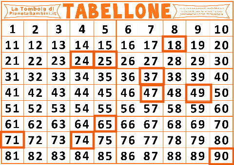

<!-- ### Lezione 2 -->
# Popolazione e Campione
## &nbsp;

---
## Obiettivi di apprendimento

<!-- 
 -->

- Definire correttamente popolazione e campione
- Conoscere le due maggiori strategie di campionamento
- Individuare distorsioni sistematiche (o *bias*) nei campioni

<!-- 
 -->

---
## Le fasi della ricerca

<!--  -->

Spiegelhalter, D., *The Art of Statistics: Learning From Data*, Pelican, 2019 (Edizione Italiana: Einaudi, 2020)

<!-- Nella parte di Planning, il ricercatore decide come rispondere alla domanda di ricerca. Solitamente ignorata, ma assoulutamente cruciale, GARBACE IN, GARBACE OUT. Questo include, 
 i) verificare se esiste una collezione di dati di alta qualit`a che pu`o essere usata, ii) decidere e giustificare perch ́e sia necessario raccogliere nuove collezioni di dati, e quali dati siano necessari e come debbano essere raccolti 
 iii) decidere e giustificare da qua- le Popolazione i dati verranno raccolti, tenendo anche in considerazione considerazione etiche e logistiche (per esempio, questionari che richiedano un tempo troppo lungo per essere completati), 
 iv) decidere e giustificare quando e dove la raccolta dati debba iniziare e finire, 
 v) decidere e giustifi- care i metodi analitici che verranno utilizzati, e 
 vi) definire delle probabili risposte alla domanda di ricerca (ipotesi) -->

--- 
## Popolazione *vs* campione

<!-- Popolazione e' l'insieme di tutti gli individui per cui vogliamo studiare un fenomeno, e.g., popolazione italiana
La popolazione è, teoricamente, infinita
Se non è infinita è spesso difficile da raggiungere tutta (tempi e costi)

Il modo tradizionale per studiare una popolazione e' il censimento, che pero' ha diversi svantaggi, tra cui il costo,
Dobbiamo quindi scegliere un sottoinsieme della popolazione che possiamo raggiungere

Avveniva ogni 10 anni, ultimo nel 2011 -> dal 2018 permanent census, sotto gruppo della popolazione, quindi quello che chiamiamo un campione statistico 

Altro svantaggio , e b) non e' possibile raccogliere tutte le informazioni possiboli e immaginabili (trauma cranico al nido)
-->

---
## Popolazione *vs* campione (nella  clinica)

<!-- Nella ricerca clinica, la popolazione e' l'insieme di tutti i pazienti che ci interessano

Campione sono quelli che siamo andati a reclutare. 

E’ però necessario sceglierlo “bene” affinché le informazioni che otteniamo sul nostro campione siano poi trasferibili alla popolazione di partenza (inferenza)m quindi con procedimenti e regole che garantiscano la capacità del campione di rappresentare la popolazione
-->

---
### Esercizio #1

Sikich, L. *et al.*, *Intranasal Oxytocin in Children and Adolescents with Autism Spectrum Disorder*, NEJM, 2021

:question: &nbsp;&nbsp;&nbsp; Qual &egrave; la popolazione di studio?

&nbsp;&nbsp;&nbsp;&nbsp;&nbsp;&nbsp;&nbsp;&nbsp; a) Bambini e adolescenti tra 3-17 anni 
&nbsp;&nbsp;&nbsp;&nbsp;&nbsp;&nbsp;&nbsp;&nbsp;&nbsp;&nbsp;&nbsp;&nbsp; con autismo
&nbsp;&nbsp;&nbsp;&nbsp;&nbsp;&nbsp;&nbsp;&nbsp; b) Bambini e adolescenti in Inghilterra
&nbsp;&nbsp;&nbsp;&nbsp;&nbsp;&nbsp;&nbsp;&nbsp; c) Bambini e adolescenti con autismo
&nbsp;&nbsp;&nbsp;&nbsp;&nbsp;&nbsp;&nbsp;&nbsp; d) Bambini e adolescenti che non 
&nbsp;&nbsp;&nbsp;&nbsp;&nbsp;&nbsp;&nbsp;&nbsp;&nbsp;&nbsp;&nbsp;&nbsp; presentano sintomi di autismo

---
### Esercizio #2

Sikich, L. *et al.*, *Intranasal Oxytocin in Children and Adolescents with Autism Spectrum Disorder*, NEJM, 2021

:question: &nbsp;&nbsp;&nbsp; Qual &egrave; il campione selezionato?

&nbsp;&nbsp;&nbsp;&nbsp;&nbsp;&nbsp;&nbsp;&nbsp; a) Bambini e adolescenti tra 3-17 anni 
&nbsp;&nbsp;&nbsp;&nbsp;&nbsp;&nbsp;&nbsp;&nbsp;&nbsp;&nbsp;&nbsp;&nbsp; con autismo
&nbsp;&nbsp;&nbsp;&nbsp;&nbsp;&nbsp;&nbsp;&nbsp; b) Bambini e adolescenti in Inghilterra
&nbsp;&nbsp;&nbsp;&nbsp;&nbsp;&nbsp;&nbsp;&nbsp; c) Bambini e adolescenti con autismo
&nbsp;&nbsp;&nbsp;&nbsp;&nbsp;&nbsp;&nbsp;&nbsp; d) Bambini e adolescenti che non 
&nbsp;&nbsp;&nbsp;&nbsp;&nbsp;&nbsp;&nbsp;&nbsp;&nbsp;&nbsp;&nbsp;&nbsp; presentano sintomi di autismo

---
### Esercizio #3

Sikich, L. *et al.*, *Intranasal Oxytocin in Children and Adolescents with Autism Spectrum Disorder*, NEJM, 2021

:question: &nbsp;&nbsp;&nbsp; Qual &egrave; la numerosit&agrave; del campione

&nbsp;&nbsp;&nbsp;&nbsp;&nbsp;&nbsp;&nbsp;&nbsp; a) 277
&nbsp;&nbsp;&nbsp;&nbsp;&nbsp;&nbsp;&nbsp;&nbsp; b) 139
&nbsp;&nbsp;&nbsp;&nbsp;&nbsp;&nbsp;&nbsp;&nbsp; c) 138
&nbsp;&nbsp;&nbsp;&nbsp;&nbsp;&nbsp;&nbsp;&nbsp; d) non &egrave; possibile dirlo  

---
## Strategie di campionamento

:dart: &nbsp;&nbsp;&nbsp; Un **campione di convenienza** &egrave; un campione estratto da una
&nbsp;&nbsp;&nbsp;&nbsp;&nbsp;&nbsp;&nbsp;&nbsp;  parte della popolazione facilmente accessibile che potrebbe 
&nbsp;&nbsp;&nbsp;&nbsp;&nbsp;&nbsp;&nbsp;&nbsp; per&ograve;  non rappresentarla adeguatamente

* Esempio: tutti i pazienti che si presentano in uno specifico ambulatorio, in uno specifico ospedale, in un dato periodo di tempo

<!-- Iniziamo con il distinguere il campionamento probabilistico da quello non probabilistico.

Nel campionamento non-probabilistico, o opportunistico, la selezione del campione avviene in base a criteri di comodo o di praticità, per esempio perché certi individui sono più facilmente contattabili, o per ragioni di costo 

Ricordiamoci che importante e' che sia randomizzato rispetto alla variabile di interesse. Se ci interessa come rispondono, per esempio nel caso del delirio, magari il nostro campione va bene -- sarebbe proprio sfortuna se in quell'intervallo di tempo mi capitassero solo un tipo specifico di pazienti, per esempio molto giovani o con malattie mentali pregresse.

Chiedere le intenzioni di voto alle prime 10 pagine di utenti con il numero di telefono non e' ottimale (persone con lo stesso cognome tendono ad avere le stesse idee politiche), ma accettabile. Farlo ad una protesta contro l'immigrazione invece no! 

-->

---
## Strategie di campionamento

:dart: &nbsp;&nbsp;&nbsp; Nel **campionamento casuale semplice** tutti i soggetti della  
&nbsp;&nbsp;&nbsp;&nbsp;&nbsp;&nbsp;&nbsp;&nbsp; popolazione hanno la stessa probabilit&agrave; di venire inclusi 
&nbsp;&nbsp;&nbsp;&nbsp;&nbsp;&nbsp;&nbsp;&nbsp; nel campione

* Esempio: un sottoinsieme estratto casualmente dall’elenco dei pazienti affetti dalla malattia

<!-- Nel campionamento probabilistico ogni unità della popolazione in studio ha una probabilità NOTA di essere estratta (non distorto o viziato) 

 Necessaria la lista (base di campionamento) esaustiva di tutta la popolazione
 Estrazione dei soggetti tramite sorteggio (tavole numeri casuali, computer)\

Nel campionamento casuale semplice tutte le unità della popolazione hanno la stessa probabilità di essere estratte:

data una popolazione di N individui ed un campione di dimensione n  la probabilità che l’i-esimo individuo entri nel campione è “n/N” 

-->

---
## Campionamento casuale semplice

:pushpin: &nbsp;&nbsp;&nbsp;  $N=90$
&nbsp;&nbsp;&nbsp;&nbsp;&nbsp;&nbsp;&nbsp;&nbsp; $n=10$ 

<!-- Disporre di un elenco completo di tutti i soggetti della popolazione e una loro numerazione

n piccolo e' la nostra numerosita' campionaria

Decidere quante unità si vogliono selezionare e calcolare la frazione di campionamento -->

---
## Campionamento casuale semplice

:pushpin: &nbsp;&nbsp;&nbsp;  $N=90$
&nbsp;&nbsp;&nbsp;&nbsp;&nbsp;&nbsp;&nbsp;&nbsp; $n=10$ 

&nbsp;&nbsp;&nbsp;&nbsp;&nbsp;&nbsp;&nbsp;&nbsp; $49, 65, 25, 74, 18$
&nbsp;&nbsp;&nbsp;&nbsp;&nbsp;&nbsp;&nbsp;&nbsp; $90, 47, 24, 71, 37$

<!--  Estrarre le unità tramite sorteggio casuale o tavole dei numeri casuali (costruite in modo da non avere vizi sistematici. Sono delle serie di numeri tra 0 e 9 disposti a caso e caratterizzati dall’avere una distribuzione uniforme) -->

---
### Esercizio #4

:question: &nbsp;&nbsp;&nbsp; In quale tipi di studio può capitare di selezionare un campione 
&nbsp;&nbsp;&nbsp;&nbsp;&nbsp;&nbsp;&nbsp;&nbsp; di convenienza?

&nbsp;&nbsp;&nbsp;&nbsp;&nbsp;&nbsp;&nbsp;&nbsp; a) Censimenti
&nbsp;&nbsp;&nbsp;&nbsp;&nbsp;&nbsp;&nbsp;&nbsp; b) Studi di popolazione
&nbsp;&nbsp;&nbsp;&nbsp;&nbsp;&nbsp;&nbsp;&nbsp; c) Studi clinici
&nbsp;&nbsp;&nbsp;&nbsp;&nbsp;&nbsp;&nbsp;&nbsp; d) Nessuno: durante uno studio, il campione è sempre 
&nbsp;&nbsp;&nbsp;&nbsp;&nbsp;&nbsp;&nbsp;&nbsp;&nbsp;&nbsp;&nbsp;&nbsp; casualmente selezionato dalla popolazione 

---
### Esercizio #5

:question: &nbsp;&nbsp;&nbsp; Quale tra i seguenti esempi si può definire campione di convenienza  
&nbsp;&nbsp;&nbsp;&nbsp;&nbsp;&nbsp;&nbsp;&nbsp; per un'indagine sierologica sul COVID-19 nella popolazione italiana?

&nbsp;&nbsp;&nbsp;&nbsp;&nbsp;&nbsp;&nbsp;&nbsp; a) Un campione scelto in maniera casuale dalla popolazione
&nbsp;&nbsp;&nbsp;&nbsp;&nbsp;&nbsp;&nbsp;&nbsp; b) Il campione selezionato per l’indagine sierologica COVID-19
&nbsp;&nbsp;&nbsp;&nbsp;&nbsp;&nbsp;&nbsp;&nbsp;&nbsp;&nbsp;&nbsp;&nbsp; avviata dal Ministero della Salute (campione composto da 
&nbsp;&nbsp;&nbsp;&nbsp;&nbsp;&nbsp;&nbsp;&nbsp;&nbsp;&nbsp;&nbsp;&nbsp; 150.000 persone residenti in 2000 Comuni)
&nbsp;&nbsp;&nbsp;&nbsp;&nbsp;&nbsp;&nbsp;&nbsp; c) Un campione selezionato tra  gli studenti di UniTO
&nbsp;&nbsp;&nbsp;&nbsp;&nbsp;&nbsp;&nbsp;&nbsp; d) Nessuno dei precedenti 

---
## Nella pratica: dalla popolazione...

---
## ... attraverso la finestra di campionamento 

---
## ... al campione

---
## Abbiamo finito?

- chi non &egrave; eleggibile?

<!-- An ineligible sampling unit is an individual or entity selected through a sampling process but does not meet the specific eligibility criteria for the survey or study. These units are identified during data collection, often through a screening process, and are then removed from the sample so they do not skew results. Reasons for ineligibility include being outside a geographic boundary, failing to meet demographic requirements (e.g., age), or being a business when the survey targets individuals -->

---
## Abbiamo finito?

- chi non &egrave; eleggibile?
- chi non risponde?

---
## Bias nella selezione del campione

- Survivor bias

<!-- Anche se facciamo attenzione i nostri sample possono avere delle distorsioni

- voglio andare a vedere dove gli aerei da guerra vengono colpiti per rinforzarli
e l’errore logico che si commette quando si prendano in considerazione solo gli elementi che hanno superato un determinato pro- cesso di selezione, trascurando i restanti; tipicamente ci`o avviene poich ́e i primi sono fisicamente disponibili/visibili e i secondi no. -->

---
## Bias nella selezione del campione

- Survivor bias

&nbsp;&nbsp;&nbsp;&nbsp;&nbsp;&nbsp;&nbsp;&nbsp; *"Una volta gli edifici erano pi&ugrave; belli/resistenti"*

<!-- Just as new buildings are being built every day and older structures are constantly torn down, the story of most civil and urban architecture involves a process of constant renewal, renovation, and revolution. Only the most beautiful, useful, and structurally sound buildings survive from one generation to the next. This creates a selection effect where the ugliest and weakest buildings of history have been eradicated (disappearing from public view, leaving the visible impression that all earlier buildings were more beautiful and better built).
-->

---
## Bias nella selezione del campione

- Survivor bias

&nbsp;&nbsp;&nbsp;&nbsp;&nbsp;&nbsp;&nbsp;&nbsp; *"Una volta gli edifici erano pi&ugrave; belli/resistenti"*

&nbsp;&nbsp;&nbsp;&nbsp;&nbsp;&nbsp;&nbsp;&nbsp; *"Non capisco perch&eacute; oggigiorno bisogni fare X, io non l'ho mai  
&nbsp;&nbsp;&nbsp;&nbsp;&nbsp;&nbsp;&nbsp;&nbsp; fatto eppure sono ancora qui"*

<!-- 

X indossare una cintura di sicurezza, mettere le sicurezze sul lavoro... when helmets became standard gear, the amount of people being treated for head wounds skyrocketed. But thats because they would have been killed without the helmet. 
-->

---
## Bias nella selezione del campione

- Survivor bias
- Volunteer bias

<!-- - occorre quando i volontari hanno caratteristiche diverse rispet- to alla Popolazione che si vuole studiare.  volontari alsop SES e soprattuto donne
- occorre quando uno o piu` soggetti di uno studio di- ventano irreperibili durante lo studio stesso sto testando un nuovo farmaco, le persone che hanno i side effect peggiori possono interromperlo, o quelli per cui non funziona possono morire -->

---
## Bias nella selezione del campione

- Survivor bias
- Volunteer bias

&nbsp;&nbsp;&nbsp;&nbsp;&nbsp;&nbsp;&nbsp;&nbsp; Un insegnante si chiede se delle esercitazioni possano  migliorare il 
&nbsp;&nbsp;&nbsp;&nbsp;&nbsp;&nbsp;&nbsp;&nbsp; agli esami. Organizza quindi delle lezioni aggiuntive e invita gli  
&nbsp;&nbsp;&nbsp;&nbsp;&nbsp;&nbsp;&nbsp;&nbsp; studenti interessati a iscriversi. 

<!-- Self-selection bias is likely because students who are more serious about school are more likely to sign up  -->

---
## Bias nella selezione del campione

- Survivor bias
- Volunteer bias
- Lost to follow up bias

---
## Bias nella selezione del campione

- Survivor bias
- Volunteer bias
- Lost to follow up bias

&nbsp;&nbsp;&nbsp;&nbsp;&nbsp;&nbsp;&nbsp;&nbsp; Una ditta sta valutando l'efficacia di un nuovo farmaco su una corte di 100 
&nbsp;&nbsp;&nbsp;&nbsp;&nbsp;&nbsp;&nbsp;&nbsp; pazienti oncologici reclutati in un certo di eccellenza. Trenta pazienti non si 
&nbsp;&nbsp;&nbsp;&nbsp;&nbsp;&nbsp;&nbsp;&nbsp; presentano alla visita di controllo.  
&nbsp;&nbsp;&nbsp;&nbsp;&nbsp;&nbsp;&nbsp;&nbsp; Cosa possiamo concludere se vi dico   che queste 30 persone...

---
## Bias nella selezione del campione

- Survivor bias
- Volunteer bias
- Lost to follow up bias

&nbsp;&nbsp;&nbsp;&nbsp;&nbsp;&nbsp;&nbsp;&nbsp; Una ditta sta valutando l'efficacia di un nuovo farmaco su una corte di 100 
&nbsp;&nbsp;&nbsp;&nbsp;&nbsp;&nbsp;&nbsp;&nbsp; pazienti oncologici reclutati in un certo di eccellenza. Trenta pazienti non si 
&nbsp;&nbsp;&nbsp;&nbsp;&nbsp;&nbsp;&nbsp;&nbsp; presentano alla visita di controllo.  
&nbsp;&nbsp;&nbsp;&nbsp;&nbsp;&nbsp;&nbsp;&nbsp; Cosa possiamo concludere se vi dico   che queste 30 persone...
&nbsp;&nbsp;&nbsp;&nbsp;&nbsp;&nbsp;&nbsp;&nbsp;&nbsp;&nbsp;&nbsp;&nbsp; - sono morte?

---
## Bias nella selezione del campione

- Survivor bias
- Volunteer bias
- Lost to follow up bias

&nbsp;&nbsp;&nbsp;&nbsp;&nbsp;&nbsp;&nbsp;&nbsp; Una ditta sta valutando l'efficacia di un nuovo farmaco su una corte di 100 
&nbsp;&nbsp;&nbsp;&nbsp;&nbsp;&nbsp;&nbsp;&nbsp; pazienti oncologici reclutati in un certo di eccellenza. Trenta pazienti non si 
&nbsp;&nbsp;&nbsp;&nbsp;&nbsp;&nbsp;&nbsp;&nbsp; presentano alla visita di controllo.  
&nbsp;&nbsp;&nbsp;&nbsp;&nbsp;&nbsp;&nbsp;&nbsp; Cosa possiamo concludere se vi dico   che queste 30 persone...
&nbsp;&nbsp;&nbsp;&nbsp;&nbsp;&nbsp;&nbsp;&nbsp;&nbsp;&nbsp;&nbsp;&nbsp; - sono morte?
&nbsp;&nbsp;&nbsp;&nbsp;&nbsp;&nbsp;&nbsp;&nbsp;&nbsp;&nbsp;&nbsp;&nbsp; - hanno smesso di prendere il farmaco?

---
## Bias nella selezione del campione

- Survivor bias
- Volunteer bias
- Lost to follow up bias

&nbsp;&nbsp;&nbsp;&nbsp;&nbsp;&nbsp;&nbsp;&nbsp; Una ditta sta valutando l'efficacia di un nuovo farmaco su una corte di 100 
&nbsp;&nbsp;&nbsp;&nbsp;&nbsp;&nbsp;&nbsp;&nbsp; pazienti oncologici reclutati in un certo di eccellenza. Trenta pazienti non si 
&nbsp;&nbsp;&nbsp;&nbsp;&nbsp;&nbsp;&nbsp;&nbsp; presentano alla visita di controllo.  
&nbsp;&nbsp;&nbsp;&nbsp;&nbsp;&nbsp;&nbsp;&nbsp; Cosa possiamo concludere se vi dico   che queste 30 persone...
&nbsp;&nbsp;&nbsp;&nbsp;&nbsp;&nbsp;&nbsp;&nbsp;&nbsp;&nbsp;&nbsp;&nbsp; - sono morte?
&nbsp;&nbsp;&nbsp;&nbsp;&nbsp;&nbsp;&nbsp;&nbsp;&nbsp;&nbsp;&nbsp;&nbsp; - hanno smesso di prendere il farmaco?
&nbsp;&nbsp;&nbsp;&nbsp;&nbsp;&nbsp;&nbsp;&nbsp;&nbsp;&nbsp;&nbsp;&nbsp; -  sono ritornate alla loro citt&agrave; di origine?

---
## Bias nella selezione del campione

- Survivor bias
- Volunteer bias
- Lost to follow up bias
- Non-response bias

<!-- Faccio domande molto personali (uso di cannabis) 

Surveys asking for personal, legal, or other sensitive information are prone to non-response bias, simply because there is some information respondents don’t feel comfortable disclosing.
-->

---
## Bias nella selezione del campione

- Survivor bias
- Volunteer bias
- Lost to follow up bias
- Non-response bias
- $\dots$

---
## Campioni indipendenti & dipendenti

<!-- Sino ad ora abbiamo lavorato su Campioni indipendenti: non vi è relazione tra osservazioni appartenenti a campioni diversi

Esistiono per&ograve; anche campioni appaiati, in cui dati di un campione sono associati con quelli dell’altro. Ad ogni osservazione nel primo gruppo corrisponde un’osservazione nel secondo

Indipendenti> peso nei pazienti diabetici e nei sani
Appaiati: peso nei pazienti diabetici alla diagnosi e dopo 10 anni -->

---
## Campioni indipendenti & dipendenti

<!-- I capioni appaiati possono anche essere essere persone diverse ma matchate per caratteristiche salienti (eta', sesso, peso corporeo, ...)  -->

---
### Cosa abbiamo imparato?

- La popolazione &egrave; l'insieme di tutti gli individui per cui vogliamo studiare un fenomeno ed &egrave;, teoricamente, infinita
- Il campione &egrave; un sotto insieme (rappresentativo?) della popolazione
- Pi&ugrave; un campione &egrave; rappresentativo della popolazione, pi&ugrave; le nostre conclusioni sono robuste
- Anche campioni rappresentativi (casuali) possono soffrire di bias
- Esistono diversi disegni sperimentali

