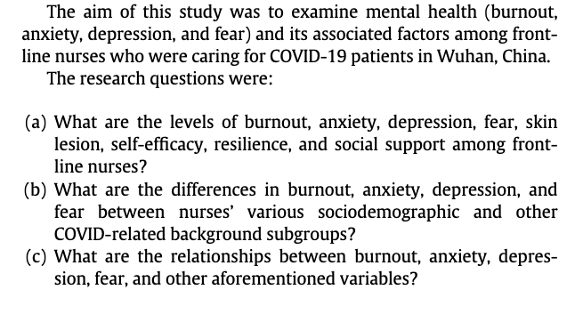
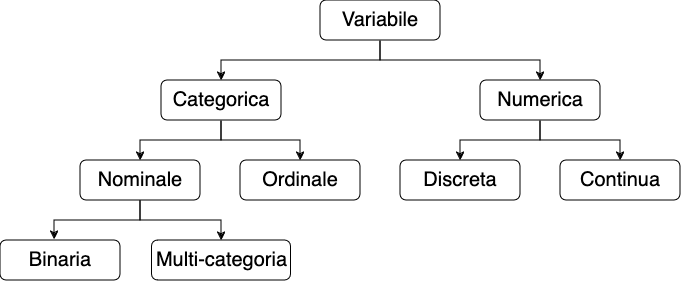
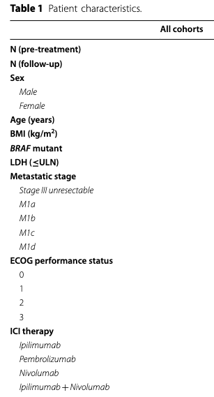

### Lezione 3
# I dati
## &nbsp;

---
## Obiettivi di apprendimento

- Saper definire cos'&egrave; un dato
- Conoscere le differenze tra i diversi tipi di dati
- Saper pianificare una raccolta dati 

---
## Le fasi della ricerca

Spiegelhalter, D., *The Art of Statistics: Learning From Data*, Pelican, 2019

<!-- Nella parte di Planning, il ricercatore decide come rispondere alla domanda di ricerca. Solitamente ignorata, ma assoulutamente cruciale, GARBACE IN, GARBACE OUT. Questo include, 
 i) verificare se esiste una collezione di dati di alta qualit`a che pu`o essere usata, ii) decidere e giustificare perch ́e sia necessario raccogliere nuove collezioni di dati, e quali dati siano necessari e come debbano essere raccolti 
 iii) decidere e giustificare da qua- le Popolazione i dati verranno raccolti, tenendo anche in considerazione considerazione etiche e logistiche (per esempio, questionari che richiedano un tempo troppo lungo per essere completati), 
 iv) decidere e giustificare quando e dove la raccolta dati debba iniziare e finire, 
 v) decidere e giustifi- care i metodi analitici che verranno utilizzati, e 
 vi) definire delle probabili risposte alla domanda di ricerca (ipotesi)
 
 Nella terza fase, i dati vengono raccolti, organizzati, puliti e verificati.  -->

---

**&nbsp;&nbsp;&nbsp;&nbsp;&nbsp;&nbsp; dato $\longleftrightarrow$ informazione $\longleftrightarrow$ variabile**

<!-- Un dato corrisponde a un'informazione su un membro di una popolazione (sesso, altezza, numero dei battiti cardiaci, titolo di studio, età,…) , viene codificata in variabili. 
La variabilita' di tali variabili (differenze che vediamo tra le osservazioni) ci dice come le caratteristiche di una paopolazione (eta', sesso, altezza... ) differiscano da individuo a individuo 

Questa variabilita' dipende sia da fattori conosciuti o conoscibili sia da effetti casuali (random noise)
-->

---
## Le fonti dei dati

- Rilevazioni periodiche
* Sondaggi
* Esperimenti
* Fonti esterne

<!-- FIXME 
Ogni ospedale o struttura ambulatoriale o assistenziale raccoglie, per controllare il proprio funzionamento dati amministrativi (HAD) 

Informazioni che non sono presenti nei rilevamenti. Per esempio nelle SDO non si dice come uno sia arrivato in clinica

Alcuni dati non possono essere raccolti con dei semplici sondaggi. Per esempio se volessimo sapere quale terapia e' meglio per curare la depressione
-->

---
## Raccogliamo dei dati?

- Quali dati raccogliere? 

---
## Raccogliamo dei dati?

- Quali dati raccogliere?
- In che formato?

&nbsp;&nbsp;&nbsp;&nbsp;&nbsp;&nbsp;&nbsp;&nbsp;&nbsp; :pushpin: &nbsp;&nbsp;&nbsp;  Esempio: et&agrave;

---
## Raccogliamo dei dati?

- Quali dati raccogliere?
- In che formato?

&nbsp;&nbsp;&nbsp;&nbsp;&nbsp;&nbsp;&nbsp;&nbsp;&nbsp; :pushpin: &nbsp;&nbsp;&nbsp; Esempio: et&agrave;
&nbsp;&nbsp;&nbsp;&nbsp;&nbsp;&nbsp;&nbsp;&nbsp;&nbsp; &nbsp;&nbsp;&nbsp;&nbsp;&nbsp;&nbsp;&nbsp;&nbsp;&nbsp; - Data di nascita + data visita

---
## Raccogliamo dei dati?

- Quali dati raccogliere?
- In che formato?

&nbsp;&nbsp;&nbsp;&nbsp;&nbsp;&nbsp;&nbsp;&nbsp;&nbsp; :pushpin: &nbsp;&nbsp;&nbsp; Esempio: et&agrave;
&nbsp;&nbsp;&nbsp;&nbsp;&nbsp;&nbsp;&nbsp;&nbsp;&nbsp; &nbsp;&nbsp;&nbsp;&nbsp;&nbsp;&nbsp;&nbsp;&nbsp;&nbsp; - Data di nascita + data visita
&nbsp;&nbsp;&nbsp;&nbsp;&nbsp;&nbsp;&nbsp;&nbsp;&nbsp; &nbsp;&nbsp;&nbsp;&nbsp;&nbsp;&nbsp;&nbsp;&nbsp;&nbsp; - Quanti anni hai?

---
## Raccogliamo dei dati?

- Quali dati raccogliere?
- In che formato?

&nbsp;&nbsp;&nbsp;&nbsp;&nbsp;&nbsp;&nbsp;&nbsp;&nbsp; :pushpin: &nbsp;&nbsp;&nbsp;  Esempio: et&agrave;
&nbsp;&nbsp;&nbsp;&nbsp;&nbsp;&nbsp;&nbsp;&nbsp;&nbsp; &nbsp;&nbsp;&nbsp;&nbsp;&nbsp;&nbsp;&nbsp;&nbsp;&nbsp; - Data di nascita + data visita
&nbsp;&nbsp;&nbsp;&nbsp;&nbsp;&nbsp;&nbsp;&nbsp;&nbsp; &nbsp;&nbsp;&nbsp;&nbsp;&nbsp;&nbsp;&nbsp;&nbsp;&nbsp; - Quanti anni hai?
&nbsp;&nbsp;&nbsp;&nbsp;&nbsp;&nbsp;&nbsp;&nbsp;&nbsp; &nbsp;&nbsp;&nbsp;&nbsp;&nbsp;&nbsp;&nbsp;&nbsp;&nbsp; - A quale di queste fasce d'et&agrave; appartieni?

---
## I tipi di dati

<!-- Andiamo a dividere i dati in variabili quantitative (o numeriche) o qualitative (o categorighe) 

Numeriche: 
- continue (altezza, peso, BMI, temperatura corporea)
- discrete (numero di pazienti ammessi in PS)

Categoriche si dividono in 2 classi
- Nominali (categorie che non possono essere ordinate) -> due categorie binarie (diabete si/no), piu' categorie (gruppo sanguigno)
- Ordinali (categorie che non possono essere ordinate) -> dati che rappresentano categorie ordinate (giudizi scolastici ("Insufficiente", "Sufficiente", "Buono", "Ottimo:"), "Sottopeso", "Normopeso" ...) -->

---
## Di che tipo di dato si tratta?

---
## Di che tipo di dato si tratta?

:question: &nbsp;&nbsp;&nbsp; Il numero di decessi in un ospedale

---
## Di che tipo di dato si tratta?

:question: &nbsp;&nbsp;&nbsp; La taglia di una maglietta

---
## Di che tipo di dato si tratta?

:question: &nbsp;&nbsp;&nbsp; La nazionalit&agrave;

---
## Di che tipo di dato si tratta?

:question: &nbsp;&nbsp;&nbsp; La glicemia a digiuno

---
## Di che tipo di dato si tratta?

:question: &nbsp;&nbsp;&nbsp; L'idoneit&agrave; a un esame

---
### Esercizio #1

:question: &nbsp;&nbsp;&nbsp; Di che tipo sono i dati 
&nbsp;&nbsp;&nbsp;&nbsp;&nbsp;&nbsp;&nbsp;&nbsp;&nbsp; in questa tabella?

	
Visconti A., *et al.*, *Total serum *N*‐glycans associate with response to immune checkpoint inhibition therapy and survival in patients with advanced melanoma*, BMC Cancer, 2023 doi:10.1186/s12885-023-10511-3

<!-- 
Dopo che lo hanno fatto, farli votare e discutere

Lactate dehydrogenase, dichotomized according to the upper limit of normal for each centre.
-->
 
---
### Esercizio #2

:question: &nbsp;&nbsp;&nbsp; Il sesso &egrave; una variabile categorica dicotomica?

&nbsp;&nbsp;&nbsp;&nbsp;&nbsp;&nbsp;&nbsp;&nbsp;&nbsp; a) Vero  &nbsp;&nbsp;&nbsp;&nbsp;&nbsp;&nbsp;&nbsp;&nbsp; b) Falso

:question: &nbsp;&nbsp;&nbsp; Il numero di figli &egrave; una variabile quantitativa discreta?

&nbsp;&nbsp;&nbsp;&nbsp;&nbsp;&nbsp;&nbsp;&nbsp;&nbsp; a) Vero  &nbsp;&nbsp;&nbsp;&nbsp;&nbsp;&nbsp;&nbsp;&nbsp; b) Falso 

:question: &nbsp;&nbsp;&nbsp; Il livello di colesterolo &egrave; una  variabile categorica ordinale?

&nbsp;&nbsp;&nbsp;&nbsp;&nbsp;&nbsp;&nbsp;&nbsp;&nbsp; a) Vero  &nbsp;&nbsp;&nbsp;&nbsp;&nbsp;&nbsp;&nbsp;&nbsp; b) Falso 

---
### Esercizio #3

Sikich, L. *et al.*, *Intranasal Oxytocin in Children and Adolescents with Autism Spectrum Disorder*, NEJM, 2021

:question: &nbsp;&nbsp;&nbsp; L’endpoint primario dello studio &egrave;
&nbsp;&nbsp;&nbsp;&nbsp;&nbsp;&nbsp;&nbsp;&nbsp;&nbsp; l’interazione sociale misurata sulla 
&nbsp;&nbsp;&nbsp;&nbsp;&nbsp;&nbsp;&nbsp;&nbsp;&nbsp; scala ABC-mSW a 24 settimane. Uno 
&nbsp;&nbsp;&nbsp;&nbsp;&nbsp;&nbsp;&nbsp;&nbsp;&nbsp; score più alto indica meno interazione. 
&nbsp;&nbsp;&nbsp;&nbsp;&nbsp;&nbsp;&nbsp;&nbsp;&nbsp; Di che tipo di variabile si tratta?

&nbsp;&nbsp;&nbsp;&nbsp;&nbsp;&nbsp;&nbsp;&nbsp;&nbsp; a) binaria 
&nbsp;&nbsp;&nbsp;&nbsp;&nbsp;&nbsp;&nbsp;&nbsp;&nbsp; b) ordinale
&nbsp;&nbsp;&nbsp;&nbsp;&nbsp;&nbsp;&nbsp;&nbsp;&nbsp; c) quantitativa 
&nbsp;&nbsp;&nbsp;&nbsp;&nbsp;&nbsp;&nbsp;&nbsp;&nbsp; d) non &egrave; possibile dirlo 

---
### Esercizio #4

Sikich, L. *et al.*, *Intranasal Oxytocin in Children and Adolescents with Autism Spectrum Disorder*, NEJM, 2021

:question: &nbsp;&nbsp;&nbsp; In questo studio, l'et&agrave; &egrave; stata raccolta 
&nbsp;&nbsp;&nbsp;&nbsp;&nbsp;&nbsp;&nbsp;&nbsp;&nbsp; come una variabile...

&nbsp;&nbsp;&nbsp;&nbsp;&nbsp;&nbsp;&nbsp;&nbsp;&nbsp; a) categorica
&nbsp;&nbsp;&nbsp;&nbsp;&nbsp;&nbsp;&nbsp;&nbsp;&nbsp; b) ordinale
&nbsp;&nbsp;&nbsp;&nbsp;&nbsp;&nbsp;&nbsp;&nbsp;&nbsp; c) numerica
&nbsp;&nbsp;&nbsp;&nbsp;&nbsp;&nbsp;&nbsp;&nbsp;&nbsp; d) Non &egrave; possibile desumerlo dalla tabella 

---
### Cosa abbiamo imparato in questa lezione?

- Che l'informazione viene codificata in variabili, la cui variabilit&agrave; (differenze che vediamo tra le osservazioni) dipende sia da fattori conosciuti o conoscibili sia da effetti casuali (random noise)
- Come pianificare la raccolta dati a partire da una domanda di ricerca
- Le differenze tra i diversi tipi di dati

