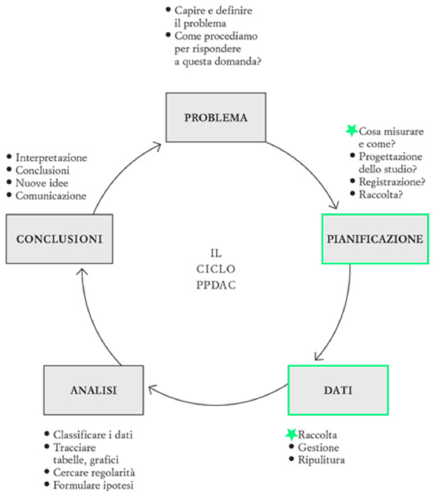

<!-- ### Lezione 3 -->
# Le variabili
## &nbsp;

---
## Obiettivi di apprendimento

- Saper definire cos'&egrave; una variabile
- Conoscere le differenze tra i diversi tipi di variabile

---
## Le fasi della ricerca

<!--  -->

Spiegelhalter, D., *The Art of Statistics: Learning From Data*, Pelican, 2019 (Edizione Italiana: Einaudi, 2020)

<!-- Nella parte di Planning, il ricercatore decide come rispondere alla domanda di ricerca. Solitamente ignorata, ma assoulutamente cruciale, GARBACE IN, GARBACE OUT. Questo include, 
 i) verificare se esiste una collezione di dati di alta qualit`a che pu`o essere usata, ii) decidere e giustificare perch ́e sia necessario raccogliere nuove collezioni di dati, e quali dati siano necessari e come debbano essere raccolti 
 iii) decidere e giustificare da qua- le Popolazione i dati verranno raccolti, tenendo anche in considerazione considerazione etiche e logistiche (per esempio, questionari che richiedano un tempo troppo lungo per essere completati), 
 iv) decidere e giustificare quando e dove la raccolta dati debba iniziare e finire, 
 v) decidere e giustifi- care i metodi analitici che verranno utilizzati, e 
 vi) definire delle probabili risposte alla domanda di ricerca (ipotesi)
 
 Nella terza fase, i dati vengono raccolti, organizzati, puliti e verificati.  -->

---

**&nbsp;&nbsp;&nbsp;&nbsp;&nbsp;&nbsp;&nbsp;&nbsp;&nbsp;&nbsp;&nbsp;&nbsp;&nbsp;&nbsp; variabile $\longleftrightarrow$ informazione**

<!-- Dato informazione su una variabile di interesse

Un dato corrisponde a un'informazione su un membro di una popolazione (sesso, altezza, numero dei battiti cardiaci, titolo di studio, età,…) , viene codificata in variabili. 
La variabilita' di tali variabili (differenze che vediamo tra le osservazioni) ci dice come le caratteristiche di una paopolazione (eta', sesso, altezza... ) differiscano da individuo a individuo 

Questa variabilita' dipende sia da fattori conosciuti o conoscibili sia da effetti casuali (random noise)
-->

---
## I tipi di variabile

<!-- Andiamo a dividere i dati in variabili quantitative (o numeriche) o qualitative (o categorighe) 

Numeriche: 
- continue (altezza, peso, BMI, temperatura corporea)
- discrete (numero di pazienti ammessi in PS)

Categoriche si dividono in 2 classi
- Nominali (categorie che non possono essere ordinate) -> due categorie binarie (diabete si/no), piu' categorie (gruppo sanguigno)
- Ordinali (categorie che non possono essere ordinate) -> dati che rappresentano categorie ordinate (giudizi scolastici ("Insufficiente", "Sufficiente", "Buono", "Ottimo:"), "Sottopeso", "Normopeso" ...) -->

---
## Di che tipo di variabile si tratta?

---
## Di che tipo di variabile si tratta?

:question: &nbsp;&nbsp;&nbsp; La taglia di una maglietta

---
## Di che tipo di variabile si tratta?

:question: &nbsp;&nbsp;&nbsp; Il numero di studenti in un corso

---
## Di che tipo di variabile si tratta?

:question: &nbsp;&nbsp;&nbsp; La nazionalit&agrave;

---
## Di che tipo di variabile si tratta?

:question: &nbsp;&nbsp;&nbsp; La glicemia a digiuno

---
## Di che tipo di variabile si tratta?

:question: &nbsp;&nbsp;&nbsp; Superare l'esame per la patente

---
### Esercizio #1

:question: &nbsp;&nbsp;&nbsp; Di che tipo sono le variabili
&nbsp;&nbsp;&nbsp;&nbsp;&nbsp;&nbsp;&nbsp;&nbsp; in questa tabella?

	
Visconti A., *et al.*, *Total serum *N*‐glycans associate with response to immune checkpoint inhibition therapy and survival in patients with advanced melanoma*, BMC Cancer, 2023 doi:10.1186/s12885-023-10511-3

<!-- 
Dopo che lo hanno fatto, farli votare e discutere

Lactate dehydrogenase, dichotomized according to the upper limit of normal for each centre.
-->
 

---
### Esercizio #2

:question: &nbsp;&nbsp;&nbsp; Avere una diagnosi di autismo &egrave; una variabile categorica dicotomica?

&nbsp;&nbsp;&nbsp;&nbsp;&nbsp;&nbsp;&nbsp;&nbsp; a) Vero  &nbsp;&nbsp;&nbsp;&nbsp;&nbsp;&nbsp;&nbsp;&nbsp; b) Falso

:question: &nbsp;&nbsp;&nbsp; Il numero di iscritti a un evento &egrave; una variabile quantitativa discreta?

&nbsp;&nbsp;&nbsp;&nbsp;&nbsp;&nbsp;&nbsp;&nbsp; a) Vero  &nbsp;&nbsp;&nbsp;&nbsp;&nbsp;&nbsp;&nbsp;&nbsp; b) Falso 

:question: &nbsp;&nbsp;&nbsp; Il livello di colesterolo &egrave; una  variabile qualitativa ordinale?

&nbsp;&nbsp;&nbsp;&nbsp;&nbsp;&nbsp;&nbsp;&nbsp; a) Vero  &nbsp;&nbsp;&nbsp;&nbsp;&nbsp;&nbsp;&nbsp;&nbsp; b) Falso 

---
### Esercizio #3

:question: &nbsp;&nbsp;&nbsp; Un ricercatore si chiede se il numero di figli dipenda dal livello di educazione.
&nbsp;&nbsp;&nbsp;&nbsp;&nbsp;&nbsp;&nbsp;&nbsp;  Per rispondere a questa domanda divide le persone in 4 categorie (licenza
&nbsp;&nbsp;&nbsp;&nbsp;&nbsp;&nbsp;&nbsp;&nbsp;  media e/o elementare, diploma, laurea, dottorato) e ne trascrive il numero
&nbsp;&nbsp;&nbsp;&nbsp;&nbsp;&nbsp;&nbsp;&nbsp;  di figli.

&nbsp;&nbsp;&nbsp;&nbsp;&nbsp;&nbsp;&nbsp;&nbsp; Che tipo di variabili raccoglie?

&nbsp;&nbsp;&nbsp;&nbsp;&nbsp;&nbsp;&nbsp;&nbsp;&nbsp;&nbsp;&nbsp; Educazione

&nbsp;&nbsp;&nbsp;&nbsp;&nbsp;&nbsp;&nbsp;&nbsp;&nbsp;&nbsp;&nbsp; a) multi-categoria 
&nbsp;&nbsp;&nbsp;&nbsp;&nbsp;&nbsp;&nbsp;&nbsp;&nbsp;&nbsp;&nbsp; b) ordinale
&nbsp;&nbsp;&nbsp;&nbsp;&nbsp;&nbsp;&nbsp;&nbsp;&nbsp;&nbsp;&nbsp; c) discreta 
&nbsp;&nbsp;&nbsp;&nbsp;&nbsp;&nbsp;&nbsp;&nbsp;&nbsp;&nbsp;&nbsp; d) continua

&nbsp;&nbsp;&nbsp;&nbsp;&nbsp;&nbsp;&nbsp;&nbsp;&nbsp;&nbsp;&nbsp; Numero di figli

&nbsp;&nbsp;&nbsp;&nbsp;&nbsp;&nbsp;&nbsp;&nbsp;&nbsp;&nbsp;&nbsp; a) multi-categoria 
&nbsp;&nbsp;&nbsp;&nbsp;&nbsp;&nbsp;&nbsp;&nbsp;&nbsp;&nbsp;&nbsp; b) ordinale
&nbsp;&nbsp;&nbsp;&nbsp;&nbsp;&nbsp;&nbsp;&nbsp;&nbsp;&nbsp;&nbsp; c) discreta 
&nbsp;&nbsp;&nbsp;&nbsp;&nbsp;&nbsp;&nbsp;&nbsp;&nbsp;&nbsp;&nbsp; d) continua

---
### Esercizio #4 

:question: &nbsp;&nbsp;&nbsp; Un ricercatore disegna uno studio in cui pazienti con alti livelli di colesterolo 
&nbsp;&nbsp;&nbsp;&nbsp;&nbsp;&nbsp;&nbsp;&nbsp; sono assegnati in modo casuale a prendere o un nuovo farmaco o un placebo.
&nbsp;&nbsp;&nbsp;&nbsp;&nbsp;&nbsp;&nbsp;&nbsp; Sapendo che c'&egrave; una differenza nel modo in cui uomini e donne rispondono 
&nbsp;&nbsp;&nbsp;&nbsp;&nbsp;&nbsp;&nbsp;&nbsp; al trattamento, ne registra il sesso. I livelli di colesterolo e vengono misurati 
&nbsp;&nbsp;&nbsp;&nbsp;&nbsp;&nbsp;&nbsp;&nbsp; prima e dopo 3 mesi di trattamento

&nbsp;&nbsp;&nbsp;&nbsp;&nbsp;&nbsp;&nbsp;&nbsp; Che tipo di variabili raccoglie?

&nbsp;&nbsp;&nbsp;&nbsp;&nbsp;&nbsp;&nbsp;&nbsp;&nbsp;&nbsp;&nbsp; - Trattamento &nbsp;&nbsp;&nbsp;&nbsp;&nbsp;&nbsp;&nbsp;&nbsp;&nbsp;&nbsp;&nbsp;&nbsp;: .....................
&nbsp;&nbsp;&nbsp;&nbsp;&nbsp;&nbsp;&nbsp;&nbsp;&nbsp;&nbsp;&nbsp; - Sesso &nbsp;&nbsp;&nbsp;&nbsp;&nbsp;&nbsp;&nbsp;&nbsp;&nbsp;&nbsp;&nbsp;&nbsp;&nbsp;&nbsp;&nbsp;&nbsp;&nbsp;&nbsp;&nbsp;&nbsp;&nbsp;: .....................
&nbsp;&nbsp;&nbsp;&nbsp;&nbsp;&nbsp;&nbsp;&nbsp;&nbsp;&nbsp;&nbsp; - Livelli di colesterolo : .....................

---
## Una sola variabile, tanti tipi

:pushpin: &nbsp;&nbsp;&nbsp;  Esempio: et&agrave;

---
## Una sola variabile, tanti tipi

:pushpin: &nbsp;&nbsp;&nbsp;  Esempio: et&agrave;
&nbsp;&nbsp;&nbsp;&nbsp;&nbsp;&nbsp;&nbsp;&nbsp; - Data di nascita + data visita

---
## Una sola variabile, tanti tipi

:pushpin: &nbsp;&nbsp;&nbsp;  Esempio: et&agrave;
&nbsp;&nbsp;&nbsp;&nbsp;&nbsp;&nbsp;&nbsp;&nbsp; - Data di nascita + data visita
&nbsp;&nbsp;&nbsp;&nbsp;&nbsp;&nbsp;&nbsp;&nbsp; - Quanti anni hai?

---
## Una sola variabile, tanti tipi

:pushpin: &nbsp;&nbsp;&nbsp;  Esempio: et&agrave;
&nbsp;&nbsp;&nbsp;&nbsp;&nbsp;&nbsp;&nbsp;&nbsp; - Data di nascita + data visita
&nbsp;&nbsp;&nbsp;&nbsp;&nbsp;&nbsp;&nbsp;&nbsp; - Quanti anni hai?
&nbsp;&nbsp;&nbsp;&nbsp;&nbsp;&nbsp;&nbsp;&nbsp; - A quale di queste fasce d'et&agrave; appartieni?

---
## Discretizzazione

- Da una serie di valori continui a intervalli (o classi)
- La scelta del numero di classi e degli estremi è arbitraria
- Le classi devono essere mutualmente esclusive
- Riportate anche le classi nulle (frequenza zero)

:pushpin: &nbsp;&nbsp;&nbsp; $\text{IMC (BMI)} = \frac{\text{peso}_\text{kg}}{\text{altezza}_m^2}$

| IMC (BMI) | Classificazione
| ----: | -----: |
|< 18,5 | Sottopeso
18,5 – 24, 9 | Normopeso
25,0 – 29,9 | Sovrappeso
30,0 – 34,9  | Obesità 1° grado
35,0 – 39,9 | Obesità 2° grado
| > 39,9 | Obesità 3° grado

<!-- Frequenze si usato per dati qualitativi, ma cosa facciamo se abbiamo dati quantitativi?

In questo caso si possono ancora usare, ma la frequenza non è riferita ad un singolo valore, ma ad intervalli (o classi) di valori. 

ESEMPIO QUI DEL BMI

La scelta del numero di classi e degli estremi è arbitraria. Entrambi vengono determinati in base a criteri di convenienza.

Il numero di classi può oscillare e dipende dalla numerosità dei dati (in genere utilizzare da 5 a 20 classi).

Scegliere estremi che siano clinicamente/biologicamente significativi o naturali e, preferibilmente, di uguale ampiezza.

Le classi debbono essere mutuamente esclusive (fate attenzione agli estremi!!).

-->

---
## Discretizzazione

 
Visconti A., *et al.*, *Total serum *N*‐glycans associate with response to immune checkpoint inhibition therapy and survival in patients with advanced melanoma*, BMC Cancer, 2023 doi:10.1186/s12885-023-10511-3

<!-- Lactate dehydrogenase, dichotomized according to the upper limit of normal for each centre. -->

---
### Esercizio #5

:question: &nbsp;&nbsp;&nbsp; Un ricercatore ha registrato l'et&agrave; del campione come una variabile
&nbsp;&nbsp;&nbsp;&nbsp;&nbsp;&nbsp;&nbsp;&nbsp;  discreta. Pu&ograve; trasformarla in una variabile categorica ordinale?

&nbsp;&nbsp;&nbsp;&nbsp;&nbsp;&nbsp;&nbsp;&nbsp;&nbsp;&nbsp;&nbsp; a) S&igrave;, sempre 
&nbsp;&nbsp;&nbsp;&nbsp;&nbsp;&nbsp;&nbsp;&nbsp;&nbsp;&nbsp;&nbsp; b) Dipende dal contesto
&nbsp;&nbsp;&nbsp;&nbsp;&nbsp;&nbsp;&nbsp;&nbsp;&nbsp;&nbsp;&nbsp; c) No, mai

---
### Esercizio #6

:question: &nbsp;&nbsp;&nbsp; Un ricercatore ha registrato l'et&agrave; del campione come una variabile
&nbsp;&nbsp;&nbsp;&nbsp;&nbsp;&nbsp;&nbsp;&nbsp;  categorica ordinale. Pu&ograve; riottenere l'esatta informazione numerica?

&nbsp;&nbsp;&nbsp;&nbsp;&nbsp;&nbsp;&nbsp;&nbsp;&nbsp;&nbsp;&nbsp; a) S&igrave;, sempre 
&nbsp;&nbsp;&nbsp;&nbsp;&nbsp;&nbsp;&nbsp;&nbsp;&nbsp;&nbsp;&nbsp; b) Dipende dal contesto
&nbsp;&nbsp;&nbsp;&nbsp;&nbsp;&nbsp;&nbsp;&nbsp;&nbsp;&nbsp;&nbsp; c) No, mai

---
### Cosa abbiamo imparato in questa lezione?

- Una caratteristica di interesse viene codificata in variabili
- Le differenze che esistono tra le osservazioni (variabilit&agrave;) dipende sia da fattori conosciuti o conoscibili sia da effetti casuali (random noise)
- Le variabili sono di diversi tipi, a seconda della caratteristica che codificano
- Variabili numeriche possono essere trasformate in variabili categoriche (vedremo come)

