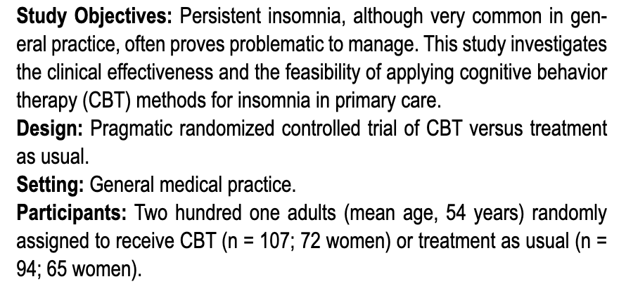
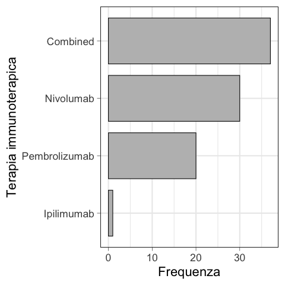
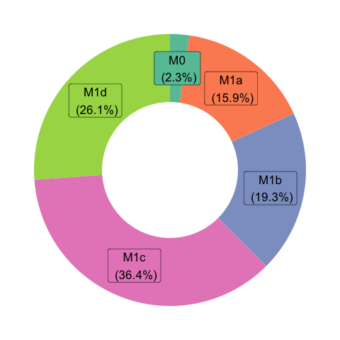
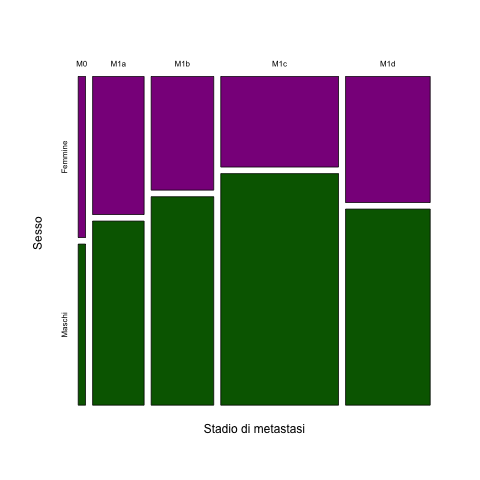

<!-- ### Lezione 4 -->
# La statistica descrittiva
## (Parte I: Le variabili categoriche)
## &nbsp;

---
## Obiettivi di apprendimento

- Saper costruire e interpretare tabelle di frequenza e contingenza
- Saper visualizzare dati categorici
- Saper interpretare tabelle e figure in articoli scientifici

---
## Le fasi della ricerca

Spiegelhalter, D., *The Art of Statistics: Learning From Data*, Pelican, 2019

---
### I tipi di dato

:question: &nbsp;&nbsp;&nbsp; Di che tipo sono i dati
&nbsp;&nbsp;&nbsp;&nbsp;&nbsp;&nbsp;&nbsp;&nbsp; in questa tabella?

 
Visconti A., *et al.*, *Total serum *N*‐glycans associate with response to immune checkpoint inhibition therapy and survival in patients with advanced melanoma*, BMC Cancer, 2023 doi:10.1186/s12885-023-10511-3

<!-- Sesso: Binaria
Eta'/BMI: continua
BRAF: binaria
Metastatic stage: Ordinale
ECOG score: ordinale (o fully active  5 morto, 4 completamente disabile, 3 capable of only limited selfcare)
ICI teraphy: categorico (con piu' categorie) 
N: discreto

Lactate dehydrogenase, dichotomized according to the upper limit of normal for each centre.
-->

---
## Perch&eacute; ci interessa?

 
Visconti A., *et al.*, *Total serum *N*‐glycans associate with response to immune checkpoint inhibition therapy and survival in patients with advanced melanoma*, BMC Cancer, 2023 doi:10.1186/s12885-023-10511-3

<!-- Perche' il modo in cui andiamo prima a presentare e poi ad analizzare una variabile dipende dal suop tipo.

Numeriche media/SD, categoriche N/% --> 

---
## Variabili categoriche

#### Tabella di frequenza

- frequenza assoluta (numero)
- frequenza relativa (percentuale)

 
Visconti A., *et al.*, *Total serum *N*‐glycans associate with response to immune checkpoint inhibition therapy and survival in patients with advanced melanoma*, BMC Cancer, 2023 doi:10.1186/s12885-023-10511-3

<!-- AssolutaL: numero di volte in cui una certa modalità si manifesta nel campione  
possono assumere valori compresi tra 0 e n (dimensione del campione)
la loro somma è pari a n

Relativa: rapporto tra la frequenza assoluta con cui si manifesta una modalità e la numerosità totale del campione
possono assumere valori compresi tra 0 e 1 (o 0 e 100)
la loro somma è pari a 1

Frequenze assolute e relative forniscono le stesse informazioni sulla distribuzione. 

-->

---
### Esercizio #1

:question: &nbsp;&nbsp;&nbsp; Quale sesso &egrave; predominante?
&nbsp;&nbsp;&nbsp;&nbsp;&nbsp;&nbsp;&nbsp;&nbsp;

 
Visconti A., *et al.*, *Total serum *N*‐glycans associate with response to immune checkpoint inhibition therapy and survival in patients with advanced melanoma*, BMC Cancer, 2023 doi:10.1186/s12885-023-10511-3

<!-- Le frequenze relative: facilitano la percezione del peso delle modalità -->

---
## Tabelle di contingenza

 
Espie. CA, *et al.*, *Randomized Clinical Effectiveness Trial of Nurse-Administered Small-Group Cognitive Behavior Therapy for Persistent Insomnia in General Practice*, Sleep, 2007, doi:10.1186/s12885-023-10511-3

<!-- SPIEGARE CHE SI TRATTA DI UN RCT E COSA DIAVOLO E' UN RCT -- Useremo questo studio per costruire e capire cos'e' una tabelle di contingenza 

 `e una tabella a doppia entrata (con righe e colon- ne) in cui si riportano le frequenze congiunte di due variabili.
-->

---
### Esercizio #2

:question: &nbsp;&nbsp;&nbsp; Completa la tabella con le corrette frequenze assolute e relative
&nbsp;&nbsp;&nbsp;&nbsp;&nbsp;&nbsp;&nbsp;&nbsp;  usando le informazioni contenute nell'abstract

|  | CBT | Standard | Totale |
| ----: | ----- | ---- | ----|
| Maschi |  |  |  |
| Femmine |  |  |  |
| Totale |  |  |  |

<!--  `e una tabella a doppia entrata (con righe e colon- ne) in cui si riportano le frequenze congiunte di due variabili. 

La CBT (in italiano: terapia cognitivo-comportamentale) è una forma di psicoterapia "focalizzata sul problema" e "orientata all'azione". Essa si concentra sul cambiamento delle distorsioni cognitive (come pensieri, convinzioni e atteggiamenti) e sui comportamenti ad esse associati, per migliorare la regolazione emotiva[1][2] e sviluppare adeguate strategie di coping. 
-->

---
### Esercizio #3

:question: &nbsp;&nbsp;&nbsp; La proporzione di uomini e donne nel campione &egrave; simile?
&nbsp;&nbsp;&nbsp;&nbsp;&nbsp;&nbsp;&nbsp;&nbsp; a) Vero  &nbsp;&nbsp;&nbsp;&nbsp; b) Falso &nbsp;&nbsp;&nbsp;&nbsp; c) Servono pi&ugrave; elementi per decidere

:question: &nbsp;&nbsp;&nbsp; Confrontando i due bracci, la proporzione di uomini e donne &egrave; simile?
&nbsp;&nbsp;&nbsp;&nbsp;&nbsp;&nbsp;&nbsp;&nbsp; a) Vero  &nbsp;&nbsp;&nbsp;&nbsp; b) Falso &nbsp;&nbsp;&nbsp;&nbsp; c) Servono pi&ugrave; elementi per decidere

|  | CBT | Standard | Totale |
| ----: | -----: | ----: | ----: |
| Maschi |  35 (32.7%) |  29 (30.9%) | 64  (31.8%)|
| Femmine | 72 (67.3%) |  65 (69.1%) | 137 (68.2%) |
| Totale | 107 | 94  | 201 |

<!-- Le frequenze relative consentono di confrontare la distribuzione di una variabile in campioni di diversa numerosità 

LEGGERE PRIMA DI DARE LA SOLUZIONE Nel campione, quindi vado a vedere la colonna dei totali, Le donne sono il doppio degli uomini. No, non sono uguali
-->

---
### Esercizio #4

:question: &nbsp;&nbsp;&nbsp; Tra 279, 230 e 130 professionisti sanitari che lavorano nei reparti di 
&nbsp;&nbsp;&nbsp;&nbsp;&nbsp;&nbsp;&nbsp;&nbsp; medicina, chirurgia o altro (per esempio laboratori o altri servizi 
&nbsp;&nbsp;&nbsp;&nbsp;&nbsp;&nbsp;&nbsp;&nbsp; ospedalieri) sono stati individuati 122, 107, e 51 astemi. 

&nbsp;&nbsp;&nbsp;&nbsp;&nbsp;&nbsp;&nbsp;&nbsp; Completa la tabella con le corrette frequenze assolute

| Reparto/Astemio | Si | No  | Totale |
| ----: | -----: | ----: | ----: |
| Medicina |   |    |    |
| Chirurgia |   |    |  |
| Altro |  |   |  |
| Totale |  |   |  |

 Albano, L. *et al.*, *Alcohol consumption in a sample of Italian healthcare workers: A cross-sectional study*, Archives of Environmental & Occupational Health, 2020

---
### Esercizio #5

:question: &nbsp;&nbsp;&nbsp; Qual &egrave; la percentuale di astemi nei diversi reparti?

 

| Reparto/Astemio | Si | No  | Totale |
| ----: | -----: | ----: | ----: |
| Medicina |   |    |    |
| Chirurgia |   |    |  |
| Altro |  |   |  |
| Totale |  |   |  |

---
### Esercizio #6

:question: &nbsp;&nbsp;&nbsp; Con quale percentuale si distribuiscono gli astemi (o meno) 
&nbsp;&nbsp;&nbsp;&nbsp;&nbsp;&nbsp;&nbsp;&nbsp; nei diversi reparti?

 

| Reparto/Astemio | Si | No  | Totale |
| ----: | -----: | ----: | ----: |
| Medicina |   |    |    |
| Chirurgia |   |    |  |
| Altro |  |   |  |
| Totale |  |   |  |

---
## Discretizzazione

- Da una serie di valori continui a intervalli (o classi)
- La scelta del numero di classi e degli estremi è arbitraria
- Le classi devono essere mutualmente esclusive
- Riportate anche le classi nulle (frequenza zero)

:pushpin: &nbsp;&nbsp;&nbsp; $\text{IMC (BMI)} = \frac{\text{peso}_\text{kg}}{\text{altezza}_m^2}$

| IMC (BMI) | Classificazione
| ----: | -----: |
|< 18,5 | Sottopeso
18,5 – 24, 9 | Normopeso
25,0 – 29,9 | Sovrappeso
30,0 – 34,9  | Obesità 1° grado
35,0 – 39,9 | Obesità 2° grado
| > 39,9 | Obesità 3° grado

<!-- Frequenze si usato per dati qualitativi, ma cosa facciamo se abbiamo dati quantitativi?

In questo caso si possono ancora usare, ma la frequenza non è riferita ad un singolo valore, ma ad intervalli (o classi) di valori. 

ESEMPIO QUI DEL BMI

La scelta del numero di classi e degli estremi è arbitraria. Entrambi vengono determinati in base a criteri di convenienza.

Il numero di classi può oscillare e dipende dalla numerosità dei dati (in genere utilizzare da 5 a 20 classi).

Scegliere estremi che siano clinicamente/biologicamente significativi o naturali e, preferibilmente, di uguale ampiezza.

Le classi debbono essere mutuamente esclusive (fate attenzione agli estremi!!).

-->

---
## Discretizzazione

 
Visconti A., *et al.*, *Total serum *N*‐glycans associate with response to immune checkpoint inhibition therapy and survival in patients with advanced melanoma*, BMC Cancer, 2023 doi:10.1186/s12885-023-10511-3

<!-- Lactate dehydrogenase, dichotomized according to the upper limit of normal for each centre. -->

---

# La visualizzazione dei dati categorici

---
## Bar chart

- frequenza assoluta
- frequenza relativa

 
Visconti A., *et al.*, Total serum *N*‐glycans associate with response to immune checkpoint inhibition therapy and survival in patients with advanced melanoma, BMC Cancer, 2023 doi:10.1186/s12885-023-10511-3

<!-- Diagramma a barre 

Qui vi mostro lo stage metastatico della corte dell'esempio precedente, che e' divisa in 5 classi.

E` considerata uno delle visualizzazioni piu` efficaci per rappresentare dati categorici, anche se noiso

Ciascuna Modalit`a viene rappresentata da una barra, la cui dimensione `e proporzionale alla sua frequenza, assoluta o relativa. 

NON DIRLO: Perch ́e le dimensioni delle barre siano esattamente proporzionali, `e necessario che l’asse delle ordinate inizi dallo zero e non da un punto arbitrario (a questo riguardo vedi anche: Statisticulation).

Sorting bars often add insight.
Avoid filling with color palettes.

Long labels? Think of an horizontal version.
-->

---
## Horizontal bar chart

- frequenza assoluta
- frequenza relativa

Visconti A., *et al.*, *Total serum *N*‐glycans associate with response to immune checkpoint inhibition therapy and survival in patients with advanced melanoma*, BMC Cancer, 2023 doi:10.1186/s12885-023-10511-3

<!-- Diagramma a barre orizzontali 
variazione ulteriore: Circular bar chart, lollipop -->

---
## Horizontal bar chart

- frequenza assoluta
- frequenza relativa

Visconti A., *et al.*, *Total serum *N*‐glycans associate with response to immune checkpoint inhibition therapy and survival in patients with advanced melanoma*, BMC Cancer, 2023 doi:10.1186/s12885-023-10511-3

<!-- Diagramma a barre orizzontali 
variazione ulteriore: Circular bar chart, lollipop -->

---
## Cosa ci dice questo grafico?

- Da 1 a 10, quanto eri felice ieri?

<!-- To demonstrate, let’s take a look at the 16 to 19 and 20 to 24 age groups. It’s natural for people to compare lengths so looking at these two bars you might think that 16 to 19 year olds were almost twice as happy as 20 to 14 year olds, when actually they’re pretty similar – only a difference of 0.27. -->

---

## Cosa ci dice questo grafico?

- Da 1 a 10, quanto eri felice ieri?

<!-- 
16 to 19 year olds were almost twice as happy as 20 to 14 year olds, when actually they’re pretty similar – only a difference of 0.27.

Ciascuna Modalit`a viene rappresentata da una barra, la cui dimensione `e proporzionale alla sua frequenza, assoluta o relativa. 

Perch ́e le dimensioni delle barre siano esattamente proporzionali, `e necessario che l’asse delle ordinate inizi dallo zero e non da un punto arbitrario (a questo riguardo vedi anche: Statisticulation).

Non e' necessariamente fatto per ingannare, ma i grafici pensavano di migliorare la visualizzazione

Wow, that’s a lot of orange. Any patterns in the data just seem to be dominated the fact that there are lots of bars. So what can we do to focus more on the pattern in the data? 

 -->
---
## Cosa ci dice questo grafico?

- Da 1 a 10, quanto eri felice ieri?

<!-- ne way of managing this would be to move away from using bars entirely, for example, using the position of a dot to mark each data point. The length aspect no longer exists and the reader is forced to look at the position of the data point relative to the x-axis in order to make a comparison between categories. -->

---
### L'asse y deve partire dallo zero, ma non cos&igrave;...

---
## Lollipop chart

- frequenza assoluta
- frequenza relativa

 
Visconti A., *et al.*, *Total serum *N*‐glycans associate with response to immune checkpoint inhibition therapy and survival in patients with advanced melanoma*, BMC Cancer, 2023 doi:10.1186/s12885-023-10511-3

---
## Pie chart

- frequenza relativa

 
Visconti A., *et al.*, *Total serum *N*‐glycans associate with response to immune checkpoint inhibition therapy and survival in patients with advanced melanoma*, BMC Cancer, 2023 doi:10.1186/s12885-023-10511-3

<!-- Diagramma a torta

A pie chart is a circle divided into sectors that each represent a proportion of the whole. It is often used to show proportion, where the sum of the sectors equal 100%.

Pie charts are highly critized and must be avoided as much as possible. Human is very bad at translating angles towards values. 

Don't use it
Don't use 3D.
Don't use a legend, annotate directly each slice.
If displaying proportion, sum must add up to 100.
Don't put several pie charts one beside each other to compare them.

-->

---
## Donut chart

- frequenza relativa

 
Visconti A., *et al.*, *Total serum *N*‐glycans associate with response to immune checkpoint inhibition therapy and survival in patients with advanced melanoma*, BMC Cancer, 2023 doi:10.1186/s12885-023-10511-3

<!-- Diagramma a ciambella - cugino di primo grado. 
Ho migliorato la grafica andando ad annotare le percentuali -->

---
## Waffle chart

- frequenza relativa

 
*Visconti A., *et al.*, Total serum *N*‐glycans associate with response to immune checkpoint inhibition therapy and survival in patients with advanced melanoma*, BMC Cancer, 2023 doi:10.1186/s12885-023-10511-3

<!-- A Waffle Chart visually represents categorical data through a grid of small squares, resembling a waffle. Each category is assigned a unique color, and the number of squares allocated to each category corresponds to its proportional share of the total data count. 

They are often 10 by 10 grids, where each cell represents 1%. Despite the name, circles, pictograms (such as of people), and other shapes may be used instead of squares. One major benefit to square charts is that smaller percentages, difficult to see on traditional pie charts, can be easily depicted.

Common Mistakes
 sum must add up to 100.

 Possiamo anche farlo con i pittogrammi
 -->

---
## Infographics

Spiegelhalter, D., *The Art of Statistics: Learning From Data*, Pelican, 2019

<!-- Figure 1.4 uses icon arrays to directly represent the expected frequencies of bowel cancer in 100 people.

In Figure 1.4 the ‘cancer’ icons are randomly scattered among the 100. While such scatter has been shown to increase the impression of unpredictability, it should only be used when there is a single additional highlighted icon. There should be no need to count icons in order to make a quick visual comparison.

 -->

---
## Mosaic plot

- frequenza relativa

 
*Visconti A., *et al.*, Total serum *N*‐glycans associate with response to immune checkpoint inhibition therapy and survival in patients with advanced melanoma*, BMC Cancer, 2023 doi:10.1186/s12885-023-10511-3

<!-- Mosaic plots provide an ideal method both for visualizing contingency tables.

Sono la proporzione sul totale.  

round(prop.table(freq_a)*100, 0)

      Females Males
  M0        1     1
  M1a       7     9
  M1b       7    12
  M1c      10    26
  M1d      10    16
 -->

---
### Cosa abbiamo imparato in questa lezione?

- Le variabili categoriche possono essere rappresentate con le loro frequenze, assolute o relative
- Tabelle di frequenze e di contingenza ci aiutano a paragonare, a colpo d'occhio, due o pi&ugrave; variabili
- Variabili numeriche possono essere trasformate in variabili categoriche attraverso la loro "discretizzazione"
- Le variabili categoriche possono essere rappresentate graficamente in diversi modi, ma bar chart sono da preferire, seguiti da waffle chart

