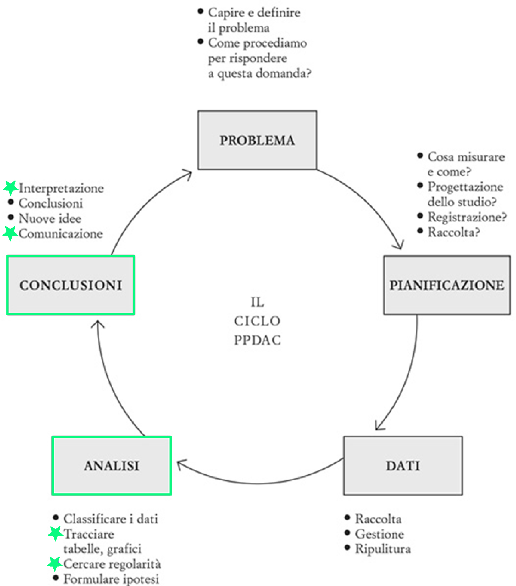
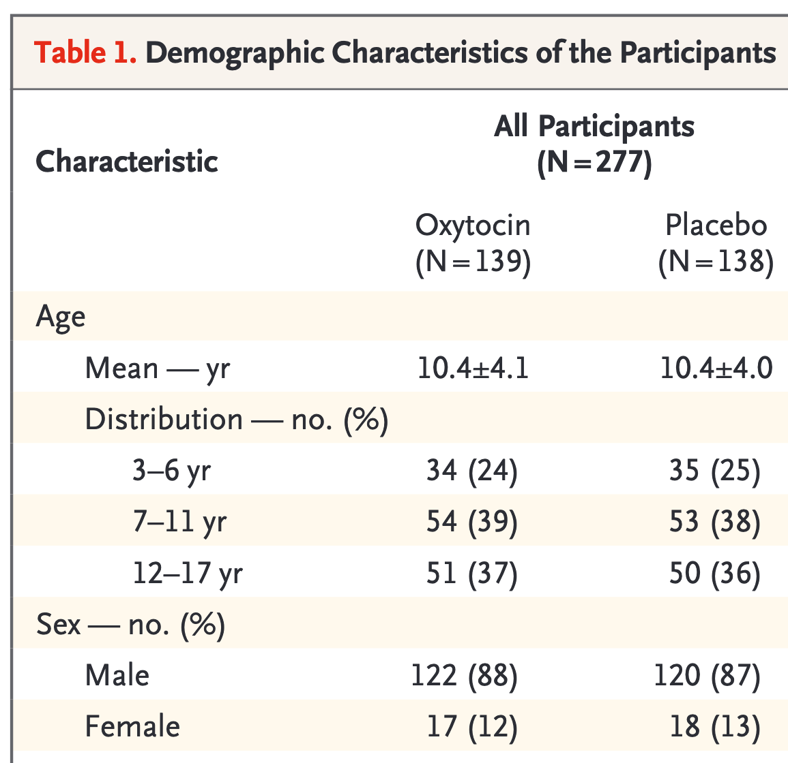
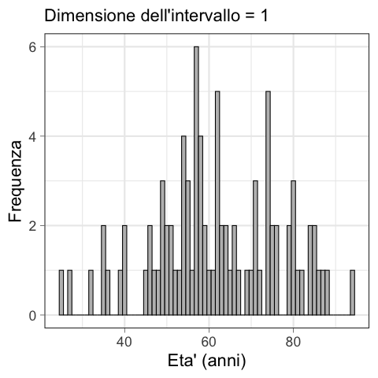
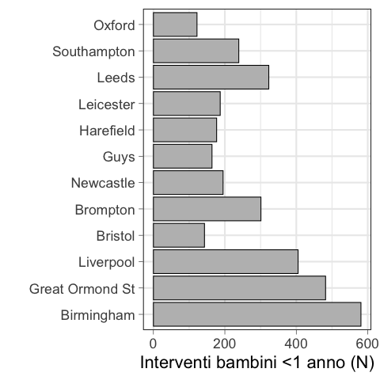

<!-- ### Lezione 5 -->
# La statistica descrittiva
## (Parte II: Le variabili numeriche)
## &nbsp;

---
## Obiettivi di apprendimento

- Riassumere i dati numerici utilizzando misure di centralit&agrave;, dispersione e correlazione
- Riassumere i dati numerici utilizzando rappresentazioni grafiche
- Interpretare tabelle e figure in articoli scientifici

---
## Le fasi della ricerca

<!--  -->

Spiegelhalter, D., *The Art of Statistics: Learning From Data*, Pelican, 2019 (Edizione Italiana: Einaudi, 2020)

---
## Misure di centralit&agrave; e dispersione

<!--   Per le variabili quantitative è necessario descrivere i dati raccolti anche numericamente… Poiché generalmente il problema è che i dati sono tanti, può risultare più semplice sintetizzarli e ridurli a pochi numeri, più facili da comprendere, utilizzare e comunicare.

Le tabelle di frequenza dopo una procedura di discretizzazione non sono pero' il modo piu' consono per rappresentare i dati quantitativi. E' meglio usare

Tendenza centrale (o posizione) -> Individuano il valore intorno al quale i dati sono raggruppati

Dispersione o variabilita'  -> Forniscono un’indicazione della dispersione delle osservazioni intorno al valore centrale -->

---
## Misure di centralit&agrave;: la moda

:dart: &nbsp;&nbsp;&nbsp; L'elemento pi&ugrave; frequente

&nbsp;&nbsp;&nbsp;&nbsp;&nbsp;&nbsp;&nbsp;&nbsp; moda = 26

---
### Esercizio #1

:question: &nbsp;&nbsp;&nbsp; Qual &egrave; la moda dei seguenti insiemi?

&nbsp;&nbsp;&nbsp;&nbsp;&nbsp;&nbsp;&nbsp;&nbsp;  $x= \{1, 1, 1, 3, 4, 4, 4, 7, 8, 8, 9, 9\}$
&nbsp;&nbsp;&nbsp;&nbsp;&nbsp;&nbsp;&nbsp;&nbsp; $\text{moda}(x)= \text{ } ?$

&nbsp;&nbsp;&nbsp;&nbsp;&nbsp;&nbsp;&nbsp;&nbsp;  $y= \{1, 3, 4, 7, 8, 9, 11, 17, 21, 42\}$
&nbsp;&nbsp;&nbsp;&nbsp;&nbsp;&nbsp;&nbsp;&nbsp; $\text{moda}(y)= \text{ } ?$

<button id="countdown_exercise_1"></button>

<!-- se ciascun valore si presenta una volta sola, le nostre osservazioni non hanno moda

Si usa soprattutto per i dati categorici -->

---
### Esercizio #1 -- Soluzione

:question: &nbsp;&nbsp;&nbsp; Qual &egrave; la moda dei seguenti insiemi?

&nbsp;&nbsp;&nbsp;&nbsp;&nbsp;&nbsp;&nbsp;&nbsp;  $x= \{1, 1, 1, 3, 4, 4, 4, 7, 8, 8, 9, 9\}$
&nbsp;&nbsp;&nbsp;&nbsp;&nbsp;&nbsp;&nbsp;&nbsp; $\text{moda}(x)=1 \text{ e }   4$

&nbsp;&nbsp;&nbsp;&nbsp;&nbsp;&nbsp;&nbsp;&nbsp;  $y= \{1, 3, 4, 7, 8, 9, 11, 17, 21, 42\}$
&nbsp;&nbsp;&nbsp;&nbsp;&nbsp;&nbsp;&nbsp;&nbsp; $\text{moda}(y)= \text{Non esiste}$

<!-- se ciascun valore si presenta una volta sola, le nostre osservazioni non hanno moda
Ci possono essere piu' mode (la distribuzione e' detta multi modale)

Si usa soprattutto per i dati categorici -->

---
## Misure di centralit&agrave;: la mediana

:dart: &nbsp;&nbsp;&nbsp;Il valore "in mezzo"

:warning: I dati devono essere ordinati!

<!-- Divide l'insieme di dati in due parti uguali, con il numero osservazioni <= mediana uguale a quello >= 

Quando il numero di osservazioni e' pari, ci sono due valori mediani, e in questo caso si prende la loro media aritmetica
-->

---
### Esercizio #2

:question: &nbsp;&nbsp;&nbsp; Quali sono le mediane di questi insiemi?

&nbsp;&nbsp;&nbsp;&nbsp;&nbsp;&nbsp;&nbsp;&nbsp;  $x= \{40, 6, 75, 55, 34\}$ 
&nbsp;&nbsp;&nbsp;&nbsp;&nbsp;&nbsp;&nbsp;&nbsp; $\text{mediana}(x)= \text{ ?}$ 

&nbsp;&nbsp;&nbsp;&nbsp;&nbsp;&nbsp;&nbsp;&nbsp; $y= \{40, 6, 175, 55, 34\}$
&nbsp;&nbsp;&nbsp;&nbsp;&nbsp;&nbsp;&nbsp;&nbsp; $\text{mediana}(y)=\text{ ?}$ 

<button id="countdown_exercise_2"></button>

<!-- La mediana non e' influenzata da valori estremi o estremi (outliers) -->

---
### Esercizio #2 -- Soluzione

:question: &nbsp;&nbsp;&nbsp; Quali sono le mediane di questi insiemi?

&nbsp;&nbsp;&nbsp;&nbsp;&nbsp;&nbsp;&nbsp;&nbsp;  $x= \{40, 6, 75, 55, 34\}$ $\rightarrow$  $x'= \{6, 34, 40, 55, 75\}$ 
&nbsp;&nbsp;&nbsp;&nbsp;&nbsp;&nbsp;&nbsp;&nbsp; $\text{mediana}(x)=x_3=40$ 

&nbsp;&nbsp;&nbsp;&nbsp;&nbsp;&nbsp;&nbsp;&nbsp; $y= \{40, 6, 175, 55, 34\}$
&nbsp;&nbsp;&nbsp;&nbsp;&nbsp;&nbsp;&nbsp;&nbsp; $\text{mediana}(y)=\text{ ?}$

:warning: I dati devono essere ordinati!

<!-- La mediana non e' influenzata da valori estremi o estremi (outliers) -->

---
### Esercizio #2 -- Soluzione

:question: &nbsp;&nbsp;&nbsp; Quali sono le mediane di questi insiemi?

&nbsp;&nbsp;&nbsp;&nbsp;&nbsp;&nbsp;&nbsp;&nbsp;  $x= \{40, 6, 75, 55, 34\}$ $\rightarrow$  $x'= \{6, 34, 40, 55, 75\}$ 
&nbsp;&nbsp;&nbsp;&nbsp;&nbsp;&nbsp;&nbsp;&nbsp; $\text{mediana}(x)=x_3=40$ 

&nbsp;&nbsp;&nbsp;&nbsp;&nbsp;&nbsp;&nbsp;&nbsp; $y= \{40, 6, 175, 55, 34\}$ $\rightarrow$  $y'= \{6, 34, 40, 55, 175\}$ 
&nbsp;&nbsp;&nbsp;&nbsp;&nbsp;&nbsp;&nbsp;&nbsp; $\text{mediana}(y)=y_3=40$ 

:warning: I dati devono essere ordinati!

<!-- La mediana non e' influenzata da valori estremi o estremi (outliers) -->

---
## Mediana e valori estremi

---
## Quartili

<!-- Mentre la mediana divide i dati in due meta' esatte, molto usati sono anche i quartili, che dividono i dati in 4 parti uguali -->

:warning: I dati devono essere ordinati!

<!-- I quartili sono robusti rispetto ai valori anomal, anche se l'ultimo fosse 1000 e il primo -1000 non cambierebbero -->

---
## Percentili

<!-- Mentre la mediana divide i dati in due meta' esatte, molto usati sono anche i quartili, che dividono i dati in 4 parti uguali -->

:warning: I dati devono essere ordinati!

<!-- I quartili sono robusti rispetto ai valori anomal, anche se l'ultimo fosse 1000 e il primo -1000 non cambierebbero -->

---
### Esercizio #3

:question: &nbsp;&nbsp;&nbsp; Maria ha ricevuto un punteggio di 70 a un esame, posizionandosi 
&nbsp;&nbsp;&nbsp;&nbsp;&nbsp;&nbsp;&nbsp;&nbsp; nel 45$^o$ percentile.

&nbsp;&nbsp;&nbsp;&nbsp;&nbsp;&nbsp;&nbsp;&nbsp; L'esame &egrave; andato...

&nbsp;&nbsp;&nbsp;&nbsp;&nbsp;&nbsp;&nbsp;&nbsp; a) bene: ha ricevuto un voto superiore a pi&ugrave; di met&agrave; delle  
&nbsp;&nbsp;&nbsp;&nbsp;&nbsp;&nbsp;&nbsp;&nbsp;&nbsp;&nbsp;&nbsp;&nbsp; persone che hanno dato quell'esame
&nbsp;&nbsp;&nbsp;&nbsp;&nbsp;&nbsp;&nbsp;&nbsp; b) non benissimo: ha ricevuto un voto inferiore a pi&ugrave; di met&agrave; 
&nbsp;&nbsp;&nbsp;&nbsp;&nbsp;&nbsp;&nbsp;&nbsp;&nbsp;&nbsp;&nbsp;&nbsp; delle persone che hanno dato quell'esame
&nbsp;&nbsp;&nbsp;&nbsp;&nbsp;&nbsp;&nbsp;&nbsp; c) non ho abbastanza elementi per decidere

<button id="countdown_exercise_3"></button>

---
### Esercizio #3 -- Soluzione

:question: &nbsp;&nbsp;&nbsp; Maria ha ricevuto un punteggio di 70 a un esame, posizionandosi 
&nbsp;&nbsp;&nbsp;&nbsp;&nbsp;&nbsp;&nbsp;&nbsp; nel 45$^o$ percentile.

&nbsp;&nbsp;&nbsp;&nbsp;&nbsp;&nbsp;&nbsp;&nbsp; L'esame &egrave; andato...

&nbsp;&nbsp;&nbsp;&nbsp;&nbsp;&nbsp;&nbsp;&nbsp; a) bene: ha ricevuto un voto superiore a pi&ugrave; di met&agrave; delle  
&nbsp;&nbsp;&nbsp;&nbsp;&nbsp;&nbsp;&nbsp;&nbsp;&nbsp;&nbsp;&nbsp;&nbsp; persone che hanno dato quell'esame
&nbsp;&nbsp;&nbsp;&nbsp;&nbsp;&nbsp;&nbsp;&nbsp; b) non benissimo: ha ricevuto un voto inferiore a pi&ugrave; di met&agrave; 
&nbsp;&nbsp;&nbsp;&nbsp;&nbsp;&nbsp;&nbsp;&nbsp;&nbsp;&nbsp;&nbsp;&nbsp; delle persone che hanno dato quell'esame &nbsp;&nbsp; :white_check_mark:
&nbsp;&nbsp;&nbsp;&nbsp;&nbsp;&nbsp;&nbsp;&nbsp; c) non ho abbastanza elementi per decidere

---
## Misure di centralit&agrave;: la media

:dart: &nbsp;&nbsp;&nbsp; Media (aritmetica)

$$
{\bar {x}}= {\frac {1}{n}}\left(\sum _{i=1}^{n}{x_{i}}\right)=
{\frac {x_{1}+x_{2}+\dots +x_{n}}{n}}
$$

&nbsp;&nbsp;&nbsp;&nbsp;&nbsp;&nbsp;&nbsp;&nbsp; ${\bar {x}}= \frac{5+18+20+22+24+25+25+26+26+26+27+27+28+29+30}{15}=23.9$

<!-- Somma dei singoli valori diviso il numero di osservazioni 

in generla la media e' la misura piu' usata per descrivere la tendenza centrale per la sua unicita' (c'e' solo una media) e semplicita'
 -->

---
### Esercizio #4

:question: &nbsp;&nbsp;&nbsp; Quali sono le medie di questi insiemi?

&nbsp;&nbsp;&nbsp;&nbsp;&nbsp;&nbsp;&nbsp;&nbsp;  $x= \{40, 6, 75, 55, 34\}$ 
&nbsp;&nbsp;&nbsp;&nbsp;&nbsp;&nbsp;&nbsp;&nbsp; ${\bar {x}} = \text{ ?}$

&nbsp;&nbsp;&nbsp;&nbsp;&nbsp;&nbsp;&nbsp;&nbsp; $y= \{40, 6, 175, 55, 34\}$ 
&nbsp;&nbsp;&nbsp;&nbsp;&nbsp;&nbsp;&nbsp;&nbsp; ${\bar {y}} = \text{ ?}$

<button id="countdown_exercise_4"></button>

<!-- La media non e' particolarmente robusta rispetto agli outliers. Il valore atipico SOVRADIMENSIONA la media.

Vedremo piu' avanti, con le misure di dispersione, come accopagnare altri valori alla media per evidenziare queste situazioni  -->

---
### Esercizio #4 -- Soluzione

:question: &nbsp;&nbsp;&nbsp; Quali sono le medie di questi insiemi?

&nbsp;&nbsp;&nbsp;&nbsp;&nbsp;&nbsp;&nbsp;&nbsp;  $x= \{40, 6, 75, 55, 34\}$ 
&nbsp;&nbsp;&nbsp;&nbsp;&nbsp;&nbsp;&nbsp;&nbsp; ${\bar {x}} = {\frac {1}{n}}\left(\sum _{i=1}^{n}{x_{i}}\right) = \frac{40 + 6 + 75 + 55 + 34}{5} = 42$

&nbsp;&nbsp;&nbsp;&nbsp;&nbsp;&nbsp;&nbsp;&nbsp; $y= \{40, 6, 175, 55, 34\}$ 
&nbsp;&nbsp;&nbsp;&nbsp;&nbsp;&nbsp;&nbsp;&nbsp; ${\bar {y}} = {\frac {1}{n}}\left(\sum _{i=1}^{n}{y_{i}}\right) = \frac{40 + 6 + 175 + 55 + 34}{5} = 62$

<!-- La media non e' particolarmente robusta rispetto agli outliers. Il valore atipico SOVRADIMENSIONA la media.

Vedremo piu' avanti, con le misure di dispersione, come accopagnare altri valori alla media per evidenziare queste situazioni  -->

---
## Media e valori estremi

---
## La forma delle distribuzioni

<!-- La posizione di moda media e mediana va a definire anche quella che e' la forma della distribuzione, che descrive come una Distribuzione empirica e/o Di- stribuzione di popolazione si distribuisce. 

Si dice che una distribuzione abbia una forma simmetrica quando Moda, Mediana e Media coincidono e dividono la distribuzione stessa in due parti identiche. 

Qualora que- sta condizione non si verificasse, la forma della distribuzione viene detta asimmetrica. 
Una distribuzione asimmetrica positiva `e caratterizzata da una curva in cui i valori sono raggruppati nella parte sinistra, con una lunga coda a destra (anche detta: asimmetrica a destra). 
Viceversa, una distribuzione asimmetrica negativa `e caratterizzata da una curva in cui i valori sono raggruppati nella parte destra, con una lunga coda a sinistra (anche detta: asimmetrica a sinistra). --->

---
## La forma delle distribuzioni

<!-- Si dice che una distribuzione sia bi- o multi-modale quando presenta due o piu` gobbe corrispondenti ai diversi valori che la moda puo` assumere nel campione.
 -->

 ---
## La forma delle distribuzioni

<!-- Solitamente una distribuzione con piu' mode e' l'unione di due distribuzioni distinti (per esempio la circonferenza cranica dei bambini esposti o non esposti al fumo passivo, o i voti di chi ha frequentato o non ha frequentato le lezioni di statistica)
 -->

---
### Esercizio #5

:question: &nbsp;&nbsp;&nbsp; Nei risultati di uno studio è riportata la seguente frase:

&nbsp;&nbsp;&nbsp;&nbsp;&nbsp;&nbsp;&nbsp;&nbsp; *The mean length of stay was 22.4 days (median: 14 days).*

&nbsp;&nbsp;&nbsp;&nbsp;&nbsp;&nbsp;&nbsp;&nbsp; La distribuzione empirica ha una forma...

&nbsp;&nbsp;&nbsp;&nbsp;&nbsp;&nbsp;&nbsp;&nbsp; a) simmetrica
&nbsp;&nbsp;&nbsp;&nbsp;&nbsp;&nbsp;&nbsp;&nbsp; b) asimmetrica a destra 
&nbsp;&nbsp;&nbsp;&nbsp;&nbsp;&nbsp;&nbsp;&nbsp; c) asimmetrica a sinistra
&nbsp;&nbsp;&nbsp;&nbsp;&nbsp;&nbsp;&nbsp;&nbsp; d) nessuna delle precedenti

<button id="countdown_exercise_5"></button>

---
### Esercizio 5 -- Soluzione

:question: &nbsp;&nbsp;&nbsp; Nei risultati di uno studio è riportata la seguente frase:

&nbsp;&nbsp;&nbsp;&nbsp;&nbsp;&nbsp;&nbsp;&nbsp; *The mean length of stay was 22.4 days (median: 14 days).*

&nbsp;&nbsp;&nbsp;&nbsp;&nbsp;&nbsp;&nbsp;&nbsp; La distribuzione empirica ha una forma...

&nbsp;&nbsp;&nbsp;&nbsp;&nbsp;&nbsp;&nbsp;&nbsp; a) simmetrica
&nbsp;&nbsp;&nbsp;&nbsp;&nbsp;&nbsp;&nbsp;&nbsp; b) asimmetrica a destra &nbsp;&nbsp; :white_check_mark:
&nbsp;&nbsp;&nbsp;&nbsp;&nbsp;&nbsp;&nbsp;&nbsp; c) asimmetrica a sinistra
&nbsp;&nbsp;&nbsp;&nbsp;&nbsp;&nbsp;&nbsp;&nbsp; d) nessuna delle precedenti

---
## Vox populi *

<!--  -->

* Wisdom of Crowds o Saggezza della Folla

<!--  -->

Galton, F. *Vox Populi*, Nature, 1907, https://doi.org/10.1038/075450a0

---
## Vox populi *

<!--  -->

- Competizione presso la "Mostra del Pollame e del Bestiame da Macello, Plymounth", 1907
- Obiettivo: indovinare il peso "lavorato" della carne macellata
- Costo: 6 penny
- Partecipanti: 787
- Vincita: premio non specificato

* Wisdom of Crowds o Saggezza della Folla

<!--  -->

Galton, F. *Vox Populi*, Nature, 1907, https://doi.org/10.1038/075450a0

---
## Vox populi *

<!--  -->

- Giudizio non influenzato da passioni personali e/o proselitismo vario
- Burloni evitati dal costo di ingresso
- Premio incita a fare del proprio meglio
- Partecipano soprattutto "esperti"

* Wisdom of Crowds o Saggezza della Folla

<!--  -->

Galton, F. *Vox Populi*, Nature, 1907, https://doi.org/10.1038/075450a0

---
## Vox populi *

<!--  -->

- **Mediana** dei 787 tentativi: 1207 lb (547 kg)
- Peso "lavorato": 1198 lb (543 kg)
- Differenza: 9 lb (4kg, 0.8%)

* Wisdom of Crowds o Saggezza della Folla

<!--  -->

Galton, F. *Vox Populi*, Nature, 1907, https://doi.org/10.1038/075450a0

<!--  Mediana perche' i dati potrebbero non essere simmetrici (in questo caso asimmetrici a dx, sovrastimando il peso lavorato (dressed)) -->

---
## Misure di dispersione

---
## Misure di dispersione

---
## Misure di dispersione: range

:dart: &nbsp;&nbsp;&nbsp; ${\text{range}}= \text{max}-\text{min}$

&nbsp;&nbsp;&nbsp;&nbsp;&nbsp;&nbsp;&nbsp;&nbsp; $\text{range}= 30-5=25$

<!-- INTERVALLO di VARIAZIONE. Il range pero' si basa solo sui due valori estremi, senza indicare come si distribuiscono i dati entro l’intervallo 

piu; semplice, meno informativo  Il range ha tuttavia un'utilita' limitata: tiene conto solo di due valori, e non e' robusta quando ci sono valori estremi 

 Non fornisce però informazioni sulla distribuzione delle osservazioni: non è ad esempio possibile capire se i valori siano dispersi o raggruppati in un’estremità…

14 osservazioni
-->

---
## Misure di dispersione: range interquantile

:dart: &nbsp;&nbsp;&nbsp; ${\text{IQR}}= \text{Q1}-\text{Q3}$

&nbsp;&nbsp;&nbsp;&nbsp;&nbsp;&nbsp;&nbsp;&nbsp; $\text{IQR}= 22 - 27$

<!-- Robusto rispetto agli outliers -->

---
## Misure di dispersione: varianza

<!-- Misura la distanza media tra le osservazioni e la media del campione. Piu' bassa e' la varianza, piu' le osservazioni saranno vicine alla media  -->

---
## Misure di dispersione: varianza

:dart: &nbsp;&nbsp;&nbsp; $s^2 = \frac{1}{n-1}\sum _{i=1}^{n}(x_{i}-\bar {x} )^{2}$ &nbsp;&nbsp;&nbsp;&nbsp;&nbsp;&nbsp;&nbsp;&nbsp; dove &nbsp;&nbsp;&nbsp; ${\bar {x}}= {\frac {1}{n}}\left(\sum _{i=1}^{n}{x_{i}}\right)$ 

${\bar {x}}= 23.9$
$s^2= \frac{(5-23.9)^2+(18-23.9)^2+(20-23.9)^2+ \text{ } \dots \text{ } +(28-23.9)^2+(29-23.9)^2+(30-23.9)^2}{(15-1)}=37.6$

<!-- Andiamo a fare la distanza (differenza) tra ciascun valore e la media, la eleviamo al quatrato, la sommiamo e andiamo a dividerla per la dimensione del campione - 1 -->

---
## Misure di dispersione: deviazione standard

:dart: &nbsp;&nbsp;&nbsp; $s = \sqrt{s^2} = \sqrt {{\frac {1}{n-1}}\sum _{i=1}^{n}(x_{i}-\bar {x} )^{2}}$ &nbsp;&nbsp;&nbsp;&nbsp;&nbsp;&nbsp;&nbsp;&nbsp; dove &nbsp;&nbsp;&nbsp; ${\bar {x}}= {\frac {1}{n}}\left(\sum _{i=1}^{n}{x_{i}}\right)$ 

${\bar {x}}= 23.9$
$s= \sqrt{\frac{(5-23.9)^2+(18-23.9)^2+ \text{ } \dots \text{ } +(29-23.9)^2+(30-23.9)^2}{(15-1)}} = \sqrt{37.6}=6.1$

<!-- che nella varianza l'unità di misura è diversa da quella della variabile su cui è calcolata (abbiamo fatto il quadrato delle differenze, ricordate?), si utilizza la sua radice quadrata detta SCARTO QUADRATICO MEDIO o deviazione standard.

Esempio lunghezza della degenza, giorni e giorni^2
 -->

---
### Esercizio #6

:question: &nbsp;&nbsp;&nbsp; Il range &egrave; sensibile alla posizione centrale della distribuzione empirica
&nbsp;&nbsp;&nbsp;&nbsp;&nbsp;&nbsp;&nbsp;&nbsp; a) Vero  &nbsp;&nbsp;&nbsp;&nbsp; b) Falso 

:question: &nbsp;&nbsp;&nbsp; La mediana si calcola sommando i valori e dividendoli per il loro numero
&nbsp;&nbsp;&nbsp;&nbsp;&nbsp;&nbsp;&nbsp;&nbsp; a) Vero  &nbsp;&nbsp;&nbsp;&nbsp; b) Falso &nbsp;&nbsp;&nbsp;&nbsp; 

:question: &nbsp;&nbsp;&nbsp; La mediana &egrave; il valore che ha met&agrave; dei dati inferiori e met&agrave; superiori a esso
&nbsp;&nbsp;&nbsp;&nbsp;&nbsp;&nbsp;&nbsp;&nbsp; a) Vero  &nbsp;&nbsp;&nbsp;&nbsp; b) Falso &nbsp;&nbsp;&nbsp;&nbsp; 

:question: &nbsp;&nbsp;&nbsp; La mediana, rispetto alla media, &egrave; pi&ugrave; sensibile ai valori estremi
&nbsp;&nbsp;&nbsp;&nbsp;&nbsp;&nbsp;&nbsp;&nbsp; a) Vero  &nbsp;&nbsp;&nbsp;&nbsp; b) Falso &nbsp;&nbsp;&nbsp;&nbsp; 

:question: &nbsp;&nbsp;&nbsp; Due distribuzioni con la stessa media hanno la stessa deviazione standard
&nbsp;&nbsp;&nbsp;&nbsp;&nbsp;&nbsp;&nbsp;&nbsp; a) Vero  &nbsp;&nbsp;&nbsp;&nbsp; b) Falso &nbsp;&nbsp;&nbsp;&nbsp; 

<button id="countdown_exercise_6"></button>

---
### Esercizio #6 -- Soluzione

:question: &nbsp;&nbsp;&nbsp; Il range &egrave; sensibile alla posizione centrale della distribuzione empirica
&nbsp;&nbsp;&nbsp;&nbsp;&nbsp;&nbsp;&nbsp;&nbsp; a) Vero  &nbsp;&nbsp;&nbsp;&nbsp; b) Falso &nbsp; :white_check_mark:

:question: &nbsp;&nbsp;&nbsp; La mediana si calcola sommando i valori e dividendoli per il loro numero
&nbsp;&nbsp;&nbsp;&nbsp;&nbsp;&nbsp;&nbsp;&nbsp; a) Vero  &nbsp;&nbsp;&nbsp;&nbsp; b) Falso &nbsp;&nbsp;&nbsp;&nbsp; 

:question: &nbsp;&nbsp;&nbsp; La mediana &egrave; il valore che ha met&agrave; dei dati inferiori e met&agrave; superiori a esso
&nbsp;&nbsp;&nbsp;&nbsp;&nbsp;&nbsp;&nbsp;&nbsp; a) Vero  &nbsp;&nbsp;&nbsp;&nbsp; b) Falso &nbsp;&nbsp;&nbsp;&nbsp; 

:question: &nbsp;&nbsp;&nbsp; La mediana, rispetto alla media, &egrave; pi&ugrave; sensibile ai valori estremi
&nbsp;&nbsp;&nbsp;&nbsp;&nbsp;&nbsp;&nbsp;&nbsp; a) Vero  &nbsp;&nbsp;&nbsp;&nbsp; b) Falso 

:question: &nbsp;&nbsp;&nbsp; Due distribuzioni con la stessa media hanno la stessa deviazione standard
&nbsp;&nbsp;&nbsp;&nbsp;&nbsp;&nbsp;&nbsp;&nbsp; a) Vero  &nbsp;&nbsp;&nbsp;&nbsp; b) Falso &nbsp;&nbsp;&nbsp;&nbsp; 

---
### Esercizio #6 -- Soluzione

:question: &nbsp;&nbsp;&nbsp; Il range &egrave; sensibile alla posizione centrale della distribuzione empirica
&nbsp;&nbsp;&nbsp;&nbsp;&nbsp;&nbsp;&nbsp;&nbsp; a) Vero  &nbsp;&nbsp;&nbsp;&nbsp; b) Falso &nbsp; :white_check_mark:

:question: &nbsp;&nbsp;&nbsp; La mediana si calcola sommando i valori e dividendoli per il loro numero
&nbsp;&nbsp;&nbsp;&nbsp;&nbsp;&nbsp;&nbsp;&nbsp; a) Vero  &nbsp;&nbsp;&nbsp;&nbsp; b) Falso &nbsp; :white_check_mark:

:question: &nbsp;&nbsp;&nbsp; La mediana &egrave; il valore che ha met&agrave; dei dati inferiori e met&agrave; superiori a esso
&nbsp;&nbsp;&nbsp;&nbsp;&nbsp;&nbsp;&nbsp;&nbsp; a) Vero  &nbsp;&nbsp;&nbsp;&nbsp; b) Falso &nbsp;&nbsp;&nbsp;&nbsp; 

:question: &nbsp;&nbsp;&nbsp; La mediana, rispetto alla media, &egrave; pi&ugrave; sensibile ai valori estremi
&nbsp;&nbsp;&nbsp;&nbsp;&nbsp;&nbsp;&nbsp;&nbsp; a) Vero  &nbsp;&nbsp;&nbsp;&nbsp; b) Falso 

:question: &nbsp;&nbsp;&nbsp; Due distribuzioni con la stessa media hanno la stessa deviazione standard
&nbsp;&nbsp;&nbsp;&nbsp;&nbsp;&nbsp;&nbsp;&nbsp; a) Vero  &nbsp;&nbsp;&nbsp;&nbsp; b) Falso &nbsp;&nbsp;&nbsp;&nbsp; 

---
### Esercizio #6 -- Soluzione

:question: &nbsp;&nbsp;&nbsp; Il range &egrave; sensibile alla posizione centrale della distribuzione empirica
&nbsp;&nbsp;&nbsp;&nbsp;&nbsp;&nbsp;&nbsp;&nbsp; a) Vero  &nbsp;&nbsp;&nbsp;&nbsp; b) Falso &nbsp; :white_check_mark:

:question: &nbsp;&nbsp;&nbsp; La mediana si calcola sommando i valori e dividendoli per il loro numero
&nbsp;&nbsp;&nbsp;&nbsp;&nbsp;&nbsp;&nbsp;&nbsp; a) Vero  &nbsp;&nbsp;&nbsp;&nbsp; b) Falso  &nbsp; :white_check_mark:

:question: &nbsp;&nbsp;&nbsp; La mediana &egrave; il valore che ha met&agrave; dei dati inferiori e met&agrave; superiori a esso
&nbsp;&nbsp;&nbsp;&nbsp;&nbsp;&nbsp;&nbsp;&nbsp; a) Vero   :white_check_mark: &nbsp; b) Falso &nbsp;&nbsp;&nbsp;&nbsp; 

:question: &nbsp;&nbsp;&nbsp; La mediana, rispetto alla media, &egrave; pi&ugrave; sensibile ai valori estremi
&nbsp;&nbsp;&nbsp;&nbsp;&nbsp;&nbsp;&nbsp;&nbsp; a) Vero  &nbsp;&nbsp;&nbsp;&nbsp; b) Falso 

:question: &nbsp;&nbsp;&nbsp; Due distribuzioni con la stessa media hanno la stessa deviazione standard
&nbsp;&nbsp;&nbsp;&nbsp;&nbsp;&nbsp;&nbsp;&nbsp; a) Vero  &nbsp;&nbsp;&nbsp;&nbsp; b) Falso &nbsp;&nbsp;&nbsp;&nbsp; 

---
### Esercizio #6 -- Soluzione

:question: &nbsp;&nbsp;&nbsp; Il range &egrave; sensibile alla posizione centrale della distribuzione empirica
&nbsp;&nbsp;&nbsp;&nbsp;&nbsp;&nbsp;&nbsp;&nbsp; a) Vero  &nbsp;&nbsp;&nbsp;&nbsp; b) Falso &nbsp; :white_check_mark:

:question: &nbsp;&nbsp;&nbsp; La mediana si calcola sommando i valori e dividendoli per il loro numero
&nbsp;&nbsp;&nbsp;&nbsp;&nbsp;&nbsp;&nbsp;&nbsp; a) Vero &nbsp;&nbsp;&nbsp;&nbsp; b) Falso  &nbsp; :white_check_mark:

:question: &nbsp;&nbsp;&nbsp; La mediana &egrave; il valore che ha met&agrave; dei dati inferiori e met&agrave; superiori a esso
&nbsp;&nbsp;&nbsp;&nbsp;&nbsp;&nbsp;&nbsp;&nbsp; a) Vero   :white_check_mark: &nbsp; b) Falso &nbsp;&nbsp;&nbsp;&nbsp; 

:question: &nbsp;&nbsp;&nbsp; La mediana, rispetto alla media, &egrave; pi&ugrave; sensibile ai valori estremi
&nbsp;&nbsp;&nbsp;&nbsp;&nbsp;&nbsp;&nbsp;&nbsp; a) Vero  &nbsp;&nbsp;&nbsp;&nbsp; b) Falso &nbsp; :white_check_mark:

:question: &nbsp;&nbsp;&nbsp; Due distribuzioni con la stessa media hanno la stessa deviazione standard
&nbsp;&nbsp;&nbsp;&nbsp;&nbsp;&nbsp;&nbsp;&nbsp; a) Vero  &nbsp;&nbsp;&nbsp;&nbsp; b) Falso &nbsp;&nbsp;&nbsp;&nbsp; 

---
### Esercizio #6 -- Soluzione

:question: &nbsp;&nbsp;&nbsp; Il range &egrave; sensibile alla posizione centrale della distribuzione empirica
&nbsp;&nbsp;&nbsp;&nbsp;&nbsp;&nbsp;&nbsp;&nbsp; a) Vero  &nbsp;&nbsp;&nbsp;&nbsp; b) Falso &nbsp; :white_check_mark:

:question: &nbsp;&nbsp;&nbsp; La mediana si calcola sommando i valori e dividendoli per il loro numero
&nbsp;&nbsp;&nbsp;&nbsp;&nbsp;&nbsp;&nbsp;&nbsp; a) Vero &nbsp;&nbsp;&nbsp;&nbsp; b) Falso  &nbsp; :white_check_mark:

:question: &nbsp;&nbsp;&nbsp; La mediana &egrave; il valore che ha met&agrave; dei dati inferiori e met&agrave; superiori a esso
&nbsp;&nbsp;&nbsp;&nbsp;&nbsp;&nbsp;&nbsp;&nbsp; a) Vero   :white_check_mark: &nbsp; b) Falso &nbsp;&nbsp;&nbsp;&nbsp; 

:question: &nbsp;&nbsp;&nbsp; La mediana, rispetto alla media, &egrave; pi&ugrave; sensibile ai valori estremi
&nbsp;&nbsp;&nbsp;&nbsp;&nbsp;&nbsp;&nbsp;&nbsp; a) Vero  &nbsp;&nbsp;&nbsp;&nbsp; b) Falso &nbsp; :white_check_mark:

:question: &nbsp;&nbsp;&nbsp; Due distribuzioni con la stessa media hanno la stessa deviazione standard
&nbsp;&nbsp;&nbsp;&nbsp;&nbsp;&nbsp;&nbsp;&nbsp; a) Vero  &nbsp;&nbsp;&nbsp;&nbsp; b) Falso &nbsp; :white_check_mark:

--- 
## I valori estremi

Reilly, J. *et al.*. *Procedure‐Specific Surgical Site Infection Rates and Postdischarge Surveillance in Scotland*,  Infection Control and Hospital Epidemiology, 2006, doi:10.1086/509839  

<!-- Scelta della misura di tendenza centrale
- media se la distribuzione è simmetrica
- mediana se la distribuzione NON è simmetrica (forse a causa di valori estremi)
- moda per indicare il valore più comune nell’ambito della distribuzione  (ma come accennavo piu' usato nel caso di variabile categoriche)

Inoltre, Se la numerosità del campione è piccola, la mediana e il range interquartile sono misure più robuste
-->

---
### Esercizio #7

:question: &nbsp;&nbsp;&nbsp; Nei risultati di uno studio è riportata la seguente frase:

&nbsp;&nbsp;&nbsp;&nbsp;&nbsp;&nbsp;&nbsp;&nbsp; *The density of calcification in the coronary artery averaged 68.9&plusmn;244.2 
&nbsp;&nbsp;&nbsp;&nbsp;&nbsp;&nbsp;&nbsp;&nbsp; (range 0 to 1526) in  patients and 8.8&plusmn;41.8 (range 0 to 243.4) in controls.*

&nbsp;&nbsp;&nbsp;&nbsp;&nbsp;&nbsp;&nbsp;&nbsp; Come descrivereste in Table 1 questa variabile?

&nbsp;&nbsp;&nbsp;&nbsp;&nbsp;&nbsp;&nbsp;&nbsp; a) con media e deviazione standard
&nbsp;&nbsp;&nbsp;&nbsp;&nbsp;&nbsp;&nbsp;&nbsp; b) con mediana e interquantile range 
&nbsp;&nbsp;&nbsp;&nbsp;&nbsp;&nbsp;&nbsp;&nbsp; c) con mediana e deviazione standard
&nbsp;&nbsp;&nbsp;&nbsp;&nbsp;&nbsp;&nbsp;&nbsp; d) non ho abbastanza elementi per decidere

<button id="countdown_exercise_7"></button>

<!-- Valutando i valori numerici (media e DS), come 
con la media e la deviazione standard (come per tutte le altre variabili in tabella) 
con la mediana e il range interquartile (perché la variabile non ha una distribuzione normale) -->

---
### Esercizio #7 -- Soluzione

:question: &nbsp;&nbsp;&nbsp; Nei risultati di uno studio è riportata la seguente frase:

&nbsp;&nbsp;&nbsp;&nbsp;&nbsp;&nbsp;&nbsp;&nbsp; *The density of calcification in the coronary artery averaged 68.9&plusmn;244.2 
&nbsp;&nbsp;&nbsp;&nbsp;&nbsp;&nbsp;&nbsp;&nbsp; (range 0 to 1526) in  patients and 8.8&plusmn;41.8 (range 0 to 243.4) in controls.*

&nbsp;&nbsp;&nbsp;&nbsp;&nbsp;&nbsp;&nbsp;&nbsp; Come descrivereste in Table 1 questa variabile?

&nbsp;&nbsp;&nbsp;&nbsp;&nbsp;&nbsp;&nbsp;&nbsp; a) con media e deviazione standard
&nbsp;&nbsp;&nbsp;&nbsp;&nbsp;&nbsp;&nbsp;&nbsp; b) con mediana e interquantile range  &nbsp; :white_check_mark:
&nbsp;&nbsp;&nbsp;&nbsp;&nbsp;&nbsp;&nbsp;&nbsp; c) con mediana e deviazione standard
&nbsp;&nbsp;&nbsp;&nbsp;&nbsp;&nbsp;&nbsp;&nbsp; d)  non ho abbastanza elementi per decidere

---
### Esercizio #8

Sikich, L. *et al.*, *Intranasal Oxytocin in Children and Adolescents with Autism Spectrum Disorder*, NEJM, 2021

:question: &nbsp;&nbsp;&nbsp; Qual &egrave; la percentuale femmine nel 
&nbsp;&nbsp;&nbsp;&nbsp;&nbsp;&nbsp;&nbsp;&nbsp; gruppo di intervento?

&nbsp;&nbsp;&nbsp;&nbsp;&nbsp;&nbsp;&nbsp;&nbsp; a) 13%
&nbsp;&nbsp;&nbsp;&nbsp;&nbsp;&nbsp;&nbsp;&nbsp; b) 12%
&nbsp;&nbsp;&nbsp;&nbsp;&nbsp;&nbsp;&nbsp;&nbsp; c) 18%
&nbsp;&nbsp;&nbsp;&nbsp;&nbsp;&nbsp;&nbsp;&nbsp; d) 17%
&nbsp;&nbsp;&nbsp;&nbsp;&nbsp;&nbsp;&nbsp;&nbsp; e) Non &egrave; possibile capirlo dalla tabella 

<button id="countdown_exercise_8"></button>

---
### Esercizio #8 -- Soluzione

Sikich, L. *et al.*, *Intranasal Oxytocin in Children and Adolescents with Autism Spectrum Disorder*, NEJM, 2021

:question: &nbsp;&nbsp;&nbsp; Qual &egrave; la percentuale femmine nel 
&nbsp;&nbsp;&nbsp;&nbsp;&nbsp;&nbsp;&nbsp;&nbsp; gruppo di intervento?

&nbsp;&nbsp;&nbsp;&nbsp;&nbsp;&nbsp;&nbsp;&nbsp; a) 13%
&nbsp;&nbsp;&nbsp;&nbsp;&nbsp;&nbsp;&nbsp;&nbsp; b) 12% &nbsp;&nbsp; :white_check_mark: 
&nbsp;&nbsp;&nbsp;&nbsp;&nbsp;&nbsp;&nbsp;&nbsp; c) 18%
&nbsp;&nbsp;&nbsp;&nbsp;&nbsp;&nbsp;&nbsp;&nbsp; d) 17%
&nbsp;&nbsp;&nbsp;&nbsp;&nbsp;&nbsp;&nbsp;&nbsp; e) Non &egrave; possibile capirlo dalla tabella 

---
### Esercizio #9

Sikich, L. *et al.*, *Intranasal Oxytocin in Children and Adolescents with Autism Spectrum Disorder*, NEJM, 2021

:question: &nbsp;&nbsp;&nbsp; In questo studio, l'et&agrave; &egrave; stata raccolta 
&nbsp;&nbsp;&nbsp;&nbsp;&nbsp;&nbsp;&nbsp;&nbsp; come una variabile...

&nbsp;&nbsp;&nbsp;&nbsp;&nbsp;&nbsp;&nbsp;&nbsp; a) categorica
&nbsp;&nbsp;&nbsp;&nbsp;&nbsp;&nbsp;&nbsp;&nbsp; b) ordinale
&nbsp;&nbsp;&nbsp;&nbsp;&nbsp;&nbsp;&nbsp;&nbsp; c) numerica
&nbsp;&nbsp;&nbsp;&nbsp;&nbsp;&nbsp;&nbsp;&nbsp; d) non &egrave; possibile dirlo  

<button id="countdown_exercise_9"></button>

---
### Esercizio #9 -- Soluzione

Sikich, L. *et al.*, *Intranasal Oxytocin in Children and Adolescents with Autism Spectrum Disorder*, NEJM, 2021

:question: &nbsp;&nbsp;&nbsp; In questo studio, l'et&agrave; &egrave; stata raccolta 
&nbsp;&nbsp;&nbsp;&nbsp;&nbsp;&nbsp;&nbsp;&nbsp; come una variabile...

&nbsp;&nbsp;&nbsp;&nbsp;&nbsp;&nbsp;&nbsp;&nbsp; a) categorica
&nbsp;&nbsp;&nbsp;&nbsp;&nbsp;&nbsp;&nbsp;&nbsp; b) ordinale
&nbsp;&nbsp;&nbsp;&nbsp;&nbsp;&nbsp;&nbsp;&nbsp; c) numerica &nbsp;&nbsp; :white_check_mark: 
&nbsp;&nbsp;&nbsp;&nbsp;&nbsp;&nbsp;&nbsp;&nbsp; d) non &egrave; possibile dirlo  

---
### Esercizio #10

Sikich, L. *et al.*, *Intranasal Oxytocin in Children and Adolescents with Autism Spectrum Disorder*, NEJM, 2021

:question: &nbsp;&nbsp;&nbsp; Qual &egrave; l’et&agrave; media nel gruppo
&nbsp;&nbsp;&nbsp;&nbsp;&nbsp;&nbsp;&nbsp;&nbsp; di controllo?

&nbsp;&nbsp;&nbsp;&nbsp;&nbsp;&nbsp;&nbsp;&nbsp; a) 10.4
&nbsp;&nbsp;&nbsp;&nbsp;&nbsp;&nbsp;&nbsp;&nbsp; b) 4.1
&nbsp;&nbsp;&nbsp;&nbsp;&nbsp;&nbsp;&nbsp;&nbsp; c) 4.0
&nbsp;&nbsp;&nbsp;&nbsp;&nbsp;&nbsp;&nbsp;&nbsp; d) Non &egrave; possibile capirlo dalla tabella 

<button id="countdown_exercise_10"></button>

---
### Esercizio #10 -- Soluzione

Sikich, L. *et al.*, *Intranasal Oxytocin in Children and Adolescents with Autism Spectrum Disorder*, NEJM, 2021

:question: &nbsp;&nbsp;&nbsp; Qual &egrave; l’et&agrave; media nel gruppo
&nbsp;&nbsp;&nbsp;&nbsp;&nbsp;&nbsp;&nbsp;&nbsp; di controllo?

&nbsp;&nbsp;&nbsp;&nbsp;&nbsp;&nbsp;&nbsp;&nbsp; a) 10.4 &nbsp;&nbsp; :white_check_mark: 
&nbsp;&nbsp;&nbsp;&nbsp;&nbsp;&nbsp;&nbsp;&nbsp; b) 4.1
&nbsp;&nbsp;&nbsp;&nbsp;&nbsp;&nbsp;&nbsp;&nbsp; c) 4.0
&nbsp;&nbsp;&nbsp;&nbsp;&nbsp;&nbsp;&nbsp;&nbsp; d) Non &egrave; possibile capirlo dalla tabella 

---

# La visualizzazione dei dati numerici
 

---
## Istogramma

 
Visconti A., *et al.*, *Total serum *N*‐glycans associate with response to immune checkpoint inhibition therapy and survival in patients with advanced melanoma*, BMC Cancer, 2023 doi:10.1186/s12885-023-10511-3

<!-- Un istogramma prende in input una variabile numerica che viene discretizzata in classi (o bins)
and the number of observation per bin is represented by the height of the bar.
.
Play with the bin size, it can give different insight.
 -->

---
## Istogramma

 
Visconti A., *et al.*, *Total serum *N*‐glycans associate with response to immune checkpoint inhibition therapy and survival in patients with advanced melanoma*, BMC Cancer, 2023 doi:10.1186/s12885-023-10511-3

<!-- 
Play with the bin size, it can give different insight.

Avoid filling with color palettes. anche se 
 -->

---
## Istogramma

 
Visconti A., *et al.*, *Total serum *N*‐glycans associate with response to immune checkpoint inhibition therapy and survival in patients with advanced melanoma*, BMC Cancer, 2023 doi:10.1186/s12885-023-10511-3

<!--  il colore e' utile per rappresentare la distribution of several variable on the same axis , cosa possibile using this technique.

Anche se a volte pou' essere confuso
 -->

---
## Poligono di frequenza

 
Visconti A., *et al.*, *Total serum *N*‐glycans associate with response to immune checkpoint inhibition therapy and survival in patients with advanced melanoma*, BMC Cancer, 2023 doi:10.1186/s12885-023-10511-3

---
## Miami plot/Mirror histogram

 
Visconti A., *et al.*, *Total serum *N*‐glycans associate with response to immune checkpoint inhibition therapy and survival in patients with advanced melanoma*, BMC Cancer, 2023 doi:10.1186/s12885-023-10511-3

<!-- No legenda, uso i colori, ho fissato gli assi 
Ovviamente si puo' usare solo se ci sono due variabili, ne avessimo 3 o piu' ricadremmo nel caso precedente
-->

---
## Boxplot

https://r-graph-gallery.com/boxplot

<!-- o box and whiskers plot, o diagramma a scatola e baffi o diagram- ma degli estremi e dei quartili, `e una rappresentazione grafica utilizzata per descrivere la distribuzione di una Variabile continua o una Variabi- le discreta utilizzando sia indici di dispersione (Inter-quartile range) sia di posizione (Mediana e Quartile). Viene rappresentato da un rettangolo (box) e da due segmenti (whiskers o baffi). Il rettangolo `e delimitato dal primo e dal terzo quartile e diviso al suo interno dalla mediana (o secondo quartile). La lunghezza dei segmenti rappresenta 1.5 volte l’interquarti- le range. I punti oltre il segmento rappresentano dei (possibili) Valori estremi. 

Non usare colori
-->

---
## Boxplot

 
Visconti A., *et al.*, Total serum *N*‐glycans associate with response to immune checkpoint inhibition therapy and survival in patients with advanced melanoma, BMC Cancer, 2023 doi:10.1186/s12885-023-10511-3

<!-- 
Boxplot hides the sample size of each group, show it with annotation or box width.

Boxplot hides the underlying distribution. Use jitter if low number of data points, or use violin with bigger data.
 -->

---
## Boxplot

https://nightingaledvs.com/ive-stopped-using-box-plots-should-you/

<!-- 
Boxplot hides the sample size of each group, show it with annotation or box width.

Boxplot hides the underlying distribution. Use jitter if low number of data points, or use violin with bigger data.
 -->

---
## Boxplot

 
Visconti A., *et al.*, *Total serum *N*‐glycans associate with response to immune checkpoint inhibition therapy and survival in patients with advanced melanoma*, BMC Cancer, 2023 doi:10.1186/s12885-023-10511-3

<!-- Boxplot hides the sample size of each group, show it with annotation or box width.

Boxplot hides the underlying distribution. Use jitter if low number of data points, or use violin with bigger data. Leggermente bimodale -->

---
### Esercizio #11

&nbsp; :question: &nbsp; Questi dati sono stati raccolti intervistando 89 
&nbsp;&nbsp;&nbsp;&nbsp;&nbsp;&nbsp;&nbsp;&nbsp; studenti universitari fuori sede

&nbsp;&nbsp;&nbsp;&nbsp;&nbsp;&nbsp;&nbsp;&nbsp; Qual &egrave; il modo migliore per descriverli?

&nbsp;&nbsp;&nbsp;&nbsp;&nbsp;&nbsp;&nbsp;&nbsp; a) La media perch&eacute; i dati sono numerici discreti e 
&nbsp;&nbsp;&nbsp;&nbsp;&nbsp;&nbsp;&nbsp;&nbsp;&nbsp;&nbsp;&nbsp;&nbsp; la distribuzione &egrave; abbastanza simmetrica
&nbsp;&nbsp;&nbsp;&nbsp;&nbsp;&nbsp;&nbsp;&nbsp; b) La mediana perch&eacute; i dati sono numerici discreti e 
&nbsp;&nbsp;&nbsp;&nbsp;&nbsp;&nbsp;&nbsp;&nbsp;&nbsp;&nbsp;&nbsp;&nbsp; la distribuzione &egrave; abbastanza simmetrica
&nbsp;&nbsp;&nbsp;&nbsp;&nbsp;&nbsp;&nbsp;&nbsp; c) La moda perch&eacute; i dati sono numerici discreti e 
&nbsp;&nbsp;&nbsp;&nbsp;&nbsp;&nbsp;&nbsp;&nbsp;&nbsp;&nbsp;&nbsp;&nbsp; la distribuzione &egrave; abbastanza simmetrica

<button id="countdown_exercise_11"></button>

---
### Esercizio #11 -- Soluzione

&nbsp; :question: &nbsp; Questi dati sono stati raccolti intervistando 89 
&nbsp;&nbsp;&nbsp;&nbsp;&nbsp;&nbsp;&nbsp;&nbsp; studenti universitari fuori sede

&nbsp;&nbsp;&nbsp;&nbsp;&nbsp;&nbsp;&nbsp;&nbsp; Qual &egrave; il modo migliore per descriverli?

&nbsp;&nbsp;&nbsp;&nbsp;&nbsp;&nbsp;&nbsp;&nbsp; a) La media perch&eacute; i dati sono numerici discreti e 
&nbsp;&nbsp;&nbsp;&nbsp;&nbsp;&nbsp;&nbsp;&nbsp;&nbsp;&nbsp;&nbsp;&nbsp; la distribuzione &egrave; abbastanza simmetrica &nbsp; :white_check_mark:
&nbsp;&nbsp;&nbsp;&nbsp;&nbsp;&nbsp;&nbsp;&nbsp; b) La mediana perch&eacute; i dati sono numerici discreti e 
&nbsp;&nbsp;&nbsp;&nbsp;&nbsp;&nbsp;&nbsp;&nbsp;&nbsp;&nbsp;&nbsp;&nbsp; la distribuzione &egrave; abbastanza simmetrica
&nbsp;&nbsp;&nbsp;&nbsp;&nbsp;&nbsp;&nbsp;&nbsp; c) La moda perch&eacute; i dati sono numerici discreti e 
&nbsp;&nbsp;&nbsp;&nbsp;&nbsp;&nbsp;&nbsp;&nbsp;&nbsp;&nbsp;&nbsp;&nbsp; la distribuzione &egrave; abbastanza simmetrica

---
### Esercizio #12

&nbsp; :question: &nbsp; Questi dati sono stati raccolti intervistando 22 
&nbsp;&nbsp;&nbsp;&nbsp;&nbsp;&nbsp;&nbsp;&nbsp; automobilisti 

&nbsp;&nbsp;&nbsp;&nbsp;&nbsp;&nbsp;&nbsp;&nbsp; Qual &egrave; il modo migliore per descriverli?

&nbsp;&nbsp;&nbsp;&nbsp;&nbsp;&nbsp;&nbsp;&nbsp; a) La media perch&eacute; i dati sono numerici discreti e 
&nbsp;&nbsp;&nbsp;&nbsp;&nbsp;&nbsp;&nbsp;&nbsp;&nbsp;&nbsp;&nbsp;&nbsp; la distribuzione &egrave; molto asimmetrica
&nbsp;&nbsp;&nbsp;&nbsp;&nbsp;&nbsp;&nbsp;&nbsp; b) La mediana perch&eacute; i dati sono numerici discreti e &nbsp;&nbsp;&nbsp;&nbsp;&nbsp;&nbsp;&nbsp;&nbsp;&nbsp;&nbsp;&nbsp;&nbsp; la distribuzione &egrave; molto asimmetrica
&nbsp;&nbsp;&nbsp;&nbsp;&nbsp;&nbsp;&nbsp;&nbsp; c) La moda perch&eacute; i dati sono numerici discreti e &nbsp;&nbsp;&nbsp;&nbsp;&nbsp;&nbsp;&nbsp;&nbsp;&nbsp;&nbsp;&nbsp;&nbsp; la distribuzione &egrave; molto asimmetrica

<button id="countdown_exercise_12"></button>

---
### Esercizio #12 -- Soluzione

&nbsp; :question: &nbsp; Questi dati sono stati raccolti intervistando 22 
&nbsp;&nbsp;&nbsp;&nbsp;&nbsp;&nbsp;&nbsp;&nbsp; automobilisti 

&nbsp;&nbsp;&nbsp;&nbsp;&nbsp;&nbsp;&nbsp;&nbsp; Qual &egrave; il modo migliore per descriverli?

&nbsp;&nbsp;&nbsp;&nbsp;&nbsp;&nbsp;&nbsp;&nbsp; a) La media perch&eacute; i dati sono numerici discreti e 
&nbsp;&nbsp;&nbsp;&nbsp;&nbsp;&nbsp;&nbsp;&nbsp;&nbsp;&nbsp;&nbsp;&nbsp; la distribuzione &egrave; molto asimmetrica
&nbsp;&nbsp;&nbsp;&nbsp;&nbsp;&nbsp;&nbsp;&nbsp; b) La mediana perch&eacute; i dati sono numerici discreti e &nbsp;&nbsp;&nbsp;&nbsp;&nbsp;&nbsp;&nbsp;&nbsp;&nbsp;&nbsp;&nbsp;&nbsp; la distribuzione &egrave; molto asimmetrica &nbsp; :white_check_mark:
&nbsp;&nbsp;&nbsp;&nbsp;&nbsp;&nbsp;&nbsp;&nbsp; c) La moda perch&eacute; i dati sono numerici discreti e &nbsp;&nbsp;&nbsp;&nbsp;&nbsp;&nbsp;&nbsp;&nbsp;&nbsp;&nbsp;&nbsp;&nbsp; la distribuzione &egrave; molto asimmetrica

---
### Esercizio #13

&nbsp; :question: &nbsp; Questi dati sono stati raccolti intervistando 870 
&nbsp;&nbsp;&nbsp;&nbsp;&nbsp;&nbsp;&nbsp;&nbsp; psicologi 

&nbsp;&nbsp;&nbsp;&nbsp;&nbsp;&nbsp;&nbsp;&nbsp; Qual &egrave; il modo migliore per descriverli?

&nbsp;&nbsp;&nbsp;&nbsp;&nbsp;&nbsp;&nbsp;&nbsp; a) La media perch&eacute; i dati sono categorici e la
&nbsp;&nbsp;&nbsp;&nbsp;&nbsp;&nbsp;&nbsp;&nbsp;&nbsp;&nbsp;&nbsp;&nbsp; distribuzione &egrave; asimmetrica
&nbsp;&nbsp;&nbsp;&nbsp;&nbsp;&nbsp;&nbsp;&nbsp; b) La mediana perch&eacute; i dati sono categorici e la
 &nbsp;&nbsp;&nbsp;&nbsp;&nbsp;&nbsp;&nbsp;&nbsp;&nbsp;&nbsp;&nbsp;&nbsp; distribuzione &egrave;  asimmetrica
&nbsp;&nbsp;&nbsp;&nbsp;&nbsp;&nbsp;&nbsp;&nbsp; c) La moda perch&eacute; i dati sono categorici 

<button id="countdown_exercise_13"></button>

---
### Esercizio #13 -- Soluzione

&nbsp; :question: &nbsp; Questi dati sono stati raccolti intervistando 870 
&nbsp;&nbsp;&nbsp;&nbsp;&nbsp;&nbsp;&nbsp;&nbsp; psicologi 

&nbsp;&nbsp;&nbsp;&nbsp;&nbsp;&nbsp;&nbsp;&nbsp; Qual &egrave; il modo migliore per descriverli?

&nbsp;&nbsp;&nbsp;&nbsp;&nbsp;&nbsp;&nbsp;&nbsp; a) La media perch&eacute; i dati sono categorici e la
&nbsp;&nbsp;&nbsp;&nbsp;&nbsp;&nbsp;&nbsp;&nbsp;&nbsp;&nbsp;&nbsp;&nbsp; distribuzione &egrave; asimmetrica
&nbsp;&nbsp;&nbsp;&nbsp;&nbsp;&nbsp;&nbsp;&nbsp; b) La mediana perch&eacute; i dati sono categorici e la
 &nbsp;&nbsp;&nbsp;&nbsp;&nbsp;&nbsp;&nbsp;&nbsp;&nbsp;&nbsp;&nbsp;&nbsp; distribuzione &egrave;  asimmetrica
&nbsp;&nbsp;&nbsp;&nbsp;&nbsp;&nbsp;&nbsp;&nbsp; c) La moda perch&eacute; i dati sono categorici &nbsp; :white_check_mark:

---
### Esercizio #14

&nbsp; :question: &nbsp; Questi dati sono stati raccolti intervistando 870 
&nbsp;&nbsp;&nbsp;&nbsp;&nbsp;&nbsp;&nbsp;&nbsp; psicologi 

&nbsp;&nbsp;&nbsp;&nbsp;&nbsp;&nbsp;&nbsp;&nbsp; La rappresentazione usata &egrave; corretta?

&nbsp;&nbsp;&nbsp;&nbsp;&nbsp;&nbsp;&nbsp;&nbsp; a) S&igrave;
&nbsp;&nbsp;&nbsp;&nbsp;&nbsp;&nbsp;&nbsp;&nbsp; b) No

<button id="countdown_exercise_14"></button>

---
### Esercizio #14

<!--  -->

:question: &nbsp; Quale rappresentazione grafica &egrave; corretta?

 

---
### Esercizio #14 -- Soluzione

&nbsp; :question: &nbsp; Questi dati sono stati raccolti intervistando 870 
&nbsp;&nbsp;&nbsp;&nbsp;&nbsp;&nbsp;&nbsp;&nbsp; psicologi 

&nbsp;&nbsp;&nbsp;&nbsp;&nbsp;&nbsp;&nbsp;&nbsp; La rappresentazione usata &egrave; corretta?

&nbsp;&nbsp;&nbsp;&nbsp;&nbsp;&nbsp;&nbsp;&nbsp; a) S&igrave;
&nbsp;&nbsp;&nbsp;&nbsp;&nbsp;&nbsp;&nbsp;&nbsp; b) No &nbsp; :white_check_mark:

---
### Esercizio #15

&nbsp; :question: &nbsp; Questi dati sono stati raccolti intervistando  41 genitori
&nbsp;&nbsp;&nbsp;&nbsp;&nbsp;&nbsp;&nbsp;&nbsp;  in un parco giochi.

&nbsp;&nbsp;&nbsp;&nbsp;&nbsp;&nbsp;&nbsp;&nbsp; Qual &egrave; il modo migliore per descriverli?

&nbsp;&nbsp;&nbsp;&nbsp;&nbsp;&nbsp;&nbsp;&nbsp; a) Gli intervistati spendono tra le 0 e le 9 ore 
&nbsp;&nbsp;&nbsp;&nbsp;&nbsp;&nbsp;&nbsp;&nbsp;&nbsp;&nbsp;&nbsp;&nbsp; in palestra, con una media di 3.4 $\pm$  3.4 ore 
&nbsp;&nbsp;&nbsp;&nbsp;&nbsp;&nbsp;&nbsp;&nbsp;&nbsp;&nbsp;&nbsp;&nbsp; (mediana: 5 ore; moda: 0 ore).

&nbsp;&nbsp;&nbsp;&nbsp;&nbsp;&nbsp;&nbsp;&nbsp; b) Circa la met&agrave; degli intervistati ha riportato di non
&nbsp;&nbsp;&nbsp;&nbsp;&nbsp;&nbsp;&nbsp;&nbsp;&nbsp;&nbsp;&nbsp;&nbsp; essere andata in palestra. I rimanenti spendono 
&nbsp;&nbsp;&nbsp;&nbsp;&nbsp;&nbsp;&nbsp;&nbsp;&nbsp;&nbsp;&nbsp;&nbsp; in palestra tra le 5 e le 9 ore, con una media  di 
&nbsp;&nbsp;&nbsp;&nbsp;&nbsp;&nbsp;&nbsp;&nbsp;&nbsp;&nbsp;&nbsp;&nbsp; 6.6 $\pm$ 1.1 ore  (mediana: 7 ore)

<button id="countdown_exercise_15"></button>

---
### Esercizio #15 -- Soluzione

&nbsp; :question: &nbsp; Questi dati sono stati raccolti intervistando  41 genitori
&nbsp;&nbsp;&nbsp;&nbsp;&nbsp;&nbsp;&nbsp;&nbsp;  in un parco giochi.

&nbsp;&nbsp;&nbsp;&nbsp;&nbsp;&nbsp;&nbsp;&nbsp; Qual &egrave; il modo migliore per descriverli?

&nbsp;&nbsp;&nbsp;&nbsp;&nbsp;&nbsp;&nbsp;&nbsp; a) Gli intervistati spendono tra le 0 e le 9 ore 
&nbsp;&nbsp;&nbsp;&nbsp;&nbsp;&nbsp;&nbsp;&nbsp;&nbsp;&nbsp;&nbsp;&nbsp; in palestra, con una media di 3.4 $\pm$  3.4 ore 
&nbsp;&nbsp;&nbsp;&nbsp;&nbsp;&nbsp;&nbsp;&nbsp;&nbsp;&nbsp;&nbsp;&nbsp; (mediana: 5 ore; moda: 0 ore).

&nbsp;&nbsp;&nbsp;&nbsp;&nbsp;&nbsp;&nbsp;&nbsp; b) Circa la met&agrave; degli intervistati ha riportato di non
&nbsp;&nbsp;&nbsp;&nbsp;&nbsp;&nbsp;&nbsp;&nbsp;&nbsp;&nbsp;&nbsp;&nbsp; essere andata in palestra. I rimanenti spendono 
&nbsp;&nbsp;&nbsp;&nbsp;&nbsp;&nbsp;&nbsp;&nbsp;&nbsp;&nbsp;&nbsp;&nbsp; in palestra tra le 5 e le 9 ore, con una media  di 
&nbsp;&nbsp;&nbsp;&nbsp;&nbsp;&nbsp;&nbsp;&nbsp;&nbsp;&nbsp;&nbsp;&nbsp; 6.6 $\pm$ 1.1 ore  (mediana: 7 ore) &nbsp;&nbsp; :white_check_mark:

---
### Esercizio #16

Quanti partner (etero)sessuali le persone in Gran Bretagna riferiscono di aver avuto nella loro vita?

<!-- The purpose of this question is not simply to be nosey about people’s private lives. When AIDS first became a serious concern in the 1980s, public health officials realized that there was no reliable evidence about sexual behaviour in Britain, particularly in terms of the frequency with which people changed partners, how many had multiple simultaneous partners, and what sexual practices people engaged in. This knowledge was essential to predict the spread of sexually transmitted diseases through society and to plan health services

resulting in the National Sexual Attitudes and Lifestyle Survey (Natsal) which has been carried out in the UK every ten years since 1990.
 -->

---
### Esercizio #16

Quanti partner (etero)sessuali le persone in Gran Bretagna riferiscono di aver avuto nella loro vita?

 

:question: &nbsp;&nbsp;&nbsp; Cosa ci dicono 
&nbsp;&nbsp;&nbsp;&nbsp;&nbsp;&nbsp;&nbsp;&nbsp; queste statistiche? 

Pensa (Think) &nbsp;&nbsp;&nbsp; <button id="countdown_think"></button>

|  | Uomini 35-44 | Donne 35-44 |
| ----: | -----: | ----: |
| Moda | 1 | 1  |
| Range | 0-500 | 0-550  |
| Media |  14.3 | 8.5 | 
| SD | 24.2 | 19.7  | 
| Mediana |  8 | 5  | 
| IQR | 4-18 | 3-10  |

	
<!-- The third survey, known as Natsal-3, was carried out around 2010. Table 2.2 shows the summary statistics concerning the number of (opposite-sex) sexual partners reported by people aged 35–44 in Natsal-3. 

 It is a good exercise to use these summaries alone to try to reconstruct what the pattern of data might look like.
-->

---
### Esercizio #16

Quanti partner (etero)sessuali le persone in Gran Bretagna riferiscono di aver avuto nella loro vita?

 

:question: &nbsp;&nbsp;&nbsp; Cosa ci dicono 
&nbsp;&nbsp;&nbsp;&nbsp;&nbsp;&nbsp;&nbsp;&nbsp; queste statistiche? 

Scambia (Pair) &nbsp;&nbsp;&nbsp; <button id="countdown_pair"></button>

|  | Uomini 35-44 | Donne 35-44 |
| ----: | -----: | ----: |
| Moda | 1 | 1  |
| Range | 0-500 | 0-550  |
| Media |  14.3 | 8.5 | 
| SD | 24.2 | 19.7  | 
| Mediana |  8 | 5  | 
| IQR | 4-18 | 3-10  |

---
### Esercizio #16

Quanti partner (etero)sessuali le persone in Gran Bretagna riferiscono di aver avuto nella loro vita?

 

:question: &nbsp;&nbsp;&nbsp; Cosa ci dicono 
&nbsp;&nbsp;&nbsp;&nbsp;&nbsp;&nbsp;&nbsp;&nbsp; queste statistiche? 

Condividi (Share) &nbsp;&nbsp;&nbsp; <button id="countdown_share"></button>

|  | Uomini 35-44 | Donne 35-44 |
| ----: | -----: | ----: |
| Moda | 1 | 1  |
| Range | 0-500 | 0-550  |
| Media |  14.3 | 8.5 | 
| SD | 24.2 | 19.7  | 
| Mediana |  8 | 5  | 
| IQR | 4-18 | 3-10  |

<!-- We note that the most common single value (mode) is 1, representing those people who have only had one partner in their life, and yet there is also a massive range. 

This is also reflected by the substantial difference between the means and the medians, which is a telling sign of data distributions with long right-hand tails. 

The standard deviations are large, but this is an inappropriate measure of spread for such a data distribution, since it will be unduly influenced by a few extremely high values.

The responses of men and women may be compared by noting that men reported a mean-average of 6 more sexual partners than women, or alternatively that the average man (the median) reported 3 more sexual partners than the average woman. Or that, in relative terms, men report around 60% more partners than do women for both the mean and the median. 

This difference might arouse our suspicions about the data. In a closed population with the same number of men and women with a similar age profile, it is a mathematical fact that the mean number of opposite-sex partners should be essentially the same for men and for women (think of handshake) 

So why are men reporting so many more partners than women in this age group of 35–44? This could partly be because of men having younger partners, but also because there appears to be systematic differences in the way men and women count and report their sexual histories. We might suspect that men may be more likely to overplay their number of partners, or women underplay them, or both.
-->

---
### Esercizio #16 (bis)

:question: &nbsp;&nbsp;&nbsp; Il grafico della distribuzione conferma quello che abbiamo detto? 
&nbsp;&nbsp;&nbsp;&nbsp;&nbsp;&nbsp;&nbsp;&nbsp; Aggiunge informazione? 

Spiegelhalter, D., *The Art of Statistics: Learning From Data*, Pelican, 2019 (Edizione Italiana: Einaudi, 2020)

<!-- ---
Bimps sulle decine, asimmetrica
Multimodale, particolarmente accentuato sull'1 -->

---
### La relazione (lineare) tra due variabili numeriche

Cosa &egrave; successo ai bambini sottoposti a interventi cardiochirugici in alcuni ospedali britannici tra il 1991 e il 1995?

Ospedale | Interventi | Sopravvissuti (N) | Morti (N) | Sopravvissuti (%) | Morti (%) |
----:    | ----: | ----: | ----: | ----: | ----: |
Bristol |        143 |       102 |     41 |              71.3 |            28.7 |
Leicester |        187 |       162 |     25 |              86.6 |            13.4 |
Leeds |        323 |       299 |     24 |              92.6 |             7.4 |
Oxford |        122 |        99 |     23 |              81.1 |            18.9 |
Guys |        164 |       139 |     25 |              84.8 |            15.2 |
Liverpool |        405 |       363 |     42 |              89.6 |            10.4 |
Southampton |        239 |       215 |     24 |              90.0 |            10.0 |
Great Ormond St |        482 |       429 |     53 |              89.0 |            11.0 |
Newcastle |        195 |       169 |     26 |              86.7 |            13.3 |
Harefield |        177 |       152 |     25 |              85.9 |            14.1 |
Birmingham |        581 |       523 |     58 |              90.0 |            10.0 |
Brompton |        301 |       270 |     31 |              89.7 |            10.3 |

D.J. Spiegelhalter *et al.*, *Commissioned Analysis of Surgical Performance Using Routine Data:   Lessons from the Bristol Inquiry*, 2002, Journal of the Royal Statistical Society Series A: Statistics in Society

<!-- Public concern did not die down, and an official inquiry was ordered: this brought in a team of statisticians who were given the grim task of comparing the survival rates in Bristol with elsewhere in the UK between 1984 and 1995. 

Sto mostrando sia morti che sopravvissuti per evirare positive/negative framing, che abbiamo visto nella lezione introduttiva

Non facile da capire cosa succede, una tabella con molte righe e colonne
 -->

---
## Visualizziamo i dati

<!-- Come si chiama questa rappresentazione grafica? 
Istogramma 

- label lunghe, meglio in orizzontale
- ordinati per frequenza, cosi' a colpo d'occhio si capisce chi ha piu' o meno morti

Da questo plot, sembrerebbe che Bristol non sia il posto piu' problematico
-->

---
## Visualizziamo i dati

<!-- 
Andiamo ora a metterci il numero totale di interventi

Qui si vede gia' la differenza con Bristol. 
Notate che questa volta li ho ordinati secondo l'ordine utilizzato nel primo plot, per facilitare la comparazione.

Da questa doppia visualizzazione sembrerebbe che ci sia anche una relazione tra le due variabili: piu' unterventi si fanno, piu' morti ci sono

Ma c'e' una visualizzazione (e una statistica) migliore che mi per riassumere questi due aspetti
 -->

---
### La relazione (lineare) tra due variabili numeriche

---
### La relazione (lineare) tra due variabili numeriche

Indice di correlazione$^1$

- $r = 0.82$
* $r_\text{no Bristol} = 0.93$

$^1$ In questo caso di Pearson (ma formulato da  
&nbsp;&nbsp; Galton). Un altro indice di correlazione &egrave;  quello 
&nbsp;&nbsp; di Spearman

<!-- 
A scatterplot displays the relationship between 2 numeric variables. For each data point, the value of its first variable is represented on the X axis, the second on the Y axis
Notare assi non a zero. Per lo scatter va bene.

Correlazione `e una relazione tra due variabili in cui a ciascun valore di una corrisponda un valore dell’altra. 
Pearson correlation coefficient o indice di correlazione di Pearson, `e un in- dice che misura l’esistenza di una relazione lineare (o Correlazione) tra due variabili. Ha un valore compreso tra +1 e −1 , dove +1 corrispon- de alla perfetta correlazione lineare positiva, 0 corrisponde a un’assenza di correlazione lineare e −1 corrisponde alla perfetta correlazione lineare negativa.

There is a considerable interest in the so-called ‘volume effect’ in surgery – the claim that busier hospitals get better survival rates, possibly since they achieve greater efficiency and have more experience.

Attenzione alla causalita':
Osservare una correlazione non implica un nesso di Causalit`a ma segnala la tendenza di una variabile a cambiare in funzione dell’altra (“correlazione non significa causazione”). 
- the high correlation showed that bigger hospitals were associated with lower mortality. But we could not conclude that bigger hospitals caused the lower mortality.
- piccoli ospedali hanno magari casi piu' semplici, che spiegano Leeds & Co 
- oppure better hospitals simply attracted more patients.

launched an investigation after complaints from Joshua’s and other bereaved parents, and in 1998 two surgeons and the ex-chief executive were found guilty of serious medical misconduct. 
-->

---
### Indici di correlazione

- Non indicano causalit&agrave;
- Hanno un valore compreso tra $-1$ e $1$
- Il segno indica la direzione della relazione **lineare**
- $r^2 \times 100 = R^2$ (o coefficiente di determinazione) indica la percentuale di variabilit&agrave; di una variabile che &egrave; predetta dalla variabilit&agrave; dell'altra variabile
&nbsp;&nbsp;&nbsp;&nbsp;&nbsp;&nbsp;&nbsp;&nbsp;&nbsp;&nbsp; $R^2 = r^2 \times 100 = 0.82^2 \times 100 = 0.67 \times100$  &nbsp; $\rightarrow$  &nbsp; $67\%$ della variabilit&agrave;

| $\|r\|$ | Interpretazione |
| ----:    | :---- |
0-0.25 | nessuna o poca correlazione
0.25-0.50 | discreta correlazione
0.50-0.75 | buona correlazione
0.75-0.99 | eccellente correlazione
1| perfetta correlazione 

---
### Esercizio #17

:question: &nbsp;&nbsp;&nbsp; Una correlazione $r=-0.7$ indica che al crescere del valore  
&nbsp;&nbsp;&nbsp;&nbsp;&nbsp;&nbsp;&nbsp;&nbsp; di una variabile, il valore dell'altra variabile...

&nbsp;&nbsp;&nbsp;&nbsp;&nbsp;&nbsp;&nbsp;&nbsp; a) cresce
&nbsp;&nbsp;&nbsp;&nbsp;&nbsp;&nbsp;&nbsp;&nbsp; b) decresce
&nbsp;&nbsp;&nbsp;&nbsp;&nbsp;&nbsp;&nbsp;&nbsp; c) rimane costante
&nbsp;&nbsp;&nbsp;&nbsp;&nbsp;&nbsp;&nbsp;&nbsp; d) dipende dalle variabili

<button id="countdown_exercise_17"></button>

---
### Esercizio #17 -- Soluzione

:question: &nbsp;&nbsp;&nbsp; Una correlazione $r=-0.7$ indica che al crescere del valore 
&nbsp;&nbsp;&nbsp;&nbsp;&nbsp;&nbsp;&nbsp;&nbsp; di una variabile, il valore dell'altra variabile...

&nbsp;&nbsp;&nbsp;&nbsp;&nbsp;&nbsp;&nbsp;&nbsp; a) cresce
&nbsp;&nbsp;&nbsp;&nbsp;&nbsp;&nbsp;&nbsp;&nbsp; b) decresce &nbsp;&nbsp; :white_check_mark:
&nbsp;&nbsp;&nbsp;&nbsp;&nbsp;&nbsp;&nbsp;&nbsp; c) rimane costante
&nbsp;&nbsp;&nbsp;&nbsp;&nbsp;&nbsp;&nbsp;&nbsp; d) dipende dalle variabili

---
### Esercizio #18

:question: &nbsp;&nbsp;&nbsp; Quale dei seguenti valori di $r$ indica la correlazione pi&ugrave; forte?

&nbsp;&nbsp;&nbsp;&nbsp;&nbsp;&nbsp;&nbsp;&nbsp; a) $- \text{ } 0.2$
&nbsp;&nbsp;&nbsp;&nbsp;&nbsp;&nbsp;&nbsp;&nbsp; b) $+ \text{ } 0.4$
&nbsp;&nbsp;&nbsp;&nbsp;&nbsp;&nbsp;&nbsp;&nbsp; c) $- \text{ } 0.7$
&nbsp;&nbsp;&nbsp;&nbsp;&nbsp;&nbsp;&nbsp;&nbsp; d) $+ \text{ } 1.1$

<button id="countdown_exercise_18"></button>

---
### Esercizio #18 -- Soluzione

:question: &nbsp;&nbsp;&nbsp; Quale dei seguenti valori di $r$ indica la correlazione pi&ugrave; forte?

&nbsp;&nbsp;&nbsp;&nbsp;&nbsp;&nbsp;&nbsp;&nbsp; a) $- \text{ } 0.2$
&nbsp;&nbsp;&nbsp;&nbsp;&nbsp;&nbsp;&nbsp;&nbsp; b) $+ \text{ } 0.4$
&nbsp;&nbsp;&nbsp;&nbsp;&nbsp;&nbsp;&nbsp;&nbsp; c) $- \text{ } 0.7$ &nbsp;&nbsp; :white_check_mark:
&nbsp;&nbsp;&nbsp;&nbsp;&nbsp;&nbsp;&nbsp;&nbsp; d) $+ \text{ } 1.1$

---
### Esercizio #19

&nbsp; :question: &nbsp; Osservando lo scatterplot, quale tra questi  
&nbsp;&nbsp;&nbsp;&nbsp;&nbsp;&nbsp;&nbsp;&nbsp;  potrebbe essere un valore plausibile per  
&nbsp;&nbsp;&nbsp;&nbsp;&nbsp;&nbsp;&nbsp;&nbsp; l'indice di correlazione di Pearson tra le 
&nbsp;&nbsp;&nbsp;&nbsp;&nbsp;&nbsp;&nbsp;&nbsp; due variabili mostrate?

&nbsp;&nbsp;&nbsp;&nbsp;&nbsp;&nbsp;&nbsp;&nbsp; a) $r=+0.1$
&nbsp;&nbsp;&nbsp;&nbsp;&nbsp;&nbsp;&nbsp;&nbsp; b) $r=+0.9$ 
&nbsp;&nbsp;&nbsp;&nbsp;&nbsp;&nbsp;&nbsp;&nbsp; c) $r=-0.9$ 
&nbsp;&nbsp;&nbsp;&nbsp;&nbsp;&nbsp;&nbsp;&nbsp; d) Non &egrave; calcolabile

<button id="countdown_exercise_19"></button>

---
### Esercizio #19 -- Soluzione

&nbsp; :question: &nbsp; Osservando lo scatterplot, quale tra questi  
&nbsp;&nbsp;&nbsp;&nbsp;&nbsp;&nbsp;&nbsp;&nbsp;  potrebbe essere un valore plausibile per  
&nbsp;&nbsp;&nbsp;&nbsp;&nbsp;&nbsp;&nbsp;&nbsp; l'indice di correlazione di Pearson tra le 
&nbsp;&nbsp;&nbsp;&nbsp;&nbsp;&nbsp;&nbsp;&nbsp; due variabili mostrate?

&nbsp;&nbsp;&nbsp;&nbsp;&nbsp;&nbsp;&nbsp;&nbsp; a) $r=+0.1$
&nbsp;&nbsp;&nbsp;&nbsp;&nbsp;&nbsp;&nbsp;&nbsp; b) $r=+0.9$ &nbsp;&nbsp;&nbsp; :white_check_mark:
&nbsp;&nbsp;&nbsp;&nbsp;&nbsp;&nbsp;&nbsp;&nbsp; c) $r=-0.9$ 
&nbsp;&nbsp;&nbsp;&nbsp;&nbsp;&nbsp;&nbsp;&nbsp; d) Non &egrave; calcolabile

---
### Esercizio #20

&nbsp; :question: &nbsp; Osservando lo scatterplot, quale tra questi  
&nbsp;&nbsp;&nbsp;&nbsp;&nbsp;&nbsp;&nbsp;&nbsp;  potrebbe essere un valore plausibile per  
&nbsp;&nbsp;&nbsp;&nbsp;&nbsp;&nbsp;&nbsp;&nbsp; l'indice di correlazione di Pearson tra le 
&nbsp;&nbsp;&nbsp;&nbsp;&nbsp;&nbsp;&nbsp;&nbsp; due variabili mostrate?

&nbsp;&nbsp;&nbsp;&nbsp;&nbsp;&nbsp;&nbsp;&nbsp; a) $r=+0.1$
&nbsp;&nbsp;&nbsp;&nbsp;&nbsp;&nbsp;&nbsp;&nbsp; b) $r=+0.9$ 
&nbsp;&nbsp;&nbsp;&nbsp;&nbsp;&nbsp;&nbsp;&nbsp; c) $r=-0.9$ 
&nbsp;&nbsp;&nbsp;&nbsp;&nbsp;&nbsp;&nbsp;&nbsp; d) Non &egrave; calcolabile

<button id="countdown_exercise_20"></button>

---
### Esercizio #20 -- Soluzione

&nbsp; :question: &nbsp; Osservando lo scatterplot, quale tra questi  
&nbsp;&nbsp;&nbsp;&nbsp;&nbsp;&nbsp;&nbsp;&nbsp;  potrebbe essere un valore plausibile per  
&nbsp;&nbsp;&nbsp;&nbsp;&nbsp;&nbsp;&nbsp;&nbsp; l'indice di correlazione di Pearson tra le 
&nbsp;&nbsp;&nbsp;&nbsp;&nbsp;&nbsp;&nbsp;&nbsp; due variabili mostrate?

&nbsp;&nbsp;&nbsp;&nbsp;&nbsp;&nbsp;&nbsp;&nbsp; a) $r=+0.1$
&nbsp;&nbsp;&nbsp;&nbsp;&nbsp;&nbsp;&nbsp;&nbsp; b) $r=+0.9$ 
&nbsp;&nbsp;&nbsp;&nbsp;&nbsp;&nbsp;&nbsp;&nbsp; c) $r=-0.9$ &nbsp;&nbsp;&nbsp; :white_check_mark:
&nbsp;&nbsp;&nbsp;&nbsp;&nbsp;&nbsp;&nbsp;&nbsp; d) Non &egrave; calcolabile

---
### Esercizio #21

&nbsp; :question: &nbsp; Osservando lo scatterplot, quale tra questi  
&nbsp;&nbsp;&nbsp;&nbsp;&nbsp;&nbsp;&nbsp;&nbsp;  potrebbe essere un valore plausibile per  
&nbsp;&nbsp;&nbsp;&nbsp;&nbsp;&nbsp;&nbsp;&nbsp; l'indice di correlazione di Pearson tra le 
&nbsp;&nbsp;&nbsp;&nbsp;&nbsp;&nbsp;&nbsp;&nbsp; due variabili mostrate?

&nbsp;&nbsp;&nbsp;&nbsp;&nbsp;&nbsp;&nbsp;&nbsp; a) $r=+0.1$
&nbsp;&nbsp;&nbsp;&nbsp;&nbsp;&nbsp;&nbsp;&nbsp; b) $r=+0.9$ 
&nbsp;&nbsp;&nbsp;&nbsp;&nbsp;&nbsp;&nbsp;&nbsp; c) $r=-0.9$ 
&nbsp;&nbsp;&nbsp;&nbsp;&nbsp;&nbsp;&nbsp;&nbsp; d) Non &egrave; calcolabile

<button id="countdown_exercise_21"></button>

---
### Esercizio #21 -- Soluzione

&nbsp; :question: &nbsp; Osservando lo scatterplot, quale tra questi  
&nbsp;&nbsp;&nbsp;&nbsp;&nbsp;&nbsp;&nbsp;&nbsp;  potrebbe essere un valore plausibile per  
&nbsp;&nbsp;&nbsp;&nbsp;&nbsp;&nbsp;&nbsp;&nbsp; l'indice di correlazione di Pearson tra le 
&nbsp;&nbsp;&nbsp;&nbsp;&nbsp;&nbsp;&nbsp;&nbsp; due variabili mostrate?

&nbsp;&nbsp;&nbsp;&nbsp;&nbsp;&nbsp;&nbsp;&nbsp; a) $r=+0.1$ &nbsp;&nbsp;&nbsp; :white_check_mark:
&nbsp;&nbsp;&nbsp;&nbsp;&nbsp;&nbsp;&nbsp;&nbsp; b) $r=+0.9$ 
&nbsp;&nbsp;&nbsp;&nbsp;&nbsp;&nbsp;&nbsp;&nbsp; c) $r=-0.9$ 
&nbsp;&nbsp;&nbsp;&nbsp;&nbsp;&nbsp;&nbsp;&nbsp; d) Non &egrave; calcolabile

---
### Esercizio #22

&nbsp; :question: &nbsp; Osservando lo scatterplot, quale tra questi  
&nbsp;&nbsp;&nbsp;&nbsp;&nbsp;&nbsp;&nbsp;&nbsp;  potrebbe essere un valore plausibile per  
&nbsp;&nbsp;&nbsp;&nbsp;&nbsp;&nbsp;&nbsp;&nbsp; l'indice di correlazione di Pearson tra le 
&nbsp;&nbsp;&nbsp;&nbsp;&nbsp;&nbsp;&nbsp;&nbsp; due variabili mostrate?

&nbsp;&nbsp;&nbsp;&nbsp;&nbsp;&nbsp;&nbsp;&nbsp; a) $r=+0.1$
&nbsp;&nbsp;&nbsp;&nbsp;&nbsp;&nbsp;&nbsp;&nbsp; b) $r=+0.9$ 
&nbsp;&nbsp;&nbsp;&nbsp;&nbsp;&nbsp;&nbsp;&nbsp; c) $r=-0.9$ 
&nbsp;&nbsp;&nbsp;&nbsp;&nbsp;&nbsp;&nbsp;&nbsp; d) Non &egrave; calcolabile

<button id="countdown_exercise_22"></button>

---
### Esercizio #22 -- Soluzione

&nbsp; :question: &nbsp; Osservando lo scatterplot, quale tra questi  
&nbsp;&nbsp;&nbsp;&nbsp;&nbsp;&nbsp;&nbsp;&nbsp;  potrebbe essere un valore plausibile per  
&nbsp;&nbsp;&nbsp;&nbsp;&nbsp;&nbsp;&nbsp;&nbsp; l'indice di correlazione di Pearson tra le 
&nbsp;&nbsp;&nbsp;&nbsp;&nbsp;&nbsp;&nbsp;&nbsp; due variabili mostrate?

&nbsp;&nbsp;&nbsp;&nbsp;&nbsp;&nbsp;&nbsp;&nbsp; a) $r=+0.1$ 
&nbsp;&nbsp;&nbsp;&nbsp;&nbsp;&nbsp;&nbsp;&nbsp; b) $r=+0.9$ 
&nbsp;&nbsp;&nbsp;&nbsp;&nbsp;&nbsp;&nbsp;&nbsp; c) $r=-0.9$ 
&nbsp;&nbsp;&nbsp;&nbsp;&nbsp;&nbsp;&nbsp;&nbsp; d) Non &egrave; calcolabile &nbsp;&nbsp;&nbsp; :white_check_mark:

---
### Esercizio #23

&nbsp; :question: &nbsp; Uno studio ha indivuduato una correlazione  lineare $r=-0.7$ tra le ore di sonno e 
&nbsp;&nbsp;&nbsp;&nbsp;&nbsp;&nbsp;&nbsp;&nbsp; un indice di irritabilit&agrave; (scala 0-100; 0: poco irritabile, 100: molto irritabile).

&nbsp;&nbsp;&nbsp;&nbsp;&nbsp;&nbsp;&nbsp;&nbsp; Come interpreto questo valore?

&nbsp;&nbsp;&nbsp;&nbsp;&nbsp;&nbsp;&nbsp;&nbsp; a) All'aumentare delle ore di sonno aumenta l'irritabilit&agrave;
&nbsp;&nbsp;&nbsp;&nbsp;&nbsp;&nbsp;&nbsp;&nbsp; b) All'aumentare delle ore di sonno dinuisce l'irritabilit&agrave;
&nbsp;&nbsp;&nbsp;&nbsp;&nbsp;&nbsp;&nbsp;&nbsp; c) La mancanza di sonno causa un aumento dell'irritabilit&agrave;
&nbsp;&nbsp;&nbsp;&nbsp;&nbsp;&nbsp;&nbsp;&nbsp; d) La mancanza di sonno causa una diminuzione dell'irritabilit&agrave;
&nbsp;&nbsp;&nbsp;&nbsp;&nbsp;&nbsp;&nbsp;&nbsp; e) Nessuna delle precendenti

<button id="countdown_exercise_23"></button>

---
### Esercizio #23 -- Soluzione

&nbsp; :question: &nbsp; Uno studio ha indivuduato una correlazione  lineare $r=-0.7$ tra le ore di sonno e 
&nbsp;&nbsp;&nbsp;&nbsp;&nbsp;&nbsp;&nbsp;&nbsp; un indice di irritabilit&agrave; (scala 0-100; 0: poco irritabile, 100: molto irritabile).

&nbsp;&nbsp;&nbsp;&nbsp;&nbsp;&nbsp;&nbsp;&nbsp; Come interpreto questo valore?

&nbsp;&nbsp;&nbsp;&nbsp;&nbsp;&nbsp;&nbsp;&nbsp; a) All'aumentare delle ore di sonno aumenta l'irritabilit&agrave;
&nbsp;&nbsp;&nbsp;&nbsp;&nbsp;&nbsp;&nbsp;&nbsp; b) All'aumentare delle ore di sonno dinuisce l'irritabilit&agrave; &nbsp;&nbsp;&nbsp; :white_check_mark:
&nbsp;&nbsp;&nbsp;&nbsp;&nbsp;&nbsp;&nbsp;&nbsp; c) La mancanza di sonno causa un aumento dell'irritabilit&agrave;
&nbsp;&nbsp;&nbsp;&nbsp;&nbsp;&nbsp;&nbsp;&nbsp; d) La mancanza di sonno causa una diminuzione dell'irritabilit&agrave;
&nbsp;&nbsp;&nbsp;&nbsp;&nbsp;&nbsp;&nbsp;&nbsp; e) Nessuna delle precendenti

---
### Esercizio #24

:question: &nbsp;&nbsp;&nbsp; Posso calcolare la correlazione tra... 

&nbsp;&nbsp;&nbsp;&nbsp;&nbsp;&nbsp;&nbsp;&nbsp; a) L'indice di irritabilit&agrave; e le ore dormite
&nbsp;&nbsp;&nbsp;&nbsp;&nbsp;&nbsp;&nbsp;&nbsp;&nbsp;&nbsp;&nbsp;&nbsp; Vero  &nbsp;&nbsp;&nbsp;&nbsp; Falso 
 
&nbsp;&nbsp;&nbsp;&nbsp;&nbsp;&nbsp;&nbsp;&nbsp; b) L'indice di irritabilit&agrave; del primo e del secondo figlio
&nbsp;&nbsp;&nbsp;&nbsp;&nbsp;&nbsp;&nbsp;&nbsp;&nbsp;&nbsp;&nbsp;&nbsp; Vero  &nbsp;&nbsp;&nbsp;&nbsp; Falso 

&nbsp;&nbsp;&nbsp;&nbsp;&nbsp;&nbsp;&nbsp;&nbsp; c) L'indice di irritabilit&agrave; prima e dopo un'attivit&agrave;  
&nbsp;&nbsp;&nbsp;&nbsp;&nbsp;&nbsp;&nbsp;&nbsp;&nbsp;&nbsp;&nbsp;&nbsp; Vero  &nbsp;&nbsp;&nbsp;&nbsp; Falso 

&nbsp;&nbsp;&nbsp;&nbsp;&nbsp;&nbsp;&nbsp;&nbsp; d) L'indice di irritabilit&agrave; in uomini e donne
&nbsp;&nbsp;&nbsp;&nbsp;&nbsp;&nbsp;&nbsp;&nbsp;&nbsp;&nbsp;&nbsp;&nbsp; Vero  &nbsp;&nbsp;&nbsp;&nbsp; Falso 

<button id="countdown_exercise_24"></button>

---
### Esercizio #24 -- Soluzione

:question: &nbsp;&nbsp;&nbsp; Posso calcolare la correlazione tra... 

&nbsp;&nbsp;&nbsp;&nbsp;&nbsp;&nbsp;&nbsp;&nbsp; a) L'indice di irritabilit&agrave; e le ore dormite
&nbsp;&nbsp;&nbsp;&nbsp;&nbsp;&nbsp;&nbsp;&nbsp;&nbsp;&nbsp;&nbsp;&nbsp; Vero &nbsp;&nbsp; :white_check_mark: &nbsp;&nbsp;&nbsp;&nbsp; Falso 
 
&nbsp;&nbsp;&nbsp;&nbsp;&nbsp;&nbsp;&nbsp;&nbsp; b) L'indice di irritabilit&agrave; del primo e del secondo figlio
&nbsp;&nbsp;&nbsp;&nbsp;&nbsp;&nbsp;&nbsp;&nbsp;&nbsp;&nbsp;&nbsp;&nbsp; Vero  &nbsp;&nbsp;&nbsp;&nbsp; Falso 

&nbsp;&nbsp;&nbsp;&nbsp;&nbsp;&nbsp;&nbsp;&nbsp; c) L'indice di irritabilit&agrave; prima e dopo un'attivit&agrave;  
&nbsp;&nbsp;&nbsp;&nbsp;&nbsp;&nbsp;&nbsp;&nbsp;&nbsp;&nbsp;&nbsp;&nbsp; Vero  &nbsp;&nbsp;&nbsp;&nbsp; Falso 

&nbsp;&nbsp;&nbsp;&nbsp;&nbsp;&nbsp;&nbsp;&nbsp; d) L'indice di irritabilit&agrave; in uomini e donne
&nbsp;&nbsp;&nbsp;&nbsp;&nbsp;&nbsp;&nbsp;&nbsp;&nbsp;&nbsp;&nbsp;&nbsp; Vero  &nbsp;&nbsp;&nbsp;&nbsp; Falso 

---
### Esercizio #24 -- Soluzione

:question: &nbsp;&nbsp;&nbsp; Posso calcolare la correlazione tra... 

&nbsp;&nbsp;&nbsp;&nbsp;&nbsp;&nbsp;&nbsp;&nbsp; a) L'indice di irritabilit&agrave; e le ore dormite
&nbsp;&nbsp;&nbsp;&nbsp;&nbsp;&nbsp;&nbsp;&nbsp;&nbsp;&nbsp;&nbsp;&nbsp; Vero &nbsp;&nbsp; :white_check_mark: &nbsp;&nbsp;&nbsp;&nbsp; Falso 
 
&nbsp;&nbsp;&nbsp;&nbsp;&nbsp;&nbsp;&nbsp;&nbsp; b) L'indice di irritabilit&agrave; del primo e del secondo figlio
&nbsp;&nbsp;&nbsp;&nbsp;&nbsp;&nbsp;&nbsp;&nbsp;&nbsp;&nbsp;&nbsp;&nbsp; Vero &nbsp;&nbsp; :white_check_mark: &nbsp;&nbsp;&nbsp;&nbsp; Falso 

&nbsp;&nbsp;&nbsp;&nbsp;&nbsp;&nbsp;&nbsp;&nbsp; c) L'indice di irritabilit&agrave; prima e dopo un'attivit&agrave;  
&nbsp;&nbsp;&nbsp;&nbsp;&nbsp;&nbsp;&nbsp;&nbsp;&nbsp;&nbsp;&nbsp;&nbsp; Vero  &nbsp;&nbsp;&nbsp;&nbsp; Falso 

&nbsp;&nbsp;&nbsp;&nbsp;&nbsp;&nbsp;&nbsp;&nbsp; d) L'indice di irritabilit&agrave; in uomini e donne
&nbsp;&nbsp;&nbsp;&nbsp;&nbsp;&nbsp;&nbsp;&nbsp;&nbsp;&nbsp;&nbsp;&nbsp; Vero  &nbsp;&nbsp;&nbsp;&nbsp; Falso 

---
### Esercizio #24 -- Soluzione

:question: &nbsp;&nbsp;&nbsp; Posso calcolare la correlazione tra... 

&nbsp;&nbsp;&nbsp;&nbsp;&nbsp;&nbsp;&nbsp;&nbsp; a) L'indice di irritabilit&agrave; e le ore dormite
&nbsp;&nbsp;&nbsp;&nbsp;&nbsp;&nbsp;&nbsp;&nbsp;&nbsp;&nbsp;&nbsp;&nbsp; Vero &nbsp;&nbsp; :white_check_mark: &nbsp;&nbsp;&nbsp;&nbsp; Falso 
 
&nbsp;&nbsp;&nbsp;&nbsp;&nbsp;&nbsp;&nbsp;&nbsp; b) L'indice di irritabilit&agrave; del primo e del secondo figlio
&nbsp;&nbsp;&nbsp;&nbsp;&nbsp;&nbsp;&nbsp;&nbsp;&nbsp;&nbsp;&nbsp;&nbsp; Vero &nbsp;&nbsp; :white_check_mark: &nbsp;&nbsp;&nbsp;&nbsp; Falso 

&nbsp;&nbsp;&nbsp;&nbsp;&nbsp;&nbsp;&nbsp;&nbsp; c) L'indice di irritabilit&agrave; prima e dopo un'attivit&agrave;  
&nbsp;&nbsp;&nbsp;&nbsp;&nbsp;&nbsp;&nbsp;&nbsp;&nbsp;&nbsp;&nbsp;&nbsp; Vero &nbsp;&nbsp; :white_check_mark: &nbsp;&nbsp;&nbsp;&nbsp; Falso 

&nbsp;&nbsp;&nbsp;&nbsp;&nbsp;&nbsp;&nbsp;&nbsp; d) L'indice di irritabilit&agrave; in uomini e donne
&nbsp;&nbsp;&nbsp;&nbsp;&nbsp;&nbsp;&nbsp;&nbsp;&nbsp;&nbsp;&nbsp;&nbsp; Vero  &nbsp;&nbsp;&nbsp;&nbsp; Falso 

---
### Esercizio #24 -- Soluzione

:question: &nbsp;&nbsp;&nbsp; Posso calcolare la correlazione tra... 

&nbsp;&nbsp;&nbsp;&nbsp;&nbsp;&nbsp;&nbsp;&nbsp; a) L'indice di irritabilit&agrave; e le ore dormite
&nbsp;&nbsp;&nbsp;&nbsp;&nbsp;&nbsp;&nbsp;&nbsp;&nbsp;&nbsp;&nbsp;&nbsp; Vero &nbsp;&nbsp; :white_check_mark: &nbsp;&nbsp;&nbsp;&nbsp; Falso 
 
&nbsp;&nbsp;&nbsp;&nbsp;&nbsp;&nbsp;&nbsp;&nbsp; b) L'indice di irritabilit&agrave; del primo e del secondo figlio
&nbsp;&nbsp;&nbsp;&nbsp;&nbsp;&nbsp;&nbsp;&nbsp;&nbsp;&nbsp;&nbsp;&nbsp; Vero &nbsp;&nbsp; :white_check_mark: &nbsp;&nbsp;&nbsp;&nbsp; Falso 

&nbsp;&nbsp;&nbsp;&nbsp;&nbsp;&nbsp;&nbsp;&nbsp; c) L'indice di irritabilit&agrave; prima e dopo un'attivit&agrave;  
&nbsp;&nbsp;&nbsp;&nbsp;&nbsp;&nbsp;&nbsp;&nbsp;&nbsp;&nbsp;&nbsp;&nbsp; Vero &nbsp;&nbsp; :white_check_mark: &nbsp;&nbsp;&nbsp;&nbsp; Falso 

&nbsp;&nbsp;&nbsp;&nbsp;&nbsp;&nbsp;&nbsp;&nbsp; d) L'indice di irritabilit&agrave; in uomini e donne
&nbsp;&nbsp;&nbsp;&nbsp;&nbsp;&nbsp;&nbsp;&nbsp;&nbsp;&nbsp;&nbsp;&nbsp; Vero  &nbsp;&nbsp;&nbsp;&nbsp; Falso  &nbsp;&nbsp; :white_check_mark:

---
## Correlazione & valori estremi

Altezza (cm) e numero di canestri

- $r = 0.72$

<!--  -->

<!--  -->

<!-- Lillard 1.88
Adetokumbo 2.11 -->

---
## Correlazione & valori estremi

Altezza (cm) e numero di canestri

- $r = 0.72$

<!-- Lillard 1.88
Adetokumbo 2.11 -->

---
## Correlazione & valori estremi

Altezza (cm) e numero di canestri

- $r = 0.72$
- $r_\text{no outliers} = 0.07$

---
## Dalla correlazione alla regressione lineare

$y = \alpha + \beta x$

 

$\text{Morti} = 14 + 0.07 \times \text{Interventi}$

<!-- $\alpha \rightarrow$ intercetta
$\beta \rightarrow$ coefficiente angolare -->

---
## Dalla correlazione alla regressione lineare

$y = \alpha + \beta x$

 

$\text{Morti} = 14 + 0.07 \times \text{Interventi}$

$\text{Interventi} = 500$
$\text{Morti} = 14 + 0.07 \times 500 = 49$

<!-- $\alpha \rightarrow$ intercetta
$\beta \rightarrow$ coefficiente angolare -->

---
## Regressione: interpolare ed estrapolare

 

:question: &nbsp;&nbsp;&nbsp; Quante bambine di nome Emma sono nate nel 2004, 2010, 2015 e 2020?

https://www.istat.it/dati/calcolatori/contanomi/

---
## Regressione: interpolare ed estrapolare

 

:question: &nbsp;&nbsp;&nbsp; Quante bambine di nome Emma sono nate nel 2004, 2010, 2015 e 2020?

https://www.istat.it/dati/calcolatori/contanomi/

---
## Regressione: interpolare ed estrapolare

 

:question: &nbsp;&nbsp;&nbsp; Quante bambine di nome Emma sono nate nel 2004, 2010, 2015 e 2020?

https://www.istat.it/dati/calcolatori/contanomi/

---
## La regressione verso la media

---
## La regressione verso la media

F. Galton, *Regression Towards Mediocrity in Hereditary Stature*, The Journal of the 
Anthropological Institute of Great Britain and Ireland, 1886, https://doi.org/10.2307/2841583

<!-- 
Si ha la regressione verso la media quando fenomeni estremi nella variabile di risposta si riavvicinano alla media a lungo termine, perché il contributo precedente a questi valori estremi era un puro caso

La regressione verso la media si applica anche agli studi clinici. Nello scorso capitolo abbiamo visto che occorrono studi randomizzati per valutare a dovere i nuovi farmaci, perché si osservano benefici anche nei membri del gruppo di controllo: lo chiamiamo effetto placebo. Spesso l’interpretazione è che prendere una semplice pillola di zucchero (soprattutto se rossa) farebbe davvero bene alla salute. 
Ma i miglioramenti osservati nelle persone che non ricevono nessun principio attivo sono forse dovuti in gran parte alla regressione verso la media, poiché si arruolano negli studi pazienti affetti da sintomi, che in molti casi sarebbero scomparsi comunque. -->

---
## Perch&eacute; visualizzare i dati?

  <b>Datasaurus Dozen</b>,  Matejka, J &; Fitzmaurice, G. *Same Stats, Different Graphs: Generating Datasets with Varied Appearance and Identical Statistics through Simulated Annealing*, Proceedings of the 2017 CHI Conference on Human Factors in Computing Systems, doi:10.1145/3025453.3025912

---
## Parametri *vs* statistiche

|  | Parametro | Statistica |
| ----: | :-----: | :----: | 
| Numerosit&agrave; | $N$ | $n$ |
| Media | $\mu$ | $\bar{x}$ |
| Deviazione Standard | $\sigma$ | $s$ |
| Proporzione | $\pi$ | $p$ |
| Correlazione | $\rho$ | $r$ |

---
### Esercizio #25

:question: &nbsp;&nbsp;&nbsp; La media nella popolazione viene indicata con...

&nbsp;&nbsp;&nbsp;&nbsp;&nbsp;&nbsp;&nbsp;&nbsp; a) M 
&nbsp;&nbsp;&nbsp;&nbsp;&nbsp;&nbsp;&nbsp;&nbsp; b) m
&nbsp;&nbsp;&nbsp;&nbsp;&nbsp;&nbsp;&nbsp;&nbsp; c) $\mu$
&nbsp;&nbsp;&nbsp;&nbsp;&nbsp;&nbsp;&nbsp;&nbsp; d) $\bar{x}$ 

<button id="countdown_exercise_25"></button>

---
### Esercizio #25 -- Soluzione

:question: &nbsp;&nbsp;&nbsp; La media nella popolazione viene indicata con...

&nbsp;&nbsp;&nbsp;&nbsp;&nbsp;&nbsp;&nbsp;&nbsp; a) M 
&nbsp;&nbsp;&nbsp;&nbsp;&nbsp;&nbsp;&nbsp;&nbsp; b) m
&nbsp;&nbsp;&nbsp;&nbsp;&nbsp;&nbsp;&nbsp;&nbsp; c) $\mu$ &nbsp; :white_check_mark:
&nbsp;&nbsp;&nbsp;&nbsp;&nbsp;&nbsp;&nbsp;&nbsp; d) $\bar{x}$ 

---
### Cosa abbiamo imparato?

<!-- -->

- Le variabili numeriche possono essere rappresentate con misure di centralit&agrave;, dispersione e correlazione (statistiche)
- Alcune statistiche possono risultare fuorvianti quando le distribuzioni empiriche sono asimmetriche, rischiando di nascondere informazioni importanti sui dati
- Le variabili numeriche possono essere rappresentate graficamente in diversi modi, ma alcune possono celare importanti dettagli delle distribuzioni empiriche
- Visualizzare i dati &egrave; importante per interpretarli
- Le statistiche rappresentano il campione, i parametri la popolazione

