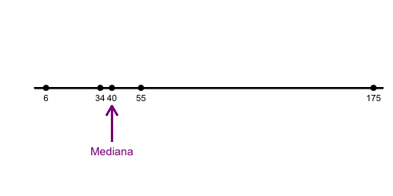
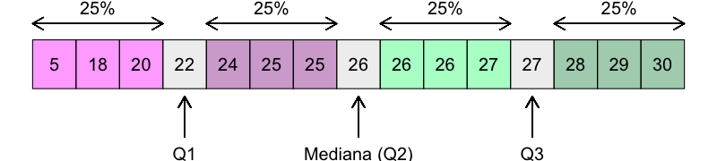
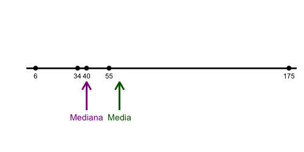
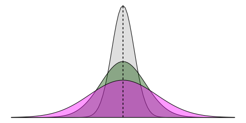
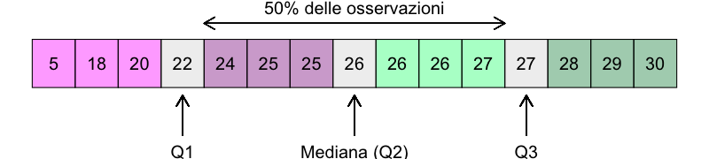
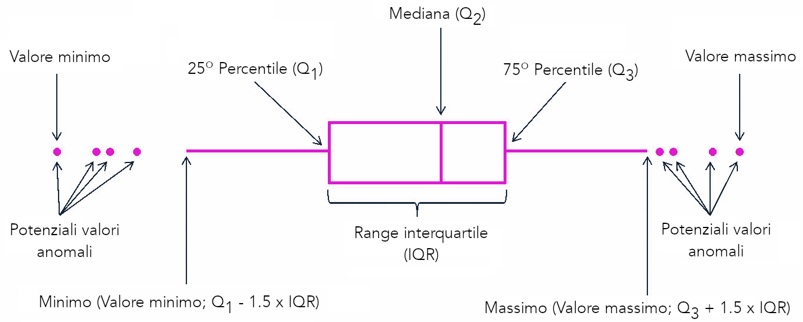
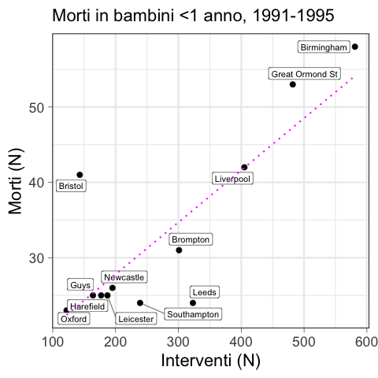

<!-- ### Lezione 5 -->
# La statistica descrittiva
## (Parte II: Le variabili numeriche)
## &nbsp;

---
## Obiettivi di apprendimento

- Saper calcolare e interpretare misure di centralit&agrave;, dispersione e correlazione
- Saper visualizzare dati numerici
- Saper interpretare tabelle e figure in articoli scientifici

---
## Le fasi della ricerca

Spiegelhalter, D., *The Art of Statistics: Learning From Data*, Pelican, 2019

---
## Misure di centralit&agrave; e dispersione

<!--   Per le variabili quantitative è necessario descrivere i dati raccolti anche numericamente… Poiché generalmente il problema è che i dati sono tanti, può risultare più semplice sintetizzarli e ridurli a pochi numeri, più facili da comprendere, utilizzare e comunicare.

Le tabelle di frequenza dopo una procedura di discretizzazione non sono pero' il modo piu' consono per rappresentare i dati quantitativi. E' meglio usare

Tendenza centrale (o posizione) -> Individuano il valore intorno al quale i dati sono raggruppati

Dispersione o variabilita'  -> Forniscono un’indicazione della dispersione delle osservazioni intorno al valore centrale -->

---
## Misure di centralit&agrave;: la moda

:dart: &nbsp;&nbsp;&nbsp; L'elemento pi&ugrave; frequente

:pushpin: &nbsp;&nbsp;&nbsp; $x= \{1, 1, 1, 3, 4, 4, 7, 8, 8, 9, 9\}$
&nbsp;&nbsp;&nbsp;&nbsp;&nbsp;&nbsp;&nbsp;&nbsp; $\text{moda}(x)=1$

---
### Esercizio #1

:question: &nbsp;&nbsp;&nbsp; Qual &egrave; la moda dei seguenti insiemi?

&nbsp;&nbsp;&nbsp;&nbsp;&nbsp;&nbsp;&nbsp;&nbsp;  $y= \{1, 1, 1, 3, 4, 4, 4, 7, 8, 8, 9, 9\}$
&nbsp;&nbsp;&nbsp;&nbsp;&nbsp;&nbsp;&nbsp;&nbsp; $\text{moda}(y)= \text{ } ?$

&nbsp;&nbsp;&nbsp;&nbsp;&nbsp;&nbsp;&nbsp;&nbsp;  $z= \{1, 3, 4, 7, 8, 9, 11, 17, 21, 42\}$
&nbsp;&nbsp;&nbsp;&nbsp;&nbsp;&nbsp;&nbsp;&nbsp; $\text{moda}(z)= \text{ } ?$

---
## Misure di centralit&agrave;: la mediana

:dart: &nbsp;&nbsp;&nbsp;Il valore "in mezzo"

:warning: I dati devono essere ordinati!

<!-- Divide l'insieme di dati in due parti uguali, con il numero osservazioni <= mediana uguale a quello >= 

Quando il numero di osservazioni e' pari, ci sono due valori mediani, e in questo caso si prende la loro media aritmetica
-->

---
### Esercizio #2

:question: &nbsp;&nbsp;&nbsp; Quali sono le mediane di questi insiemi?

&nbsp;&nbsp;&nbsp;&nbsp;&nbsp;&nbsp;&nbsp;&nbsp;  $y= \{6, 34, 40, 55, 75\}$ 
&nbsp;&nbsp;&nbsp;&nbsp;&nbsp;&nbsp;&nbsp;&nbsp; $\text{mediana}(y)= \text{ ?}$ 

&nbsp;&nbsp;&nbsp;&nbsp;&nbsp;&nbsp;&nbsp;&nbsp; $z= \{6, 34, 40, 55, 175\}$
&nbsp;&nbsp;&nbsp;&nbsp;&nbsp;&nbsp;&nbsp;&nbsp; $\text{mediana}(z)=\text{ ?}$ 

---
## Mediana e valori anomali

---
## Quartili

<!-- Mentre la mediana divide i dati in due meta' esatte, molto usati sono anche i quartili, che dividono i dati in 4 parti uguali -->

:warning: I dati devono essere ordinati!

<!-- I quartili sono robusti rispetto ai valori anomal, anche se l'ultimo fosse 1000 e il primo -1000 non cambierebbero -->

---
## Misure di centralit&agrave;: la media

:dart: &nbsp;&nbsp;&nbsp; Media aritmetica

$$
{\bar {x}}= {\frac {1}{n}}\left(\sum _{i=1}^{n}{x_{i}}\right)=
{\frac {x_{1}+x_{2}+\dots +x_{n}}{n}}
$$

:pushpin: &nbsp;&nbsp;&nbsp;  $x= \{4, 36, 45, 50, 75\}$ 

&nbsp;&nbsp;&nbsp;&nbsp;&nbsp;&nbsp;&nbsp;&nbsp; ${\bar {x}} = {\frac{1}{n}}\left(\sum _{i=1}^{n}{x_{i}}\right) = \frac{4 + 36 + 45 + 50 + 75}{5} = 42$

<!-- Somma dei singoli valori diviso il numero di osservazioni 

in generla la media e' la misura piu' usata per descrivere la tendenza centrale per la sua unicita' (c'e' solo una media) e semplicita'
 -->

---
### Esercizio #3

:question: &nbsp;&nbsp;&nbsp; Quali sono le medie di questi insiemi?

&nbsp;&nbsp;&nbsp;&nbsp;&nbsp;&nbsp;&nbsp;&nbsp;  $y= \{6, 34, 40, 55, 75\}$ 
&nbsp;&nbsp;&nbsp;&nbsp;&nbsp;&nbsp;&nbsp;&nbsp; ${\bar {y}} = \text{ ?}$

&nbsp;&nbsp;&nbsp;&nbsp;&nbsp;&nbsp;&nbsp;&nbsp; $z= \{6, 34, 40, 55, 175\}$ 
&nbsp;&nbsp;&nbsp;&nbsp;&nbsp;&nbsp;&nbsp;&nbsp; ${\bar {z}} = \text{ ?}$

---
## Media e valori anomali

---
## La forma delle distribuzioni

<!-- La posizione di moda media e mediana va a definire anche quella che e' la forma della distribuzione, che descrive come una Distribuzione empirica e/o Di- stribuzione di popolazione si distribuisce. 

Si dice che una distribuzione abbia una forma simmetrica quando Moda, Mediana e Media coincidono e dividono la distribuzione stessa in due parti identiche. 

Qualora que- sta condizione non si verificasse, la forma della distribuzione viene detta asimmetrica. 
Una distribuzione asimmetrica positiva `e caratterizzata da una curva in cui i valori sono raggruppati nella parte sinistra, con una lunga coda a destra (anche detta: asimmetrica a destra). 
Viceversa, una distribuzione asimmetrica negativa `e caratterizzata da una curva in cui i valori sono raggruppati nella parte destra, con una lunga coda a sinistra (anche detta: asimmetrica a sinistra). --->

---
## La forma delle distribuzioni

<!-- Si dice che una distribuzione sia bi- o multi-modale quando presenta due o piu` gobbe corrispondenti ai diversi valori che la moda puo` assumere nel campione.
 -->

---
### Esercizio 4

:question: &nbsp;&nbsp;&nbsp; Nei risultati di uno studio è riportata la seguente frase:

&nbsp;&nbsp;&nbsp;&nbsp;&nbsp;&nbsp;&nbsp;&nbsp; *The mean length of stay was 22.4 days (median: 14 days).*

&nbsp;&nbsp;&nbsp;&nbsp;&nbsp;&nbsp;&nbsp;&nbsp; La distribuzione empirica ha una forma...

&nbsp;&nbsp;&nbsp;&nbsp;&nbsp;&nbsp;&nbsp;&nbsp; a) simmetrica
&nbsp;&nbsp;&nbsp;&nbsp;&nbsp;&nbsp;&nbsp;&nbsp; b) asimmetrica a destra 
&nbsp;&nbsp;&nbsp;&nbsp;&nbsp;&nbsp;&nbsp;&nbsp; c) asimmetrica a sinistra
&nbsp;&nbsp;&nbsp;&nbsp;&nbsp;&nbsp;&nbsp;&nbsp; d) nessuna delle precedenti

---
## Misure di dispersione

---
## Misure di dispersione

---
## Misure di dispersione: range

:dart: &nbsp;&nbsp;&nbsp; ${\text{range}(x)}= \text{max}(x)-\text{min}(x)$

&nbsp;&nbsp;&nbsp;&nbsp;&nbsp;&nbsp;&nbsp;&nbsp; $\text{range}(x)= 9754-2830=6924$

<!-- INTERVALLO di VARIAZIONE. Il range pero' si basa solo sui due valori estremi, senza indicare come si distribuiscono i dati entro l’intervallo 

piu; semplice, meno informativo  Il range ha tuttavia un'utilita' limitata: tiene conto solo di due valori, e non e' robusta quando ci sono valori anomali 

 Non fornisce però informazioni sulla distribuzione delle osservazioni: non è ad esempio possibile capire se i valori siano dispersi o raggruppati in un’estremità…

14 osservazioni
-->

---
## Misure di dispersione: range interquantile

:dart: &nbsp;&nbsp;&nbsp; ${\text{IQR}(x)}= \text{Q3}(x)-\text{Q1}(x)$

<!-- Robusto rispetto agli outliers -->

---
## Misure di dispersione: varianza

<!-- Misura la distanza media tra le osservazioni e la media del campione. Piu' bassa e' la varianza, piu' le osservazioni saranno vicine alla media  -->

---
## Misure di dispersione: varianza

:dart: &nbsp;&nbsp;&nbsp; $s^2 = \frac{1}{n-1}\sum _{i=1}^{n}(x_{i}-\bar {x} )^{2}$

&nbsp;&nbsp;&nbsp;&nbsp;&nbsp;&nbsp;&nbsp;&nbsp; dove &nbsp;&nbsp;&nbsp; ${\bar {x}}= {\frac {1}{n}}\left(\sum _{i=1}^{n}{x_{i}}\right)$ 

:pushpin: &nbsp;&nbsp;&nbsp;  $x= \{1, 2, 3\}$ &nbsp;&nbsp;&nbsp; $\bar{x}=\frac{1+2+3}{3}=2$

&nbsp;&nbsp;&nbsp;&nbsp;&nbsp;&nbsp;&nbsp;&nbsp; $s = \frac{1}{3-1}\times [(1-2)^2+ (2-2)^2+(3-2)^2] =$
&nbsp;&nbsp;&nbsp;&nbsp;&nbsp;&nbsp;&nbsp;&nbsp;&nbsp;&nbsp;&nbsp;&nbsp; $= \frac{1}{2}\times [1^2+ 0^2+1^2 ]=  \frac{1}{2}\times 2 = 1$

<!-- Andiamo a fare la distanza (differenza) tra ciascun valore e la media, la eleviamo al quatrato, la sommiamo e andiamo a dividerla per la dimensione del campione - 1 -->

---
## Misure di dispersione: deviazione standard

:dart: &nbsp;&nbsp;&nbsp; $s = \sqrt{s^2} = \sqrt {{\frac {1}{n-1}}\sum _{i=1}^{n}(x_{i}-\bar {x} )^{2}}$

&nbsp;&nbsp;&nbsp;&nbsp;&nbsp;&nbsp;&nbsp;&nbsp; dove &nbsp;&nbsp;&nbsp; ${\bar {x}}= {\frac {1}{n}}\left(\sum _{i=1}^{n}{x_{i}}\right)$ 

:pushpin: &nbsp;&nbsp;&nbsp;  $x= \{1, 2, 3\}$ &nbsp;&nbsp;&nbsp; $\bar{x}=\frac{1+2+3}{3}=2$

&nbsp;&nbsp;&nbsp;&nbsp;&nbsp;&nbsp;&nbsp;&nbsp; $s = \sqrt {\frac{1}{3-1}\times [(1-2)^2+ (2-2)^2+(3-2)^2] }=$
&nbsp;&nbsp;&nbsp;&nbsp;&nbsp;&nbsp;&nbsp;&nbsp;&nbsp;&nbsp;&nbsp;&nbsp; $= \sqrt {\frac{1}{2}\times [1^2+ 0^2+1^2 }]= \sqrt {\frac{1}{2}\times 2}= \sqrt {1} = 1$

<!-- che nella varianza l'unità di misura è diversa da quella della variabile su cui è calcolata (abbiamo fatto il quadrato delle differenze, ricordate?), si utilizza la sua radice quadrata detta SCARTO QUADRATICO MEDIO o deviazione standard.

Esempio lunghezza della degenza, giorni e giorni^2

Ci dice la distanza tipica di tutte le misurazioni dalla media
 -->

---
### Esercizio #5

:question: &nbsp;&nbsp;&nbsp; Il range &egrave; sensibile alla posizione centrale della distribuzione empirica
&nbsp;&nbsp;&nbsp;&nbsp;&nbsp;&nbsp;&nbsp;&nbsp; a) Vero  &nbsp;&nbsp;&nbsp;&nbsp; b) Falso 

:question: &nbsp;&nbsp;&nbsp; La mediana si calcola sommando i valori e dividendoli per il loro numero
&nbsp;&nbsp;&nbsp;&nbsp;&nbsp;&nbsp;&nbsp;&nbsp; a) Vero  &nbsp;&nbsp;&nbsp;&nbsp; b) Falso &nbsp;&nbsp;&nbsp;&nbsp; 

:question: &nbsp;&nbsp;&nbsp; La mediana &egrave; il valore che ha met&agrave; dei dati inferiori e met&agrave; superiori a esso
&nbsp;&nbsp;&nbsp;&nbsp;&nbsp;&nbsp;&nbsp;&nbsp; a) Vero  &nbsp;&nbsp;&nbsp;&nbsp; b) Falso &nbsp;&nbsp;&nbsp;&nbsp; 

:question: &nbsp;&nbsp;&nbsp; La mediana, rispetto alla media, &egrave; pi&ugrave; sensibile ai valori estremi
&nbsp;&nbsp;&nbsp;&nbsp;&nbsp;&nbsp;&nbsp;&nbsp; a) Vero  &nbsp;&nbsp;&nbsp;&nbsp; b) Falso &nbsp;&nbsp;&nbsp;&nbsp; 

:question: &nbsp;&nbsp;&nbsp; Due distribuzioni con la stessa media hanno la stessa deviazione standard
&nbsp;&nbsp;&nbsp;&nbsp;&nbsp;&nbsp;&nbsp;&nbsp; a) Vero  &nbsp;&nbsp;&nbsp;&nbsp; b) Falso &nbsp;&nbsp;&nbsp;&nbsp; 

--- 
## I valori estremi

Reilly, J. *et al.*. *Procedure‐Specific Surgical Site Infection Rates and Postdischarge Surveillance in Scotland*,  Infection Control and Hospital Epidemiology, 2006, doi:10.1086/509839  

<!-- Scelta della misura di tendenza centrale
- media se la distribuzione è simmetrica
- mediana se la distribuzione NON è simmetrica (forse a causa di valori estremi)
- moda per indicare il valore più comune nell’ambito della distribuzione  (ma come accennavo piu' usato nel caso di variabile categoriche)

Inoltre, Se la numerosità del campione è piccola, la mediana e il range interquartile sono misure più robuste
-->

---
### Esercizio #6

:question: &nbsp;&nbsp;&nbsp; Nei risultati di uno studio è riportata la seguente frase:

&nbsp;&nbsp;&nbsp;&nbsp;&nbsp;&nbsp;&nbsp;&nbsp; *Coronary-artery calcium scores averaged 68.9&plusmn;244.2 (range 0 
&nbsp;&nbsp;&nbsp;&nbsp;&nbsp;&nbsp;&nbsp;&nbsp; to 1526) in  patients and 8.8&plusmn;41.8 (range 0 to 243.4) in controls.*

&nbsp;&nbsp;&nbsp;&nbsp;&nbsp;&nbsp;&nbsp;&nbsp; Come descrivereste in Table 1 questa variabile?

&nbsp;&nbsp;&nbsp;&nbsp;&nbsp;&nbsp;&nbsp;&nbsp; a) con media e deviazione standard
&nbsp;&nbsp;&nbsp;&nbsp;&nbsp;&nbsp;&nbsp;&nbsp; b) con mediana e interquantile range 
&nbsp;&nbsp;&nbsp;&nbsp;&nbsp;&nbsp;&nbsp;&nbsp; c) con mediana e deviazione standard
&nbsp;&nbsp;&nbsp;&nbsp;&nbsp;&nbsp;&nbsp;&nbsp; d)  non ho abbastanza elementi per decidere

---
### Esercizio #7

Sikich, L. *et al.*, *Intranasal Oxytocin in Children and Adolescents with Autism Spectrum Disorder*, NEJM, 2021

:question: &nbsp;&nbsp;&nbsp; Qual &egrave; la percentuale di bambine e 
&nbsp;&nbsp;&nbsp;&nbsp;&nbsp;&nbsp;&nbsp;&nbsp; ragazze nel gruppo di intervento?

&nbsp;&nbsp;&nbsp;&nbsp;&nbsp;&nbsp;&nbsp;&nbsp; a) 13%
&nbsp;&nbsp;&nbsp;&nbsp;&nbsp;&nbsp;&nbsp;&nbsp; b) 12%
&nbsp;&nbsp;&nbsp;&nbsp;&nbsp;&nbsp;&nbsp;&nbsp; c) 18%
&nbsp;&nbsp;&nbsp;&nbsp;&nbsp;&nbsp;&nbsp;&nbsp; d) 17%
&nbsp;&nbsp;&nbsp;&nbsp;&nbsp;&nbsp;&nbsp;&nbsp; e) Non &egrave; possibile capirlo dalla tabella 

---
### Esercizio #8

Sikich, L. *et al.*, *Intranasal Oxytocin in Children and Adolescents with Autism Spectrum Disorder*, NEJM, 2021

:question: &nbsp;&nbsp;&nbsp; In questo studio, l'et&agrave; &egrave; stata raccolta 
&nbsp;&nbsp;&nbsp;&nbsp;&nbsp;&nbsp;&nbsp;&nbsp; come una variabile...

&nbsp;&nbsp;&nbsp;&nbsp;&nbsp;&nbsp;&nbsp;&nbsp; a) categorica
&nbsp;&nbsp;&nbsp;&nbsp;&nbsp;&nbsp;&nbsp;&nbsp; b) ordinale
&nbsp;&nbsp;&nbsp;&nbsp;&nbsp;&nbsp;&nbsp;&nbsp; c) numerica
&nbsp;&nbsp;&nbsp;&nbsp;&nbsp;&nbsp;&nbsp;&nbsp; d) non &egrave; possibile dirlo  

---
### Esercizio #9

Sikich, L. *et al.*, *Intranasal Oxytocin in Children and Adolescents with Autism Spectrum Disorder*, NEJM, 2021

:question: &nbsp;&nbsp;&nbsp; Qual &egrave; l’et&agrave; media dei pazienti nel  
&nbsp;&nbsp;&nbsp;&nbsp;&nbsp;&nbsp;&nbsp;&nbsp; gruppo di controllo?

&nbsp;&nbsp;&nbsp;&nbsp;&nbsp;&nbsp;&nbsp;&nbsp; a) 10.4
&nbsp;&nbsp;&nbsp;&nbsp;&nbsp;&nbsp;&nbsp;&nbsp; b) 4.1
&nbsp;&nbsp;&nbsp;&nbsp;&nbsp;&nbsp;&nbsp;&nbsp; c) 4.0
&nbsp;&nbsp;&nbsp;&nbsp;&nbsp;&nbsp;&nbsp;&nbsp; d) Non &egrave; possibile capirlo dalla tabella 

---

# La visualizzazione dei dati numerici
 

---
## Istogramma

 
Visconti A., *et al.*, *Total serum *N*‐glycans associate with response to immune checkpoint inhibition therapy and survival in patients with advanced melanoma*, BMC Cancer, 2023 doi:10.1186/s12885-023-10511-3

<!-- Un istogramma prende in input una variabile numerica che viene discretizzata in classi (o bins)
and the number of observation per bin is represented by the height of the bar.
.
Play with the bin size, it can give different insight.
 -->

---
## Istogramma

 
Visconti A., *et al.*, *Total serum *N*‐glycans associate with response to immune checkpoint inhibition therapy and survival in patients with advanced melanoma*, BMC Cancer, 2023 doi:10.1186/s12885-023-10511-3

<!-- 
Play with the bin size, it can give different insight.

Avoid filling with color palettes. anche se 
 -->

---
## Istogramma

 
Visconti A., *et al.*, *Total serum *N*‐glycans associate with response to immune checkpoint inhibition therapy and survival in patients with advanced melanoma*, BMC Cancer, 2023 doi:10.1186/s12885-023-10511-3

<!--  il colore e' utile per rappresentare la distribution of several variable on the same axis , cosa possibile using this technique.

Anche se a volte pou' essere confuso
 -->

---
## Miami plot/Mirror histogram

 
Visconti A., *et al.*, *Total serum *N*‐glycans associate with response to immune checkpoint inhibition therapy and survival in patients with advanced melanoma*, BMC Cancer, 2023 doi:10.1186/s12885-023-10511-3

<!-- No legenda, uso i colori, ho fissato gli assi 
Ovviamente si puo' usare solo se ci sono due variabili, ne avessimo 3 o piu' ricadremmo nel caso precedente
-->

---
## Boxplot

https://r-graph-gallery.com/boxplot

<!-- o box and whiskers plot, o diagramma a scatola e baffi o diagram- ma degli estremi e dei quartili, `e una rappresentazione grafica utilizzata per descrivere la distribuzione di una Variabile continua o una Variabi- le discreta utilizzando sia indici di dispersione (Inter-quartile range) sia di posizione (Mediana e Quartile). Viene rappresentato da un rettangolo (box) e da due segmenti (whiskers o baffi). Il rettangolo `e delimitato dal primo e dal terzo quartile e diviso al suo interno dalla mediana (o secondo quartile). La lunghezza dei segmenti rappresenta 1.5 volte l’interquarti- le range. I punti oltre il segmento rappresentano dei (possibili) Valori estremi. 

Non usare colori
-->

---
## Boxplot

 
Visconti A., *et al.*, Total serum *N*‐glycans associate with response to immune checkpoint inhibition therapy and survival in patients with advanced melanoma, BMC Cancer, 2023 doi:10.1186/s12885-023-10511-3

<!-- 
Boxplot hides the sample size of each group, show it with annotation or box width.

Boxplot hides the underlying distribution. Use jitter if low number of data points, or use violin with bigger data.
 -->

---
## Boxplot

https://nightingaledvs.com/ive-stopped-using-box-plots-should-you/

<!-- 
Boxplot hides the sample size of each group, show it with annotation or box width.

Boxplot hides the underlying distribution. Use jitter if low number of data points, or use violin with bigger data.
 -->

---
## Boxplot

 
Visconti A., *et al.*, *Total serum *N*‐glycans associate with response to immune checkpoint inhibition therapy and survival in patients with advanced melanoma*, BMC Cancer, 2023 doi:10.1186/s12885-023-10511-3

<!-- Boxplot hides the sample size of each group, show it with annotation or box width.

Boxplot hides the underlying distribution. Use jitter if low number of data points, or use violin with bigger data. Leggermente bimodale -->

---
### Esercizio #10

Quanti partner (etero)sessuali le persone in Gran Bretagna riferiscono di aver avuto nella loro vita?

<!-- The purpose of this question is not simply to be nosey about people’s private lives. When AIDS first became a serious concern in the 1980s, public health officials realized that there was no reliable evidence about sexual behaviour in Britain, particularly in terms of the frequency with which people changed partners, how many had multiple simultaneous partners, and what sexual practices people engaged in. This knowledge was essential to predict the spread of sexually transmitted diseases through society and to plan health services

resulting in the National Sexual Attitudes and Lifestyle Survey (Natsal) which has been carried out in the UK every ten years since 1990.
 -->

---
### Esercizio #10

Quanti partner (etero)sessuali le persone in Gran Bretagna riferiscono di aver avuto nella loro vita?

 

:question: &nbsp;&nbsp;&nbsp; Cosa ci dicono 
&nbsp;&nbsp;&nbsp;&nbsp;&nbsp;&nbsp;&nbsp;&nbsp; queste statistiche? 

|  | Uomini 35-44 | Donne 35-44 |
| ----: | -----: | ----: |
| Moda | 1 | 1  |
| Range | 0-500 | 0-550  |
| Media |  14.3 | 8.5 | 
| SD | 24.2 | 19.7  | 
| Mediana |  8 | 5  | 
| IQR | 4-18 | 3-10  |

	
<!-- The third survey, known as Natsal-3, was carried out around 2010. Table 2.2 shows the summary statistics concerning the number of (opposite-sex) sexual partners reported by people aged 35–44 in Natsal-3. 

 It is a good exercise to use these summaries alone to try to reconstruct what the pattern of data might look like.
-->

---
### Esercizio #10 (bis)

:question: &nbsp;&nbsp;&nbsp; Il grafico della distribuzione conferma quello che abbiamo detto? 
&nbsp;&nbsp;&nbsp;&nbsp;&nbsp;&nbsp;&nbsp;&nbsp; Aggiunge informazione? 

Spiegelhalter, D., *The Art of Statistics: Learning From Data*, Pelican, 2019

<!-- ---
Bimps sulle decine, asimmetrica
Multimodale, particolarmente accentuato sull'1 -->

---
### La relazione tra due variabili numeriche

Cosa &egrave; successo ai bambini sottoposti a interventi cardiochirugici in alcuni ospedali britannici tra il 1984 e il 1995?

Hospital | Operations | Survivors | Deaths | 30-day Survival (%) | Dying (%) |
----:    | ----: | ----: | ----: | ----: | ----: |
Bristol |        143 |       102 |     41 |              71.3 |            28.7 |
Leicester |        187 |       162 |     25 |              86.6 |            13.4 |
Leeds |        323 |       299 |     24 |              92.6 |             7.4 |
Oxford |        122 |        99 |     23 |              81.1 |            18.9 |
Guys |        164 |       139 |     25 |              84.8 |            15.2 |
Liverpool |        405 |       363 |     42 |              89.6 |            10.4 |
Southampton |        239 |       215 |     24 |              90.0 |            10.0 |
Great Ormond St |        482 |       429 |     53 |              89.0 |            11.0 |
Newcastle |        195 |       169 |     26 |              86.7 |            13.3 |
Harefield |        177 |       152 |     25 |              85.9 |            14.1 |
Birmingham |        581 |       523 |     58 |              90.0 |            10.0 |
Brompton |        301 |       270 |     31 |              89.7 |            10.3 |

D.J. Spiegelhalter *et al.*, *Commissioned Analysis of Surgical Performance Using Routine Data:   Lessons from the Bristol Inquiry*, 2002, Journal of the Royal Statistical Society Series A: Statistics in Society

<!-- Public concern did not die down, and an official inquiry was ordered: this brought in a team of statisticians who were given the grim task of comparing the survival rates in Bristol with elsewhere in the UK between 1984 and 1995. 

Sto mostrando sia morti che sopravvissuti per evirare positive/negative framing, che abbiamo visto nella lezione introduttiva

Non facile da capire cosa succede, una tabella con molte righe e colonne
 -->

---
## Visualizziamo di dati

<!-- Come si chiama questa rappresentazione grafica? 
Istogramma 

- label lunghe, meglio in orizzontale
- ordinati per frequenza, cosi' a colpo d'occhio si capisce chi ha piu' o meno morti

Da questo plot, sembrerebbe che Bristol non sia il posto piu' problematico
-->

---
## Visualizziamo di dati

<!-- 
Andiamo ora a metterci il numero totale di interventi

Qui si vede gia' la differenza con Bristol. 
Notate che questa volta li ho ordinati secondo l'ordine utilizzato nel primo plot, per facilitare la comparazione.

Da questa doppia visualizzazione sembrerebbe che ci sia anche una relazione tra le due variabili: piu' unterventi si fanno, piu' morti ci sono

Ma c'e' una visualizzazione (e una statistica) migliore che mi per riassumere questi due aspetti
 -->

---
### La relazione tra due variabili numeriche

Pearson's correlation coefficient

* $\rho = 0.82$
* $\rho_\text{no Bristol} = 0.93$

<!-- 
A scatterplot displays the relationship between 2 numeric variables. For each data point, the value of its first variable is represented on the X axis, the second on the Y axis
Notare assi non a zero. Per lo scatter va bene.

Correlazione `e una relazione tra due variabili in cui a ciascun valore di una corrisponda un valore dell’altra. 
Pearson correlation coefficient o indice di correlazione di Pearson, `e un in- dice che misura l’esistenza di una relazione lineare (o Correlazione) tra due variabili. Ha un valore compreso tra +1 e −1 , dove +1 corrispon- de alla perfetta correlazione lineare positiva, 0 corrisponde a un’assenza di correlazione lineare e −1 corrisponde alla perfetta correlazione lineare negativa.

There is a considerable interest in the so-called ‘volume effect’ in surgery – the claim that busier hospitals get better survival rates, possibly since they achieve greater efficiency and have more experience.

Attenzione alla causalita':
Osservare una correlazione non implica un nesso di Causalit`a ma segnala la tendenza di una variabile a cambiare in funzione dell’altra (“correlazione non significa causazione”). 
- the high correlation showed that bigger hospitals were associated with lower mortality. But we could not conclude that bigger hospitals caused the lower mortality.
- piccoli ospedali hanno magari casi piu' semplici, che spiegano Leeds & Co 
- oppure better hospitals simply attracted more patients.

launched an investigation after complaints from Joshua’s and other bereaved parents, and in 1998 two surgeons and the ex-chief executive were found guilty of serious medical misconduct. 
-->

---
## Correlazione & valori estremi

Pearson's correlation coefficient

- $\rho = 0.72$

<!-- Lillard 1.88
Adetokumbo 2.11 -->

---
## Correlazione & valori estremi

Pearson's correlation coefficient

- $\rho = 0.72$
- $\rho_\text{no outliers} = 0.07$

---
## Perch&eacute; visualizzare i dati?

  <b>Datasaurus Dozen</b>,  Matejka, J &; Fitzmaurice, G. *Same Stats, Different Graphs: Generating Datasets with Varied Appearance and Identical Statistics through Simulated Annealing*, Proceedings of the 2017 CHI Conference on Human Factors in Computing Systems, doi:10.1145/3025453.3025912

---
## Parametri *vs*&nbsp; statistiche

|  | Parametro | Statistica |
| ----: | :-----: | :----: | 
| Numerosit&agrave; | $N$ | $n$ |
| Media | $\mu$ | $\bar{x}$ |
| Deviazione Standard | $\sigma$ | $s$ |
| Proporzione | $\pi$ | $p$ |

---
### Esercizio #11

:question: &nbsp;&nbsp;&nbsp; La media nella popolazione viene indicata con...

&nbsp;&nbsp;&nbsp;&nbsp;&nbsp;&nbsp;&nbsp;&nbsp; a) M 
&nbsp;&nbsp;&nbsp;&nbsp;&nbsp;&nbsp;&nbsp;&nbsp; b) m
&nbsp;&nbsp;&nbsp;&nbsp;&nbsp;&nbsp;&nbsp;&nbsp; c) $\mu$
&nbsp;&nbsp;&nbsp;&nbsp;&nbsp;&nbsp;&nbsp;&nbsp; d) $\bar{x}$ 

---
### Cosa abbiamo imparato in questa lezione?

<!--  -->

- Le variabili numeriche possono essere rappresentate con misure di centralit&agrave;, dispersione e correlazione (statistiche)
- Alcune statistiche sono "falsate" se le distribuzioni empiriche sono asimmetriche e/o includono valori estremi
- Le statistiche possono nascondere dettagli importanti dei dati
- Le variabili numeriche possono essere rappresentate graficamente in diversi modi, ma alcune rappresentazioni possono nascondere dettagli importanti delle distribuzioni sottostanti
- Visualizzare i dati &egrave; importante per interpretarli
- Il campione viene rappresentato con le statistiche, la popolazione con i parametri

