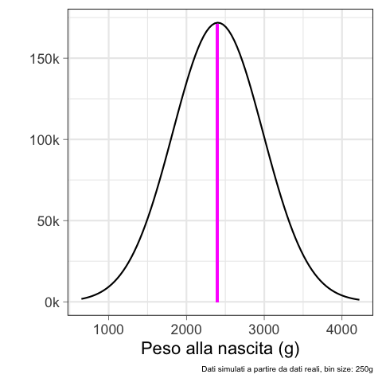
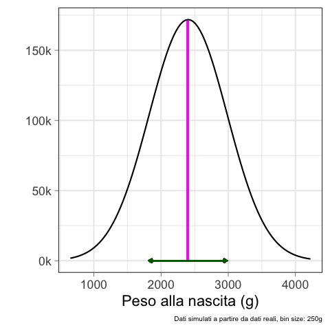
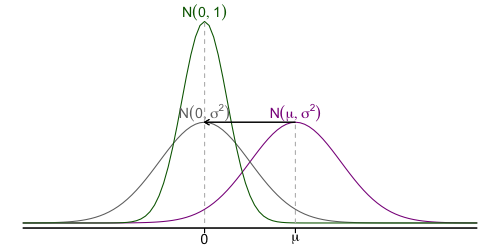
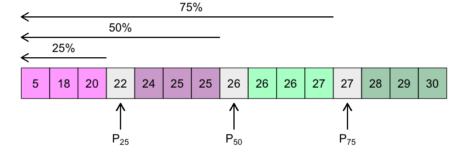

<!-- ### Lezione 6 -->
# La distribuzione Normale
## &nbsp;

---
## Obiettivi di apprendimento

- Conoscere le caratteristiche della distribuzione Normale e Normale Standardizzata
- Calcolare e intepretare lo $z$-score
- Calcolare la proporzione di individui in una popolazione con una determinata caratteristica
- Calcolare la probabilit&agrave; di avere degli individui in una popolazione con una determinata caratteristica

---
## Le fasi della ricerca

Spiegelhalter, D., *The Art of Statistics: Learning From Data*, Pelican, 2019

<!-- We see that the measures used to summarize data sets in Chapter 2 can be applied as descriptions of a population too – the difference is that terms such as mean and standard deviation are known as statistics when describing a set of data, and parameters when describing a population. -->

---
## La distribuzione della popolazione

Qual &egrave; la distribuzione del peso alla nascita per i gemelli inglesi?

<!-- We have already discussed the concept of a data distribution – the pattern the data makes, sometimes known as the empirical or sample distribution. Next we must tackle the concept of a population distribution – the pattern in the whole group of interest.

Supponiamo di voler sapere qual e' il peso alla nascita dei gemelli, mono e di zigoti inglesi. 
 -->

---
## La distribuzione della popolazione

Qual &egrave; la distribuzione del peso alla nascita per i gemelli inglesi?

$N=1 \text{M}$
$mediana = 2408\text{ g}$
$\mu = 2404\text{ g}; \text{ } \sigma = 580\text{ g}$

<!-- The population distribution is the pattern made by the birth weights of all these babies, which we can obtain from TwinsUK data on the weights for 1M twins born in the UK from 1917 to 1998 to non-Hispanic white women – although this is not the entire set of twin births, it is such a large sample that we can take it as the population. (sono dati simulati a partire da dati reali) -->

---
## La distribuzione della popolazione

Qual &egrave; la distribuzione del peso alla nascita per i gemelli inglesi?

$N=1 \text{M}$
$mediana = 2408\text{ g}$
$\mu = 2404\text{ g}; \text{ } \sigma = 580\text{ g}$

<!-- The shape of this distribution is important. Measurements such as weight, income, height, and so on can, at least in principle, be as fine-grained as desired, and so can be considered ‘continuous’ quantities whose population distributions are smooth. The classic example is the ‘bell-shaped curve’, or normal distribution, first explored in detail by Carl Friedrich Gauss.

Theory shows that the normal distribution can be expected to occur for phenomena that are driven by large numbers of small influences, for example a complex physical trait that is not influenced by just a few genes. 

Figure shows a normal curve with the same mean and standard deviation as the recorded weights. The smooth normal curve and the histogram are gratifyingly close, and other complex traits such as height and cognitive skills also have approximately normal population distributions. 
-->

---
## La distribuzione Normale

- $\mathcal{N} = (\mu, \sigma^2)$
- $\text{moda} \equiv \text{media} \equiv \text{mediana}$
- Simmetrica

<!-- The normal distribution is characterized by its mean, or expectation, and its standard deviation.

It is an impressive achievement to be able to summarize over a million births by just these two quantities. 
 -->

---
## La distribuzione Normale

- Area sottesa alla curva $= 1$
- proporzione $\equiv$ probabilit&agrave;

$\text{neonati di peso molto basso se} < 1500 \text{ g}$
$\text{ neonati di peso molto basso} = 6\%$
$\mathcal{P}(\text{neonati di peso molto basso}) = 0.06$

<!-- il fatto che l'area e' 1 dipende dal fatto che la normale sia una distribuzione di probabilita'

For medical rather than statistical reasons, babies below 1,500 g ‘very low birth weight’. Figure 3.2(d) shows that we would expect 6% of babies in this group to be very low birth weight – in fact the actual number is ~74K (0.7%), in close agreement with the prediction from the normal curve. 

 -->

---
### Esercizio #1

:question: &nbsp;&nbsp;&nbsp; Qual &egrave; la curva con la media
&nbsp;&nbsp;&nbsp;&nbsp;&nbsp;&nbsp;&nbsp;&nbsp; pi&ugrave; grande?

&nbsp;&nbsp;&nbsp;&nbsp;&nbsp;&nbsp;&nbsp;&nbsp; a) Verde
&nbsp;&nbsp;&nbsp;&nbsp;&nbsp;&nbsp;&nbsp;&nbsp; b) Blu
&nbsp;&nbsp;&nbsp;&nbsp;&nbsp;&nbsp;&nbsp;&nbsp; c) Gialla
&nbsp;&nbsp;&nbsp;&nbsp;&nbsp;&nbsp;&nbsp;&nbsp; d) Non lo posso sapere
&nbsp;&nbsp;&nbsp;&nbsp;&nbsp;&nbsp;&nbsp;&nbsp; e) Nessuna delle precedenti

---
### Esercizio #2

:question: &nbsp;&nbsp;&nbsp; Qual &egrave; la curva con la  
&nbsp;&nbsp;&nbsp;&nbsp;&nbsp;&nbsp;&nbsp;&nbsp; deviazione standard pi&ugrave; grande?

&nbsp;&nbsp;&nbsp;&nbsp;&nbsp;&nbsp;&nbsp;&nbsp; a) Verde
&nbsp;&nbsp;&nbsp;&nbsp;&nbsp;&nbsp;&nbsp;&nbsp; b) Blu
&nbsp;&nbsp;&nbsp;&nbsp;&nbsp;&nbsp;&nbsp;&nbsp; c) Gialla
&nbsp;&nbsp;&nbsp;&nbsp;&nbsp;&nbsp;&nbsp;&nbsp; d) Non lo posso sapere
&nbsp;&nbsp;&nbsp;&nbsp;&nbsp;&nbsp;&nbsp;&nbsp; e) Nessuna delle precedenti

---
## La distribuzione Normale

- Regola del 3 $\sigma$:
  - 68% dei valori osservati sono a 1 $\sigma$ dalla media
  - 95% sono a 2 $\sigma$
  - 99.7% sono a 3 $\sigma$
  

- Regola empirica:
  - valori $< 2 \sigma$ sono *"comuni"*
  - valori $> 2 \sigma$ sono *"inusuali"*  
  - valori $> 3 \sigma$ sono *"estremi"*  

<!-- From the mathematical properties of the normal distribution, we know that roughly 95% of the population will be contained in the interval given by the mean ± two standard deviations, and 99.8% in the central ± three standard deviations. 

68% at 1SD -> valori comuni vs valori inusuali -->

---
## I valori estremi 

<!-- Se i dati sono distribuiti normalmente c'e' una corrispondenza tra 1.5IQR dal 1o e 3o quartile e le standard deviation dalla media 
1.5 IQR (fence of the boxplot) -> If the data are normally distributed, the fence will be 2.7 standard deviations from the mean, so cases outside of it will be quite rare (0.4%)
-->

---
### Esercizio #3

:question: &nbsp;&nbsp;&nbsp; L'altezza della popolazione maschile italiana si distribuisce secondo
&nbsp;&nbsp;&nbsp;&nbsp;&nbsp;&nbsp;&nbsp;&nbsp;   una normale con media 170 cm e deviazione standard 9.5 cm

&nbsp;&nbsp;&nbsp;&nbsp;&nbsp;&nbsp;&nbsp;&nbsp; E' possibile calcolate i seguenti valori? Se s&igrave;, quali sono?

&nbsp;&nbsp;&nbsp;&nbsp;&nbsp;&nbsp;&nbsp;&nbsp; a) La mediana
&nbsp;&nbsp;&nbsp;&nbsp;&nbsp;&nbsp;&nbsp;&nbsp; b) La proporzione di italiani con altezza $>170 \text{ cm}$
&nbsp;&nbsp;&nbsp;&nbsp;&nbsp;&nbsp;&nbsp;&nbsp; c) I "range" di altezze considerabili come "inusuali" o "estremi"
&nbsp;&nbsp;&nbsp;&nbsp;&nbsp;&nbsp;&nbsp;&nbsp; d) L'altezza pi&ugrave; comune
&nbsp;&nbsp;&nbsp;&nbsp;&nbsp;&nbsp;&nbsp;&nbsp; e) L'italiano pi&ugrave; alto di sempre

---
### Esercizio #4

Sikich, L. *et al.*, *Intranasal Oxytocin in Children and Adolescents with Autism Spectrum Disorder*, NEJM, 2021

:question: &nbsp;&nbsp;&nbsp; Indicativamente, in quale range di et&agrave; &egrave; 
&nbsp;&nbsp;&nbsp;&nbsp;&nbsp;&nbsp;&nbsp;&nbsp; compreso il $68\%$ dei pazienti nel   
&nbsp;&nbsp;&nbsp;&nbsp;&nbsp;&nbsp;&nbsp;&nbsp; gruppo di intervento?

&nbsp;&nbsp;&nbsp;&nbsp;&nbsp;&nbsp;&nbsp;&nbsp; a) $3-17$ anni
&nbsp;&nbsp;&nbsp;&nbsp;&nbsp;&nbsp;&nbsp;&nbsp; b) $6.3-14.5$ anni
&nbsp;&nbsp;&nbsp;&nbsp;&nbsp;&nbsp;&nbsp;&nbsp; c) $4.1-16.7$ anni
&nbsp;&nbsp;&nbsp;&nbsp;&nbsp;&nbsp;&nbsp;&nbsp; d) Non &egrave; possibile dirlo 

---
### Esercizio #5

:question: &nbsp;&nbsp;&nbsp; Con quale probabilità si potrà trovare nella popolazione
&nbsp;&nbsp;&nbsp;&nbsp;&nbsp;&nbsp;&nbsp;&nbsp; soggetti con valori superiori al terzo quartile?

&nbsp;&nbsp;&nbsp;&nbsp;&nbsp;&nbsp;&nbsp;&nbsp; a) 25%
&nbsp;&nbsp;&nbsp;&nbsp;&nbsp;&nbsp;&nbsp;&nbsp; b) 50%
&nbsp;&nbsp;&nbsp;&nbsp;&nbsp;&nbsp;&nbsp;&nbsp; c) 75%
&nbsp;&nbsp;&nbsp;&nbsp;&nbsp;&nbsp;&nbsp;&nbsp; d) Servono pi&ugrave; informazioni per poter rispondere

---
## Caratterizzare una singola osservazione

Supponiamo di avere presa in cura un neonato (gemello) che pesa 1454g. 

Come si caratterizza rispetto all'intera  popolazione dei neonati (gemelli)?

---
## Facciamo un passo indietro...

- La media ci dice qual &egrave; il centro di una distribuzione
- La deviazione standard ci dice qual &egrave; la distanza "tipica" dalla media

---
## Caratterizzare una singola osservazione

Supponiamo di avere presa in cura un neonato (gemello) che pesa 1454g

- La media ci dice qual &egrave; il centro di una distribuzione

&nbsp;&nbsp;&nbsp;&nbsp;&nbsp;&nbsp;&nbsp;&nbsp; $x = 1454\text{ g} < \mu = 2404\text{ g}$ &nbsp;&nbsp; $\rightarrow$ &nbsp;&nbsp; $x - \mu = 1454\text{ g}-2404\text{ g}=-950\text{ g}$
&nbsp;&nbsp;&nbsp;&nbsp;&nbsp;&nbsp;&nbsp;&nbsp;&nbsp;&nbsp;&nbsp;&nbsp;&nbsp;&nbsp;&nbsp;&nbsp; $\rightarrow$ il neonato pesa meno della media

---
## Caratterizzare una singola osservazione

Supponiamo di avere presa in cura un neonato (gemello) che pesa 1454g

- La media ci dice qual &egrave; il centro di una distribuzione

&nbsp;&nbsp;&nbsp;&nbsp;&nbsp;&nbsp;&nbsp;&nbsp; $x = 1454\text{ g} < \mu = 2404\text{ g}$ &nbsp;&nbsp; $\rightarrow$ &nbsp;&nbsp; $x - \mu = 1454\text{ g}-2404\text{ g}=-950\text{ g}$
&nbsp;&nbsp;&nbsp;&nbsp;&nbsp;&nbsp;&nbsp;&nbsp;&nbsp;&nbsp;&nbsp;&nbsp;&nbsp;&nbsp;&nbsp;&nbsp; $\rightarrow$ il neonato pesa meno della media

- La deviazione standard ci dice qual &egrave; la distanza "tipica" dalla media

&nbsp;&nbsp;&nbsp;&nbsp;&nbsp;&nbsp;&nbsp;&nbsp; $|x - \mu| = 950\text{ g} > \sigma = 580\text{ g}$ 
&nbsp;&nbsp;&nbsp;&nbsp;&nbsp;&nbsp;&nbsp;&nbsp;&nbsp;&nbsp;&nbsp;&nbsp;&nbsp;&nbsp;&nbsp;&nbsp; $\rightarrow$ il peso &egrave; a una distanza maggiore di quella "tipica" 
&nbsp;&nbsp;&nbsp;&nbsp;&nbsp;&nbsp;&nbsp;&nbsp;&nbsp;&nbsp;&nbsp;&nbsp;&nbsp;&nbsp;&nbsp;&nbsp; 

---
## Caratterizzare una singola osservazione

Supponiamo di avere presa in cura un neonato (gemello) che pesa 1454g

- La media ci dice qual &egrave; il centro di una distribuzione

&nbsp;&nbsp;&nbsp;&nbsp;&nbsp;&nbsp;&nbsp;&nbsp; $x = 1454\text{ g} < \mu = 2404\text{ g}$ &nbsp;&nbsp; $\rightarrow$ &nbsp;&nbsp; $x - \mu = 1454\text{ g}-2404\text{ g}=-950\text{ g}$
&nbsp;&nbsp;&nbsp;&nbsp;&nbsp;&nbsp;&nbsp;&nbsp;&nbsp;&nbsp;&nbsp;&nbsp;&nbsp;&nbsp;&nbsp;&nbsp; $\rightarrow$ il neonato pesa meno della media

- La deviazione standard ci dice qual &egrave; la distanza "tipica" dalla media

&nbsp;&nbsp;&nbsp;&nbsp;&nbsp;&nbsp;&nbsp;&nbsp; $|x - \mu| = 950\text{ g} > \sigma = 580\text{ g}$ &nbsp;&nbsp; $\rightarrow$ &nbsp;&nbsp; $\frac{x - \mu}{\sigma} = \frac{-950\text{ g}}{580\text{ g}} = -1.87$
&nbsp;&nbsp;&nbsp;&nbsp;&nbsp;&nbsp;&nbsp;&nbsp;&nbsp;&nbsp;&nbsp;&nbsp;&nbsp;&nbsp;&nbsp;&nbsp; $\rightarrow$ il peso &egrave; a una distanza maggiore di quella "tipica" 
&nbsp;&nbsp;&nbsp;&nbsp;&nbsp;&nbsp;&nbsp;&nbsp;&nbsp;&nbsp;&nbsp;&nbsp;&nbsp;&nbsp;&nbsp;&nbsp; $\rightarrow$ &egrave; un peso (quasi) "inusuale"

---
## Caratterizzare una singola osservazione

Supponiamo di avere presa in cura un neonato (gemello) che pesa 1454g

- La media ci dice qual &egrave; il centro di una distribuzione
&nbsp;&nbsp;&nbsp;&nbsp; $\rightarrow$ il neonato pesa meno della media

- La deviazione standard ci dice qual &egrave; la distanza "tipica" dalla media
&nbsp;&nbsp;&nbsp;&nbsp; $\rightarrow$ il peso &egrave; a una distanza "atipica" 
&nbsp;&nbsp;&nbsp;&nbsp; $\rightarrow$ &egrave; un peso (quasi) "inusuale"

---
## Lo $z$-score

&nbsp;&nbsp;&nbsp;&nbsp;&nbsp;&nbsp;&nbsp;&nbsp;&nbsp;&nbsp;&nbsp;&nbsp;&nbsp;&nbsp;&nbsp;&nbsp;&nbsp;&nbsp;&nbsp;&nbsp;&nbsp;&nbsp;&nbsp;&nbsp;&nbsp;&nbsp;&nbsp;&nbsp;&nbsp;&nbsp;&nbsp;&nbsp;&nbsp;&nbsp;&nbsp; $z= \frac{x - \mu}{\sigma}$

- ci dice se un'osservazione &egrave; maggiore o minore della media della popolazione
- ci dice se la deviazione di un'osservazione dalla media &egrave; grande o piccola rispetto alla deviazione tipica nella popolazione

---
### Esercizio #6

:question: &nbsp;&nbsp;&nbsp; Quale delle seguenti $z$-score rappresenta l'osservazione pi&ugrave; atipica?

&nbsp;&nbsp;&nbsp;&nbsp;&nbsp;&nbsp;&nbsp;&nbsp; a) $-3.20$
&nbsp;&nbsp;&nbsp;&nbsp;&nbsp;&nbsp;&nbsp;&nbsp; b) $-0.41$
&nbsp;&nbsp;&nbsp;&nbsp;&nbsp;&nbsp;&nbsp;&nbsp; c) $+1.10$
&nbsp;&nbsp;&nbsp;&nbsp;&nbsp;&nbsp;&nbsp;&nbsp; d) $+2.40$

:question: &nbsp;&nbsp;&nbsp; L'osservazione &egrave; superiore alla media?

&nbsp;&nbsp;&nbsp;&nbsp;&nbsp;&nbsp;&nbsp;&nbsp; e) S&igrave; &nbsp;&nbsp;&nbsp;&nbsp;&nbsp;&nbsp;&nbsp;&nbsp; f) No

---
### Esercizio #7 

:question: &nbsp;&nbsp;&nbsp; Maria ha subito un trauma cranico a seguito di un incidente e il neurologo che l'ha
&nbsp;&nbsp;&nbsp;&nbsp;&nbsp;&nbsp;&nbsp;&nbsp; presa in cura la sottopone a 3 test. 

&nbsp;&nbsp;&nbsp;&nbsp;&nbsp;&nbsp;&nbsp;&nbsp; $1.$ Maria deve ascoltare delle parole e ripeterle (memory test). Maria ne rircorda
&nbsp;&nbsp;&nbsp;&nbsp;&nbsp;&nbsp;&nbsp;&nbsp;&nbsp;&nbsp;&nbsp;&nbsp;  6, la popolazione generale 7, con una deviazione standard di 1.3 parole

&nbsp;&nbsp;&nbsp;&nbsp;&nbsp;&nbsp;&nbsp;&nbsp;  $2.$ Maria deve identificare degli oggetti da dei disegni (object naming test). Maria ne 
&nbsp;&nbsp;&nbsp;&nbsp;&nbsp;&nbsp;&nbsp;&nbsp;&nbsp;&nbsp;&nbsp;&nbsp; riconosce 7, la popolazione generale 10, con una  deviazione standard di 0.59 oggetti

&nbsp;&nbsp;&nbsp;&nbsp;&nbsp;&nbsp;&nbsp;&nbsp; $3.$ Maria ha un elenco di colori scritti con inchiostri diversi e deve dire di quale
&nbsp;&nbsp;&nbsp;&nbsp;&nbsp;&nbsp;&nbsp;&nbsp;&nbsp;&nbsp;&nbsp;&nbsp;  colore &egrave; ciascun inchiostro il pi&ugrave; velocemente possibile (Stroop test). Maria impiega
&nbsp;&nbsp;&nbsp;&nbsp;&nbsp;&nbsp;&nbsp;&nbsp;&nbsp;&nbsp;&nbsp;&nbsp;  15.7 secondi, la popolazione generale 16.2, con una deviazione  standard di 1.30 
&nbsp;&nbsp;&nbsp;&nbsp;&nbsp;&nbsp;&nbsp;&nbsp;&nbsp;&nbsp;&nbsp;&nbsp; secondi

&nbsp;&nbsp;&nbsp;&nbsp;&nbsp;&nbsp;&nbsp;&nbsp; Nelle prossime viste, il neurologo deve concentrarsi sulla memoria, sull'abilita di 
&nbsp;&nbsp;&nbsp;&nbsp;&nbsp;&nbsp;&nbsp;&nbsp; nominare le cose o sull'attenzione di Maria?

---
## La standardizzazione

- $z = \frac{x - \mu}{\sigma}$
- $\mathcal{N} = (\mu, \sigma^2) \rightarrow Z = (0, 1)$

</duv>

---
## La distribuzione Normale standardizzata

- $Z = (0, 1)$
- Area sottesa alla curva $= 1$
- proporzione $\equiv$ probabilit&agrave;

<!-- 
this is also known as her Z-score, which simply measures how many standard deviations a data-point is from the mean.

E perche la SND ci piace? Perche' esistono delle tavole che ci dicono qual e' l'area sottesa  ad una certa porzione della curva, che corrispondono alla probabilita' di trovare (nel caso di queste tavole) un valore < di quello osservato (area colorata)

Ci sono diverse versioni di queste tabelle, per esempio quella complementare che riporta l'area per la zona bianca (probabilita' di osservare valori piu' estremi) -->

---
## Proporzione $\equiv$ probabilit&agrave;

- 6% dei gemelli nascono con un peso molto basso 
- La probabilit&agrave; di nascere con un peso molto basso &egrave; 0.06 

Ma come &egrave; stato calcolato? &nbsp;&nbsp;&nbsp;&nbsp;&nbsp;&nbsp;&nbsp;&nbsp; 

---
## Calcoliamo la probabilit&agrave;/proporzione

&nbsp;&nbsp;&nbsp; Qual &egrave; la probabilit&agrave;, per un gemello, di nascere con un peso molto basso?

&nbsp;&nbsp;&nbsp;&nbsp;&nbsp;&nbsp;&nbsp;&nbsp; $\mathcal{N} = (2404, 580^2)$

---
## Calcoliamo la probabilit&agrave;/proporzione

&nbsp;&nbsp;&nbsp; Qual &egrave; la probabilit&agrave;, per un gemello, di nascere con un peso molto basso?

&nbsp;&nbsp;&nbsp;&nbsp;&nbsp;&nbsp;&nbsp;&nbsp; $\mathcal{N} = (2404, 580^2)$

&nbsp;&nbsp;&nbsp;&nbsp;&nbsp;&nbsp;&nbsp;&nbsp; 1. Calcoliamo lo $z$-score
&nbsp;&nbsp;&nbsp;&nbsp;&nbsp;&nbsp;&nbsp;&nbsp;&nbsp;&nbsp;&nbsp; $z = \frac{x - \mu}{\sigma} = \frac{1500-2404}{580} = \frac{-904}{580} = -1.56$

---
## Calcoliamo la probabilit&agrave;/proporzione

&nbsp;&nbsp;&nbsp; Qual &egrave; la probabilit&agrave;, per un gemello, di nascere con un peso molto basso?

&nbsp;&nbsp;&nbsp;&nbsp;&nbsp;&nbsp;&nbsp;&nbsp; $\mathcal{N} = (2404, 580^2)$

&nbsp;&nbsp;&nbsp;&nbsp;&nbsp;&nbsp;&nbsp;&nbsp; 1. Calcoliamo lo $z$-score
&nbsp;&nbsp;&nbsp;&nbsp;&nbsp;&nbsp;&nbsp;&nbsp;&nbsp;&nbsp;&nbsp; $z = \frac{x - \mu}{\sigma} = \frac{1500-2404}{580} = \frac{-904}{580} = -1.56$

&nbsp;&nbsp;&nbsp;&nbsp;&nbsp;&nbsp;&nbsp;&nbsp; 2. Identifichiamo l'area

---
## Calcoliamo la probabilit&agrave;/proporzione

&nbsp;&nbsp;&nbsp; Qual &egrave; la probabilit&agrave;, per un gemello, di nascere con un peso molto basso?

&nbsp;&nbsp;&nbsp;&nbsp;&nbsp;&nbsp;&nbsp;&nbsp; $\mathcal{N} = (2404, 580^2)$

&nbsp;&nbsp;&nbsp;&nbsp;&nbsp;&nbsp;&nbsp;&nbsp; 1. Calcoliamo lo $z$-score
&nbsp;&nbsp;&nbsp;&nbsp;&nbsp;&nbsp;&nbsp;&nbsp;&nbsp;&nbsp;&nbsp; $z = \frac{x - \mu}{\sigma} = \frac{1500-2404}{580} = \frac{-904}{580} = -1.56$

&nbsp;&nbsp;&nbsp;&nbsp;&nbsp;&nbsp;&nbsp;&nbsp; 2. Identifichiamo l'area

&nbsp;&nbsp;&nbsp;&nbsp;&nbsp;&nbsp;&nbsp;&nbsp; 3. Cerchiamo lo $z$-score sulle tavole e 
&nbsp;&nbsp;&nbsp;&nbsp;&nbsp;&nbsp;&nbsp;&nbsp;&nbsp;&nbsp;&nbsp;&nbsp; ragioniamo sull'area identificata

---
## Calcoliamo la probabilit&agrave;/proporzione

&nbsp;&nbsp;&nbsp; Qual &egrave; la probabilit&agrave;, per un gemello, di nascere con un peso molto basso?

&nbsp;&nbsp;&nbsp;&nbsp;&nbsp;&nbsp;&nbsp;&nbsp; $\mathcal{N} = (2404, 580^2)$

&nbsp;&nbsp;&nbsp;&nbsp;&nbsp;&nbsp;&nbsp;&nbsp; 1. Calcoliamo lo $z$-score
&nbsp;&nbsp;&nbsp;&nbsp;&nbsp;&nbsp;&nbsp;&nbsp;&nbsp;&nbsp;&nbsp; $z = \frac{x - \mu}{\sigma} = \frac{1500-2404}{580} = \frac{-904}{580} = -1.56$

&nbsp;&nbsp;&nbsp;&nbsp;&nbsp;&nbsp;&nbsp;&nbsp; 2. Identifichiamo l'area

&nbsp;&nbsp;&nbsp;&nbsp;&nbsp;&nbsp;&nbsp;&nbsp; 3. Cerchiamo lo $z$-score sulle tavole e 
&nbsp;&nbsp;&nbsp;&nbsp;&nbsp;&nbsp;&nbsp;&nbsp;&nbsp;&nbsp;&nbsp;&nbsp; ragioniamo sull'area identificata
&nbsp;&nbsp;&nbsp;&nbsp;&nbsp;&nbsp;&nbsp;&nbsp;&nbsp;&nbsp;&nbsp;&nbsp;&nbsp; $\rightarrow$ non ci sono $z$-score negativi

---
## Ragioniamo sulle aree...

---
## Ragioniamo sulle aree...

---
## Ragioniamo sulle aree...

---
## Calcoliamo la probabilit&agrave;/proporzione

&nbsp;&nbsp;&nbsp; Qual &egrave; la probabilit&agrave;, per un gemello, di nascere con un peso molto basso?

&nbsp;&nbsp;&nbsp;&nbsp;&nbsp;&nbsp;&nbsp;&nbsp; $\mathcal{N} = (2404, 580^2)$

&nbsp;&nbsp;&nbsp;&nbsp;&nbsp;&nbsp;&nbsp;&nbsp; 1. Calcoliamo lo $z$-score
&nbsp;&nbsp;&nbsp;&nbsp;&nbsp;&nbsp;&nbsp;&nbsp;&nbsp;&nbsp;&nbsp; $z = \frac{x - \mu}{\sigma} = \frac{1500-2404}{580} = \frac{-904}{580} = -1.56$

&nbsp;&nbsp;&nbsp;&nbsp;&nbsp;&nbsp;&nbsp;&nbsp; 2. Identifichiamo l'area

&nbsp;&nbsp;&nbsp;&nbsp;&nbsp;&nbsp;&nbsp;&nbsp; 3. Cerchiamo lo $z$-score sulle tavole e 
&nbsp;&nbsp;&nbsp;&nbsp;&nbsp;&nbsp;&nbsp;&nbsp;&nbsp;&nbsp;&nbsp;&nbsp; ragioniamo sull'area identificata

&nbsp;&nbsp;&nbsp;&nbsp;&nbsp;&nbsp;&nbsp;&nbsp;&nbsp;&nbsp;&nbsp; $\mathcal{P} = 1 - 0.9406 = 0.0594 \rightarrow 5.94\%$

<!-- Fare vedere che la curva e' simmetrica quindi possiamo usare 1.56 per conoscere l'area -->

---
### Esercizio #8

:question: &nbsp;&nbsp;&nbsp; Non sapendo che il bambino ha un gemello, il pediatra dice alla madre che un
&nbsp;&nbsp;&nbsp;&nbsp;&nbsp;&nbsp;&nbsp;&nbsp; peso alla nascita inferiore ai $2500$g &egrave; inusuale. La madre deve preoccuparsi?
&nbsp;&nbsp;&nbsp;&nbsp;&nbsp;&nbsp;&nbsp;&nbsp;

&nbsp;&nbsp;&nbsp;&nbsp;&nbsp;&nbsp;&nbsp;&nbsp; $\mathcal{N} = (2404, 580^2)$

<!-- For medical rather than statistical reasons, babies below 2,500 g are considered ‘low birth weight’, and those below 1,500 g ‘very low birth weight’.  -->

---
## Percentili

<!-- Mentre la mediana divide i dati in due meta' esatte, molto usati sono anche i quartili, che dividono i dati in 4 parti uguali -->

&nbsp;&nbsp;&nbsp;&nbsp;&nbsp;&nbsp;&nbsp;&nbsp;&nbsp;&nbsp;&nbsp; $\mathcal{P} = 56.75\%$ ci dice che il nostro bambino &egrave; nel 56.75$^o$ percentile

---
### Cosa abbiamo imparato in questa lezione?

- Diversi fenomeni naturali sono normalmente distribuiti
- La distribuzione Normale &egrave; definita dalla media e dalla deviazione standard e corrisponde a una distribuzione di probabilit&agrave;
- La distribuzione (Normale) di una popolazione ci fornisce la probabilit&agrave; di estrarre un individuo da quella popolazione, ma anche la sua frequenza 
- Se i dati sono normalmente distribuiti, il 68% della popolazione si trova a 1 $\sigma$ dalla media, il 95% a 2 $\sigma$ e il 99.7% a 3 $\sigma$
- Lo $z$-score ci permette di "posizionare" un'osservazione rispetto alla popolazione e di confrontare pi&ugrave; distribuzioni (anche molto diverse)

