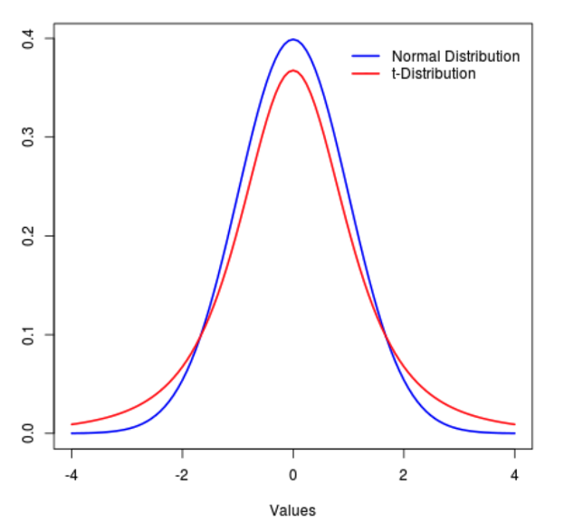
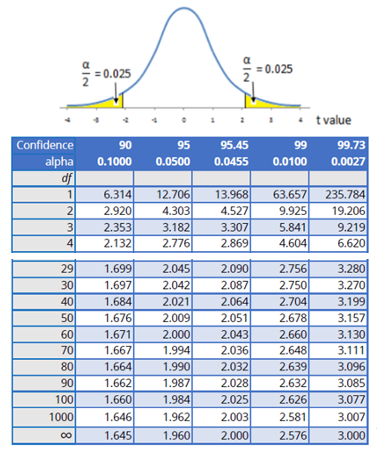

### Lezione 6
# La distribuzione Normale
## &nbsp;

---
## Obiettivi di apprendimento

- Conoscere le caratteristiche della distribuzione Normale
- Conoscere le caratteristiche della distribuzione Normale Standardizzata
- Conoscere le caratteristiche della distribuzione $\mathcal{t}$ di Student

---
## Le fasi della ricerca

Spiegelhalter, D., *The Art of Statistics: Learning From Data*, Pelican, 2019

---
## Parametri *vs*&nbsp; statistiche

| Statistica | Popolazione| Campione |
| ----: | :-----: | :----: | 
| Numerosit&agrave; | $N$ | $n$ |
| Media | $\mu$ | $\bar{x}$ |
| Deviazione Standard | $\sigma$ | $s$ |
| Proporzione | $\pi$ | $p$ |

<!-- We see that the measures used to summarize data sets in Chapter 2 can be applied as descriptions of a population too – the difference is that terms such as mean and standard deviation are known as statistics when describing a set of data, and parameters when describing a population. -->

---
## La distribuzione della popolazione

> Qual &egrave; la distribuzione del peso alla nascita per i gemelli inglesi?

<!-- We have already discussed the concept of a data distribution – the pattern the data makes, sometimes known as the empirical or sample distribution. Next we must tackle the concept of a population distribution – the pattern in the whole group of interest.

Supponiamo di voler sapere qual e' il peso alla nascita dei gemelli, mono e di zigoti inglesi. 
 -->

---
## La distribuzione della popolazione

> Qual &egrave; la distribuzione del peso alla nascita per i gemelli inglesi?

$N=1,000,000$
$\mu = 2404\text{ g}; \text{ } \sigma = 580\text{ g}$
$mediana = 2408\text{ g}$

<!-- The population distribution is the pattern made by the birth weights of all these babies, which we can obtain from TwinsUK data on the weights for 1M twins born in the UK from 1917 to 1998 to non-Hispanic white women – although this is not the entire set of twin births, it is such a large sample that we can take it as the population. (sono dati simulati a partire da dati reali) -->

---
## La distribuzione della popolazione

> Qual &egrave; la distribuzione del peso alla nascita per i gemelli inglesi?

$N=1,000,000$
$\mu = 2404\text{ g}; \text{ } \sigma = 580\text{ g}$
$mediana = 2408\text{ g}$

<!-- The shape of this distribution is important. Measurements such as weight, income, height, and so on can, at least in principle, be as fine-grained as desired, and so can be considered ‘continuous’ quantities whose population distributions are smooth. The classic example is the ‘bell-shaped curve’, or normal distribution, first explored in detail by Carl Friedrich Gauss.

Theory shows that the normal distribution can be expected to occur for phenomena that are driven by large numbers of small influences, for example a complex physical trait that is not influenced by just a few genes. 

Figure shows a normal curve with the same mean and standard deviation as the recorded weights. The smooth normal curve and the histogram are gratifyingly close, and other complex traits such as height and cognitive skills also have approximately normal population distributions. 
-->

---
## La distribuzione Normale

- $\mathcal{N} = (\mu, \sigma^2)$
- $\text{moda} \equiv \text{media} \equiv \text{medana}$
- Simmetrica

<!-- The normal distribution is characterized by its mean, or expectation, and its standard deviation.

It is an impressive achievement to be able to summarize over a million births by just these two quantities. 
 -->

---
## La distribuzione Normale

- Area sottesa alla curva $= 1$
- proporzione $\equiv$ probabilit&agrave;

$\text{``very low birth weight"} < 1500 \text{ g}$
$\text{Gemelli ``very low birth weight"} = 6\%$
$\mathcal{P}(\text{``ßvery low birth weight"}) = 0.06$

<!-- il fatto che l'area e' 1 dipende dal fatto che la normale sia una distribuzione di probabilita'

For medical rather than statistical reasons, babies below 1,500 g ‘very low birth weight’. Figure 3.2(d) shows that we would expect 6% of babies in this group to be very low birth weight – in fact the actual number is ~74K (0.7%), in close agreement with the prediction from the normal curve. 

 -->

---
### Esercizio #1

:question: &nbsp;&nbsp;&nbsp; Qual &egrave; la curva con la media
&nbsp;&nbsp;&nbsp;&nbsp;&nbsp;&nbsp;&nbsp;&nbsp;&nbsp; maggiore?

&nbsp;&nbsp;&nbsp;&nbsp;&nbsp;&nbsp;&nbsp;&nbsp;&nbsp; a) Verde
&nbsp;&nbsp;&nbsp;&nbsp;&nbsp;&nbsp;&nbsp;&nbsp;&nbsp; b) Blu
&nbsp;&nbsp;&nbsp;&nbsp;&nbsp;&nbsp;&nbsp;&nbsp;&nbsp; c) Gialla
&nbsp;&nbsp;&nbsp;&nbsp;&nbsp;&nbsp;&nbsp;&nbsp;&nbsp; d) Non lo posso sapere
&nbsp;&nbsp;&nbsp;&nbsp;&nbsp;&nbsp;&nbsp;&nbsp;&nbsp; e) Nessuna delle precedenti

---
### Esercizio #2

:question: &nbsp;&nbsp;&nbsp; Qual &egrave; la curva con la  
&nbsp;&nbsp;&nbsp;&nbsp;&nbsp;&nbsp;&nbsp;&nbsp;&nbsp; deviazione standard maggiore?

&nbsp;&nbsp;&nbsp;&nbsp;&nbsp;&nbsp;&nbsp;&nbsp;&nbsp; a) Verde
&nbsp;&nbsp;&nbsp;&nbsp;&nbsp;&nbsp;&nbsp;&nbsp;&nbsp; b) Blu
&nbsp;&nbsp;&nbsp;&nbsp;&nbsp;&nbsp;&nbsp;&nbsp;&nbsp; c) Gialla
&nbsp;&nbsp;&nbsp;&nbsp;&nbsp;&nbsp;&nbsp;&nbsp;&nbsp; d) Non lo posso sapere
&nbsp;&nbsp;&nbsp;&nbsp;&nbsp;&nbsp;&nbsp;&nbsp;&nbsp; e) Nessuna delle precedenti

---
## La distribuzione Normale

- Regola del 3 $\sigma$:
  - 68% dei valori osservati sono a 1 $\sigma$ dalla media
  - 95% sono a 2 $\sigma$
  - 99.7% sono a 3 $\sigma$

- Regola empirica:
  - valori $< 2 \sigma$ sono *"comuni"*
  - valori $> 2 \sigma$ sono *"inusuali"*  
  - valori $> 3 \sigma$ sono *"estremi"*  

<!-- From the mathematical properties of the normal distribution, we know that roughly 95% of the population will be contained in the interval given by the mean ± two standard deviations, and 99.8% in the central ± three standard deviations. 

68% at 1SD -> valori comuni vs valori inusuali -->

---
## I valori estremi 

<!-- Se i dati sono distribuiti normalmente c'e' una corrispondenza tra 1.5IQR dal 1o e 3o quartile e le standard deviation dalla media 
1.5 IQR (fence of the boxplot) -> If the data are normally distributed, the fence will be 2.7 standard deviations from the mean, so cases outside of it will be quite rare (0.4%)
-->

---
### Esercizio #3

:question: &nbsp;&nbsp;&nbsp; L'altezza della popolazione maschile italiana si distribuisce secondo
&nbsp;&nbsp;&nbsp;&nbsp;&nbsp;&nbsp;&nbsp;&nbsp;&nbsp;   una normale con media 170 cm e deviazione standard 9.5 cm

&nbsp;&nbsp;&nbsp;&nbsp;&nbsp;&nbsp;&nbsp;&nbsp;&nbsp; E' possibile calcolate i seguenti valori? Se s&igrave;, quali sono?

&nbsp;&nbsp;&nbsp;&nbsp;&nbsp;&nbsp;&nbsp;&nbsp;&nbsp; a) La mediana
&nbsp;&nbsp;&nbsp;&nbsp;&nbsp;&nbsp;&nbsp;&nbsp;&nbsp; b) La proporzione di italiani con altezza $>170 \text{ cm}$
&nbsp;&nbsp;&nbsp;&nbsp;&nbsp;&nbsp;&nbsp;&nbsp;&nbsp; c) I "range" di altezze considerabili come "inusuali" o "estremi"
&nbsp;&nbsp;&nbsp;&nbsp;&nbsp;&nbsp;&nbsp;&nbsp;&nbsp; d) L'altezza pi&ugrave; comune
&nbsp;&nbsp;&nbsp;&nbsp;&nbsp;&nbsp;&nbsp;&nbsp;&nbsp; e) L'italiano pi&ugrave; alto di sempre

---
### Esercizio #4

Sikich, L. *et al.*, *Intranasal Oxytocin in Children and Adolescents with Autism Spectrum Disorder*, NEJM, 2021

:question: &nbsp;&nbsp;&nbsp; Indicativamente, in quale range di et&agrave; &egrave; 
&nbsp;&nbsp;&nbsp;&nbsp;&nbsp;&nbsp;&nbsp;&nbsp;&nbsp; compreso il $68\%$ dei pazienti nel gruppo  
&nbsp;&nbsp;&nbsp;&nbsp;&nbsp;&nbsp;&nbsp;&nbsp;&nbsp; di intervento?

&nbsp;&nbsp;&nbsp;&nbsp;&nbsp;&nbsp;&nbsp;&nbsp;&nbsp; a) $3-17$ anni
&nbsp;&nbsp;&nbsp;&nbsp;&nbsp;&nbsp;&nbsp;&nbsp;&nbsp; b) $6.3-14.5$ anni
&nbsp;&nbsp;&nbsp;&nbsp;&nbsp;&nbsp;&nbsp;&nbsp;&nbsp; c) $4.1-16.7$ anni
&nbsp;&nbsp;&nbsp;&nbsp;&nbsp;&nbsp;&nbsp;&nbsp;&nbsp; d) Non &egrave; possibile desumerlo dalla tabella 

---
### Esercizio #5

:question: &nbsp;&nbsp;&nbsp; Con quale probabilità si potrà trovare nella popolazione
&nbsp;&nbsp;&nbsp;&nbsp;&nbsp;&nbsp;&nbsp;&nbsp;&nbsp; soggetti con valori superiori al terzo quartile?

&nbsp;&nbsp;&nbsp;&nbsp;&nbsp;&nbsp;&nbsp;&nbsp;&nbsp; a) 25%
&nbsp;&nbsp;&nbsp;&nbsp;&nbsp;&nbsp;&nbsp;&nbsp;&nbsp; b) 50%
&nbsp;&nbsp;&nbsp;&nbsp;&nbsp;&nbsp;&nbsp;&nbsp;&nbsp; c) 75%
&nbsp;&nbsp;&nbsp;&nbsp;&nbsp;&nbsp;&nbsp;&nbsp;&nbsp; d) Servono pi&ugrave; informazioni per poter rispondere

---
## Proporzione $\equiv$ probabilit&agrave;

- 6% dei gemelli sono "very low birth weight"
- La probabilit&agrave; essere "very low birth weight" &egrave; 0.06

Ma come &egrave; stato calcolato?

---
## La standardizzazione

- $\mathcal{N} = (\mu, \sigma^2) \rightarrow Z = (0, 1)$

<!-- Utilizzando una procedura chiamata standardizzazione

Magenta: mu=4, sd=1.5 -->

---
## La standardizzazione

- $\mathcal{N} = (\mu, \sigma^2) \rightarrow Z = (0, 1)$

- $z = \frac{x - \mu}{}$

---
## La standardizzazione

- $\mathcal{N} = (\mu, \sigma^2) \rightarrow Z = (0, 1)$

- $z = \frac{x - \mu}{\sigma}$

---
## La distribuzione Normale standardizzata

- $\mathcal{N} = (\mu, \sigma^2) \rightarrow Z = (0, 1)$

- $z = \frac{x - \mu}{\sigma}$

<!-- 
this is also known as her Z-score, which simply measures how many standard deviations a data-point is from the mean.

E perche la SND ci piace? Perche' esistono delle tavole che ci dicono qual e' l'area sottesa  ad una certa porzione della curva, che corrispondono alla probabilita' di trovare (nel caso di queste tavole) un valore < di quello osservato (area colorata)

Ci sono diverse versioni di queste tabelle, per esempio quella complementare che riporta l'area per la zona bianca (probabilita' di osservare valori piu' estremi) -->

---
## Calcoliamo la probabilit&agrave;/proporzione

:pushpin: &nbsp;&nbsp;&nbsp; $\mu = 2404\text{ g}; \text{ } \sigma = 580\text{ g}$

&nbsp;&nbsp;&nbsp;&nbsp;&nbsp;&nbsp;&nbsp;&nbsp;&nbsp;

&nbsp;&nbsp;&nbsp;&nbsp;&nbsp;&nbsp;&nbsp;&nbsp;&nbsp; $\mathcal{P}(x < 1500 \text{ g}) = \text{ ?}$

---
## Calcoliamo la probabilit&agrave;/proporzione

:pushpin: &nbsp;&nbsp;&nbsp; $\mu = 2404\text{ g}; \text{ } \sigma = 580\text{ g}$

&nbsp;&nbsp;&nbsp;&nbsp;&nbsp;&nbsp;&nbsp;&nbsp;&nbsp; $\mathcal{z} = \frac{x - \mu}{\sigma} =  \frac{1500\text{ g} - 2404\text{ g}}{580\text{ g}}$
&nbsp;&nbsp;&nbsp;&nbsp;&nbsp;&nbsp;&nbsp;&nbsp;&nbsp;&nbsp;&nbsp;&nbsp;&nbsp; $= -1.56$

 

&nbsp;&nbsp;&nbsp;&nbsp;&nbsp;&nbsp;&nbsp;&nbsp;&nbsp; $\mathcal{P}(x < 1500 \text{ g}) = \text{ ?}$

---
## Calcoliamo la probabilit&agrave;/proporzione

:pushpin: &nbsp;&nbsp;&nbsp; $\mu = 2404\text{ g}; \text{ } \sigma = 580\text{ g}$

&nbsp;&nbsp;&nbsp;&nbsp;&nbsp;&nbsp;&nbsp;&nbsp;&nbsp; $\mathcal{z} = \frac{x - \mu}{\sigma} =  \frac{1500\text{ g} - 2404\text{ g}}{580\text{ g}}$
&nbsp;&nbsp;&nbsp;&nbsp;&nbsp;&nbsp;&nbsp;&nbsp;&nbsp;&nbsp;&nbsp;&nbsp;&nbsp; $= -1.56$

 

&nbsp;&nbsp;&nbsp;&nbsp;&nbsp;&nbsp;&nbsp;&nbsp;&nbsp; $\mathcal{P}(x < 1500 \text{ g}) = \text{ ?}$

<!-- Fare vedere che la curva e' simmetrica quindi possiamo usare 1.56 per conoscere l'area -->

---
## Calcoliamo la probabilit&agrave;/proporzione

:pushpin: &nbsp;&nbsp;&nbsp; $\mu = 2404\text{ g}; \text{ } \sigma = 580\text{ g}$

&nbsp;&nbsp;&nbsp;&nbsp;&nbsp;&nbsp;&nbsp;&nbsp;&nbsp; $\mathcal{z} = \frac{x - \mu}{\sigma} =  \frac{1500\text{ g} - 2404\text{ g}}{580\text{ g}}$
&nbsp;&nbsp;&nbsp;&nbsp;&nbsp;&nbsp;&nbsp;&nbsp;&nbsp;&nbsp;&nbsp;&nbsp;&nbsp; $= -1.56$

 

&nbsp;&nbsp;&nbsp;&nbsp;&nbsp;&nbsp;&nbsp;&nbsp;&nbsp; $\mathcal{P}(x < 1500 \text{ g}) = 1 - 0.9406 = 0.0594 \rightarrow 5.94\%$

---
### Esercizio #6

:question: &nbsp;&nbsp;&nbsp; Non sapendo che il bambino ha un gemello, il pediatra dice alla madre che un
&nbsp;&nbsp;&nbsp;&nbsp;&nbsp;&nbsp;&nbsp;&nbsp;&nbsp; peso alla nascita inferiore ai $2500$g &egrave; inusuale. La madre deve preoccuparsi?

&nbsp;&nbsp;&nbsp;&nbsp;&nbsp;&nbsp;&nbsp;&nbsp;&nbsp; $\mu = 2404\text{ g}; \text{ } \sigma = 580\text{ g}$

 

<!-- For medical rather than statistical reasons, babies below 2,500 g are considered ‘low birth weight’, and those below 1,500 g ‘very low birth weight’.  -->

---
### Esercizio #7

:question: &nbsp;&nbsp;&nbsp; Abbiamo una distribuzione Normale $\mathcal{N} = (0, 1)$. Qual &egrave; il 
&nbsp;&nbsp;&nbsp;&nbsp;&nbsp;&nbsp;&nbsp;&nbsp;&nbsp; valore della sua mediana?

&nbsp;&nbsp;&nbsp;&nbsp;&nbsp;&nbsp;&nbsp;&nbsp;&nbsp; a) 0
&nbsp;&nbsp;&nbsp;&nbsp;&nbsp;&nbsp;&nbsp;&nbsp;&nbsp; b) 1
&nbsp;&nbsp;&nbsp;&nbsp;&nbsp;&nbsp;&nbsp;&nbsp;&nbsp; c) 2
&nbsp;&nbsp;&nbsp;&nbsp;&nbsp;&nbsp;&nbsp;&nbsp;&nbsp; d) Servono pi&ugrave; informazioni per poter rispondere

---
## $\mathcal{t}$ di Student

- Non posso approssimare a una normale
- Uso la $\mathcal{t}$ di Student
  

<!-- Quando la dimensione campionaria e' grande la nostra fiducia nell'approssimare sigma con la varianza campionaria e' ben riposta  e possiamo usare la normale per il calcolo dei CI, ma cosa succede quando i campioni soo piccoli? Usiamo la distribuzione  di Student

- &egrave; una famiglia di distribuzioni, 1 per ogni valore campionario n-1

Come la normale:
- ha media 0
- &egrave; simmetrica
- ha varianza >1 che si avvicina a 1 al crescere di N

Meno appuntita al centro e code pi&ugrave; alte
 -->

---
## $\mathcal{t}$ di Student 

- Non posso approssimare a una normale
- Uso la $\mathcal{t}$ di Student
  - considera i gradi di libert&agrave; $(\mathcal{df})$
  - per un campione di dimensione $n \rightarrow \mathcal{df} = n -1$
  <!-- - per due campioni di dimensione $n_1 \land n_2 \rightarrow \mathcal{df} = n_1 -1 + n_2 - 1 =$
   &nbsp;&nbsp;&nbsp;&nbsp;&nbsp;&nbsp;&nbsp;&nbsp;&nbsp;&nbsp;&nbsp;&nbsp;&nbsp;&nbsp;&nbsp;&nbsp;&nbsp;&nbsp;&nbsp;&nbsp;&nbsp;&nbsp;&nbsp;&nbsp;&nbsp;&nbsp;&nbsp;&nbsp; $= n_1 + n_2 -2$ -->

<!-- una famiglia di distribuzioni, 1 per ogni valore campionario n-1

 infatti la t-dist tiene conto dei valori campionari n-1, detti anche Gradi di liberta', che misurano la quantità di informazione disponibile nei dati che può essere usata per stimare sigma (affidabilità della stima s)

All’aumentare di n (e dei GdL) la stima di sigma attraverso s è sempre più affidabile: con n grande la distribuzione t si avvicina alla distribuzione normale
 -->

---
## $\mathcal{t}$ di Student 

- Non posso approssimare a una normale
- Uso la $\mathcal{t}$ di Student
  - considera i gradi di libert&agrave; $(\mathcal{df})$
  - per un campione di dimensione $n \rightarrow \mathcal{df} = n -1$
  <!-- - per due campioni di dimensione $n_1 \land n_2 \rightarrow \mathcal{df} = n_1 -1 + n_2 - 1 =$
   &nbsp;&nbsp;&nbsp;&nbsp;&nbsp;&nbsp;&nbsp;&nbsp;&nbsp;&nbsp;&nbsp;&nbsp;&nbsp;&nbsp;&nbsp;&nbsp;&nbsp;&nbsp;&nbsp;&nbsp;&nbsp;&nbsp;&nbsp;&nbsp;&nbsp;&nbsp;&nbsp;&nbsp; $= n_1 + n_2 -2$
   &nbsp;&nbsp;&nbsp;&nbsp;&nbsp;&nbsp;&nbsp;&nbsp;&nbsp;&nbsp;&nbsp;&nbsp; $\text{95\% CI} = (\bar{x} - \mathcal{t} \times \hat{SE}; \text{ } \bar{x} + \mathcal{t} \times \hat{SE})$ -->

<!-- Il procedimento per la costruzione dei CI e' lo stesso, quello che cambia e' la tavola da dove andiamo ad estrare il coefficiente di attendibilita' (t) 

Attenzione sempre al fatto che la distribuzione di t è diversa per ciascuno dei gl: usare le tavole corrette!!! -->

---
## $\mathcal{t}$ di Student

- Non posso approssimare a una normale
- Uso la $\mathcal{t}$ di Student
  - considera i gradi di libert&agrave; $(\mathcal{df})$
  - per un campione di dimensione $n \rightarrow \mathcal{df} = n -1$
  <!-- - per due campioni di dimensione $n_1 \land n_2 \rightarrow \mathcal{df} = n_1 -1 + n_2 - 1 =$
   &nbsp;&nbsp;&nbsp;&nbsp;&nbsp;&nbsp;&nbsp;&nbsp;&nbsp;&nbsp;&nbsp;&nbsp;&nbsp;&nbsp;&nbsp;&nbsp;&nbsp;&nbsp;&nbsp;&nbsp;&nbsp;&nbsp;&nbsp;&nbsp;&nbsp;&nbsp;&nbsp;&nbsp; $= n_1 + n_2 -2$
   &nbsp;&nbsp;&nbsp;&nbsp;&nbsp;&nbsp;&nbsp;&nbsp;&nbsp;&nbsp;&nbsp;&nbsp; $\text{95\% CI} = (\bar{x} - \mathcal{t} \times \hat{SE}; \text{ } \bar{x} + \mathcal{t} \times \hat{SE})$ -->

<!-- Piccoli == <30 circa  -->

---
### Cosa abbiamo imparato in questa lezione?

- La popolazione viene rappresentata con dei parametri (equivalenti alle statistiche usate per i campioni)
- Diversi fenomeni naturali sono normalmente distribuiti
- La normale &egrave; definita dalla sua media e deviazione standard e corrisponde a una distribuzione di probabilit&agrave;
- La distribuzione (normale) di una popolazione ci fornisce la probabilit&agrave; di estrarre un individuo da quella popolazione ma anche la sua frequenza 
- Se i dati sono normalmente distribuiti, il 68% della popolazione si trova a 1 SD dalla media, il 95% a 2 SD e il 99.7% a 3 SD
- Per campioni piccoli ($n < 30$), usiamo la distribuzione $\mathcal{t}$ di Student per ottenere una probabilit&agrave; 

