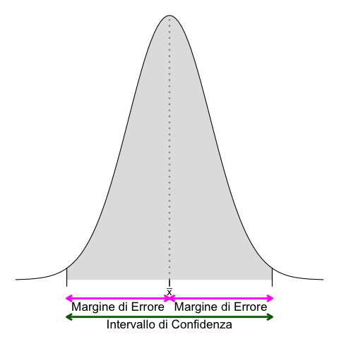
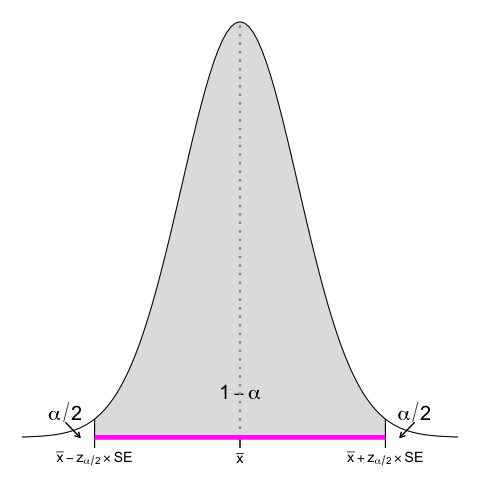
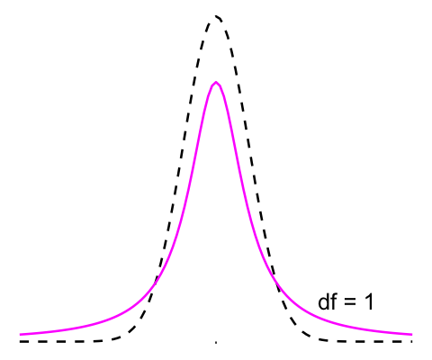

<!-- ### Lezione 7 -->
# La statistica inferenziale
## (Parte I: Stime e intervalli di confidenza)
## &nbsp;

---
## Obiettivi di apprendimento

- Saper passare da una distribuzione empirica alla quella di popolazione
- Saper comunicare l'incertezza di una statistica
- Saper calcolare e interpretare un intervallo di confidenza

---
## Le fasi della ricerca

<!--  -->

Spiegelhalter, D., *The Art of Statistics: Learning From Data*, Pelican, 2019 (Edizione Italiana: Einaudi, 2020)

---
##   &nbsp;&nbsp;&nbsp;&nbsp;&nbsp;&nbsp;:warning:  Attenzione  :warning:

&nbsp;&nbsp;&nbsp;&nbsp;&nbsp;&nbsp;&nbsp;&nbsp; Se questa parte vi sembra complessa &egrave; perch&eacute; &egrave; complessa.

&nbsp;&nbsp;&nbsp;&nbsp;&nbsp;&nbsp;&nbsp;&nbsp; Potreste doverci spendere un bel po' di tempo prima di 
&nbsp;&nbsp;&nbsp;&nbsp;&nbsp;&nbsp;&nbsp;&nbsp; riuscire a capirla del tutto: non vi preoccupate, &egrave; normale 
&nbsp;&nbsp;&nbsp;&nbsp;&nbsp;&nbsp;&nbsp;&nbsp; e ci siamo passati tutti!

---
## Dal campione alla popolazione

<!-- Ricapitoliamo: quando non possiamo studiare una popolazione ne usiamo un campione rappresentativo -->

---
## Dal campione alla popolazione

<!-- e poi usiamo le informazioni raccolte dal campione per trarre delle conclusioni sulla popolazione 
Questo processo si chiama statistica inferenziale,

Procedimento induttivo che ha lo scopo di stimare i parametri (caratteristiche) sconosciuti della popolazione a partire dalle statistiche (stime conosciute) del campione 

Sulla base di un campione estratto casualmente da 1 popolazione cosa può essere detto circa la popolazione da cui il campione è stato estratto? -->

---
### Esercizio #1

:question: &nbsp;&nbsp;&nbsp; Un valore ottenuto in una popolazione viene chiamato...

&nbsp;&nbsp;&nbsp;&nbsp;&nbsp;&nbsp;&nbsp;&nbsp; a) parametro
&nbsp;&nbsp;&nbsp;&nbsp;&nbsp;&nbsp;&nbsp;&nbsp; b) statistica 
&nbsp;&nbsp;&nbsp;&nbsp;&nbsp;&nbsp;&nbsp;&nbsp; c) media e/o deviazione standard
&nbsp;&nbsp;&nbsp;&nbsp;&nbsp;&nbsp;&nbsp;&nbsp; d) nessuno dei precedenti

---
### Esercizio #2

:question: &nbsp;&nbsp;&nbsp; Un valore ottenuto in un campione viene chiamato...

&nbsp;&nbsp;&nbsp;&nbsp;&nbsp;&nbsp;&nbsp;&nbsp; a) parametro
&nbsp;&nbsp;&nbsp;&nbsp;&nbsp;&nbsp;&nbsp;&nbsp; b) statistica 
&nbsp;&nbsp;&nbsp;&nbsp;&nbsp;&nbsp;&nbsp;&nbsp; c) media e/o deviazione standard
&nbsp;&nbsp;&nbsp;&nbsp;&nbsp;&nbsp;&nbsp;&nbsp; d) nessuno dei precedenti

---
### Esercizio #3

:question: &nbsp;&nbsp;&nbsp; Un parametro &egrave;...

&nbsp;&nbsp;&nbsp;&nbsp;&nbsp;&nbsp;&nbsp;&nbsp; a) sempre esattamente uguale alla statistica
&nbsp;&nbsp;&nbsp;&nbsp;&nbsp;&nbsp;&nbsp;&nbsp; b) stimato dal valore della statistica
&nbsp;&nbsp;&nbsp;&nbsp;&nbsp;&nbsp;&nbsp;&nbsp; c) non ha nessuna relazione con la statistica

---
## Quanto siamo precisi?

Quanti partner (etero)sessuali le persone in Gran Bretagna riferiscono di aver avuto nella loro vita?

&nbsp;&nbsp;&nbsp;&nbsp;&nbsp;&nbsp;&nbsp;&nbsp; $n_\text{donne} = 1100$
&nbsp;&nbsp;&nbsp;&nbsp;&nbsp;&nbsp;&nbsp;&nbsp; $n_\text{uomini} = 796$

|  | Uomini 35-44 | Donne 35-44 |
| ----: | -----: | ----: |
| Moda | 1 | 1  |
| Range | 0-500 | 0-550  |
| Media |  14.3 | 8.5 | 
| SD | 24.2 | 19.7  | 
| Mediana |  8 | 5  | 
| IQR | 4-18  | 3-10  |

<!-- In the age band of 35–44 there were 1,100 female and 796 male respondents, so it was a large survey from which the sample summary statistics shown in Table 2–2 were calculated, such as the median number of reported partners being 8 for men and 5 for women. Since we know the survey was based on a proper random-sampling scheme, it is fairly reasonable to assume that the study population matches the target population, which is the adult British population. The crucial question is: how close are these statistics to what we would have found had we been able to ask everyone in the country? -->

---
## Ricalcoliamo senza i "valori estremi"

Quanti partner (etero)sessuali gli uomini inglesi, tra i 35 e 44 anni di et&agrave;, riferiscono di aver avuto nella loro vita?

&nbsp;&nbsp;&nbsp;&nbsp;&nbsp;&nbsp;&nbsp;&nbsp; $n_\text{uomini} = 760$

|  | Uomini 35-44 |
| ----: | -----: | 
| Moda | 1 |
| Range | 0-50 | 
| Media |  11.4 | 
| SD | 11.2 |  
| Mediana |  7 |
| IQR | 4-16  |

<!-- Per semplificare la visualizzazione, concentriamoci sugli uomini che hanno avuto < 50 partner (solo 36 riportano di averne avuto di piu'), quindi ricalcoliamo tutte le statistiche su questo campione 

I valori estremi propriamente detti sarebbero quelli >87, ma facciamo finta vada bene cosi'

Notiamo i valori "stabili" (non influenzati dagli outliers)
-->

---
## La dimensione del campione

Quanti partner (etero)sessuali gli uomini inglesi, tra i 35 e 44 anni di et&agrave;, riferiscono di aver avuto nella loro vita?

<!-- Magenta dotted line is the mean

As an illustration of how the accuracy of statistics depends on sample size, we shall pretend for the moment that the men in the survey in fact represent the population in which we are interested. 
-->

---
## La dimensione del campione

&nbsp;&nbsp;&nbsp;&nbsp;&nbsp;&nbsp;&nbsp;&nbsp; $n_\text{campione} = 10$

<!--
For illustration, we then take successive samples of individuals from this ‘population’ of 760 men, pausing when we reach 10, 50, 100, 200 and 380 men. 

The data distributions of these samples are shown 

it is clear that the smaller samples are ‘bumpier’, and the summary stats (mean here) is sensitive to single data-points

 Magenta dotted line is the mean
Density should use another scale -->

---
## La dimensione del campione

&nbsp;&nbsp;&nbsp;&nbsp;&nbsp;&nbsp;&nbsp;&nbsp; $n_\text{campione} = 50$

<!-- the rather high number of partners  in the first sample of ten individuals gets steadily overwhelmed, as the statistics get closer and closer to those of the whole group of 796 men as the sample size increases. -->

---
## La dimensione del campione

&nbsp;&nbsp;&nbsp;&nbsp;&nbsp;&nbsp;&nbsp;&nbsp; $n_\text{campione} = 100$

<!-- the rather high number of partners  in the first sample of ten individuals gets steadily overwhelmed, as the statistics get closer and closer to those of the whole group of 796 men as the sample size increases. -->

---
## La dimensione del campione

&nbsp;&nbsp;&nbsp;&nbsp;&nbsp;&nbsp;&nbsp;&nbsp; $n_\text{campione} = 200$

<!-- the rather high number of partners  in the first sample of ten individuals gets steadily overwhelmed, as the statistics get closer and closer to those of the whole group of 796 men as the sample size increases. -->

---
## La dimensione del campione

&nbsp;&nbsp;&nbsp;&nbsp;&nbsp;&nbsp;&nbsp;&nbsp; $n_\text{campione} = 380$

<!-- the rather high number of partners  in the first sample of ten individuals gets steadily overwhelmed, as the statistics get closer and closer to those of the whole group of 796 men as the sample size increases. -->

---
### Esercizio #4

:question: &nbsp;&nbsp;&nbsp; Al crescere della dimensione del campione

&nbsp;&nbsp;&nbsp;&nbsp;&nbsp;&nbsp;&nbsp;&nbsp; a) migliorano le stime dei parametri
&nbsp;&nbsp;&nbsp;&nbsp;&nbsp;&nbsp;&nbsp;&nbsp; b) le stime dei parametri diventano pi&ugrave; sensibili alle singole 
&nbsp;&nbsp;&nbsp;&nbsp;&nbsp;&nbsp;&nbsp;&nbsp;&nbsp;&nbsp;&nbsp;&nbsp; osservazioni 
&nbsp;&nbsp;&nbsp;&nbsp;&nbsp;&nbsp;&nbsp;&nbsp; c) non c'&egrave; differenza
&nbsp;&nbsp;&nbsp;&nbsp;&nbsp;&nbsp;&nbsp;&nbsp; d) non ho abbastanza elementi per rispondere

---
## Quanto siamo precisi?

Con questo esempio, abbiamo introdotto due concetti: 

  1. Campioni pi&ugrave; grandi stimano meglio i parametri di una popolazione

  2. Continuare ad estrarre campioni ci da un'idea della variazione attorno al valore "plausibile" del parametro che ci interessa

Quindi come procediamo?

---
## Stima dei parametri e del margine di errore

Come stimo la variazione rispetto al valore reale nella popolazione se quello che sto cercando &egrave; proprio il valore reale nella popolazione? 

<!--  
Now we come to a critical step. In order to work out how accurate these statistics might be, we need to think of how much our statistics might change if we (in our imagination) were to repeat the sampling process many times. In other words, if we repeatedly drew samples of 796 men from the country, how much would the calculated statistics vary?

If we knew how much these estimates would vary, then it would help tell us how accurate our actual estimate was. But unfortunately we could only work out the precise variability in our estimates if we knew precisely the details of the population. And this is exactly what we do not know.  -->

---
## Stima dei parametri e del margine di errore

1. Assumendo che la popolazione assomigli al campione   $\rightarrow$ via bootstrapping

2. Facendo assunzioni matematiche sulla forma della distribuzione nella popolazione   $\rightarrow$ via distribuzione campionaria & teorema del limite centrale

<!-- There are two ways to resolve this circularity. The first is to make some mathematical assumptions about the shape of the population distribution, and use sophisticated probability theory to work out the variability we would expect in our estimate, and hence how far away we might expect, say, the average of our sample to be from the mean of the population. This is the traditional method that is taught in statistics textbooks, and we shall see how this works in Chapter 9. 

However, there is an alternative approach, based on the plausible assumption that the population should look roughly like the sample. Since we cannot repeatedly draw a new sample from the population, we instead repeatedly draw new samples from our sample! -->

---
## Stima dei parametri e del margine di errore

&nbsp;&nbsp;&nbsp;&nbsp;&nbsp;&nbsp;&nbsp;&nbsp; $N_\text{Bootstrapping} = 1000$

<!-- If we repeat this resampling, say, 1,000 times, we get 1,000 possible estimates of the mean. These are displayed as histograms, with each histogram showing the spread of bootstrap estimates around the mean of the original sample. These are known as sampling distributions of estimates, since they reflect the variability in estimates that arise from repeated sampling of data.

Figure displays some clear features. The first, and perhaps most notable, is that almost all trace of the skewness of the original samples has gone – the distributions of the estimates based on the resampled data are almost symmetric around the mean of the original data. This is a first glimpse of what is known as the Central Limit Theorem, which says that the distribution of sample means tends towards the form of a normal distribution with increasing sample size, almost regardless of the shape of the original data distribution. 

Additionally, is that the bootstrap distributions get narrower as the sample size increases
 -->

---
## L'intervallo di confidenza

:dart: &nbsp;&nbsp;&nbsp; Intervallo che contiene il 95% delle medie ottenute via Bootstrapping

<!-- For example, we can find the range of values that contains 95% of the means of the bootstrap resamples, and call this a 95% uncertainty interval
for the original estimates, or alternatively they can be called margins of error. These are shown in Table 7.2 – the symmetry of the bootstrap distributions means the uncertainty intervals are roughly symmetric around the original estimate.

Per farlo sfruttiamo le proprieta' della distribuzione normale (indipendentemente dalla distribuzione del campione) 

Ma prima osserviamo ancora che the bootstrap distributions get narrower as the sample size increases, which is reflected in the steadily narrower 95% uncertainty intervals.
 -->

 ---
## L'intervallo di confidenza

:dart: &nbsp;&nbsp;&nbsp; Intervallo che contiene il 95% delle medie ottenute via Bootstrapping

<!-- For example, we can find the range of values that contains 95% of the means of the bootstrap resamples, and call this a 95% uncertainty interval
for the original estimates, or alternatively they can be called margins of error. These are shown in Table 7.2 – the symmetry of the bootstrap distributions means the uncertainty intervals are roughly symmetric around the original estimate.

Per farlo sfruttiamo le proprieta' della distribuzione normale (indipendentemente dalla distribuzione del campione) 

Ma prima osserviamo ancora che the bootstrap distributions get narrower as the sample size increases, which is reflected in the steadily narrower 95% uncertainty intervals.
 -->

---
## L'intervallo di confidenza

:dart: &nbsp;&nbsp; Intervallo che contiene il 95% delle medie ottenute via Bootstrapping

&nbsp;&nbsp;&nbsp;&nbsp;&nbsp;&nbsp;&nbsp;&nbsp; $N_\text{Bootstrapping} = 1000$
&nbsp;&nbsp;&nbsp;&nbsp;&nbsp;&nbsp;&nbsp;&nbsp; $\bar{x} = 11.4$

| $n_\text{campione}$ | Media | 95% CI |
| ----: | -----: |  -----: | 
| 10 | 11.4 | (5.0; 19.0)
| 50 | 11.4 | (8.4; 14.6)
| 100 | 11.4  | (9.2; 13.5) 
| 200 | 11.3 |  (9.9; 12.9)
| 380 | 11.3  | (10.2; 12.4)
| 760 | 11.3 | (10.6, 12.1)

<!-- The second important feature of Figure 7.3 is that the bootstrap distributions get narrower as the sample size increases, which is reflected in the steadily narrower 95% uncertainty intervals. 

Bootstrapping provides an intuitive, computer-intensive way of assessing the uncertainty in our estimates, without making strong assumptions and without using probability theory. But the technique is not feasible when it comes to, say, working out the margins of error on unemployment surveys of 100,000 people. Although bootstrapping is a simple, brilliant and extraordinarily effective idea, it is just too clumsy to bootstrap such large quantities of data, especially when a convenient theory exists that can generate formulae for the width of uncertainty intervals.

-->

---
### Esercizio #5

:question: &nbsp;&nbsp;&nbsp; Al crescere della dimensione del campione

&nbsp;&nbsp;&nbsp;&nbsp;&nbsp;&nbsp;&nbsp;&nbsp; a) peggiora la stima dell'incertezza del parametro
&nbsp;&nbsp;&nbsp;&nbsp;&nbsp;&nbsp;&nbsp;&nbsp; b) migliora la stima dell'incertezza del parametro
&nbsp;&nbsp;&nbsp;&nbsp;&nbsp;&nbsp;&nbsp;&nbsp; c) non c'&egrave; differenza
&nbsp;&nbsp;&nbsp;&nbsp;&nbsp;&nbsp;&nbsp;&nbsp; d) non ho abbastanza elementi per rispondere

---
## Fermiamoci un attimo

Abbiamo introdotto due concetti complicati e importanti:

  1. esiste una variabilit&agrave; nella stima dei parametri che dipende dal campione

  2. la forma della distribuzione delle statistiche non dipende dalla forma della distribuzione originaria e tende alla normale per insiemi grandi

Ora abbiamo le basi per affrontare il secondo approccio  per stimare i parametri e l'intervallo di confidenza

<!-- 
- the variability in statistics based on samples

- the fact that the shape of the distribution of the statistics does not depend on the shape of the original distribution from which the individual data-points are drawn

- bootstrapping data when we do not want to make assumptions about the shape of the population

Rather remarkably, this has all been accomplished without any mathematics except the idea of drawing observations at random. -->

---
### La distribuzione campionaria &   il teorema del limite centrale

&nbsp;&nbsp;&nbsp;&nbsp;&nbsp;&nbsp;&nbsp; Per le medie:
&nbsp;&nbsp;&nbsp;&nbsp;&nbsp;&nbsp;&nbsp;&nbsp;&nbsp;&nbsp; $\mathcal{N} = (\mu, \frac{\sigma^2}{n})$ con $\sqrt{ \frac{\sigma^2}{n}} = \frac{\sigma}{\sqrt{n}}$
&nbsp;&nbsp;&nbsp;&nbsp;&nbsp;&nbsp;&nbsp;&nbsp;&nbsp;&nbsp; $\frac{\sigma}{\sqrt{n}}$ &nbsp; $\rightarrow$ &nbsp; standard error (SE)

<!-- Distribuzione campionaria e' la distribuzione di tutti i possibile valori che possono essere assunti da qualche statistica (e.g., la media) calcolata da campioni della stessa dimensione ed estratti casualmente dalla stessa popolazione 

Come si costruisce? 
1. Estraggo tutti i possibili campioni di dimensione n
2. Calcolo la statistica di interesse
3. Tengo traccia di ciascun valore della statistica e della sua frequenza 

La forma della distribuzione delle medie campionarie è approssimativamente normale,  indipendentemente dalla distribuzione dei valori della popolazione d’origine dalla quale i campioni sono estratti, per n sufficientemente grande.

Teorema del limite centrale ci dice che la Distribuzione campionaria tende a presentare una Distribuzione Normale N = (μ, σ2 ), indipendentemente
dalla forma della distribuzione empirica osservata nel Campione quando
questo `e sufficientemente grande (≈ n > 30). La statistica misurata viene
considerata uno stimatore del Parametro μ della distribuzione campiona-
ria, mentre la sua Standard deviation è la radice quadrata del rapporto tra tra la varianza della popolazione e la dimensione del campione usato per calcolarla 
anche conosciuta come Errore standard della stima della statistica.

L'errore standard diminuisce al crescere di N e al decrescere della varianza

Quanto deve essere grande il campione perch&egrave; la distribuzione sia normale? 
Nella maggior parte delle situazioni pratiche, n=30 e' soddisfacente, ma l'approssimazione migliora all'aumentare di n (lo vedremo tra qualche slide) -->

---
## Mettiamo i pezzi insieme

- La distribuzione campionaria tende alla distribuzione Normale
- In una Normale, 95% delle osservazioni sono a circa $2 \times \text{SD}$ dalla media
- Il nostro intervallo di confidenza (95%) &egrave; a circa $2 \times \text{SE}$ dalla media della distribuzione campionaria

<!-- Approssimando una Normale, la distribuzione campionaria ha le stesse (utili) caratteristiche della normale:
- &egrave; simmetrica
- ha area 1
- 95% delle medie campionarie sono a 2 SE dalla vera media della popolazione 

Tutti concetti che ci torneranno utili tra poco
-->

---
## Quindi come si calcola?

:dart: &nbsp;&nbsp; Il 95% CI &egrave; a circa $2 \times \text{SE}$ dalla media della distribuzione campionaria

&nbsp;&nbsp;&nbsp;&nbsp;&nbsp;&nbsp;&nbsp; 1. Calcoliamo lo SE
&nbsp;&nbsp;&nbsp;&nbsp;&nbsp;&nbsp;&nbsp; 2. Calcoliamo $2 \times \text{SE}$, *i.e.*, 
&nbsp;&nbsp;&nbsp;&nbsp;&nbsp;&nbsp;&nbsp;&nbsp;&nbsp;&nbsp;&nbsp; $95\%$ Margine di Errore (ME)
&nbsp;&nbsp;&nbsp;&nbsp;&nbsp;&nbsp;&nbsp; 3. Calcoliamo il $95\% \text{ CI}$ come 
&nbsp;&nbsp;&nbsp;&nbsp;&nbsp;&nbsp;&nbsp;&nbsp;&nbsp;&nbsp;&nbsp;  $(\bar{x} - \text{ ME} \text{ } ; \text{ } \bar{x} + \text{ ME} )$

---
### Esercizio #6

:question: &nbsp;&nbsp;&nbsp; Il numero medio di partner eterosessuali in campione di 760 uomini 
&nbsp;&nbsp;&nbsp;&nbsp;&nbsp;&nbsp;&nbsp;&nbsp; inglesi tra i 35 e i  44 anni di et&agrave; &egrave; 11.4 $\pm$ 11.2 partner.

&nbsp;&nbsp;&nbsp;&nbsp;&nbsp;&nbsp;&nbsp;&nbsp; Qual &egrave; la media della popolazione e il suo 95% CI?  

&nbsp;&nbsp;&nbsp;&nbsp;&nbsp;&nbsp;&nbsp;&nbsp; $\mu=\text{ ?}$
&nbsp;&nbsp;&nbsp;&nbsp;&nbsp;&nbsp;&nbsp;&nbsp; $\text{SE}=\sigma/\sqrt{n} = \text{ ?} \rightarrow$ &nbsp;&nbsp;&nbsp; $\hat{\text{SE}}=s/\sqrt{n} = \text{ ?}$

---
## Ma come si interpreta?

:dart: &nbsp;&nbsp;&nbsp; Se facessimo 100 campionamenti, 95 stimerebbero un  intervallo
&nbsp;&nbsp;&nbsp;&nbsp;&nbsp;&nbsp;&nbsp;&nbsp;  di confidenza che contiene il vero  valore del parametro

:pushpin: &nbsp;&nbsp;&nbsp; Popolazione: Donne italiane dai
&nbsp;&nbsp;&nbsp;&nbsp;&nbsp;&nbsp;&nbsp;&nbsp; 25 ai 74 anni

&nbsp;&nbsp;&nbsp;&nbsp;&nbsp;&nbsp;&nbsp;&nbsp; $\mu=123 \text{ mmHg}$

<!-- Cosa rappresentano quindi i CI? Che dati 100 campioni estratti dalla popolazione, 95 stimano un IC al cui interno è compresa la media reale della popolazione e solo 5 stimano un ic che non include la media reale 

a confidence interval is the range of population parameters for which our observed statistic is a plausible consequence.
-->

---
### Esercizio #7

:question: &nbsp;&nbsp;&nbsp; Da un sondaggio, risulta che lo stipendio mensile medio di un
&nbsp;&nbsp;&nbsp;&nbsp;&nbsp;&nbsp;&nbsp;&nbsp; neolaureato &egrave; 1.400&#8364;, con un 95% CI = (1.200&#8364; ; 1.600&#8364;). 
&nbsp;&nbsp;&nbsp;&nbsp;&nbsp;&nbsp;&nbsp;&nbsp; Come interpreto questo risultato?

&nbsp;&nbsp;&nbsp;&nbsp;&nbsp;&nbsp;&nbsp;&nbsp; a) gli stipendi dei neolaureati sono compresi tra i 1.200 ai 1.600&#8364;
&nbsp;&nbsp;&nbsp;&nbsp;&nbsp;&nbsp;&nbsp;&nbsp; b) il 95% dei neolaureati riceve tra 1.200 ai 1.600&#8364;
&nbsp;&nbsp;&nbsp;&nbsp;&nbsp;&nbsp;&nbsp;&nbsp; c) la media degli stipendi dei neolaureati nella popolazione ha una 
&nbsp;&nbsp;&nbsp;&nbsp;&nbsp;&nbsp;&nbsp;&nbsp;&nbsp;&nbsp;&nbsp;&nbsp; probabilità del 95% di essere compresa tra 1.200 ai 1.600&#8364;
&nbsp;&nbsp;&nbsp;&nbsp;&nbsp;&nbsp;&nbsp;&nbsp; d) nessuna delle precedenti

<!-- Questa differenza di 200 euro a dx e sx della media e' il margine di errore del 95% -->

---
### Esercizio #8

:question: &nbsp;&nbsp;&nbsp; Il numero medio di partner eterosessuali in campione di 760 uomini 
&nbsp;&nbsp;&nbsp;&nbsp;&nbsp;&nbsp;&nbsp;&nbsp; inglesi tra i 35 e i  44 anni di et&agrave; &egrave; 11.4 $\pm$ 11.2 partner.

&nbsp;&nbsp;&nbsp;&nbsp;&nbsp;&nbsp;&nbsp;&nbsp; Qual &egrave; la media della popolazione e il suo 68% CI?  

&nbsp;&nbsp;&nbsp;&nbsp;&nbsp;&nbsp;&nbsp;&nbsp; $\mu=\text{ ?}$
&nbsp;&nbsp;&nbsp;&nbsp;&nbsp;&nbsp;&nbsp;&nbsp; $\text{SE}=\sigma/\sqrt{n} = \text{ ?} \rightarrow$ &nbsp;&nbsp;&nbsp; $\hat{\text{SE}}=s/\sqrt{n} = \text{ ?}$

---
### Esercizio #9

:question: &nbsp;&nbsp;&nbsp; Se l'intervallo di confidenza 
&nbsp;&nbsp;&nbsp;&nbsp;&nbsp;&nbsp;&nbsp;&nbsp; &egrave; largo...

&nbsp;&nbsp;&nbsp;&nbsp;&nbsp;&nbsp;&nbsp;&nbsp; a) &egrave; pi&ugrave; probabile che includa $\mu$
&nbsp;&nbsp;&nbsp;&nbsp;&nbsp;&nbsp;&nbsp;&nbsp; b) &egrave; meno probabile che includa $\mu$
&nbsp;&nbsp;&nbsp;&nbsp;&nbsp;&nbsp;&nbsp;&nbsp; c) non c'&egrave; differenza
&nbsp;&nbsp;&nbsp;&nbsp;&nbsp;&nbsp;&nbsp;&nbsp; d) non posso rispondere

---
### Esercizio #10

:question: &nbsp;&nbsp;&nbsp; Pi&ugrave; l'intervallo di confidenza  
&nbsp;&nbsp;&nbsp;&nbsp;&nbsp;&nbsp;&nbsp;&nbsp; &egrave; largo...

&nbsp;&nbsp;&nbsp;&nbsp;&nbsp;&nbsp;&nbsp;&nbsp; a) meno siamo precisi
&nbsp;&nbsp;&nbsp;&nbsp;&nbsp;&nbsp;&nbsp;&nbsp; b) pi&ugrave; siamo precisi
&nbsp;&nbsp;&nbsp;&nbsp;&nbsp;&nbsp;&nbsp;&nbsp; c) non c'&egrave; differenza
&nbsp;&nbsp;&nbsp;&nbsp;&nbsp;&nbsp;&nbsp;&nbsp; d) non posso rispondere

---
### Esercizio #11

:question: &nbsp;&nbsp;&nbsp; Dato che $\mathcal{N} = (\mu, \frac{\sigma^2}{n})$ con $\sqrt{ \frac{\sigma^2}{n}} = \frac{\sigma}{\sqrt{n}} \rightarrow$ &nbsp; standard error (SE), 
&nbsp;&nbsp;&nbsp;&nbsp;&nbsp;&nbsp;&nbsp;&nbsp;  come posso restringere l'intervallo di confidenza?

&nbsp;&nbsp;&nbsp;&nbsp;&nbsp;&nbsp;&nbsp;&nbsp; a) aumentando $n$
&nbsp;&nbsp;&nbsp;&nbsp;&nbsp;&nbsp;&nbsp;&nbsp; b) diminuendo $n$
&nbsp;&nbsp;&nbsp;&nbsp;&nbsp;&nbsp;&nbsp;&nbsp; c) aumentando $\sigma$
&nbsp;&nbsp;&nbsp;&nbsp;&nbsp;&nbsp;&nbsp;&nbsp; d) diminuendo $\sigma$
&nbsp;&nbsp;&nbsp;&nbsp;&nbsp;&nbsp;&nbsp;&nbsp; e) nessuna delle precedenti
&nbsp;&nbsp;&nbsp;&nbsp;&nbsp;&nbsp;&nbsp;&nbsp; f) non ho abbastanza elementi per rispondere

---
## Il coefficiente di attendibilit&agrave; $\alpha$ 

:dart: &nbsp;&nbsp;&nbsp; $\text{95\% ME} \approx 2 \times \hat{SE}$ &nbsp;&nbsp;&nbsp;  &nbsp; $\approx 2$ &nbsp; ?

| Livello di confidenza | $\alpha$ | $\alpha/2$ | $z_{\alpha/2}$ |
| ----: | ----- | ---- | ----|
| 95% | 5% | 2.5% |  |

<!-- L’intervallo di confidenza (IC) al 95% è il più usato e intuitivamente abbiamo gia' capito da dove deirva il fattore 1.96 (circa 2SE contengono il 95% dei campioni), ma vediamolo in modo piu' formale 

Quando accettiamo un livello di confidenza del 95% accettiamo implicitamente un errore del 5%, distribuito equamente a dx e sx dell'intrevallo di confidenza (in verde), quindi 2.5% per parte -->

---
## Il coefficiente di attendibilit&agrave; $\alpha$ 

:dart: &nbsp;&nbsp;&nbsp; $\text{95\% ME} \approx 2 \times \hat{SE}$ &nbsp;&nbsp;&nbsp;  &nbsp; $\approx 2$ &nbsp; ?

| Livello di confidenza | $\alpha$ | $\alpha/2$ | $z_{\alpha/2}$ |
| ----: | ----- | ---- | ----|
| 95% | 5% | 2.5% |  |

$100\% - 2.5\% = 97.5\%$ 

<!--  e qual e' l'aera di questa parte bianca? E' la totalita' dell'area (1, o 100%) meno l'area bianca (2.5%), quindi 97.5%-->

---
## Il coefficiente di attendibilit&agrave; $\alpha$ 

:dart: &nbsp;&nbsp;&nbsp; $\text{95\% ME} \approx 2 \times \hat{SE}$ &nbsp;&nbsp;&nbsp;  &nbsp; $\approx 2$ &nbsp; ?

| Livello di confidenza | $\alpha$ | $\alpha/2$ | $z_{\alpha/2}$ |
| ----: | ----- | ---- | ----|
| 95% | 5% | 2.5% |  |

$100\% - 2.5\% = 97.5\% \rightarrow \mathcal{z} = 1.96$  

<!--  E' qual e' il valore di z per cui la curva sottende un'area del 97.5%? 1.96 (le tavole si possono anche leggere al contrario, non solo da z all'area, ma anche dall'area a z) 

coefficiente di attendibilita'-->

---
## Il coefficiente di attendibilit&agrave; $\alpha$ 

| Livello di confidenza | $\alpha$ | $\alpha/2$ | $z_{\alpha/2}$ |
| ----: | -----: | ---- | ----:|
| 95% | 5% | 2.5% | 1.96 |
| 90% | 10% | 5.0% | 1.65 |
| 99% | 1% | 0.5% | 2.58 |

$100\% - 2.5\% = 97.5\% \rightarrow \mathcal{z} = 1.96$ 
$100\% - 5.0\% = 95.0\% \rightarrow \mathcal{z} = 1.65$ 
$100\% - 0.5\% = 99.5\% \rightarrow \mathcal{z} = 2.58$ 

<!-- 95% e' il valore piu' usato, ma altri comuni sono 90 e 99%, a cui corrispondono fattori di attendibilita' di 1.65 e 2.58

Faremo piu' avanti degli esercizi in cui ci calcoleremo 90 e 99% CI -->

---
## Una regola empirica

:dart: &nbsp;&nbsp;&nbsp; Il margine di errore (in percentuale) &egrave; al pi&ugrave; $\pm \text{ } 100/\sqrt{n}$

<!-- A simple rule of thumb is that, if you are estimating the percentage of people who prefer something, and you ask a random sample from a population, then your margin of error (in %) is at most plus or minus 100 divided by the square root of the sample size 

 The margin of error is ± 2√[p(1 − p)/n], whose maximum value of ± 1/√n occurs at p = 0.5. Hence the margin of error is at most ± 1/√n, whatever value of the underlying true proportion p.
-->

---
### Esercizio #12

:dart: &nbsp;&nbsp;&nbsp; Il margine di errore (in percentuale) &egrave; al pi&ugrave; $\pm \text{ } 100/\sqrt{n}$

:question: &nbsp;&nbsp;&nbsp; Calcolate il 95% CI per le due
&nbsp;&nbsp;&nbsp;&nbsp;&nbsp;&nbsp;&nbsp;&nbsp; affermazioni

---
## E se il campione &egrave; piccolo?

- Non posso approssimare a una Normale
- Uso la $\mathcal{t}$ di Student
  

<!-- Quando la dimensione campionaria e' grande la nostra fiducia nell'approssimare sigma con la varianza campionaria e' ben riposta  e possiamo usare la normale per il calcolo dei CI, ma cosa succede quando i campioni soo piccoli? Usiamo la distribuzione  di Student
 -->

---
## $\mathcal{t}$ di Student 

- Non posso approssimare a una Normale
- Uso la $\mathcal{t}$ di Student
  - considera i gradi di libert&agrave; (df)

<!-- 
- &egrave; una famiglia di distribuzioni, 1 per ogni valore campionario n-1

Come la normale:
- ha media 0
- &egrave; simmetrica
- ha varianza >1 che si avvicina a 1 al crescere di N

Meno appuntita al centro e code pi&ugrave; alte
 -->

 ---
## $\mathcal{t}$ di Student 

- Non posso approssimare a una Normale
- Uso la $\mathcal{t}$ di Student
  - considera i gradi di libert&agrave; (df)

<!-- 
- &egrave; una famiglia di distribuzioni, 1 per ogni valore campionario n-1

Come la normale:
- ha media 0
- &egrave; simmetrica
- ha varianza >1 che si avvicina a 1 al crescere di N

Meno appuntita al centro e code pi&ugrave; alte
 -->

 ---
## $\mathcal{t}$ di Student 

- Non posso approssimare a una Normale
- Uso la $\mathcal{t}$ di Student
  - considera i gradi di libert&agrave; (df)

<!-- 
- &egrave; una famiglia di distribuzioni, 1 per ogni valore campionario n-1

Come la normale:
- ha media 0
- &egrave; simmetrica
- ha varianza >1 che si avvicina a 1 al crescere di N

Meno appuntita al centro e code pi&ugrave; alte
 -->

---
## $\mathcal{t}$ di Student per CI in campioni piccoli

- Non posso approssimare a una Normale
- Uso la $\mathcal{t}$ di Student
  - considera i gradi di libert&agrave; (df)
  - in un campione di dimensione $n$ $\rightarrow \text{df} = n -1$
  <!-- - per due campioni di dimensione $n_1 \land n_2 \rightarrow \mathcal{df} = n_1 -1 + n_2 - 1 =$
   &nbsp;&nbsp;&nbsp;&nbsp;&nbsp;&nbsp;&nbsp;&nbsp;&nbsp;&nbsp;&nbsp;&nbsp;&nbsp;&nbsp;&nbsp;&nbsp;&nbsp;&nbsp;&nbsp;&nbsp;&nbsp;&nbsp;&nbsp;&nbsp; $= n_1 + n_2 -2$ -->

&nbsp;&nbsp;&nbsp;&nbsp;&nbsp;&nbsp;&nbsp; $\text{95\% ME} = \mathcal{t} \times \hat{SE}$ 

<!-- Piccoli == <30 circa  -->

---
### Esercizio #13

:question: &nbsp;&nbsp;&nbsp; Un ricercatore usa la statistica inferenziale se sta usando i 
&nbsp;&nbsp;&nbsp;&nbsp;&nbsp;&nbsp;&nbsp;&nbsp; propri risultati per...

&nbsp;&nbsp;&nbsp;&nbsp;&nbsp;&nbsp;&nbsp;&nbsp; a) descrivere i dati che ha raccolto
&nbsp;&nbsp;&nbsp;&nbsp;&nbsp;&nbsp;&nbsp;&nbsp; b) stimare un parametro di una popolazione
&nbsp;&nbsp;&nbsp;&nbsp;&nbsp;&nbsp;&nbsp;&nbsp; c) nessuna delle precedenti

---
### Esercizio #14

:question: &nbsp;&nbsp;&nbsp; Un ricercatore usa la statistica descrittiva se sta usando i 
&nbsp;&nbsp;&nbsp;&nbsp;&nbsp;&nbsp;&nbsp;&nbsp; propri risultati per...

&nbsp;&nbsp;&nbsp;&nbsp;&nbsp;&nbsp;&nbsp;&nbsp; a) descrivere i dati che ha raccolto
&nbsp;&nbsp;&nbsp;&nbsp;&nbsp;&nbsp;&nbsp;&nbsp; b) stimare un parametro di una popolazione
&nbsp;&nbsp;&nbsp;&nbsp;&nbsp;&nbsp;&nbsp;&nbsp; c) nessuna delle precedenti

---
## Cosa abbiamo imparato in questa lezione?

- Gli intervalli di confidenza (CI)/margini di errore (ME) sono un aspetto importante di come vengono comunicate le statistiche
- La dimensione del campione influenza la larghezza dei CI
- Attraverso il bootstrapping si ricampiona il campione originale con rimpiazzo, ottenendo distribuzioni che tendono alla Normale
- Il teorema del limite centrale ci dice che le distribuzioni campionarie tendono alla normale per campioni grandi, con formule per calcolare i CI
- Un CI del 95% risulta da una procedura che nel 95% dei casi contiene il valore della popolazione
- Per campioni piccoli, la distribuzione campionaria viene approssimata dalla distribuzione $\mathcal{t}$ di Student

