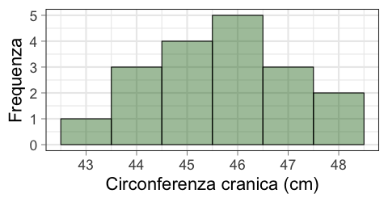
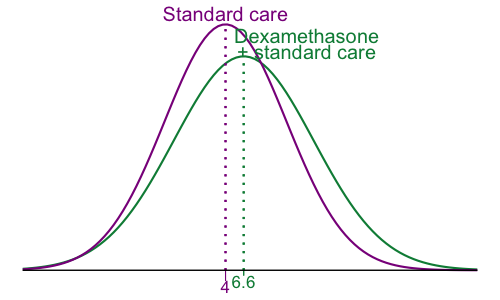
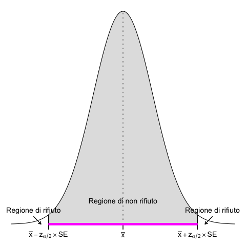
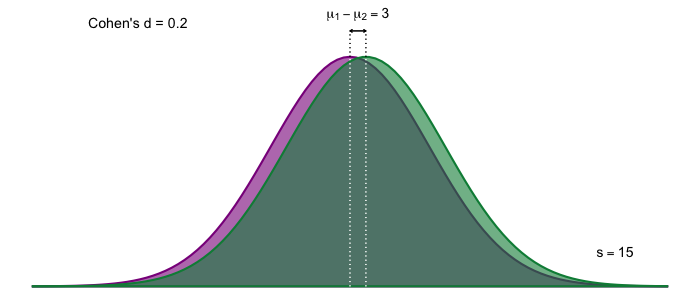
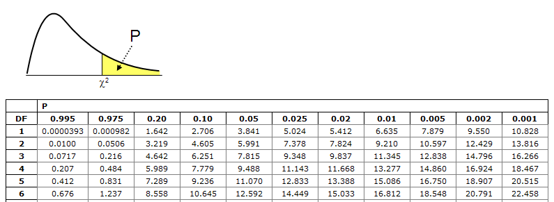
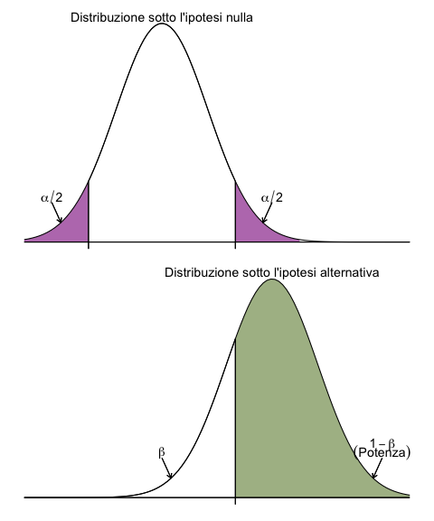

<!-- ### Lezione 8 -->

# La statistica inferenziale
## (Parte II: Test di ipotesi)
## &nbsp;

---
## Obiettivi di apprendimento

- Formulare e verificare ipotesi
- Interpretare i  P-value (e la loro relazione con i CI)
- Conoscere la differenza tra significativit&agrave; statistica e clinica
- Saper distinguere tra errori del primo e del secondo tipo 
- Interpretare la potenza di uno studio

---
## Le fasi della ricerca

Spiegelhalter, D., *The Art of Statistics: Learning From Data*, Pelican, 2019

<!-- The Analysis stage has traditionally been the main emphasis of statistics courses, and we shall cover a range of analytic techniques in this book.

Finally, the key to good statistical science is drawing appropriate Conclusions that fully acknowledge the limitations in the evidence, and communicating them clearly. Any conclusions generally raise more questions, and so the cycle starts over again
 -->

---
## Perch&eacute; c'&egrave; variabilit&agrave; nelle osservazioni?

:dart: &nbsp;&nbsp; Vedremo come determinare se la variabilit&agrave; &egrave; generata dalle condizioni 
&nbsp;&nbsp;&nbsp;&nbsp;&nbsp;&nbsp;&nbsp; sperimentali o se &egrave; generata da differenze individuali e/o da errori di 
&nbsp;&nbsp;&nbsp;&nbsp;&nbsp;&nbsp;&nbsp; misurazione

 

 

---
##   &nbsp;&nbsp;&nbsp;&nbsp;&nbsp;&nbsp;:warning:  Attenzione  :warning:

&nbsp;&nbsp;&nbsp;&nbsp;&nbsp;&nbsp;&nbsp;&nbsp; Questa parte continua a essere complessa, ma non 
&nbsp;&nbsp;&nbsp;&nbsp;&nbsp;&nbsp;&nbsp;&nbsp; demordete: siamo alla fine! 

---
## Cos'&egrave; un'ipotesi?

:dart: &nbsp;&nbsp;&nbsp; Una possibile spiegazione per un fenomeno, che non
&nbsp;&nbsp;&nbsp;&nbsp;&nbsp;&nbsp;&nbsp;&nbsp; rappresenta la verit&agrave; assoluta, ma una congettura 
&nbsp;&nbsp;&nbsp;&nbsp;&nbsp;&nbsp;&nbsp;&nbsp; provvisoria

<!-- 
Ogni studio inizia con un'ipotesi, quella che viene chiamata "domanda di ricerca"

A hypothesis can be defined as a proposed explanation for a phenomenon. It is not the absolute truth, but a provisional, working assumption, perhaps best thought of as a potential suspect in a criminal case. -->

---
## Esempi di ipotesi

- L'esito di un trattamento &egrave; diverso nel gruppo di trattamento e di controllo
- La proporzione di un evento &egrave; diversa nel gruppo di trattamento e di controllo

<!-- Il metodo scientifico si basa sulla falsificazione delle ipotesi (K. Popper). Quindi quello che andiamo a testare e' l'esatto opposto, la cosidette ipotesi nulle

The null hypothesis is what we are willing to assume is the case until proven otherwise. It is relentlessly negative, denying all progress and change. But this does not mean that we actually believe the null hypothesis is literally true

So we can never claim that the null hypothesis has been actually proved: in the words of another great British statistician, Ronald Fisher, ‘the null hypothesis is never proved or established, but is possibly disproved, in the course of experimentation. Every experiment may be said to exist only in order to give the facts a chance of disproving the null hypothesis.’

infatti il fatto di aver trovato dell'evidenza in favore di un'ipotesi non vuold dire che non sara' mai possibile trovare ulteriore evidenza che la renda falsa

Nulla e alternativa sono mutualmente esclusive e insieme descrivono tutti possibili casi

Ogni studio inizia con un'ipotesi, quella che viene chiamata "domanda di ricerca"
Questo e' cosa ci aspettiamo di poter concludere come risultato del nostro test statistico 

Un'ipotesi puo' essere definita come una congettura su una o piu' popplaioni 
-->

--- 
### Esercizio #1

:question: &nbsp;&nbsp;&nbsp; Supponiamo che la nostra ipotesi sia che tutti coloro che vivono pi&ugrave; 
&nbsp;&nbsp;&nbsp;&nbsp;&nbsp;&nbsp;&nbsp;&nbsp; di 90 anni siano non fumatori

&nbsp;&nbsp;&nbsp;&nbsp;&nbsp;&nbsp;&nbsp;&nbsp; Per indagare questa ipotesi &egrave; pi&ugrave; facile...

&nbsp;&nbsp;&nbsp;&nbsp;&nbsp;&nbsp;&nbsp;&nbsp; a) <u>Dimostrare l'ipotesi</u> trovando ogni singola persona di 90 anni  
&nbsp;&nbsp;&nbsp;&nbsp;&nbsp;&nbsp;&nbsp;&nbsp;&nbsp;&nbsp;&nbsp;&nbsp; o pi&ugrave; e verificare che siano tutti non fumatori
&nbsp;&nbsp;&nbsp;&nbsp;&nbsp;&nbsp;&nbsp;&nbsp; b) <u>Confutare l'ipotesi</u> trovando una sola persona di 90 anni o pi&ugrave; 
&nbsp;&nbsp;&nbsp;&nbsp;&nbsp;&nbsp;&nbsp;&nbsp;&nbsp;&nbsp;&nbsp;&nbsp; che sia un fumatore

<button id="countdown_exercise_1"></button>

--- 
### Esercizio #1 -- Soluzione

:question: &nbsp;&nbsp;&nbsp; Supponiamo che la nostra ipotesi sia che tutti coloro che vivono pi&ugrave; 
&nbsp;&nbsp;&nbsp;&nbsp;&nbsp;&nbsp;&nbsp;&nbsp; di 90 anni siano non fumatori

&nbsp;&nbsp;&nbsp;&nbsp;&nbsp;&nbsp;&nbsp;&nbsp; Per indagare questa ipotesi &egrave; pi&ugrave; facile...

&nbsp;&nbsp;&nbsp;&nbsp;&nbsp;&nbsp;&nbsp;&nbsp; a) <u>Dimostrare l'ipotesi</u> trovando ogni singola persona di 90 anni  
&nbsp;&nbsp;&nbsp;&nbsp;&nbsp;&nbsp;&nbsp;&nbsp;&nbsp;&nbsp;&nbsp;&nbsp; o pi&ugrave; e verificare che siano tutti non fumatori
&nbsp;&nbsp;&nbsp;&nbsp;&nbsp;&nbsp;&nbsp;&nbsp; b) <u>Confutare l'ipotesi</u> trovando una sola persona di 90 anni o pi&ugrave; 
&nbsp;&nbsp;&nbsp;&nbsp;&nbsp;&nbsp;&nbsp;&nbsp;&nbsp;&nbsp;&nbsp;&nbsp; che sia un fumatore &nbsp;&nbsp; :white_check_mark:

---
### Il principio di falsificabilit&agrave; e l'ipotesi nulla

- L'esito di un trattamento &egrave; <s>diverso</s> **uguale** nel gruppo di trattamento e di controllo
- La proporzione di un evento &egrave; <s>diversa</s>  **uguale** nel gruppo di trattamento e di controllo

<!-- 
Tuttavia quello che andiamo a testaere e' un'affermazione diversa, il suo opposto: sono dexamethasone e la cura standard uguali? 

È più semplice trovare evidenze contro un’ipotesi piuttosto che evidenze a favore

Il metodo scientifico si basa sulla falsificazione delle ipotesi (K. Popper), infatti il fatto di aver trovato dell'evidenza in favore di un'ipotesi non vuold dire che non sara' mai possibile trovare ulteriore evidenza che la renda falsa 
-->

---
### Esercizio #2

<!--  -->

:question: &nbsp;&nbsp;&nbsp; Qual &egrave; l'ipotesi nulla di questo studio

&nbsp;&nbsp;&nbsp;&nbsp;&nbsp;&nbsp;&nbsp;&nbsp; a) Dexamethasone e standard care  sono **pi&ugrave; efficaci** che lo standard care da solo
&nbsp;&nbsp;&nbsp;&nbsp;&nbsp;&nbsp;&nbsp;&nbsp; b) Dexamethasone e standard care  sono **meno efficaci** che lo standard care da solo
&nbsp;&nbsp;&nbsp;&nbsp;&nbsp;&nbsp;&nbsp;&nbsp; c) Dexamethasone e standard care  sono **tanto efficaci quanto** lo standard care da solo
&nbsp;&nbsp;&nbsp;&nbsp;&nbsp;&nbsp;&nbsp;&nbsp; d) Dexamethasone e standard care **non** sono **tanto efficaci quanto** lo standard care da solo

<button id="countdown_exercise_2"></button>

Tomazini, B.M., *et al.*, "Effect of dexamethasone on days alive and ventilator-free in patients with moderate or severe acute respiratory distress syndrome and COVID-19: the CoDEX randomized clinical trial.", JAMA, 2020, doi:10.1001/jama.2020.17021

---
### Esercizio #2 -- Soluzione

<!--  -->

:question: &nbsp;&nbsp;&nbsp; Qual &egrave; l'ipotesi nulla di questo studio

&nbsp;&nbsp;&nbsp;&nbsp;&nbsp;&nbsp;&nbsp;&nbsp; a) Dexamethasone e standard care  sono **pi&ugrave; efficaci** che lo standard care da solo
&nbsp;&nbsp;&nbsp;&nbsp;&nbsp;&nbsp;&nbsp;&nbsp; b) Dexamethasone e standard care  sono **meno efficaci** che lo standard care da solo
&nbsp;&nbsp;&nbsp;&nbsp;&nbsp;&nbsp;&nbsp;&nbsp; c) Dexamethasone e standard care  sono **tanto efficaci quanto** lo standard care da solo &nbsp;&nbsp; :white_check_mark:
&nbsp;&nbsp;&nbsp;&nbsp;&nbsp;&nbsp;&nbsp;&nbsp; d) Dexamethasone e standard care **non** sono **tanto efficaci quanto** lo standard care da solo

---
### Esercizio #3

<!--  -->

:question: &nbsp;&nbsp;&nbsp; Come formuleresti operativamente l’ipotesi nulla di questo studio?

&nbsp;&nbsp;&nbsp;&nbsp;&nbsp;&nbsp;&nbsp;&nbsp; a) $\mu_{\text{c}} - \mu_{\text{i}} = 0$ 
&nbsp;&nbsp;&nbsp;&nbsp;&nbsp;&nbsp;&nbsp;&nbsp; b) $\mu_{\text{c}} - \mu_{\text{i}} \neq 0$
&nbsp;&nbsp;&nbsp;&nbsp;&nbsp;&nbsp;&nbsp;&nbsp; c) $\bar{x}_\text{c}-\bar{x}_\text{i} = 0$
&nbsp;&nbsp;&nbsp;&nbsp;&nbsp;&nbsp;&nbsp;&nbsp; d) $\bar{x}_\text{c}-\bar{x}_\text{i} \neq 0$

<button id="countdown_exercise_3"></button>

---
### Esercizio #3 -- Soluzione

<!--  -->

:question: &nbsp;&nbsp;&nbsp; Come formuleresti operativamente l’ipotesi nulla di questo studio?

&nbsp;&nbsp;&nbsp;&nbsp;&nbsp;&nbsp;&nbsp;&nbsp; a) $\mu_{\text{c}} - \mu_{\text{i}} = 0$ &nbsp;&nbsp; :white_check_mark:
&nbsp;&nbsp;&nbsp;&nbsp;&nbsp;&nbsp;&nbsp;&nbsp; b) $\mu_{\text{c}} - \mu_{\text{i}} \neq 0$
&nbsp;&nbsp;&nbsp;&nbsp;&nbsp;&nbsp;&nbsp;&nbsp; c) $\bar{x}_\text{c}-\bar{x}_\text{i} = 0$
&nbsp;&nbsp;&nbsp;&nbsp;&nbsp;&nbsp;&nbsp;&nbsp; d) $\bar{x}_\text{c}-\bar{x}_\text{i} \neq 0$

---
## Formulare ipotesi

:pushpin: &nbsp;&nbsp;&nbsp; Dexamethasone e standard care  sono **tanto efficaci quanto** lo 
&nbsp;&nbsp;&nbsp;&nbsp;&nbsp;&nbsp;&nbsp;&nbsp; standard care da solo

&nbsp;&nbsp;&nbsp;&nbsp;&nbsp;&nbsp;&nbsp;&nbsp; $\mu_{\text{c}} - \mu_{\text{i}} = 0$ 
&nbsp;&nbsp;&nbsp;&nbsp;&nbsp;&nbsp;&nbsp;&nbsp;&nbsp;&nbsp;&nbsp;&nbsp;&nbsp;&nbsp;&nbsp;&nbsp;&nbsp;&nbsp;&nbsp;&nbsp;&nbsp; $\rightarrow \text{Ipotesi nulla} \text{ } (\mathcal{H}_0)$

<!-- Il metodo statistico formalizza questa idea (È più semplice trovare evidenze contro un’ipotesi piuttosto che evidenze a favore) attraverso l’ipotesi nulla, 

HO ci dice che non ci sono differenze. Dexamethasome ha la stessa efficacia della terapia standard e non aumenta il numero di giorni di respirazione autonoma.

L’ipotesi nulla (𝐻_0 )  è l’ipotesi considerata vera finché non vengono presentate delle prove (evidenza empirica) per mostrare che non lo è

come per i dinosauri: non ganno piume sino a che non ne troviamo uno che ce l'ha

Non possiamo provare una teoria, ma possiamo falsificare delle affermazioni -->

---
## Formulare ipotesi

:pushpin: &nbsp;&nbsp;&nbsp; Dexamethasone e standard care  sono **tanto efficaci quanto** lo 
&nbsp;&nbsp;&nbsp;&nbsp;&nbsp;&nbsp;&nbsp;&nbsp; standard care da solo

&nbsp;&nbsp;&nbsp;&nbsp;&nbsp;&nbsp;&nbsp;&nbsp; $\mu_{\text{c}} - \mu_{\text{i}}  = 0$
&nbsp;&nbsp;&nbsp;&nbsp;&nbsp;&nbsp;&nbsp;&nbsp;&nbsp;&nbsp;&nbsp;&nbsp;&nbsp;&nbsp;&nbsp;&nbsp;&nbsp;&nbsp;&nbsp;&nbsp;&nbsp; $\rightarrow \text{Ipotesi nulla} \text{ } (\mathcal{H}_0)$

&nbsp;&nbsp;&nbsp;&nbsp;&nbsp;&nbsp;&nbsp;&nbsp; $\mu_{\text{c}} - \mu_{\text{i}} \neq 0$ 
&nbsp;&nbsp;&nbsp;&nbsp;&nbsp;&nbsp;&nbsp;&nbsp;&nbsp;&nbsp;&nbsp;&nbsp;&nbsp;&nbsp;&nbsp;&nbsp;&nbsp;&nbsp;&nbsp;&nbsp;&nbsp; $\rightarrow \text{Ipotesi alternativa} \text{ } (\mathcal{H}_1/\mathcal{H}_A)$

<!-- e l'ipotesti alternativa (la nostra congettura).
Le due ipotesi sono complementari: insieme esauriscono tutte i possibili valori assunti dal parametro studiato

ATtENZIONE: com il test di ipotesi non si fa la DIMOSTRAZIONE di un'ipotesi, si ha semplicemente un'indicazione sul fatto che l'ipotesi sia o meno supportata dai dati.

Non rifiutando l'ipotesi nulla, non diciamo che essa sia vera, ma che potrebbe essere vera 

ATTENZIONE ad un ultimo punto: i dati su cui andiamo a testare la nostra ipotesi sono quelli di un campione, ma l'ipotesi viene fatta sull'intera popolazione -->

---
### Esercizio #4

:question: &nbsp;&nbsp;&nbsp; Il fatto che l'ipotesi nulla e l'ipotesi alternativa siano mutualmente 
&nbsp;&nbsp;&nbsp;&nbsp;&nbsp;&nbsp;&nbsp;&nbsp; esclusive significa che se l'ipotesi nulla &egrave; vera, l'ipotesi alternativa...

&nbsp;&nbsp;&nbsp;&nbsp;&nbsp;&nbsp;&nbsp;&nbsp; a) deve anche essere vera
&nbsp;&nbsp;&nbsp;&nbsp;&nbsp;&nbsp;&nbsp;&nbsp; b) pu&ograve; essere sia vera sia falsa
&nbsp;&nbsp;&nbsp;&nbsp;&nbsp;&nbsp;&nbsp;&nbsp; c) deve essere falsa
&nbsp;&nbsp;&nbsp;&nbsp;&nbsp;&nbsp;&nbsp;&nbsp; d) dipende dall'ipotesi alternativa

<button id="countdown_exercise_4"></button>

---
### Esercizio #4 -- Soluzione

:question: &nbsp;&nbsp;&nbsp; Il fatto che l'ipotesi nulla e l'ipotesi alternativa siano mutualmente 
&nbsp;&nbsp;&nbsp;&nbsp;&nbsp;&nbsp;&nbsp;&nbsp; esclusive significa che se l'ipotesi nulla &egrave; vera, l'ipotesi alternativa...

&nbsp;&nbsp;&nbsp;&nbsp;&nbsp;&nbsp;&nbsp;&nbsp; a) deve anche essere vera
&nbsp;&nbsp;&nbsp;&nbsp;&nbsp;&nbsp;&nbsp;&nbsp; b) pu&ograve; essere sia vera sia falsa
&nbsp;&nbsp;&nbsp;&nbsp;&nbsp;&nbsp;&nbsp;&nbsp; c) deve essere falsa &nbsp;&nbsp; :white_check_mark:
&nbsp;&nbsp;&nbsp;&nbsp;&nbsp;&nbsp;&nbsp;&nbsp; d) dipende dall'ipotesi alternativa

---
## Verificare ipotesi

:pushpin: &nbsp;&nbsp;&nbsp; Dexamethasone e standard care  sono **tanto efficaci quanto** lo 
&nbsp;&nbsp;&nbsp;&nbsp;&nbsp;&nbsp;&nbsp;&nbsp; standard care da solo

&nbsp;&nbsp;&nbsp;&nbsp;&nbsp;&nbsp;&nbsp;&nbsp; $n_{\text{i}}= 151, \text{ } \text{ } \text{ } \text{ } \bar{x}_{\text{i}}= 6.6, \text{ } \text{ } \text{ }  s_\text{i} = 10.0$ 
&nbsp;&nbsp;&nbsp;&nbsp;&nbsp;&nbsp;&nbsp;&nbsp; $n_{\text{c}}= 148, \text{ } \text{ }  \text{ } \text{ }  \bar{x}_{\text{c}}= 4.0, \text{ } \text{ }  s_\text{c} = 8.7$ 

<!--  -->

  Tomazini B.M., *et al.*, *Effect of Dexamethasone on Days Alive and Ventilator-Free in Patients With  Moderate or Severe Acute Respiratory Distress Syndrome and COVID-19*, JAMA, 2020

---
## Verificare ipotesi

:pushpin: &nbsp;&nbsp;&nbsp; Dexamethasone e standard care  sono **tanto efficaci quanto** lo 
&nbsp;&nbsp;&nbsp;&nbsp;&nbsp;&nbsp;&nbsp;&nbsp; standard care da solo

&nbsp;&nbsp;&nbsp;&nbsp;&nbsp;&nbsp;&nbsp;&nbsp; $n_{\text{i}}=151, \bar{x}_{\text{i}}=6.6, s_{\text{i}}=10.0$ 
&nbsp;&nbsp;&nbsp;&nbsp;&nbsp;&nbsp;&nbsp;&nbsp; $n_{\text{c}}=148, \bar{x}_{\text{c}}=4.0, s_{\text{c}}=8.7$ 

&nbsp;&nbsp;&nbsp;&nbsp;&nbsp;&nbsp;&nbsp;&nbsp; $\mu_{\text{c}} - \mu_{\text{i}} = 0$ &nbsp;&nbsp;&nbsp; $\leftarrow$
&nbsp;&nbsp;&nbsp;&nbsp;&nbsp;&nbsp;&nbsp;&nbsp; $\bar{x}_{\text{c}} - \bar{x}_{\text{i}} = 6.6 - 4.0 = 2.6$

---
### Esercizio #5

:question: &nbsp;&nbsp;&nbsp; Anche se l'ipotesi nulla fosse vera, la differenza delle medie potrebbe 
&nbsp;&nbsp;&nbsp;&nbsp;&nbsp;&nbsp;&nbsp;&nbsp; non essere esattamente zero a causa...

&nbsp;&nbsp;&nbsp;&nbsp;&nbsp;&nbsp;&nbsp;&nbsp; a) dell'ipotesi nulla, che &egrave; stata formulata in modo impreciso
&nbsp;&nbsp;&nbsp;&nbsp;&nbsp;&nbsp;&nbsp;&nbsp; b) di differenze individuali 
&nbsp;&nbsp;&nbsp;&nbsp;&nbsp;&nbsp;&nbsp;&nbsp; c) di errori di misurazione
&nbsp;&nbsp;&nbsp;&nbsp;&nbsp;&nbsp;&nbsp;&nbsp; d) se l'ipotesi nulla &egrave; vera, la differenza &egrave; sempre zero

<button id="countdown_exercise_5"></button>

---
### Esercizio #5 -- Soluzione

:question: &nbsp;&nbsp;&nbsp; Anche se l'ipotesi nulla fosse vera, la differenza delle medie potrebbe 
&nbsp;&nbsp;&nbsp;&nbsp;&nbsp;&nbsp;&nbsp;&nbsp; non essere esattamente zero a causa...

&nbsp;&nbsp;&nbsp;&nbsp;&nbsp;&nbsp;&nbsp;&nbsp; a) dell'ipotesi nulla, che &egrave; stata formulata in modo impreciso
&nbsp;&nbsp;&nbsp;&nbsp;&nbsp;&nbsp;&nbsp;&nbsp; b) di differenze individuali &nbsp;&nbsp; :white_check_mark:
&nbsp;&nbsp;&nbsp;&nbsp;&nbsp;&nbsp;&nbsp;&nbsp; c) di errori di misurazione &nbsp;&nbsp; :white_check_mark:
&nbsp;&nbsp;&nbsp;&nbsp;&nbsp;&nbsp;&nbsp;&nbsp; d) se l'ipotesi nulla &egrave; vera, la differenza &egrave; sempre zero

Errore di campionamento

---
## Verificare ipotesi

:pushpin: &nbsp;&nbsp;&nbsp; Dexamethasone e standard care  sono **tanto efficaci quanto** lo 
&nbsp;&nbsp;&nbsp;&nbsp;&nbsp;&nbsp;&nbsp;&nbsp; standard care da solo

&nbsp;&nbsp;&nbsp;&nbsp;&nbsp;&nbsp;&nbsp;&nbsp; $n_{\text{i}}=151, \bar{x}_{\text{i}}=6.6, s_{\text{i}}=10.0$ 
&nbsp;&nbsp;&nbsp;&nbsp;&nbsp;&nbsp;&nbsp;&nbsp; $n_{\text{c}}=148, \bar{x}_{\text{c}}=4.0, s_{\text{c}}=8.7$ 

&nbsp;&nbsp;&nbsp;&nbsp;&nbsp;&nbsp;&nbsp;&nbsp; $\mu_{\text{c}} - \mu_{\text{i}} = 0$ &nbsp;&nbsp;&nbsp; $\leftarrow$
&nbsp;&nbsp;&nbsp;&nbsp;&nbsp;&nbsp;&nbsp;&nbsp; $\bar{x}_{\text{c}} - \bar{x}_{\text{i}} = 6.6 - 4.0 = 2.6$

:question: &nbsp;&nbsp;&nbsp; Qual &egrave; la probabilit&agrave; di osservare una differenza di 2.6 giorni se 
&nbsp;&nbsp;&nbsp;&nbsp;&nbsp;&nbsp;&nbsp;&nbsp;  $\mu_{\text{c}} - \mu_{\text{i}} = 0$?

<!-- Se &egrave; abbastanza probabile, tipo 1 caso su 10, vuol dire che e' abbastanza vicino, se invece e' 1 su 1000 allora e' alquanto improbabile, e di conseguenza vuol dire che e' "sufficientemente lontano".

Se vi dico probabilita' di osservare, quale argomento passato vi viene in mente? -->

---
## Facciamo un paio di passi indietro

1. La Normale &egrave; definita dalla sua media e deviazione standard e corrisponde a una distribuzione di probabilit&agrave;
&nbsp;&nbsp;&nbsp;&nbsp;&nbsp;&nbsp;&nbsp;&nbsp; $\rightarrow$ &nbsp;&nbsp;&nbsp; Area sottesa a $Z$ $\equiv$ probabilit&agrave; $\mathcal{P}$
2. Il teorema del limite centrale ci dice che le distribuzioni campionarie (incluso la differenza delle medie) tendono alla Normale

---
## Facciamo un paio di passi indietro

1. La Normale &egrave; definita dalla sua media e deviazione standard e corrisponde a una distribuzione di probabilit&agrave;
&nbsp;&nbsp;&nbsp;&nbsp;&nbsp;&nbsp;&nbsp;&nbsp; $\rightarrow$ &nbsp;&nbsp;&nbsp; Area sottesa a $Z$ $\equiv$ probabilit&agrave; $\mathcal{P}$
2. Il teorema del limite centrale ci dice che le distribuzioni campionarie (incluso la differenza delle medie) tendono alla Normale

Per la differenza tra due medie

&nbsp;&nbsp;&nbsp;&nbsp;&nbsp;&nbsp;&nbsp;&nbsp; $\mathcal{N} = (\mu_1 - \mu_2, \frac{\sigma_1^2}{n_1} + \frac{\sigma_2^2}{n_2})$ con 
&nbsp;&nbsp;&nbsp;&nbsp;&nbsp;&nbsp;&nbsp;&nbsp; $\sqrt{ \frac{\sigma_1^2}{n_1} + \frac{\sigma_2^2}{n_2} } \rightarrow$ &nbsp; standard error

---
## Verificare ipotesi

:pushpin: &nbsp;&nbsp;&nbsp; Dexamethasone e standard care  sono **tanto efficaci quanto** lo 
&nbsp;&nbsp;&nbsp;&nbsp;&nbsp;&nbsp;&nbsp;&nbsp; standard care da solo

&nbsp;&nbsp;&nbsp;&nbsp;&nbsp;&nbsp;&nbsp;&nbsp;&nbsp; $n_{\text{i}}=151, \bar{x}_{\text{i}}=6.6, s_{\text{i}}=10.0$ 
&nbsp;&nbsp;&nbsp;&nbsp;&nbsp;&nbsp;&nbsp;&nbsp;&nbsp; $n_{\text{c}}=148, \bar{x}_{\text{c}}=4.0, s_{\text{c}}=8.7$ 

&nbsp;&nbsp;&nbsp;&nbsp;&nbsp;&nbsp;&nbsp;&nbsp;&nbsp; $\mu_{\text{c}} - \mu_{\text{i}} = 0$ &nbsp;&nbsp;&nbsp; $\leftarrow$
&nbsp;&nbsp;&nbsp;&nbsp;&nbsp;&nbsp;&nbsp;&nbsp;&nbsp; $\bar{x}_{\text{c}} - \bar{x}_{\text{i}} = 6.6 - 4.0 = 2.6$

<!-- 

 -->

&nbsp;&nbsp;&nbsp;&nbsp;&nbsp;&nbsp;&nbsp;&nbsp; $\mathcal{N} = (\mu_{\text{c}} - \mu_{\text{i}}, \frac{\sigma_c^2}{n_c} + \frac{\sigma_i^2}{n_i}) \text{  } \rightarrow  \text{  } \mu_{\text{c}} - \mu_{\text{i}} = 0$ 
&nbsp;&nbsp;&nbsp;&nbsp;&nbsp;&nbsp;&nbsp;&nbsp; $\hat{\text{SE}}^{(*)}= \sqrt{\frac{s_\text{c}^2}{n_\text{c}} + \frac{s_\text{i}^2}{n_\text{i}}} = 1.08$ 

 

&nbsp;&nbsp;&nbsp;&nbsp;&nbsp; $^{(*)}$ In realt&agrave; non conosciamo $\sigma$ ma solo $s$, quindi quello che usiamo &egrave; una $t$ di Student con $(n_\text{c} + n_\text{i} - 2)$ gradi di libert&agrave;

---
## Verificare ipotesi

:pushpin: &nbsp;&nbsp;&nbsp; Dexamethasone e standard care  sono **tanto efficaci quanto** lo 
&nbsp;&nbsp;&nbsp;&nbsp;&nbsp;&nbsp;&nbsp;&nbsp; standard care da solo

&nbsp;&nbsp;&nbsp;&nbsp;&nbsp;&nbsp;&nbsp;&nbsp;&nbsp; $\mu_{\text{c}} - \mu_{\text{i}} = 0$
&nbsp;&nbsp;&nbsp;&nbsp;&nbsp;&nbsp;&nbsp;&nbsp;&nbsp; $\hat{\text{SE}}=1.08$

&nbsp;&nbsp;&nbsp;&nbsp;&nbsp;&nbsp;&nbsp;&nbsp;&nbsp; $\bar{x}_{\text{c}} - \bar{x}_{\text{i}} = 6.6 - 4.0 = 2.6$

:question: &nbsp;&nbsp;&nbsp; Qual &egrave; la probabilit&agrave; di osservare
&nbsp;&nbsp;&nbsp;&nbsp;&nbsp;&nbsp;&nbsp;&nbsp;  una differenza di 2.6 giorni se 
&nbsp;&nbsp;&nbsp;&nbsp;&nbsp;&nbsp;&nbsp;&nbsp; $\mu_{\text{c}} - \mu_{\text{i}} = 0$?

&nbsp;&nbsp;&nbsp;&nbsp;&nbsp;&nbsp;&nbsp;&nbsp;&nbsp; $t = \frac{(\bar{x}_{\text{c}} - \bar{x}_{\text{i}}) - (\mu_{\text{c}} - \mu_{\text{i}})}{\hat{SE}} = \frac{2.6-0}{1.08} = 2.4$

---
## Verificare ipotesi

:pushpin: &nbsp;&nbsp;&nbsp; Dexamethasone e standard care  sono **tanto efficaci quanto** lo 
&nbsp;&nbsp;&nbsp;&nbsp;&nbsp;&nbsp;&nbsp;&nbsp; standard care da solo

&nbsp;&nbsp;&nbsp;&nbsp;&nbsp;&nbsp;&nbsp;&nbsp;&nbsp; $\mu_{\text{c}} - \mu_{\text{i}} = 0$
&nbsp;&nbsp;&nbsp;&nbsp;&nbsp;&nbsp;&nbsp;&nbsp;&nbsp; $\hat{\text{SE}}=1.08$

&nbsp;&nbsp;&nbsp;&nbsp;&nbsp;&nbsp;&nbsp;&nbsp;&nbsp; $\bar{x}_{\text{c}} - \bar{x}_{\text{i}} = 6.6 - 4.0 = 2.6$

:question: &nbsp;&nbsp;&nbsp; Qual &egrave; la probabilit&agrave; di osservare
&nbsp;&nbsp;&nbsp;&nbsp;&nbsp;&nbsp;&nbsp;&nbsp;  una differenza di 2.6 giorni se 
&nbsp;&nbsp;&nbsp;&nbsp;&nbsp;&nbsp;&nbsp;&nbsp; $\mu_{\text{c}} - \mu_{\text{i}} = 0$?

&nbsp;&nbsp;&nbsp;&nbsp;&nbsp;&nbsp;&nbsp;&nbsp;&nbsp; $t = 2.4 \rightarrow \mathcal{P} = 2 \times 0.008 = 0.016$

<!-- P = 1.4e-16 

Usando il P-value, che ci dice quanto sono improbabili i risultati ottenuti da questo campione dato che l'ipotesi nulla &egrave; vera.

Un P-value molto piccolo ci dice quindi che sia molto improbabile che H0 sia vera dandoci una forte ragione per dubitare che le due medie siano uguali 

-->

---
## P-value

:dart: &nbsp;&nbsp;&nbsp; Il P-value misura la discrepanza tra i dati e $\mathcal{H}_0$ e corrisponde alla
&nbsp;&nbsp;&nbsp;&nbsp;&nbsp;&nbsp;&nbsp;&nbsp; probabilit&agrave; di ottenere un risultato tanto estremo quanto quello 
&nbsp;&nbsp;&nbsp;&nbsp;&nbsp;&nbsp;&nbsp;&nbsp; ottenuto se l'ipotesi nulla fosse vera.

---
## P-value

:dart: &nbsp;&nbsp;&nbsp; Il P-value misura la discrepanza tra i dati e $\mathcal{H}_0$ e corrisponde alla
&nbsp;&nbsp;&nbsp;&nbsp;&nbsp;&nbsp;&nbsp;&nbsp; probabilit&agrave; di ottenere un risultato tanto estremo quanto quello 
&nbsp;&nbsp;&nbsp;&nbsp;&nbsp;&nbsp;&nbsp;&nbsp; ottenuto se l'ipotesi nulla fosse vera.

&nbsp;&nbsp;&nbsp;&nbsp;&nbsp;&nbsp;&nbsp;&nbsp;&nbsp;&nbsp;&nbsp;&nbsp;&nbsp;&nbsp;&nbsp; $\text{P-value} = 0.5 \rightarrow 50\% \rightarrow 1 \text{ campione su } 2$
&nbsp;&nbsp;&nbsp;&nbsp;&nbsp;&nbsp;&nbsp;&nbsp;&nbsp;&nbsp;&nbsp;&nbsp;&nbsp;&nbsp;&nbsp; $\text{P-value} = 0.1 \rightarrow 10\% \rightarrow 1 \text{ campione su } 10$
&nbsp;&nbsp;&nbsp;&nbsp;&nbsp;&nbsp;&nbsp;&nbsp;&nbsp;&nbsp;&nbsp;&nbsp;&nbsp;&nbsp;&nbsp; $\text{P-value} = 0.05 \rightarrow 5\% \rightarrow 1 \text{ campione su } 20$
&nbsp;&nbsp;&nbsp;&nbsp;&nbsp;&nbsp;&nbsp;&nbsp;&nbsp;&nbsp;&nbsp;&nbsp;&nbsp;&nbsp;&nbsp; $\text{P-value} = 0.01 \rightarrow 1\% \rightarrow 1 \text{ campione su } 100$
&nbsp;&nbsp;&nbsp;&nbsp;&nbsp;&nbsp;&nbsp;&nbsp;&nbsp;&nbsp;&nbsp;&nbsp;&nbsp;&nbsp;&nbsp; $\text{P-value} = 0.005 \rightarrow 0.5\% \rightarrow 1 \text{ campione su } 200$

 <!-- ci dice quanto e' probabile fare un errore (il peso alla nascita e' diverso) se accettiamo l'ipotesi nulla 
  
  Se p-value = 0.02
  Se l’ipotesi nulla fosse vera, la probabilità di osservare il risultato che abbiamo ottenuto, o una differenza ancora maggiore, sarebbe solo dell’2%
  Se il farmaco non fosse efficace (ipotesi nulla fosse vera) solo in 2 campione ogni 100 avremmo il risultato osservato 

  In modo molto informale. L’espressione statisticamente significativo vuol dire che sono state raccolte prove sufficienti per rifiutare l’ipotesi nulla 
  
 -->

---
## P-value e significativit&agrave; statistica

:dart: &nbsp;&nbsp;&nbsp; Il P-value misura la discrepanza tra i dati e $\mathcal{H}_0$ e corrisponde alla
&nbsp;&nbsp;&nbsp;&nbsp;&nbsp;&nbsp;&nbsp;&nbsp; probabilit&agrave; di ottenere un risultato tanto estremo quanto quello 
&nbsp;&nbsp;&nbsp;&nbsp;&nbsp;&nbsp;&nbsp;&nbsp; ottenuto se l'ipotesi nulla fosse vera.

&nbsp;&nbsp;&nbsp;&nbsp;&nbsp;&nbsp;&nbsp;&nbsp; Se il P-value &egrave; minore di una soglia critica (o livello di significativit&agrave;) 
&nbsp;&nbsp;&nbsp;&nbsp;&nbsp;&nbsp;&nbsp;&nbsp; $\alpha$,  possiamo dire che il risultato &egrave; statisticamente significativo

&nbsp;&nbsp;&nbsp;&nbsp;&nbsp;&nbsp;&nbsp;&nbsp;&nbsp;&nbsp;&nbsp;&nbsp;&nbsp;&nbsp;&nbsp; $\alpha = 0.05 \text{ oppure } 0.01$

<!-- 
In modo molto informale. L’espressione statisticamente significativo vuol dire che sono state raccolte prove sufficienti per rifiutare l’ipotesi nulla 

Ronald Fisher used P < 0.05 and P < 0.01 as convenient critical thresholds for indicating significance, and produced tables of the critical values of test statistics needed to achieve these levels of significance. The popularity of these tables led to 0.05 and 0.01 becoming established conventions, although it is now recommended that exact P-values should be reported. 

The standard thresholds for declaring ‘significance’, P < 0.05 and P < 0.01, were fairly arbitrary choices by Ronald Fisher for his tables, back in the days when calculating exact P-values was not possible using the mechanical and electrical calculators available. 

And it is important to emphasize that the exact P-value is conditional not only on the truth of the null hypothesis, but also on all other assumptions underlying the statistical model, such as lack of systematic bias, independent observations, and so on.

--->

---
## Perch&eacute;?

<!--  -->

- &Egrave; conveniente decidere quando uno pu&ograve; dire "o c'&egrave; qualcosa nel trattamento o c'&egrave; una coincidenza che avviene pi&ugrave; di 1 volta su 20" <!-- (1926) -->
- Il valore per cui $\alpha$ = 0.05, o 1 in 20, &egrave; 1.96 o circa 2 [...] Deviazioni oltre due volte la deviazione standard sono considerate formalmente come significative <!-- (1956) -->
- Se 1/20 non &egrave; abbastanza, e se lo preferiamo, possiamo usare 1/50 (2%) o 1/100 (1%) <!-- (1926) -->

<!-- 1914, Karl Pearson published his Tables for Statisticians & Biometricians 

Fisher published Statistical
Methods for Research Workers (SMRW) in 1925, he included tables that gave the value of the
random variable for specially selected values ofP

Kendall mentioned that Fisher produced the tables of significance levels to save space and to avoid copyright problems with Karl Pearson, whom he disliked in Foundations of Statistical Inference, 1971

-->

---
### Esercizio #6

:question: &nbsp;&nbsp;&nbsp; Quando in uno studio si dice che il risultato &egrave; "statisticamente significativo"
&nbsp;&nbsp;&nbsp;&nbsp;&nbsp;&nbsp;&nbsp;&nbsp; significa che...

&nbsp;&nbsp;&nbsp;&nbsp;&nbsp;&nbsp;&nbsp;&nbsp; a) l'ipotesi nulla &egrave; stata rifiutata
&nbsp;&nbsp;&nbsp;&nbsp;&nbsp;&nbsp;&nbsp;&nbsp; b) l'ipotesi nulla **non** &egrave;  stata rifiutata
&nbsp;&nbsp;&nbsp;&nbsp;&nbsp;&nbsp;&nbsp;&nbsp; c) il risultato osservato &egrave; probabilmente dovuto a errori di campionamento
&nbsp;&nbsp;&nbsp;&nbsp;&nbsp;&nbsp;&nbsp;&nbsp; d) il risultato osservato **non** &egrave; probabilmente dovuto a errori di 
&nbsp;&nbsp;&nbsp;&nbsp;&nbsp;&nbsp;&nbsp;&nbsp;&nbsp;&nbsp;&nbsp;&nbsp; campionamento
&nbsp;&nbsp;&nbsp;&nbsp;&nbsp;&nbsp;&nbsp;&nbsp; e) il p-value &egrave; inferiore al livello di significativit&agrave; $\alpha$
&nbsp;&nbsp;&nbsp;&nbsp;&nbsp;&nbsp;&nbsp;&nbsp; f) il p-value &egrave; superiore al livello di significativit&agrave; $\alpha$

<button id="countdown_exercise_6"></button>

---
### Esercizio #6 -- Soluzione

:question: &nbsp;&nbsp;&nbsp; Quando in uno studio si dice che il risultato &egrave; "statisticamente significativo"
&nbsp;&nbsp;&nbsp;&nbsp;&nbsp;&nbsp;&nbsp;&nbsp; significa che...

&nbsp;&nbsp;&nbsp;&nbsp;&nbsp;&nbsp;&nbsp;&nbsp; a) l'ipotesi nulla &egrave; stata rifiutata  &nbsp;&nbsp; :white_check_mark:
&nbsp;&nbsp;&nbsp;&nbsp;&nbsp;&nbsp;&nbsp;&nbsp; b) l'ipotesi nulla **non** &egrave;  stata rifiutata
&nbsp;&nbsp;&nbsp;&nbsp;&nbsp;&nbsp;&nbsp;&nbsp; c) il risultato osservato &egrave; probabilmente dovuto a errori di campionamento
&nbsp;&nbsp;&nbsp;&nbsp;&nbsp;&nbsp;&nbsp;&nbsp; d) il risultato osservato **non** &egrave; probabilmente dovuto a errori di 
&nbsp;&nbsp;&nbsp;&nbsp;&nbsp;&nbsp;&nbsp;&nbsp;&nbsp;&nbsp;&nbsp;&nbsp; campionamento &nbsp;&nbsp; :white_check_mark:
&nbsp;&nbsp;&nbsp;&nbsp;&nbsp;&nbsp;&nbsp;&nbsp; e) il p-value &egrave; inferiore al livello di significativit&agrave; $\alpha$ &nbsp;&nbsp; :white_check_mark:
&nbsp;&nbsp;&nbsp;&nbsp;&nbsp;&nbsp;&nbsp;&nbsp; f) il p-value &egrave; superiore al livello di significativit&agrave; $\alpha$

---
### Esercizio #7

:question: &nbsp;&nbsp;&nbsp; In uno studio clinico randomizzato, il P-value associato alla variabile  
&nbsp;&nbsp;&nbsp;&nbsp;&nbsp;&nbsp;&nbsp;&nbsp; “Sex” è pari a 0.48. Con un livello di significativit&agrave; del 5%, ci sono differenze 
&nbsp;&nbsp;&nbsp;&nbsp;&nbsp;&nbsp;&nbsp;&nbsp; statisticamente significative nella distribuzione maschi/femmine nei due 
&nbsp;&nbsp;&nbsp;&nbsp;&nbsp;&nbsp;&nbsp;&nbsp; gruppi?

&nbsp;&nbsp;&nbsp;&nbsp;&nbsp;&nbsp;&nbsp;&nbsp; a) S&igrave;, perch&eacute; il P-value &egrave; maggiore del livello di significativit&agrave;
&nbsp;&nbsp;&nbsp;&nbsp;&nbsp;&nbsp;&nbsp;&nbsp; b) S&igrave;, perch&eacute; il P-value &egrave; minore del livello di significativit&agrave;
&nbsp;&nbsp;&nbsp;&nbsp;&nbsp;&nbsp;&nbsp;&nbsp; c) No, perch&eacute; il P-value &egrave; maggiore del livello di significativit&agrave;
&nbsp;&nbsp;&nbsp;&nbsp;&nbsp;&nbsp;&nbsp;&nbsp; d) No, perch&eacute; il P-value &egrave; minore del livello di significativit&agrave;

<button id="countdown_exercise_7"></button>

---
### Esercizio #7 -- Soluzione

:question: &nbsp;&nbsp;&nbsp; In uno studio clinico randomizzato, il P-value associato alla variabile  
&nbsp;&nbsp;&nbsp;&nbsp;&nbsp;&nbsp;&nbsp;&nbsp; “Sex” è pari a 0.48. Con un livello di significativit&agrave; del 5%, ci sono differenze 
&nbsp;&nbsp;&nbsp;&nbsp;&nbsp;&nbsp;&nbsp;&nbsp; statisticamente significative nella distribuzione maschi/femmine nei due 
&nbsp;&nbsp;&nbsp;&nbsp;&nbsp;&nbsp;&nbsp;&nbsp; gruppi?

&nbsp;&nbsp;&nbsp;&nbsp;&nbsp;&nbsp;&nbsp;&nbsp; a) S&igrave;, perch&eacute; il P-value &egrave; maggiore del livello di significativit&agrave;
&nbsp;&nbsp;&nbsp;&nbsp;&nbsp;&nbsp;&nbsp;&nbsp; b) S&igrave;, perch&eacute; il P-value &egrave; minore del livello di significativit&agrave;
&nbsp;&nbsp;&nbsp;&nbsp;&nbsp;&nbsp;&nbsp;&nbsp; c) No, perch&eacute; il P-value &egrave; maggiore del livello di significativit&agrave; &nbsp;&nbsp; :white_check_mark:
&nbsp;&nbsp;&nbsp;&nbsp;&nbsp;&nbsp;&nbsp;&nbsp; d) No, perch&eacute; il P-value &egrave; minore del livello di significativit&agrave;

---
### Esercizio #8

:question: &nbsp;&nbsp;&nbsp; Se **non** rifiuto l'ipotesi nulla significa che

&nbsp;&nbsp;&nbsp;&nbsp;&nbsp;&nbsp;&nbsp;&nbsp; a) ho provato che l'ipotesi nulla sia vera
&nbsp;&nbsp;&nbsp;&nbsp;&nbsp;&nbsp;&nbsp;&nbsp; b) ho provato che l'ipotesi nulla sia falsa
&nbsp;&nbsp;&nbsp;&nbsp;&nbsp;&nbsp;&nbsp;&nbsp; c) le mie osservazioni sono compatibili con l'ipotesi nulla
&nbsp;&nbsp;&nbsp;&nbsp;&nbsp;&nbsp;&nbsp;&nbsp; d) le mie osservazioni non sono compatibili con l'ipotesi nulla
&nbsp;&nbsp;&nbsp;&nbsp;&nbsp;&nbsp;&nbsp;&nbsp; e) dipende dalla domanda di ricerca
&nbsp;&nbsp;&nbsp;&nbsp;&nbsp;&nbsp;&nbsp;&nbsp; f) nessuno dei precedenti

<button id="countdown_exercise_8"></button>

---
### Esercizio #8 -- Soluzione

:question: &nbsp;&nbsp;&nbsp; Se **non** rifiuto l'ipotesi nulla significa che

&nbsp;&nbsp;&nbsp;&nbsp;&nbsp;&nbsp;&nbsp;&nbsp; a) ho provato che l'ipotesi nulla sia vera
&nbsp;&nbsp;&nbsp;&nbsp;&nbsp;&nbsp;&nbsp;&nbsp; b) ho provato che l'ipotesi nulla sia falsa
&nbsp;&nbsp;&nbsp;&nbsp;&nbsp;&nbsp;&nbsp;&nbsp; c) le mie osservazioni sono compatibili con l'ipotesi nulla &nbsp; :white_check_mark:
&nbsp;&nbsp;&nbsp;&nbsp;&nbsp;&nbsp;&nbsp;&nbsp; d) le mie osservazioni non sono compatibili con l'ipotesi nulla
&nbsp;&nbsp;&nbsp;&nbsp;&nbsp;&nbsp;&nbsp;&nbsp; e) dipende dalla domanda di ricerca
&nbsp;&nbsp;&nbsp;&nbsp;&nbsp;&nbsp;&nbsp;&nbsp; f) nessuno dei precedenti

<!-- Il metodo statistico formalizza questa idea (È più semplice trovare evidenze contro un’ipotesi piuttosto che evidenze a favore) attraverso l’ipotesi nulla, 

HO ci dice che non ci sono differenze. I gemelli mono e di pesano uguale

L’ipotesi nulla (𝐻_0 )  è l’ipotesi considerata vera finché non vengono presentate delle prove (evidenza empirica) per mostrare che non lo è

Non possiamo provare una teoria, ma possiamo falsificare delle affermazioni -->

---
## Test di ipotesi, un passo alla volta

<!-- This whole process has become known as Null Hypothesis Significance Testing (NHST) and, as we shall see below, it has become a source of major controversy. But first we should examine how Fisher’s ideas are used in practice.

Ronald Fisher was an extraordinary, but difficult, man. He was extraordinary because he is regarded as a pioneering figure in two distinct fields – genetics and statistics. Yet he had a notorious temper and could be extremely critical of anyone who he felt questioned his ideas, while his support for eugenics and his public criticism of the evidence for the link between smoking and lung cancer damaged his standing. His personal reputation has suffered as his financial connections with the tobacco industry have been revealed, but his scientific reputation is undiminished, as his ideas find repeated new applications in the analysis of large data sets. --> -->

---
## Test di ipotesi, un passo alla volta

1. Definisco la mia ipotesi nulla $(\mathcal{H_0})$

&nbsp;&nbsp;&nbsp;&nbsp;&nbsp;&nbsp;&nbsp;&nbsp; Dexamethasone e standard care  sono **tanto efficaci quanto** lo 
&nbsp;&nbsp;&nbsp;&nbsp;&nbsp;&nbsp;&nbsp;&nbsp; standard care da solo
&nbsp;&nbsp;&nbsp;&nbsp;&nbsp;&nbsp;&nbsp;&nbsp; $\mathcal{H_0} : \mu_{\text{c}} - \mu_{\text{i}} = 0$

---
## Test di ipotesi, un passo alla volta

1. Definisco la mia ipotesi nulla $(\mathcal{H_0})$
2. Scelgo un test statistico che stimi qualcosa che, se abbastanza estremo, mi faccia dubitare di $\mathcal{H_0}$

&nbsp;&nbsp;&nbsp;&nbsp;&nbsp;&nbsp;&nbsp;&nbsp; $t$-test$^{(*)}$ della differenza di due medie campionarie

$^{(*)}$ Stiamo usando il $t$-test della differenza di due medie campionarie e non lo $z$-test perch&eacute; non conosciamo la deviazione standard $\sigma$ delle popolazioni (e stiamo usando $s$, quelle dei campioni).

---
## Test di ipotesi, un passo alla volta

1. Definisco la mia ipotesi nulla $(\mathcal{H_0})$
2. Scelgo un test statistico che stimi qualcosa che, se abbastanza estremo, mi faccia dubitare di $\mathcal{H_0}$
3. Genero la distribuzione campionaria del test scelto, assumendo $\mathcal{H_0}$ vera

&nbsp;&nbsp;&nbsp;&nbsp;&nbsp;&nbsp;&nbsp;&nbsp; $\mathcal{N} = (\mu_\text{c} - \mu_\text{i}, \text{SE})$, con $\mu_{\text{c}} - \mu_{\text{i}} = 0 \text{ e } \hat{\text{SE}}= \sqrt{\frac{s_\text{c}^2}{n_\text{c}} + \frac{s_\text{i}^2}{n_\text{i}}}$

---
## Test di ipotesi, un passo alla volta

1. Definisco la mia ipotesi nulla $(\mathcal{H_0})$
2. Scelgo un test statistico che stimi qualcosa che, se abbastanza estremo, mi faccia dubitare di $\mathcal{H_0}$
3. Genero la distribuzione campionaria del test scelto, assumendo $\mathcal{H_0}$ vera
4. Verifico se la statistica osservata si trovi sulla coda di questa distribuzione e assegno una probabilit&agrave; (P-value) a questo evento

&nbsp;&nbsp;&nbsp;&nbsp;&nbsp;&nbsp;&nbsp;&nbsp;  $\mathcal{P} = 2 \times 0.0082 =  0.0164$

<!-- P-value: the probability, were the null hypothesis true, of observing such an extreme statistic. The P-value is therefore a particular tail-area. -->

---
## Test di ipotesi, un passo alla volta

1. Definisco la mia ipotesi nulla $(\mathcal{H_0})$
2. Scelgo un test statistico che stimi qualcosa che, se abbastanza estremo, mi faccia dubitare di $\mathcal{H_0}$
3. Genero la distribuzione campionaria del test scelto, assumendo $\mathcal{H_0}$ vera
4. Verifico se la statistica osservata si trovi sulla coda di questa distribuzione e assegno una probabilit&agrave; (P-value) a questo evento
5. Dichiaro il risultato come statisticamente significativo se il P-value &egrave; inferiore a una soglia critica $\alpha$

&nbsp;&nbsp;&nbsp;&nbsp;&nbsp;&nbsp;&nbsp;&nbsp; $\text{P-value} = 2 \times 0.0082 =  0.0164 < \alpha = 0.05$ &nbsp;&nbsp; $\rightarrow$ &nbsp;&nbsp; rifiuto $\mathcal{H_0}$

<!-- P-value measures how likely it is that we would have observed such an extreme value were the null hypothesis really true. -->

---
## Comunicare il risultato

:pushpin: &nbsp;&nbsp;&nbsp; Dexamethasone e standard care non sono tanto efficaci quanto lo 
&nbsp;&nbsp;&nbsp;&nbsp;&nbsp;&nbsp;&nbsp;&nbsp; standard care da solo. Osserviamo una differenza statisticamente 
&nbsp;&nbsp;&nbsp;&nbsp;&nbsp;&nbsp;&nbsp;&nbsp; significativa di 2.6 giorni tra i due trattamenti (P = 0.016).

&nbsp;&nbsp;&nbsp;&nbsp;&nbsp;&nbsp;&nbsp;&nbsp; Qual &egrave; l'incertezza di questa stima?

---
### Esercizio #9

:question: &nbsp;&nbsp;&nbsp; Calcoliamo il 95% CI?  

&nbsp;&nbsp;&nbsp;&nbsp;&nbsp;&nbsp;&nbsp;&nbsp; $\bar{x}_{\text{c}} - \bar{x}_{\text{i}} = 2.6$ &nbsp;&nbsp; $\rightarrow$ &nbsp;&nbsp; $\mu_{\text{c}} - \mu_{\text{i}} = 2.6$ 

&nbsp;&nbsp;&nbsp;&nbsp;&nbsp;&nbsp;&nbsp;&nbsp; $\hat{\text{SE}}= \sqrt{\frac{s_\text{c}^2}{n_\text{c}} + \frac{s_\text{i}^2}{n_\text{i}}} = 1.08$ 

<button id="countdown_exercise_9"></button>

---
### Esercizio #9 -- Soluzione

:question: &nbsp;&nbsp;&nbsp; Calcoliamo il 95% CI? 

&nbsp;&nbsp;&nbsp;&nbsp;&nbsp;&nbsp;&nbsp;&nbsp; $\bar{x}_{\text{c}} - \bar{x}_{\text{i}} = 2.6$ &nbsp;&nbsp; $\rightarrow$ &nbsp;&nbsp; $\mu_{\text{c}} - \mu_{\text{i}} = 2.6$

&nbsp;&nbsp;&nbsp;&nbsp;&nbsp;&nbsp;&nbsp;&nbsp; $\hat{\text{SE}}= \sqrt{\frac{s_\text{c}^2}{n_\text{c}} + \frac{s_\text{i}^2}{n_\text{i}}} = 1.08$ 
&nbsp;&nbsp;&nbsp;&nbsp;&nbsp;&nbsp;&nbsp;&nbsp; $95\% \text{ ME} = 2 \times \hat{\text{SE}} = 2 \times 1.08 = 2.16$

---
### Esercizio #9 -- Soluzione

:question: &nbsp;&nbsp;&nbsp; Calcoliamo il 95% CI? 

&nbsp;&nbsp;&nbsp;&nbsp;&nbsp;&nbsp;&nbsp;&nbsp; $\bar{x}_{\text{c}} - \bar{x}_{\text{i}} = 2.6$ &nbsp;&nbsp; $\rightarrow$ &nbsp;&nbsp; $\mu_{\text{c}} - \mu_{\text{i}} = 2.6$ 

&nbsp;&nbsp;&nbsp;&nbsp;&nbsp;&nbsp;&nbsp;&nbsp; $\hat{\text{SE}}= \sqrt{\frac{s_\text{c}^2}{n_\text{c}} + \frac{s_\text{i}^2}{n_\text{i}}} = 1.08$ 
&nbsp;&nbsp;&nbsp;&nbsp;&nbsp;&nbsp;&nbsp;&nbsp; $95\% \text{ ME} = 2 \times \hat{\text{SE}} = 2 \times 1.08 = 2.16$

&nbsp;&nbsp;&nbsp;&nbsp;&nbsp;&nbsp;&nbsp;&nbsp; $\text{95\% CI} = (\bar{x}_{\text{i}} - \bar{x}_{\text{c}}) - \text{95\% ME} \text{ } ; \text{ } (\bar{x}_{\text{i}} - \bar{x}_{\text{c}}) + \text{95\% ME} =$
&nbsp;&nbsp;&nbsp;&nbsp;&nbsp;&nbsp;&nbsp;&nbsp;&nbsp;&nbsp;&nbsp;&nbsp;&nbsp;&nbsp;&nbsp;&nbsp;&nbsp;&nbsp;&nbsp;&nbsp; $= (2.6 - 2.16 \text{ } ; \text{ } 2.6+2.16 ) = (0.44 \text{ } ; \text{ } 4.78)$

---
## Comunicare il risultato

:pushpin: &nbsp;&nbsp;&nbsp; Dexamethasone e standard care  non sono tanto efficaci quanto lo 
&nbsp;&nbsp;&nbsp;&nbsp;&nbsp;&nbsp;&nbsp;&nbsp; standard care da solo. Osserviamo una differenza statisticamente 
&nbsp;&nbsp;&nbsp;&nbsp;&nbsp;&nbsp;&nbsp;&nbsp; significativa di 2.6 giorni (95% CI = 0.44 ; 4.78) tra i due trattamenti 
&nbsp;&nbsp;&nbsp;&nbsp;&nbsp;&nbsp;&nbsp;&nbsp; (P = 0.016).

---
## Test di ipotesi & intervallo di confidenza

:dart: &nbsp;&nbsp;&nbsp; L'intervallo di confidenza del 95% &egrave; l'insieme delle ipotesi nulle che non sono 
&nbsp;&nbsp;&nbsp;&nbsp;&nbsp;&nbsp;&nbsp;&nbsp; rifiutate con $\alpha = 0.05$

| Livello di confidenza | $\alpha$ | $\alpha/2$ |
| ----: | ----- | ---- | 
| 95% | 5% | 2.5% | 

---
## Test di ipotesi & intervallo di confidenza

:dart: &nbsp;&nbsp;&nbsp; L'intervallo di confidenza del 95% &egrave; l'insieme delle ipotesi nulle che non sono 
&nbsp;&nbsp;&nbsp;&nbsp;&nbsp;&nbsp;&nbsp;&nbsp; rifiutate con $\alpha = 0.05$

&nbsp;&nbsp;&nbsp;&nbsp;&nbsp;&nbsp;&nbsp;&nbsp; In un test a due code, $\text{P} <0.05$
&nbsp;&nbsp;&nbsp;&nbsp;&nbsp;&nbsp;&nbsp;&nbsp; se il 95% CI non include l'ipotesi
&nbsp;&nbsp;&nbsp;&nbsp;&nbsp;&nbsp;&nbsp;&nbsp; nulla (solitamente zero)

<!-- This intimate link between hypothesis testing and confidence intervals should stop people misinterpreting results that are not statistically significantly different from 0 – this does not mean that the null hypothesis is actually true, but simply that a confidence interval for the true value includes 0. Unfortunately, as we shall see later, this lesson is often ignored. -->

---
## Test di ipotesi & intervallo di confidenza

:dart: &nbsp;&nbsp;&nbsp; L'intervallo di confidenza del 95% &egrave; l'insieme delle ipotesi nulle che non sono 
&nbsp;&nbsp;&nbsp;&nbsp;&nbsp;&nbsp;&nbsp;&nbsp; rifiutate con $\alpha = 0.05$

&nbsp;&nbsp;&nbsp;&nbsp;&nbsp;&nbsp;&nbsp;&nbsp; In un test a due code, $\text{P} <0.05$ se il 95% CI non include l'ipotesi nulla 
&nbsp;&nbsp;&nbsp;&nbsp;&nbsp;&nbsp;&nbsp;&nbsp; (solitamente zero)

Sikich, L. *et al.*, *Intranasal Oxytocin in Children and Adolescents with Autism Spectrum Disorder*, NEJM, 2021

---
### Significativit&agrave; statistica e significativit&agrave; clinica

:pushpin: &nbsp;&nbsp;&nbsp; Dexamethasone e standard care  non sono tanto efficaci quanto lo 
&nbsp;&nbsp;&nbsp;&nbsp;&nbsp;&nbsp;&nbsp;&nbsp; standard care da solo. Osserviamo una differenza statisticamente 
&nbsp;&nbsp;&nbsp;&nbsp;&nbsp;&nbsp;&nbsp;&nbsp; significativa di 2.6 giorni (95% CI = 0.44 ; 4.78) tra i due trattamenti 
&nbsp;&nbsp;&nbsp;&nbsp;&nbsp;&nbsp;&nbsp;&nbsp; (P = 0.016).

&nbsp;&nbsp;&nbsp;&nbsp;&nbsp;&nbsp;&nbsp;&nbsp; Qual &egrave; la significativit&agrave; clinica del trattamento, tenendo conto che la 
&nbsp;&nbsp;&nbsp;&nbsp;&nbsp;&nbsp;&nbsp;&nbsp; differenza nella popolazione potrebbe essere di soli di 0.44 giorni?

---
## La dimensione dell'effetto

:pushpin: &nbsp;&nbsp;&nbsp; $d \text{ di Cohen}=  |\frac{\bar{x}_{\text{c}} - \bar{x}_{\text{i}}}{s_p}|$  &nbsp;&nbsp; con  &nbsp;&nbsp; $s_p = \sqrt{\frac{(n_i - 1) \times s_i + (n_c - 1) \times s_c}{(n_i - 1) + (n_c - 1)}}$

---
## La dimensione dell'effetto

:pushpin: &nbsp;&nbsp;&nbsp; $d \text{ di Cohen}=  |\frac{\bar{x}_{\text{c}} - \bar{x}_{\text{i}}}{s_p}|$  &nbsp;&nbsp; con  &nbsp;&nbsp; $s_p = \sqrt{\frac{(n_i - 1) \times s_i + (n_c - 1) \times s_c}{(n_i - 1) + (n_c - 1)}}$

| d | Interpretazione |
| ----:    | :---- |
0.2| Piccolo
&nbsp;&nbsp;&nbsp; | 
&nbsp;&nbsp;&nbsp; | 

---
## La dimensione dell'effetto

:pushpin: &nbsp;&nbsp;&nbsp; $d \text{ di Cohen}=  |\frac{\bar{x}_{\text{c}} - \bar{x}_{\text{i}}}{s_p}|$  &nbsp;&nbsp; con  &nbsp;&nbsp; $s_p = \sqrt{\frac{(n_i - 1) \times s_i + (n_c - 1) \times s_c}{(n_i - 1) + (n_c - 1)}}$

| d | Interpretazione |
| ----:    | :---- |
0.2| Piccolo
0.5 | Medio
&nbsp;&nbsp;&nbsp; | 

---
## La dimensione dell'effetto

:pushpin: &nbsp;&nbsp;&nbsp; $d \text{ di Cohen}=  |\frac{\bar{x}_{\text{c}} - \bar{x}_{\text{i}}}{s_p}|$  &nbsp;&nbsp; con  &nbsp;&nbsp; $s_p = \sqrt{\frac{(n_i - 1) \times s_i + (n_c - 1) \times s_c}{(n_i - 1) + (n_c - 1)}}$

| d | Interpretazione |
| ----:    | :---- |
0.2| Piccolo
0.5 | Medio
0.8 | Grande

---
### Esercizio #10

:question: &nbsp;&nbsp;&nbsp; Se in uno studio osservo $d = 0.65$, la dimensione dell'effetto &egrave;...

&nbsp;&nbsp;&nbsp;&nbsp;&nbsp;&nbsp;&nbsp;&nbsp; a) Piccola
&nbsp;&nbsp;&nbsp;&nbsp;&nbsp;&nbsp;&nbsp;&nbsp; b) Medio-piccola
&nbsp;&nbsp;&nbsp;&nbsp;&nbsp;&nbsp;&nbsp;&nbsp; c) Media
&nbsp;&nbsp;&nbsp;&nbsp;&nbsp;&nbsp;&nbsp;&nbsp; d) Medio-grande
&nbsp;&nbsp;&nbsp;&nbsp;&nbsp;&nbsp;&nbsp;&nbsp; e) Grande

<button id="countdown_exercise_10"></button>

---
### Esercizio #10 -- Soluzione

:question: &nbsp;&nbsp;&nbsp; Se in uno studio osservo $d = 0.65$, la dimensione dell'effetto &egrave;...

&nbsp;&nbsp;&nbsp;&nbsp;&nbsp;&nbsp;&nbsp;&nbsp; a) Piccola
&nbsp;&nbsp;&nbsp;&nbsp;&nbsp;&nbsp;&nbsp;&nbsp; b) Medio-piccola
&nbsp;&nbsp;&nbsp;&nbsp;&nbsp;&nbsp;&nbsp;&nbsp; c) Media
&nbsp;&nbsp;&nbsp;&nbsp;&nbsp;&nbsp;&nbsp;&nbsp; d) Medio-grande &nbsp;&nbsp; :white_check_mark:
&nbsp;&nbsp;&nbsp;&nbsp;&nbsp;&nbsp;&nbsp;&nbsp; e) Grande

---
## La dimensione dell'effetto

:pushpin: &nbsp;&nbsp;&nbsp; Dexamethasone e standard care  **non sono tanto efficaci quanto** lo 
&nbsp;&nbsp;&nbsp;&nbsp;&nbsp;&nbsp;&nbsp;&nbsp; standard care da solo. Osserviamo una differenza statisticamente 
&nbsp;&nbsp;&nbsp;&nbsp;&nbsp;&nbsp;&nbsp;&nbsp; significativa di 2.6 giorni (95% CI = 0.44 ; 4.78) tra i due trattamenti 
&nbsp;&nbsp;&nbsp;&nbsp;&nbsp;&nbsp;&nbsp;&nbsp; (P = 0.016).

&nbsp;&nbsp;&nbsp;&nbsp;&nbsp;&nbsp;&nbsp;&nbsp; $d \text{ di Cohen}=  |\frac{\bar{x}_{\text{c}} - \bar{x}_{\text{i}}}{s_p}|$  &nbsp;&nbsp; con  &nbsp;&nbsp; $s_p = \sqrt{\frac{(n_i - 1) \times s_i + (n_c - 1) \times s_c}{(n_i - 1) + (n_c - 1)}}$

&nbsp;&nbsp;&nbsp;&nbsp;&nbsp;&nbsp;&nbsp;&nbsp; $s_p = \sqrt{\frac{(151 - 1) \times 10 + (148 - 1) \times 8.7}{(151 - 1) + (148 - 1)}} = 3$

&nbsp;&nbsp;&nbsp;&nbsp;&nbsp;&nbsp;&nbsp;&nbsp; $d =  \frac{2.6}{3} = 0.85$ &nbsp;&nbsp; $\rightarrow$  &nbsp;&nbsp; Grande 

---
## Comunicare il risultato

:pushpin: &nbsp;&nbsp;&nbsp; Dexamethasone e standard care  **non sono tanto efficaci quanto** lo 
&nbsp;&nbsp;&nbsp;&nbsp;&nbsp;&nbsp;&nbsp;&nbsp; standard care da solo. Osserviamo una differenza statisticamente 
&nbsp;&nbsp;&nbsp;&nbsp;&nbsp;&nbsp;&nbsp;&nbsp; significativa di 2.6 giorni (95% CI = 0.44 ; 4.78) tra i due trattamenti 
&nbsp;&nbsp;&nbsp;&nbsp;&nbsp;&nbsp;&nbsp;&nbsp; (P = 0.016), con un effetto grande ($d$ di Cohen  = 0.85).

---
## Comunicare (e interpretare) il risultato

- **Test di ipotesi:** &egrave; la procedura che valuta la probabilit&agrave; che un’ipotesi sia supportata dai dati osservati

- **Intervallo di confidenza:** identifica l'incertezza di una statistica, l'intervallo di valori plausibili se il risultato in un campione fosse applicato all'intera popolazione

- **Dimensione dell'effetto:** la magnitudine dei risultati di uno studio, che determina se i risultati sono grandi abbastanza per essere utili nel mondo reale

<!-- Each of these statistical procedures helps researchers give meaning to the results of asignificance test -->

---
## Comunicare (e interpretare) il risultato

**Scenario 1**

- Test di ipotesi: P value $< \alpha$
- Intervallo di confidenza: molto stretto
- Dimensione dell'effetto: medio o grande

Abbiamo tre evidenze che supportano la significativit&agrave; del risultato

---
## Comunicare (e interpretare) il risultato

**Scenario 2**

- Test di ipotesi: P value $< \alpha$
- Intervallo di confidenza: molto stretto
- Dimensione dell'effetto: molto piccolo o piccolo

Abbiamo due evidenze che supportano la significativit&agrave; statistica del risultato, ma la significativit&agrave; clinica &egrave; minima

---
## Comunicare (e interpretare) il risultato

**Scenario 3**

- Test di ipotesi: P value $> \alpha$
- Intervallo di confidenza: molto largo
- Dimensione dell'effetto: molto piccolo o piccolo

Abbiamo tre evidenze che supportano la mancanza di    significativit&agrave; del risultato

---
## Comunicare (e interpretare) il risultato

**Scenario 4**

- Test di ipotesi: P value $> \alpha$
- Intervallo di confidenza: molto largo
- Dimensione dell'effetto: grande

Probabilmente abbiamo un campione troppo piccolo per decidere con sicurezza se rifiutare o meno l'ipotesi nulla

---
### Esercizio #11

:question: &nbsp;&nbsp;&nbsp; In uno studio sono stati raccolti i voti di maturit&agrave; di 1.5M di studenti,
&nbsp;&nbsp;&nbsp;&nbsp;&nbsp;&nbsp;&nbsp;&nbsp; osservando che i ragazzi e le ragazze raggiungono risultati diversi 
&nbsp;&nbsp;&nbsp;&nbsp;&nbsp;&nbsp;&nbsp;&nbsp; (P < 0.001). Che informazione servirebbe per decidere che la  
&nbsp;&nbsp;&nbsp;&nbsp;&nbsp;&nbsp;&nbsp;&nbsp; differenza osservata sia effettivamente importante?

&nbsp;&nbsp;&nbsp;&nbsp;&nbsp;&nbsp;&nbsp;&nbsp; a) L'intervallo di confidenza della differenza delle medie
&nbsp;&nbsp;&nbsp;&nbsp;&nbsp;&nbsp;&nbsp;&nbsp; b) La dimensione dell'effetto
&nbsp;&nbsp;&nbsp;&nbsp;&nbsp;&nbsp;&nbsp;&nbsp; c) Nessuna, lo posso concludere dal P-value
&nbsp;&nbsp;&nbsp;&nbsp;&nbsp;&nbsp;&nbsp;&nbsp; c) Nessuna, lo posso concludere dalla dimensione campionaria

<button id="countdown_exercise_11"></button>

---
### Esercizio #11 -- Soluzione

:question: &nbsp;&nbsp;&nbsp; In uno studio sono stati raccolti i voti di maturit&agrave; di 1.5M di studenti,
&nbsp;&nbsp;&nbsp;&nbsp;&nbsp;&nbsp;&nbsp;&nbsp; osservando che i ragazzi e le ragazze raggiungono risultati diversi 
&nbsp;&nbsp;&nbsp;&nbsp;&nbsp;&nbsp;&nbsp;&nbsp; (P < 0.001). Che informazione servirebbe per decidere che la  
&nbsp;&nbsp;&nbsp;&nbsp;&nbsp;&nbsp;&nbsp;&nbsp; differenza osservata sia effettivamente importante?

&nbsp;&nbsp;&nbsp;&nbsp;&nbsp;&nbsp;&nbsp;&nbsp; a) L'intervallo di confidenza della differenza delle medie
&nbsp;&nbsp;&nbsp;&nbsp;&nbsp;&nbsp;&nbsp;&nbsp; b) La dimensione dell'effetto &nbsp;&nbsp; :white_check_mark:
&nbsp;&nbsp;&nbsp;&nbsp;&nbsp;&nbsp;&nbsp;&nbsp; c) Nessuna, lo posso concludere dal P-value
&nbsp;&nbsp;&nbsp;&nbsp;&nbsp;&nbsp;&nbsp;&nbsp; c) Nessuna, lo posso concludere dalla dimensione campionaria

---
## Test a una e due code

:dart: &nbsp;&nbsp;&nbsp; $\mathcal{H}_1$: &nbsp;&nbsp;&nbsp; $\mu_{\text{c}} - \mu_{\text{i}} \neq 0$
&nbsp;&nbsp;&nbsp;&nbsp;&nbsp;&nbsp;&nbsp;&nbsp; $\mathcal{H}_0$: &nbsp;&nbsp;&nbsp; $\mu_{\text{c}} - \mu_{\text{i}} = 0$
&nbsp;&nbsp;&nbsp;&nbsp;&nbsp;&nbsp;&nbsp;&nbsp;&nbsp;&nbsp;&nbsp;&nbsp;&nbsp;&nbsp;&nbsp;&nbsp;&nbsp;&nbsp;&nbsp;&nbsp;&nbsp;&nbsp;&nbsp; $\rightarrow$ test a due code

<!-- a one-sided hypothesis test is used when a null hypothesis specifies that, say, the effect of a medical treatment is negative. This would only be rejected by large positive values of a test statistic representing an estimated treatment effect. A two-sided test would be appropriate for a null hypothesis that a treatment effect, say, is exactly zero, and so both positive and negative estimates would lead to the null being rejected. -->

---
## Test a una e due code

:dart: &nbsp;&nbsp;&nbsp; $\mathcal{H}_1$: &nbsp;&nbsp;&nbsp; $\mu_{\text{c}} - \mu_{\text{i}} \neq 0$
&nbsp;&nbsp;&nbsp;&nbsp;&nbsp;&nbsp;&nbsp;&nbsp; $\mathcal{H}_0$: &nbsp;&nbsp;&nbsp; $\mu_{\text{c}} - \mu_{\text{i}} = 0$
&nbsp;&nbsp;&nbsp;&nbsp;&nbsp;&nbsp;&nbsp;&nbsp;&nbsp;&nbsp;&nbsp;&nbsp;&nbsp;&nbsp;&nbsp;&nbsp;&nbsp;&nbsp;&nbsp;&nbsp;&nbsp;&nbsp;&nbsp; $\rightarrow$ test a due code

&nbsp;&nbsp;&nbsp;&nbsp;&nbsp;&nbsp;&nbsp;&nbsp; $\mathcal{H}_1$: &nbsp;&nbsp;&nbsp; $\mu_{\text{c}} - \mu_{\text{i}} < 0$
&nbsp;&nbsp;&nbsp;&nbsp;&nbsp;&nbsp;&nbsp;&nbsp; $\mathcal{H}_0$: &nbsp;&nbsp;&nbsp; $\mu_{\text{c}} - \mu_{\text{i}} \geq  0$
&nbsp;&nbsp;&nbsp;&nbsp;&nbsp;&nbsp;&nbsp;&nbsp;&nbsp;&nbsp;&nbsp;&nbsp;&nbsp;&nbsp;&nbsp;&nbsp;&nbsp;&nbsp;&nbsp;&nbsp;&nbsp;&nbsp;&nbsp;  
&nbsp;&nbsp;&nbsp;&nbsp;&nbsp;&nbsp;&nbsp;&nbsp; 
&nbsp;&nbsp;&nbsp;&nbsp;&nbsp;&nbsp;&nbsp;&nbsp; 
&nbsp;&nbsp;&nbsp;&nbsp;&nbsp;&nbsp;&nbsp;&nbsp;&nbsp;&nbsp;&nbsp;&nbsp;&nbsp;&nbsp;&nbsp;&nbsp;&nbsp;&nbsp;&nbsp;&nbsp;&nbsp;&nbsp;&nbsp; $\rightarrow$ test a una coda

<!-- a one-sided hypothesis test is used when a null hypothesis specifies that, say, the effect of a medical treatment is negative. This would only be rejected by large positive values of a test statistic representing an estimated treatment effect. A two-sided test would be appropriate for a null hypothesis that a treatment effect, say, is exactly zero, and so both positive and negative estimates would lead to the null being rejected. -->

---
## Test a una e due code

:dart: &nbsp;&nbsp;&nbsp; $\mathcal{H}_1$: &nbsp;&nbsp;&nbsp; $\mu_{\text{c}} - \mu_{\text{i}} \neq 0$
&nbsp;&nbsp;&nbsp;&nbsp;&nbsp;&nbsp;&nbsp;&nbsp; $\mathcal{H}_0$: &nbsp;&nbsp;&nbsp; $\mu_{\text{c}} - \mu_{\text{i}} = 0$
&nbsp;&nbsp;&nbsp;&nbsp;&nbsp;&nbsp;&nbsp;&nbsp;&nbsp;&nbsp;&nbsp;&nbsp;&nbsp;&nbsp;&nbsp;&nbsp;&nbsp;&nbsp;&nbsp;&nbsp;&nbsp;&nbsp;&nbsp; $\rightarrow$ test a due code

&nbsp;&nbsp;&nbsp;&nbsp;&nbsp;&nbsp;&nbsp;&nbsp; $\mathcal{H}_1$: &nbsp;&nbsp;&nbsp; $\mu_{\text{c}} - \mu_{\text{i}} < 0$
&nbsp;&nbsp;&nbsp;&nbsp;&nbsp;&nbsp;&nbsp;&nbsp; $\mathcal{H}_0$: &nbsp;&nbsp;&nbsp; $\mu_{\text{c}} - \mu_{\text{i}} \geq  0$
&nbsp;&nbsp;&nbsp;&nbsp;&nbsp;&nbsp;&nbsp;&nbsp;&nbsp;&nbsp;&nbsp;&nbsp;&nbsp;&nbsp;&nbsp;&nbsp;&nbsp;&nbsp;&nbsp;&nbsp;&nbsp;&nbsp;&nbsp;  oppure
&nbsp;&nbsp;&nbsp;&nbsp;&nbsp;&nbsp;&nbsp;&nbsp; $\mathcal{H}_1$: &nbsp;&nbsp;&nbsp; $\mu_{\text{c}} - \mu_{\text{i}} > 0$
&nbsp;&nbsp;&nbsp;&nbsp;&nbsp;&nbsp;&nbsp;&nbsp; $\mathcal{H}_0$: &nbsp;&nbsp;&nbsp; $\mu_{\text{c}} - \mu_{\text{i}} \leq 0$
&nbsp;&nbsp;&nbsp;&nbsp;&nbsp;&nbsp;&nbsp;&nbsp;&nbsp;&nbsp;&nbsp;&nbsp;&nbsp;&nbsp;&nbsp;&nbsp;&nbsp;&nbsp;&nbsp;&nbsp;&nbsp;&nbsp;&nbsp; $\rightarrow$ test a una coda

<!-- a one-sided hypothesis test is used when a null hypothesis specifies that, say, the effect of a medical treatment is negative. This would only be rejected by large positive values of a test statistic representing an estimated treatment effect. A two-sided test would be appropriate for a null hypothesis that a treatment effect, say, is exactly zero, and so both positive and negative estimates would lead to the null being rejected. -->

---
### Esercizio #12

:question: &nbsp;&nbsp;&nbsp; Un test a una coda deve essere usato quando l'ipotesi alternativa 
&nbsp;&nbsp;&nbsp;&nbsp;&nbsp;&nbsp;&nbsp;&nbsp; suppone che...

&nbsp;&nbsp;&nbsp;&nbsp;&nbsp;&nbsp;&nbsp;&nbsp; a) l'effetto del trattamento sia positivo
&nbsp;&nbsp;&nbsp;&nbsp;&nbsp;&nbsp;&nbsp;&nbsp; b) l'effetto del trattamento sia negativo
&nbsp;&nbsp;&nbsp;&nbsp;&nbsp;&nbsp;&nbsp;&nbsp; c) l'effetto del trattamento sia indifferentemente positivo o negativo
&nbsp;&nbsp;&nbsp;&nbsp;&nbsp;&nbsp;&nbsp;&nbsp; d) dipende dalla domanda di ricerca

<button id="countdown_exercise_12"></button>

---
### Esercizio #12 -- Soluzione

:question: &nbsp;&nbsp;&nbsp; Un test a una coda deve essere usato quando l'ipotesi alternativa 
&nbsp;&nbsp;&nbsp;&nbsp;&nbsp;&nbsp;&nbsp;&nbsp; suppone che...

&nbsp;&nbsp;&nbsp;&nbsp;&nbsp;&nbsp;&nbsp;&nbsp; a) l'effetto del trattamento sia positivo &nbsp;&nbsp; :white_check_mark:
&nbsp;&nbsp;&nbsp;&nbsp;&nbsp;&nbsp;&nbsp;&nbsp; b) l'effetto del trattamento sia negativo &nbsp;&nbsp; :white_check_mark:
&nbsp;&nbsp;&nbsp;&nbsp;&nbsp;&nbsp;&nbsp;&nbsp; c) l'effetto del trattamento sia indifferentemente positivo o negativo
&nbsp;&nbsp;&nbsp;&nbsp;&nbsp;&nbsp;&nbsp;&nbsp; d) dipende dalla domanda di ricerca

---
### Esercizio #13

:question: &nbsp;&nbsp;&nbsp; Quali delle seguenti formulazioni operative rappresenta l'ipotesi nulla 
&nbsp;&nbsp;&nbsp;&nbsp;&nbsp;&nbsp;&nbsp;&nbsp;  in un test a una coda?

&nbsp;&nbsp;&nbsp;&nbsp;&nbsp;&nbsp;&nbsp;&nbsp; a) $\mu_1 \geq \mu_2$
&nbsp;&nbsp;&nbsp;&nbsp;&nbsp;&nbsp;&nbsp;&nbsp; b) $\mu_1 > \mu_2$
&nbsp;&nbsp;&nbsp;&nbsp;&nbsp;&nbsp;&nbsp;&nbsp; c) $\mu_1 \neq \mu_2$
&nbsp;&nbsp;&nbsp;&nbsp;&nbsp;&nbsp;&nbsp;&nbsp; d) nessuna delle precedenti

<button id="countdown_exercise_13"></button>

---
### Esercizio #13 -- Soluzione

:question: &nbsp;&nbsp;&nbsp; Quali delle seguenti formulazioni operative rappresenta l'ipotesi nulla 
&nbsp;&nbsp;&nbsp;&nbsp;&nbsp;&nbsp;&nbsp;&nbsp;  in un test a una coda?

&nbsp;&nbsp;&nbsp;&nbsp;&nbsp;&nbsp;&nbsp;&nbsp; a) $\mu_1 \geq \mu_2$ &nbsp;&nbsp; :white_check_mark:
&nbsp;&nbsp;&nbsp;&nbsp;&nbsp;&nbsp;&nbsp;&nbsp; b) $\mu_1 > \mu_2$
&nbsp;&nbsp;&nbsp;&nbsp;&nbsp;&nbsp;&nbsp;&nbsp; c) $\mu_1 \neq \mu_2$
&nbsp;&nbsp;&nbsp;&nbsp;&nbsp;&nbsp;&nbsp;&nbsp; d) nessuna delle precedenti

---
### $t$-test

<!-- :pushpin: &nbsp;&nbsp;&nbsp; Which is the *true* difference in proportion between two groups? -->

:pushpin: &nbsp;&nbsp;&nbsp; Per la differenza di medie:
&nbsp;&nbsp;&nbsp;&nbsp;&nbsp;&nbsp;&nbsp;&nbsp; $\mathcal{N} = (\mu_{\text{c}} - \mu_{\text{i}}, \frac{\sigma_c^2}{n_c} + \frac{\sigma_i^2}{n_i})$ 
&nbsp;&nbsp;&nbsp;&nbsp;&nbsp;&nbsp;&nbsp;&nbsp; $\hat{\text{SE}}= \sqrt{\frac{s_\text{c}^2}{n_\text{c}} + \frac{s_\text{i}^2}{n_\text{i}}}$ 

:pushpin: &nbsp;&nbsp;&nbsp; Per la differenza di proporzioni:
&nbsp;&nbsp;&nbsp;&nbsp;&nbsp;&nbsp;&nbsp;&nbsp; $\mathcal{N} = (\pi_{\text{c}} - \pi_{\text{i}}, \frac{\pi_{\text{c}} \times (1-\pi_{\text{c}})}{n_{\text{c}}}+\frac{\pi_{\text{i}} \times (1-\pi_{\text{i}})}{n_{\text{i}}})$ 
&nbsp;&nbsp;&nbsp;&nbsp;&nbsp;&nbsp;&nbsp;&nbsp; $\hat{\text{SE}} = \sqrt{\frac{\bar{p}_{\text{c}} \times (1-\bar{p}_{\text{c}})}{n_{\text{c}}}+\frac{\bar{p}_{\text{i}} \times (1-\bar{p}_{\text{i}})}{n_{\text{i}}}}$

---
## Pearson's $\chi^2$ test

:pushpin: &nbsp;&nbsp;&nbsp; Il numero di bambini deceduti a seguito di interventi cardiochirugici a   
&nbsp;&nbsp;&nbsp;&nbsp;&nbsp;&nbsp;&nbsp;&nbsp; Bristol tra il 1984 e il 1995 &egrave; diverso rispetto ad altri ospedali britannici

---
## Pearson's $\chi^2$ test

:pushpin: &nbsp;&nbsp;&nbsp; Il numero di bambini deceduti a seguito di interventi cardiochirugici a   
&nbsp;&nbsp;&nbsp;&nbsp;&nbsp;&nbsp;&nbsp;&nbsp; Bristol tra il 1984 e il 1995 &egrave; diverso rispetto ad altri ospedali britannici

&nbsp;&nbsp;&nbsp;&nbsp;&nbsp;&nbsp;&nbsp;&nbsp; $\mathcal{H}_0$: Il numero di bambini deceduti a seguito di interventi cardiochirugici a   
&nbsp;&nbsp;&nbsp;&nbsp;&nbsp;&nbsp;&nbsp;&nbsp;&nbsp;&nbsp;&nbsp;&nbsp;&nbsp;&nbsp; Bristol tra il 1984 e il 1995 &egrave; **lo stesso** degli altri ospedali britannici

---
## Pearson's $\chi^2$ test

:pushpin: &nbsp;&nbsp;&nbsp; Il numero di bambini deceduti a seguito di interventi cardiochirugici a      
&nbsp;&nbsp;&nbsp;&nbsp;&nbsp;&nbsp;&nbsp;&nbsp; Bristol tra il 1984 e il 1995 &egrave; **lo stesso** degli altri ospedali britannici

&nbsp;&nbsp;&nbsp;&nbsp;&nbsp;&nbsp;&nbsp;&nbsp; Nell'ospedale di Bristol, sono stati effettuati 143  interventi cardiochirugici e 
&nbsp;&nbsp;&nbsp;&nbsp;&nbsp;&nbsp;&nbsp;&nbsp; sono stati registrati 41 decessi (27.8%). Negli altri ospedali britannici, a 
&nbsp;&nbsp;&nbsp;&nbsp;&nbsp;&nbsp;&nbsp;&nbsp; fronte di 3176 interventi sono stati registrati 356 decessi (10.7%). 

---
## Pearson's $\chi^2$ test

:pushpin: &nbsp;&nbsp;&nbsp; Il numero di bambini deceduti a seguito di interventi cardiochirugici a      
&nbsp;&nbsp;&nbsp;&nbsp;&nbsp;&nbsp;&nbsp;&nbsp; Bristol tra il 1984 e il 1995 &egrave; **lo stesso** degli altri ospedali britannici

&nbsp;&nbsp;&nbsp;&nbsp;&nbsp;&nbsp;&nbsp;&nbsp; Nell'ospedale di Bristol, sono stati effettuati 143  interventi cardiochirugici e 
&nbsp;&nbsp;&nbsp;&nbsp;&nbsp;&nbsp;&nbsp;&nbsp; sono stati registrati 41 decessi (27.8%). Negli altri ospedali britannici, a 
&nbsp;&nbsp;&nbsp;&nbsp;&nbsp;&nbsp;&nbsp;&nbsp; fronte di 3176 interventi sono stati registrati 356 decessi (10.7%). 

1. Definisco la mia ipotesi nulla $(\mathcal{H_0})$

&nbsp;&nbsp;&nbsp;&nbsp;&nbsp;&nbsp;&nbsp;&nbsp; $\mathcal{H}_0: \pi_{\text{B}} - \pi_{\text{H}}  = 0$ &nbsp;&nbsp;&nbsp; 
&nbsp;&nbsp;&nbsp;&nbsp;&nbsp;&nbsp;&nbsp;&nbsp; $\mathcal{H}_1: \pi_{\text{B}} - \pi_{\text{H}}  \neq 0$

---
## Pearson's $\chi^2$ test

:pushpin: &nbsp;&nbsp;&nbsp; Il numero di bambini deceduti a seguito di interventi cardiochirugici a      
&nbsp;&nbsp;&nbsp;&nbsp;&nbsp;&nbsp;&nbsp;&nbsp; Bristol tra il 1984 e il 1995 &egrave; **lo stesso** degli altri ospedali britannici

&nbsp;&nbsp;&nbsp;&nbsp;&nbsp;&nbsp;&nbsp;&nbsp; Nell'ospedale di Bristol, sono stati effettuati 143  interventi cardiochirugici e 
&nbsp;&nbsp;&nbsp;&nbsp;&nbsp;&nbsp;&nbsp;&nbsp; sono stati registrati 41 decessi (27.8%). Negli altri ospedali britannici, a 
&nbsp;&nbsp;&nbsp;&nbsp;&nbsp;&nbsp;&nbsp;&nbsp; fronte di 3176 interventi sono stati registrati 356 decessi (10.7%).

2. Scelgo un test statistico che stimi qualcosa che, se abbastanza estremo, mi faccia dubitare di $\mathcal{H_0}$

&nbsp;&nbsp;&nbsp;&nbsp;&nbsp;&nbsp;&nbsp;&nbsp; Pearson's $\chi^2$ test per dati categorici

---
## Pearson's $\chi^2$ test

:pushpin: &nbsp;&nbsp;&nbsp; Il numero di bambini deceduti a seguito di interventi cardiochirugici a      
&nbsp;&nbsp;&nbsp;&nbsp;&nbsp;&nbsp;&nbsp;&nbsp; Bristol tra il 1984 e il 1995 &egrave; **lo stesso** degli altri ospedali britannici

&nbsp;&nbsp;&nbsp;&nbsp;&nbsp;&nbsp;&nbsp;&nbsp; Nell'ospedale di Bristol, sono stati effettuati 143  interventi cardiochirugici e 
&nbsp;&nbsp;&nbsp;&nbsp;&nbsp;&nbsp;&nbsp;&nbsp; sono stati registrati 41 decessi (27.8%). Negli altri ospedali britannici, a 
&nbsp;&nbsp;&nbsp;&nbsp;&nbsp;&nbsp;&nbsp;&nbsp; fronte di 3176 interventi sono stati registrati 356 decessi (10.7%).

3. Genero la distribuzione campionaria del test scelto, assumendo $\mathcal{H_0}$ vera

---
## Pearson's $\chi^2$ test

:pushpin: &nbsp;&nbsp;&nbsp; Il numero di bambini deceduti a seguito di interventi cardiochirugici a      
&nbsp;&nbsp;&nbsp;&nbsp;&nbsp;&nbsp;&nbsp;&nbsp; Bristol tra il 1984 e il 1995 &egrave; **lo stesso** degli altri ospedali britannici

&nbsp;&nbsp;&nbsp;&nbsp;&nbsp;&nbsp;&nbsp;&nbsp; Nell'ospedale di Bristol, sono stati effettuati 143  interventi cardiochirugici e 
&nbsp;&nbsp;&nbsp;&nbsp;&nbsp;&nbsp;&nbsp;&nbsp; sono stati registrati 41 decessi (27.8%). Negli altri ospedali britannici, a 
&nbsp;&nbsp;&nbsp;&nbsp;&nbsp;&nbsp;&nbsp;&nbsp; fronte di 3176 interventi sono stati registrati 356 decessi (10.7%).

:question: &nbsp;&nbsp;&nbsp; Come completiamo questa tabella  
&nbsp;&nbsp;&nbsp;&nbsp;&nbsp;&nbsp;&nbsp;&nbsp; di contingenza?

| Ospedale/Deceduti | Si | No | Totale |
| ----: | -----: | ----: | ----: |
| Bristol |   |    |    |
| Altri |   |    |  |
| Totale |  |   |  |

<!-- Andiamo a definire H0 come proporzione di bambini che muoiono in Bristol essere la stessa che nel resto dello UK (ipotesi di indipendenza) e H1 proporzione di morti diversa (ipotesi di associazione)

non le riporto nelle slide perche' tra poco diventeranno parecchio piene! -->

---
## Pearson's $\chi^2$ test

:pushpin: &nbsp;&nbsp;&nbsp; Il numero di bambini deceduti a seguito di interventi cardiochirugici a      
&nbsp;&nbsp;&nbsp;&nbsp;&nbsp;&nbsp;&nbsp;&nbsp; Bristol tra il 1984 e il 1995 &egrave; **lo stesso** degli altri ospedali britannici

&nbsp;&nbsp;&nbsp;&nbsp;&nbsp;&nbsp;&nbsp;&nbsp; Nell'ospedale di Bristol, sono stati effettuati 143  interventi cardiochirugici e 
&nbsp;&nbsp;&nbsp;&nbsp;&nbsp;&nbsp;&nbsp;&nbsp; sono stati registrati 41 decessi (27.8%). Negli altri ospedali britannici, a 
&nbsp;&nbsp;&nbsp;&nbsp;&nbsp;&nbsp;&nbsp;&nbsp; fronte di 3176 interventi sono stati registrati 356 decessi (10.7%).

&nbsp;&nbsp;&nbsp;&nbsp;&nbsp;&nbsp;&nbsp;&nbsp; Valori osservati

| Ospedale/Deceduti | Si | No | Totale |
| ----: | -----: | ----: | ----: |
| Bristol |  41 |  102  |  143  |
| Altri | 356  |  2820  | 3176 |
| Totale | 397 | 2922  | 3319 |

<!-- Andiamo innanzitutto a costruirci una tabella di contingenza, dove andiamo ad indicare le dimensioni dei due campioni -->

---
## Pearson's $\chi^2$ test

:pushpin: &nbsp;&nbsp;&nbsp; Il numero di bambini deceduti a seguito di interventi cardiochirugici a      
&nbsp;&nbsp;&nbsp;&nbsp;&nbsp;&nbsp;&nbsp;&nbsp; Bristol tra il 1984 e il 1995 &egrave; **lo stesso** degli altri ospedali britannici

&nbsp;&nbsp;&nbsp;&nbsp;&nbsp;&nbsp;&nbsp;&nbsp; $\Pi = \frac{tot_\text{decessi}}{tot_\text{interventi}} = \frac{397}{3319} = 0.1196$

&nbsp;&nbsp;&nbsp;&nbsp;&nbsp;&nbsp;&nbsp;&nbsp; Valori osservati

| Ospedale/Deceduti | Si | No | Totale |
| ----: | -----: | ----: | ----: |
| Bristol |  41 |  102  |  143  |
| Altri | 356  |  2820  | 3176 |
| Totale | 397 | 2922  | 3319 |

<!-- Se non ci fosse differenza tra i due gruppi (ovvero se H0 fosse vera), la proporzione di infetti nei due campioni sarebbe la stessa, e sarebbe la stessa osservata nel totale -->

---
## Pearson's $\chi^2$ test

:pushpin: &nbsp;&nbsp;&nbsp; Il numero di bambini deceduti a seguito di interventi cardiochirugici a      
&nbsp;&nbsp;&nbsp;&nbsp;&nbsp;&nbsp;&nbsp;&nbsp; Bristol tra il 1984 e il 1995 &egrave; **lo stesso** degli altri ospedali britannici

&nbsp;&nbsp;&nbsp;&nbsp;&nbsp;&nbsp;&nbsp;&nbsp; $\Pi = \frac{tot_\text{decessi}}{tot_\text{interventi}} = \frac{397}{3319} = 0.1196$

&nbsp;&nbsp;&nbsp;&nbsp;&nbsp;&nbsp;&nbsp;&nbsp; Valori osservati

| Ospedale/Deceduti | Si | No | Totale |
| ----: | -----: | ----: | ----: |
| Bristol |  41 |  102  |  143  |
| Altri | 356  |  2820  | 3176 |
| Totale | 397 | 2922  | 3319 |

&nbsp;&nbsp;&nbsp;&nbsp;&nbsp;&nbsp;&nbsp;&nbsp; Valori attesi

| Ospedale/Deceduti | Si | No | Totale |
| ----: | -----: | ----: | ----: |
| Bristol | 143*0.1196  |    |  143  |
| Altri | 3176*0.1196  |    | 3176 |
| Totale | 397 | 2922  | 3319 |

<!-- Andiamo quindi a costruire una nuova tabella di contingenza, che non rappresenta piu' le condizioni osservate ma quelle attese se la nosrra ipotesi fosse vera -->

---
## Pearson's $\chi^2$ test

:pushpin: &nbsp;&nbsp;&nbsp; Il numero di bambini deceduti a seguito di interventi cardiochirugici a      
&nbsp;&nbsp;&nbsp;&nbsp;&nbsp;&nbsp;&nbsp;&nbsp; Bristol tra il 1984 e il 1995 &egrave; **lo stesso** degli altri ospedali britannici

&nbsp;&nbsp;&nbsp;&nbsp;&nbsp;&nbsp;&nbsp;&nbsp; $\Pi = \frac{tot_\text{decessi}}{tot_\text{interventi}} = \frac{397}{3319} = 0.1196$

&nbsp;&nbsp;&nbsp;&nbsp;&nbsp;&nbsp;&nbsp;&nbsp; Valori osservati

| Ospedale/Deceduti | Si | No | Totale |
| ----: | -----: | ----: | ----: |
| Bristol |  41 |  102  |  143  |
| Altri | 356  |  2820  | 3176 |
| Totale | 397 | 2922  | 3319 |

&nbsp;&nbsp;&nbsp;&nbsp;&nbsp;&nbsp;&nbsp;&nbsp; Valori attesi

| Ospedale/Deceduti | Si | No | Totale |
| ----: | -----: | ----: | ----: |
| Bristol | 17.1  |    |  143  |
| Altri | 379.9  |    | 3176 |
| Totale | 397 | 2922  | 3319 |

<!-- Attenzione che le somme ai margini devono essere le stesse del dataset originario  -->

---
## Pearson's $\chi^2$ test

:pushpin: &nbsp;&nbsp;&nbsp; Il numero di bambini deceduti a seguito di interventi cardiochirugici a      
&nbsp;&nbsp;&nbsp;&nbsp;&nbsp;&nbsp;&nbsp;&nbsp; Bristol tra il 1984 e il 1995 &egrave; **lo stesso** degli altri ospedali britannici

&nbsp;&nbsp;&nbsp;&nbsp;&nbsp;&nbsp;&nbsp;&nbsp; $\Pi = \frac{tot_\text{decessi}}{tot_\text{interventi}} = \frac{397}{3319} = 0.1196$

&nbsp;&nbsp;&nbsp;&nbsp;&nbsp;&nbsp;&nbsp;&nbsp; Valori osservati

| Ospedale/Deceduti | Si | No | Totale |
| ----: | -----: | ----: | ----: |
| Bristol |  41 |  102  |  143  |
| Altri | 356  |  2820  | 3176 |
| Totale | 397 | 2922  | 3319 |

&nbsp;&nbsp;&nbsp;&nbsp;&nbsp;&nbsp;&nbsp;&nbsp; Valori attesi

| Ospedale/Deceduti | Si | No | Totale |
| ----: | -----: | ----: | ----: |
| Bristol | 17.1  | 125.9   |  143  |
| Altri | 379.9  | 2796.1   | 3176 |
| Totale | 397 | 2922  | 3319 |

<!-- L'idea alla ase del chi2 test e' che Tanto maggiore è la differenza tra frequenze osservate ed attese, tanto meno plausibile è l'ipotesi nulla, cioè tanto più improbabile è che la frequenza di decessi sia indipendente dall'ospedale dove e' avvenuto l'intervento -->

---
## Pearson's $\chi^2$ test

:pushpin: &nbsp;&nbsp;&nbsp; Il numero di bambini deceduti a seguito di interventi cardiochirugici a      
&nbsp;&nbsp;&nbsp;&nbsp;&nbsp;&nbsp;&nbsp;&nbsp; Bristol tra il 1984 e il 1995 &egrave; **lo stesso** degli altri ospedali britannici

<!--  -->

&nbsp;&nbsp;&nbsp;&nbsp;&nbsp;&nbsp;&nbsp;&nbsp; Valori osservati

| Ospedale/Deceduti | Si | No | Totale |
| ----: | -----: | ----: | ----: |
| Bristol |  41 |  102  |  143  |
| Altri | 356  |  2820  | 3176 |
| Totale | 397 | 2922  | 3319 |

&nbsp;&nbsp;&nbsp;&nbsp;&nbsp;&nbsp;&nbsp;&nbsp; Valori attesi

| Ospedale/Deceduti | Si | No | Totale |
| ----: | -----: | ----: | ----: |
| Bristol | 17.1  | 125.9   |  143  |
| Altri | 379.9  | 2796.1   | 3176 |
| Totale | 397 | 2922  | 3319 |

&nbsp;&nbsp;&nbsp;&nbsp;&nbsp;&nbsp;&nbsp;&nbsp; 
$\chi^2 = \sum \frac{(Osservati- Attesi)^2}{Attesi} = \frac{(41-17.1)^2}{17.1} + \frac{(102-125.9)^2}{125.9} + \frac{(356-379.9)^2}{379.9} + \frac{(2820-2796.1)^2}{2796.1} = 39.65$

<!-- Andiamo quindi a calcolarci queste differenze fra la i valori attesi e quelli osservati secondo questa formula -->

---
## Pearson's $\chi^2$ test

:pushpin: &nbsp;&nbsp;&nbsp; Il numero di bambini deceduti a seguito di interventi cardiochirugici a      
&nbsp;&nbsp;&nbsp;&nbsp;&nbsp;&nbsp;&nbsp;&nbsp; Bristol tra il 1984 e il 1995 &egrave; **lo stesso** degli altri ospedali britannici

<!--  -->

&nbsp;&nbsp;&nbsp;&nbsp;&nbsp;&nbsp;&nbsp;&nbsp; Valori osservati

| Ospedale/Deceduti | Si | No | Totale |
| ----: | -----: | ----: | ----: |
| Bristol |  41 |  102  |  143  |
| Altri | 356  |  2820  | 3176 |
| Totale | 397 | 2922  | 3319 |

&nbsp;&nbsp;&nbsp;&nbsp;&nbsp;&nbsp;&nbsp;&nbsp; Valori attesi

| Ospedale/Deceduti | Si | No | Totale |
| ----: | -----: | ----: | ----: |
| Bristol | 17.1  | 125.9   |  143  |
| Altri | 379.9  | 2796.1   | 3176 |
| Totale | 397 | 2922  | 3319 |

&nbsp;&nbsp;&nbsp;&nbsp;&nbsp;&nbsp;&nbsp;&nbsp; 
$\chi^2 = \sum \frac{(Osservati- Attesi)^2}{Attesi} = \frac{(41-17.1)^2}{17.1} + \frac{(102-125.9)^2}{125.9} + \frac{(356-379.9)^2}{379.9} + \frac{(2820-2796.1)^2}{2796.1} = 39.65$

$\text{df}= (n_\text{righe}-1) \times (n_\text{colonne}-1) = 1$

---
## Pearson's $\chi^2$ test

:pushpin: &nbsp;&nbsp;&nbsp; Il numero di bambini deceduti a seguito di interventi cardiochirugici a      
&nbsp;&nbsp;&nbsp;&nbsp;&nbsp;&nbsp;&nbsp;&nbsp; Bristol tra il 1984 e il 1995 &egrave; **lo stesso** degli altri ospedali britannici

4. Verifico se la statistica osservata si trovi sulla coda di questa distribuzione e assegno una probabilit&agrave; (P-value) a questo evento

&nbsp;&nbsp;&nbsp;&nbsp;&nbsp;&nbsp;&nbsp;&nbsp; $\chi^2 = 39.65$ &nbsp;&nbsp;&nbsp; $\text{df} = 1$

<!-- Il chi2 e' di nuovo una distribuzione di probabilita' per cui esistono delle tavole. Come la distribuzione t, amche la chi2 e' una famiglia di distribuzioni, 1 per ogni grado di liberta'. Nel nostro caso, in cui abbiamo uan tabella 2x2 abbiamo 1 grado di liberta'. Infatti dobbiamo definire il valore di solo 3 celle perche' tutte e 4 siano definite 

I GdL sono numero di righe -1 * numero di colonne -1 -->

---
## Pearson's $\chi^2$ test

:pushpin: &nbsp;&nbsp;&nbsp; Il numero di bambini deceduti a seguito di interventi cardiochirugici a      
&nbsp;&nbsp;&nbsp;&nbsp;&nbsp;&nbsp;&nbsp;&nbsp; Bristol tra il 1984 e il 1995 &egrave; **lo stesso** degli altri ospedali britannici

5. Dichiaro il risultato come statisticamente significativo se il P-value &egrave; inferiore a una soglia critica $\alpha$

&nbsp;&nbsp;&nbsp;&nbsp;&nbsp;&nbsp;&nbsp;&nbsp; $\chi^2 = 39.65$ &nbsp;&nbsp;&nbsp; $\text{df} = 1$ &nbsp; $\rightarrow$ &nbsp; $\text{P} < 0.001 = 3 \times 10^{-10} < \alpha = 0.05$ &nbsp; $\rightarrow$ &nbsp; rifiuto $\mathcal{H}_0$

<!-- Rifiuto l'ipotesi nulla, essere operati a Bristol AUMENTI i decessi -->

---
## Pearson's $\chi^2$ test

:pushpin: &nbsp;&nbsp;&nbsp; Il livello di istruzione influenza la frequenza dell'esercizio fisico? 

 

&nbsp;&nbsp;&nbsp;&nbsp;&nbsp;&nbsp;&nbsp;&nbsp;&nbsp; Valori osservati

| | Nessuno |  Sporadico | Regolare | Totale
| :---- | -----: | ----: | ----: | ----- |
Licenza elementare | $f_{1,1}$ | $f_{1,2}$ | $f_{1,3}$ | $\Sigma \text{Riga}_1$
Licenza media | $f_{1,2}$ | ... | ... |  $\Sigma \text{Riga}_2$
Diploma | $f_{1,3}$ | ... | ... |  $\Sigma \text{Riga}_3$
Laurea  | $f_{1,4}$ | ... | ... |  $\Sigma \text{Riga}_4$
Totale | $\Sigma \text{Colonna}_1$ | $\Sigma \text{Colonna}_2$ | $\Sigma \text{Colonna}_3$ | Totale

<!-- E' pressoche' equivalente al z-test per confrontare due popolazioni, ,a puo' essere esteso a piu' di due gruppi e con piu' di due categorie (anche se qui ci siamo limitati ad usarne 2 per comodita' e per confronto con z-test)

ATTENSIONE: funziona bene con "grandi" sample size (>5 in each cell) -> se meno di questo uso il Fisher's test 
-->

---
## Pearson's $\chi^2$ test

:pushpin: &nbsp;&nbsp;&nbsp; Il livello di istruzione influenza la frequenza dell'esercizio fisico? 

 

&nbsp;&nbsp;&nbsp;&nbsp;&nbsp;&nbsp;&nbsp;&nbsp;&nbsp; Valori attesi

| | Nessuno |  Sporadico | Regolare | Totale
| :---- | -----: | ----: | ----: | ----- |
Licenza elementare | $\frac{\Sigma \text{Riga}_1 \times \Sigma \text{Colonna}_1}{\text{Totale}}$ | $\frac{\Sigma \text{Riga}_1 \times \Sigma \text{Colonna}_2}{\text{Totale}}$ | $\frac{\Sigma \text{Riga}_1 \times \Sigma \text{Colonna}_3}{\text{Totale}}$ | $\Sigma \text{Riga}_1$
Licenza media | $\frac{\Sigma \text{Riga}_2 \times \Sigma \text{Colonna}_1}{\text{Totale}}$ | ... | ... |  $\Sigma \text{Riga}_2$
Diploma | $\frac{\Sigma \text{Riga}_3 \times \Sigma \text{Colonna}_1}{\text{Totale}}$ | ... | ... |  $\Sigma \text{Riga}_3$
Laurea  | $\frac{\Sigma \text{Riga}_4 \times \Sigma \text{Colonna}_1}{\text{Totale}}$ | ... | ... |  $\Sigma \text{Riga}_4$
Totale | $\Sigma \text{Colonna}_1$ | $\Sigma \text{Colonna}_2$ | $\Sigma \text{Colonna}_3$ | Totale

:question: &nbsp;&nbsp;&nbsp; $\text{df} = \text{ ?}$

<!-- df = nrighe-1 * ncolonne-1 -->

---
## Pearson's $\chi^2$ test

:pushpin: &nbsp;&nbsp;&nbsp; Il livello di istruzione influenza la frequenza dell'esercizio fisico? 

 

&nbsp;&nbsp;&nbsp;&nbsp;&nbsp;&nbsp;&nbsp;&nbsp;&nbsp; Valori attesi

| | Nessuno |  Sporadico | Regolare | Totale
| :---- | -----: | ----: | ----: | ----- |
Licenza elementare | $\frac{\Sigma \text{Riga}_1 \times \Sigma \text{Colonna}_1}{\text{Totale}}$ | $\frac{\Sigma \text{Riga}_1 \times \Sigma \text{Colonna}_2}{\text{Totale}}$ | $\frac{\Sigma \text{Riga}_1 \times \Sigma \text{Colonna}_3}{\text{Totale}}$ | $\Sigma \text{Riga}_1$
Licenza media | $\frac{\Sigma \text{Riga}_2 \times \Sigma \text{Colonna}_1}{\text{Totale}}$ | ... | ... |  $\Sigma \text{Riga}_2$
Diploma | $\frac{\Sigma \text{Riga}_3 \times \Sigma \text{Colonna}_1}{\text{Totale}}$ | ... | ... |  $\Sigma \text{Riga}_3$
Laurea  | $\frac{\Sigma \text{Riga}_4 \times \Sigma \text{Colonna}_1}{\text{Totale}}$ | ... | ... |  $\Sigma \text{Riga}_4$
Totale | $\Sigma \text{Colonna}_1$ | $\Sigma \text{Colonna}_2$ | $\Sigma \text{Colonna}_3$ | Totale

:question: &nbsp;&nbsp;&nbsp; $\text{df} = (n_\text{righe}-1) \times (n_\text{colonne}-1) = (4 - 1) \times (3 - 1) = 3 \times 2 = 6$

<!-- df = nrighe-1 * ncolonne-1 -->

---
### Esercizio #14

:question: &nbsp;&nbsp;&nbsp; L'essere astemio dipende dal reparto ospedaliero in cui si lavora? 

&nbsp;&nbsp;&nbsp;&nbsp;&nbsp;&nbsp;&nbsp;&nbsp; Tra 279, 230 e 130 professionisti sanitari che lavorano nei reparti di medicina, chirurgia 
&nbsp;&nbsp;&nbsp;&nbsp;&nbsp;&nbsp;&nbsp;&nbsp;  o altro (per esempio laboratori o altri servizi ospedalieri) sono stati individuati 122, 107, 
&nbsp;&nbsp;&nbsp;&nbsp;&nbsp;&nbsp;&nbsp;&nbsp;  e 51 astemi. 

<button id="countdown_exercise_14"></button>

<!-- in laboratories and other hospital services -->

  Albano, L. *et al.*, *Alcohol consumption in a sample of Italian healthcare workers: A cross-sectional study*, Archives of Environmental & Occupational Health, 2020

---
### Esercizio #14 -- Soluzione

:question: &nbsp;&nbsp;&nbsp; L'essere astemio dipende dal reparto ospedaliero in cui si lavora? 

&nbsp;&nbsp;&nbsp;&nbsp;&nbsp;&nbsp;&nbsp;&nbsp; Tra 279, 230 e 130 professionisti sanitari che lavorano nei reparti di medicina, chirurgia 
&nbsp;&nbsp;&nbsp;&nbsp;&nbsp;&nbsp;&nbsp;&nbsp;  o altro (per esempio laboratori o altri servizi ospedalieri) sono stati individuati 122, 107, 
&nbsp;&nbsp;&nbsp;&nbsp;&nbsp;&nbsp;&nbsp;&nbsp;  e 51 astemi. 

&nbsp;&nbsp;&nbsp;&nbsp;&nbsp;&nbsp;&nbsp;&nbsp; $\mathcal{H}_0$: L'essere astemio **non** dipende dal reparto ospedaliero in cui si lavora

---
### Esercizio #14 -- Soluzione

:question: &nbsp;&nbsp;&nbsp; L'essere astemio dipende dal reparto ospedaliero in cui si lavora? 

&nbsp;&nbsp;&nbsp;&nbsp;&nbsp;&nbsp;&nbsp;&nbsp; Tra 279, 230 e 130 professionisti sanitari che lavorano nei reparti di medicina, chirurgia 
&nbsp;&nbsp;&nbsp;&nbsp;&nbsp;&nbsp;&nbsp;&nbsp;  o altro (per esempio laboratori o altri servizi ospedalieri) sono stati individuati 122, 107, 
&nbsp;&nbsp;&nbsp;&nbsp;&nbsp;&nbsp;&nbsp;&nbsp;  e 51 astemi. 

&nbsp;&nbsp;&nbsp;&nbsp;&nbsp;&nbsp;&nbsp;&nbsp;&nbsp; Valori osservati

| Reparto/Astemio | Si | No  | Totale |
| ----: | -----: | ----: | ----: |
| Medicina | 122  |  157  |  279  |
| Chirurgia | 107  | 123   | 230 |
| Altro | 51 |  79 | 130 |
| Totale | 280 | 359  | 639 |

<!-- H0 la proporzione di soggetti che sono favorevoli, contrari o indifferenti all'uso di concezionali e' la stessa nei due sessi (indipendenza) 

H1: la proporzione di soggetti bla bla e' diversa (associazione)
-->

---
### Esercizio #14 -- Soluzione

:question: &nbsp;&nbsp;&nbsp; L'essere astemio dipende dal reparto ospedaliero in cui si lavora? 
 

&nbsp;&nbsp;&nbsp;&nbsp;&nbsp;&nbsp;&nbsp;&nbsp;&nbsp; Valori osservati

| Reparto/Astemio | Si | No  | Totale |
| ----: | -----: | ----: | ----: |
| Medicina | 122  |  157  |  279  |
| Chirurgia | 107  | 123   | 230 |
| Altro | 51 |  79 | 130 |
| Totale | 280 | 359  | 639 |

&nbsp;&nbsp;&nbsp;&nbsp;&nbsp;&nbsp;&nbsp;&nbsp;&nbsp; Valori attesi

<!-- 
 -->

<!-- 
 -->

| Reparto/Astemio | Si | No  | Totale |
| ----: | -----: | ----: | ----: |
| Medicina |  $\frac{279 \times 280}{639}$ | $\frac{279 \times 359}{639}$  |  279  |
| Chirurgia | $\frac{230 \times 280}{639}$ |  $\frac{230 \times 359}{639}$  | 230 |
| Altro | $\frac{130 \times 280}{639}$ |  $\frac{130 \times 359}{639}$ | 130 |
| Totale |  280 | 359  | 639 |

<!--  Andiamo a calcolare le frequenze osservate con la tabella di contingenza

Se non ci fosse differenza tra i due gruppi, la proporzione di infetti nei due campioni sarebbe la stessa, e sarebbe la stessa osservata nel totale -->

---
### Esercizio #14 -- Soluzione

:question: &nbsp;&nbsp;&nbsp; L'essere astemio dipende dal reparto ospedaliero in cui si lavora? 

&nbsp;&nbsp;&nbsp;&nbsp;&nbsp;&nbsp;&nbsp;&nbsp;&nbsp; Valori osservati

| Reparto/Astemio | Si | No  | Totale |
| ----: | -----: | ----: | ----: |
| Medicina | 122  |  157  |  279  |
| Chirurgia | 107  | 123   | 230 |
| Altro | 51 |  79 | 130 |
| Totale | 280 | 359  | 639 |

&nbsp;&nbsp;&nbsp;&nbsp;&nbsp;&nbsp;&nbsp;&nbsp; $\chi^2 = \sum \frac{(Osservati- Attesi)^2}{Attesi}$

&nbsp;&nbsp;&nbsp;&nbsp;&nbsp;&nbsp;&nbsp;&nbsp;&nbsp; Valori attesi

| Reparto/Astemio | Si | No  | Totale |
| ----: | -----: | ----: | ----: |
| Medicina |  122.25 | 156.75  |  279  |
| Chirurgia | 100.78 |  129.22  | 230 |
| Altro | 56.96 |  73.04 | 130 |
| Totale |  280 | 359  | 639 |

<!-- Andiamo quindi a calcolare le frequenze attese, sottp H0 e il valre del chi2-->

---
### Esercizio #14 -- Soluzione

:question: &nbsp;&nbsp;&nbsp; L'essere astemio dipende dal reparto ospedaliero in cui si lavora? 

&nbsp;&nbsp;&nbsp;&nbsp;&nbsp;&nbsp;&nbsp;&nbsp;&nbsp; Valori osservati

| Reparto/Astemio | Si | No  | Totale |
| ----: | -----: | ----: | ----: |
| Medicina | 122  |  157  |  279  |
| Chirurgia | 107  | 123   | 230 |
| Altro | 51 |  79 | 130 |
| Totale | 280 | 359  | 639 |

&nbsp;&nbsp;&nbsp;&nbsp;&nbsp;&nbsp;&nbsp;&nbsp;&nbsp; Valori attesi

| Reparto/Astemio | Si | No  | Totale |
| ----: | -----: | ----: | ----: |
| Medicina |  122.25 | 156.75  |  279  |
| Chirurgia | 100.78 |  129.22  | 230 |
| Altro | 56.96 |  73.04 | 130 |
| Totale |  280 | 359  | 639 |

$\chi^2=\frac{(122-122.25)^2}{122.25} + \frac{(107-100.78)^2}{100.78} + \frac{(51-56.96)^2}{56.96} + \frac{(157-156.75)^2}{156.75} + \frac{(123-129.22)^2}{129.22} + \frac{(79-73.04)^2}{73.04}  = 1.17$

$\text{df}= (n_\text{righe}-1) \times (n_\text{colonne}-1) = 2$

---
### Esercizio #14 -- Soluzione

:question: &nbsp;&nbsp;&nbsp; L'essere astemio dipende dal reparto ospedaliero in cui si lavora?

&nbsp;&nbsp;&nbsp;&nbsp;&nbsp;&nbsp;&nbsp;&nbsp; $\mathcal{H}_0$: L'essere astemio **non** dipende dal reparto ospedaliero in cui si lavora

&nbsp;&nbsp;&nbsp;&nbsp;&nbsp;&nbsp;&nbsp;&nbsp;&nbsp;&nbsp;&nbsp; $\chi^2= 1.17$, &nbsp;&nbsp;&nbsp;&nbsp;&nbsp; $\text{df}=2$

<!-- Abbiamo ora il nostro valore xhi, il GdL, con alpga == 00.5 il rapporto critico sarebbe 3.84, che e' meno estremo di quello che osserviamo nei nostri dati, che infatti corrisponde a un pvalue di 0.03 

P-value di 0.03 ci dice che se l’ipotesi nulla fosse vera, la probabilità di osservare il risultato che abbiamo ottenuto, o una differenza ancora maggiore, sarebbe solo dell’3% -->

---
### Esercizio #14 -- Soluzione

:question: &nbsp;&nbsp;&nbsp; L'essere astemio dipende dal reparto ospedaliero in cui si lavora?

&nbsp;&nbsp;&nbsp;&nbsp;&nbsp;&nbsp;&nbsp;&nbsp; $\mathcal{H}_0$: L'essere astemio **non** dipende dal reparto ospedaliero in cui si lavora

&nbsp;&nbsp;&nbsp;&nbsp;&nbsp;&nbsp;&nbsp;&nbsp;&nbsp;&nbsp;&nbsp; $\chi^2= 1.17$, &nbsp;&nbsp;&nbsp;&nbsp;&nbsp; $\text{df}=2$ &nbsp; $\rightarrow$ &nbsp; $\text{P} > 0.20 = 0.41 > \alpha = 0.05 \rightarrow$ non rifiuto $\mathcal{H}_0$

<!-- Abbiamo ora il nostro valore xhi, il GdL, con alpga == 00.5 il rapporto critico sarebbe 3.84, che e' meno estremo di quello che osserviamo nei nostri dati, che infatti corrisponde a un pvalue di 0.03 

P-value di 0.03 ci dice che se l’ipotesi nulla fosse vera, la probabilità di osservare il risultato che abbiamo ottenuto, o una differenza ancora maggiore, sarebbe solo dell’3% -->

---
## Quando facciamo pi&ugrave; di un test alla volta?

:pushpin: &nbsp;&nbsp;&nbsp;  Un gruppo di ricerca ha effettuato fMRI su un singolo soggetto (*) 
&nbsp;&nbsp;&nbsp;&nbsp;&nbsp;&nbsp;&nbsp;&nbsp; mentre gli venivano mostrate delle fotografie in cui le persone 
&nbsp;&nbsp;&nbsp;&nbsp;&nbsp;&nbsp;&nbsp;&nbsp; fotografate esprimevano diverse emozioni. Sedici regioni cerebrali 
&nbsp;&nbsp;&nbsp;&nbsp;&nbsp;&nbsp;&nbsp;&nbsp; risultano statisticamente significative con $\text{P} < 0.001$.  

---
## Quando facciamo pi&ugrave; di un test alla volta?

:pushpin: &nbsp;&nbsp;&nbsp;  Un gruppo di ricerca ha effettuato fMRI su un singolo soggetto (*) 
&nbsp;&nbsp;&nbsp;&nbsp;&nbsp;&nbsp;&nbsp;&nbsp; mentre gli venivano mostrate delle fotografie in cui le persone 
&nbsp;&nbsp;&nbsp;&nbsp;&nbsp;&nbsp;&nbsp;&nbsp; fotografate esprimevano diverse emozioni. Sedici regioni cerebrali 
&nbsp;&nbsp;&nbsp;&nbsp;&nbsp;&nbsp;&nbsp;&nbsp; risultano statisticamente significative con $\text{P} < 0.001$.   

&nbsp;&nbsp;&nbsp;&nbsp;&nbsp;&nbsp;&nbsp;&nbsp; (*) Atlantic salmon, *'not alive at 
&nbsp;&nbsp;&nbsp;&nbsp;&nbsp;&nbsp;&nbsp;&nbsp;&nbsp;&nbsp;&nbsp;&nbsp; the time of scanning'*

  Bennett, C. M., Miller M.B., and Wolford G.L.,. *Neural correlates of interspecies perspective taking in the post-mortem Atlantic Salmon: An argument for multiple comparisons correction.* Neuroimage 47.Suppl 1 (2009) doi:10.1016/S1053-8119(09)71202-9

---
## Quando facciamo pi&ugrave; di un test alla volta?

:pushpin: &nbsp;&nbsp;&nbsp; $\text{P} = 0.05 \rightarrow 5\%$ rifiutiamo $\mathcal{H}_0$ anche se &egrave; vera
&nbsp;&nbsp;&nbsp;&nbsp;&nbsp;&nbsp;&nbsp;&nbsp; $\mathcal{P} = 1 - 0.95 = 0.05$

<!-- Suppose a drug truly does not work; that the null hypothesis is true. If we do one clinical trial, we will declare the result as statistically significant if the P-value is less than 0.05 and, since the drug is ineffective, the chance of this happening is 0.05 or 5% – that is the definition of a P-value. This would be considered a false-positive result, since we incorrectly believe the drug is effective.  -->

---
## Quando facciamo pi&ugrave; di un test alla volta?

:pushpin: &nbsp;&nbsp;&nbsp; $\text{P} = 0.05 \rightarrow 5\%$ rifiutiamo $\mathcal{H}_0$ anche se &egrave; vera
&nbsp;&nbsp;&nbsp;&nbsp;&nbsp;&nbsp;&nbsp;&nbsp; $\mathcal{P} = 1 - 0.95 = 0.05$

&nbsp;&nbsp;&nbsp;&nbsp;&nbsp;&nbsp;&nbsp;&nbsp; Con 2 test, averne almeno uno con $\text{P} < 0.05$ &egrave;:
&nbsp;&nbsp;&nbsp;&nbsp;&nbsp;&nbsp;&nbsp;&nbsp; $\mathcal{P} = 1 - 0.95 \times 0.95 = 1 - 0.95^2 = 0.0975 \rightarrow \text{ } \approx 10\%$

&nbsp;&nbsp;&nbsp;&nbsp;&nbsp;&nbsp;&nbsp;&nbsp; Con 3 test, averne almeno uno con $\text{P} < 0.05$ &egrave;:
&nbsp;&nbsp;&nbsp;&nbsp;&nbsp;&nbsp;&nbsp;&nbsp; $\mathcal{P} = 1 - 0.95^3 = 0.145 \rightarrow \text{ } \approx 14\%$

&nbsp;&nbsp;&nbsp;&nbsp;&nbsp;&nbsp;&nbsp;&nbsp; Con 10 test, averne almeno uno con $\text{P} < 0.05$ &egrave;:
&nbsp;&nbsp;&nbsp;&nbsp;&nbsp;&nbsp;&nbsp;&nbsp; $\mathcal{P} = 1 - 0.95^{10} = 0.40 \rightarrow \text{ } \approx 40\%$

<!--  If we do two trials, and look at the most extreme, the chance of getting at least one significant – and hence false-positive – result is close to 0.10 or 10%.fn5 The chance of getting at least one false-positive result increases quickly as we do more trials; if we do ten trials of useless drugs the chance of getting at least one significant at P < 0.05 gets as high as 40%. This is known as the problem of multiple testing, and occurs whenever many significance tests are carried out and then the most significant result is reported. -->

---
## Correzione per test multipli

:dart: &nbsp;&nbsp;&nbsp; Quando si fanno pi&ugrave; test, si richiede un $\alpha$ inferiore

&nbsp;&nbsp;&nbsp;&nbsp;&nbsp;&nbsp;&nbsp;&nbsp; **Bonferroni-correction**: $\alpha=\frac{0.05}{N_\text{test}}$

&nbsp;&nbsp;&nbsp;&nbsp;&nbsp;&nbsp;&nbsp;&nbsp; Con 10 test, averne almeno uno con $\text{P} < \frac{0.05}{10} = 0.005$ &egrave; 
&nbsp;&nbsp;&nbsp;&nbsp;&nbsp;&nbsp;&nbsp;&nbsp;&nbsp;&nbsp;&nbsp;&nbsp;&nbsp;&nbsp;&nbsp; $\mathcal{P} = 1 - 0.995^{10} = 0.049 \rightarrow \text{ } \approx 5\%$

<!-- One way around this problem is to demand a very low P-value at which significance is declared, and the simplest method, known as the Bonferroni correction, is to use a threshold of 0.05/n, where n is number of tests done. So, for example, the tests at each site of the salmon’s brain could be carried out demanding a P-value of 0.05/8,000 = 0.00000625, or 1 in 160,000. This technique has become standard practice when searching the human genome for sites with association with diseases: since there are roughly 1,000,000 sites for genes, a P-value smaller than 0.05/1,000,000 = 1 in 20 million is routinely demanded before claiming a discovery. 

Moltp stringente
-->

---
## Correzione per test multipli

:dart: &nbsp;&nbsp;&nbsp; Quando si fanno pi&ugrave; test, si richiede un $\alpha$ inferiore
&nbsp;&nbsp;&nbsp;&nbsp;&nbsp;&nbsp;&nbsp;&nbsp; Quando si fanno pi&ugrave; test, si fissa il numero di 'scopert&egrave; che sono false

&nbsp;&nbsp;&nbsp;&nbsp;&nbsp;&nbsp;&nbsp;&nbsp; **False discovery rate (FDR, Benjamini–Hochberg procedure)**:
&nbsp;&nbsp;&nbsp;&nbsp;&nbsp;&nbsp;&nbsp;&nbsp;&nbsp;&nbsp;&nbsp;&nbsp;&nbsp;&nbsp;&nbsp; 1. ordino i risultati per P value crescente 
&nbsp;&nbsp;&nbsp;&nbsp;&nbsp;&nbsp;&nbsp;&nbsp;&nbsp;&nbsp;&nbsp;&nbsp;&nbsp;&nbsp;&nbsp; 2. Rifiuto $\mathcal{H}_0$ sino a che $P_{(k)} > {\alpha \times \frac{k}{N_\text{test}}}$

<!--

So when large numbers of hypotheses are being tested at the same time, as in brain imaging or genomics, the Bonferroni method can be used to decide whether the most extreme findings are significant. Simple techniques have also been developed that slightly relax the Bonferroni criterion for the second most extreme result, the third most extreme and so on, that are designed to control the overall proportion of ‘discoveries’ that turn out to be false claims – the so-called false discovery rate.

FDR intuitivamente ci dice quale proporzione di falso positivi andiamo ad accettare (FDR = FP/(FP+TP) ) 
Un FDR del 5%, per esempio, ci dice che accettiamo che oni 100 volte che "chiamiamo" un risultato (diciamo che un test e' significativo), in 5 stiamo facendo un errore -->

---
## Errori dei test statistici

| $\mathcal{H}_0$ &egrave; | Non rifiutata | Rifiutata | 
| :---- | -----: | ----: | 
Vera  | &nbsp;&nbsp;&nbsp;&nbsp;&nbsp;&nbsp;&nbsp;&nbsp;&nbsp;&nbsp;&nbsp;&nbsp;&nbsp;&nbsp;&nbsp;&nbsp;&nbsp; &nbsp; | |  
Falsa |                |  &nbsp;&nbsp;&nbsp;&nbsp;&nbsp;&nbsp;&nbsp;&nbsp;&nbsp;&nbsp;&nbsp;&nbsp;&nbsp;&nbsp;&nbsp;&nbsp;&nbsp; &nbsp;   | 

<!-- Their framework required specification of not only a null hypothesis, but also an alternative hypothesis which represents a more complex explanation for the data. They then considered the possible decisions after a hypothesis test, which are either to reject a null hypothesis in favour of the alternative, or not to reject the null. -->

---
## Errori dei test statistici 

| $\mathcal{H}_0$ &egrave; | Non rifiutata | Rifiutata | 
| :---- | :----- | :---- | 
Vera  |  | Falso  Positivo |  
Falsa | Falso  negativo   |   | 

<!-- Two types of mistake are therefore possible: a Type I error is made when we reject a null hypothesis when it is true, and a Type II error is made when we do not reject a null hypothesis when in fact the alternative hypothesis holds. -->

---
## Errori dei test statistici 

| Sospetto &egrave; | Assolto | Condannato | 
| :---- | :----- | :---- | 
Innocente |  | Condanno un  innocente  |  
Colpevole | Assolvo un  colpevole |  | 

<!-- There is a strong legal analogy which is illustrated in Table 10.6 – a Type I legal error is to falsely convict an innocent person, and a Type II error is to find someone ‘not guilty’ when in fact they did commit the crime.  

Un falso positivo (o errore del primo tipo) occorre quando H0 e' corretta, ma il test conduce a un risultato significativo. E quanto e' probabile questo errore?

Se usiamo un livello si significativita' del 5% abbiamo 5% di possibilita' di dichiarare nulla H0 quando non lo &egrave;. 
-->

---
## Errori dei test statistici 

| $\mathcal{H}_0$ &egrave; | Non rifiutata | Rifiutata | 
| :---- | :----- | :---- | 
Vera  |  | Errore di  I tipo |  
Falsa | Errore di  II tipo   |   | 

<!-- Two types of mistake are therefore possible: a Type I error is made when we reject a null hypothesis when it is true, and a Type II error is made when we do not reject a null hypothesis when in fact the alternative hypothesis holds. -->

--- 
### Esercizio #15

:question: &nbsp;&nbsp;&nbsp; In un villaggio, c'era un pastorello che faceva la guardia alle pecore. Annoiandosi,
&nbsp;&nbsp;&nbsp;&nbsp;&nbsp;&nbsp;&nbsp;&nbsp;   per diverse notti, si mise ad urlare "Al lupo! Al lupo!", cos&igrave; tutti  accorrevano per 
&nbsp;&nbsp;&nbsp;&nbsp;&nbsp;&nbsp;&nbsp;&nbsp; aiutarlo. Una notte, un lupo venne veramente. Il pastorello cominciò a gridare: 
&nbsp;&nbsp;&nbsp;&nbsp;&nbsp;&nbsp;&nbsp;&nbsp; "Al lupo, al  lupo!",ma nessuno venne perché tutti pensarono che fosse uno scherzo. 

&nbsp;&nbsp;&nbsp;&nbsp;&nbsp;&nbsp;&nbsp;&nbsp; Che tipo di errore si sta commettendo?

&nbsp;&nbsp;&nbsp;&nbsp;&nbsp;&nbsp;&nbsp;&nbsp; a) Errore del primo tipo, poi del secondo tipo
&nbsp;&nbsp;&nbsp;&nbsp;&nbsp;&nbsp;&nbsp;&nbsp; b) Errore del secondo tipo, poi del primo tipo 
&nbsp;&nbsp;&nbsp;&nbsp;&nbsp;&nbsp;&nbsp;&nbsp; c) Errore nullo, poi errore alternativo
&nbsp;&nbsp;&nbsp;&nbsp;&nbsp;&nbsp;&nbsp;&nbsp; d) Errore alternativo, poi errore nullo
&nbsp;&nbsp;&nbsp;&nbsp;&nbsp;&nbsp;&nbsp;&nbsp; e) Nessuno dei precedenti

<button id="countdown_exercise_15"></button>

<!-- The null hypothesis is that there is no wolf; the alternative hypothesis is that there is a wolf. 

Type I error (false positive): Incorrectly rejecting null hypothesis e.g villagers believing the boy when there was no wolf

Type II Error (false negative): Incorrectly accepting the null hypothesis e.g villagers not believing the boy when there actually was a wolf
-->

--- 
### Esercizio #15 -- Soluzione

:question: &nbsp;&nbsp;&nbsp; In un villaggio, c'era un pastorello che faceva la guardia alle pecore. Annoiandosi,
&nbsp;&nbsp;&nbsp;&nbsp;&nbsp;&nbsp;&nbsp;&nbsp;   per diverse notti, si mise ad urlare "Al lupo! Al lupo!", cos&igrave; tutti  accorrevano per 
&nbsp;&nbsp;&nbsp;&nbsp;&nbsp;&nbsp;&nbsp;&nbsp; aiutarlo. Una notte, un lupo venne veramente. Il pastorello cominciò a gridare: 
&nbsp;&nbsp;&nbsp;&nbsp;&nbsp;&nbsp;&nbsp;&nbsp; "Al lupo, al  lupo!",ma nessuno venne perché tutti pensarono che fosse uno scherzo. 

&nbsp;&nbsp;&nbsp;&nbsp;&nbsp;&nbsp;&nbsp;&nbsp; Che tipo di errore si sta commettendo?

&nbsp;&nbsp;&nbsp;&nbsp;&nbsp;&nbsp;&nbsp;&nbsp; a) Errore del primo tipo, poi del secondo tipo &nbsp;&nbsp;:white_check_mark: 
&nbsp;&nbsp;&nbsp;&nbsp;&nbsp;&nbsp;&nbsp;&nbsp; b) Errore del secondo tipo, poi del primo tipo 
&nbsp;&nbsp;&nbsp;&nbsp;&nbsp;&nbsp;&nbsp;&nbsp; c) Errore nullo, poi errore alternativo
&nbsp;&nbsp;&nbsp;&nbsp;&nbsp;&nbsp;&nbsp;&nbsp; d) Errore alternativo, poi errore nullo
&nbsp;&nbsp;&nbsp;&nbsp;&nbsp;&nbsp;&nbsp;&nbsp; e) Nessuno dei precedenti

<!-- The null hypothesis is that there is no wolf; the alternative hypothesis is that there is a wolf. 

Type I error (false positive): Incorrectly rejecting null hypothesis e.g villagers believing the boy when there was no wolf

Type II Error (false negative): Incorrectly accepting the null hypothesis e.g villagers not believing the boy when there actually was a wolf
-->

---
## Errori dei test statistici 

| $\mathcal{H}_0$ &egrave; | Non rifiutata | Rifiutata | 
| :---- | :-----: | :----: | 
Vera  |  | $\alpha$ |  
Falsa | $\beta$   |   | 

<!-- First, we should fix the probability of a Type I error, given the null is true, at a pre-specified value, say 0.05; this is known as the size of a test, and generally denoted α (alpha). 

There is a close connection between the size α and Fisher’s P-value. If we take α as the threshold at which we consider results significant, then the results that lead us to reject the null will be exactly those for which P less than α. So α can be considered as the threshold significance level – an α of 0.05 means that we reject the null for all P-values less than 0.05.

Second, we should pre-specify the probability of a Type II error, given the alternative hypothesis is true, generally known as β (beta).  -->

---
## La potenza di un test

| $\mathcal{H}_0$ &egrave; | Non rifiutata | Rifiutata | 
| :---- | :-----: | :----: | 
Vera  |  | $\alpha$ |  
Falsa | $\beta$   | $1 - \beta$   Potenza |

&nbsp;&nbsp;&nbsp;&nbsp;&nbsp;&nbsp;&nbsp;&nbsp; $\alpha = 0.05$
&nbsp;&nbsp;&nbsp;&nbsp;&nbsp;&nbsp;&nbsp;&nbsp; $1-\beta = 0.8$

<!-- quello interessante e' il TP, op 1-beta, che e' anche la potenza di uno studio, ovvero la probabilita' di rifiutare G0 quando e' falsa 

In fact researchers generally work in terms of 1 – β, which is termed the power of a test, and is the chance of rejecting the null in favour of an alternative hypothesis, given the latter is true. In other words, the power of an experiment is the chance that it will correctly detect a real effect.

-->

---
## La potenza di un test

:dart: &nbsp;&nbsp;&nbsp;  La potenza aumenta:

&nbsp;&nbsp;&nbsp;&nbsp;&nbsp;&nbsp;&nbsp;&nbsp;&nbsp;&nbsp;&nbsp;&nbsp; - all'aumentare del livello di 
&nbsp;&nbsp;&nbsp;&nbsp;&nbsp;&nbsp;&nbsp;&nbsp;&nbsp;&nbsp;&nbsp;&nbsp;&nbsp;&nbsp; significativit&agrave; $\alpha$

<!-- - scegliere alfa piu' grande (sposta il valore critico a sx) -->

---
## La potenza di un test

:dart: &nbsp;&nbsp;&nbsp;  La potenza aumenta:

&nbsp;&nbsp;&nbsp;&nbsp;&nbsp;&nbsp;&nbsp;&nbsp;&nbsp;&nbsp;&nbsp;&nbsp; - all'aumentare del livello di 
&nbsp;&nbsp;&nbsp;&nbsp;&nbsp;&nbsp;&nbsp;&nbsp;&nbsp;&nbsp;&nbsp;&nbsp;&nbsp;&nbsp; significativit&agrave; $\alpha$
&nbsp;&nbsp;&nbsp;&nbsp;&nbsp;&nbsp;&nbsp;&nbsp;&nbsp;&nbsp;&nbsp;&nbsp; - all'aumentare della differenza 
&nbsp;&nbsp;&nbsp;&nbsp;&nbsp;&nbsp;&nbsp;&nbsp;&nbsp;&nbsp;&nbsp;&nbsp;&nbsp;&nbsp;  $\mu_{\text{c}} - \mu_{\text{i}}$ o $\pi_{\text{c}} - \pi_{\text{i}}$

<!-- - spostare la curva rossa a dx (ovvero aumentare la differenz tra le medie) -->

---
## La potenza di un test

:dart: &nbsp;&nbsp;&nbsp;  La potenza aumenta:

&nbsp;&nbsp;&nbsp;&nbsp;&nbsp;&nbsp;&nbsp;&nbsp;&nbsp;&nbsp;&nbsp;&nbsp; - all'aumentare del livello di 
&nbsp;&nbsp;&nbsp;&nbsp;&nbsp;&nbsp;&nbsp;&nbsp;&nbsp;&nbsp;&nbsp;&nbsp;&nbsp;&nbsp; significativit&agrave; $\alpha$
&nbsp;&nbsp;&nbsp;&nbsp;&nbsp;&nbsp;&nbsp;&nbsp;&nbsp;&nbsp;&nbsp;&nbsp; - all'aumentare della differenza 
&nbsp;&nbsp;&nbsp;&nbsp;&nbsp;&nbsp;&nbsp;&nbsp;&nbsp;&nbsp;&nbsp;&nbsp;&nbsp;&nbsp;  $\mu_{\text{c}} - \mu_{\text{i}}$ o $\pi_{\text{c}} - \pi_{\text{i}}$
&nbsp;&nbsp;&nbsp;&nbsp;&nbsp;&nbsp;&nbsp;&nbsp;&nbsp;&nbsp;&nbsp;&nbsp; - al diminuire della deviazione  
&nbsp;&nbsp;&nbsp;&nbsp;&nbsp;&nbsp;&nbsp;&nbsp;&nbsp;&nbsp;&nbsp;&nbsp;&nbsp;&nbsp; standard $\sigma^2$

<!-- - avere le curve meno sovvrapposte, quindi con una standard deviation piu bassa -> gruppi piu' omogenei (e eterogenei tra di loro) -->

---
## La potenza di un test

:dart: &nbsp;&nbsp;&nbsp;  La potenza aumenta:

&nbsp;&nbsp;&nbsp;&nbsp;&nbsp;&nbsp;&nbsp;&nbsp;&nbsp;&nbsp;&nbsp;&nbsp; - all'aumentare del livello di 
&nbsp;&nbsp;&nbsp;&nbsp;&nbsp;&nbsp;&nbsp;&nbsp;&nbsp;&nbsp;&nbsp;&nbsp;&nbsp;&nbsp; significativit&agrave; $\alpha$
&nbsp;&nbsp;&nbsp;&nbsp;&nbsp;&nbsp;&nbsp;&nbsp;&nbsp;&nbsp;&nbsp;&nbsp; - all'aumentare della differenza 
&nbsp;&nbsp;&nbsp;&nbsp;&nbsp;&nbsp;&nbsp;&nbsp;&nbsp;&nbsp;&nbsp;&nbsp;&nbsp;&nbsp;  $\mu_{\text{c}} - \mu_{\text{i}}$ o $\pi_{\text{c}} - \pi_{\text{i}}$
&nbsp;&nbsp;&nbsp;&nbsp;&nbsp;&nbsp;&nbsp;&nbsp;&nbsp;&nbsp;&nbsp;&nbsp; - al diminuire della deviazione  
&nbsp;&nbsp;&nbsp;&nbsp;&nbsp;&nbsp;&nbsp;&nbsp;&nbsp;&nbsp;&nbsp;&nbsp;&nbsp;&nbsp; standard $\sigma^2$
&nbsp;&nbsp;&nbsp;&nbsp;&nbsp;&nbsp;&nbsp;&nbsp;&nbsp;&nbsp;&nbsp;&nbsp; - all'aumentare della  
&nbsp;&nbsp;&nbsp;&nbsp;&nbsp;&nbsp;&nbsp;&nbsp;&nbsp;&nbsp;&nbsp;&nbsp;&nbsp;&nbsp; dimensione campionaria  $n$

<!-- - avere campioni piu' grandi (piu' informazioni sulla popolazione, SE piu' piccolo, piu' precisione nelle conclusioni) 

Formulae exist for the size and power of different forms of experiment, and they each depend crucially on sample size. But if the sample size is fixed, there is an inevitable trade-off: to increase power, we can always make the threshold for ‘significance’ less stringent and so make it more likely we will correctly identify a true effect, but this means increasing the chance of a Type I error (the size). In the legal analogy, we can loosen the criteria for conviction, say by loosening the requirement of proof ‘beyond reasonable doubt’, and this will result in more criminals being correctly convicted, but at the inevitable cost of more innocent people being incorrectly found guilty.

Before starting a randomized clinical trial, the protocol will specify a null hypothesis that the treatment has no effect, and an alternative hypothesis, generally an effect that is considered both plausible and important. The researchers then lay down the size and power of the study, often setting α = 0.05 and β = 0.80. This means they demand a P-value of less than 0.05 to declare the result significant, and have 80% chance of this being achieved if the treatment is truly effective: together these give rise to an estimate of the number of participants that are needed.

he idea of having a large enough sample to have sufficient power to detect a plausible alternative hypothesis has become totally entrenched in planning medical studies. But studies in psychology and neuroscience often have sample sizes chosen on the basis of convenience or tradition, and can be as low as 20 subjects per condition being studied. True, and interesting, alternative hypotheses may be missed through studies simply being too small, and the need for other experimental areas to think about the power of their experiments is finally being recognized. -->

---
## Comunicare (e interpretare) il risultato

**Scenario 4**

- Test di ipotesi: P value $> \alpha$
- Intervallo di confidenza: molto largo
- Dimensione dell'effetto: grande

Probabilmente abbiamo un campione troppo piccolo per decidere con sicurezza se rifiutare o meno l'ipotesi nulla

Il nostro test non ha abbastanza potenza

--- 
### Esercizio #16

:question: &nbsp;&nbsp;&nbsp; Voglio aumentare la potenza del mio studio. Quali fattori sono 
&nbsp;&nbsp;&nbsp;&nbsp;&nbsp;&nbsp;&nbsp;&nbsp; effettivamente modificabili?

&nbsp;&nbsp;&nbsp;&nbsp;&nbsp;&nbsp;&nbsp;&nbsp;&nbsp;&nbsp; a) il livello di significativit&agrave; $\alpha$
&nbsp;&nbsp;&nbsp;&nbsp;&nbsp;&nbsp;&nbsp;&nbsp;&nbsp;&nbsp; b) la differenza  $\mu_{\text{c}} - \mu_{\text{i}}$ o $\pi_{\text{c}} - \pi_{\text{i}}$
&nbsp;&nbsp;&nbsp;&nbsp;&nbsp;&nbsp;&nbsp;&nbsp;&nbsp;&nbsp; c) la deviazione standard ($\sigma^2$) dei due campioni
&nbsp;&nbsp;&nbsp;&nbsp;&nbsp;&nbsp;&nbsp;&nbsp;&nbsp;&nbsp; d) la dimensione $n$ dei due campioni
&nbsp;&nbsp;&nbsp;&nbsp;&nbsp;&nbsp;&nbsp;&nbsp;&nbsp;&nbsp; e) nessuna delle precedenti

<button id="countdown_exercise_16"></button>

--- 
### Esercizio #16 -- Soluzione

:question: &nbsp;&nbsp;&nbsp; Voglio aumentare la potenza del mio studio. Quali fattori sono 
&nbsp;&nbsp;&nbsp;&nbsp;&nbsp;&nbsp;&nbsp;&nbsp; effettivamente modificabili?

&nbsp;&nbsp;&nbsp;&nbsp;&nbsp;&nbsp;&nbsp;&nbsp;&nbsp;&nbsp; a) il livello di significativit&agrave; $\alpha$ &nbsp;&nbsp; :white_check_mark:
&nbsp;&nbsp;&nbsp;&nbsp;&nbsp;&nbsp;&nbsp;&nbsp;&nbsp;&nbsp; b) la differenza  $\mu_{\text{c}} - \mu_{\text{i}}$ o $\pi_{\text{c}} - \pi_{\text{i}}$
&nbsp;&nbsp;&nbsp;&nbsp;&nbsp;&nbsp;&nbsp;&nbsp;&nbsp;&nbsp; c) la deviazione standard ($\sigma^2$) dei due campioni
&nbsp;&nbsp;&nbsp;&nbsp;&nbsp;&nbsp;&nbsp;&nbsp;&nbsp;&nbsp; d) la dimensione $n$ dei due campioni &nbsp;&nbsp;:white_check_mark:
&nbsp;&nbsp;&nbsp;&nbsp;&nbsp;&nbsp;&nbsp;&nbsp;&nbsp;&nbsp; e) nessuna delle precedenti

---
### Esercizio #17

:question: &nbsp;&nbsp;&nbsp; Completate le definizioni con i seguenti termini:
&nbsp;&nbsp;&nbsp;&nbsp;&nbsp;&nbsp;&nbsp;&nbsp; Errore di I tipo, Errore di II tipo, Potenza di un testtest

&nbsp;&nbsp;&nbsp;&nbsp;&nbsp;&nbsp;&nbsp;&nbsp; a) Concludere che un trattamento funzioni quando in realt&agrave; non ha 
&nbsp;&nbsp;&nbsp;&nbsp;&nbsp;&nbsp;&nbsp;&nbsp;&nbsp;&nbsp;&nbsp;&nbsp;  nessun  effetto si dice: ......................................... 

&nbsp;&nbsp;&nbsp;&nbsp;&nbsp;&nbsp;&nbsp;&nbsp; b) Concludere che un trattamento **non** funzioni quando in realt&agrave; 
&nbsp;&nbsp;&nbsp;&nbsp;&nbsp;&nbsp;&nbsp;&nbsp;&nbsp;&nbsp;&nbsp;&nbsp;  &egrave; efficace si dice: ......................................... 

&nbsp;&nbsp;&nbsp;&nbsp;&nbsp;&nbsp;&nbsp;&nbsp; c) Concludere correttamente  che un  trattamento funzioni si dice
&nbsp;&nbsp;&nbsp;&nbsp;&nbsp;&nbsp;&nbsp;&nbsp;&nbsp;&nbsp;&nbsp;&nbsp;  ......................................... 

<button id="countdown_exercise_17"></button>

---
### Esercizio #17 -- Soluzione

:question: &nbsp;&nbsp;&nbsp; Completate le definizioni con i seguenti termini:
&nbsp;&nbsp;&nbsp;&nbsp;&nbsp;&nbsp;&nbsp;&nbsp; Errore di I tipo, Errore di II tipo, Potenza di un test

&nbsp;&nbsp;&nbsp;&nbsp;&nbsp;&nbsp;&nbsp;&nbsp; a) Concludere che un trattamento funzioni quando in realt&agrave; non ha 
&nbsp;&nbsp;&nbsp;&nbsp;&nbsp;&nbsp;&nbsp;&nbsp;&nbsp;&nbsp;&nbsp;&nbsp;  nessun  effetto si dice: ...*Errore di I tipo*... 

&nbsp;&nbsp;&nbsp;&nbsp;&nbsp;&nbsp;&nbsp;&nbsp; b) Concludere che un trattamento **non** funzioni quando in realt&agrave; 
&nbsp;&nbsp;&nbsp;&nbsp;&nbsp;&nbsp;&nbsp;&nbsp;&nbsp;&nbsp;&nbsp;&nbsp;  &egrave; efficace si dice: ...*Errore di II tipo*... 

&nbsp;&nbsp;&nbsp;&nbsp;&nbsp;&nbsp;&nbsp;&nbsp; c) Concludere correttamente  che un  trattamento funzioni si dice
&nbsp;&nbsp;&nbsp;&nbsp;&nbsp;&nbsp;&nbsp;&nbsp;&nbsp;&nbsp;&nbsp;&nbsp;  ...*Potenza di un test*...

---
### Esercizio #18

:question: &nbsp;&nbsp;&nbsp; Quale $\alpha$ genera una probabilit&agrave; maggiore di un errore di I tipo?
&nbsp;&nbsp;&nbsp;&nbsp;&nbsp;&nbsp;&nbsp;&nbsp; a) 0.01 &nbsp;&nbsp;&nbsp;&nbsp;&nbsp;&nbsp;&nbsp;&nbsp; b) 0.05

:question: &nbsp;&nbsp;&nbsp; Quale $\alpha$ genera una probabilit&agrave; maggiore di un errore di II tipo?
&nbsp;&nbsp;&nbsp;&nbsp;&nbsp;&nbsp;&nbsp;&nbsp; a) 0.01 &nbsp;&nbsp;&nbsp;&nbsp;&nbsp;&nbsp;&nbsp;&nbsp; b) 0.05

:question: &nbsp;&nbsp;&nbsp; Quale $\alpha$ genera una maggiore potenza?
&nbsp;&nbsp;&nbsp;&nbsp;&nbsp;&nbsp;&nbsp;&nbsp; a) 0.01 &nbsp;&nbsp;&nbsp;&nbsp;&nbsp;&nbsp;&nbsp;&nbsp; b) 0.05

<button id="countdown_exercise_18"></button>

---
### Esercizio #18 -- Soluzione

:question: &nbsp;&nbsp;&nbsp; Quale $\alpha$ genera una probabilit&agrave; maggiore di un errore di I tipo?
&nbsp;&nbsp;&nbsp;&nbsp;&nbsp;&nbsp;&nbsp;&nbsp; a) 0.01 &nbsp;&nbsp;&nbsp;&nbsp;&nbsp;&nbsp;&nbsp;&nbsp; b) 0.05 &nbsp;&nbsp; :white_check_mark:

:question: &nbsp;&nbsp;&nbsp; Quale $\alpha$ genera una probabilit&agrave; maggiore di un errore di II tipo?
&nbsp;&nbsp;&nbsp;&nbsp;&nbsp;&nbsp;&nbsp;&nbsp; a) 0.01 &nbsp;&nbsp;&nbsp;&nbsp;&nbsp;&nbsp;&nbsp;&nbsp; b) 0.05

:question: &nbsp;&nbsp;&nbsp; Quale $\alpha$ genera una maggiore potenza?
&nbsp;&nbsp;&nbsp;&nbsp;&nbsp;&nbsp;&nbsp;&nbsp; a) 0.01 &nbsp;&nbsp;&nbsp;&nbsp;&nbsp;&nbsp;&nbsp;&nbsp; b) 0.05

---
### Esercizio #18 -- Soluzione

:question: &nbsp;&nbsp;&nbsp; Quale $\alpha$ genera una probabilit&agrave; maggiore di un errore di I tipo?
&nbsp;&nbsp;&nbsp;&nbsp;&nbsp;&nbsp;&nbsp;&nbsp; a) 0.01 &nbsp;&nbsp;&nbsp;&nbsp;&nbsp;&nbsp;&nbsp;&nbsp; b) 0.05 &nbsp;&nbsp; :white_check_mark:

:question: &nbsp;&nbsp;&nbsp; Quale $\alpha$ genera una probabilit&agrave; maggiore di un errore di II tipo?
&nbsp;&nbsp;&nbsp;&nbsp;&nbsp;&nbsp;&nbsp;&nbsp; a) 0.01 &nbsp;&nbsp; :white_check_mark: &nbsp;&nbsp;&nbsp;&nbsp;&nbsp;&nbsp;&nbsp;&nbsp; b) 0.05

:question: &nbsp;&nbsp;&nbsp; Quale $\alpha$ genera una maggiore potenza?
&nbsp;&nbsp;&nbsp;&nbsp;&nbsp;&nbsp;&nbsp;&nbsp; a) 0.01 &nbsp;&nbsp;&nbsp;&nbsp;&nbsp;&nbsp;&nbsp;&nbsp; b) 0.05

---
### Esercizio #18 -- Soluzione

:question: &nbsp;&nbsp;&nbsp; Quale $\alpha$ genera una probabilit&agrave; maggiore di un errore di I tipo?
&nbsp;&nbsp;&nbsp;&nbsp;&nbsp;&nbsp;&nbsp;&nbsp; a) 0.01 &nbsp;&nbsp;&nbsp;&nbsp;&nbsp;&nbsp;&nbsp;&nbsp; b) 0.05 &nbsp;&nbsp; :white_check_mark:

:question: &nbsp;&nbsp;&nbsp; Quale $\alpha$ genera una probabilit&agrave; maggiore di un errore di II tipo?
&nbsp;&nbsp;&nbsp;&nbsp;&nbsp;&nbsp;&nbsp;&nbsp; a) 0.01 &nbsp;&nbsp; :white_check_mark: &nbsp;&nbsp;&nbsp;&nbsp;&nbsp;&nbsp;&nbsp;&nbsp; b) 0.05

:question: &nbsp;&nbsp;&nbsp; Quale $\alpha$ genera una maggiore potenza?
&nbsp;&nbsp;&nbsp;&nbsp;&nbsp;&nbsp;&nbsp;&nbsp; a) 0.01 &nbsp;&nbsp;&nbsp;&nbsp;&nbsp;&nbsp;&nbsp;&nbsp; b) 0.05 &nbsp;&nbsp; :white_check_mark:

---
## Campioni indipendenti & dipendenti

<!-- Sino ad ora abbiamo lavorato su Campioni indipendenti: non vi è relazione tra osservazioni appartenenti a campioni diversi

Esistiono per&ograve; anche campioni appaiati, in cui dati di un campione sono associati con quelli dell’altro. Ad ogni osservazione nel primo gruppo corrisponde un’osservazione nel secondo

Indipendenti> peso nei pazienti diabetici e nei sani
Appaiati: peso nei pazienti diabetici alla diagnosi e dopo 10 anni -->

---
## Campioni indipendenti & dipendenti

<!-- I capioni appaiati possono anche essere essere persone diverse ma matchate per caratteristiche salienti (eta', sesso, peso corporeo, ...)  -->

---
## Test non-parametrici

| Campione | Tipo del dato | $\mathcal{H}_0$ | Test non parametrico |
| ---- | ---- |  ----- | ---- | 
| Indipendenti | Numerici | $\mu_1 = \mu_2$ |  Mann-Whitney's test |
| Dipendenti | Numerici | $\mu_1 = \mu_2$ |  Wilcoxon's test |
| Indipendenti | Categoriche | $\pi_1 = \pi_2$ | Fisher's test |
| Dipendenti | Categoriche | $\pi_1 = \pi_2$ |  McNemar's test |

<!-- I test studiati finora sulle variabili quantitative partono dal presupposto che i dati si distribuiscano nei campioni studiati seguendo una certa distribuzione (normale, di Student)

Sono detti parametrici perché dipendono da determinati parametri (media, deviazione standard, varianza) che devo stimare nel campione e che devo “inferire” alla popolazione

Cosa succede quando le nostre assunzioni sulla distribuzione sono violate? Per esempio i nostri dati sono chiaramente non normali? 

Mann-Whitney's test & Wilcoxon -> confrontano mediane, campioni con <40 osservazioni, non normali
Fisher's campioni piccoli (1 cella < 5 osservazioni )
 -->

---
### Cosa abbiamo imparato in questa lezione?

- P-value misura l'incompatibilit&agrave; tra i dati e la nostra ipotesi (probabilit&agrave; di osservare valori cos&igrave; estremi se $\mathcal{H}_0$ &egrave; vera)
- Tradizionalmente, $P < 0.05$ o $< 0.01$ sono considerati statisticamente significativi, ma queste soglie devono essere corrette per il numero di test 
- C'&egrave; una corrispondenza tra CI e P-value, e se il 95% CI non include lo zero, possiamo rifiutare $\mathcal{H}_0$ a un livello si significativit&agrave; $\alpha=0.05$
- Non sempre una significativit&agrave; statistica corrisponde a una significativit&agrave; clinica
- Errori del primo tipo dipendono dalla soglia di significativit&agrave; $\alpha$ 
- Esiste un legame tra errori del secondo tipo $\beta$ e potenza di uno studio
- Per dati con distribuzioni non-normali possiamo usare test non parametrici

