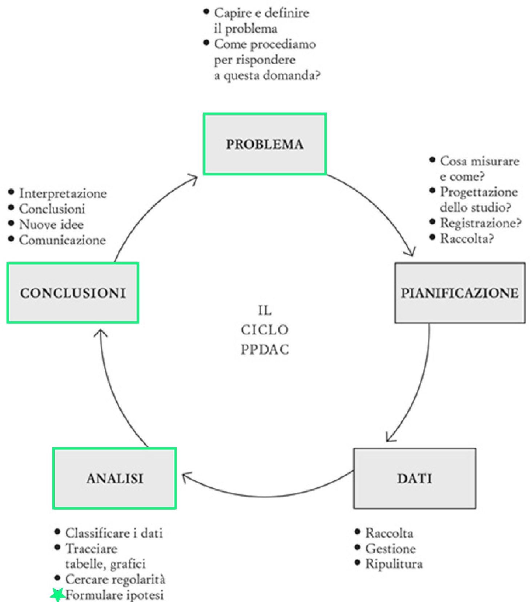
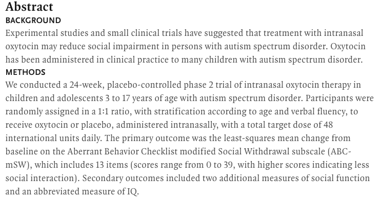
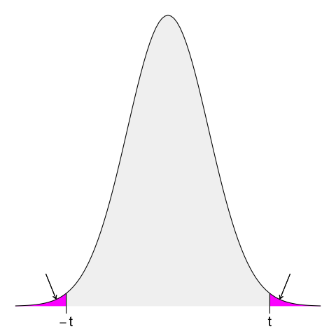
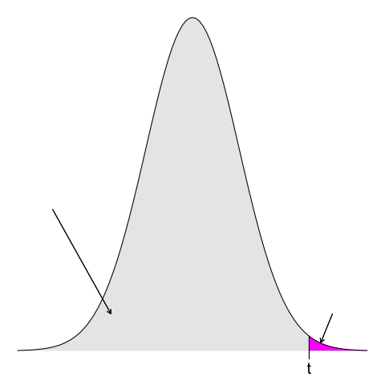

### Lezione 8

# La statistica inferenziale
## (Parte II: Test di ipotesi)
## &nbsp;

---
## Obiettivi di apprendimento

- Formulare e testare ipotesi
- Interpretare P-value (e la loro relazione con i CI)
- Saper distinguere tra errori del primo e del secondo tipo 
- Interpretare la potenza di uno studio

---
## Le fasi della ricerca

Spiegelhalter, D., *The Art of Statistics: Learning From Data*, Pelican, 2019

<!-- The Analysis stage has traditionally been the main emphasis of statistics courses, and we shall cover a range of analytic techniques in this book.

Finally, the key to good statistical science is drawing appropriate Conclusions that fully acknowledge the limitations in the evidence, and communicating them clearly. Any conclusions generally raise more questions, and so the cycle starts over again
 -->

---
##   &nbsp;&nbsp;&nbsp;&nbsp;&nbsp;&nbsp;:warning:  Attenzione  :warning:

&nbsp;&nbsp;&nbsp;&nbsp;&nbsp;&nbsp;&nbsp;&nbsp;&nbsp; Questa parte continua a essere complessa, ma non demordete,
&nbsp;&nbsp;&nbsp;&nbsp;&nbsp;&nbsp;&nbsp;&nbsp;&nbsp; siamo alla fine! 

---
## Cos'&egrave; un'ipotesi?

> Una possibile spiegazione per un fenomeno, che non rappresenta la verit&agrave; assoluta, ma una congettura provvisoria

<!-- 
Ogni studio inizia con un'ipotesi, quella che viene chiamata "domanda di ricerca"

A hypothesis can be defined as a proposed explanation for a phenomenon. It is not the absolute truth, but a provisional, working assumption, perhaps best thought of as a potential suspect in a criminal case. -->

---
## Esempi di ipotesi

* Il peso alla nascita &egrave; diverso nei gemelli monozigoti e dizigoti inglesi?
* Il numero di bambini deceduti a seguito di interventi cardiochirugici a Bristol tra il 1984 e il 1995 &egrave; diverso rispetto ad altri ospedali britannici?

---
## Il principio di falsificabilit&agrave; e l'ipotesi nulla

* Il peso alla nascita &egrave; <s>diverso</s> *uguale* nei gemelli monozigoti e dizigoti inglesi<s>?</s>
* Il numero di bambini deceduti a seguito di interventi cardiochirugici a Bristol tra il 1984 e il 1995 &egrave; <s>diverso</s> *uguale* rispetto ad altri ospedali britannici<s>?</s>

<!-- Il metodo scientifico si basa sulla falsificazione delle ipotesi (K. Popper). Quindi quello che andiamo a testare e' l'esatto opposto, la cosidette ipotesi nulle

The null hypothesis is what we are willing to assume is the case until proven otherwise. It is relentlessly negative, denying all progress and change. But this does not mean that we actually believe the null hypothesis is literally true

So we can never claim that the null hypothesis has been actually proved: in the words of another great British statistician, Ronald Fisher, ‘the null hypothesis is never proved or established, but is possibly disproved, in the course of experimentation. Every experiment may be said to exist only in order to give the facts a chance of disproving the null hypothesis.’

infatti il fatto di aver trovato dell'evidenza in favore di un'ipotesi non vuold dire che non sara' mai possibile trovare ulteriore evidenza che la renda falsa

Nulla e alternativa sono mutualmente esclusive e insieme descrivono tutti possibili casi -->

---
### Esercizio #1

:question: &nbsp;&nbsp;&nbsp; Qual &egrave; l'ipotesi nulla nei seguenti studi

&nbsp;&nbsp;&nbsp;&nbsp;&nbsp;&nbsp;&nbsp;&nbsp;&nbsp; Studio 1

<!-- 
Sono tutti articoli pubblicati lo scorso anno

Findings  In this cohort study using a national longitudinal health survey of 13 649 adults aged 50 years or older in the US, data revealed that increased isolation was associated with an increased risk of mortality, disability, and dementia. Decreased isolation was associated with a lower risk of mortality only among individuals who were nonisolated at baseline.

Meaning  These results underscore the importance of interventions targeting the prevention of increased isolation among older adults to mitigate its adverse effects on mortality, as well as physical and cognitive function decline. -->

---
### Esercizio #1

:question: &nbsp;&nbsp;&nbsp; Qual &egrave; l'ipotesi nulla nei seguenti studi

&nbsp;&nbsp;&nbsp;&nbsp;&nbsp;&nbsp;&nbsp;&nbsp;&nbsp; Studio 2

<!-- 
Findings  In this randomized clinical trial including 54 US military veterans with warzone-related trauma, active tDCS delivered during VR exposure significantly improved self-reported PTSD symptoms, reduced measures of autonomic arousal, and improved social functioning compared with sham stimulation during VR exposure. This trial replicated key findings from a prior pilot study.

Meaning  These findings suggest that the use of combined VR exposure plus tDCS could be a promising treatment for warzone-related PTSD.

-->

---
### Esercizio #1

:question: &nbsp;&nbsp;&nbsp; Qual &egrave; l'ipotesi nulla nei seguenti studi

&nbsp;&nbsp;&nbsp;&nbsp;&nbsp;&nbsp;&nbsp;&nbsp;&nbsp; Studio 3

<!-- 
Findings  In this cohort study of ~50K older US female nurses, experiencing more grateful affect was associated with lower mortality. Individuals in the highest tertile of gratitude, compared with the lowest tertile, had a 9% lower hazard of deaths from any cause, after accounting for baseline sociodemographic characteristics, social participation, religious involvement, physical health, lifestyle factors, cognitive function, and mental health.

Meaning  The findings suggest that the experience of grateful affect is associated with increased longevity among older adults.

-->

---
### Esercizio #2

:question: &nbsp;&nbsp;&nbsp; Se non rifiuto l'ipotesi nulla significa che

&nbsp;&nbsp;&nbsp;&nbsp;&nbsp;&nbsp;&nbsp;&nbsp;&nbsp; a) ho provato che l'ipotesi nulla sia vera
&nbsp;&nbsp;&nbsp;&nbsp;&nbsp;&nbsp;&nbsp;&nbsp;&nbsp; b) ho provato che l'ipotesi nulla sia falsa
&nbsp;&nbsp;&nbsp;&nbsp;&nbsp;&nbsp;&nbsp;&nbsp;&nbsp; c) le mie osservazioni sono compatibili con l'ipotesi nulla
&nbsp;&nbsp;&nbsp;&nbsp;&nbsp;&nbsp;&nbsp;&nbsp;&nbsp; d) le mie osservazioni non sono compatibili con l'ipotesi nulla
&nbsp;&nbsp;&nbsp;&nbsp;&nbsp;&nbsp;&nbsp;&nbsp;&nbsp; d) dipende dalla domanda di ricerca
&nbsp;&nbsp;&nbsp;&nbsp;&nbsp;&nbsp;&nbsp;&nbsp;&nbsp; e) nessuno dei precedenti

---
## $z$-test

:pushpin: &nbsp;&nbsp;&nbsp; Il peso alla nascita &egrave; <s>diverso</s> *uguale* nei gemelli monozigoti e dizigoti inglesi<s>?</s>

&nbsp;&nbsp;&nbsp;&nbsp;&nbsp;&nbsp;&nbsp;&nbsp;&nbsp; $n_{\text{d}}\text{ }=3481, \bar{x}_{\text{d}}\text{ }=2462\text{g}, s_{\text{d}}=577\text{g}$ 
&nbsp;&nbsp;&nbsp;&nbsp;&nbsp;&nbsp;&nbsp;&nbsp;&nbsp; $n_{\text{m}}=3823, \bar{x}_{\text{m}}=2350\text{g}, s_{\text{m}}=579\text{g}$ 

&nbsp;&nbsp;&nbsp;&nbsp;&nbsp;&nbsp;&nbsp;&nbsp;&nbsp; $\mu_{\text{d}} - \mu_{\text{m}} = 0$ 
&nbsp;&nbsp;&nbsp;&nbsp;&nbsp;&nbsp;&nbsp;&nbsp;&nbsp;&nbsp;&nbsp;&nbsp;&nbsp;&nbsp;&nbsp;&nbsp;&nbsp;&nbsp;&nbsp;&nbsp;&nbsp;&nbsp; $\rightarrow \text{Ipotesi nulla} \text{ } (\mathcal{H}_0)$

<!-- Il metodo statistico formalizza questa idea (È più semplice trovare evidenze contro un’ipotesi piuttosto che evidenze a favore) attraverso l’ipotesi nulla, 

HO ci dice che non ci sono differenze. I gemelli mono e di pesano uguale

L’ipotesi nulla (𝐻_0 )  è l’ipotesi considerata vera finché non vengono presentate delle prove (evidenza empirica) per mostrare che non lo è

Non possiamo provare una teoria, ma possiamo falsificare delle affermazioni -->

---
## $z$-test

:pushpin: &nbsp;&nbsp;&nbsp; Il peso alla nascita &egrave; <s>diverso</s> *uguale* nei gemelli monozigoti e dizigoti inglesi<s>?</s>

&nbsp;&nbsp;&nbsp;&nbsp;&nbsp;&nbsp;&nbsp;&nbsp;&nbsp; $n_{\text{d}}\text{ }=3481, \bar{x}_{\text{d}}\text{ }=2462\text{g}, s_{\text{d}}=577\text{g}$ 
&nbsp;&nbsp;&nbsp;&nbsp;&nbsp;&nbsp;&nbsp;&nbsp;&nbsp; $n_{\text{m}}=3823, \bar{x}_{\text{m}}=2350\text{g}, s_{\text{m}}=579\text{g}$ 

&nbsp;&nbsp;&nbsp;&nbsp;&nbsp;&nbsp;&nbsp;&nbsp;&nbsp; $\mu_{\text{d}} - \mu_{\text{m}} = 0$ 
&nbsp;&nbsp;&nbsp;&nbsp;&nbsp;&nbsp;&nbsp;&nbsp;&nbsp;&nbsp;&nbsp;&nbsp;&nbsp;&nbsp;&nbsp;&nbsp;&nbsp;&nbsp;&nbsp;&nbsp;&nbsp;&nbsp; $\rightarrow \text{Ipotesi nulla} \text{ } (\mathcal{H}_0)$

&nbsp;&nbsp;&nbsp;&nbsp;&nbsp;&nbsp;&nbsp;&nbsp;&nbsp; $\mu_{\text{d}} - \mu_{\text{m}} \neq 0$ 
&nbsp;&nbsp;&nbsp;&nbsp;&nbsp;&nbsp;&nbsp;&nbsp;&nbsp;&nbsp;&nbsp;&nbsp;&nbsp;&nbsp;&nbsp;&nbsp;&nbsp;&nbsp;&nbsp;&nbsp;&nbsp;&nbsp; $\rightarrow \text{Ipotesi alternativa} \text{ } (\mathcal{H}_{1/A})$

---
## $z$-test

:pushpin: &nbsp;&nbsp;&nbsp; Il peso alla nascita &egrave; <s>diverso</s> *uguale* nei gemelli monozigoti e dizigoti inglesi<s>?</s>

&nbsp;&nbsp;&nbsp;&nbsp;&nbsp;&nbsp;&nbsp;&nbsp;&nbsp; $n_{\text{d}}\text{ }=3481, \bar{x}_{\text{d}}\text{ }=2462\text{g}, s_{\text{d}}=577\text{g}$ 
&nbsp;&nbsp;&nbsp;&nbsp;&nbsp;&nbsp;&nbsp;&nbsp;&nbsp; $n_{\text{m}}=3823, \bar{x}_{\text{m}}=2350\text{g}, s_{\text{m}}=579\text{g}$ 

&nbsp;&nbsp;&nbsp;&nbsp;&nbsp;&nbsp;&nbsp;&nbsp;&nbsp; $\mu_{\text{d}} - \mu_{\text{m}} = 0$ 
&nbsp;&nbsp;&nbsp;&nbsp;&nbsp;&nbsp;&nbsp;&nbsp;&nbsp;&nbsp;&nbsp;&nbsp;&nbsp;&nbsp;&nbsp;&nbsp;&nbsp;&nbsp;&nbsp;&nbsp;&nbsp;&nbsp; $\rightarrow \text{Ipotesi nulla} \text{ } (\mathcal{H}_0)$

&nbsp;&nbsp;&nbsp;&nbsp;&nbsp;&nbsp;&nbsp;&nbsp;&nbsp; $\mu_{\text{d}} - \mu_{\text{m}} \neq 0$ 
&nbsp;&nbsp;&nbsp;&nbsp;&nbsp;&nbsp;&nbsp;&nbsp;&nbsp; $\mu_{\text{m}} - \mu_{\text{d}} \neq 0$ 
&nbsp;&nbsp;&nbsp;&nbsp;&nbsp;&nbsp;&nbsp;&nbsp;&nbsp;&nbsp;&nbsp;&nbsp;&nbsp;&nbsp;&nbsp;&nbsp;&nbsp;&nbsp;&nbsp;&nbsp;&nbsp;&nbsp; $\rightarrow |\mu_{\text{d}} - \mu_{\text{m}}| \neq 0$
&nbsp;&nbsp;&nbsp;&nbsp;&nbsp;&nbsp;&nbsp;&nbsp;&nbsp;&nbsp;&nbsp;&nbsp;&nbsp;&nbsp;&nbsp;&nbsp;&nbsp;&nbsp;&nbsp;&nbsp;&nbsp;&nbsp;&nbsp;&nbsp;&nbsp;&nbsp;&nbsp;&nbsp; $\text{Ipotesi alternativa} \text{ } (\mathcal{H}_{1/A})$

---
## $z$-test

:pushpin: &nbsp;&nbsp;&nbsp; Il peso alla nascita &egrave; <s>diverso</s> *uguale* nei gemelli monozigoti e dizigoti inglesi<s>?</s>

&nbsp;&nbsp;&nbsp;&nbsp;&nbsp;&nbsp;&nbsp;&nbsp;&nbsp; $n_{\text{d}}\text{ }=3481, \bar{x}_{\text{d}}\text{ }=2462\text{g}, s_{\text{d}}=577\text{g}$ 
&nbsp;&nbsp;&nbsp;&nbsp;&nbsp;&nbsp;&nbsp;&nbsp;&nbsp; $n_{\text{m}}=3823, \bar{x}_{\text{m}}=2350\text{g}, s_{\text{m}}=579\text{g}$ 

&nbsp;&nbsp;&nbsp;&nbsp;&nbsp;&nbsp;&nbsp;&nbsp;&nbsp; $\mu_{\text{d}} - \mu_{\text{m}} = 0$ &nbsp;&nbsp;&nbsp; $\leftarrow$
&nbsp;&nbsp;&nbsp;&nbsp;&nbsp;&nbsp;&nbsp;&nbsp;&nbsp; $\bar{x}_{\text{d}} - \bar{x}_{\text{m}} = 2462 - 2350 = (\pm)112$ 

---
## $z$-test

:pushpin: &nbsp;&nbsp;&nbsp; Il peso alla nascita &egrave; <s>diverso</s> *uguale* nei gemelli monozigoti e dizigoti inglesi<s>?</s>

&nbsp;&nbsp;&nbsp;&nbsp;&nbsp;&nbsp;&nbsp;&nbsp;&nbsp; $n_{\text{d}}\text{ }=3481, \bar{x}_{\text{d}}\text{ }=2462\text{g}, s_{\text{d}}=577\text{g}$ 
&nbsp;&nbsp;&nbsp;&nbsp;&nbsp;&nbsp;&nbsp;&nbsp;&nbsp; $n_{\text{m}}=3823, \bar{x}_{\text{m}}=2350\text{g}, s_{\text{m}}=579\text{g}$ 

&nbsp;&nbsp;&nbsp;&nbsp;&nbsp;&nbsp;&nbsp;&nbsp;&nbsp; $\mu_{\text{d}} - \mu_{\text{m}} = 0$ &nbsp;&nbsp;&nbsp; $\leftarrow$
&nbsp;&nbsp;&nbsp;&nbsp;&nbsp;&nbsp;&nbsp;&nbsp;&nbsp; $\bar{x}_{\text{d}} - \bar{x}_{\text{m}} = 2462 - 2350 = (\pm)112$ 

:question: &nbsp;&nbsp;&nbsp; Una differenza di $112$ g &egrave; "abbastanza vicina" a zero per concludere $\mu_{\text{d}} - \mu_{\text{m}} = 0$?

---
## $z$-test

:pushpin: &nbsp;&nbsp;&nbsp; Il peso alla nascita &egrave; <s>diverso</s> *uguale* nei gemelli monozigoti e dizigoti inglesi<s>?</s>

&nbsp;&nbsp;&nbsp;&nbsp;&nbsp;&nbsp;&nbsp;&nbsp;&nbsp; $n_{\text{d}}\text{ }=3481, \bar{x}_{\text{d}}\text{ }=2462\text{g}, s_{\text{d}}=577\text{g}$ 
&nbsp;&nbsp;&nbsp;&nbsp;&nbsp;&nbsp;&nbsp;&nbsp;&nbsp; $n_{\text{m}}=3823, \bar{x}_{\text{m}}=2350\text{g}, s_{\text{m}}=579\text{g}$ 

&nbsp;&nbsp;&nbsp;&nbsp;&nbsp;&nbsp;&nbsp;&nbsp;&nbsp; $\mu_{\text{d}} - \mu_{\text{m}} = 0$ &nbsp;&nbsp;&nbsp; $\leftarrow$
&nbsp;&nbsp;&nbsp;&nbsp;&nbsp;&nbsp;&nbsp;&nbsp;&nbsp; $\bar{x}_{\text{d}} - \bar{x}_{\text{m}} = 2462 - 2350 = (\pm)112$ 

:question: &nbsp;&nbsp;&nbsp; Una differenza di $112$ g &egrave; "abbastanza vicina" a zero per concludere $\mu_{\text{d}} - \mu_{\text{m}} = 0$?

:question: &nbsp;&nbsp;&nbsp; Qual &egrave; la probabilit&agrave; di osservare una differenza di $112$ g se $\mu_{\text{d}} - \mu_{\text{m}} = 0$?

<!-- Se &egrave; abbastanza probabile, tipo 1 caso su 10, vuol dire che e' abbastanza vicino, se invece e' 1 su 1000 allora e' alquanto improbabile, e di conseguenza vuol dire che e' "sufficientemente lontano".

Se vi dico probabilita' di osservare, quale argomento passato vi viene in mente? -->

---
## Facciamo un paio di passi indietro

1. La Normale &egrave; definita dalla sua media e deviazione standard e corrisponde a una distribuzione di probabilit&agrave;
&nbsp;&nbsp;&nbsp;&nbsp;&nbsp;&nbsp;&nbsp;&nbsp;&nbsp; $\rightarrow$ &nbsp;&nbsp;&nbsp; Area sottesa a $Z$ $\equiv$ probabilit&agrave; $\mathcal{P}$
2. Il teorema del limite centrale ci dice che le distribuzioni campionarie (incluso la differenza delle medie) tendono alla Normale

---
## Facciamo un paio di passi indietro

1. La Normale &egrave; definita dalla sua media e deviazione standard e corrisponde a una distribuzione di probabilit&agrave;
&nbsp;&nbsp;&nbsp;&nbsp;&nbsp;&nbsp;&nbsp;&nbsp;&nbsp; $\rightarrow$ &nbsp;&nbsp;&nbsp; Area sottesa a $Z$ $\equiv$ probabilit&agrave; $\mathcal{P}$
2. Il teorema del limite centrale ci dice che le distribuzioni campionarie (incluso la differenza delle medie) tendono alla Normale

Per la differenza tra due medie

&nbsp;&nbsp;&nbsp;&nbsp;&nbsp;&nbsp;&nbsp;&nbsp; $\mathcal{N} = (\mu_1 - \mu_2, \frac{\sigma_1^2}{n_1} + \frac{\sigma_2^2}{n_2})$ con 
&nbsp;&nbsp;&nbsp;&nbsp;&nbsp;&nbsp;&nbsp;&nbsp; $\sqrt{ \frac{\sigma_1^2}{n_1} + \frac{\sigma_2^2}{n_2} } \rightarrow$ &nbsp; standard error

---
## $z$-test

:pushpin: &nbsp;&nbsp;&nbsp; Il peso alla nascita &egrave; <s>diverso</s> *uguale* nei gemelli monozigoti e dizigoti inglesi<s>?</s>

&nbsp;&nbsp;&nbsp;&nbsp;&nbsp;&nbsp;&nbsp;&nbsp;&nbsp; $n_{\text{d}}\text{ }=3481, \bar{x}_{\text{d}}\text{ }=2462\text{g}, s_{\text{d}}=577\text{g}$ 
&nbsp;&nbsp;&nbsp;&nbsp;&nbsp;&nbsp;&nbsp;&nbsp;&nbsp; $n_{\text{m}}=3823, \bar{x}_{\text{m}}=2350\text{g}, s_{\text{m}}=579\text{g}$ 

&nbsp;&nbsp;&nbsp;&nbsp;&nbsp;&nbsp;&nbsp;&nbsp;&nbsp; $\mu_{\text{d}} - \mu_{\text{m}} = 0$ &nbsp;&nbsp;&nbsp; $\leftarrow$
&nbsp;&nbsp;&nbsp;&nbsp;&nbsp;&nbsp;&nbsp;&nbsp;&nbsp; $\bar{x}_{\text{d}} - \bar{x}_{\text{m}} = 2462\text{g} - 2350\text{g} = 112\text{g}$ 

&nbsp;&nbsp;&nbsp;&nbsp;&nbsp;&nbsp;&nbsp;&nbsp;&nbsp; $\mathcal{N} = (\mu_{\text{d}} - \mu_{\text{m}}, \text{SE}
)$, con $\mu_{\text{d}} - \mu_{\text{m}} = 0$
&nbsp;&nbsp;&nbsp;&nbsp;&nbsp;&nbsp;&nbsp;&nbsp;&nbsp; $\bar{x}_{\text{d}} - \bar{x}_{\text{m}} = 2462 - 2350 = (\pm)112$ 

:question: &nbsp;&nbsp;&nbsp; Qual &egrave; la probabilit&agrave; di osservare una differenza di $112$g se $\mu_{\text{d}} - \mu_{\text{m}} = 0$?
&nbsp;&nbsp;&nbsp;&nbsp;&nbsp;&nbsp;&nbsp;&nbsp;&nbsp; Area sottesa a $Z$ $\equiv$ probabilit&agrave; $\mathcal{P}$

<!-- Andiamo a incorporare questi elementi nel nostro problema -->

---
## $z$-test

:pushpin: &nbsp;&nbsp;&nbsp; Il peso alla nascita &egrave; <s>diverso</s> *uguale* nei gemelli monozigoti e dizigoti inglesi<s>?</s>

&nbsp;&nbsp;&nbsp;&nbsp;&nbsp;&nbsp;&nbsp;&nbsp;&nbsp; $n_{\text{d}}\text{ }=3481, \bar{x}_{\text{d}}\text{ }=2462\text{g}, s_{\text{d}}=577\text{g}$ 
&nbsp;&nbsp;&nbsp;&nbsp;&nbsp;&nbsp;&nbsp;&nbsp;&nbsp; $n_{\text{m}}=3823, \bar{x}_{\text{m}}=2350\text{g}, s_{\text{m}}=579\text{g}$ 

&nbsp;&nbsp;&nbsp;&nbsp;&nbsp;&nbsp;&nbsp;&nbsp;&nbsp; $\mu_{\text{d}} - \mu_{\text{m}} = 0$ &nbsp;&nbsp;&nbsp; $\leftarrow$
&nbsp;&nbsp;&nbsp;&nbsp;&nbsp;&nbsp;&nbsp;&nbsp;&nbsp; $\bar{x}_{\text{d}} - \bar{x}_{\text{m}} = 2462 - 2350 = (\pm)112$ 

&nbsp;&nbsp;&nbsp;&nbsp;&nbsp;&nbsp;&nbsp;&nbsp;&nbsp; $\mathcal{N} = (\mu_{\text{d}} - \mu_{\text{m}}, \text{SE}
)$, con $\mu_{\text{d}} - \mu_{\text{m}} = 0$
&nbsp;&nbsp;&nbsp;&nbsp;&nbsp;&nbsp;&nbsp;&nbsp;&nbsp; e  $\text{SE} = \sqrt{\frac{s_\text{d}^2}{n_\text{d}} + \frac{s_\text{m}^2}{n_\text{m}}} = 13.5\text{g}$

:question: &nbsp;&nbsp;&nbsp; Qual &egrave; la probabilit&agrave; di osservare una differenza di $112$g se $\mu_{\text{d}} - \mu_{\text{m}} = 0$?
&nbsp;&nbsp;&nbsp;&nbsp;&nbsp;&nbsp;&nbsp;&nbsp;&nbsp; $z = \frac{\bar{X}-\mu}{\hat{SE}} = \frac{\pm112-0}{13.5} = \pm8.3$ &nbsp;&nbsp; $\rightarrow$ &nbsp;&nbsp; $\mathcal{P} = 2 \times(7.0  \times 10^{-17}) = 1.4 \times 10^{-16}$

<!-- P = 1.4e-16 

Usando il P-value, che ci dice quanto sono improbabili i risultati ottenuti da questo campione dato che l'ipotesi nulla &egrave; vera.

Un P-value molto piccolo ci dice quindi che sia molto improbabile che H0 sia vera dandoci una forte ragione per dubitare che le due medie siano uguali 

-->
---
## P-value

:dart: &nbsp;&nbsp;&nbsp; Il P-value misura la discrepanza tra i dati e $\mathcal{H}_0$ e corrisponde alla
&nbsp;&nbsp;&nbsp;&nbsp;&nbsp;&nbsp;&nbsp;&nbsp;&nbsp; probabilit&agrave; di ottenere un risultato tanto estremo quanto quello 
&nbsp;&nbsp;&nbsp;&nbsp;&nbsp;&nbsp;&nbsp;&nbsp;&nbsp; ottenuto se l'ipotesi nulla fosse vera.

---
## P-value

:dart: &nbsp;&nbsp;&nbsp; Il P-value misura la discrepanza tra i dati e $\mathcal{H}_0$ e corrisponde alla
&nbsp;&nbsp;&nbsp;&nbsp;&nbsp;&nbsp;&nbsp;&nbsp;&nbsp; probabilit&agrave; di ottenere un risultato tanto estremo quanto quello 
&nbsp;&nbsp;&nbsp;&nbsp;&nbsp;&nbsp;&nbsp;&nbsp;&nbsp; ottenuto se l'ipotesi nulla fosse vera.

&nbsp;&nbsp;&nbsp;&nbsp;&nbsp;&nbsp;&nbsp;&nbsp;&nbsp;&nbsp;&nbsp;&nbsp;&nbsp;&nbsp;&nbsp;&nbsp;&nbsp;&nbsp; $\text{P-value} = 0.5 \rightarrow 50\% \rightarrow 1 \text{ campione su } 2$
&nbsp;&nbsp;&nbsp;&nbsp;&nbsp;&nbsp;&nbsp;&nbsp;&nbsp;&nbsp;&nbsp;&nbsp;&nbsp;&nbsp;&nbsp;&nbsp;&nbsp;&nbsp; $\text{P-value} = 0.1 \rightarrow 10\% \rightarrow 1 \text{ campione su } 10$
&nbsp;&nbsp;&nbsp;&nbsp;&nbsp;&nbsp;&nbsp;&nbsp;&nbsp;&nbsp;&nbsp;&nbsp;&nbsp;&nbsp;&nbsp;&nbsp;&nbsp;&nbsp; $\text{P-value} = 0.05 \rightarrow 5\% \rightarrow 1 \text{ campione su } 20$
&nbsp;&nbsp;&nbsp;&nbsp;&nbsp;&nbsp;&nbsp;&nbsp;&nbsp;&nbsp;&nbsp;&nbsp;&nbsp;&nbsp;&nbsp;&nbsp;&nbsp;&nbsp; $\text{P-value} = 0.01 \rightarrow 1\% \rightarrow 1 \text{ campione su } 100$
&nbsp;&nbsp;&nbsp;&nbsp;&nbsp;&nbsp;&nbsp;&nbsp;&nbsp;&nbsp;&nbsp;&nbsp;&nbsp;&nbsp;&nbsp;&nbsp;&nbsp;&nbsp; $\text{P-value} = 0.005 \rightarrow 0.5\% \rightarrow 1 \text{ campione su } 200$

 <!-- ci dice quanto e' probabile fare un errore (il peso alla nascita e' diverso) se accettiamo l'ipotesi nulla 
  
  Se p-value = 0.02
  Se l’ipotesi nulla fosse vera, la probabilità di osservare il risultato che abbiamo ottenuto, o una differenza ancora maggiore, sarebbe solo dell’2%
  Se il farmaco non fosse efficace (ipotesi nulla fosse vera) solo in 2 campione ogni 100 avremmo il risultato osservato 

  In modo molto informale. L’espressione statisticamente significativo vuol dire che sono state raccolte prove sufficienti per rifiutare l’ipotesi nulla 
  
 -->

---
## P-value e significativit&agrave; statistica

:dart: &nbsp;&nbsp;&nbsp; Il P-value misura la discrepanza tra i dati e $\mathcal{H}_0$ e corrisponde alla
&nbsp;&nbsp;&nbsp;&nbsp;&nbsp;&nbsp;&nbsp;&nbsp;&nbsp; probabilit&agrave; di ottenere un risultato tanto estremo quanto quello 
&nbsp;&nbsp;&nbsp;&nbsp;&nbsp;&nbsp;&nbsp;&nbsp;&nbsp; ottenuto se l'ipotesi nulla fosse vera.

&nbsp;&nbsp;&nbsp;&nbsp;&nbsp;&nbsp;&nbsp;&nbsp;&nbsp; Se il P-value &egrave; minore di una soglia critica (o livello di significativit&agrave;) $\alpha$, 
&nbsp;&nbsp;&nbsp;&nbsp;&nbsp;&nbsp;&nbsp;&nbsp;&nbsp; possiamo dire che il risultato &egrave; statisticamente significativo

&nbsp;&nbsp;&nbsp;&nbsp;&nbsp;&nbsp;&nbsp;&nbsp;&nbsp;&nbsp;&nbsp;&nbsp;&nbsp;&nbsp;&nbsp;&nbsp;&nbsp;&nbsp; $\alpha = 0.05 \text{ oppure } 0.01$

<!-- 
In modo molto informale. L’espressione statisticamente significativo vuol dire che sono state raccolte prove sufficienti per rifiutare l’ipotesi nulla 

Ronald Fisher used P < 0.05 and P < 0.01 as convenient critical thresholds for indicating significance, and produced tables of the critical values of test statistics needed to achieve these levels of significance. The popularity of these tables led to 0.05 and 0.01 becoming established conventions, although it is now recommended that exact P-values should be reported. 

The standard thresholds for declaring ‘significance’, P < 0.05 and P < 0.01, were fairly arbitrary choices by Ronald Fisher for his tables, back in the days when calculating exact P-values was not possible using the mechanical and electrical calculators available. 

And it is important to emphasize that the exact P-value is conditional not only on the truth of the null hypothesis, but also on all other assumptions underlying the statistical model, such as lack of systematic bias, independent observations, and so on.

--->

---
## Test di ipotesi, un passo alla volta

<!-- This whole process has become known as Null Hypothesis Significance Testing (NHST) and, as we shall see below, it has become a source of major controversy. But first we should examine how Fisher’s ideas are used in practice.

Ronald Fisher was an extraordinary, but difficult, man. He was extraordinary because he is regarded as a pioneering figure in two distinct fields – genetics and statistics. Yet he had a notorious temper and could be extremely critical of anyone who he felt questioned his ideas, while his support for eugenics and his public criticism of the evidence for the link between smoking and lung cancer damaged his standing. His personal reputation has suffered as his financial connections with the tobacco industry have been revealed, but his scientific reputation is undiminished, as his ideas find repeated new applications in the analysis of large data sets. --> -->

---
## Test di ipotesi, un passo alla volta

1. Definisco la mia ipotesi nulla $(\mathcal{H_0})$

&nbsp;&nbsp;&nbsp;&nbsp;&nbsp;&nbsp;&nbsp;&nbsp;&nbsp;&nbsp; Il peso alla nascita &egrave; <s>diverso</s> *uguale* nei gemelli monozigoti e dizigoti inglesi<s>?</s>
&nbsp;&nbsp;&nbsp;&nbsp;&nbsp;&nbsp;&nbsp;&nbsp;&nbsp;&nbsp; $\mathcal{H_0} : \mu_d - \mu_m = 0$

---
## Test di ipotesi, un passo alla volta

1. Definisco la mia ipotesi nulla $(\mathcal{H_0})$
2. Scelgo un test statistico che stimi qualcosa che, se abbastanza estremo, mi faccia dubitare di $\mathcal{H_0}$

&nbsp;&nbsp;&nbsp;&nbsp;&nbsp;&nbsp;&nbsp;&nbsp;&nbsp;&nbsp; $z$-test della differenza di due medie campionarie

---
## Test di ipotesi, un passo alla volta

1. Definisco la mia ipotesi nulla $(\mathcal{H_0})$
2. Scelgo un test statistico che stimi qualcosa che, se abbastanza estremo, mi faccia dubitare di $\mathcal{H_0}$
3. Genero la distribuzione campionaria del test scelto, assumendo $\mathcal{H_0}$ vera

&nbsp;&nbsp;&nbsp;&nbsp;&nbsp;&nbsp;&nbsp;&nbsp;&nbsp;&nbsp; $\mathcal{N} = (\mu_d - \mu_m, \text{SE})$, con $\mu_d - \mu_m = 0$

---
## Test di ipotesi, un passo alla volta

1. Definisco la mia ipotesi nulla $(\mathcal{H_0})$
2. Scelgo un test statistico che stimi qualcosa che, se abbastanza estremo, mi faccia dubitare di $\mathcal{H_0}$
3. Genero la distribuzione campionaria del test scelto, assumendo $\mathcal{H_0}$ vera
4. Verifico se la statistica osservata si trovi sulla coda di questa distribuzione e assegno una probabilit&agrave; (P-value) a questo evento

&nbsp;&nbsp;&nbsp;&nbsp;&nbsp;&nbsp;&nbsp;&nbsp;&nbsp;&nbsp; $\text{P-value} = 1.4 \times 10^{-16}$

<!-- P-value: the probability, were the null hypothesis true, of observing such an extreme statistic. The P-value is therefore a particular tail-area. -->

---
## Test di ipotesi, un passo alla volta

1. Definisco la mia ipotesi nulla $(\mathcal{H_0})$
2. Scelgo un test statistico che stimi qualcosa che, se abbastanza estremo, mi faccia dubitare di $\mathcal{H_0}$
3. Genero la distribuzione campionaria del test scelto, assumendo $\mathcal{H_0}$ vera
4. Verifico se la statistica osservata si trovi sulla coda di questa distribuzione e assegno una probabilit&agrave; (P-value) a questo evento
5. Dichiaro il risultato come statisticamente significativo se il P-value &egrave; inferiore a una soglia critica $\alpha$

&nbsp;&nbsp;&nbsp;&nbsp;&nbsp;&nbsp;&nbsp;&nbsp;&nbsp;&nbsp; $\text{P-value} = 1.4 \times 10^{-16} < 0.05$ &nbsp;&nbsp; $\rightarrow$ &nbsp;&nbsp; rifiuto $\mathcal{H_0}$

<!-- P-value measures how likely it is that we would have observed such an extreme value were the null hypothesis really true. -->

---
### Esercizio #3

Sikich, L. *et al.*, *Intranasal Oxytocin in Children and Adolescents with Autism Spectrum Disorder*, NEJM, 2021

:question: &nbsp;&nbsp;&nbsp; Qual &egrave; l’ipotesi nulla dello studio?

&nbsp;&nbsp;&nbsp;&nbsp;&nbsp;&nbsp;&nbsp;&nbsp;&nbsp; a) L’intervento riduce l’interazione 
&nbsp;&nbsp;&nbsp;&nbsp;&nbsp;&nbsp;&nbsp;&nbsp;&nbsp;&nbsp;&nbsp;&nbsp;&nbsp;&nbsp; sociale
&nbsp;&nbsp;&nbsp;&nbsp;&nbsp;&nbsp;&nbsp;&nbsp;&nbsp; b) Nel gruppo di controllo non c’&egrave; 
&nbsp;&nbsp;&nbsp;&nbsp;&nbsp;&nbsp;&nbsp;&nbsp;&nbsp;&nbsp;&nbsp;&nbsp;&nbsp;&nbsp; aumento di interazione sociale
&nbsp;&nbsp;&nbsp;&nbsp;&nbsp;&nbsp;&nbsp;&nbsp;&nbsp; c) Non c’&egrave; differenza in aumento di 
&nbsp;&nbsp;&nbsp;&nbsp;&nbsp;&nbsp;&nbsp;&nbsp;&nbsp;&nbsp;&nbsp;&nbsp;&nbsp;&nbsp;interazione sociale tra il gruppo di 
&nbsp;&nbsp;&nbsp;&nbsp;&nbsp;&nbsp;&nbsp;&nbsp;&nbsp;&nbsp;&nbsp;&nbsp;&nbsp;&nbsp;intervento e quello di controllo 
&nbsp;&nbsp;&nbsp;&nbsp;&nbsp;&nbsp;&nbsp;&nbsp;&nbsp; d) Nei due gruppi c’&egrave; una differenza 
&nbsp;&nbsp;&nbsp;&nbsp;&nbsp;&nbsp;&nbsp;&nbsp;&nbsp;&nbsp;&nbsp;&nbsp;&nbsp;&nbsp; significativa nell’aumento della
&nbsp;&nbsp;&nbsp;&nbsp;&nbsp;&nbsp;&nbsp;&nbsp;&nbsp;&nbsp;&nbsp;&nbsp;&nbsp;&nbsp; interazione sociale

---
### Esercizio #4

Sikich, L. *et al.*, *Intranasal Oxytocin in Children and Adolescents with Autism Spectrum Disorder*, NEJM, 2021

:question: &nbsp;&nbsp;&nbsp; Formulare operativamente l’ipotesi 
&nbsp;&nbsp;&nbsp;&nbsp;&nbsp;&nbsp;&nbsp;&nbsp;&nbsp;nulla

&nbsp;&nbsp;&nbsp;&nbsp;&nbsp;&nbsp;&nbsp;&nbsp;&nbsp; a) $\mu_i-\mu_c = 0$ 
&nbsp;&nbsp;&nbsp;&nbsp;&nbsp;&nbsp;&nbsp;&nbsp;&nbsp; b) $\mu_i-\mu_c \neq 0$
&nbsp;&nbsp;&nbsp;&nbsp;&nbsp;&nbsp;&nbsp;&nbsp;&nbsp; c) $\bar{x}_i-\bar{x}_c = 0$
&nbsp;&nbsp;&nbsp;&nbsp;&nbsp;&nbsp;&nbsp;&nbsp;&nbsp; d) $\bar{x}_i-\bar{x}_c \neq 0$

---
### Esercizio #5

:question: &nbsp;&nbsp;&nbsp; In uno studio clinico randomizzato (RCT), il P-value associato alla variabile  
&nbsp;&nbsp;&nbsp;&nbsp;&nbsp;&nbsp;&nbsp;&nbsp;&nbsp; “Sex” è pari a 0.48. Con un livello di significativit&agrave; del 5%, ci sono differenze 
&nbsp;&nbsp;&nbsp;&nbsp;&nbsp;&nbsp;&nbsp;&nbsp;&nbsp; statisticamente significative nella distribuzione maschi/femmine nei due 
&nbsp;&nbsp;&nbsp;&nbsp;&nbsp;&nbsp;&nbsp;&nbsp;&nbsp; gruppi?

&nbsp;&nbsp;&nbsp;&nbsp;&nbsp;&nbsp;&nbsp;&nbsp;&nbsp; a) s&igrave;, perch&eacute; si tratta di uno studio clinico randomizzato
&nbsp;&nbsp;&nbsp;&nbsp;&nbsp;&nbsp;&nbsp;&nbsp;&nbsp; b) s&igrave;, perch&eacute; il P-value &egrave; minore del livello di significativit&agrave;
&nbsp;&nbsp;&nbsp;&nbsp;&nbsp;&nbsp;&nbsp;&nbsp;&nbsp; c) no, perch&eacute; il P-value &egrave; maggiore del livello di significativit&agrave;
&nbsp;&nbsp;&nbsp;&nbsp;&nbsp;&nbsp;&nbsp;&nbsp;&nbsp; d) non ci sono informazioni sufficienti per stabilirlo

---
## Uguale, diverso, maggiore, minore?

:dart: &nbsp;&nbsp;&nbsp; $\mathcal{H}_1$: &nbsp;&nbsp;&nbsp; $\mu_{\text{i}} - \mu_{\text{c}} \neq 0$
&nbsp;&nbsp;&nbsp;&nbsp;&nbsp;&nbsp;&nbsp;&nbsp;&nbsp; $\mathcal{H}_0$: &nbsp;&nbsp;&nbsp; $\mu_{\text{i}} - \mu_{\text{c}} = 0$
&nbsp;&nbsp;&nbsp;&nbsp;&nbsp;&nbsp;&nbsp;&nbsp;&nbsp;&nbsp;&nbsp;&nbsp;&nbsp;&nbsp;&nbsp;&nbsp;&nbsp;&nbsp;&nbsp;&nbsp;&nbsp;&nbsp;&nbsp;&nbsp;&nbsp;&nbsp;&nbsp; $\rightarrow$ test a due code

<!-- a one-sided hypothesis test is used when a null hypothesis specifies that, say, the effect of a medical treatment is negative. This would only be rejected by large positive values of a test statistic representing an estimated treatment effect. A two-sided test would be appropriate for a null hypothesis that a treatment effect, say, is exactly zero, and so both positive and negative estimates would lead to the null being rejected. -->

---
## Uguale, diverso, maggiore, minore?

:dart: &nbsp;&nbsp;&nbsp; $\mathcal{H}_1$: &nbsp;&nbsp;&nbsp; $\mu_{\text{i}} - \mu_{\text{c}} \neq 0$
&nbsp;&nbsp;&nbsp;&nbsp;&nbsp;&nbsp;&nbsp;&nbsp;&nbsp; $\mathcal{H}_0$: &nbsp;&nbsp;&nbsp; $\mu_{\text{i}} - \mu_{\text{c}} = 0$
&nbsp;&nbsp;&nbsp;&nbsp;&nbsp;&nbsp;&nbsp;&nbsp;&nbsp;&nbsp;&nbsp;&nbsp;&nbsp;&nbsp;&nbsp;&nbsp;&nbsp;&nbsp;&nbsp;&nbsp;&nbsp;&nbsp;&nbsp;&nbsp;&nbsp;&nbsp;&nbsp; $\rightarrow$ test a due code

&nbsp;&nbsp;&nbsp;&nbsp;&nbsp;&nbsp;&nbsp;&nbsp;&nbsp; $\mathcal{H}_1$: &nbsp;&nbsp;&nbsp; $\mu_{\text{i}} - \mu_{\text{c}} < 0$
&nbsp;&nbsp;&nbsp;&nbsp;&nbsp;&nbsp;&nbsp;&nbsp;&nbsp; $\mathcal{H}_0$: &nbsp;&nbsp;&nbsp; $\mu_{\text{i}} - \mu_{\text{c}} \geq  0$
&nbsp;&nbsp;&nbsp;&nbsp;&nbsp;&nbsp;&nbsp;&nbsp;&nbsp;&nbsp;&nbsp;&nbsp;&nbsp;&nbsp;&nbsp;&nbsp;&nbsp;&nbsp;&nbsp;&nbsp;&nbsp;&nbsp;&nbsp;&nbsp;&nbsp;&nbsp;&nbsp;  
&nbsp;&nbsp;&nbsp;&nbsp;&nbsp;&nbsp;&nbsp;&nbsp;&nbsp; 
&nbsp;&nbsp;&nbsp;&nbsp;&nbsp;&nbsp;&nbsp;&nbsp;&nbsp; 
&nbsp;&nbsp;&nbsp;&nbsp;&nbsp;&nbsp;&nbsp;&nbsp;&nbsp;&nbsp;&nbsp;&nbsp;&nbsp;&nbsp;&nbsp;&nbsp;&nbsp;&nbsp;&nbsp;&nbsp;&nbsp;&nbsp;&nbsp;&nbsp;&nbsp;&nbsp;&nbsp; $\rightarrow$ test a una coda

<!-- a one-sided hypothesis test is used when a null hypothesis specifies that, say, the effect of a medical treatment is negative. This would only be rejected by large positive values of a test statistic representing an estimated treatment effect. A two-sided test would be appropriate for a null hypothesis that a treatment effect, say, is exactly zero, and so both positive and negative estimates would lead to the null being rejected. -->

---
## Uguale, diverso, maggiore, minore?

:dart: &nbsp;&nbsp;&nbsp; $\mathcal{H}_1$: &nbsp;&nbsp;&nbsp; $\mu_{\text{i}} - \mu_{\text{c}} \neq 0$
&nbsp;&nbsp;&nbsp;&nbsp;&nbsp;&nbsp;&nbsp;&nbsp;&nbsp; $\mathcal{H}_0$: &nbsp;&nbsp;&nbsp; $\mu_{\text{i}} - \mu_{\text{c}} = 0$
&nbsp;&nbsp;&nbsp;&nbsp;&nbsp;&nbsp;&nbsp;&nbsp;&nbsp;&nbsp;&nbsp;&nbsp;&nbsp;&nbsp;&nbsp;&nbsp;&nbsp;&nbsp;&nbsp;&nbsp;&nbsp;&nbsp;&nbsp;&nbsp;&nbsp;&nbsp;&nbsp; $\rightarrow$ test a due code

&nbsp;&nbsp;&nbsp;&nbsp;&nbsp;&nbsp;&nbsp;&nbsp;&nbsp; $\mathcal{H}_1$: &nbsp;&nbsp;&nbsp; $\mu_{\text{i}} - \mu_{\text{c}} < 0$
&nbsp;&nbsp;&nbsp;&nbsp;&nbsp;&nbsp;&nbsp;&nbsp;&nbsp; $\mathcal{H}_0$: &nbsp;&nbsp;&nbsp; $\mu_{\text{i}} - \mu_{\text{c}} \geq  0$
&nbsp;&nbsp;&nbsp;&nbsp;&nbsp;&nbsp;&nbsp;&nbsp;&nbsp;&nbsp;&nbsp;&nbsp;&nbsp;&nbsp;&nbsp;&nbsp;&nbsp;&nbsp;&nbsp;&nbsp;&nbsp;&nbsp;&nbsp;&nbsp;&nbsp;&nbsp;&nbsp;  oppure
&nbsp;&nbsp;&nbsp;&nbsp;&nbsp;&nbsp;&nbsp;&nbsp;&nbsp; $\mathcal{H}_1$: &nbsp;&nbsp;&nbsp; $\mu_{\text{i}} - \mu_{\text{c}} > 0$
&nbsp;&nbsp;&nbsp;&nbsp;&nbsp;&nbsp;&nbsp;&nbsp;&nbsp; $\mathcal{H}_0$: &nbsp;&nbsp;&nbsp; $\mu_{\text{i}} - \mu_{\text{c}} \leq 0$
&nbsp;&nbsp;&nbsp;&nbsp;&nbsp;&nbsp;&nbsp;&nbsp;&nbsp;&nbsp;&nbsp;&nbsp;&nbsp;&nbsp;&nbsp;&nbsp;&nbsp;&nbsp;&nbsp;&nbsp;&nbsp;&nbsp;&nbsp;&nbsp;&nbsp;&nbsp;&nbsp; $\rightarrow$ test a una coda

<!-- a one-sided hypothesis test is used when a null hypothesis specifies that, say, the effect of a medical treatment is negative. This would only be rejected by large positive values of a test statistic representing an estimated treatment effect. A two-sided test would be appropriate for a null hypothesis that a treatment effect, say, is exactly zero, and so both positive and negative estimates would lead to the null being rejected. -->

---
### Esercizio #6

:question: &nbsp;&nbsp;&nbsp; Nei metodi &egrave; stato riportato che “All significance tests were 2-sided, and 
&nbsp;&nbsp;&nbsp;&nbsp;&nbsp;&nbsp;&nbsp;&nbsp;&nbsp; $P < 0.05$ was used to indicate significance”. Qual &egrave; il livello di significativit&agrave; 
&nbsp;&nbsp;&nbsp;&nbsp;&nbsp;&nbsp;&nbsp;&nbsp;&nbsp; delle analisi?

&nbsp;&nbsp;&nbsp;&nbsp;&nbsp;&nbsp;&nbsp;&nbsp;&nbsp; a) 0.05
&nbsp;&nbsp;&nbsp;&nbsp;&nbsp;&nbsp;&nbsp;&nbsp;&nbsp; b) 0.025
&nbsp;&nbsp;&nbsp;&nbsp;&nbsp;&nbsp;&nbsp;&nbsp;&nbsp; c) il P-value
&nbsp;&nbsp;&nbsp;&nbsp;&nbsp;&nbsp;&nbsp;&nbsp;&nbsp; d) non ci sono informazioni sufficienti per stabilirlo

---
### Esercizio #7

<!--  -->

:question: &nbsp;&nbsp;&nbsp; Dopo aver analizzato i nostri dati, abbiamo ottenuto $z=1.9$
&nbsp;&nbsp;&nbsp;&nbsp;&nbsp;&nbsp;&nbsp;&nbsp;&nbsp; Quali delle seguenti ipotesi nulle andr&ograve; a rifiutare con $\alpha = 0.05$?

&nbsp;&nbsp;&nbsp;&nbsp;&nbsp;&nbsp;&nbsp;&nbsp;&nbsp; a) $\mu_{\text{i}} - \mu_{\text{c}} \neq 0$
&nbsp;&nbsp;&nbsp;&nbsp;&nbsp;&nbsp;&nbsp;&nbsp;&nbsp; b) $\mu_{\text{i}} - \mu_{\text{c}} \geq 0$
&nbsp;&nbsp;&nbsp;&nbsp;&nbsp;&nbsp;&nbsp;&nbsp;&nbsp; c) $\mu_{\text{i}} - \mu_{\text{c}} \leq 0$

&nbsp;&nbsp;&nbsp;&nbsp;&nbsp;&nbsp; :warning:  &nbsp;&nbsp; **Esercizio difficile** 

<!-- Qui dobbiamo andare a pescare nella memoria delle cose viste in passato -->

---
## Test di ipotesi & intervallo di confidenza

:dart: &nbsp;&nbsp;&nbsp; Il 95% confidence interval &egrave; l'insieme delle ipotesi nulle che non sono 
&nbsp;&nbsp;&nbsp;&nbsp;&nbsp;&nbsp;&nbsp;&nbsp;&nbsp; rifiutate con $\alpha = 0.05$

| Confidence Level | $\alpha$ | $\alpha/2$ | $z_{\alpha/2}$ |
| ----: | ----- | ---- | ----|
| 95% | 5% | 2.5% | 1.96 |

---
## Test di ipotesi & intervallo di confidenza

:dart: &nbsp;&nbsp;&nbsp; Il 95% confidence interval &egrave; l'insieme delle ipotesi nulle che non sono 
&nbsp;&nbsp;&nbsp;&nbsp;&nbsp;&nbsp;&nbsp;&nbsp;&nbsp; rifiutate con $\alpha = 0.05$

&nbsp;&nbsp;&nbsp;&nbsp;&nbsp;&nbsp;&nbsp;&nbsp;&nbsp; In un test a due code, $\text{P} <0.05$
&nbsp;&nbsp;&nbsp;&nbsp;&nbsp;&nbsp;&nbsp;&nbsp;&nbsp; se il 95% CI non include l'ipotesi
&nbsp;&nbsp;&nbsp;&nbsp;&nbsp;&nbsp;&nbsp;&nbsp;&nbsp; nulla (solitamente zero)

<!-- This intimate link between hypothesis testing and confidence intervals should stop people misinterpreting results that are not statistically significantly different from 0 – this does not mean that the null hypothesis is actually true, but simply that a confidence interval for the true value includes 0. Unfortunately, as we shall see later, this lesson is often ignored. -->

---
## Test di ipotesi & intervallo di confidenza

:dart: &nbsp;&nbsp;&nbsp; Il 95% confidence interval &egrave; l'insieme delle ipotesi nulle che non sono 
&nbsp;&nbsp;&nbsp;&nbsp;&nbsp;&nbsp;&nbsp;&nbsp;&nbsp; rifiutate con $\alpha = 0.05$

&nbsp;&nbsp;&nbsp;&nbsp;&nbsp;&nbsp;&nbsp;&nbsp;&nbsp; In un test a due code, $\text{P} <0.05$
&nbsp;&nbsp;&nbsp;&nbsp;&nbsp;&nbsp;&nbsp;&nbsp;&nbsp; se il 95% CI non include l'ipotesi
&nbsp;&nbsp;&nbsp;&nbsp;&nbsp;&nbsp;&nbsp;&nbsp;&nbsp; nulla (solitamente zero)

Sikich, L. *et al.*, *Intranasal Oxytocin in Children and Adolescents with Autism Spectrum Disorder*, NEJM, 2021

---
## Pearson's $\chi^2$ test

:pushpin: &nbsp;&nbsp;&nbsp; Il numero di bambini deceduti a seguito di interventi cardiochirugici a Bristol tra 
&nbsp;&nbsp;&nbsp;&nbsp;&nbsp;&nbsp;&nbsp;&nbsp;&nbsp; il 1984 e il 1995 &egrave; <s>diverso</s> *uguale* rispetto ad altri ospedali britannici<s>?</s>

&nbsp;&nbsp;&nbsp;&nbsp;&nbsp;&nbsp;&nbsp;&nbsp;&nbsp; Nell'ospedale di Bristol, sono stati effettuati 143  interventi cardiochirugici e 
&nbsp;&nbsp;&nbsp;&nbsp;&nbsp;&nbsp;&nbsp;&nbsp;&nbsp; sono stati registrati 41 decessi (27.8%). Negli altri ospedali britannici, a fronte
&nbsp;&nbsp;&nbsp;&nbsp;&nbsp;&nbsp;&nbsp;&nbsp;&nbsp; di 3176 operazioni sono stati registrati 356 decessi (10.7%). 

---
## Pearson's $\chi^2$ test

:pushpin: &nbsp;&nbsp;&nbsp; Il numero di bambini deceduti a seguito di interventi cardiochirugici a Bristol tra 
&nbsp;&nbsp;&nbsp;&nbsp;&nbsp;&nbsp;&nbsp;&nbsp;&nbsp; il 1984 e il 1995 &egrave; <s>diverso</s> *uguale* rispetto ad altri ospedali britannici<s>?</s>

&nbsp;&nbsp;&nbsp;&nbsp;&nbsp;&nbsp;&nbsp;&nbsp;&nbsp; Nell'ospedale di Bristol, sono stati effettuati 143  interventi cardiochirugici e 
&nbsp;&nbsp;&nbsp;&nbsp;&nbsp;&nbsp;&nbsp;&nbsp;&nbsp; sono stati registrati 41 decessi (27.8%). Negli altri ospedali britannici, a fronte
&nbsp;&nbsp;&nbsp;&nbsp;&nbsp;&nbsp;&nbsp;&nbsp;&nbsp; di 3176 operazioni sono stati registrati 356 decessi (10.7%). 

1. Definisco la mia ipotesi nulla $(\mathcal{H_0})$

&nbsp;&nbsp;&nbsp;&nbsp;&nbsp;&nbsp;&nbsp;&nbsp;&nbsp; $\mathcal{H}_0: \pi_{\text{B}} - \pi_{\text{H}}  = 0$ &nbsp;&nbsp;&nbsp; 
&nbsp;&nbsp;&nbsp;&nbsp;&nbsp;&nbsp;&nbsp;&nbsp;&nbsp; $\mathcal{H}_1: \pi_{\text{B}} - \pi_{\text{H}}  \neq 0$

---
## Pearson's $\chi^2$ test

:pushpin: &nbsp;&nbsp;&nbsp; Il numero di bambini deceduti a seguito di interventi cardiochirugici a Bristol tra 
&nbsp;&nbsp;&nbsp;&nbsp;&nbsp;&nbsp;&nbsp;&nbsp;&nbsp; il 1984 e il 1995 &egrave; <s>diverso</s> *uguale* rispetto ad altri ospedali britannici<s>?</s>

&nbsp;&nbsp;&nbsp;&nbsp;&nbsp;&nbsp;&nbsp;&nbsp;&nbsp; Nell'ospedale di Bristol, sono stati effettuati 143  interventi cardiochirugici e 
&nbsp;&nbsp;&nbsp;&nbsp;&nbsp;&nbsp;&nbsp;&nbsp;&nbsp; sono stati registrati 41 decessi (27.8%). Negli altri ospedali britannici, a fronte
&nbsp;&nbsp;&nbsp;&nbsp;&nbsp;&nbsp;&nbsp;&nbsp;&nbsp; di 3176 operazioni sono stati registrati 356 decessi (10.7%). 

2. Scelgo un test statistico che stimi qualcosa che, se abbastanza estremo, mi faccia dubitare di $\mathcal{H_0}$

&nbsp;&nbsp;&nbsp;&nbsp;&nbsp;&nbsp;&nbsp;&nbsp;&nbsp;&nbsp; Pearson's $\chi^2$ test per dati categorici

---
## Pearson's $\chi^2$ test

:pushpin: &nbsp;&nbsp;&nbsp; Il numero di bambini deceduti a seguito di interventi cardiochirugici a Bristol tra 
&nbsp;&nbsp;&nbsp;&nbsp;&nbsp;&nbsp;&nbsp;&nbsp;&nbsp; il 1984 e il 1995 &egrave; <s>diverso</s> *uguale* rispetto ad altri ospedali britannici<s>?</s>

&nbsp;&nbsp;&nbsp;&nbsp;&nbsp;&nbsp;&nbsp;&nbsp;&nbsp; Nell'ospedale di Bristol, sono stati effettuati 143  interventi cardiochirugici e 
&nbsp;&nbsp;&nbsp;&nbsp;&nbsp;&nbsp;&nbsp;&nbsp;&nbsp; sono stati registrati 41 decessi (27.8%). Negli altri ospedali britannici, a fronte
&nbsp;&nbsp;&nbsp;&nbsp;&nbsp;&nbsp;&nbsp;&nbsp;&nbsp; di 3176 operazioni sono stati registrati 356 decessi (10.7%). 

3. Genero la distribuzione campionaria del test scelto, assumendo $\mathcal{H_0}$ vera

---
## Pearson's $\chi^2$ test

:pushpin: &nbsp;&nbsp;&nbsp; Il numero di bambini deceduti a seguito di interventi cardiochirugici a Bristol tra 
&nbsp;&nbsp;&nbsp;&nbsp;&nbsp;&nbsp;&nbsp;&nbsp;&nbsp; il 1984 e il 1995 &egrave; <s>diverso</s> *uguale* rispetto ad altri ospedali britannici<s>?</s>

&nbsp;&nbsp;&nbsp;&nbsp;&nbsp;&nbsp;&nbsp;&nbsp;&nbsp; Nell'ospedale di Bristol, sono stati effettuati 143  interventi cardiochirugici e 
&nbsp;&nbsp;&nbsp;&nbsp;&nbsp;&nbsp;&nbsp;&nbsp;&nbsp; sono stati registrati 41 decessi (27.8%). Negli altri ospedali britannici, a fronte
&nbsp;&nbsp;&nbsp;&nbsp;&nbsp;&nbsp;&nbsp;&nbsp;&nbsp; di 3176 operazioni sono stati registrati 356 decessi (10.7%). 

:question: &nbsp;&nbsp;&nbsp; Come completiamo questa tabella  
&nbsp;&nbsp;&nbsp;&nbsp;&nbsp;&nbsp;&nbsp;&nbsp;&nbsp; di contingenza?

| Ospedale/Deceduti | Si | No | Totale |
| ----: | -----: | ----: | ----: |
| Bristol |   |    |    |
| Altri |   |    |  |
| Totale |  |   |  |

<!-- Andiamo a definire H0 come proporzione di bambini che muoiono in Bristol essere la stessa che nel resto dello UK (ipotesi di indipendenza) e H1 proporzione di morti diversa (ipotesi di associazione)

non le riporto nelle slide perche' tra poco diventeranno parecchio piene! -->

---
## Pearson's $\chi^2$ test

:pushpin: &nbsp;&nbsp;&nbsp; Il numero di bambini deceduti a seguito di interventi cardiochirugici a Bristol tra 
&nbsp;&nbsp;&nbsp;&nbsp;&nbsp;&nbsp;&nbsp;&nbsp;&nbsp; il 1984 e il 1995 &egrave; <s>diverso</s> *uguale* rispetto ad altri ospedali britannici<s>?</s>

&nbsp;&nbsp;&nbsp;&nbsp;&nbsp;&nbsp;&nbsp;&nbsp;&nbsp; Nell'ospedale di Bristol, sono stati effettuati 143  interventi cardiochirugici e 
&nbsp;&nbsp;&nbsp;&nbsp;&nbsp;&nbsp;&nbsp;&nbsp;&nbsp; sono stati registrati 41 decessi (27.8%). Negli altri ospedali britannici, a fronte
&nbsp;&nbsp;&nbsp;&nbsp;&nbsp;&nbsp;&nbsp;&nbsp;&nbsp; di 3176 operazioni sono stati registrati 356 decessi (10.7%). 

&nbsp;&nbsp;&nbsp;&nbsp;&nbsp;&nbsp;&nbsp;&nbsp;&nbsp; Valori osservati

| Ospedale/Deceduti | Si | No | Totale |
| ----: | -----: | ----: | ----: |
| Bristol |  41 |  102  |  143  |
| Altri | 356  |  2820  | 3176 |
| Totale | 397 | 2922  | 3319 |

<!-- Andiamo innanzitutto a costruirci una tabella di contingenza, dove andiamo ad indicare le dimensioni dei due campioni -->

---
## Pearson's $\chi^2$ test

:pushpin: &nbsp;&nbsp;&nbsp; Il numero di bambini deceduti a seguito di interventi cardiochirugici a Bristol tra 
&nbsp;&nbsp;&nbsp;&nbsp;&nbsp;&nbsp;&nbsp;&nbsp;&nbsp; il 1984 e il 1995 &egrave; <s>diverso</s> *uguale* rispetto ad altri ospedali britannici<s>?</s>

&nbsp;&nbsp;&nbsp;&nbsp;&nbsp;&nbsp;&nbsp;&nbsp;&nbsp; $\Pi = \frac{tot_\text{decessi}}{tot_\text{interventi}} = \frac{397}{3319} = 0.1196$

&nbsp;&nbsp;&nbsp;&nbsp;&nbsp;&nbsp;&nbsp;&nbsp;&nbsp; Valori osservati

| Ospedale/Deceduti | Si | No | Totale |
| ----: | -----: | ----: | ----: |
| Bristol |  41 |  102  |  143  |
| Altri | 356  |  2820  | 3176 |
| Totale | 397 | 2922  | 3319 |

<!-- Se non ci fosse differenza tra i due gruppi (ovvero se H0 fosse vera), la proporzione di infetti nei due campioni sarebbe la stessa, e sarebbe la stessa osservata nel totale -->

---
## Pearson's $\chi^2$ test

:pushpin: &nbsp;&nbsp;&nbsp; Il numero di bambini deceduti a seguito di interventi cardiochirugici a Bristol tra 
&nbsp;&nbsp;&nbsp;&nbsp;&nbsp;&nbsp;&nbsp;&nbsp;&nbsp; il 1984 e il 1995 &egrave; <s>diverso</s> *uguale* rispetto ad altri ospedali britannici<s>?</s>

&nbsp;&nbsp;&nbsp;&nbsp;&nbsp;&nbsp;&nbsp;&nbsp;&nbsp; $\Pi = \frac{tot_\text{decessi}}{tot_\text{interventi}} = \frac{397}{3319} = 0.1196$

&nbsp;&nbsp;&nbsp;&nbsp;&nbsp;&nbsp;&nbsp;&nbsp;&nbsp; Valori osservati

| Ospedale/Deceduti | Si | No | Totale |
| ----: | -----: | ----: | ----: |
| Bristol |  41 |  102  |  143  |
| Altri | 356  |  2820  | 3176 |
| Totale | 397 | 2922  | 3319 |

&nbsp;&nbsp;&nbsp;&nbsp;&nbsp;&nbsp;&nbsp;&nbsp;&nbsp; Valori attesi

| Ospedale/Deceduti | Si | No | Totale |
| ----: | -----: | ----: | ----: |
| Bristol | 143*0.1196  |    |  143  |
| Altri | 3176*0.1196  |    | 3176 |
| Totale | 397 | 2922  | 3319 |

<!-- Andiamo quindi a costruire una nuova tabella di contingenza, che non rappresenta piu' le condizioni osservate ma quelle attese se la nosrra ipotesi fosse vera -->

---
## Pearson's $\chi^2$ test

:pushpin: &nbsp;&nbsp;&nbsp; Il numero di bambini deceduti a seguito di interventi cardiochirugici a Bristol tra 
&nbsp;&nbsp;&nbsp;&nbsp;&nbsp;&nbsp;&nbsp;&nbsp;&nbsp; il 1984 e il 1995 &egrave; <s>diverso</s> *uguale* rispetto ad altri ospedali britannici<s>?</s>

&nbsp;&nbsp;&nbsp;&nbsp;&nbsp;&nbsp;&nbsp;&nbsp;&nbsp; $\Pi = \frac{tot_\text{decessi}}{tot_\text{interventi}} = \frac{397}{3319} = 0.1196$

&nbsp;&nbsp;&nbsp;&nbsp;&nbsp;&nbsp;&nbsp;&nbsp;&nbsp; Valori osservati

| Ospedale/Deceduti | Si | No | Totale |
| ----: | -----: | ----: | ----: |
| Bristol |  41 |  102  |  143  |
| Altri | 356  |  2820  | 3176 |
| Totale | 397 | 2922  | 3319 |

&nbsp;&nbsp;&nbsp;&nbsp;&nbsp;&nbsp;&nbsp;&nbsp;&nbsp; Valori attesi

| Ospedale/Deceduti | Si | No | Totale |
| ----: | -----: | ----: | ----: |
| Bristol | 17.1  |    |  143  |
| Altri | 379.9  |    | 3176 |
| Totale | 397 | 2922  | 3319 |

<!-- Attenzione che le somme ai margini devono essere le stesse del dataset originario  -->

---
## Pearson's $\chi^2$ test

:pushpin: &nbsp;&nbsp;&nbsp; Il numero di bambini deceduti a seguito di interventi cardiochirugici a Bristol tra 
&nbsp;&nbsp;&nbsp;&nbsp;&nbsp;&nbsp;&nbsp;&nbsp;&nbsp; il 1984 e il 1995 &egrave; <s>diverso</s> *uguale* rispetto ad altri ospedali britannici<s>?</s>

&nbsp;&nbsp;&nbsp;&nbsp;&nbsp;&nbsp;&nbsp;&nbsp;&nbsp; $\Pi = \frac{tot_\text{decessi}}{tot_\text{interventi}} = \frac{397}{3319} = 0.1196$

&nbsp;&nbsp;&nbsp;&nbsp;&nbsp;&nbsp;&nbsp;&nbsp;&nbsp; Valori osservati

| Ospedale/Deceduti | Si | No | Totale |
| ----: | -----: | ----: | ----: |
| Bristol |  41 |  102  |  143  |
| Altri | 356  |  2820  | 3176 |
| Totale | 397 | 2922  | 3319 |

&nbsp;&nbsp;&nbsp;&nbsp;&nbsp;&nbsp;&nbsp;&nbsp;&nbsp; Valori attesi

| Ospedale/Deceduti | Si | No | Totale |
| ----: | -----: | ----: | ----: |
| Bristol | 17.1  | 125.9   |  143  |
| Altri | 379.9  | 2796.1   | 3176 |
| Totale | 397 | 2922  | 3319 |

<!-- L'idea alla ase del chi2 test e' che Tanto maggiore è la differenza tra frequenze osservate ed attese, tanto meno plausibile è l'ipotesi nulla, cioè tanto più improbabile è che la frequenza di decessi sia indipendente dall'ospedale dove e' avvenuto l'intervento -->

---
## Pearson's $\chi^2$ test

:pushpin: &nbsp;&nbsp;&nbsp; Il numero di bambini deceduti a seguito di interventi cardiochirugici a Bristol tra 
&nbsp;&nbsp;&nbsp;&nbsp;&nbsp;&nbsp;&nbsp;&nbsp;&nbsp; il 1984 e il 1995 &egrave; <s>diverso</s> *uguale* rispetto ad altri ospedali britannici<s>?</s>

<!--  -->

&nbsp;&nbsp;&nbsp;&nbsp;&nbsp;&nbsp;&nbsp;&nbsp;&nbsp; Valori osservati

| Ospedale/Deceduti | Si | No | Totale |
| ----: | -----: | ----: | ----: |
| Bristol |  41 |  102  |  143  |
| Altri | 356  |  2820  | 3176 |
| Totale | 397 | 2922  | 3319 |

&nbsp;&nbsp;&nbsp;&nbsp;&nbsp;&nbsp;&nbsp;&nbsp;&nbsp; Valori attesi

| Ospedale/Deceduti | Si | No | Totale |
| ----: | -----: | ----: | ----: |
| Bristol | 17.1  | 125.9   |  143  |
| Altri | 379.9  | 2796.1   | 3176 |
| Totale | 397 | 2922  | 3319 |

&nbsp;&nbsp;&nbsp;&nbsp;&nbsp;&nbsp;&nbsp;&nbsp;&nbsp; 
$\chi^2 = \sum \frac{(Osservati- Attesi)^2}{Attesi} = \frac{(41-17.1)^2}{17.1} + \frac{(102-125.9)^2}{125.9} + \frac{(356-379.9)^2}{379.9} + \frac{(2820-2796.1)^2}{2796.1} = 39.65$

<!-- Andiamo quindi a calcolarci queste differenze fra la i valori attesi e quelli osservati secondo questa formula -->

---
## Pearson's $\chi^2$ test

:pushpin: &nbsp;&nbsp;&nbsp; Il numero di bambini deceduti a seguito di interventi cardiochirugici a Bristol tra 
&nbsp;&nbsp;&nbsp;&nbsp;&nbsp;&nbsp;&nbsp;&nbsp;&nbsp; il 1984 e il 1995 &egrave; <s>diverso</s> *uguale* rispetto ad altri ospedali britannici<s>?</s>

<!--  -->

&nbsp;&nbsp;&nbsp;&nbsp;&nbsp;&nbsp;&nbsp;&nbsp;&nbsp; Valori osservati

| Ospedale/Deceduti | Si | No | Totale |
| ----: | -----: | ----: | ----: |
| Bristol |  41 |  102  |  143  |
| Altri | 356  |  2820  | 3176 |
| Totale | 397 | 2922  | 3319 |

&nbsp;&nbsp;&nbsp;&nbsp;&nbsp;&nbsp;&nbsp;&nbsp;&nbsp; Valori attesi

| Ospedale/Deceduti | Si | No | Totale |
| ----: | -----: | ----: | ----: |
| Bristol | 17.1  | 125.9   |  143  |
| Altri | 379.9  | 2796.1   | 3176 |
| Totale | 397 | 2922  | 3319 |

&nbsp;&nbsp;&nbsp;&nbsp;&nbsp;&nbsp;&nbsp;&nbsp;&nbsp; 
$\chi^2 = \sum \frac{(Osservati- Attesi)^2}{Attesi} = \frac{(41-17.1)^2}{17.1} + \frac{(102-125.9)^2}{125.9} + \frac{(356-379.9)^2}{379.9} + \frac{(2820-2796.1)^2}{2796.1} = 39.65$

$\text{df}= (n_\text{righe}-1) \times (n_\text{colonne}-1) = 1$

---
## Pearson's $\chi^2$ test

:pushpin: &nbsp;&nbsp;&nbsp; Il numero di bambini deceduti a seguito di interventi cardiochirugici a Bristol tra 
&nbsp;&nbsp;&nbsp;&nbsp;&nbsp;&nbsp;&nbsp;&nbsp;&nbsp; il 1984 e il 1995 &egrave; <s>diverso</s> *uguale* rispetto ad altri ospedali britannici<s>?</s>

4. Verifico se la statistica osservata si trovi sulla coda di questa distribuzione e assegno una probabilit&agrave; (P-value) a questo evento

&nbsp;&nbsp;&nbsp;&nbsp;&nbsp;&nbsp;&nbsp;&nbsp;&nbsp; $\chi^2 = 39.65$ &nbsp;&nbsp;&nbsp; $\text{df} = 1$

<!-- Il chi2 e' di nuovo una distribuzione di probabilita' per cui esistono delle tavole. Come la distribuzione t, amche la chi2 e' una famiglia di distribuzioni, 1 per ogni grado di liberta'. Nel nostro caso, in cui abbiamo uan tabella 2x2 abbiamo 1 grado di liberta'. Infatti dobbiamo definire il valore di solo 3 celle perche' tutte e 4 siano definite 

I GdL sono numero di righe -1 * numero di colonne -1 -->

---
## Pearson's $\chi^2$ test

:pushpin: &nbsp;&nbsp;&nbsp; Il numero di bambini deceduti a seguito di interventi cardiochirugici a Bristol tra 
&nbsp;&nbsp;&nbsp;&nbsp;&nbsp;&nbsp;&nbsp;&nbsp;&nbsp; il 1984 e il 1995 &egrave; <s>diverso</s> *uguale* rispetto ad altri ospedali britannici<s>?</s>

5. Dichiaro il risultato come statisticamente significativo se il P-value &egrave; inferiore a una soglia critica $\alpha$

&nbsp;&nbsp;&nbsp;&nbsp;&nbsp;&nbsp;&nbsp;&nbsp;&nbsp; $\chi^2 = 39.65$ &nbsp;&nbsp;&nbsp; $\text{df} = 1$ &nbsp;&nbsp;&nbsp; $\rightarrow$ &nbsp;&nbsp;&nbsp; $\text{P} < 0.001 = 3 \times 10^{-10} < \alpha = 0.05$

<!-- Rifiuto l'ipotesi nulla, essere operati a Bristol AUMENTI i decessi -->

---
## Pearson's $\chi^2$ test

:pushpin: &nbsp;&nbsp;&nbsp; Il livello di istruzione influenza la frequenza dell'esercizio fisico? 

 

&nbsp;&nbsp;&nbsp;&nbsp;&nbsp;&nbsp;&nbsp;&nbsp;&nbsp;&nbsp;&nbsp; Valori osservati

| | Nessuno |  Sporadico | Regolare | Totale
| :---- | -----: | ----: | ----: | ----- |
Licenza elementare | $f_{1,1}$ | $f_{1,2}$ | $f_{1,3}$ | $\Sigma \text{Riga}_1$
Licenza media | $f_{1,2}$ | ... | ... |  $\Sigma \text{Riga}_2$
Diploma | $f_{1,3}$ | ... | ... |  $\Sigma \text{Riga}_3$
Laurea  | $f_{1,4}$ | ... | ... |  $\Sigma \text{Riga}_4$
Totale | $\Sigma \text{Colonna}_1$ | $\Sigma \text{Colonna}_2$ | $\Sigma \text{Colonna}_3$ | Totale

<!-- E' pressoche' equivalente al z-test per confrontare due popolazioni, ,a puo' essere esteso a piu' di due gruppi e con piu' di due categorie (anche se qui ci siamo limitati ad usarne 2 per comodita' e per confronto con z-test)

ATTENSIONE: funziona bene con "grandi" sample size (>5 in each cell) -> se meno di questo uso il Fisher's test 
-->

---
## Pearson's $\chi^2$ test

:pushpin: &nbsp;&nbsp;&nbsp; Il livello di istruzione influenza la frequenza dell'esercizio fisico? 

 

&nbsp;&nbsp;&nbsp;&nbsp;&nbsp;&nbsp;&nbsp;&nbsp;&nbsp;&nbsp;&nbsp; Valori attesi

| | Nessuno |  Sporadico | Regolare | Totale
| :---- | -----: | ----: | ----: | ----- |
Licenza elementare | $\frac{\Sigma \text{Riga}_1 \times \Sigma \text{Colonna}_1}{\text{Totale}}$ | $\frac{\Sigma \text{Riga}_1 \times \Sigma \text{Colonna}_2}{\text{Totale}}$ | $\frac{\Sigma \text{Riga}_1 \times \Sigma \text{Colonna}_3}{\text{Totale}}$ | $\Sigma \text{Riga}_1$
Licenza media | $\frac{\Sigma \text{Riga}_2 \times \Sigma \text{Colonna}_1}{\text{Totale}}$ | ... | ... |  $\Sigma \text{Riga}_2$
Diploma | $\frac{\Sigma \text{Riga}_3 \times \Sigma \text{Colonna}_1}{\text{Totale}}$ | ... | ... |  $\Sigma \text{Riga}_3$
Laurea  | $\frac{\Sigma \text{Riga}_4 \times \Sigma \text{Colonna}_1}{\text{Totale}}$ | ... | ... |  $\Sigma \text{Riga}_4$
Totale | $\Sigma \text{Colonna}_1$ | $\Sigma \text{Colonna}_2$ | $\Sigma \text{Colonna}_3$ | Totale

:question: &nbsp;&nbsp;&nbsp; $\text{df} = \text{ ?}$

<!-- df = nrighe-1 * ncolonne-1 -->

---
## Pearson's $\chi^2$ test

:pushpin: &nbsp;&nbsp;&nbsp; Il livello di istruzione influenza la frequenza dell'esercizio fisico? 

 

&nbsp;&nbsp;&nbsp;&nbsp;&nbsp;&nbsp;&nbsp;&nbsp;&nbsp;&nbsp;&nbsp; Valori attesi

| | Nessuno |  Sporadico | Regolare | Totale
| :---- | -----: | ----: | ----: | ----- |
Licenza elementare | $\frac{\Sigma \text{Riga}_1 \times \Sigma \text{Colonna}_1}{\text{Totale}}$ | $\frac{\Sigma \text{Riga}_1 \times \Sigma \text{Colonna}_2}{\text{Totale}}$ | $\frac{\Sigma \text{Riga}_1 \times \Sigma \text{Colonna}_3}{\text{Totale}}$ | $\Sigma \text{Riga}_1$
Licenza media | $\frac{\Sigma \text{Riga}_2 \times \Sigma \text{Colonna}_1}{\text{Totale}}$ | ... | ... |  $\Sigma \text{Riga}_2$
Diploma | $\frac{\Sigma \text{Riga}_3 \times \Sigma \text{Colonna}_1}{\text{Totale}}$ | ... | ... |  $\Sigma \text{Riga}_3$
Laurea  | $\frac{\Sigma \text{Riga}_4 \times \Sigma \text{Colonna}_1}{\text{Totale}}$ | ... | ... |  $\Sigma \text{Riga}_4$
Totale | $\Sigma \text{Colonna}_1$ | $\Sigma \text{Colonna}_2$ | $\Sigma \text{Colonna}_3$ | Totale

:question: &nbsp;&nbsp;&nbsp; $\text{df} = (n_\text{righe}-1) \times (n_\text{colonne}-1) = (4 - 1) \times (3 - 1) = 3 \times 2 = 6$

<!-- df = nrighe-1 * ncolonne-1 -->

---
### Esercizio #8

:question: &nbsp;&nbsp;&nbsp; Le donne hanno un diverso atteggiamento verso l'uso di anticoncezionali rispetto 
&nbsp;&nbsp;&nbsp;&nbsp;&nbsp;&nbsp;&nbsp;&nbsp;&nbsp; agli uomini?

&nbsp;&nbsp;&nbsp;&nbsp;&nbsp;&nbsp;&nbsp;&nbsp;&nbsp; Ad un questionario a cui hanno risposto 42 donne, 21 si sono dichiarate  
&nbsp;&nbsp;&nbsp;&nbsp;&nbsp;&nbsp;&nbsp;&nbsp;&nbsp; favorevoli, 6 contrarie e 15 incerte, all'uso di concezionali. Dei 58 uomini, 
&nbsp;&nbsp;&nbsp;&nbsp;&nbsp;&nbsp;&nbsp;&nbsp;&nbsp; i favorevoli, contrari e incerti sono stati invece 11, 24 e 23.

---
## Pearson's $\chi^2$ test

:dart: &nbsp;&nbsp;&nbsp; $\chi^2 = \sum \frac{(Osservati- Attesi)^2}{Attesi}$

&nbsp;&nbsp;&nbsp;&nbsp;&nbsp;&nbsp;&nbsp;&nbsp;&nbsp;&nbsp;&nbsp;&nbsp;&nbsp;&nbsp;&nbsp;&nbsp;&nbsp;&nbsp;&nbsp;&nbsp;&nbsp;&nbsp;&nbsp;&nbsp;&nbsp;&nbsp;&nbsp;&nbsp;&nbsp;&nbsp;&nbsp;&nbsp;&nbsp;&nbsp;&nbsp;&nbsp;&nbsp;&nbsp;&nbsp;&nbsp;&nbsp;&nbsp;&nbsp;&nbsp;&nbsp; $\downarrow$ 

&nbsp;&nbsp;&nbsp;&nbsp;&nbsp;&nbsp;&nbsp;&nbsp;&nbsp; $\chi^2 = \sum \frac{(|Osservati- Attesi|-0.5)^2}{Attesi}$ &nbsp;&nbsp;&nbsp;&nbsp;&nbsp;&nbsp;&nbsp;&nbsp;&nbsp; (Yates' correction)

<!-- I valori osservati in una tabella sono frequenze (valori interi) La distribuzione chi-quadrato è invece una distribuzione continua. E’ stata proposta una correzione  -->

---
## Rischio relativo, rischio assoluto, odds ratio

https://www.who.int/news-room/questions-and-answers/item/cancer-carcinogenicity-of-the-consumption-of-red-meat-and-processed-meat

<!-- in November 2015 the World Health Organization’s International Agency for Research in Cancer (IARC) announced that processed meat was a ‘Group I carcinogen’, putting it in the same category as cigarettes and asbestos. This inevitably led to panicky headlines such as the Daily Record’s claim that ‘Bacon, Ham and Sausages Have the Same Cancer Risk as Cigarettes Warn Experts’.4

The IARC tried to quell the fuss by emphasizing that the Group 1 classification was about being confident that an increased risk of cancer existed at all, and said nothing about the actual magnitude of the risk.

reported that 50g of processed meat a day was associated with an increased risk of bowel cancer of 18%. This sounds worrying, but should it be?
-->

---
## Rischio relativo, rischio assoluto, odds ratio

$\text{Rischio relativo (RR)} = 18\%$

<!-- The figure of 18% is known as a relative risk since it represents the increase in risk of getting bowel cancer between a group of people who eat 50g of processed meat a day, which could, for example, represent a daily two-rasher bacon sandwich, and a group who don’t. 

relative risk: if the absolute risk among people who are exposed to something of interest is p, and the absolute risk among people who are not exposed is q, then the relative risk is p/q.

Ora vediamo a quanto corrisponde (e se dobbiamo preoccuparci) e da dove e' venuto fuori
-->

---
## Rischio relativo, rischio assoluto, odds ratio

$\text{Rischio relativo (RR)} = 18\%$
$\text{Rischio assoluto (baseline)} \text{ } \text{ } \text{ } \text{} \text{ } \text{ } \text{ } \text{ }  \text{ } = 6\% \text{ o } 1/16 \text{ } \text{ } \rightarrow \text{ } \text{ } Odds = 6/94$
$\text{Rischio assoluto (+50g/giorno)} = 7\% \text{ o } 1/14 \text{ } \text{ } \rightarrow \text{ } \text{ } Odds = 7/93$

<!-- Technically, the odds for an event is the ratio of the chance of the event happening to the chance of it not happening. For example, since, out of 100 non-bacon eaters, 6 will get bowel cancer and 94 won’t, the odds of getting bowel cancer in this group is 6/94, sometimes referred to as ‘6 to 94’. Odds are commonly used in UK betting, but they are also used extensively in statistical modelling of proportions, and this means that medical research commonly expresses the effects associated with treatments or behaviour in terms of odds ratios. -->

---
## Rischio relativo, rischio assoluto, odds ratio

$\text{Rischio relativo (RR)} = 18\%$
$\text{Rischio assoluto (baseline)} \text{ } \text{ } \text{ } \text{} \text{ } \text{ } \text{ } \text{ }  \text{ } = 6\% \text{ o } 1/16 \text{ } \text{ } \rightarrow \text{ } \text{ } Odds = 6/94$
$\text{Rischio assoluto (+50g/giorno)} = 7\% \text{ o } 1/14 \text{ } \text{ } \rightarrow \text{ } \text{ } Odds = 7/93$

$\text{Odds ratio (OR)} = \frac{\text{Odds}_\text{+50g/giorno}}{\text{Odds}_\text{baseline}} = \frac{7/93}{6/94} = 1.18$

<!-- Although extremely common in the research literature, odds ratios are a rather unintuitive way to summarize differences in risk 

This bacon sandwich example illustrates the advantage of communicating risks using expected frequencies: instead of discussing percentages or probabilities, we just ask, ‘What does this mean for 100 (or 1,000) people?’ Psychological studies have shown that this technique improves understanding: in fact communicating only that this additional meat-eating led to an ‘18% increased risk’ could be considered manipulative, since we know this phrasing gives an exaggerated impression of the importance of the hazard.
-->

---
## Rischio relativo, rischio assoluto, odds ratio

Approccio	| Baseline | 	+50g/giorno
| --- | --- | --- |
Event rate | 	6%	| 7% |
Expected frequency |	6 su 100 1 in 16 |	7 su 100 1 in 14 |
Odds |	6/94 | 	7/93 |

Comparazione | | 
| --- | --- |
Odds ratio	| $\frac{(7/93)}{(6/94)} = 1.18$
Relative risk	| 1.18  aumento del 18%
Absolute risk difference |	1% o 1 su 100	 
Number Needed to Treat |	100	

<!-- Yet more ways to compare two proportions are shown in Table 1.2, illustrated by the risks for people who do and do not eat bacon.

‘1 in X’ is a common way of expressing risk, such as saying ‘1 in 16 people’ to represent a 6% risk. But using multiple ‘1 in …’ statements is not recommended, as many people find them difficult to compare. For example, when asked the question, ‘Which is the bigger risk, 1 in 100, 1 in 10 or 1 in 1,000?’, around a quarter of people answered incorrectly: the problem is that the bigger number is associated with the smaller risk, and so some mental dexterity is required to keep things clear. 

The ‘Number Needed to Treat’ is the number of people needing to eat a bacon sandwich every day of their lives, in order to expect one extra case of bowel cancer 
-->

---
### Esercizio #9

:question: &nbsp;&nbsp;&nbsp; Uno studio di popolazione$^1$ ha osservato che nella popolazione Svedese, in circa 
&nbsp;&nbsp;&nbsp;&nbsp;&nbsp;&nbsp;&nbsp;&nbsp;&nbsp; 3000 uomini con il livello di educazione pi&ugrave; basso sono stati diagnosticati 5 
&nbsp;&nbsp;&nbsp;&nbsp;&nbsp;&nbsp;&nbsp;&nbsp;&nbsp; tumori al cervello, mentre in altrettanti uomini con il livello di educatione pi&ugrave; alto,
&nbsp;&nbsp;&nbsp;&nbsp;&nbsp;&nbsp;&nbsp;&nbsp;&nbsp; ne sono stati diagnosticati 6. 

&nbsp;&nbsp;&nbsp;&nbsp;&nbsp;&nbsp;&nbsp;&nbsp;&nbsp; Calcolate le seguenti quantit&agrave;:

&nbsp;&nbsp;&nbsp;&nbsp;&nbsp;&nbsp;&nbsp;&nbsp;&nbsp; a) Frequenza nei due gruppi
&nbsp;&nbsp;&nbsp;&nbsp;&nbsp;&nbsp;&nbsp;&nbsp;&nbsp; b) Odds ratio (baseline: livello di istruzione basso)
&nbsp;&nbsp;&nbsp;&nbsp;&nbsp;&nbsp;&nbsp;&nbsp;&nbsp; c) Rischio relativo

$^1$ Khanolkar et al., *Socioeconomic Position and the Risk of Brain Tumour: A Swedish National Population-Based    Cohort Study*, Journal of Epidemiology and Community Health, 2016, doi:10.1136/jech-2015-207002

---
### Esercizio #10

<!--  -->

:question: &nbsp;&nbsp;&nbsp; Il tasso di mortalit&agrave; nella Marina Militare americana durante la guerra 
&nbsp;&nbsp;&nbsp;&nbsp;&nbsp;&nbsp;&nbsp;&nbsp;&nbsp; ispano-americana (1898) era del nove per mille. Per i civili nella citt&agrave; di 
&nbsp;&nbsp;&nbsp;&nbsp;&nbsp;&nbsp;&nbsp;&nbsp;&nbsp; New York, nello stesso periodo, era il sedici per mille. 

&nbsp;&nbsp;&nbsp;&nbsp;&nbsp;&nbsp;&nbsp;&nbsp;&nbsp; Queste cifre ci dicono che era più sicuro essere nella Marina che fuori. 

&nbsp;&nbsp;&nbsp;&nbsp;&nbsp;&nbsp;&nbsp;&nbsp;&nbsp; a) vero
&nbsp;&nbsp;&nbsp;&nbsp;&nbsp;&nbsp;&nbsp;&nbsp;&nbsp; b) falso
&nbsp;&nbsp;&nbsp;&nbsp;&nbsp;&nbsp;&nbsp;&nbsp;&nbsp; c) non ho abbastanza elementi per decidere
&nbsp;&nbsp;&nbsp;&nbsp;&nbsp;&nbsp;&nbsp;&nbsp;&nbsp; d) non &egrave; possibile rispondere

<!-- non ho abbastanza elementi per decidere presuppone che possa decidere con piu' info, ma in questo caso sono proprio i campioni a non essere comparabili

Se uno si calcola gli Odds viene effettivamente b) -->

    Huff, D., *How to lie with statistics*. W. W. Norton & Company, 1954

---
## Quando facciamo pi&ugrave; di un test alla volta?

:pushpin: &nbsp;&nbsp;&nbsp;  Un gruppo di ricerca ha effettuato fMRI su un singolo soggetto (*) 
&nbsp;&nbsp;&nbsp;&nbsp;&nbsp;&nbsp;&nbsp;&nbsp;&nbsp; mentre gli venivano mostrate delle fotografie in cui le persone 
&nbsp;&nbsp;&nbsp;&nbsp;&nbsp;&nbsp;&nbsp;&nbsp;&nbsp; fotografate esprimevano diverse emozioni. Sedici regioni cerebrali 
&nbsp;&nbsp;&nbsp;&nbsp;&nbsp;&nbsp;&nbsp;&nbsp;&nbsp; risultano statisticamente significative con $\text{P} < 0.001$.  

---
## Quando facciamo pi&ugrave; di un test alla volta?

:pushpin: &nbsp;&nbsp;&nbsp;  Un gruppo di ricerca ha effettuato fMRI su un singolo soggetto (*) 
&nbsp;&nbsp;&nbsp;&nbsp;&nbsp;&nbsp;&nbsp;&nbsp;&nbsp; mentre gli venivano mostrate delle fotografie in cui le persone 
&nbsp;&nbsp;&nbsp;&nbsp;&nbsp;&nbsp;&nbsp;&nbsp;&nbsp; fotografate esprimevano diverse emozioni. Sedici regioni cerebrali 
&nbsp;&nbsp;&nbsp;&nbsp;&nbsp;&nbsp;&nbsp;&nbsp;&nbsp; risultano statisticamente significative con $\text{P} < 0.001$.   

&nbsp;&nbsp;&nbsp;&nbsp;&nbsp;&nbsp;&nbsp;&nbsp;&nbsp; (*) Atlantic salmon, *'not alive at 
&nbsp;&nbsp;&nbsp;&nbsp;&nbsp;&nbsp;&nbsp;&nbsp;&nbsp;&nbsp;&nbsp;&nbsp;&nbsp;&nbsp; the time of scanning'*

  Bennett, C. M., Miller M.B., and Wolford G.L.,. *Neural correlates of interspecies perspective taking in the post-mortem Atlantic Salmon: An argument for multiple comparisons correction.* Neuroimage 47.Suppl 1 (2009) doi:10.1016/S1053-8119(09)71202-9

---
## Quando facciamo pi&ugrave; di un test alla volta?

:pushpin: &nbsp;&nbsp;&nbsp; $\text{P} = 0.05 \rightarrow 5\%$ rifiutiamo $\mathcal{H}_0$ anche se &egrave; vera
&nbsp;&nbsp;&nbsp;&nbsp;&nbsp;&nbsp;&nbsp;&nbsp;&nbsp; $\mathcal{P} = 1 - 0.95 = 0.05$

<!-- Suppose a drug truly does not work; that the null hypothesis is true. If we do one clinical trial, we will declare the result as statistically significant if the P-value is less than 0.05 and, since the drug is ineffective, the chance of this happening is 0.05 or 5% – that is the definition of a P-value. This would be considered a false-positive result, since we incorrectly believe the drug is effective.  -->

---
## Quando facciamo pi&ugrave; di un test alla volta?

:pushpin: &nbsp;&nbsp;&nbsp; $\text{P} = 0.05 \rightarrow 5\%$ rifiutiamo $\mathcal{H}_0$ anche se &egrave; vera
&nbsp;&nbsp;&nbsp;&nbsp;&nbsp;&nbsp;&nbsp;&nbsp;&nbsp; $\mathcal{P} = 1 - 0.95 = 0.05$

&nbsp;&nbsp;&nbsp;&nbsp;&nbsp;&nbsp;&nbsp;&nbsp;&nbsp; Con 2 test, averne almeno uno con $\text{P} < 0.05$ &egrave;:
&nbsp;&nbsp;&nbsp;&nbsp;&nbsp;&nbsp;&nbsp;&nbsp;&nbsp; $\mathcal{P} = 1 - 0.95 \times 0.95 = 1 - 0.95^2 = 0.0975 \rightarrow \text{ } \approx 10\%$

&nbsp;&nbsp;&nbsp;&nbsp;&nbsp;&nbsp;&nbsp;&nbsp;&nbsp; Con 3 test, averne almeno uno con $\text{P} < 0.05$ &egrave;:
&nbsp;&nbsp;&nbsp;&nbsp;&nbsp;&nbsp;&nbsp;&nbsp;&nbsp; $\mathcal{P} = 1 - 0.95^3 = 0.145 \rightarrow \text{ } \approx 14\%$

&nbsp;&nbsp;&nbsp;&nbsp;&nbsp;&nbsp;&nbsp;&nbsp;&nbsp; Con 10 test, averne almeno uno con $\text{P} < 0.05$ &egrave;:
&nbsp;&nbsp;&nbsp;&nbsp;&nbsp;&nbsp;&nbsp;&nbsp;&nbsp; $\mathcal{P} = 1 - 0.95^{10} = 0.40 \rightarrow \text{ } \approx 40\%$

<!--  If we do two trials, and look at the most extreme, the chance of getting at least one significant – and hence false-positive – result is close to 0.10 or 10%.fn5 The chance of getting at least one false-positive result increases quickly as we do more trials; if we do ten trials of useless drugs the chance of getting at least one significant at P < 0.05 gets as high as 40%. This is known as the problem of multiple testing, and occurs whenever many significance tests are carried out and then the most significant result is reported. -->

---
## Correzione per test multipli

:dart: &nbsp;&nbsp;&nbsp; Quando si fanno pi&ugrave; test, si richiede un $\alpha$ inferiore

&nbsp;&nbsp;&nbsp;&nbsp;&nbsp;&nbsp;&nbsp;&nbsp;&nbsp; **Bonferroni-correction**: $\alpha=\frac{0.05}{N_\text{test}}$

&nbsp;&nbsp;&nbsp;&nbsp;&nbsp;&nbsp;&nbsp;&nbsp;&nbsp; Con 10 test, averne almeno uno con $\text{P} < \frac{0.05}{10} = 0.005$ &egrave; 
&nbsp;&nbsp;&nbsp;&nbsp;&nbsp;&nbsp;&nbsp;&nbsp;&nbsp;&nbsp;&nbsp;&nbsp;&nbsp;&nbsp;&nbsp;&nbsp;&nbsp;&nbsp; $\mathcal{P} = 1 - 0.995^{10} = 0.049 \rightarrow \text{ } \approx 5\%$

<!-- One way around this problem is to demand a very low P-value at which significance is declared, and the simplest method, known as the Bonferroni correction, is to use a threshold of 0.05/n, where n is number of tests done. So, for example, the tests at each site of the salmon’s brain could be carried out demanding a P-value of 0.05/8,000 = 0.00000625, or 1 in 160,000. This technique has become standard practice when searching the human genome for sites with association with diseases: since there are roughly 1,000,000 sites for genes, a P-value smaller than 0.05/1,000,000 = 1 in 20 million is routinely demanded before claiming a discovery. 

Moltp stringente
-->

---
## Correzione per test multipli

:dart: &nbsp;&nbsp;&nbsp; Quando si fanno pi&ugrave; test, si richiede un $\alpha$ inferiore
&nbsp;&nbsp;&nbsp;&nbsp;&nbsp;&nbsp;&nbsp;&nbsp;&nbsp; Quando si fanno pi&ugrave; test, si fissa il numero di 'scopert&egrave; che sono false

&nbsp;&nbsp;&nbsp;&nbsp;&nbsp;&nbsp;&nbsp;&nbsp;&nbsp; **False discovery rate (FDR, Benjamini–Hochberg procedure)**:
&nbsp;&nbsp;&nbsp;&nbsp;&nbsp;&nbsp;&nbsp;&nbsp;&nbsp;&nbsp;&nbsp;&nbsp;&nbsp;&nbsp;&nbsp;&nbsp;&nbsp;&nbsp; 1. ordino i risultati per P value crescente 
&nbsp;&nbsp;&nbsp;&nbsp;&nbsp;&nbsp;&nbsp;&nbsp;&nbsp;&nbsp;&nbsp;&nbsp;&nbsp;&nbsp;&nbsp;&nbsp;&nbsp;&nbsp; 2. Rifiuto $\mathcal{H}_0$ sino a che $P_{(k)} > {\alpha \times \frac{k}{N_\text{test}}}$

<!--

So when large numbers of hypotheses are being tested at the same time, as in brain imaging or genomics, the Bonferroni method can be used to decide whether the most extreme findings are significant. Simple techniques have also been developed that slightly relax the Bonferroni criterion for the second most extreme result, the third most extreme and so on, that are designed to control the overall proportion of ‘discoveries’ that turn out to be false claims – the so-called false discovery rate.

FDR intuitivamente ci dice quale proporzione di falso positivi andiamo ad accettare (FDR = FP/(FP+TP) ) 
Un FDR del 5%, per esempio, ci dice che accettiamo che oni 100 volte che "chiamiamo" un risultato (diciamo che un test e' significativo), in 5 stiamo facendo un errore -->

---
## Errori dei test statistici

| $\mathcal{H}_0$ &egrave; | Non rifiutata | Rifiutata | 
| :---- | -----: | ----: | 
Vera  | &nbsp;&nbsp;&nbsp;&nbsp;&nbsp;&nbsp;&nbsp;&nbsp;&nbsp;&nbsp;&nbsp;&nbsp;&nbsp;&nbsp;&nbsp;&nbsp;&nbsp;&nbsp;&nbsp; &nbsp; | |  
Falsa |                |  &nbsp;&nbsp;&nbsp;&nbsp;&nbsp;&nbsp;&nbsp;&nbsp;&nbsp;&nbsp;&nbsp;&nbsp;&nbsp;&nbsp;&nbsp;&nbsp;&nbsp;&nbsp;&nbsp; &nbsp;   | 

<!-- Their framework required specification of not only a null hypothesis, but also an alternative hypothesis which represents a more complex explanation for the data. They then considered the possible decisions after a hypothesis test, which are either to reject a null hypothesis in favour of the alternative, or not to reject the null. -->

---
## Errori dei test statistici 

| $\mathcal{H}_0$ &egrave; | Non rifiutata | Rifiutata | 
| :---- | :----- | :---- | 
Vera  |  | Falso  Positivo |  
Falsa | Falso  negativo   |   | 

<!-- Two types of mistake are therefore possible: a Type I error is made when we reject a null hypothesis when it is true, and a Type II error is made when we do not reject a null hypothesis when in fact the alternative hypothesis holds. -->

---
## Errori dei test statistici 

| Sospetto &egrave; | Assolto | Condannato | 
| :---- | :----- | :---- | 
Innocente |  | Condanno un  innocente  |  
Colpevole | Assolvo un  colpevole |  | 

<!-- There is a strong legal analogy which is illustrated in Table 10.6 – a Type I legal error is to falsely convict an innocent person, and a Type II error is to find someone ‘not guilty’ when in fact they did commit the crime.  

Un falso positivo (o errore del primo tipo) occorre quando H0 e' corretta, ma il test conduce a un risultato significativo. E quanto e' probabile questo errore?

Se usiamo un livello si significativita' del 5% abbiamo 5% di possibilita' di dichiarare nulla H0 quando non lo &egrave;. 
-->

---
## Errori dei test statistici 

| $\mathcal{H}_0$ &egrave; | Non rifiutata | Rifiutata | 
| :---- | :----- | :---- | 
Vera  |  | Errore di  I tipo |  
Falsa | Errore di  II tipo   |   | 

<!-- Two types of mistake are therefore possible: a Type I error is made when we reject a null hypothesis when it is true, and a Type II error is made when we do not reject a null hypothesis when in fact the alternative hypothesis holds. -->

---
## Errori dei test statistici 

<!-- Un altro modo di vedere questi errori e' in termine di Specificita' e sensitivita. Un test che e' specifico e' un test che ha pochi falsi positivi (se il test e' positivo, molto probabilmente ho il COVID). Un test che e' sensibile, invece ha pochi falsi negativi (se e' negativo molto probabilmente non ho preso il covid). Qiesto test e' invece molto specifico (pochi falsi positivi) ma anche poco sensibile (molti falsi negativim, in cui il test e' negativo ma io il COVID ce l'ho)   -->

--- 
### Esercizio #11

:question: &nbsp;&nbsp;&nbsp; In un villaggio, c'era un pastorello che faceva la guardia alle pecore. Annoiandosi,
&nbsp;&nbsp;&nbsp;&nbsp;&nbsp;&nbsp;&nbsp;&nbsp;&nbsp;   per diverse notti, si mise ad urlare "Al lupo! Al lupo!", cos&igrave; tutti  accorrevano per 
&nbsp;&nbsp;&nbsp;&nbsp;&nbsp;&nbsp;&nbsp;&nbsp;&nbsp; aiutarlo. Una notte, un lupo venne veramente. Il pastorello cominciò a gridare: 
&nbsp;&nbsp;&nbsp;&nbsp;&nbsp;&nbsp;&nbsp;&nbsp;&nbsp; "Al lupo, al  lupo!",ma nessuno venne perché tutti pensarono che fosse uno scherzo. 

&nbsp;&nbsp;&nbsp;&nbsp;&nbsp;&nbsp;&nbsp;&nbsp;&nbsp; Che tipo di errore si sta commettendo?

&nbsp;&nbsp;&nbsp;&nbsp;&nbsp;&nbsp;&nbsp;&nbsp;&nbsp; a) Errore del primo tipo, poi del secondo tipo
&nbsp;&nbsp;&nbsp;&nbsp;&nbsp;&nbsp;&nbsp;&nbsp;&nbsp; b) Errore del secondo tipo, poi del primo tipo 
&nbsp;&nbsp;&nbsp;&nbsp;&nbsp;&nbsp;&nbsp;&nbsp;&nbsp; c) Errore nullo, poi errore alternativo
&nbsp;&nbsp;&nbsp;&nbsp;&nbsp;&nbsp;&nbsp;&nbsp;&nbsp; d) Errore alternativo, poi errore nullo
&nbsp;&nbsp;&nbsp;&nbsp;&nbsp;&nbsp;&nbsp;&nbsp;&nbsp; e) Nessuno dei precedenti

---
## Errori dei test statistici 

| $\mathcal{H}_0$ &egrave; | Non rifiutata | Rifiutata | 
| :---- | :-----: | :----: | 
Vera  |  | $\alpha$ |  
Falsa | $\beta$   |   | 

<!-- First, we should fix the probability of a Type I error, given the null is true, at a pre-specified value, say 0.05; this is known as the size of a test, and generally denoted α (alpha). 

There is a close connection between the size α and Fisher’s P-value. If we take α as the threshold at which we consider results significant, then the results that lead us to reject the null will be exactly those for which P less than α. So α can be considered as the threshold significance level – an α of 0.05 means that we reject the null for all P-values less than 0.05.

Second, we should pre-specify the probability of a Type II error, given the alternative hypothesis is true, generally known as β (beta).  -->

---
## La potenza di un test

| $\mathcal{H}_0$ &egrave; | Non rifiutata | Rifiutata | 
| :---- | :-----: | :----: | 
Vera  |  | $\alpha$ |  
Falsa | $\beta$   | $1 - \beta$  | 

<!-- In fact researchers generally work in terms of 1 – β, which is termed the power of a test, and is the chance of rejecting the null in favour of an alternative hypothesis, given the latter is true. In other words, the power of an experiment is the chance that it will correctly detect a real effect. -->

---
## La potenza di un test

* $\alpha = 0.05$
* $1-\beta = 0.8$

<!-- 

Formulae exist for the size and power of different forms of experiment, and they each depend crucially on sample size. But if the sample size is fixed, there is an inevitable trade-off: to increase power, we can always make the threshold for ‘significance’ less stringent and so make it more likely we will correctly identify a true effect, but this means increasing the chance of a Type I error (the size). In the legal analogy, we can loosen the criteria for conviction, say by loosening the requirement of proof ‘beyond reasonable doubt’, and this will result in more criminals being correctly convicted, but at the inevitable cost of more innocent people being incorrectly found guilty.

Before starting a randomized clinical trial, the protocol will specify a null hypothesis that the treatment has no effect, and an alternative hypothesis, generally an effect that is considered both plausible and important. The researchers then lay down the size and power of the study, often setting α = 0.05 and β = 0.80. This means they demand a P-value of less than 0.05 to declare the result significant, and have 80% chance of this being achieved if the treatment is truly effective: together these give rise to an estimate of the number of participants that are needed.

&nbsp;&nbsp;&nbsp;&nbsp;&nbsp;&nbsp;&nbsp;&nbsp;&nbsp;&nbsp;&nbsp;&nbsp; - larger $\alpha$
&nbsp;&nbsp;&nbsp;&nbsp;&nbsp;&nbsp;&nbsp;&nbsp;&nbsp;&nbsp;&nbsp;&nbsp; - larger  $\mu_i - \mu_c$
&nbsp;&nbsp;&nbsp;&nbsp;&nbsp;&nbsp;&nbsp;&nbsp;&nbsp;&nbsp;&nbsp;&nbsp; - smaller $\sigma^2$
&nbsp;&nbsp;&nbsp;&nbsp;&nbsp;&nbsp;&nbsp;&nbsp;&nbsp;&nbsp;&nbsp;&nbsp; - larger sample size $n$

Blu e' H0, Rossa e' H1. alfa e' nostro valore critico. La zona blu indica i falsi positivi, qunado rigettiamo l'ipotesi nulla anche se e' vera. la zona rossa indica i falsi negativi. Se il nostro scopo e' limitare i falsi negativi (e quindi la zona rossa), quello che possiamo fare e':
- scegliere alfa piu' grande (sposta il valore critico a sx)
- spostare la curva rossa a dx (ovvero aumentare la differenza tra le medie)
- avere le curve meno sovvrapposte, quindi con una standard deviation piu bassa -> gruppi piu' omogenei (e eterogenei tra di loro)
- avere campioni piu' grandi (piu' informazioni sulla popolazione, SE piu' piccolo, piu' precisione nelle conclusioni)

he idea of having a large enough sample to have sufficient power to detect a plausible alternative hypothesis has become totally entrenched in planning medical studies. But studies in psychology and neuroscience often have sample sizes chosen on the basis of convenience or tradition, and can be as low as 20 subjects per condition being studied. True, and interesting, alternative hypotheses may be missed through studies simply being too small, and the need for other experimental areas to think about the power of their experiments is finally being recognized. -->

--- 
### Esercizio #12

:question: &nbsp;&nbsp;&nbsp; Voglio aumentare la potenza del mio studio. Quali fattori sono 
&nbsp;&nbsp;&nbsp;&nbsp;&nbsp;&nbsp;&nbsp;&nbsp;&nbsp; effettivamente modificabili?

&nbsp;&nbsp;&nbsp;&nbsp;&nbsp;&nbsp;&nbsp;&nbsp;&nbsp;&nbsp;&nbsp;&nbsp; a) il livello di significativit&agrave; $\alpha$
&nbsp;&nbsp;&nbsp;&nbsp;&nbsp;&nbsp;&nbsp;&nbsp;&nbsp;&nbsp;&nbsp;&nbsp; b) la differenza  $\mu_i - \mu_c$
&nbsp;&nbsp;&nbsp;&nbsp;&nbsp;&nbsp;&nbsp;&nbsp;&nbsp;&nbsp;&nbsp;&nbsp; c) la deviazione standard ($\sigma^2$) dei due campioni
&nbsp;&nbsp;&nbsp;&nbsp;&nbsp;&nbsp;&nbsp;&nbsp;&nbsp;&nbsp;&nbsp;&nbsp; d) la dimensione $n$ dei due campioni
&nbsp;&nbsp;&nbsp;&nbsp;&nbsp;&nbsp;&nbsp;&nbsp;&nbsp;&nbsp;&nbsp;&nbsp; e) nessuna delle precedenti

---
## Campioni indipendenti & dipendenti

<!-- Sino ad ora abbiamo lavorato su Campioni indipendenti: non vi è relazione tra osservazioni appartenenti a campioni diversi

Esistiono per&ograve; anche campioni appaiati, in cui dati di un campione sono associati con quelli dell’altro. Ad ogni osservazione nel primo gruppo corrisponde un’osservazione nel secondo

Indipendenti> peso nei pazienti diabetici e nei sani
Appaiati: peso nei pazienti diabetici alla diagnosi e dopo 10 anni -->

---
## Campioni indipendenti & dipendenti

<!-- I capioni appaiati possono anche essere essere persone diverse ma matchate per caratteristiche salienti (eta', sesso, peso corporeo, ...)  -->

---
## Test non-parametrici

| Campione | Tipo del dato | $\mathcal{H}_0$ | Test non parametrico |
| ---- | ---- |  ----- | ---- | 
| Indipendenti | Numerici | $\mu_1 = \mu_2$ |  Mann-Whitney's test |
| Dipendenti | Numerici | $\mu_1 = \mu_2$ |  Wilcoxon's test |
| Indipendenti | Categoriche | $\pi_1 = \pi_2$ | Fisher's test |
| Dipendenti | Categoriche | $\pi_1 = \pi_2$ |  McNemar's test |

<!-- I test studiati finora sulle variabili quantitative partono dal presupposto che i dati si distribuiscano nei campioni studiati seguendo una certa distribuzione (normale, di Student)

Sono detti parametrici perché dipendono da determinati parametri (media, deviazione standard, varianza) che devo stimare nel campione e che devo “inferire” alla popolazione

Cosa succede quando le nostre assunzioni sulla distribuzione sono violate? Per esempio i nostri dati sono chiaramente non normali? 

Mann-Whitney's test & Wilcoxon -> confrontano mediane, campioni con <40 osservazioni, non normali
Fisher's campioni piccoli (1 cella < 5 osservazioni )
 -->

---
### Cosa abbiamo imparato in questa lezione?

- P-value misura l'incompatibilit&agrave; tra i dati e la nostra ipotesi (probabilit&agrave; di osservare valori cos&igrave; estremi se $\mathcal{H}_0$ &egrave; vera)
- Tradizionalmente, $P < 0.05$ o $< 0.01$ sono considerati statisticamente significativi, ma queste soglie devono essere corrette per il numero di test 
- C'&egrave; una corrispondenza tra CI e P-value, e se il 95% CI non include lo zero, possiamo rifiutare $\mathcal{H}_0$ a un livello si significativit&agrave; $\alpha=0.05$
- Errori del primo tipo dipendono dalla soglia di significativit&agrave; $\alpha$ 
- Esiste un legame tra errori del secondo tipo $\beta$ e potenza di uno studio
- Per dati con distribuzioni non-normali possiamo usare test non parametrici

